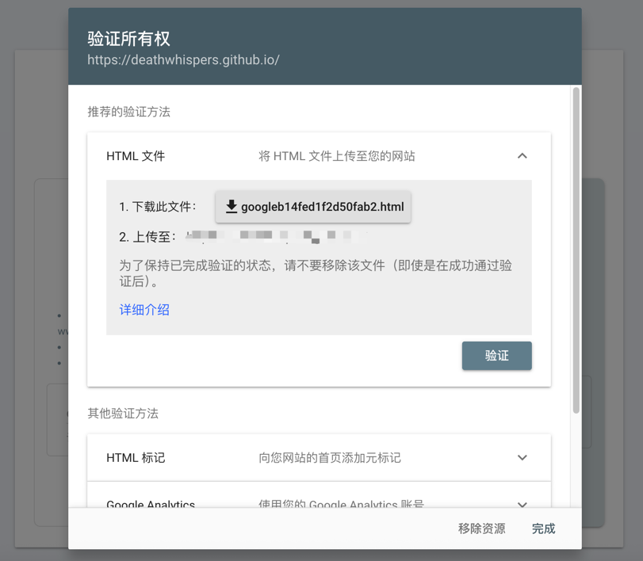

使用 Github Pages 来搭建博客是一种很不错的选择，但是如果仅仅搭建完毕是无法通过搜索引擎查询到的，
因为搜索引擎不会去检索你的Github仓库，遇到这个问题怎么办呢？本文教你在Github Pages上搭建的博客如何能被Google搜索到。
## 查看是否被收录
首先查看你的博客地址是否已经被Google收录，在Google的搜索栏中搜索：
```
site:http://xxxx.github.io
```
其中`http://xxxx.github.io为`你的博客地址，如果出现如下结果，则意味着没有被收录：

如果搜索出你想要的结果，那么不用继续往下看了。

## 搜索资源提交
进入Google Web Master Search Console:


我们可以选择网址前缀，并输入你的博客地址：

点击“继续”，网站会提示需要验证网站所有权

网站给我们提示了一个推荐验证方法：是通过在你的网站上添加一个它提供的HTML文件来验证，我们将这个 html 文件下载下来，并上传到 GitHub，通过浏览器能正常访问该文件就可以。点击“验证”提示已完成所有权验证

这个文件是不能被删除的，否则验证会失效，因此可以考虑增加多种验证方法来保证稳定性。


等待 Google处理完数据后，就可以在 Google 中搜索到自己博客中的内容了