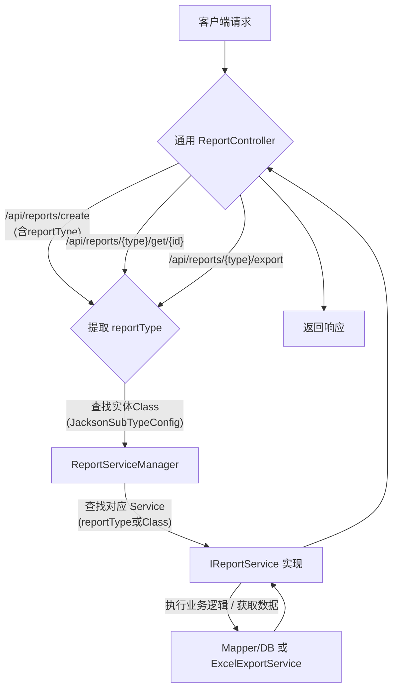

# Spring Boot 通用报表管理实践：从复杂到优雅的演进之路

> 在现代企业应用中，报表功能是不可或缺的。然而，随着业务的快速发展，报表类型不断增多（每日、月度、施工计划等），且未来需求难以预估。如果每种报表都独立开发一套 CURD (创建、读取、更新、删除) 及导出功能，不仅代码量庞大，维护成本也会迅速失控。

本文将详细阐述我们如何从零开始，在 Spring Boot 中设计并实现一个**通用、灵活且易于扩展**的报表管理方案，以及在这个过程中我们遇到的问题、踩过的坑，和最终选择的解决方案。

## 一、背景与挑战

我们的目标是：

1.  **统一操作接口：** 无论何种报表，都能通过一个通用的接口完成查询、修改、删除、导出工作。
2.  **简化新增报表：** 后期增加新的报表类型时，尽可能少地修改现有代码，最好是新增文件即可。
3.  **解决代码冗余：** 消除例如 Excel 导出等通用功能在各个业务模块中的重复代码。

## 二、整体方案思路：策略模式与工厂模式的融合

为了达成目标，我们采用了**策略模式**（Strategy Pattern）与 **工厂模式**（Factory Pattern）相结合，并充分利用 Spring Boot 的依赖注入特性。

**核心设计理念：**

* **统一契约 (`IReportService<T>`)：** 定义所有报表服务必须遵循的通用接口，其中 `T` 是该服务处理的特定报表实体类型。
* **策略实现：** 每种具体的报表（如 `ConstrPlanRecord`）都对应一个 `IReportService` 的实现类（如 `ConstrPlanRecordServiceImpl`），封装各自的业务逻辑。
* **服务注册与查找 (`ReportServiceManager`)：** 这是一个中央工厂，负责在应用启动时收集所有 `IReportService` 实现，并建立报表类型标识（`reportType`，即实体类名）与服务实例的映射。
* **通用入口 (`ReportController`)：** 作为唯一的 RESTful API 入口，接收客户端请求，并根据请求中的 `reportType` 或 DTO 内容，动态获取并调用正确的 `IReportService`。

### 方案流程概览



### 核心组件（演进后的最终形态）

* **`BaseReport` (抽象实体父类)：**
    * 作为所有报表实体的基类，包含 `id`、`reportType` 等通用字段（`reportType` 字段用于 Jackson 反序列化时的类型识别）。
    * 包含 `@JsonTypeInfo` 注解，`property = "reportType"`。
    * **不包含** `@JsonSubTypes` 或其他自定义 Jackson 注解。
    * **不包含** `getReportType()` 抽象方法。
* **具体报表实体类 (如 `ConstrPlanRecord`)：**
    * 继承 `BaseReport`。
    * 通过构造函数或初始化块设置 `reportType` 字段为自身简单类名（例如 `ConstrPlanRecord.class.getSimpleName()`）。
    * 可添加 `@Schema` (title/description/minimum) 和 Bean Validation 注解。
* **`IReportService<T extends BaseReport>` (通用报表服务接口)：**
    * 定义 CURD 方法和 `List<?> getExportData(ReportExportDto dto)`。
    * **不包含** `getReportType()` 方法，其 `reportType` 由 `ReportServiceManager` 通过泛型推断。
* **`ReportServiceManager` (报表服务工厂)：**
    * 在 `@PostConstruct` 中，通过 `GenericTypeResolver` 获取 `IReportService<T>` 的泛型 `T`，并用其 `getSimpleName()` 作为 `reportType` 字符串来注册服务。
    * 维护两个 `Map`：一个以 `String reportType` 为键，一个以 `Class<T>` 为键。
    * 提供 `getService(String reportType)` 和 `getService(Class<T> dtoClass)` 方法。
    * 提供 `getReportEntityClass(String reportType)` 从 `JacksonSubTypeConfig` 获取实体 `Class`。
* **`ReportExportDto` (通用导出参数 DTO)：**
    * **单一的具体类**，包含所有报表导出可能用到的通用参数（如 `reportType`, `fileName`, `startDate` 等）。
    * 无需多态。
* **`XxxExcelVo` (EasyExcel 导出数据对象)：**
    * 为每种报表类型专门定义的 POJO，包含 `@ExcelProperty` 注解，用于定义 Excel 列结构。
* **`ExcelExportService` (通用 Excel 导出工具)：**
    * 封装所有 EasyExcel 细节（设置响应头、写入流等）。
    * `doExport` 方法接收 `List<?> data` 和 `Class<?> headClass`，实现通用导出。
* **`JacksonSubTypeConfig` (Jackson 动态子类型配置)：**
    * 扫描指定包下的 `BaseReport` 子类。
    * 使用 `Class.getSimpleName()` 作为 `reportType` 动态注册子类型到全局 `ObjectMapper`。
    * 通过反射从实体类的 `@Schema` 注解中提取 `title` (作为报表名称)、`description` (作为报表描述) 和 `minimum` (作为排序值)。
    * 提供 `getAllReportTypeInfos()` 方法返回包含这些元数据信息的列表，并进行排序。
* **`ReportController` (通用 RESTful 接口)：**
    * `create` 和 `update` 方法接收 `@RequestBody BaseReport dto`，在 Controller 层通过 `dto.getReportType()` 获取类型，然后利用 `ObjectMapper.convertValue()` 将 `BaseReport` 转换为具体的子类实例，再传给 Service。
    * `getById`, `list`, `delete`, `export` 方法通过 `@PathVariable("reportType")` 获取类型字符串。
    * `getAllReportTypes` 方法调用 `JacksonSubTypeConfig` 获取并返回排序后的报表类型元数据。

## 三、踩坑与解决方案的演进

在实现过程中，我们遇到了几个典型的 Spring Boot 和 Java 泛型相关的问题，这些问题的解决推动了方案的不断优化。

### 1. 坑点一：泛型 `@RequestBody T dto` 带来的 `ClassCastException`

**问题现象：** 当 `Controller` 方法签名是 `public <T extends BaseReport> RespResult<?> create(@RequestBody T dto)` 时，即使 JSON 中有 `reportType` 字段，`dto` 在方法体中却总是 `BaseReport` 类型，而不是其真正的子类（如 `ConstrPlanRecord`），导致调用具体服务时抛出 `ClassCastException`。

**原因：** Java 泛型类型擦除在运行时丢失了 `T` 的具体信息。Jackson 在处理 `@RequestBody` 时，若无明确指示，会默认实例化泛型参数的上界（即 `BaseReport`）。

**解决方案的演进：**

* **初次尝试（被弃用）：** 在 `BaseReport` 上使用 `@JsonTypeInfo` 和 `@JsonSubTypes` 注解。

```java
@JsonTypeInfo(
        use = JsonTypeInfo.Id.NAME,
        include = JsonTypeInfo.As.PROPERTY,
        property = "reportType"
)
@JsonSubTypes({ // 列出所有可能的子类 - **这是我们想避免的！**
        @JsonSubTypes.Type(value = ConstrPlanRecord.class, name = "ConstrPlanRecord"),
        @JsonSubTypes.Type(value = DutyShiftHandover.class, name = "DutyShiftHandover"),
        // ... 每新增一种报表，这里就要加一行
})
public abstract class BaseReport implements Serializable { /* ... */ }
```

    * **优点：** Jackson 会自动处理多态反序列化。
    * **缺点：** 每新增一种报表类型，都必须手动修改 `BaseReport` 类，违背了开闭原则。
    * **抉择：** 复杂度高，维护性差，放弃。

* **第二次尝试（复杂但通用）：** 自定义 `HttpMessageConverter` 结合 `ThreadLocal`(`ReportTypeContext`)。

    * **思路：** 在 `@RequestBody` 绑定前，通过 `HandlerMethodArgumentResolver` 将 URL 中的 `reportType` 存入 `ThreadLocal`。`HttpMessageConverter` 在反序列化时从 `ThreadLocal` 读取 `reportType`，然后通过 `ReportServiceManager` 获取对应的实体类 `Class`，并指导 Jackson 进行精确反序列化。
    * **优点：** 实现了完全动态的多态反序列化，Controller 方法签名可以保留 `public RespResult<?> create(@PathVariable("reportType") String reportType, @RequestBody BaseReport dto)`， `dto` 进来就是正确类型。
    * **缺点：** 增加了 `ReportTypeContext`、`DynamicReportConverter`、`HandlerMethodArgumentResolver` 等多个配置类，系统复杂度感知较高。

* **最终选择（Controller 层显式转换）：** **移除 URL 中的 `reportType` 路径变量**， `Controller` 方法直接接收 `@RequestBody BaseReport dto`。在方法体内，根据 `dto.getReportType()`（从 JSON 提取的字符串），通过 `ReportServiceManager` 获取对应的实体类 `Class`，然后利用 `ObjectMapper.convertValue(dto, actualDtoClass)` 将 `BaseReport` 实例转换为正确的子类实例，再传递给服务。

    * **优点：** URL 简洁；避免了复杂的自定义 `HttpMessageConverter` 配置；类型转换逻辑集中在 Controller 层。
    * **缺点：** `Controller` 方法内部需要显式调用 `convertValue`；需要手动触发 Bean Validation (在 `convertValue` 之后)；客户端 JSON 必须包含 `reportType` 字段。
    * **抉择：** 尽管增加了 Controller 内部逻辑，但避免了 Spring 配置层面的复杂性，且 `convertValue` 操作是高效可靠的。这是在不牺牲核心通用性前提下，实现 URL 简洁和降低配置复杂度的合理权衡。

### 2. **核心改良：从静态 `JsonSubTypes` 到动态报表类型发现**

为了彻底解决“每新增一种报表就修改 `BaseReport`”的痛点，我们引入了动态报表类型发现机制。

**思考路径与面临的挑战：**

* **目标：** 应用启动时，自动找到 `BaseReport` 的所有子类，并将它们注册给 Jackson，这样 Jackson 就能根据 JSON 中的 `reportType` 字段，动态地将数据反序列化成正确的子类实例。
* **挑战：** Java 的反射机制允许一个类知道它的父类和实现的接口，但一个父类**无法直接获取它所有子类的列表**。JVM 采用按需加载机制，不会维护这样的运行时子类索引。因此，我们不能指望 `BaseReport.class` 能提供一个 `getSubClasses()` 方法。
* **破局：** 既然无法直接获取，那就只能**扫描**。但扫描整个类路径效率低下且不精确。

**解决方案的演进：约定优于配置的动态扫描**

1.  **确定扫描范围：** 我们约定所有报表实体类都放置在特定的包路径下（例如 `com.imp.entity`）。

2.  **动态扫描：**

    * 创建 `JacksonSubTypeConfig` 类，这是一个 Spring `@Configuration` 组件。
    * 在 `@PostConstruct` 初始化方法中，利用 Spring 提供的 `PathMatchingResourcePatternResolver` 和 `MetadataReaderFactory`（这是 Spring 用于组件扫描的底层工具），扫描指定包路径下所有 `.class` 文件。
    * 对于每个扫描到的类，检查它是否是 `BaseReport` 的子类（且不是抽象类或接口，也不是 `BaseReport` 本身）。

3.  **核心约定：`reportType` 就是实体类的简单类名。**

    * 这是最关键的简化。我们约定 JSON 中用于区分报表类型的 `reportType` 字段的值，**就是对应实体类的简单类名**（例如，`ConstrPlanRecord` 对应 `reportType: "ConstrPlanRecord"`）。
    * 这样，我们就无需在实体类中专门定义 `reportType` 字段（虽然为了反序列化后能获取 `reportType`，我们还是在 `BaseReport` 中保留了 `reportType` 字段），也无需 `IReportService` 提供 `getReportType()` 方法。

4.  **Jackson 动态注册：**

    * 对于每个符合条件的子类，创建一个 `SimpleModule`。
    * 使用 `module.registerSubtypes(new NamedType(subType, reportType))` 将子类及其对应的 `reportType` 字符串注册到模块中。
    * 将这个模块注册到 Spring 管理的全局 `ObjectMapper` 实例中 (`objectMapper.registerModule(module)`)。这确保了整个应用中的 JSON 处理都能识别这些动态注册的子类型。

5.  **智能的默认扫描路径：**
    为了进一步提升用户体验和降低配置门槛，我们优化了扫描路径的配置：

    * 通过 `@Value` 属性 `report.entity.scan-package` 允许用户自定义扫描路径。
    * **如果用户未配置或配置为空，系统将智能地默认扫描 `BaseReport.class` 所在的包及其子包。** 这覆盖了大多数项目的常见场景，实现了“零配置”的自动发现。

**解决的问题与带来的优势：**

* **彻底消除手动维护：** 每次新增 `BaseReport` 的子类，只要放在约定好的包下，无需修改任何现有代码，无需重新编译 `BaseReport`。
* **极度灵活：** 支持自定义扫描路径，适应不同项目结构。
* **极致简化：** `BaseReport` 不再背负子类列表的“包袱”，实体类本身也无需额外 `reportType` 字段（仅为 Jackson `property` 存在），`IReportService` 中的 `getReportType()` 方法也随之移除，使得 Service 层接口更加纯粹。
* **提升开发效率：** 开发者可以更专注于业务逻辑，而非框架配置。

### 3. 坑点三：Service 中 `getReportType()` 方法的冗余

**问题现象：** `IReportService` 接口中以及所有实现类中都包含 `String getReportType()` 方法，显得多余。

**原因：** `ReportServiceManager` 需要一个字符串 `reportType` 作为 Map 的键来注册服务。最初，我们让 Service 自己提供这个字符串。

**解决方案：**

* **移除 `IReportService` 接口及其所有实现类中的 `getReportType()` 方法。**
* **`ReportServiceManager` 在启动时，利用 `org.springframework.core.GenericTypeResolver` 反射获取 `IReportService<T>` 接口的泛型参数 `T` 的实际类型（`Class<T>`）。**
* 然后，直接使用这个 `Class<T>` 的 `getSimpleName()` 作为 `reportType` 字符串来注册服务。

**优点：** 进一步精简了 Service 层代码，强化了“报表类型就是实体类名”的统一约定。


### 4. 坑点四：Maven 依赖冲突与 `NoClassDefFoundError`

**问题现象：** 在引入 `easyexcel`、`poi-tl`、`apache-poi` 等库时，常常因传递性依赖导致 `org.apache.commons.io` 等库的版本冲突，表现为 `NoClassDefFoundError`。同时，`HttpServletResponse` 的 `getOutputStream()` 和 `getWriter()` 冲突引发 `IllegalStateException`。

**解决方案：Maven `dependencyManagement` 统一管理与异常处理规范**

* **`dependencyManagement`：** 在 `pom.xml` 中使用 `<dependencyManagement>` 标签，统一所有 Apache POI 相关模块（`poi`, `poi-ooxml` 等）、`easyexcel`、`poi-tl` 以及 `commons-io` 的版本。这样强制 Maven 选用指定的高版本，避免运行时类找不到的问题。
* **异常处理规范：** 在 `ReportController` 的 `export` 方法的 `catch` 块中，首先调用 `response.reset()` 清除所有已设置的头和数据，然后统一通过 `response.getOutputStream()` 写入错误信息（而非 `getWriter()`），确保即使在导出失败时也能正确返回错误响应。

### 5\. 坑点五：报表排序与元数据获取

**问题现象：** 需要控制 `getAllReportTypes` 返回的报表列表顺序，并获取报表名称、描述等元数据。

**解决方案：利用 `@Schema` 注解并动态扫描**

* **元数据提取：** `JacksonSubTypeConfig` 在扫描 `BaseReport` 子类时，通过 Java 反射读取类上的 `@Schema` 注解，提取 `title` 作为 `reportName`，`description` 作为 `reportDescription`。
* **排序实现：** 为了避免新增自定义注解文件，约定将 `@Schema` 注解的 `minimum` 属性（String 类型）解析为整数作为报表的排序值。
    * **优点：** 减少文件数量；复用现有注解。
    * **缺点：** `minimum` 字段的语义被非标准扩展，可能在 OpenAPI 文档中引起歧义。
    * **抉择：** 牺牲少量语义清晰度以换取文件简洁。
* **动态扫描路径：** `JacksonSubTypeConfig` 的扫描包路径可配置，但若未配置，则智能默认扫描 `BaseReport.class` 所在的包及其子包，进一步简化了配置。
* **响应 DTO：** 定义 `ReportTypeInfoDto` 封装 `reportType`, `reportName`, `reportDescription`, `order`，并由 `JacksonSubTypeConfig` 提供排序后的列表。

## 四、最终总结

通过这一系列的迭代和优化，我们成功构建了一个**高内聚、低耦合**的 Spring Boot 通用报表管理系统。它完美地满足了初始需求：

* **高度通用与扩展：** 新增报表只需创建实体、Service 和 Excel Vo，无需修改核心框架代码。
* **职责清晰：** 各个组件各司其职，代码简洁易懂。
* **强大的动态性：** 自动识别报表类型，支持多态反序列化。
* **健壮性：** 解决了复杂的依赖冲突和运行时类型问题。
* **易用性：** 提供了友好的 API 接口和可控的报表列表排序。

这个过程也深刻展示了在复杂系统设计中，如何在**通用性、扩展性、性能和开发体验**之间进行权衡和取舍，以及对框架底层原理深入理解的重要性。希望这篇博客能为您在类似的项目中提供启发和帮助。

