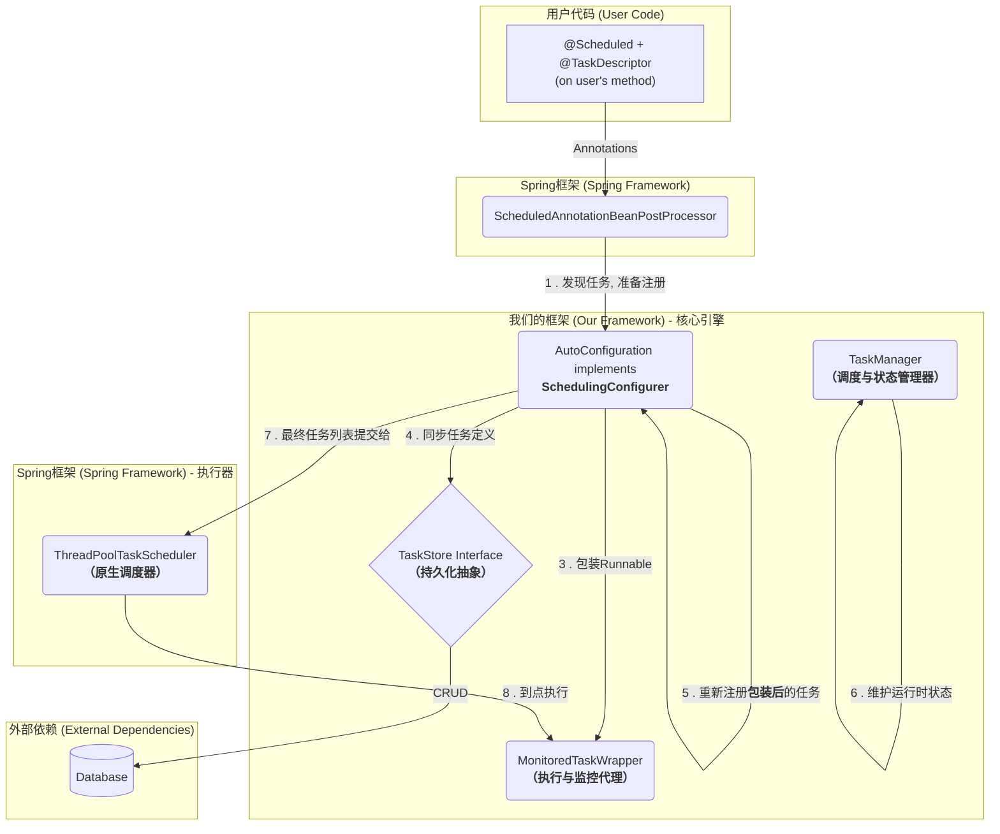

# Spring Boot定时任务再进化（二）：寻找优雅的“挂钩”——SchedulingConfigurer与全新架构

> **摘要**：在确立了“拥抱并增强”的设计哲学后，我们面临的核心技术挑战是如何在不侵入Spring原生调度流程的前提下，植入我们的管理逻辑。本文将详细介绍我们如何通过Spring官方提供的
`SchedulingConfigurer`接口作为“挂钩”，构建一个全新的、无缝集成的、可持久化的任务管理架构。

在上一部分，我们经历了一次关键的思想转变，确立了“拥抱并增强，而非替代”的核心设计哲学。现在，我们将深入技术腹地，揭晓如何将这一哲学转化为优雅、健壮的代码架构。

## 一、 寻找完美的“挂钩”（The Quest for the Perfect Hook）

我们的目标是在Spring `TaskScheduler`即将执行一个`@Scheduled`任务之前的那一刻介入，获取任务的元数据，用我们自己的监控逻辑包装它，并将其纳入管理体系。

我们曾探讨过一些方案，例如编写一个自定义的`BeanPostProcessor`去再次解析`@Scheduled`注解。但这种方法过于复杂，且容易与Spring自身的
`ScheduledAnnotationBeanPostProcessor`发生冲突，这违背了“不与框架对抗”的原则。

真正的突破口，来自于对Spring调度体系更深入的探索。我们发现了一个堪称完美的、由Spring官方“钦定”的扩展点——
`SchedulingConfigurer`接口。

### “Aha\!”时刻：`SchedulingConfigurer`接口

`SchedulingConfigurer`是Spring框架提供的一个公共回调接口，它的定义极其简单：

```java
public interface SchedulingConfigurer {
    void configureTasks(ScheduledTaskRegistrar taskRegistrar);
}
```

它的美妙之处在于其**调用时机**：
当Spring容器启动并完成了对所有`@Scheduled`注解的扫描之后，但在将这些任务提交给最终的`TaskScheduler`执行**之前**
，Spring会自动寻找容器中所有实现了`SchedulingConfigurer`接口的Bean，并调用它们的`configureTasks`方法。

而传递给这个方法的参数`ScheduledTaskRegistrar`，正是一个**包含了所有已被发现的、待调度任务的注册表！**

这正是我们梦寐以求的完美“挂钩”。它让我们能够在正确的时间点，访问到最原始、最完整的任务信息，从而进行我们的“偷天换日”操作。

## 二、 全新架构揭秘

有了`SchedulingConfigurer`这个支点，我们构建起了一套全新的、优雅的架构。

首先，为了给`@Scheduled`注解补充`id`和`description`这两个关键的管理字段，我们设计了一个极简的补充性注解`@TaskDescriptor`。

```java

@Target(ElementType.METHOD)
@Retention(RetentionPolicy.RUNTIME)
@Documented
public @interface TaskDescriptor {
    String id();

    String description() default "";
}
```

它的唯一使命就是“描述”任务，必须与`@Scheduled`并存使用。

基于此，我们的新架构如下图所示：



**这个架构的工作流程解读如下**：

1. **拦截**: 我们的`LightSchedulerAutoConfiguration`类实现`SchedulingConfigurer`接口。在其`configureTasks`
   方法中，我们拿到了包含所有原始任务的`taskRegistrar`。
2. **接管**: 我们先将`taskRegistrar`中的原始任务列表复制一份，然后**清空**`taskRegistrar`。这标志着我们完全接管了任务的注册权。
3. **解析与同步**: 我们遍历复制出来的原始任务列表。对于每一个任务，我们解析出它的`Runnable`和`Trigger`，并结合方法上的
   `@TaskDescriptor`注解，构建出一个标准的`TaskDefinition`数据对象。然后，我们通过`TaskStore`接口将这个定义同步到持久化介质（如数据库）中。
4. **包装**: 我们调用`TaskManager`，它会为这个任务创建一个`MonitoredTaskWrapper`，这个包装器封装了日志、计时、统计等所有监控逻辑。
5. **重新注册**: 最后，我们将这个**被包装过**的`Runnable`和原始的`Trigger`，重新注册回`taskRegistrar`中。
6. **执行**: 当所有`SchedulingConfigurer`都执行完毕后，Spring会将`taskRegistrar`中最终的任务列表（现在已经全部是我们的包装后版本）提交给
   `ThreadPoolTaskScheduler`去执行。

当调度时间到达，`TaskScheduler`执行的是我们的`MonitoredTaskWrapper`，从而让我们在不知不觉中，为所有`@Scheduled`任务注入了超能力。

## 三、 核心代码实现：`configureTasks`的艺术

下面这段代码，正是我们实现上述流程的核心，它位于`LightSchedulerAutoConfiguration`中，展示了如何优雅地分类处理和替换所有类型的
`@Scheduled`任务。

```java

@Override
public void configureTasks(ScheduledTaskRegistrar taskRegistrar) {
    if (this.taskManager == null) {
        return;
    }

    // --- 1. 处理 TriggerTask (包括 CronTask) ---
    List<TriggerTask> triggerTasks = new ArrayList<>(taskRegistrar.getTriggerTaskList());
    taskRegistrar.getTriggerTaskList().clear();
    for (TriggerTask task : triggerTasks) {
        Runnable originalRunnable = task.getRunnable();
        Trigger trigger = task.getTrigger();
        TaskDefinition definition = buildTaskDefinition(originalRunnable, trigger);
        Runnable wrappedRunnable = this.taskManager.registerAndSync(definition, originalRunnable);
        taskRegistrar.addTriggerTask(wrappedRunnable, trigger);
    }

    // --- 2. 处理 FixedRateTask (其类型为 IntervalTask) ---
    List<IntervalTask> fixedRateTasks = new ArrayList<>(taskRegistrar.getFixedRateTaskList());
    taskRegistrar.getFixedRateTaskList().clear();
    for (IntervalTask task : fixedRateTasks) {
        processIntervalTask(task, true, taskRegistrar);
    }

    // --- 3. 处理 FixedDelayTask (其类型也为 IntervalTask) ---
    List<IntervalTask> fixedDelayTasks = new ArrayList<>(taskRegistrar.getFixedDelayTaskList());
    taskRegistrar.getFixedDelayTaskList().clear();
    for (IntervalTask task : fixedDelayTasks) {
        processIntervalTask(task, false, taskRegistrar);
    }
}

/**
 * 统一处理IntervalTask（FixedRate和FixedDelay）的辅助方法
 */
private void processIntervalTask(IntervalTask task, boolean isFixedRate, ScheduledTaskRegistrar registrar) {
    Runnable originalRunnable = task.getRunnable();
    // 使用新的、返回Duration的API
    Duration interval = task.getIntervalDuration();
    Duration initialDelay = task.getInitialDelayDuration();

    PeriodicTrigger trigger = new PeriodicTrigger(interval);
    trigger.setFixedRate(isFixedRate);
    trigger.setInitialDelayDuration(initialDelay);

    TaskDefinition definition = buildTaskDefinition(originalRunnable, trigger);
    Runnable wrappedRunnable = this.taskManager.registerAndSync(definition, originalRunnable);

    // 使用新的、接收Task对象的API重新注册
    if (isFixedRate) {
        registrar.addFixedRateTask(new FixedRateTask(wrappedRunnable, interval, initialDelay));
    } else {
        registrar.addFixedDelayTask(new FixedDelayTask(wrappedRunnable, interval, initialDelay));
    }
}
```

通过这种方式，我们以一种极其微创和优雅的方式，完成了对Spring调度体系的全面增强。

至此，我们的框架已经有了坚固的骨架和强大的心脏。但是，它的“记忆”还是短暂的——所有状态都还在内存中。如何赋予它跨越重启的“长期记忆”？

**在下一篇文章中，我们将深入探讨持久化层的设计，看`TaskStore`接口如何将我们的框架与JPA、MyBatis等任意持久化技术解耦，实现真正的生产级可靠性**

