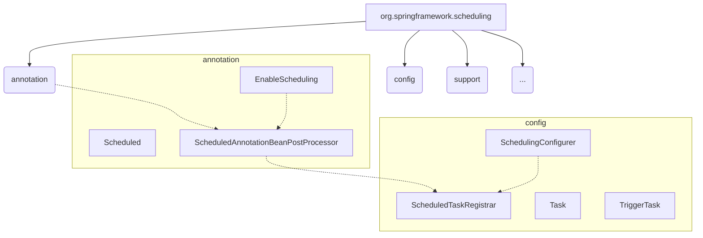
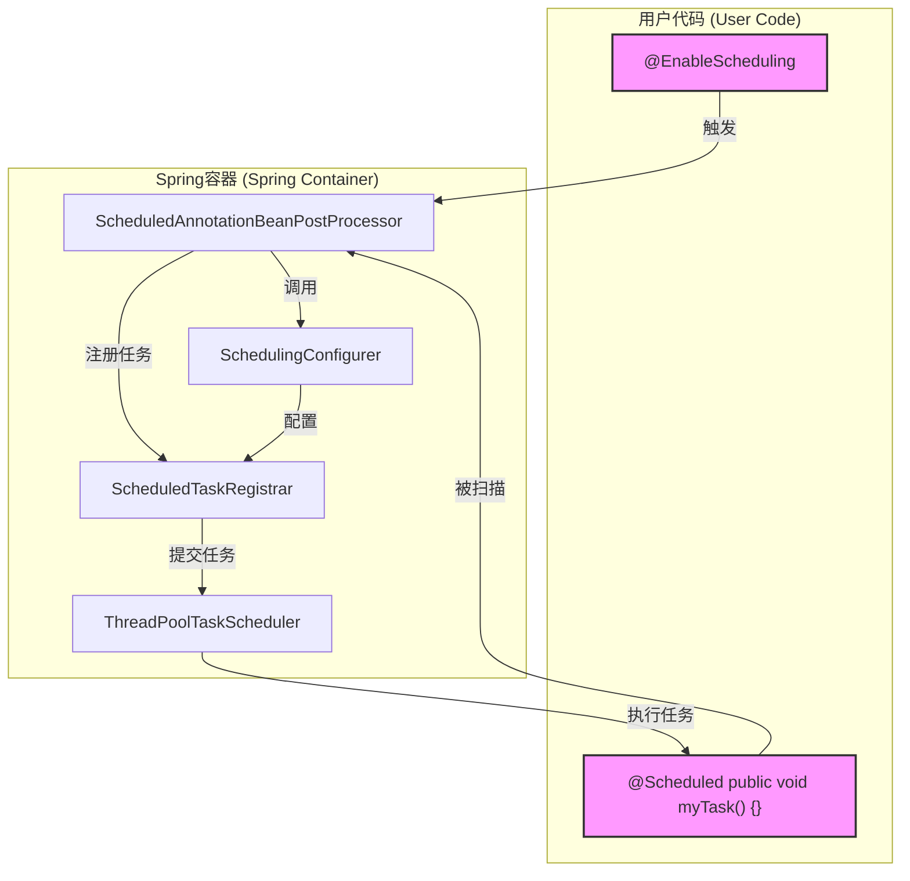
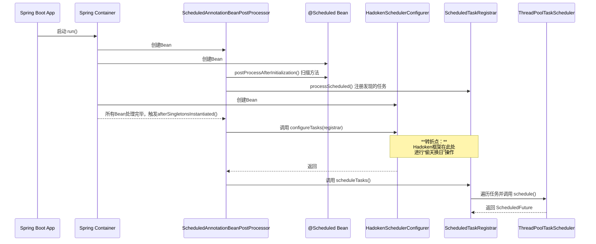
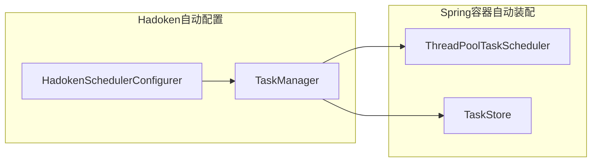

## 引言

> 做开发这行，好多时候看着是“死路”，其实藏着通往新方案的“后门”。上一章咱设计的`TaskManager`因为循环依赖卡了壳，这也让咱明白：想从外面硬拧成熟框架的流程，根本行不通。真正的办法，是摸透框架的生命周期，跟着它的节奏来。好在Spring的开发者早给咱留了“钥匙”——`SchedulingConfigurer`接口。

> 这一章，咱先**把Spring调度的核心流程拆解开**，看看里面的“齿轮”是咋转的；然后聚焦这把“万能钥匙”，跟大家唠唠我是咋用它“釜底抽薪”，最后搞出一个没依赖冲突、流程清晰还抗造的全新架构的。


# 第一部分：拆解Spring调度的“心脏”

想改框架，得先当“外科医生”，把要“开刀”的对象（Spring Scheduling）摸透。

## 1. 代码的组织结构

Spring把调度相关的核心代码，主要放在`spring-context`模块的`org.springframework.scheduling`包下，结构特清晰，每个部分各司其职。



* **`annotation`包**: 这是任务的“发现层”。`@EnableScheduling`是开调度功能的总开关；`@Scheduled`是咱标定时任务的核心注解；而`ScheduledAnnotationBeanPostProcessor`是幕后的“侦察兵”，Spring初始化Bean的时候，它负责找出所有带`@Scheduled`的方法。
* **`config`包**: 这是任务的“配置和注册层”。`ScheduledTaskRegistrar`像个“登记处”，所有发现的任务先在这儿汇总。`SchedulingConfigurer`就是咱要用到的关键“钩子”，能让咱在任务正式调度前，最后插手改一改。

## 2. 核心组件拆解

Spring调度体系靠几个关键角色配合工作，跟一条精密的流水线似的。



* **`@EnableScheduling` (起点)**: 这个注解一加，所有调度功能才会启动。
* **`ScheduledAnnotationBeanPostProcessor` (侦察兵)**: Spring容器初始化Bean的时候，它会检查每个Bean的每个方法，找带`@Scheduled`的。找到之后，就把方法和注解里的调度信息（cron、fixedRate这些）打包成任务对象。
* **`ScheduledTaskRegistrar` (登记处)**: “侦察兵”发现的任务，都会先临时存在这儿，像个待办清单，等着后续处理。
* **`SchedulingConfigurer` (总顾问)**: 这是咱介入的关键。“侦察兵”扫完任务后，Spring会把“登记处”（`ScheduledTaskRegistrar`）交给“总顾问”，让它做最后的审核和修改。
* **`ThreadPoolTaskScheduler` (执行官)**: 这是真正干活的线程池。所有配置弄完后，“登记处”里的任务会一个个交给它，等着到点执行。

## 3. 整体工作流程：时序图

现在用一张时序图，把所有组件的交互串起来，让大家看明白从应用启动到任务调度的完整调用链。



把这些拆解开后，咱对Spring调度的内部逻辑就门儿清了。找到了它的“关节”和“命脉”，后面的“外科手术”就有底气了。


# 第二部分：“偷天换日”的实现

摸透了原生流程，咱的改造方案就顺理成章了。

## 新架构的核心思想：“釜底抽薪，偷天换日”

* **釜底抽薪**：把Spring给咱准备好的“柴火”（原生调度任务）全拿走，让它的“锅”（原生调度流程）烧不起来。
* **偷天换日**：换成咱自己的“新能源”（用`MonitoredTaskWrapper`包装好的、能被`TaskManager`管理的新任务），在咱自己的“锅”里，按咱的规矩来“做饭”。

下面的流程图，能清楚对比原生流程和咱新架构流程的区别：

```mermaid
graph TD
subgraph "原生Spring调度流程"
A[扫描@Scheduled] --> B[注册到Registrar];
B --> C[直接提交给TaskScheduler];
end

subgraph "Hadoken Scheduler新流程"
direction LR
SA[扫描@Scheduled] --> SB[注册到Registrar];
SB -- " 1. 拦截所有任务 " --> SC[HadokenSchedulerConfigurer];
SC -- " 2. 清空Registrar " --> SB;
SC -- " 3. 移交任务 " --> SD[TaskManager];
SD -- "4. 包装并调度 " --> SE[TaskScheduler];
end

style SC fill: #bbf, stroke: #333, stroke-width: 2px
style SD fill: #bbf, stroke: #333, stroke-width: 2px
```

上图右边的Hadoken流程里，`HadokenSchedulerConfigurer`和`TaskManager`成了新的调度核心，从任务注册到最后调度的所有环节，全由它们接管。

## 代码深度解析：`HadokenSchedulerConfigurer`的“三板斧”

咱的核心改造逻辑，全在`HadokenSchedulerConfigurer`的`configureTasks`方法里。它主要干三件事：

1. **第一板斧：拦截并复制所有任务**
   咱没直接改`taskRegistrar`的列表，而是先把所有任务存到自己的`allTasks`列表里，为后面处理做准备。

2. **第二板斧：清空原生注册器（釜底抽薪）**
   这步最关键。咱用反射，**强行清空**`taskRegistrar`内部的所有任务列表。做完这步，Spring的原生调度路径就彻底断了。

3. **第三板斧：解析、包装并移交（偷天换日）**
   咱遍历自己的`allTasks`列表，把每个任务解析成自定义的`TaskDefinition`模型，再连带着原始的`Runnable`和`Trigger`，全交给`TaskManager`统一处理。

## 再见，循环依赖！

用这套新流程，咱彻底解决了循环依赖的问题。依赖关系变成了一条清晰的单向链。



就像上图里那样，`HadokenSchedulerConfigurer`依赖`TaskManager`，`TaskManager`依赖`ThreadPoolTaskScheduler`和`TaskStore`。Spring容器能顺着这个顺序，顺顺利利完成Bean的初始化，再也不卡壳了。

## 结语：架构的“支点”

阿基米德说过：“给我一个支点，我能撬动地球。” 这次架构重构里，`SchedulingConfigurer`就是那个关键的“支点”。摸透了Spring调度的内部逻辑后，咱找到这个完美的切入点，用近乎“外科手术”的方式，优雅地换掉了它的核心调度逻辑，把咱自己的“灵魂”嵌了进去。

这次成功的“推倒重来”，不只是解决了一个技术难题，更让咱在架构思路上升了级。它证明了**“融入而非对抗”** 这个设计原则，在扩展框架时有多重要。

现在，咱的调度框架已经有了结实的“骨架”和灵活的“神经系统”，但还缺“记忆”——一个能跨应用重启、能持久化的记忆。下一章，咱就给它设计并装上“大脑”——一个解耦的、能插拔的持久化层。


