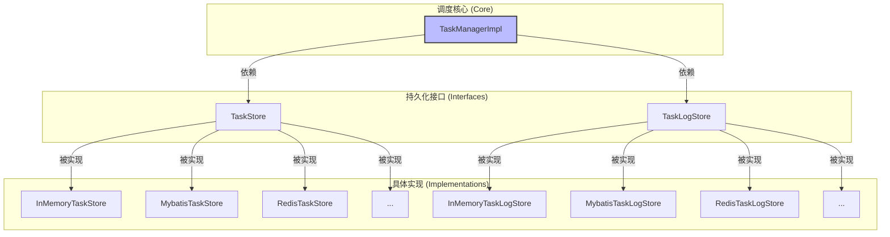
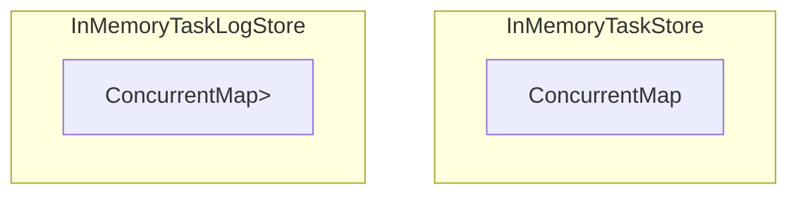
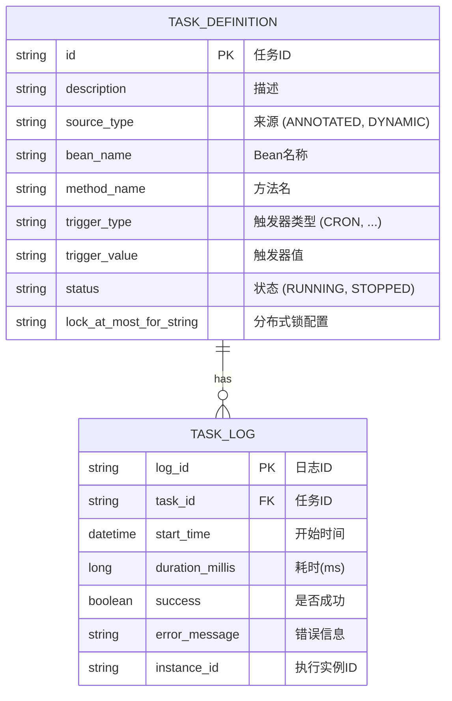
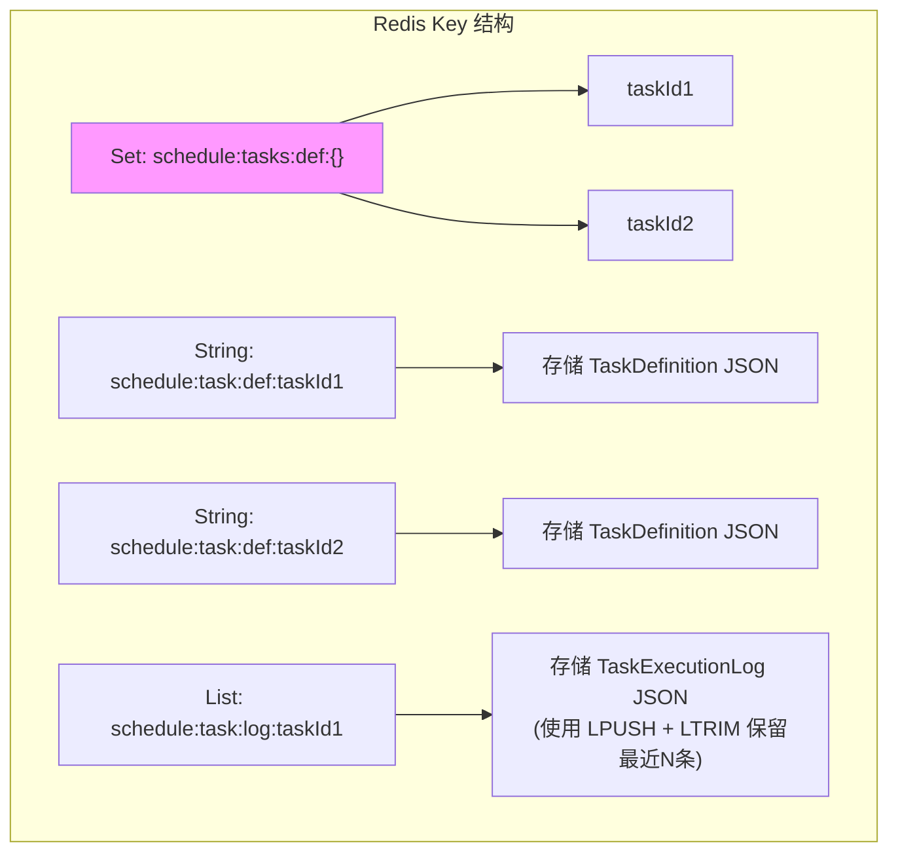
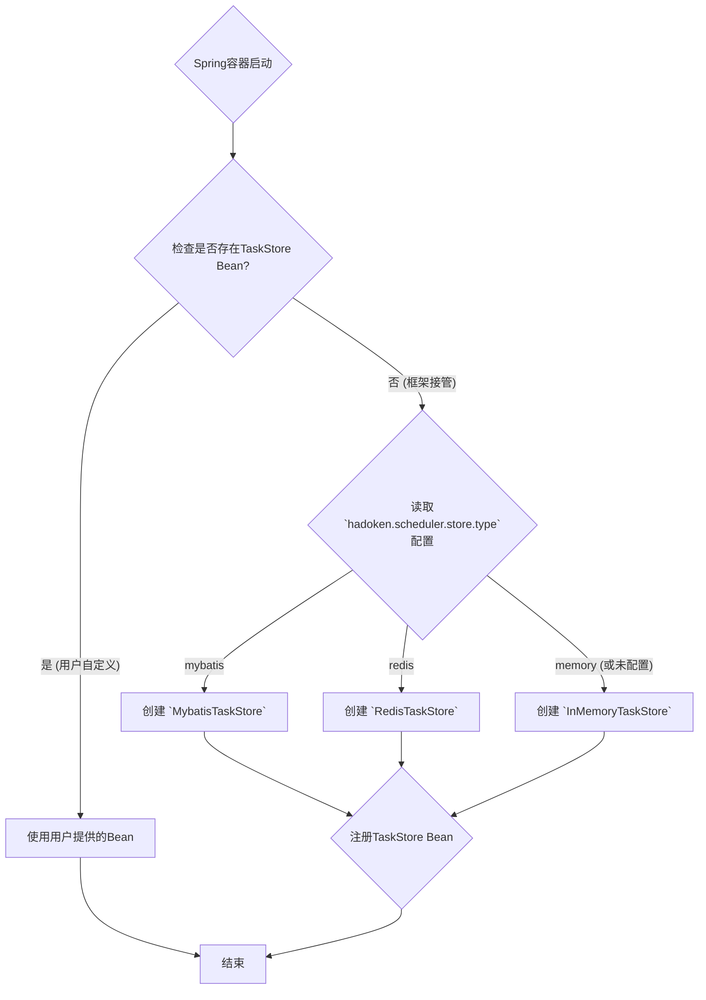

# Spring Boot 定时任务再进化（第四章）：给框架装“长期记忆”——可插拔的持久化层设计

## 引言

> 只存在内存里的系统，就算内部逻辑再牛，本质上也是“玻璃心”——就像把城堡建在沙滩上，服务重启一下、意外宕机一次，之前的状态和配置全没了。上一章咱搭的调度核心虽然厉害，但还是“记不住事儿”：手动停了个任务，服务一重启，这任务又自己跑起来了；用API动态建的任务，重启后直接“凭空消失”。想让调度框架真能在企业级场景里扛事儿，必须给它装“长期记忆”。

> 这一章，咱就深扒`hadoken-scheduler`的持久化层设计——靠**接口隔离**和**自动配置**搞出来的、完全解耦的“可插拔存储系统”，想用啥存储就换啥。

# 第一部分：设计的底子——先定规矩（接口），再找执行者（实现）

设计持久化层时，我最看重的就是软件设计里的老规矩：**“面向接口编程”**
。咱不能假定用户都用同一种存储技术——有的团队爱用MySQL，有的偏PostgreSQL，还有的整个技术栈都靠Redis。要是把框架和某一种具体存储（比如Mybatis、JPA）绑死，那也太短视了。

所以我把“记东西”的活儿，拆成了两个核心接口：

1. **`TaskStore`**: 任务定义的“**档案馆**”。负责把任务的“身份信息”（`TaskDefinition`）存起来，还要支持增删改查。
2. **`TaskLogStore`**: 任务执行的“**航行日志**”。记录任务每次执行的情况（`TaskExecutionLog`），还得能查历史记录。

`TaskManager`作为调度核心，才不管数据是存在文件里、数据库里还是Redis里——它只认这两个接口，按接口定义的规矩办事。

这种设计最大的好处就是**灵活**：框架自带了三种常用实现，要是用户想用别的，自己写个`TaskStore`
接口实现（比如用MongoDB、Elasticsearch），再注册成Bean，就能直接替换默认的，一点不费劲。

# 第二部分：自带的三套“记忆方案”

为了让用户“开箱就能用”，我给`TaskStore`和`TaskLogStore`各配了三套实现，覆盖大多数场景。

## 1. 内存实现 (In-Memory)

这是框架默认的存储方式，主打“零配置、快启动”，特别适合本地开发、搭原型或者写单元测试。

* **`InMemoryTaskStore`**: 内部用`ConcurrentHashMap`存`TaskDefinition`，增删改查都是直接操作这个Map。
* **`InMemoryTaskLogStore`**: 用`ConcurrentMap<String, Queue<TaskExecutionLog>>`
  存日志——每个任务ID对应一个队列，为了不占满内存，队列最多存100条记录（可配置）。

**优点**: 不用依赖其他服务、不用配任何东西、速度贼快。
**缺点**: 服务一重启，所有数据全没了，只能临时用用。

## 2. Mybatis实现

这套是给用关系型数据库（MySQL、PostgreSQL这些）的项目准备的，**生产环境首选**。

* **`MybatisTaskStore`**: 靠Mybatis的`TaskDefinitionMapper`接口干活。先把框架里的`TaskDefinition`转成数据库能存的
  `TaskDefinitionEntity`，再通过Mapper操作数据库。
* **`MybatisTaskLogStore`**: 逻辑差不多，靠`TaskLogMapper`和`TaskLogEntity`存日志、查日志。

**优点**: 数据存在数据库里，安全可靠，还支持事务，生产环境用着放心。
**缺点**: 得额外配数据库连接，还得建表，稍微麻烦点。

## 3. Redis实现

要是项目里已经重度用Redis了，用它存任务数据也特别合适，性能还高。

* **`RedisTaskStore`**: 存储思路很巧：
    * 用一个**Set**（key是`schedule:tasks:def:`）存所有任务ID，这样查“所有任务”的时候特别快。
    * 每个任务的`TaskDefinition`转成JSON字符串，存在独立的**String类型key**里（key是`schedule:task:def:{taskId}`）。
* **`RedisTaskLogStore`**: 把Redis的List结构用得明明白白：
    * 每个任务的日志对应一个List（key是`schedule:task:log:{taskId}`）。
    * 新日志用`LPUSH`塞到列表最前面，接着用`LTRIM`剪一下，只留最新的100条（可配置）——既保证日志新，又不浪费内存。

**优点**: 读写速度快，实现逻辑简单，不用额外建表。
**缺点**: 得保证Redis服务不挂；跟数据库比，查复杂数据的能力弱一点。

# 第三部分：自动配置的“黑魔法”

有了这么多实现，怎么让用户不用写一堆`if/else`，改个配置就能切换存储？答案就是Spring Boot的**自动配置**和**条件注解**。

在`HadokenSchedulerAutoConfiguration`里，创建`taskStore` Bean的逻辑是这样的：

这里的关键是`@ConditionalOnMissingBean(TaskStore.class)`这个注解，逻辑特简单：

1. **用户最大**: Spring创建框架的`taskStore`之前，先看看用户有没有自己定义`TaskStore`类型的Bean。要是有，框架的自动配置就“让路”，全听用户的。
2. **按配置来**: 要是用户没定义，框架就读`application.yml`里的`hadoken.scheduler.store.type`配置。
3. **自动切换**: 根据配置值是`mybatis`、`redis`还是`memory`（没配置默认是`memory`），创建对应的`TaskStore`实现，再注册到容器里。
   `TaskLogStore`的逻辑跟这个一模一样。

这么一来，用户想换存储，只需要在配置文件里改一个词，比如把`type: memory`改成`type: mybatis`，不用改一行代码，特方便。

## 结语：可插拔才是框架的“生命力”

好的框架不该强迫用户用啥技术，而该像乐高一样——给标准接口（零件接口），让用户自由拼搭（选存储实现）。这一章讲的持久化层，就是靠*
*接口抽象**、**多实现**、**自动配置**这三招，给`hadoken-scheduler`装了个“能换记忆芯片”的存储系统，既好用又灵活。

到这儿，咱的框架已经能在生产环境稳定跑了。但现代调度框架光稳定还不够，还得能“看见”（监控）、能“操作”（管理）。下一章，咱就给它装“眼睛”和“手臂”——聊聊任务监控、日志和运行时统计是咋设计的。

