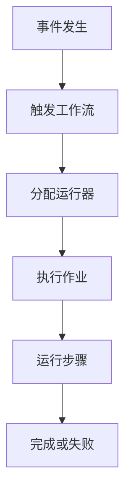
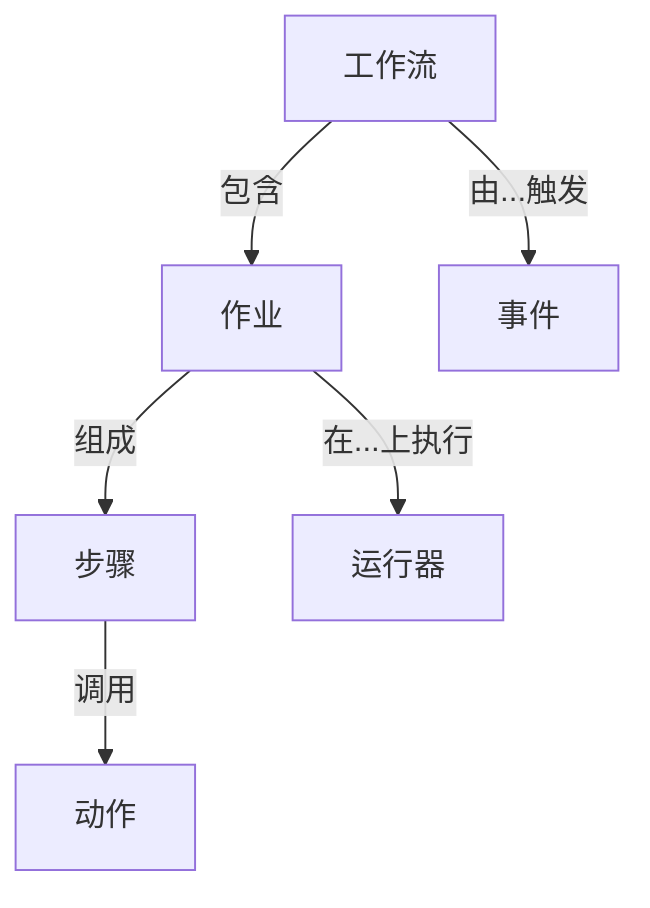
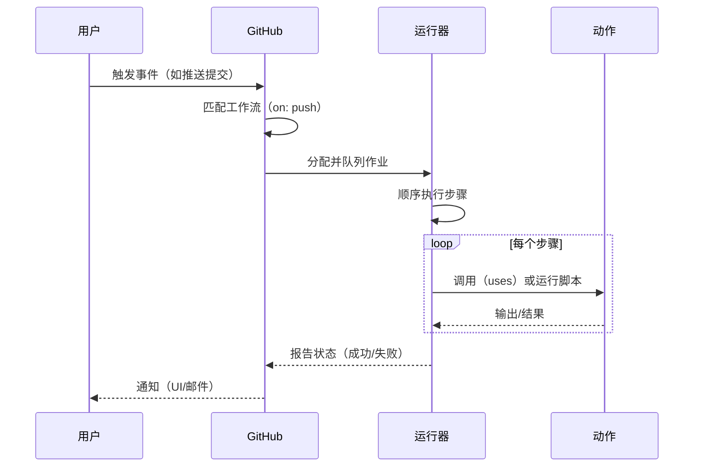
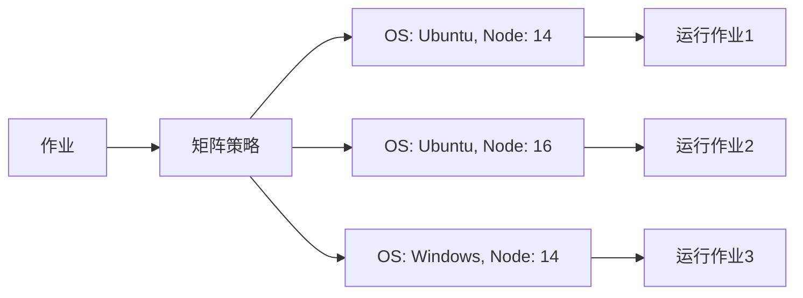
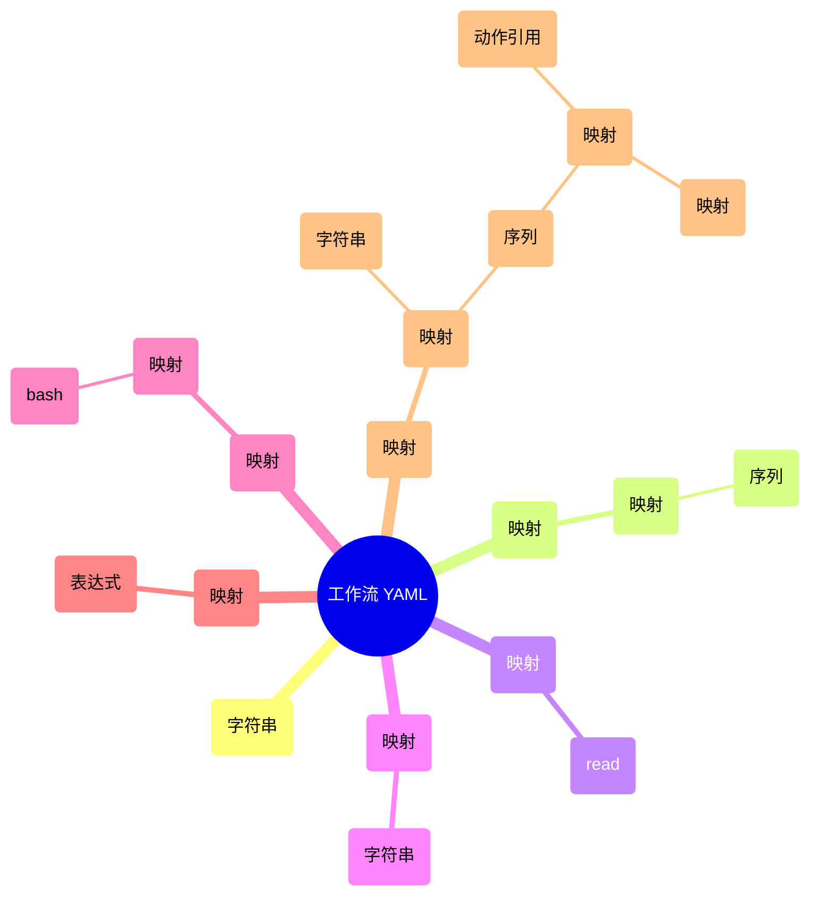
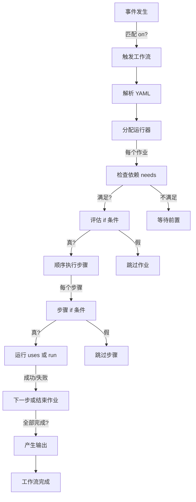

GitHub Actions 是一个集成在 GitHub 仓库中的 CI/CD 和自动化平台，它允许您通过事件触发自动化工作流，用于构建、测试、部署代码或其他任务，如标签问题或发送通知。 它基于 YAML 文件定义工作流，这些文件易读且灵活，支持并行执行和依赖管理。 总体上，它的工作原理可靠，但复杂配置可能需要注意权限和并发问题，以避免意外行为。

**关键点：**

- **工作原理**：事件（如代码推送）触发 YAML 定义的工作流，分配运行器执行作业和步骤；作业默认并行运行，但可通过依赖顺序化。 研究表明，它在大多数情况下高效，但大型仓库可能面临扩展挑战。

- **使用方法**：在仓库的 `.github/workflows/` 目录创建 YAML 文件，定义触发器、作业和步骤；从 GitHub Marketplace 复用动作或自定义。 它适合初学者，但高级用法如矩阵策略需要实践。

- **YAML 详细介绍**：YAML 是一种人类可读的序列化格式，使用缩进来定义结构，支持标量、序列、映射等数据类型；在 GitHub Actions 中用于工作流配置。 它直观但需注意缩进一致性，以防解析错误。

- **完整流程**：从事件检测到工作流完成，包括触发匹配、运行器分配、作业执行和日志记录；支持并发控制和权限管理。 证据显示，这个流程支持多样自动化，但矩阵等复杂性可能引入变异性。

- **Mermaid 图**：使用 Mermaid 可以可视化层次结构、流程和依赖，帮助理解复杂工作流。

**概述和工作原理**
GitHub Actions 的核心是工作流（workflow），这是一个 YAML 定义的自动化过程，由事件（如 push 或 pull_request）触发。 它包括作业（jobs）、步骤（steps）和动作（actions），运行在 GitHub 托管或自托管的运行器（runners）上。 原理是：事件发生时，GitHub 匹配工作流文件，分配运行器执行作业；步骤顺序运行，可共享数据。 例如，一个简单 CI 工作流可能在代码推送时构建和测试。

**使用方法**
开始时，在仓库创建 `.github/workflows/ci.yml`，定义 on（触发器）、jobs 和 steps。 使用 Marketplace 的动作如 actions/checkout@v4 来简化。 自定义动作有 Docker、JavaScript 或复合类型。 监控在仓库的 Actions 标签页。

**YAML 介绍**
YAML 使用空格缩进（无制表符）定义结构，支持标量（值）、序列（列表）和映射（键值对）。 在工作流中，顶级键如 on 是映射，steps 是序列。 表达式如 ${{ github.event }} 允许动态值。

**完整流程**
事件触发后，解析 YAML，分配运行器，执行作业和步骤；失败时可继续或停止。 支持矩阵并行变体。

以下是一个简单 Mermaid 流程图展示整体过程：



GitHub Actions 是一个强大的 CI/CD 和自动化平台，集成在 GitHub 仓库中，允许开发者通过 YAML 文件定义工作流来自动化软件开发过程，如构建、测试、部署，以及非 DevOps 任务如问题标签或通知。 它的工作原理基于事件驱动模型：仓库事件触发 YAML 定义的工作流，在运行器上执行作业和步骤，支持并行和依赖管理。 使用方法包括创建工作流文件、复用动作，并监控执行。 YAML 是其核心配置语言，提供人类可读的结构化方式，支持标量、序列、映射等数据类型。 完整流程从事件检测到工作流完成，涉及触发匹配、运行器分配、作业执行和结果处理。 本文将从整体到细节深入解析，并使用 Mermaid 图可视化关键概念。

### GitHub Actions 的核心概念和组件

GitHub Actions 的架构围绕几个相互关联的组件构建，这些组件确保自动化流程的模块化：

- **工作流（Workflows）**：顶级单元，由 YAML 文件定义，位于仓库的 `.github/workflows/` 目录。 一个仓库可有多个工作流，每个处理不同任务，如 CI/CD 或定时备份。工作流可引用其他工作流以实现复用。

- **事件（Events）**：仓库中的特定活动，如 push（代码推送）、pull_request（拉取请求）或 schedule（定时）。事件可通过分支、路径或标签过滤。

- **作业（Jobs）**：工作流中的步骤集合，在单一运行器上执行。作业默认并行，但可使用 needs 定义依赖。 支持矩阵策略以并行运行变体，如不同 OS 版本。

- **步骤（Steps）**：作业内的原子任务，按顺序执行。可运行 shell 脚本（run 键）或调用动作（uses 键）。步骤共享运行器环境，支持数据传递。

- **动作（Actions）**：可复用任务，如检出代码或上传制品。从 GitHub Marketplace 获取或自定义。 自定义动作类型包括 Docker 容器、JavaScript 或复合动作。

- **运行器（Runners）**：执行环境的服务器。GitHub 提供托管运行器（如 ubuntu-latest），或自托管以自定义。

以下表格总结这些组件及其角色：

| 组件 | 描述 | 关键交互 | 示例用法 |
| --- | --- | --- | --- |
| 工作流 | YAML 文件定义的过程 | 由事件触发；包含作业 | `.github/workflows/ci.yml` 用于构建/测试 |
| 事件 | 仓库活动或定时 | 启动工作流 | `on: push` 用于代码提交 |
| 作业 | 步骤组，在一个运行器上 | 通过 needs 依赖其他作业；默认并行 | `jobs: build: runs-on: ubuntu-latest` |
| 步骤 | 作业中的单个任务 | 执行动作或脚本；使用上下文 | `- uses: actions/checkout@v4` |
| 动作 | 可复用任务/代码 | 在步骤中调用；可自定义 | 自定义 Docker 动作用于部署 |
| 运行器 | 执行服务器 | 托管作业；GitHub 托管或自托管 | `ubuntu-latest` 用于 Linux 运行 |

此结构确保模块化：动作组成步骤，步骤组成作业，作业组成工作流。

可视化层次结构的 Mermaid 图：



### 工作原理：GitHub Actions 的执行机制

当仓库中发生事件时，GitHub 扫描 `.github/workflows/` 中的 YAML 文件。如果 on 键匹配（包括分支/路径过滤），则队列工作流。 分配运行器（GitHub 托管为新 VM，自托管为自定义服务器）。作业执行：默认并行，除非 needs 指定依赖。 每个作业的步骤顺序运行，支持上下文（如 ${{ github.event }}）、表达式（如 ${{ github.ref == 'refs/heads/main' }}）和变量（如 ${{ vars.MY_VAR }}）。

关键特性：

- **上下文**：预定义数据对象，如 github（事件细节）、env（变量）、secrets（加密值）、steps（前步骤输出）。

- **表达式**：${{ <expression> }} 用于动态值，支持运算符、函数（如 contains()、format()）和状态检查（如 success()、failure()）。

- **变量**：仓库、组织或环境级自定义，通过 vars 上下文引用；不同于 env，不继承但可在表达式中使用。

失败处理：步骤失败停止作业，除非 continue-on-error: true；作业失败可传播或用条件如 if: always() 忽略。

典型执行的 Mermaid 序列图：



并发使用 concurrency 键分组运行（如按分支），可取消进行中的运行。

### 使用方法：设置和自定义

使用 GitHub Actions 的步骤：

1. 创建或导航仓库。

1. 在 `.github/workflows/` 添加 YAML 文件（如 ci.yml）。

1. 定义结构：name、on、jobs 等。

1. 提交推送；监控在 Actions 标签页。

1. 从 Marketplace 自定义动作（[https://github.com/marketplace?type=actions）或构建自己的。](https://github.com/marketplace?type=actions%EF%BC%89%E6%88%96%E6%9E%84%E5%BB%BA%E8%87%AA%E5%B7%B1%E7%9A%84%E3%80%82)

自定义动作类型：

- **Docker 容器**：打包代码和环境；仅 Linux；需 Dockerfile 和 action.yml。

- **JavaScript**：直接在运行器运行；更快；使用 Node.js 和工具包。

- **复合**：捆绑多个步骤；平台无关；用于分组命令。

所有自定义动作需 action.yml 元数据文件，指定 inputs、outputs 和 runs（如 uses: docker 用于容器）。

简单 CI 工作流 YAML 示例：

```yaml
name: CI 构建
on:
  push:
    branches: [ main ]
  pull_request:
    branches: [ main ]
jobs:
  build:
    runs-on: ubuntu-latest
    steps:
      - uses: actions/checkout@v4
      - name: 安装依赖
        run: npm install
      - name: 运行测试
        run: npm test

```

高级用法如矩阵：

```yaml
jobs:
  test:
    runs-on: ${{ matrix.os }}
    strategy:
      matrix:
        os: [ubuntu-latest, windows-latest]
        node: [14, 16]
    steps:
      - uses: actions/setup-node@v4
        with:
          node-version: ${{ matrix.node }}

```

常见工作流模式的表格：

| 模式 | 用例 | YAML 示例片段 |
| --- | --- | --- |
| CI/CD 管道 | 推送时构建/测试/部署 | `on: push` 带有构建、测试、部署作业 |
| 定时任务 | 夜间备份 | `on: { schedule: [{ cron: '0 0 * * *' }] }` |
| 可复用工作流 | 跨仓库调用 | `on: workflow_call` 带有输入/输出 |
| 矩阵测试 | 多 OS/语言 | `strategy: matrix: { os: [...], version: [...] }` |
| 条件步骤 | 基于条件跳过 | `if: ${{ github.event_name == 'push' }}` |

矩阵策略的 Mermaid 图：



### YAML 的详细介绍

YAML（YAML Ain't Markup Language）是一种数据序列化格式，优化用于人类可读性和配置文件，使用空格缩进（无制表符）定义结构，而非括号或大括号。 它支持块风格（缩进，详细）和流风格（JSON-like，使用 {} 和 []）两种。YAML 流可包含多个文档，由 --- 分隔，但 GitHub Actions 工作流通常为单个文档。

关键特性：

- **缩进和注释**：通过空格结构；# 用于注释。

- **数据类型**：标量（字符串、数字、布尔、空值）、序列（有序列表，使用 - 或 []）、映射（键值对，使用 : 或 {}）。

- **标量风格**：纯（无引号）、单引号（转义通过 ''）、双引号（转义如 \n）、块字面量（|）保留换行、折叠（>）转换为空格。

- **锚点和别名**：&anchor 标记，*anchor 引用，用于复用（如共享作业配置）。

- **指令**：%YAML 1.2 用于版本；标签如 !!str 用于显式类型。

- **折叠和 Chomping**：控制多行处理（如 |- 剥离尾换行）。

在 GitHub Actions 中，YAML 结构工作流：顶级键如 on 为映射，steps 为序列。隐式类型解析：123 为整数，true 为布尔。

展示类型和风格的示例：

```yaml
# 映射与序列
on:
  push:  # 映射键（字符串）
    branches: [main, develop]  # 字符串序列
env:
  DEBUG: true  # 布尔
  TIMEOUT: 10.5  # 浮点
  NULL_EXAMPLE: null  # 空值
steps:  # 序列
  - name: 多行脚本
    run: |  # 字面量块标量
      echo "Line 1"
      echo "Line 2"
  - name: 折叠文本
    run: >  # 折叠块
      This is a long line that
      folds into one.
common: &setup  # 锚点
  runs-on: ubuntu-latest
job1:
  <<: *setup  # 别名合并

```

常见陷阱：不一致缩进导致解析错误；特殊字符的无引号字符串需引号。

YAML 数据类型的表格：

| 类型 | 描述 | 块示例 | 流示例 |
| --- | --- | --- | --- |
| 标量（字符串） | 原子值 | `key: value` 或 `key: "escaped\\nvalue"` | `{key: value}` |
| 标量（数字/布尔/空值） | 隐式解析 | `int: 123`<br>`bool: true`<br>`null: ~` | `{int: 123}` |
| 序列 | 有序列表 | `- item1`<br>`- item2` | `[item1, item2]` |
| 映射 | 键值对 | `key1: value1`<br>`key2: value2` | `{key1: value1, key2: value2}` |

工作流 YAML 结构的 Mermaid 思维导图：



### 完整过程：从整体到细节

端到端工作流过程如下：

1. **事件检测**：GitHub 监控事件（如 main 分支推送）。如果 on 匹配（包括 branches: [main] 或 paths: ['src/**']），则触发。定时使用 POSIX cron（如 cron: '0 0 * * *'）。

1. **工作流解析**：解析 YAML；顶级键如 permissions（例如 contents: read）设置令牌范围，env 定义变量，defaults.run 设置 shell/工作目录。

1. **运行器分配**：基于 runs-on（如 ubuntu-latest）分配。Self-hosted 使用标签如 [self-hosted, linux]。

1. **作业执行**：作业并行启动，除非 needs 指定顺序。条件（if）跳过作业；environment 强制部署规则。矩阵扩展作业（如 2 OS x 2 版本 = 4 配置）。

1. **步骤处理**：步骤顺序运行：uses 调用动作（with 输入），run 执行脚本（| 用于多行）。env、shell、working-directory 覆盖；timeout-minutes 杀死长运行；continue-on-error 允许失败继续。

1. **输出和完成**：步骤/作业产生输出（如 ${{ steps.id.outputs.var }}）；concurrency 管理队列/取消。存储日志和制品；发送通知。工作流成功如果所有必需作业通过。

详细流程图（带分支）的 Mermaid 图：



此过程支持扩展：无限作业（在用量限制内），workflow_call 用于跨仓库复用，workflow_dispatch 用于手动输入（选择类型），workflow_run 用于链式工作流。

故障排除：在 Actions 标签页检查运行器日志；常见问题包括 YAML 语法错误或权限拒绝。

总之，GitHub Actions 的 YAML 中心设计及其组件架构提供了一个灵活的自动化框架，从简单脚本到复杂管道。

**Key Citations:**

- [Understanding GitHub Actions](https://docs.github.com/en/actions/learn-github-actions/understanding-github-actions)

- [Workflow syntax for GitHub Actions](https://docs.github.com/en/actions/using-workflows/workflow-syntax-for-github-actions)

- [YAML Ain’t Markup Language (YAML™) revision 1.2.2](https://yaml.org/spec/1.2.2/)

- [GitHub Actions Workflows: Basics, Examples, and a Quick Tutorial](https://codefresh.io/learn/github-actions/github-actions-workflows-basics-examples-and-a-quick-tutorial/)

- [Understanding the basics of GitHub Actions](https://medium.com/%40dmosyan/understanding-the-basics-of-github-actions-7787993d300c)