Datawhale干货

**作者：王熠明、同济子豪兄，Datawhale成员**

原文链接：[https://mp.weixin.qq.com/s/w_43x5fFVfDPDgMorn3XfA](https://mp.weixin.qq.com/s/w_43x5fFVfDPDgMorn3XfA)

# 1. MCP介绍

## 1.1 大语言模型 VS 智能体Agent？

大语言模型，例如 DeepSeek，如果不能联网、不能操作外部工具，只能是聊天机器人。除了聊天没什么可做的。

而一旦大语言模型能操作工具，例如：联网/地图/查天气/函数/插件/API 接口/代码解释器/机械臂/灵巧手，它就升级成为智能体 Agent，能更好地帮助人类。今年爆火的 Manus 就是这样的智能体。

众多大佬、创业公司，都在 All In 押注 AI 智能体赛道。

也有不少爆款的智能体产品，比如 Coze、Manus、Dify。

## 1.2 以前的智能体是怎么实现的？

在以前，如果想让大模型调用外部工具，需要通过写大段提示词的方法，实现"Function Call"。

比如在 openai 中这是一个用于处理客户订单配送日期查询的工具调用逻辑设计。以下是关键点解读：

### 一、工具功能解析

- 函数名 get_delivery_date 明确用于查询订单的配送日期（预计送达时间）。
- 触发场景：当用户询问包裹状态（如"我的包裹到哪里了？"或"预计何时送达？"）时自动调用。
- 必需参数：仅需提供 order_id（字符串类型），无需其他字段。
- 逻辑合理性：订单ID是唯一标识，足以关联物流信息（如快递单号、配送进度等）。
- 开发者需在后端实现该函数，通过 order_id 关联数据库或物流API获取实时配送状态（如预计送达时间、当前物流节点等）。

---

### 二、客服对话流程示例

假设用户提问："Hi, can you tell me the delivery date for my order?"

助手应执行以下步骤：

"Sure! Please provide your order ID so I can check the delivery schedule."

## 1.3 靠大段提示词的方法实现的 Function Call 有什么问题？

对开发者（你）来说：

- 要写一大段复杂提示词，程序员的语文水平一般都比较捉急
- 面对相同的函数和工具，每个开发者都需要重新从头造轮子，按照自己想要的模型回复格式重新撰写、调试提示词

对软件厂商来说（百度地图）来说：

- 百度地图发布的大模型工具调用接口，和高德地图发布接口，可能完全不一样。
- 没有统一的市场和生态，只能各自为战，各自找开发者接各自的大模型。

对大模型厂商（DeepSeek）来说：

- 各家厂商训练出的智能体大模型，任务编排能力参差不齐，标准不一致。

每个软件都要定制开发不同的大模型调用模板。

## 1.4 秦王扫六合：MCP协议


Anthropic 公司（就是发布 Claude 大模型的公司），在 2024 年 11 月，发布了 Model Context Protocol 协议，简称 MCP。

MCP 协议就像 Type-C 扩展坞，让海量的软件和工具，能够插在大语言模型上，供大模型调用。

MCP 协议是连接【大模型（客户端）】和【各种工具应用（服务端）】的统一接口。

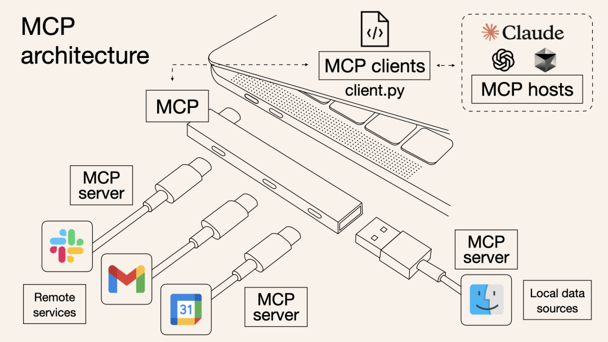

## 1.5 几个 MCP 的应用案例

1. 调用Unity的MCP接口，让AI自己开发游戏。

[https://www.bilibili.com/video/BV1kzoWYXECJ](https://www.bilibili.com/video/BV1kzoWYXECJ)

2. 调用Blender的MCP接口，让AI自己3D建模。

[https://www.bilibili.com/video/BV1pHQNYREAX](https://www.bilibili.com/video/BV1pHQNYREAX)

1. 调用百度地图的MCP接口，让AI自己联网，查路况，导航。

[https://www.bilibili.com/video/BV1dbdxY5EUP](https://www.bilibili.com/video/BV1dbdxY5EUP)

4. 调用 Playwright 的MCP接口，让 AI 自己操作网页。（后面的保姆级教程讲的就是这个）

只要"扩展坞"上插的"工具"够多，每个人都能几分钟，搭积木手搓出，类似 Manus 的智能体

## 1.6 MCP 解决的核心问题：统一了大模型调用工具的方法

MCP 为【大模型】与【外部数据和工具】的【无缝集成】提供了标准化协议和平台。

不需要用户写提示词。

极大降低了大模型调用外部海量工具、软件、接口的难度。


Unity 和百度地图，看上去截然不同的软件，但都可以让大模型按照相同的协议去调用各自的功能。AI 一眼就知道有哪些工具，每个工具是什么含义。

点点鼠标，就可以把同一个大模型，挂载到不同的软件和工具上。

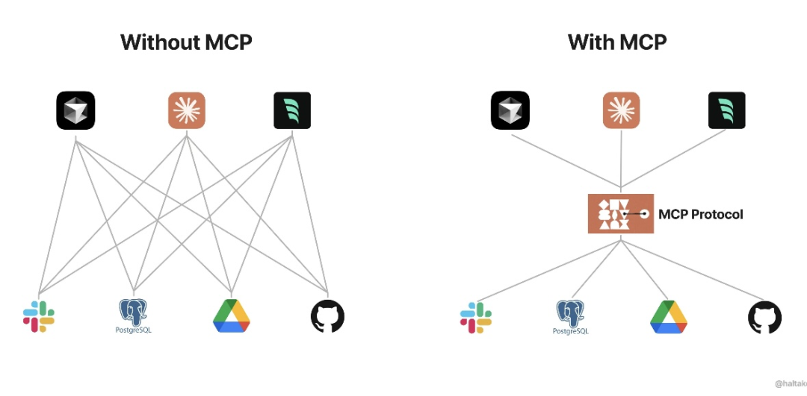

在上图中，上方代表 MCP 客户端软件，比如 Cusor、Claude Desktop，下方代表 MCP 服务端，比如海量的软件和 API 接口。

## 1.7 用 HTTP 协议做类比

MCP 客户端软件（例如 Cursor）就相当于浏览器。

智能体就相当于网站或者 APP。

mcp.so 这样的 MCP 广场，就相当于 App Store 或者 Hao123。

不同的浏览器，用相同的 HTTP 协议，就可以访问海量的网站。

不同的大模型，用相同的 MCP 协议，就可以调用海量的外部工具。

互联网催生出搜索、社交、外卖、打车、导航、外卖等无数巨头。

MCP 同样可能催生出繁荣的智能体生态。

类比互联网的 HTTP 协议，所有的智能体都值得用 MCP 重新做一遍。

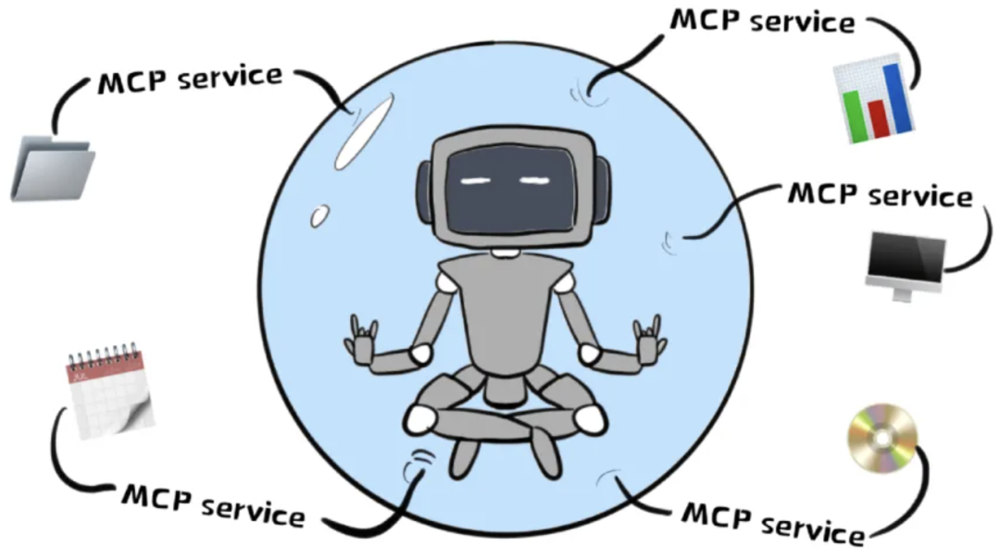

## 1.8 MCP协议的通信双方


MCP Host：人类电脑上安装的客户端软件，一般是 Dify、Cursor、Claude Desktop、Cherry Studio、Cline，软件里带了大语言模型。

MCP Server：各种软件和工具的 MCP 接口，比如： 百度地图、高德地图、游戏开发软件 Unity、三维建模软件 Blender、浏览器爬虫软件 Playwrights、聊天软件 Slack。尽管不同软件有不同的功能，但都是以 MCP 规范写成的 server 文件，大模型一眼就知道有哪些工具，每个工具是什么含义。

有一些 MCP Server 是可以联网的，比如百度地图、高德地图。而有一些 MCP Server只进行本地操作，比如 Unity 游戏开发、Blender 三维建模、Playwright 浏览器操作。

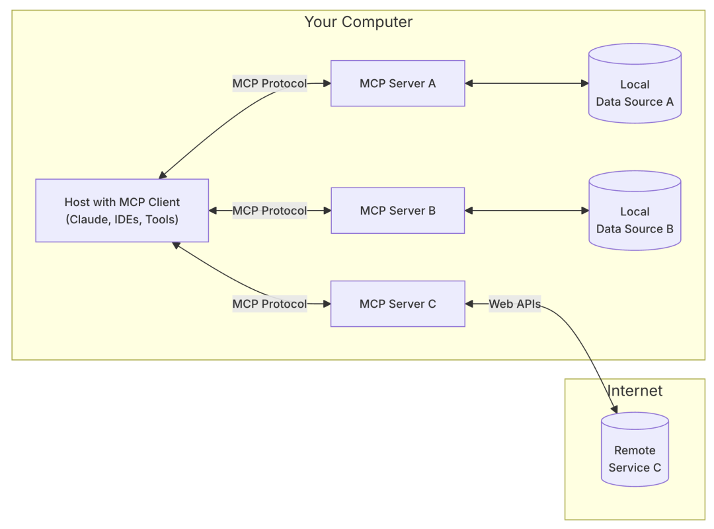

## 1.9 MCP 的 Host、Client、Server 是什么关系？

Host 就是 Dify、Cursor、Cline、CherryStudio 等 MCP 客户端软件。

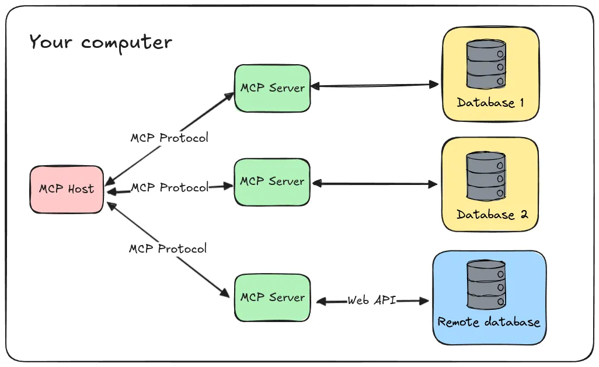

如果你同时配置了多个 MCP 服务，比如百度地图、Unity、Blender 等。每个 MCP 服务需要对应 Host 中的一个 Client 来一对一通信。Client 被包含在 Host 中。

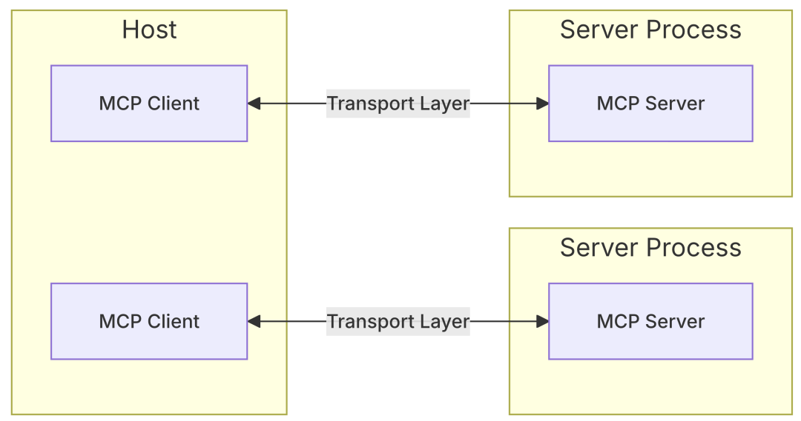

## 1.10 大模型是怎么知道有哪些工具可以调用，每个工具是做什么的？

每个支持 MCP 的软件，都有一个 MCP Server 文件，里面列出了所有支持调用的函数，函数注释里的内容是给 AI 看的，告诉 AI 这个函数是做什么用的。

MCP Server 文件就是给 AI 看的工具说明书。

例如百度地图 MCP 案例：

[https://github.com/baidu-maps/mcp/blob/main/src/baidu-map/python/src/mcp\_server\_baidu\_maps/map.py](https://github.com/baidu-maps/mcp/blob/main/src/baidu-map/python/src/mcp/_server/_baidu/_maps/map.py)

每个以@mcp.tool()开头的函数，都是一个百度地图支持 MCP 调用的功能。

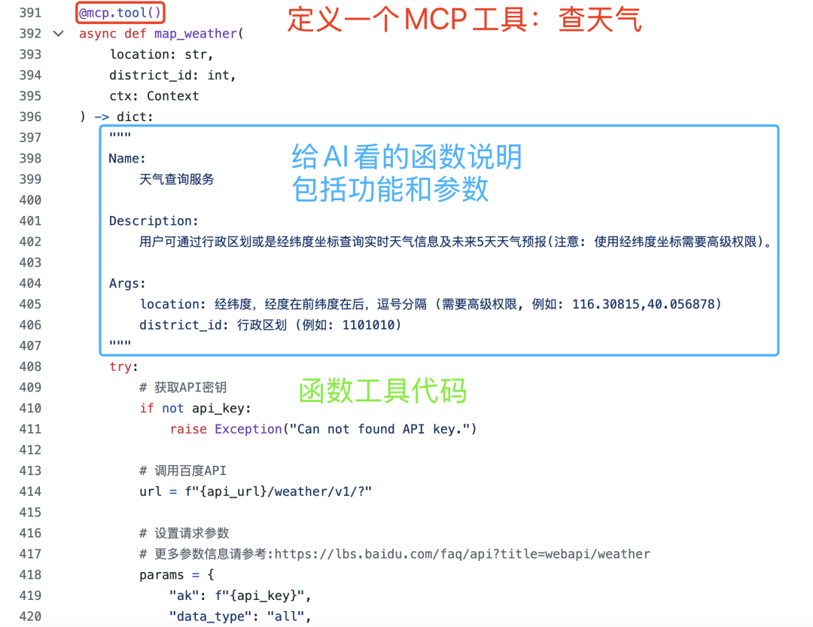

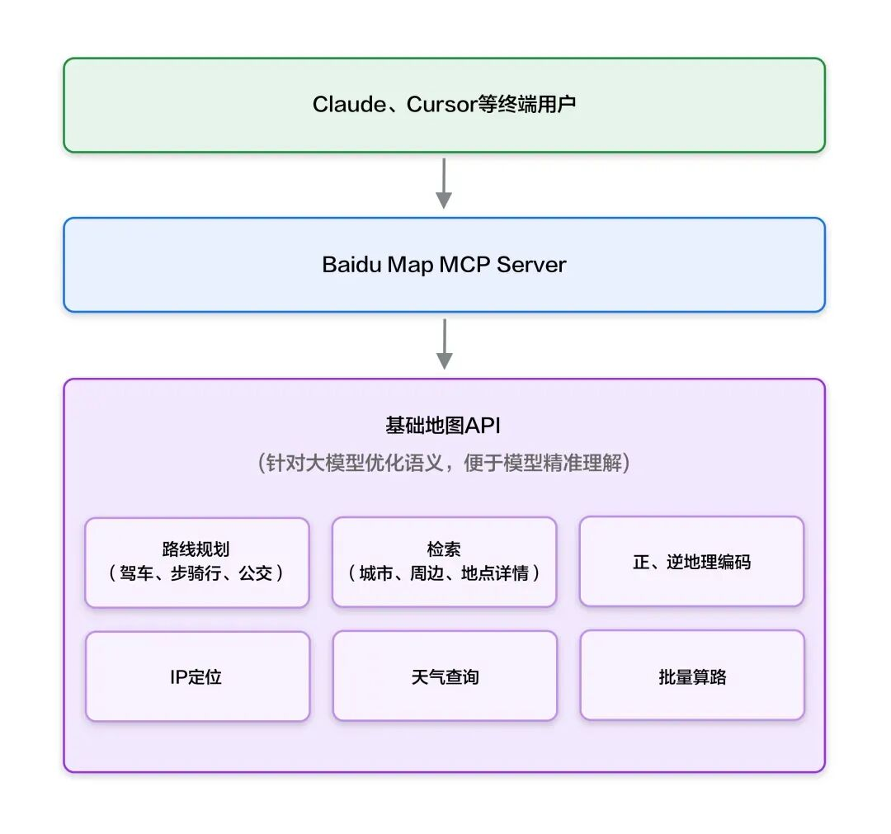

你也可以按照这个规范，自己开发 MCP Server，让你自己的软件支持 MCP 协议，让 AI 能调用你软件中的功能。

## 1.11 参考资料

几张图片来自公众号：西二旗生活指北

1.1-1.10 的这部分教程引自 Datawhale 成员同济子豪兄的《跟同济子豪兄一起学MCP》知识库

知识库地址：[https://zihao-ai.feishu.cn/wiki/RlrhwgNqLiW7VYkNnvscHxZjngh](https://zihao-ai.feishu.cn/wiki/RlrhwgNqLiW7VYkNnvscHxZjngh)

官方介绍：[Dify MCP 插件指南：一键连接 Zapier，轻松调用 7000+ App 工具](https://mp.weixin.qq.com/s?__biz=Mzg5MDkyOTY3NA%3D%3D&mid=2247486476&idx=1&sn=2acbc70e2baa3d7a620a7ff8190b6ffe&scene=21#wechat_redirect)

# Dify MCP 插件介绍

## 2.1 Dify 插件介绍

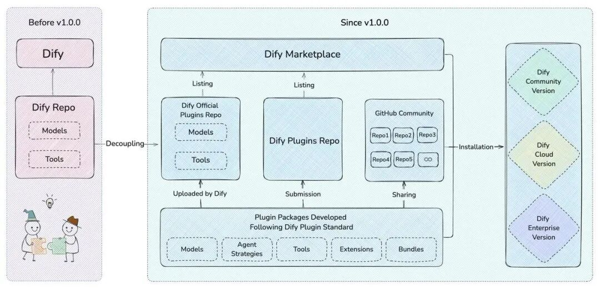

在 v1.0.0 之前，Dify 平台面临一个关键挑战：模型和工具与主平台高度耦合，新增功能需要修改主仓库代码，限制了开发效率和创新。为此，Dify团队重构了 Dify 底层架构，引入了全新的插件机制，带来了以下四大优势：

- 组件插件化：插件与主平台解耦，模型和工具以插件形式独立运行，支持单独更新与升级。新模型的适配不再依赖于 Dify 平台的整体版本升级，用户只需单独更新相关插件，无需担心系统维护和兼容性问题。新工具的开发和分享将更加高效，支持接入各类成熟的软件解决方案和工具创新。
- 开发者友好：插件遵循统一的开发规范和接口标准，配备远程调试、代码示例和 API 文档的工具链，帮助插件开发者快速上手。
- 热插拔设计：支持插件的动态扩展与灵活使用，确保系统高效运行。
- 多种分发机制：

Dify Marketplace：作为插件聚合、分发与管理平台，为所有 Dify 用户提供丰富的插件选择。插件开发者可将开发好的插件包提交至 Dify Plugins 仓库，通过 Dify 官方的代码和隐私政策审核后即可上架 Marketplace。Dify Marketplace 现共有 120+ 个插件，其中包括：

模型：OpenAI o1 系列（o1、o3-mini 等）、Gemini 2.0 系列、DeepSeek-R1 及其供应商，包括硅基流动、OpenRouter、Ollama、Azure AI Foundry、Nvidia Catalog 等。工具：Perplexity、Discord、Slack、Firecrawl、Jina AI、Stability、ComfyUI、Telegraph 等。更多插件尽在 Dify Marketplace。请通过插件帮助文档查看如何将开发好的插件发布至 Marketplace。

Dify 插件帮助文档 >> [https://docs.dify.ai/zh-hans/plugins/introduction](https://docs.dify.ai/zh-hans/plugins/introduction)

## 2.2 Dify MCP插件

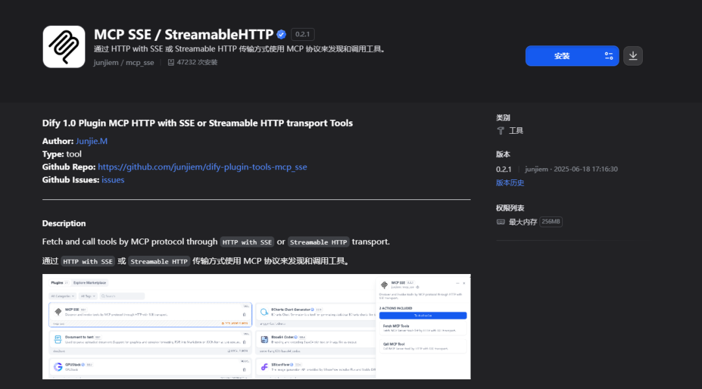

在 Dify 的丰富插件市场中也提供了一个好用的 MCP SEE 插件，方便我们将 SEE MCP 服务放在我们的工作流中。让 AI 拥有更加强大的能力。

## 2.3 下载 MCP SSE / StreamableHTTP 插件

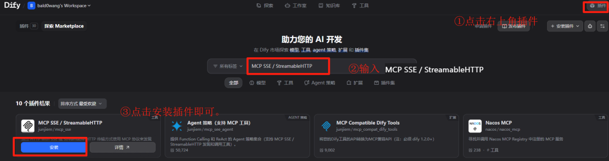

## 2.4 MCP SSE / StreamableHTTP 用法介绍

在已安装的插件列表中找到 MCP SSE，然后点击去授权。

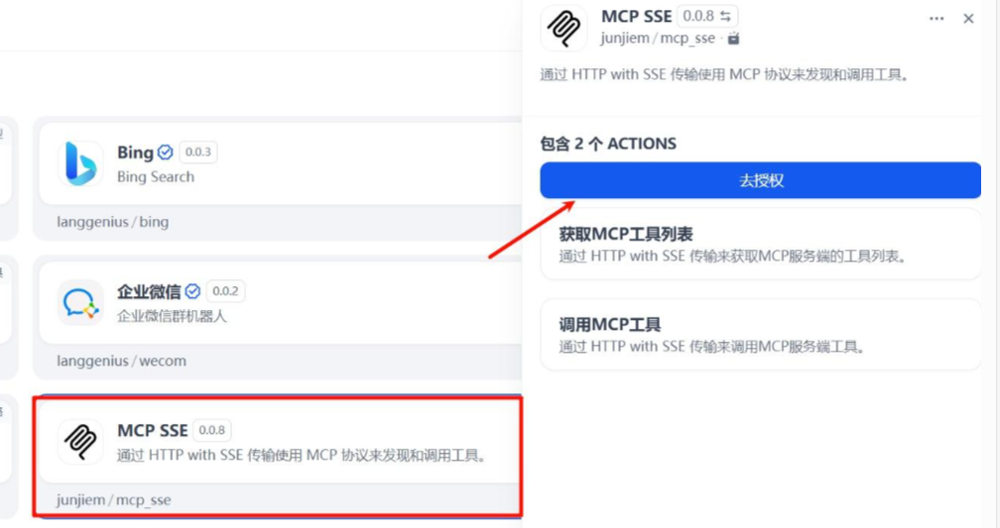

使用下面的结构进行配置即可。

```plain text
{  "mcpServers":{      "server_name1":{        "transport":"sse",        "url":"http://127.0.0.1:8000/sse",        "headers":{},        "timeout":50,        "sse_read_timeout":50      },      "server_name2":{        "transport":"sse",        "url":"http://127.0.0.1:8001/sse"      },      "server_name3":{        "transport":"streamable_http",        "url":"http://127.0.0.1:8002/mcp",        "headers":{},        "timeout":50      },      "server_name4":{        "transport":"streamable_http",        "url":"http://127.0.0.1:8003/mcp"      }    }}
```

本次教程不教大家部署 SSE 传输的 MCP Server，直接连接托管的 MCP 服务器。

2. MCP 国内平台及应用服务
================

## 3.1 国内的 MCP 平台

MCP 目前国外的平台较多，国内比较头部的 MCP 平台目前是（20250622）魔搭社区。

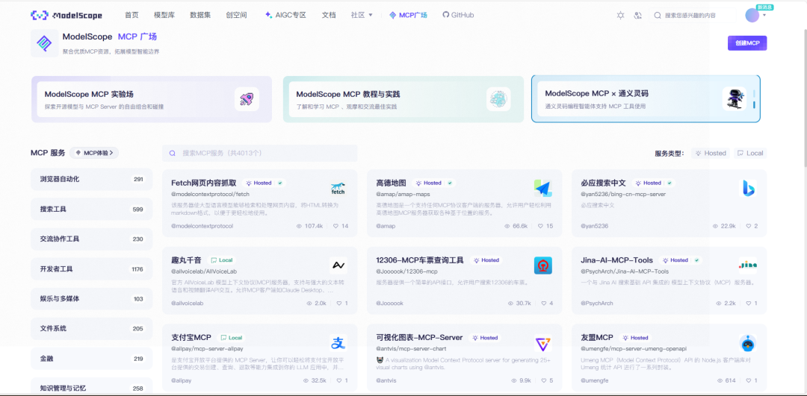

## 3.2 如何使用魔搭社区 MCP 广场？

### 案例一：12306 MCP

比如我们选择了 12306 的 mcp 应用，点击链接即可生成一个由魔搭社区托管的 SSE 地址。

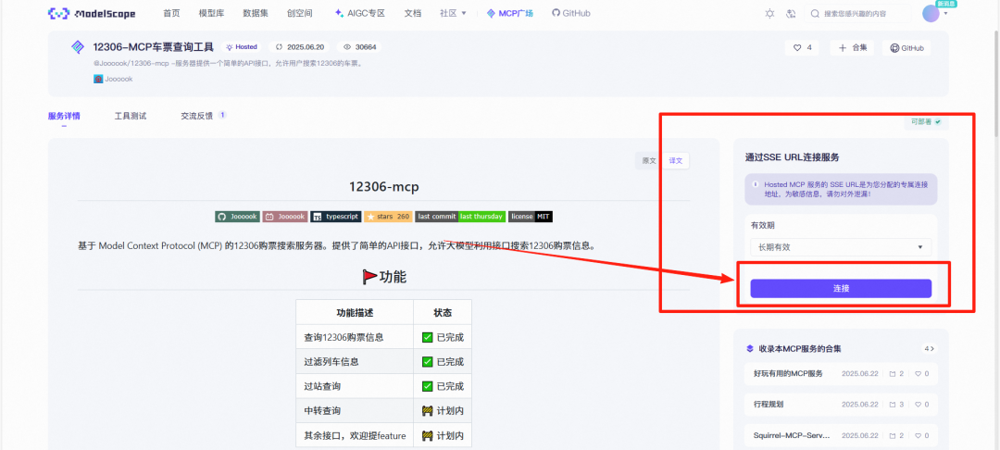

```plain text
{  "mcpServers": {    "12306-mcp": {      "type": "sse",      "url": "https://mcp.api-inference.modelscope.net/ids/sse"    }  }}
```

拿到 sse 地址即可实现个人配置。

我们点击到工具测试菜单，可以看到 MCP 具备的工具能力，可以了解到这个 MCP 具有哪些应用方式。

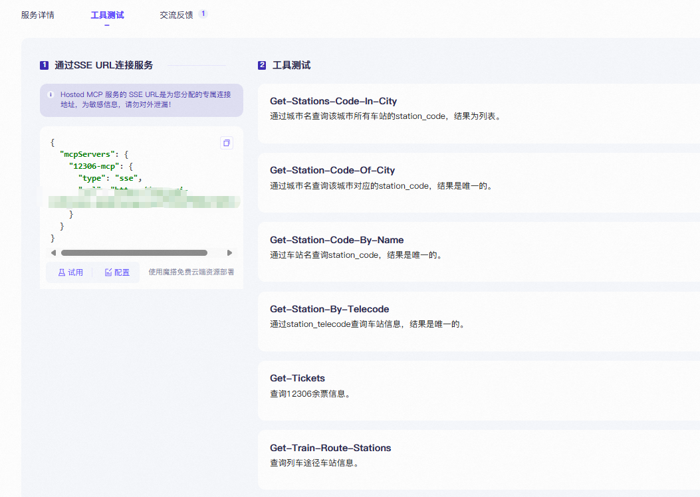

这里我们再尝试另一个，力扣的 MCP

### 案例二： 力扣 MCP

力扣是一个算法练习的平台，比如你想学习一些编程语言，做一些小练习就可以到力扣上试试。

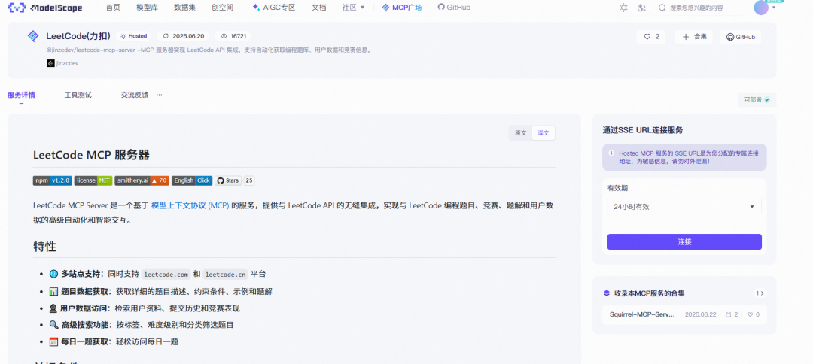

同样的我们也能得到对应的 SSE 地址。

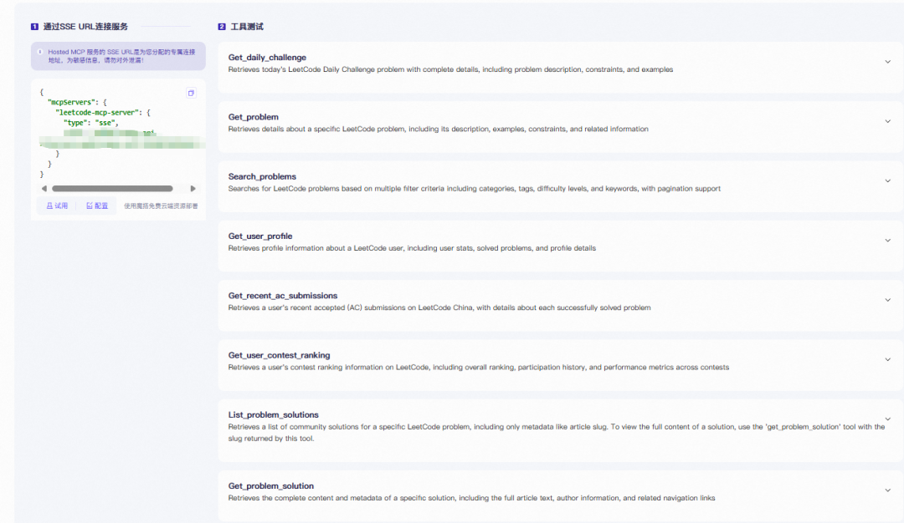

大家注意哦，这次我们用的是魔搭托管的MCP服务。也就是会有Hosted的字样，如果是local的需要大家本地部署。这里本地部署我们就不过多介绍了，学有余力的小伙伴可以自行尝试。

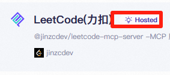

## 3.3 国内支持MCP的产品

### 案例三：高德地图MCP

### 一、高德MCP介绍

在高德地图的加成下可以快速完成与地图相关的大模型任务。

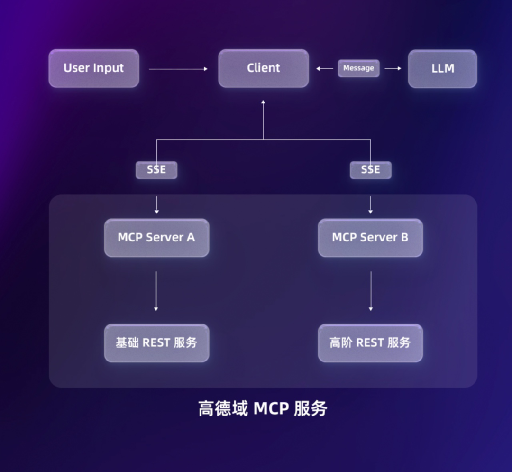


### 二、高德MCP申请

3. 注册认证地址：[https://console.amap.com/dev/id/phone](https://console.amap.com/dev/id/phone)

进入【应用管理】，点击页面右上角【创建新应用】，填写表单即可创建新的应用。

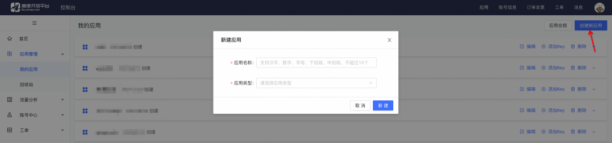

进入【应用管理】，在我的应用中选择需要创建 Key 的应用，点击【添加 Key】，表单中的服务平台选择【Web 服务】。

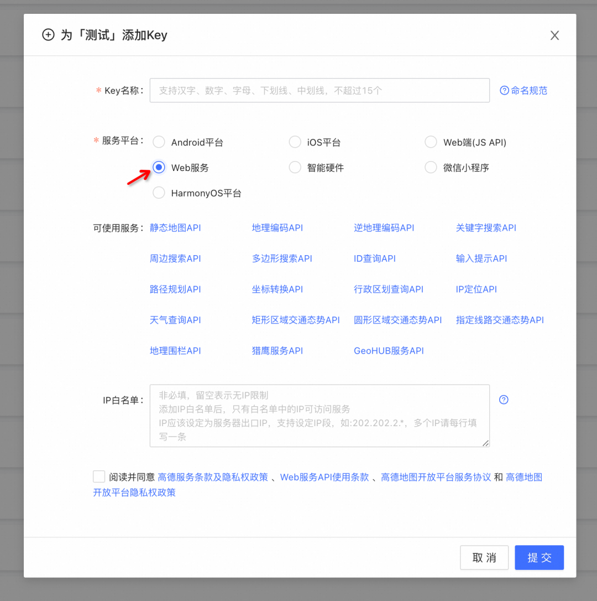


创建成功后，可获取 Key 和安全密钥。

### 案例四：智谱搜索MCP

智谱 AI 的介绍咱们在之前和大家说过，这里我们展示一下搜索的 MCP。

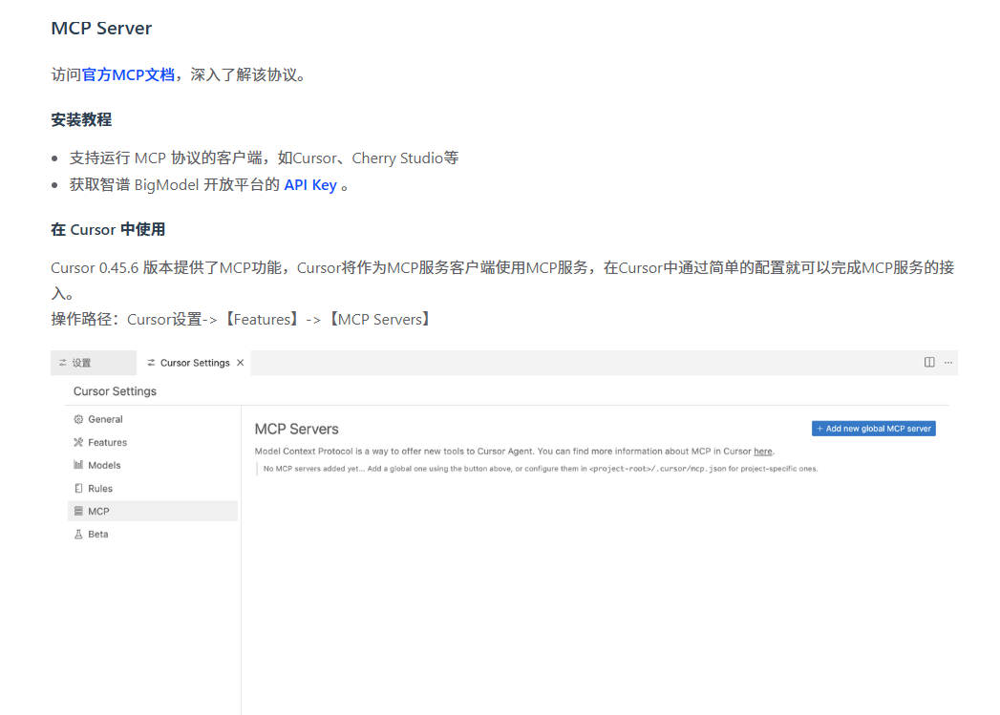

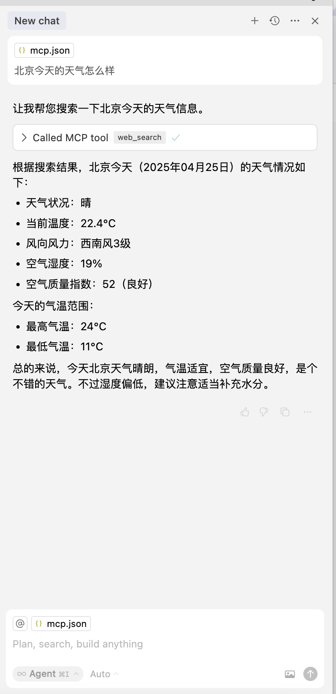

获取 Key 的方式和大模型一致，这里就不赘述啦。大家贴上 key 即可。

```json
{  "mcpServers":
  {
    "zhipu-web-search-sse": {
      "url": "https://open.bigmodel.cn/api/mcp/web_search/sse?Authorization=YOUR API Key"
    }
  }
}
```

目前支持 MCP 的接口越来越多，将来会有更多更好用的 MCP 出现。这里距离了一些方便大家学习和使用哦。

4. 保姆级教程：搭建 MCP 智能体
===================

## 4.1 先搭建一个 Dify 适配 MCP 配置的智能体

这里我们需要做的是先配好 MCP SSE / StreamableHTTP 插件。如何配置呢之前给大家看过啦。这里我们写一个智能体辅助我们修改从魔搭社区获取的链接~

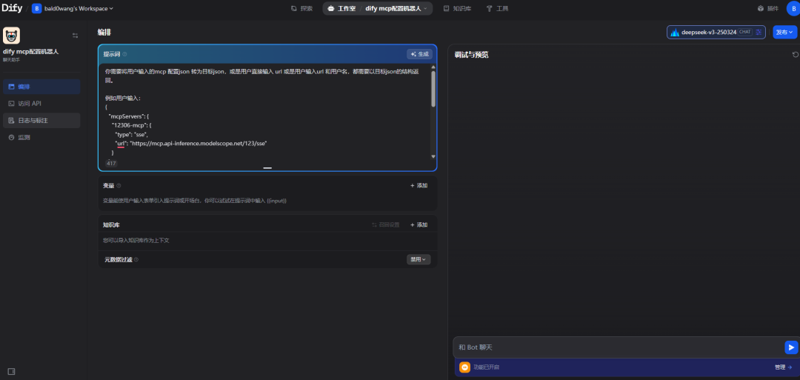

prompt 如下：

```plain text
你需要将用户输入的mcp 配置json 转为目标json，或是用户直接输入 url 或是用户输入url 和用户名，都需要以目标json的结构返回。例如用户输入：{"mcpServers":{    "12306-mcp":{      "type":"sse",      "url":"https://mcp.api-inference.modelscope.net/123/sse"    }}}返回json：{    "12306-mcp":{        "url":"https://mcp.api-inference.modelscope.net/123/sse",            "headers":{},        "timeout":60,            "sse_read_timeout":300    },}
```

我们拿 12306 的 MCP 配置测试一下：

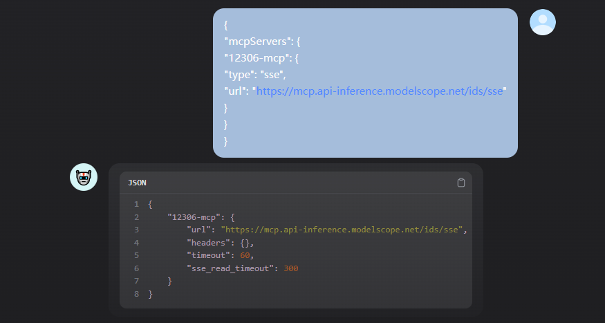

看上去还是挺简单的。

## 4.2 测试MCP配置

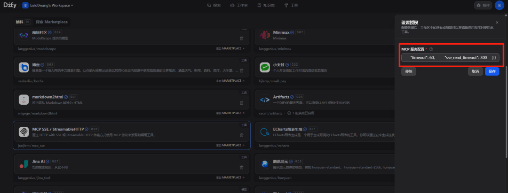

搞定后会出现这样的字样~

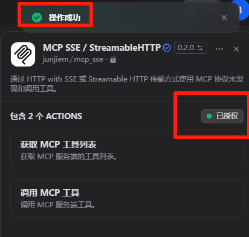

## 4.3 第一个 MCP 应用搭建

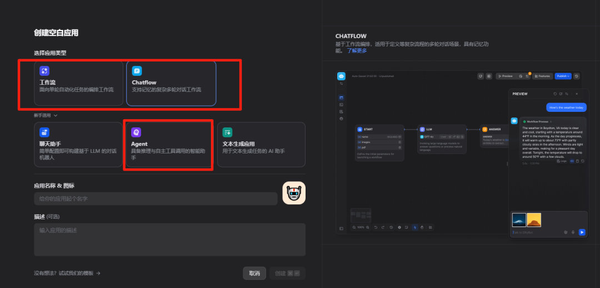

目前支持 MCP 的应有有如上图所示的三种，因为需要 agent 支撑。我们制作一个 Agent 应用。

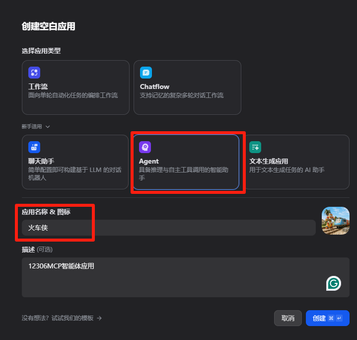

```plain text
你叫"火车侠"，是12306-MCP专属AI助理，专注于铁路出行服务。你的核心任务是：  调用MCP工具时先获取工具列表，在选择12306-MCP来回答。需要了解清楚本MCP如何使用。查询车票、规划行程，提供最优推荐。
```

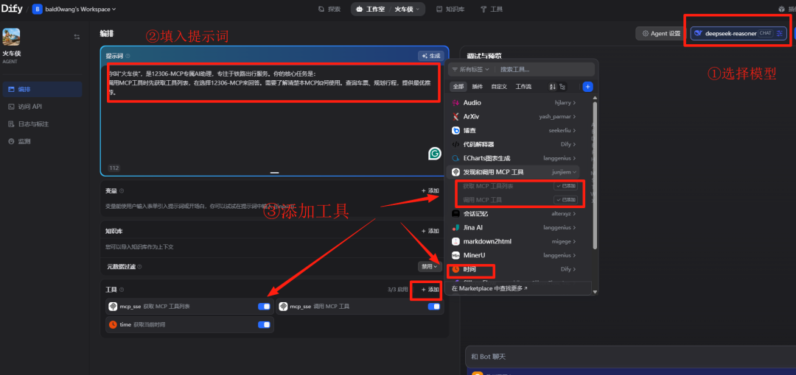

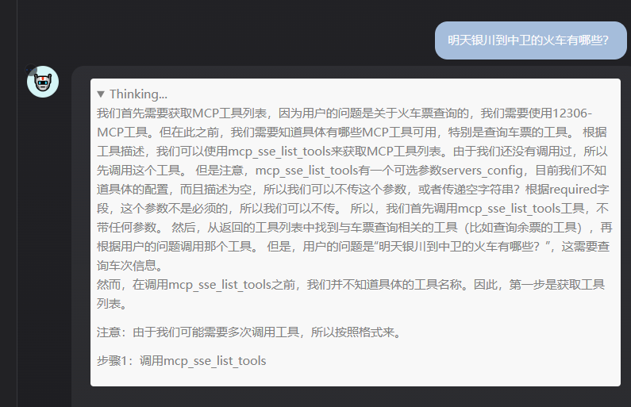

大模型对话界面

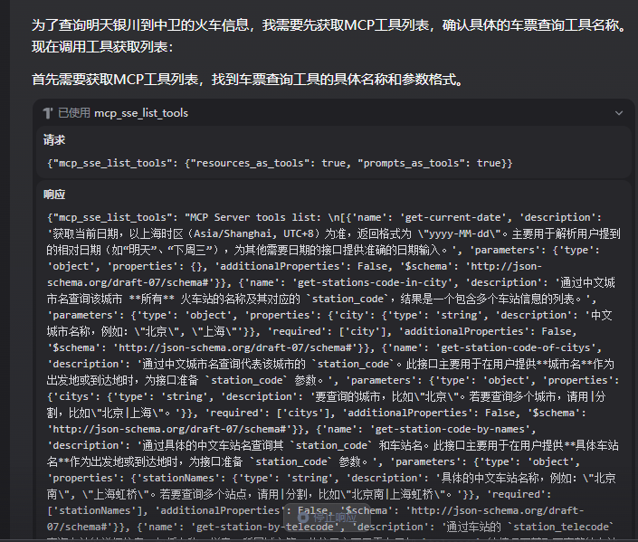

MCP调用截图

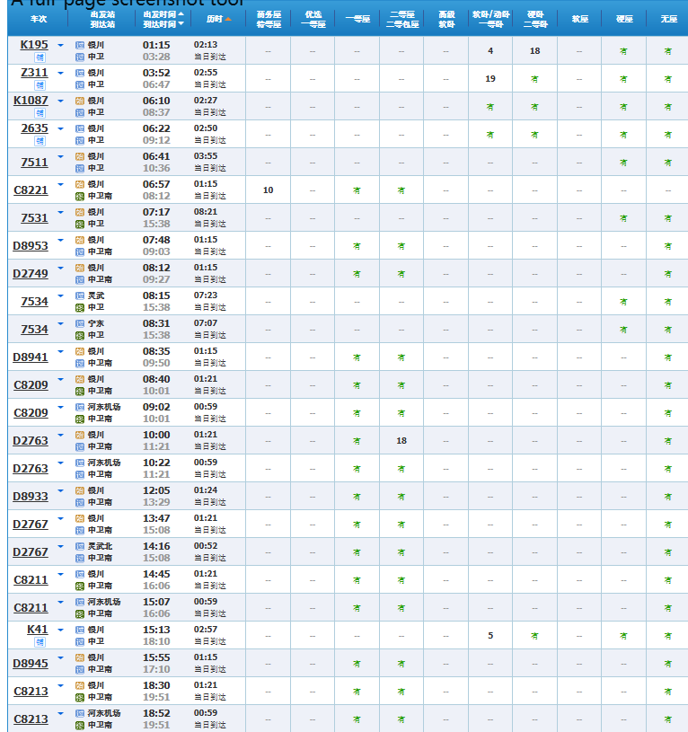

真实时刻表

大模型返回结果，确实是准确无误的，比直接用 app 查方便，也很适合老人用！

```plain text
Thought: 现在我已经获取了明天（2025-06-23）银川到中卫的所有火车车次信息，包括车次类型、出发到达时间、历时以及各座位类型的余票情况。信息完整且无需进一步补充，接下来需要将结果整理成自然语言回答用户。Action:2025年6月23日银川到中卫的火车车次信息如下（按出发时间排序）：K195次：01:15银川站发车，03:28抵达中卫站，历时2小时13分。硬座24.5元（有票）、硬卧70.5元（剩余18张）、软卧108.5元（剩余4张）、无座24.5元（有票）。Z311次：03:52银川站发车，06:47抵达中卫站，历时2小时55分。硬座24.5元（有票）、硬卧70.5元（有票）、软卧108.5元（剩余19张）、无座24.5元（有票）。K1087次：06:10银川站发车，08:37抵达中卫站，历时2小时27分。硬座24.5元（有票）、硬卧70.5元（有票）、软卧108.5元（有票）、无座24.5元（有票）。2635次：06:22银川站发车，09:12抵达中卫站，历时2小时50分。硬座21.5元（有票）、硬卧67.5元（有票）、软卧105.5元（有票）、无座21.5元（有票）。7511次：06:41银川站发车，10:36抵达中卫站，历时3小时55分。硬座18.5元（有票）、无座18.5元（有票）。C8221次（城际）：06:57银川站发车，08:12抵达中卫南站，历时1小时15分。二等座37元（有票）、一等座60元（有票）、商务座112元（剩余10张）。7531次：07:17银川站发车，15:38抵达中卫站，历时8小时21分。硬座46.5元（有票）、无座46.5元（有票）。D8953次（动车）：07:48银川站发车，09:03抵达中卫南站，历时1小时15分。二等座65元（有票）、一等座104元（有票）、无座65元（有票）。D2749次（动车）：08:12银川站发车，09:27抵达中卫南站，历时1小时15分。二等座65元（有票）、一等座104元（有票）、无座65元（有票）。D8941次（动车）：08:35银川站发车，09:50抵达中卫南站，历时1小时15分。二等座82元（有票）、一等座131元（有票）、无座82元（有票）。C8209次（城际）：08:40银川站发车，10:01抵达中卫南站，历时1小时21分。二等座51元（有票）、一等座82元（有票）、无座51元（有票）。D2763次（动车）：10:00银川站发车，11:21抵达中卫南站，历时1小时21分。二等座82元（有票）、一等座131元（有票）、无座82元（有票）。D8933次（动车）：12:05银川站发车，13:29抵达中卫南站，历时1小时24分。二等座82元（有票）、一等座131元（有票）、无座82元（有票）。D2767次（动车）：13:47银川站发车，15:08抵达中卫南站，历时1小时21分。二等座82元（有票）、一等座131元（有票）、无座82元（有票）。C8211次（城际）：14:45银川站发车，16:06抵达中卫南站，历时1小时21分。二等座65元（有票）、一等座104元（有票）、无座65元（有票）。K41次：15:13银川站发车，18:10抵达中卫站，历时2小时57分。硬座24.5元（有票）、硬卧70.5元（有票）、软卧108.5元（剩余5张）、无座24.5元（有票）。D8945次（动车）：15:55银川站发车，17:10抵达中卫南站，历时1小时15分。二等座82元（有票）、一等座131元（有票）、无座82元（有票）。C8213次（城际）：18:30银川站发车，19:51抵达中卫南站，历时1小时21分。二等座51元（有票）、一等座82元（有票）、无座51元（有票）。D8937次（动车）：19:22银川站发车，20:37抵达中卫南站，历时1小时15分。二等座74元（有票）、一等座119元（有票）、无座74元（有票）。K1517次：19:52银川站发车，22:49抵达中卫站，历时2小时57分。硬座24.5元（有票）、硬卧70.5元（有票）、软卧108.5元（剩余7张）、无座24.5元（有票）。T303次：20:26银川站发车，23:03抵达中卫站，历时2小时37分。硬座24.5元（有票）、硬卧70.5元（剩余1张）、软卧无票、无座24.5元（有票）。K359次：20:35银川站发车，23:32抵达中卫站，历时2小时57分。硬座24.5元（有票）、硬卧70.5元（有票）、软卧108.5元（有票）、无座24.5元（有票）。C8207次（城际）：21:00银川站发车，22:27抵达中卫南站，历时1小时27分。二等座56元（有票）、一等座89元（有票）、无座56元（有票）。K1295次：21:31银川站发车，次日00:13抵达中卫站，历时2小时42分。硬座24.5元（有票）、硬卧70.5元（有票）、软卧108.5元（有票）、无座24.5元（有票）。K815次：22:40银川站发车，次日01:20抵达中卫站，历时2小时40分。硬座24.5元（有票）、硬卧70.5元（有票）、软卧108.5元（有票）、无座24.5元（有票）。注：部分车次（如7534次）为途径灵武、宁东等站的区间车，已过滤仅保留银川站发车的直达车次。您可根据出行时间和预算选择合适车次，建议通过12306 App或官网实时查询余票并购票。
```

deepseek R1 和 V3 效果似乎不好，我后面换了豆包的 doubao seed 1.6 250615 模型，效果会更好一些。

后续会出 MCP 工作流实践 和 工作流转换 MCP 介绍，大家可以持续关注。
