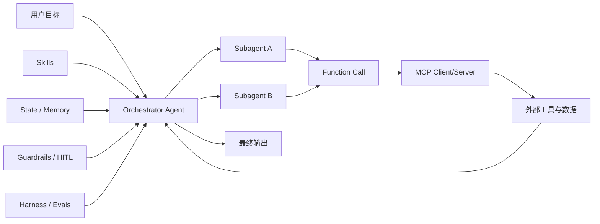

在和 AI 产品、AI 编程工具打交道时，我们经常会听到一串术语：Agent、Subagent、MCP、Function Call、Skills、Workflow、Harness。

这些词单看都不难，难的是不知道它们在一个真实系统里分别负责什么。本文会按“从能跑，到跑稳，再到可迭代”的思路，把它们整合在一起讲清楚，并适当发散到上下文、记忆、观测和评测等相关概念。

## 先看一句话版本

- **Agent**：会“理解目标并行动”的 AI 执行者。
- **Subagent**：Agent 派出去处理子任务的分工单元。
- **MCP**：连接 AI 应用与外部工具/数据的标准协议。[1][2]
- **Function Call**：模型按 JSON Schema 约束调用函数/工具的机制。[4]
- **Skills**：可复用能力包（规则、模板、脚本、流程）。
- **Workflow**：将多个步骤编排成可重复流水线。
- **Harness**：用于评测、回归、对比实验的测试框架。[11][12]

## 1. Agent：不仅能聊，还能做事

传统聊天模型更像“问答器”，Agent 更像“执行者”。

一个最小 Agent 往往要完成四件事：

1. 接收目标（例如“整理本周会议纪要并发邮件”）。
2. 规划步骤（先收集资料，再提炼摘要，再调用发信工具）。
3. 调用工具执行（搜索、读写文件、访问 API）。
4. 检查结果并继续迭代。

所以可以记成：**Agent = 模型 + 指令 + 工具 + 状态/记忆 + 编排**。[6]

## 2. Subagent：把复杂任务拆出去并行做

当任务复杂到一个 Agent 不好管理时，可以拆成多个 Subagent。

例如“写技术综述”可以拆成：

- Subagent A：资料检索。
- Subagent B：术语归并。
- Subagent C：案例与图表。
- 主 Agent：汇总、审稿、统一风格。

Subagent 的价值：

- **并行**：缩短端到端时间。
- **隔离**：降低上下文污染和连锁错误。
- **可评测**：每个子任务可单独打分。

在不少 Agent 框架里，这类能力会叫 handoff / delegation。[7]

## 3. MCP：工具接入的“统一插口”

MCP（Model Context Protocol）可以理解为 AI 世界的标准连接层。[1][2]

根据规范，MCP 里常见三类角色是：

- Host：发起连接的 LLM 应用。
- Client：Host 内部连接器。
- Server：提供资源、提示模板、工具能力的服务端。[2]

这让“接一个工具就写一套私有适配”的成本显著下降。最直观的收益是：同一套工具能力，可以更容易在不同 AI 客户端中复用。[1][3]

## 4. Function Call：让模型“按格式动手”

Function Call（工具调用）是 Agent 执行动作的关键桥梁。[4]

基本流程是：

1. 先定义函数名和参数 Schema。
2. 模型决定是否调用、调用哪个函数。
3. 业务系统执行函数。
4. 把函数结果回填给模型继续推理。

示意（伪代码）：

```json
{
  "name": "get_weather",
  "arguments": {
    "city": "Shanghai",
    "date": "2026-04-09"
  }
}
```

在工程里通常建议配合 `strict` 等结构化约束，减少“参数看起来像对，实际不可执行”的问题。[4]

## 5. Skills：沉淀可复用能力

Skills 可以理解为“团队经验的打包产物”，通常包含：

- 任务规则（该做什么/不该做什么）。
- 输出模板（结构、语气、字段）。
- 校验脚本（格式、链接、命名）。
- 工具调用约定（参数规范、失败重试）。

当流程沉淀为 Skills 后，系统就从“靠个人提示词手艺”转向“靠团队资产复用”。

## 6. Workflow：把能力串成生产线

如果说 Skills 是零件，Workflow 就是装配线。

一个典型 AI Workflow 可能是：

1. 接收任务。
2. 检索知识（RAG）。
3. 调用工具补充实时数据。
4. 多 Agent 协同生成。
5. 自动校验（结构、事实、风格）。
6. 输出到目标系统（文档、IM、工单）。

Workflow 关注的不是“某次输出很惊艳”，而是“长期稳定可交付”。

## 7. Harness：怎么证明系统真的变好了？

没有 Harness，很多优化只能靠体感；有了 Harness，才有持续迭代的度量闭环。[11][12]

Harness 常见能力：

- 管理基准集（prompts / cases / golden set）。
- 自动跑批评测与回归。
- 记录关键指标（成功率、延迟、成本、正确率）。
- 对比版本差异（新模型 vs 老模型、A/B 策略）。

可以把它理解成：**把“玄学调参”变成“可重复实验”。**

## 8. 一张关系图：这些词如何协作



主线可以记为：

1. **Workflow** 决定流程怎么跑。
2. **Agent/Subagent** 决定谁来跑。
3. **Function Call + MCP** 决定怎么接工具。
4. **Skills** 决定经验如何复用。
5. **Harness** 决定系统如何持续变好。

## 9. 再发散一层：高频关联概念

下面这些词在实战里几乎一定会遇到：

### 9.1 Prompt / System Prompt / Role Prompt

- **Prompt**：当前任务指令。
- **System Prompt**：全局行为约束。
- **Role Prompt**：特定角色下的语气和职责。

Prompt 设计会直接影响工具调用意愿、输出结构和稳定性。[5]

### 9.2 Context Window / Token Budget

模型每次可处理的上下文是有上限的（以 token 计）。超预算会触发截断、摘要或检索策略。[5]

因此工程上常见做法是：

- 只放当前步骤必要信息。
- 历史对话做压缩摘要。
- 长文档通过 RAG 按需检索。

### 9.3 Memory（短期记忆与长期记忆）

- **短期记忆**：当前会话状态。
- **长期记忆**：跨会话可复用偏好与事实。

RAG 可视作一种“外部可更新记忆”机制，经典做法是“参数记忆 + 非参数记忆（向量检索）”组合。[8]

### 9.4 Planner / Router / Orchestrator

- **Planner**：拆解任务步骤。
- **Router**：决定调用哪个模型或子代理。
- **Orchestrator**：统筹执行顺序、依赖和回收结果。

多代理系统的核心并不只是“多”，而是“每个代理目标边界明确”。[6][7]

### 9.5 ReAct / Toolformer（方法论层）

- **ReAct**：把“推理轨迹”和“动作执行”交替进行。[9]
- **Toolformer**：让模型学习“何时调用什么工具、传什么参数”。[10]

它们都在回答同一个问题：如何把模型从“只会说”推进到“会做且可解释”。

### 9.6 Guardrails / HITL / 观测

- **Guardrails**：输入输出和工具调用前后的安全/格式约束。[7]
- **HITL（Human-in-the-loop）**：关键步骤人工确认，防止高风险自动化误触发。
- **Tracing / Observability**：记录调用链路，便于定位失败点与优化瓶颈。[6][7]

## 10. 一个落地例子：自动周报系统

目标：每周五自动生成项目周报并发送。

- Workflow：采集数据 → 汇总分析 → 生成草稿 → 人工确认 → 发送。
- Agent：主控任务编排和质量检查。
- Subagent：代码提交统计、工单进展统计、风险提炼。
- Function Call：调用 Git、Jira、邮件 API。
- MCP：统一接入内部工具服务。
- Skills：复用“周报模板 + 风险描述规范 + 发送规则”。
- Guardrails/HITL：发送前关键字段与收件人人工确认。
- Harness：每周回放历史样本，检查漏项率与误报率。

这样系统才会从“能跑一次”变成“稳定长期可用”。

## 11. 总结

记住这个心智模型就够用了：

- **Agent/Subagent** 解决“谁来做”。
- **MCP/Function Call** 解决“怎么连工具”。
- **Skills/Workflow** 解决“怎么稳定地做”。
- **Harness/Evals** 解决“怎么证明更好”。
- **Guardrails/HITL/Tracing** 解决“怎么安全可控地做”。

当这几块拼起来，AI 才真正从“会聊天”走向“可交付的生产力系统”。

## 参考文献

1. Model Context Protocol Docs, *What is the Model Context Protocol (MCP)?*
   [https://modelcontextprotocol.io/docs/getting-started/intro](https://modelcontextprotocol.io/docs/getting-started/intro)
2. Model Context Protocol, *Specification*
   [https://modelcontextprotocol.io/specification](https://modelcontextprotocol.io/specification)
3. Anthropic, *Introducing the Model Context Protocol*
   [https://www.anthropic.com/news/model-context-protocol](https://www.anthropic.com/news/model-context-protocol)
4. OpenAI Docs, *Function calling*
   [https://developers.openai.com/api/docs/guides/function-calling](https://developers.openai.com/api/docs/guides/function-calling)
5. OpenAI Docs, *Prompt engineering*
   [https://developers.openai.com/api/docs/guides/prompt-engineering](https://developers.openai.com/api/docs/guides/prompt-engineering)
6. OpenAI Docs, *Building agents*
   [https://developers.openai.com/tracks/building-agents](https://developers.openai.com/tracks/building-agents)
7. OpenAI Agents SDK Docs
   [https://openai.github.io/openai-agents-python/](https://openai.github.io/openai-agents-python/)
8. Lewis et al., *Retrieval-Augmented Generation for Knowledge-Intensive NLP Tasks* (arXiv:2005.11401)
   [https://arxiv.org/abs/2005.11401](https://arxiv.org/abs/2005.11401)
9. Yao et al., *ReAct: Synergizing Reasoning and Acting in Language Models* (arXiv:2210.03629)
   [https://arxiv.org/abs/2210.03629](https://arxiv.org/abs/2210.03629)
10. Schick et al., *Toolformer: Language Models Can Teach Themselves to Use Tools* (arXiv:2302.04761)
    [https://arxiv.org/abs/2302.04761](https://arxiv.org/abs/2302.04761)
11. EleutherAI, *lm-evaluation-harness*
    [https://github.com/EleutherAI/lm-evaluation-harness](https://github.com/EleutherAI/lm-evaluation-harness)
12. Jimenez et al., *SWE-bench: Can Language Models Resolve Real-World GitHub Issues?* (arXiv:2310.06770)
    [https://arxiv.org/abs/2310.06770](https://arxiv.org/abs/2310.06770)
