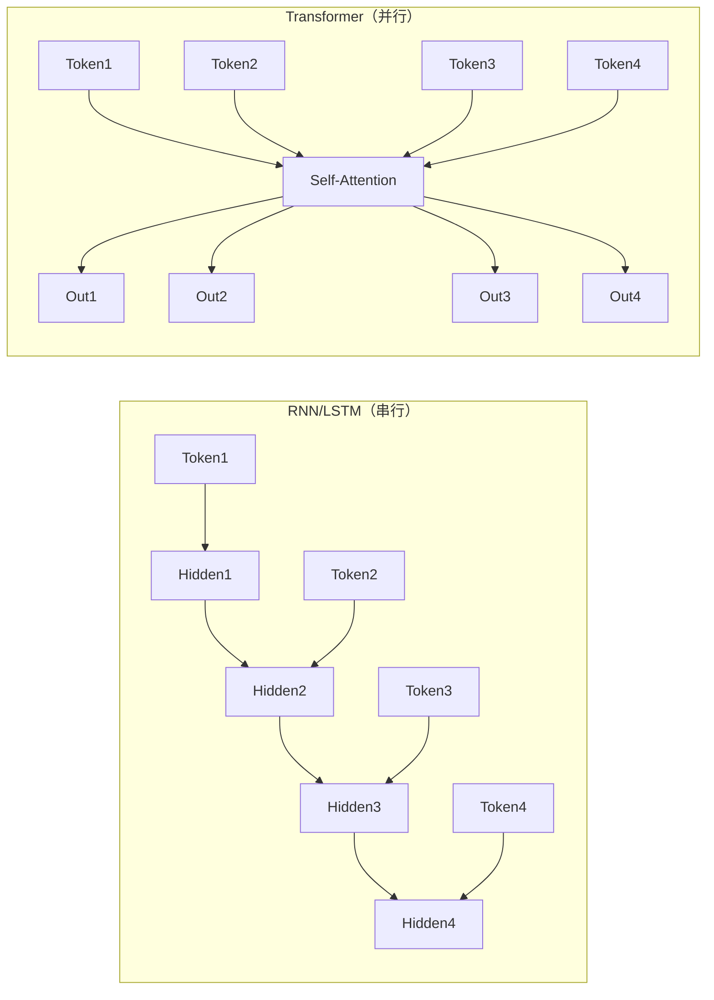
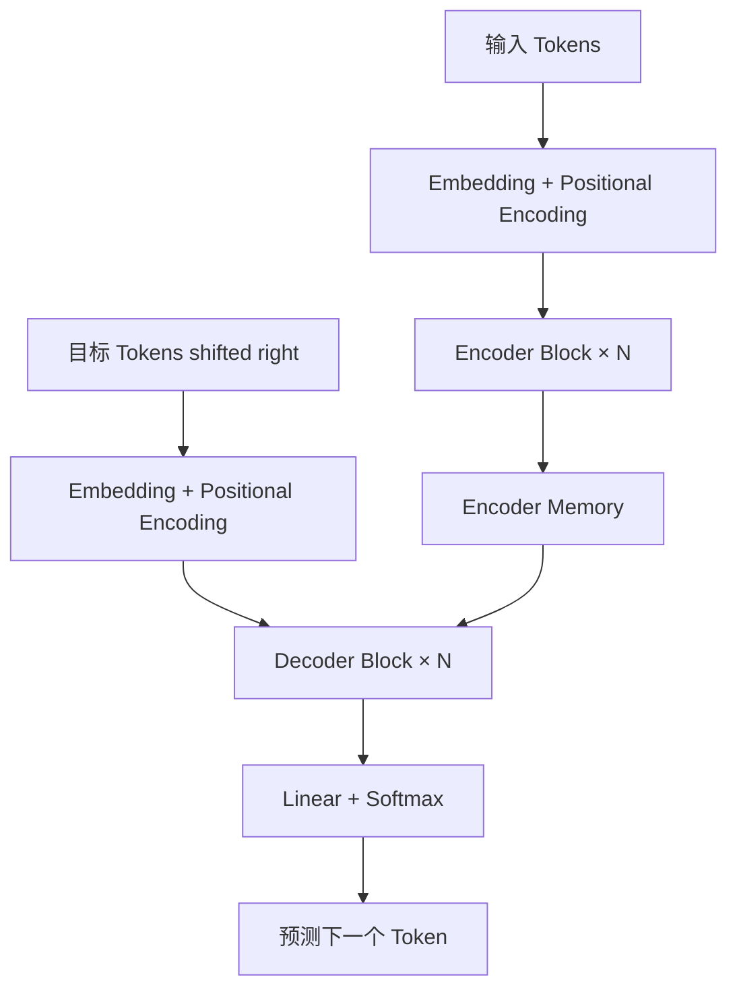
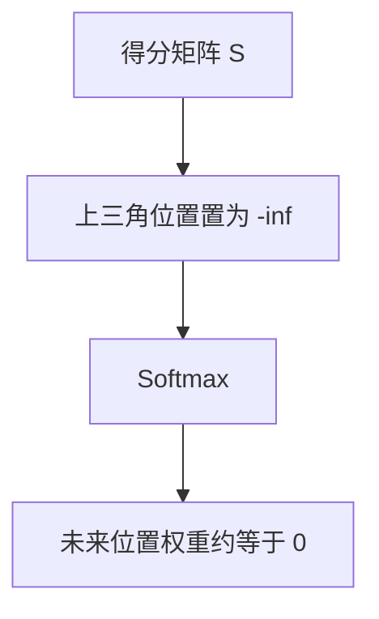
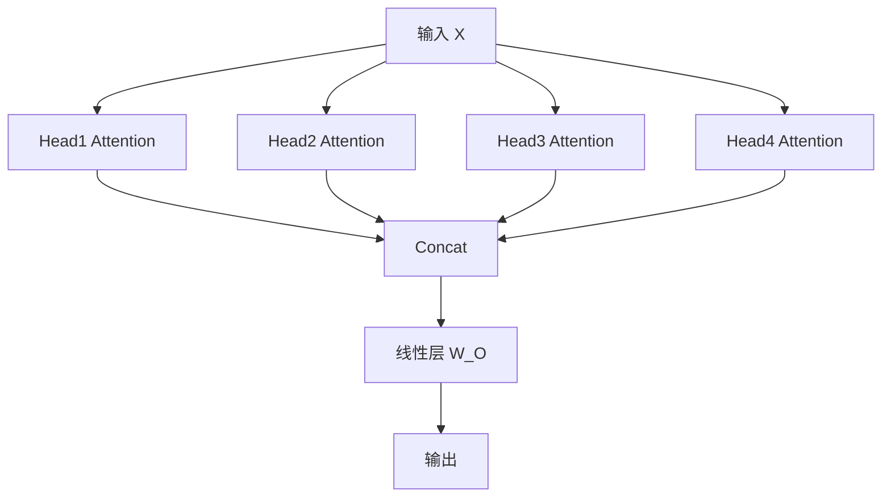
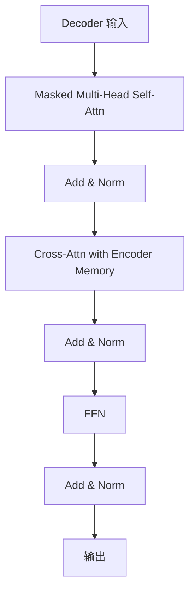
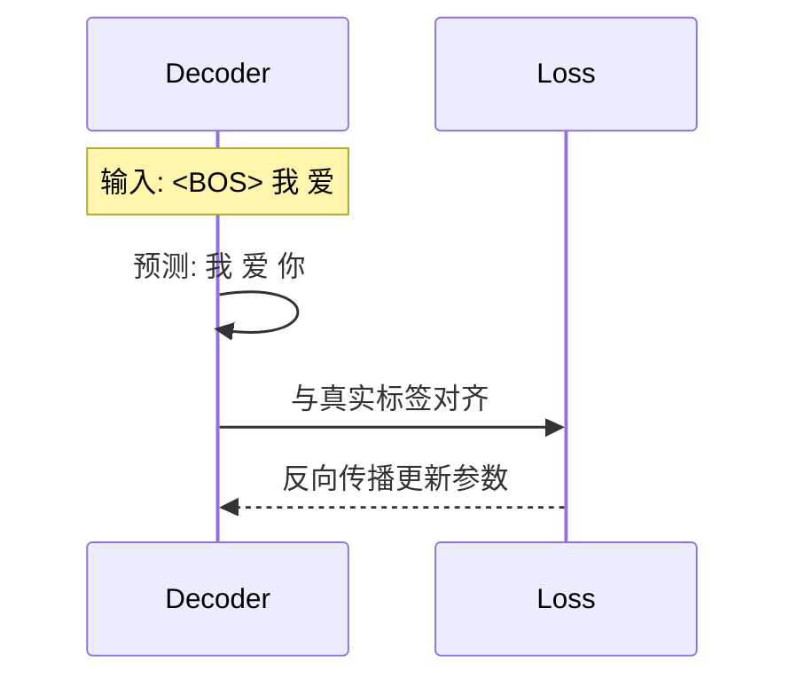

Transformer 是现代 LLM 的核心架构。很多同学“知道它很重要”，但一到公式、维度、训练流程就容易卡住。

这篇文章目标很明确：

1. 讲清楚 Transformer 为什么出现。
2. 讲清楚每个模块到底在做什么。
3. 讲清楚从论文到工程实现的关键细节。

你可以把它当作一份“从入门到可实战”的一站式笔记。

## 1. 为什么需要 Transformer？

在 Transformer 之前，NLP 主要依赖 RNN/LSTM。它们能处理序列，但有两个硬伤：

- 串行计算：第 `t` 步必须等第 `t-1` 步，GPU 并行能力很难吃满。
- 长距离依赖难：句子很长时，早期信息容易衰减。

下面这张图可以直观看到差异：



一句话总结：**Transformer 用注意力机制替代循环结构，实现并行计算和全局建模。**

## 2. 一图看懂整体架构

原始 Transformer（2017）是 Encoder-Decoder 结构，机器翻译是它的典型场景。



一个标准块内部是：

- 多头注意力（Multi-Head Attention）
- 残差连接（Residual）
- 层归一化（LayerNorm）
- 前馈网络（FFN）

## 3. 输入层：Token、Embedding、位置编码

Transformer 看到的不是文字本身，而是向量矩阵 `X`。

### 3.1 维度约定

| 符号 | 含义 | 示例 |
| --- | --- | --- |
| `B` | batch size | 8 |
| `n` | 序列长度 | 128 |
| `d_model` | 隐藏维度 | 512/768/1024 |
| `h` | 注意力头数 | 8/12/16 |
| `d_k` | 每头维度 | `d_model / h` |

通常输入张量形状为：`[B, n, d_model]`。

### 3.2 为什么要位置编码？

自注意力本身不区分顺序，如果不给位置信息，
`“我爱你”` 和 `“你爱我”` 在集合层面几乎等价。

经典正弦位置编码：

$$
PE(pos,2i)=\sin\left(pos/10000^{2i/d_{model}}\right)
$$

$$
PE(pos,2i+1)=\cos\left(pos/10000^{2i/d_{model}}\right)
$$

实际工程里常见三类位置方案：

- 绝对位置编码（Sinusoidal/Learned）
- 相对位置编码
- RoPE（旋转位置编码，现代 LLM 常用）

## 4. 注意力机制：Transformer 的心脏

注意力的核心公式：

$$
Attention(Q,K,V)=softmax\left(\frac{QK^T}{\sqrt{d_k}}+M\right)V
$$

其中：

- `Q`（Query）：我在找什么。
- `K`（Key）：我能提供什么索引。
- `V`（Value）：我真正携带的内容。
- `M`：mask（例如 padding mask、causal mask）。

### 4.1 单头注意力完整流程

```mermaid
flowchart LR
  X[输入 X] --> WQ[线性层 W_Q]
  X --> WK[线性层 W_K]
  X --> WV[线性层 W_V]
  WQ --> Q[Q]
  WK --> K[K]
  WV --> V[V]
  Q --> S[QK^T / sqrt(d_k)]
  K --> S
  S --> addm[加 Mask]
  addm --> sm[Softmax]
  sm --> W[注意力权重]
  W --> O[加权求和 V]
  V --> O
```

### 4.2 为什么要除以 `sqrt(d_k)`？

点积的方差会随维度增长而增大，直接送入 softmax 容易过于尖锐，梯度变差。
除以 `sqrt(d_k)` 可以让数值更稳定，训练更平滑。

### 4.3 Mask 有两种

| Mask 类型 | 作用 | 常见场景 |
| --- | --- | --- |
| Padding Mask | 忽略补齐位 | Encoder/Decoder 都会用 |
| Causal Mask | 只能看见历史位置 | Decoder 自回归生成 |

Causal Mask 示意：



## 5. 多头注意力：让模型“多视角理解”

单头注意力像一台摄像机，多头注意力像多台不同焦段摄像机并行拍摄。



多头公式：

$$
head_i = Attention(XW_i^Q, XW_i^K, XW_i^V)
$$

$$
MultiHead(X)=Concat(head_1,...,head_h)W^O
$$

直觉上，不同 head 会偏向关注不同关系：

- 语法依赖（主谓一致）
- 指代关系（“它”指谁）
- 远距离语义关联（句首与句尾）

## 6. 前馈网络、残差、归一化

### 6.1 Position-wise FFN

FFN 逐位置独立计算：

$$
FFN(x)=W_2\sigma(W_1x+b_1)+b_2
$$

常见设置：`d_model -> d_ff -> d_model`，其中 `d_ff` 通常是 `4 * d_model`。

### 6.2 残差连接 + LayerNorm

每个子层外都有：

$$
y = LayerNorm(x + Sublayer(x))
$$

作用：

- 残差让深层网络更易训练。
- LayerNorm 稳定激活分布，加速收敛。

## 7. Encoder 与 Decoder 到底差在哪？

| 模块 | Self-Attention | Cross-Attention | 用途 |
| --- | --- | --- | --- |
| Encoder | 无因果掩码，可看全句 | 无 | 编码输入语义 |
| Decoder | 有因果掩码，只看历史 | 有（Q 来自 Decoder，K/V 来自 Encoder） | 自回归生成输出 |

Decoder Block 示意：



## 8. 训练与推理：流程不一样

### 8.1 训练（Teacher Forcing）

训练时把真实目标序列右移一位输入 Decoder，让模型预测下一个词。



### 8.2 推理（自回归生成）

推理时没有真实后续 token，只能一步步生成：

1. 输入 `<BOS>`。
2. 预测 token1，拼回输入。
3. 再预测 token2。
4. 重复直到 `<EOS>` 或达到长度上限。

工程上常配合 `KV Cache`，避免每步重复计算全部历史 K/V。

## 9. 复杂度对比：Transformer 为什么“又快又贵”

设序列长度为 `n`，隐藏维度为 `d`。

| 架构 | 单层时间复杂度 | 并行性 | 长程依赖路径长度 |
| --- | --- | --- | --- |
| RNN | `O(n*d^2)` | 低 | `O(n)` |
| CNN（卷积序列模型） | `O(k*n*d^2)` | 中 | `O(log_k n)`（堆叠后） |
| Self-Attention | `O(n^2*d)` | 高 | `O(1)` |

结论：

- Transformer 在长序列上 `n^2` 成本高（尤其显存）。
- 但并行效率高、路径短、效果强，成为主流。

## 10. 一个极简“维度流动”示例

假设：`B=2, n=4, d_model=8, h=2, d_k=4`。

| 步骤 | 张量形状 |
| --- | --- |
| 输入 `X` | `[2,4,8]` |
| 线性映射 `Q,K,V` | `[2,4,8]` |
| 拆头后 `Q,K,V` | `[2,2,4,4]` |
| 注意力分数 `QK^T` | `[2,2,4,4]` |
| 权重乘 `V` 后 | `[2,2,4,4]` |
| 拼接 heads | `[2,4,8]` |
| 输出投影 | `[2,4,8]` |

只要这张表你能顺下来，Transformer 的实现就不再神秘。

## 11. 从 Transformer 到现代 LLM

经典 Transformer 是 Encoder-Decoder，但现代 LLM 大多采用 Decoder-only：

- BERT：Encoder-only（擅长理解）
- GPT：Decoder-only（擅长生成）
- T5：Encoder-Decoder（通用文本到文本）

虽然形态有差异，但底层仍是注意力 + FFN + 残差归一化这条主线。

## 12. 工程实践中的高频坑

1. 注意力 mask 维度错位，导致模型“偷看未来”。
2. 忘记缩放或数值稳定处理，softmax 溢出。
3. 长序列显存爆炸，没有开启混合精度或梯度检查点。
4. 推理未使用 KV Cache，延迟过高。
5. 训练集 tokenization 与推理不一致，效果明显下滑。

## 13. 一段极简伪代码（帮助建立代码感）

```python
# x: [B, n, d_model]
q = x @ Wq
k = x @ Wk
v = x @ Wv

q = split_heads(q)  # [B, h, n, d_k]
k = split_heads(k)
v = split_heads(v)

scores = (q @ k.transpose(-2, -1)) / sqrt(d_k)
scores = scores + mask
attn = softmax(scores, dim=-1)
out = attn @ v  # [B, h, n, d_k]

out = merge_heads(out)  # [B, n, d_model]
out = out @ Wo
```

## 14. 总结

Transformer 最核心的思想其实只有三句话：

1. 用注意力替代循环，让序列建模并行化。
2. 用多头机制学习多种关系，用 FFN 增强非线性表达。
3. 用残差和归一化稳定训练，把网络堆深做强。

如果你接下来要学习 LLM、RAG、Agent，Transformer 这套机制是必修课。把“公式、维度、流程”三件事彻底打通，你的上手速度会快很多。

## 参考资料

1. Vaswani et al., *Attention Is All You Need* (2017)
   [https://arxiv.org/abs/1706.03762](https://arxiv.org/abs/1706.03762)
2. Illustrated Transformer (Jay Alammar)
   [https://jalammar.github.io/illustrated-transformer/](https://jalammar.github.io/illustrated-transformer/)
3. The Annotated Transformer (Harvard NLP)
   [https://nlp.seas.harvard.edu/2018/04/03/attention.html](https://nlp.seas.harvard.edu/2018/04/03/attention.html)
4. Devlin et al., *BERT* (2018)
   [https://arxiv.org/abs/1810.04805](https://arxiv.org/abs/1810.04805)
5. Brown et al., *GPT-3* (2020)
   [https://arxiv.org/abs/2005.14165](https://arxiv.org/abs/2005.14165)
