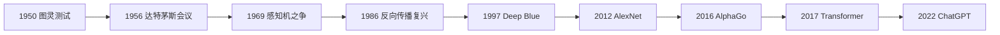

各位读者，欢迎来到 AI 发展史展馆。

这不是某个单点技术教程，而是一幅跨越七十余年的全景地图。在这条时间轴上，AI 发展从来不是线性上升，而是多次经历了：**理想高涨 → 工程受挫 → 方法突变 → 产业爆发** 的循环。

每一轮"突变"，几乎都对应一次范式变化。而每一次"冬天"，都为下一轮爆发积蓄了关键力量。

## 全景时间线

如果把这张图浓缩成一句话：**AI 从"机器能否思考"的哲学问题，走到了"如何可规模化交付"的系统工程问题。**

## 四大阶段

在进入具体展厅之前，先把七十余年划分为四个大阶段，建立整体框架：

**阶段一：问题提出与学科诞生（1950-1960s）** — 回答"机器是否可能拥有智能"。图灵测试提出行为可判别标准，达特茅斯会议正式确立人工智能学科。

**阶段二：符号主义探索与早期低谷（1960s-1980s）** — 特点是"规则系统很强，但泛化很弱"。感知机争议暴露线性模型边界，算力和数据规模不足导致第一次 AI 冬天。

**阶段三：统计学习与深度学习崛起（1986-2016）** — 开始出现"可扩展的学习系统"。反向传播重启神经网络研究，GPU + 大数据 + 深层网络带来视觉与语音突破，AlphaGo 证明学习与搜索结合的上限。

**阶段四：基础模型与生成式时代（2017-至今）** — 核心不再是单任务 SOTA，而是"通用能力平台化"。Transformer 成为统一底座，大模型通过预训练实现跨任务迁移，ChatGPT 引爆"人人可用"的 AI 应用范式。

下面，我们从 1950 年开始，逐一进入九个展厅。

---

# 第一展厅：1950 图灵测试 —— 机器智能的起点问题

墙上写着一个看似简单的问题：**机器会思考吗？**

1950 年，艾伦·图灵在《Computing Machinery and Intelligence》中，没有陷入"思维定义学"的无穷争论，而是做了一次极具工程直觉的改写：把"机器是否会思考"替换为"机器在对话行为上能否与人类不可区分"。这就是后来被大众称为"图灵测试"的起点。

## 历史背景：两条线的汇合

二战后，两条线在汇合：一是计算机硬件从"战时工具"走向"通用计算"；二是逻辑学、信息论、控制论等学科对"智能能否形式化"提出新想象。在那个年代，"机器能不能思考"是科学共同体面对新技术时的严肃问题。但"思考"这个词过于抽象，一旦直接讨论，必然陷入语义混战。

图灵非常清楚这一点，所以他做了一件后来被无数工程师反复借鉴的事：**不先争论本体定义，先构造一个可操作的问题。**

## 图灵到底提出了什么？

图灵原始设定来源于"模仿游戏（Imitation Game）"：一位评审通过文本终端与两个对象交流，一个是人，另一个是机器。如果评审在规定对话条件下不能稳定区分机器与人，则机器通过测试。

三个关键设计值得注意：
- **文本通道**：屏蔽外形、声音等非核心因素
- **互动问答**：不是静态题库，而是动态对话
- **概率意义**：不是"永远骗过所有人"，而是达到一定不可区分度

## 图灵测试的深层贡献

很多文章把图灵测试写成"一个经典概念"，但它的历史影响更深：

1. **目标函数层**：AI 研究第一次获得可公开讨论的行为目标
2. **任务定义层**：把语言交互推到智能研究中心位置
3. **学科桥接层**：横跨计算机科学、语言学、心理学、哲学
4. **社会叙事层**：提供了公众能理解的讨论框架——"如果你分不出人和机器，机器是否算智能？"

## 常见误解

- **通过图灵测试 = 拥有意识？** 不。图灵测试衡量行为可区分性，不直接证明主观体验。
- **图灵测试已经过时？** 更准确的说法是：单一图灵测试不足以覆盖现代 AI 全部能力，但它提出的"行为可评估"思想并未过时。今天的多维评测体系，本质上是在它的框架上扩展。
- **图灵测试只考语言花活？** 短轮次或许可以靠话术糊弄，但高质量长对话会逐步拉高门槛，尤其涉及一致性、事实、因果、常识时。

## 从 1950 到 2020s：问题没变，评测变复杂

今天我们有了更复杂的评测体系——知识问答、推理链一致性、多轮对话稳定性、工具调用成功率、安全与对齐能力、多模态理解——但底层仍然在回答图灵当年的核心命题：**机器能否在与人类交互中，展现稳定、可迁移、可解释的智能行为？**

图灵测试不是被替代，而是被分解、细化、工程化了。

## 为什么它是"第一展厅"？

纵观整个 AI 发展史，很多里程碑本质都是"能力实现"，而图灵测试是"问题定义"。达特茅斯会议定义了学科名，感知机之争暴露了能力边界，反向传播恢复了多层学习路径，AlexNet、Transformer、ChatGPT 推动能力爆发——但在这一切之前，图灵先定义了一个核心问题：我们如何在行为上讨论机器智能。

第一展厅必须从图灵开始，不是因为它"最先进"，而是因为它"最奠基"。

**关键遗产**：把"智能"翻译成可评测行为，再把评测结果翻译成工程迭代动作——这套循环至今仍是 AI 工程的核心方法论。

---

# 第二展厅：1956 达特茅斯会议 —— 人工智能学科诞生

如果说图灵提出了一个好问题，那么达特茅斯会议做的是另一件关键事：**把"研究兴趣"升级成"学科工程"**。

1955 年，John McCarthy、Marvin Minsky、Claude Shannon、Nathaniel Rochester 等人提出在 1956 年夏天组织一次研讨会。提案里第一次系统使用了"Artificial Intelligence（人工智能）"这一名称，并做出一个今天看仍然大胆的判断：**智能的每个方面，原则上都可以被精确描述，并由机器模拟。**

## 达特茅斯之前：为什么 AI 需要一次"命名事件"？

在达特茅斯之前，相关工作并不稀缺，问题在于"没有共同语境"。当时存在多条并行路线：逻辑推理路线强调符号与证明，控制论路线强调反馈与行为控制，神经网络路线强调类脑学习，统计与信息路线强调编码与概率。这些路线各自有成果，却缺少共同问题框架——没有共同框架就难形成长期学科生态：课程体系、研究组织、人才培养、资助机制都难以稳定。

达特茅斯会议最大的价值，正是把分散的研究兴趣统一为一门学科。

## 会议提案的野心

提案里有三个关键信号：

1. **命名权**："Artificial Intelligence"这个词把目标聚焦到"机器智能行为"而不是单一技术手段。命名本身就是边界定义。
2. **可分解假设**：提案假设智能可分解为若干可研究子问题——语言、抽象、学习、问题求解、自我改进——使研究任务可规划。
3. **可合作组织**：会议聚集跨领域研究者，明确"这是一个值得长期投入的共同问题域"。

回看当年议题——语言处理、概念抽象、自动推理、神经网络、机器学习、自我改进系统——你会惊讶于其前瞻性。今天的 LLM、Agent、推理模型，在 1956 年的理论版图中就有雏形。当然，雏形不等于路径成熟，当时的讨论更像是"方向地图"而非"施工图纸"。

## 学科诞生的标准

判断一件事是否构成"学科诞生"，可以看四个维度：是否有稳定术语体系、是否有可持续研究问题集合、是否形成跨机构协同网络、是否触发长期资源投入机制。达特茅斯在这四项上都起到了起点作用。

它未必立刻带来技术飞跃，但它决定了"未来几十年会有人持续做这件事"。这是学科诞生的真正含义。

## 达特茅斯之后：繁荣与隐患

会议后，AI 研究进入早期繁荣。很多团队相信"通用智能在可预期时间内可达"，于是形成高密度投入。这股乐观带来积极效果——早期推理系统和知识表示方法快速发展——但也带来隐患：目标设得太快太高，对算力、数据、工程复杂度估计不足，外部预期与真实交付出现时间错配。

这正是后来 AI 冬天的重要背景。达特茅斯既是起点，也埋下了"预期管理"的课题。

## 为什么它没有立刻统一方法？

有人会问：既然已经有"AI"这个共同名字，为什么后面几十年路线仍然分裂（符号主义 vs 连接主义等）？因为达特茅斯统一的是**问题域**，不是**唯一技术解**。符号系统擅长显式规则和可解释推理，神经网络擅长表示学习和模式泛化，统计学习擅长不确定建模。达特茅斯的价值不是裁判谁胜谁负，而是允许这些路线在同一学科框架内竞争演化。

**关键遗产**：先有共同语言，再有共同问题，然后才有共同进步。任何团队只要把这三步做实，就能在技术波动中保持方向稳定。

---

# 第三展厅：1969 感知机之争与第一次 AI 冬天

和前两个展厅的"开创感"不同，这里充满了争论、失望与反思。

很多新读者会问：AI 为什么会有"冬天"？为什么一个看起来前景无限的领域会突然降温？如果要找第一次大规模降温的核心线索，1969 年关于感知机的争论是绕不开的节点。

## 感知机为何曾被寄予厚望？

在 1950-1960 年代，感知机看起来非常"未来感"：不完全依赖手工规则，能从数据中学习；用参数调整实现分类，具备"经验改进"特征；在部分任务上展现了比纯符号系统更灵活的潜力。放在那个年代，这已经足够令人兴奋。

问题在于：早期热情往往会放大"趋势"，忽略"边界"。

## 1969 的关键冲击

Minsky 与 Papert 在《Perceptrons》中对单层感知机进行了系统分析，最著名结论之一是：**单层感知机无法表达 XOR 等非线性可分问题。**

这件事本身是严谨的学术工作，它揭示了特定模型结构的表达上限。按理说，正常学术演进应是"承认边界 → 寻找更强结构"。但历史传播并不总是这么理性。现实中很多人把这件事简化成——"神经网络路线不行"。

这种从"特定前提下结论"滑向"普遍否定"的过程，在今天同样高频发生。比如某模型在某 benchmark 失利，不等于整条技术路线失效。这给我们一个重要警示：一定要区分"结构性瓶颈"与"路线性终局"。

## AI 冬天的系统成因

把 AI 冬天归因给一本书是不准确的。真正成因是多重因素叠加：

1. **技术承诺与交付错配**：早期宣传过于乐观，工程交付远未达到外部期待
2. **算力不足**：即使研究者意识到"需要多层网络"，当时硬件也不支持大规模训练
3. **数据与工具链不足**：缺少大规模标注数据集、成熟优化器、自动微分框架
4. **资助逻辑变化**：当成果兑现周期超出预期，资助机构自然回调投入

所以感知机争议更像"导火索"，而 AI 冬天是"技术、资源、预期三者错位"的系统结果。历史上更致命的往往不是"模型失败"（某结构在特定任务上达不到目标），而是"系统失败"（研发组织、资源配置、预期管理共同失衡）。因为模型失败可以靠技术迭代修复，而系统失败会让整个生态收缩，导致人才与资金链断裂。

## 低谷的正面价值

听起来矛盾，但历史上很多低谷都具有"筛选与沉淀"作用。第一次 AI 冬天至少带来三类长期收益：

1. 促使研究者更重视理论边界与可证明性
2. 倒逼技术路线寻找更强表达能力（多层网络、可微训练）
3. 让学界和产业逐步意识到"预期管理"本身是技术生态的一部分

后来 1986 年反向传播复兴，正是在"理解了单层不足"之后，重新打开了多层网络训练路径。低谷不是终点，而是过滤器——它过滤掉幻想，也过滤掉粗糙方案，留下真正能进入下一阶段的路线。

## XOR 的几何直观与管理启示

感知机之争里最经典的 XOR 例子，其真正价值在于"边界可视化"。几何上，单层线性分类器只能用一条超平面切分空间；XOR 类数据天然不可被单一线性边界分开。这个事实告诉我们：

- 模型结构决定表达天花板
- 训练再久也突破不了结构上限
- 当问题本质不匹配结构时，调参收益极低

对工程管理极其重要的一点：**当团队连续调参却无收益时，应优先怀疑"结构错配"而非"执行不力"。**

**关键遗产**：技术进步从来不只是"更强模型"，更是"更稳系统 + 更准判断 + 更好治理"。这三件事做扎实，周期波动就不再是灾难，而会变成拉开差距的窗口期。

---

# 第四展厅：1986 反向传播复兴 —— 神经网络重获生命

如果说 1969 的感知机争议让神经网络路线陷入低谷，那么 1986 年 Rumelhart、Hinton、Williams 的工作则像一把钥匙：它把"多层网络可训练"这道门重新打开。

## 核心矛盾：知道多层更强，但怎么训练？

在 1980 年代，研究者并不缺"多层结构想法"，真正缺的是稳定训练路径。多层网络参数多，误差传播复杂，仅靠手工调整几乎不可行，没有统一梯度计算机制导致训练成本极高。大家知道"深一点可能更强"，却没有可规模化执行的方法。

反向传播最核心的贡献，就是解决了**多层参数协同更新的工程机制**：前向传播得到预测输出 → 损失计算度量差距 → 按链式法则把输出误差逐层分摊 → 依据梯度下降方向迭代调整。

这套流程的革命性在于：把"全局目标（降低损失）"转成"局部可执行（每层参数如何改）"。用后端比喻来说：像是你有一个跨服务链路的整体 SLA 目标，反向传播给出了一套可计算的方法，把最终指标偏差分解到每个服务节点该如何调优。

## 为什么是"复兴"而不是"诞生"？

历史上反向传播思想并非 1986 年首次出现，但 1986 年的标志意义在于：更系统地阐明了多层网络训练可行性，在可复现实验层面展示了方法效果，让研究共同体重新建立对连接主义路线的信心。它像是把一条曾被怀疑的路线重新点亮，并提供了更清晰的施工图。

## 为什么没有立刻引爆产业？

这是很多学习者困惑的点：既然如此关键，为何真正爆发在 2010 年后？因为当时还缺三大基础设施：算力（CPU 时代训练深层网络成本过高）、数据（缺少 ImageNet 这类大规模高质量标注数据集）、工程工具（缺少成熟自动微分框架、分布式训练体系）。

因此，反向传播在 1986 年更像"核心算法引擎就位"，但高速公路和加油站还没建成。这个模式在技术史上反复出现：算法突破不等于立即产业化，必须看算力、数据、工具链成熟度。

## 对后续技术栈的深远影响

反向传播的影响可以按三层理解：

1. **算法层**：多层可微模型训练成为主航道，卷积网络、循环网络、注意力网络都依赖梯度学习范式
2. **框架层**：现代深度学习框架中的自动微分，本质是反向传播思想的工程化封装。你今天写 `loss.backward()`，调用的是几十年方法演化的结果
3. **产业层**：语音识别、视觉识别、机器翻译、推荐系统等产业能力，几乎都建立在可微训练 + 规模化优化的路径上

## 反向传播也有边界

把反向传播神化同样危险。常见挑战包括：梯度消失与梯度爆炸（尤其深层网络与序列模型）、局部最优与鞍点问题、对初始化与学习率高度敏感、对数据分布与标签噪声敏感。这就是为什么后续会出现一整套训练改进——更好的激活函数、更合理初始化、更稳定优化器、归一化与正则化技术、残差连接与架构创新。你可以把这些理解为"反向传播时代的配套工程学"。

**关键遗产**：可训练性是模型时代的起点，可观测性是工程时代的起点，可治理性是产业时代的起点。从方法到工程再到治理，这条链路贯穿了 1986 到今天的整个 AI 产业演进。

---

# 第五展厅：1997 Deep Blue 击败卡斯帕罗夫

正中央是一张历史照片：1997 年，IBM Deep Blue 战胜国际象棋世界冠军加里·卡斯帕罗夫。这是 AI 历史上极具传播力的时刻——机器第一次在全球聚光灯下击败顶级人类棋手。

## 为什么"下棋"有超高象征意义？

国际象棋长期被视为理性推理与战略思维的典型场景。在社会认知里，象棋常被隐含等同于"智力水平"。所以当机器击败棋王，公众很容易做出强推论：**如果机器能赢最聪明的人类选手，机器是不是已经具备了某种"超人智能"？**

这个推论并不严格，但传播威力极强。技术史的有趣之处在于：公众意义与技术意义不总是一回事。Deep Blue 的真正历史位置，恰恰在这两层意义的交叉点上。

## Deep Blue 的技术本质：不是深度学习，而是系统工程

把 Deep Blue 当作"现代 AI 大模型前身"是常见误解。它更接近经典 AI 与高性能计算协同路线：大规模搜索（minimax、alpha-beta 剪枝）+ 强专家知识注入（评估函数、棋局经验）+ 专用并行硬件支持超高搜索吞吐。

它是**算法搜索能力 + 知识工程 + 专用算力**的系统协同。不是通用认知系统，却是单任务系统工程做到极致的范例。

## 这场胜利真正说明了什么？

1. **封闭规则任务中机器上限可非常高**：在规则完备、状态转移清晰、目标函数明确的任务中，机器可通过规模化搜索与评估稳定逼近甚至超越人类顶级表现
2. **"智能表现"可以由工程组合实现**：突破并不总靠单一理论创新，很多里程碑来自系统工程整合达到临界点
3. **社会预期会被单点事件重塑**：技术上它是特定任务胜利，社会上却触发了"机器能力上限被重新估计"

同样重要的是边界。Deep Blue 并不意味着机器获得通用智能：缺乏跨任务迁移能力，不具备自然语言理解与常识建模，不具备开放世界交互学习能力，高度依赖特定问题结构与工程定制。用今天的话说，Deep Blue 是"单场景 SOTA"，不是"通用基础模型"。

## Deep Blue 与 AlphaGo 的范式对比

虽然都是下棋，但范式不同：Deep Blue 偏"搜索 + 专家规则"，AlphaGo 偏"学习策略 + 搜索协同"。这反映了 AI 技术史一个重要转向：**从"显式知识工程主导"逐步走向"数据与学习驱动主导"**。

## 封闭世界 vs 开放世界

Deep Blue 的经典价值之一是让我们更清楚地区分两类问题：

- **封闭世界**：规则固定、目标清晰、反馈明确 → 搜索与评估可高度工程化
- **开放世界**：规则模糊、目标动态、反馈延迟 → 系统必须处理不完整信息、价值冲突与环境不确定性

当你评估一个 AI 方案时，先判断任务属于哪类：若偏封闭，可优先做强规则与规划系统；若偏开放，需要学习、检索、工具与人类监督协同；若混合任务，应采用分层架构，避免单机制硬扛。这一步判断能显著降低选型失误率。

**关键遗产**：高性能不是唯一目标，安全与可控是同等级目标。如何把复杂问题压缩为可计算系统，并在可控边界内稳定运行——这是所有高价值 AI 工程共同的底层能力。

---

# 第六展厅：2012 AlexNet —— 引爆深度学习浪潮

墙上是一条著名曲线：ImageNet 竞赛错误率在 2012 年出现断崖式下降。很多技术史读者把 2012 年称为"深度学习元年"，虽然这个说法在学术上并不严谨，但它抓住了关键事实：AlexNet 让深度学习从"有潜力路线"变成"主流路线"。

## 为什么偏偏是 2012？

AlexNet 不是凭空出现的。它站在三块基础设施同时成熟的时点：大规模标注数据（ImageNet 提供了足够复杂且规模化的视觉任务）、可用计算平台（GPU 训练能力显著提升）、训练技巧体系（激活函数、正则化、数据增强等工程经验走向可复用）。

这就是技术史常见规律：**真正拐点往往不是"单点发明"，而是"系统组合到达临界"**。

## AlexNet 的技术组合

今天看 AlexNet 的组成会觉得"很多是常识"，但在 2012 年这套组合的工程完成度非常高：更深的卷积网络层级、ReLU 激活加速训练收敛、Dropout 抑制过拟合、数据增强提升泛化能力、双 GPU 并行训练提升吞吐。

这些点单拿出来并非都首创，但 AlexNet 把它们组织成一个在大规模竞赛中压倒性胜出的系统，这一点极其关键。

## ImageNet 冲击的"群体说服"效应

ImageNet 竞赛本身的重要性在于：数据规模大、任务复杂、难靠"技巧投机"过关；评估标准公开、结果可比较；参赛系统多、竞争环境充分。当 AlexNet 显著拉开与传统方法差距时，整个社区很难把它解释为偶然。它等于用公开竞技场的方式，完成了对深度学习路线的一次"群体说服"。

## 冲击远超计算机视觉

AlexNet 的影响是跨领域的：

1. **学术资源重配置**：大量研究者转向深度模型范式
2. **工业基础设施重构**：企业开始建设 GPU 集群、数据标注流程、模型训练平台
3. **人才与组织结构变化**：算法工程师、MLOps、数据工程协同需求快速增长
4. **相邻领域加速转型**：语音识别、NLP、推荐系统纷纷强化深度模型，形成跨领域技术共振

## AlexNet 与"规模法则"的隐性关系

今天我们常讲"模型规模、数据规模、计算规模共同驱动能力提升"，这套叙事的历史根基可以追溯到 AlexNet 时期。AlexNet 的成功让全行业更确信三件事：增大模型可能带来能力跃迁，增大数据可提升泛化上限，增大计算投入能够释放模型潜力。这三点后来被不断放大，最终走向基础模型与大模型时代。

## 它也引发了新问题

每次范式切换都会带来新问题。AlexNet 之后，训练成本迅速上升导致小团队门槛变高，数据质量问题被放大，模型可解释性和可控性开始成为现实工程议题，基准竞赛导向可能与真实业务目标不一致。这些问题在当年看是"后续挑战"，到今天已成为 AI 工程核心议题。

**关键遗产**：当数据、算力、模型和流程形成闭环时，能力会出现非线性跃迁。这句话适用于 2012 年，也适用于今天的大模型与 Agent 时代。

---

# 第七展厅：2016 AlphaGo 时刻 —— AI 进入大众视野

大屏幕循环播放着 2016 年那场全球关注的比赛：AlphaGo 对战李世石。

这场对局在技术史中的位置非常特殊。它不是 AI 第一次在棋类任务中胜出（Deep Blue 更早），但它是 AI 第一次在全球范围内引发如此广泛的公共讨论。它让"人工智能"从科技新闻变成了社会情绪、产业决策与大众想象的共同话题。

## 为什么围棋被视为"最后堡垒"？

在当时主流认知中，围棋相比国际象棋更难直接靠传统穷举搜索攻克：分支因子极高，局面组合爆炸；长程策略与局部博弈耦合复杂；评价函数难以手工精确设计。很多人据此认为围棋高度依赖人类直觉，机器短期难以突破。也正因此，AlphaGo 的胜利才会引发"认知冲击"：它打破了大众对"机器能力天花板"的心理设定。

## AlphaGo 的关键方法：学习与搜索的耦合体系

AlphaGo 的价值在于系统组合，而非单一算法。其核心组件包括：

1. **策略网络**：学习在给定局面下优先考虑哪些落子
2. **价值网络**：评估局面胜率，减少盲目搜索
3. **蒙特卡洛树搜索（MCTS）**：在策略引导下做高效探索
4. **监督学习 + 强化学习**：先学人类棋谱，再通过自我对弈提升

这套组合把"经验学习能力"与"规划搜索能力"融合，既不像纯手工规则，也不是纯黑箱学习，而是一种可扩展的决策体系。

## AlphaGo 证明了什么？

1. 复杂决策任务可通过学习-搜索协同突破
2. 强化学习进入主流视野
3. "自我对弈"成为可行范式——系统不只依赖人类示范，还能通过自博弈持续提高
4. 系统工程能力成为核心竞争力——从模型到算力再到训练管线，AI 项目需要"全栈协同"

## 社会级影响：一场"公共事件"

AlphaGo 的影响远超棋盘：

- **公众层**：普通人首次直观感受到 AI 能力跨越
- **产业层**：企业投资 AI 的意愿和预算显著上升
- **政策层**：多国加速人工智能战略布局
- **教育层**：人才培养与课程体系快速跟进

## AlphaGo 之后的路线外溢

AlphaGo 并未直接等于通用 AI，但它带来了重要方法外溢：搜索与学习结合的思想被广泛借鉴，自博弈与自动生成训练信号受到重视，复杂策略任务中的分层决策成为热点，强化学习在机器人、调度、控制等场景探索加速。

但强化学习产业化为什么没有立刻爆发？因为真实业务环境中反馈噪声高、奖励信号难定义、线上试错成本远高于棋类仿真环境、安全约束限制了"自由探索"。这说明"可在实验室成功"与"可在产业规模化"之间有一道很厚的工程墙。

## 与 Deep Blue 的关键差异

两者都在棋类获胜，但范式不同：Deep Blue 更偏专家规则与搜索工程，AlphaGo 更偏表示学习 + 搜索协同，学习成分更强，方法迁移潜力更大。这标志着 AI 从"规则驱动优势"进一步走向"数据与学习驱动优势"。

## 为什么 AlphaGo 时刻仍被反复提及？

因为它恰好处在三条历史线交汇处：**技术线**（学习与搜索融合达到成熟阈值）、**产业线**（资本与企业开始大规模布局 AI）、**社会线**（大众认知从"AI 很远"变成"AI 已来"）。这种三线共振在技术史中并不常见。

**关键遗产**：在复杂决策问题中，用"学习提先验 + 搜索做校正 + 规则控风险 + 人工做兜底"构建组合智能。这是比"某个算法更强"更有复用价值的历史资产。

---

# 第八展厅：2017 Transformer —— 开启大模型时代底座

正中央的展板只有一行字：**Attention Is All You Need（2017）**。

在 AI 发展史里，这篇论文的地位非常独特。它既不是第一次做序列建模，也不是第一次做注意力机制，但它提供了一个极具扩展性的统一架构，让后续大模型时代具备了可规模化生长的"底座"。如果说 AlexNet 点燃了深度学习工程化浪潮，Transformer 则像是把这股浪潮导入了更宽更深的主航道。

## Transformer 之前：序列建模为什么"又强又难"？

在 2017 年之前，NLP 主流模型长期是 RNN/LSTM/GRU 家族。它们在很多任务上有效，但也有明显瓶颈：顺序依赖强导致并行能力受限，长依赖困难导致信息跨长距离传递时易衰减，训练效率受限难以充分利用 GPU，工程复杂度高对超长序列扩展不友好。

研究者逐渐意识到：如果不能突破"序列串行计算范式"，模型规模上限和训练效率上限都会被卡住。

## 关键突破：把"循环"换成"注意力"

Transformer 最核心的动作，是用自注意力机制替代循环结构。直观理解：RNN 像"一个人按顺序读句子"，自注意力像"句子中每个词同时看其他词并计算关联"。

这种替换带来三重收益：更强并行性（训练吞吐显著提升）、更直接长依赖建模（任意位置可直接交互）、更好扩展性（层数、宽度、头数可系统扩张）。再配合位置编码、残差连接、层归一化、前馈网络，形成一套完整可训练架构。

## 为什么说它是"平台级架构"？

技术史上很多模型创新只在局部任务有效，Transformer 的不同在于它具备"平台特征"：跨任务复用（翻译、摘要、问答、生成都可用）、跨规模扩展（从小模型到超大模型路径连续）、跨模态迁移（文本外延到视觉、语音、多模态）、跨生态统一（训练框架、推理引擎、优化工具链围绕其发展）。

这使它不只是"某个 SOTA 结构"，而是后续行业协作的公共协议层。

## 从 Transformer 到大模型：清晰演化链

2017 之后，演化路径很快显现：BERT 系列推动理解任务范式升级，GPT 系列推动生成任务能力跃迁，T5、PaLM、LLaMA 等体系推动规模与任务统一，多模态架构把文本、图像、语音逐步纳入同一底层思路。这条链路的共同基础，正是 Transformer 的可扩展表示能力与并行训练友好性。

## 成功背后的隐性条件

很多人只看到论文结构，忽略了它能落地的工程条件：高带宽硬件与分布式训练能力、高质量数据清洗与配比策略、稳定优化技巧（学习率调度、梯度裁剪、混合精度）、训练-评估-部署全链路工具体系。架构创新是必要条件，不是充分条件——大规模工程能力决定了"能不能把架构潜力变成真实能力"。

## Transformer 也有边界

在热潮中保持边界认知很重要：自注意力复杂度随序列长度上升明显，长上下文成本高且推理延迟与显存压力大，训练与推理能耗高导致经济成本显著，幻觉、事实一致性、可控性并不会因架构自动解决。所以后续才会出现长上下文优化、稀疏注意力、检索增强（RAG）、蒸馏量化等大量工程路线。

## 它如何改变了"做 AI"的组织方式？

Transformer 影响的不仅是模型，还改变了组织协作形态：研究与工程边界重新分工，公司能力重心转向"模型平台化"而非单点功能开发，人才结构从"算法孤岛"走向"全栈 AI 工程链"。你今天看到的大模型团队组织——训练平台、评测平台、推理平台、应用平台——都可以在这次架构转向中找到根源。

**关键遗产**：架构创新创造可能性，平台工程创造可持续性。只有两者同时成立，技术浪潮才会变成产业浪潮。

---

# 专题：LLM 发展历程 —— 从特征工程到 Agent 化时代

在进入 ChatGPT 展厅之前，有必要专门梳理一条贯穿多个展厅的技术暗线——NLP/LLM 的技术演进。

如果说 Transformer 是"底座架构"，那么 LLM 的发展史就是围绕这个底座不断向上构建能力体系的过程。它并非从 Transformer 才突然开始，而是 NLP 几十年技术累积后的一次集中跃迁。

## 特征工程时代（~2016）

在 2010 年代中期之前，NLP 的主流范式是：人工设计特征（词袋、n-gram、规则模板）→ 训练传统模型（SVM、CRF、朴素贝叶斯等）→ 为不同任务单独建模。

这一阶段的瓶颈很明显：模型对上下文理解浅，泛化能力差，迁移成本高，新任务通常要从头设计特征。

## 深度学习过渡期（2013-2017）

这几年是"从离散特征到连续表示"的关键过渡期。Word2Vec、GloVe 等方法让"词"变成稠密向量，开启了语义表示学习。RNN、LSTM、GRU 成为主力，Seq2Seq 在机器翻译等任务中取得突破。2017 年 Transformer 提出后，NLP 的核心架构开始从"循环网络"转向"自注意力网络"。

这是 LLM 时代真正的起点，因为它提供了更好的并行训练能力、更强的长程依赖建模、可扩展到更大数据和更大参数量的架构基础。

## 预训练范式确立（2018-2020）

这一阶段最重要的变化是：**先在海量文本上做通用预训练，再面向具体任务微调（Pretrain + Finetune）。**

典型里程碑：2018 年 ELMo、BERT、GPT-1；2019 年 GPT-2；2020 年 T5、GPT-3。

这几年的核心成果不是某个单点任务 SOTA，而是范式迁移：模型从"任务特定"走向"通用语言基座"；参数规模、数据规模、算力规模共同驱动性能提升；Scaling Law 思想开始成为行业共识。

## 从"会补全"到"会对话"（2021-2022）

如果说 2018-2020 奠定了"能力上限"，那 2021-2022 解决的是"可用性问题"。关键变化包括：Instruction Tuning 让模型更会"听指令"；RLHF 让输出更贴近人类偏好与安全要求；Prompt Engineering 与 CoT 推理技巧被系统化。

2022 年 11 月，ChatGPT 的发布让 LLM 从研究圈走向大众与产业，成为历史拐点。

## 开源生态与应用框架爆发（2023）

2023 年可以称为 LLM 工程化元年。LLaMA 系列带动开源社区快速追赶，模型训练、微调、部署门槛持续下降。RAG（检索增强生成）成为企业落地主线，缓解幻觉与知识时效问题。Function Calling、工作流编排、向量数据库、模型网关、评测平台逐渐标准化。

## 多模态、推理强化与 Agent 化（2024-2026）

进入 2024 年后，LLM 进入"能力融合期"，几个趋势非常明显：

1. **多模态成为默认能力**：文本、图像、音频、视频逐步在同一模型或系统内协同
2. **推理能力与长上下文持续增强**：模型不再只追求"流畅回答"，而是更强调复杂任务中的分解、规划与验证
3. **Agent 化成为应用主战场**：系统目标从"问答助手"升级为"可执行任务的智能体"——能调用工具（Function Call / MCP），能分工协作（Subagent），能流程编排（Workflow），能持续评测（Harness / Evals）

## 一张时间线速览

| 阶段 | 时间 | 关键关键词 | 本质变化 |
| --- | --- | --- | --- |
| 特征工程时代 | ~2016 | n-gram、SVM、CRF | 任务特定，迁移困难 |
| 深度学习过渡期 | 2013-2017 | Word2Vec、LSTM、Attention、Transformer | 表示学习与架构革新 |
| 预训练范式确立 | 2018-2020 | BERT、GPT-2/3、T5、Scaling Law | 通用语言基座形成 |
| 指令与对齐阶段 | 2021-2022 | Instruction Tuning、RLHF、ChatGPT | 可用性大幅提升 |
| 工程化爆发 | 2023 | 开源模型、RAG、工具链 | 应用落地与平台化 |
| 系统能力竞争 | 2024-2026 | 多模态、推理、Agent、MCP | 从"会说"到"会做" |

## LLM 还在早期

虽然 LLM 已经非常强，但工程上仍有明显挑战：事实可靠性与可验证性，成本、延迟与稳定性平衡，安全、合规与可控性，评测体系与真实业务指标对齐。

这也是为什么今天的重点不再是"只换更大模型"，而是"构建更完整的 AI 系统工程"。真正有竞争力的团队，往往不是只懂模型，而是能把**模型层（Transformer、预训练、微调、对齐）+ 系统层（RAG、工具调用、Workflow、Agent）+ 工程层（评测、观测、治理、成本优化）**三层打通。

---

# 第九展厅：2022 ChatGPT 出圈 —— 生成式 AI 全面产业化

2022 年 11 月，ChatGPT 面向公众开放。AI 进入了一个新阶段：它不再只是论文、实验室系统或企业内部能力，而是成为普通人可直接使用、可高频互动、可立刻感知价值的通用产品。

如果说前面的里程碑大多是"技术圈事件"，那么 ChatGPT 是一次"社会级产品事件"。它改变了用户习惯、企业战略、开发范式，也让"生成式 AI"从技术术语变成产业主轴。

## 为什么是 ChatGPT 出圈，而不是更早的模型？

在 ChatGPT 之前，大模型能力并非空白。GPT-3 等模型已经显示出强生成潜力。但"能力存在"不等于"产品爆发"，中间隔着一整层产品化与对齐工程。

ChatGPT 的关键在于三点同时到位：对话式交互门槛足够低（普通用户无需训练即可上手），指令跟随能力显著提升（用户"说人话"即可获得可用结果），多轮上下文体验相对稳定（形成连续协作感）。这三点让模型能力从"演示惊艳"转向"日常可用"，从而触发规模化传播。

## ChatGPT 不是一个模型，而是一套系统能力

很多人把 ChatGPT 误解为"某个更大的语言模型"。更准确说，它是多层能力叠加：大规模预训练提供通用语言能力，指令微调与对齐机制提升可控交互，产品层对话体验与反馈闭环持续优化，安全策略与系统规则控制风险外溢。

这也是为什么"有模型"不等于"有产品"——工程系统化决定了最终可用性。

## 它改变了哪些基础范式？

1. **软件交互范式**：很多软件从"菜单驱动"转向"意图驱动"。用户不再先找按钮，而是先表达目标
2. **开发范式**：应用开发从"先写规则再处理数据"逐步转向"先利用模型能力再做工具编排"
3. **组织范式**：AI 从创新部门话题变成经营层议题。预算、岗位、流程、合规体系都开始重构
4. **用户范式**："先问 AI，再执行任务"成为普遍行为入口

## 为什么说这是"产业化"而不仅是"流量爆发"？

判断是否产业化，不看热搜看结构变化。ChatGPT 后出现了典型产业信号：各行业快速建立 AI 产品线与平台化能力；模型 API 生态、开源模型生态、工具链生态同步扩张；大量传统软件引入 Copilot 形态形成新商业叙事；AI 人才市场重构，应用工程与模型工程岗位需求激增。这些都说明它不是一次短期流量事件，而是长期产业拐点。

## 随之而来的新挑战

ChatGPT 出圈后，行业很快进入"从可用到可靠"的第二阶段。核心难题集中在：幻觉与事实可靠性，成本与延迟平衡，数据安全与隐私合规，评测体系与真实业务目标对齐，组织流程与责任边界重构。

换句话说，第一阶段比拼"谁先做出来"，第二阶段比拼"谁能稳定做下去"。

## 为什么 2022 是一条分界线？

在本系列时间线上，2022 有分界意义：从"模型能力竞赛"进入"产品与系统竞赛"，从"技术圈增长"进入"全民与全行业增长"，从"研究导向"进入"商业化与治理并重"。

**ChatGPT 不是 AI 历史的终点，而是一个新阶段的入口：技术能力要转化为产品能力，产品能力要转化为组织能力，组织能力要转化为长期治理能力。**

从图灵测试到 ChatGPT，AI 发展史完成了一个关键闭环：从"机器是否会思考"的哲学提问，走到"机器如何稳定参与社会生产"的工程问题。下一阶段的竞争，不再只是"谁更聪明"，而是"谁更可靠、谁更可控、谁更可持续"。

---

# 终章：回望与前瞻

## 贯穿七十年的三条主线

回望这九个展厅，可以提炼出三条贯穿 AI 发展史的主线：

**主线一：从"规则"到"学习"再到"基础模型"**

早期 AI 依赖显式规则与符号推理（Deep Blue 是巅峰），而后统计学习与深度学习让系统能从数据中自动提取模式（AlexNet、AlphaGo），再到 Transformer 开启的基础模型时代，一个模型通过预训练即可跨任务迁移。每一步都让系统更"通用"、更少依赖手工设计。

**主线二：预期与现实的反复博弈**

达特茅斯后的过高预期 → 第一次 AI 冬天，专家系统热潮 → 第二次 AI 冬天，深度学习突破 → 产业化落地，生成式 AI 爆发 → 可靠性挑战。每一次热潮都伴随"过度承诺"，每一次低谷都在纠偏。但长期来看，能力曲线在波动中持续上升。关键在于：**预期增长速度不要超过交付增长速度。**

**主线三：单点能力 → 系统能力 → 平台能力**

图灵测试定义问题，感知机暴露单点边界，反向传播提供训练方法，AlexNet 展示组合工程的力量，AlphaGo 证明多机制协同，Transformer 成为公共底座，ChatGPT 完成产品化闭环。今天的 Agent、RAG、MCP、Workflow，本质上是在继续这条"系统化"路线。

## 给不同角色的阅读建议

- **入门读者**：按时间顺序浏览九个展厅，先建立"历史主线"和关键节点认知
- **算法工程师**：重点看第四、六、七、八展厅和 LLM 专题，把范式迁移串起来理解
- **后端/平台工程师**：关注每个展厅的系统工程启示，尤其是第五、八、九展厅中关于平台化、路由、治理的讨论
- **产品与业务读者**：重点看第七、八、九展厅，理解为何 AI 在近年爆发以及产品化落地的关键环节
- **技术管理者**：关注每个展厅的"关键遗产"和第三展厅的预期管理教训，以及终章的组织能力建议

## 对今天工程实践的核心启示

从七十多年历史中，可以提炼出几个可操作的原则：

1. **先定义问题边界，再选技术栈**：图灵和达特茅斯都在告诉我们，统一问题语言是高效协作的前提
2. **把抽象问题变成可评测任务**：图灵式方法论——定义行为指标 → 收集失败样本 → 分类失败根因 → 设计改进实验 → 比较并沉淀规范
3. **区分"结构性瓶颈"与"路线性终局"**：感知机教训——不要因为单点失败否定整条路线
4. **核心算法与基础设施要匹配**：反向传播、AlexNet、Transformer 的成功都依赖算力、数据、工具链的同步成熟
5. **系统协同常是胜负手**：Deep Blue、AlphaGo、ChatGPT 都不是单点技术胜利，而是多机制系统整合
6. **预期管理是技术能力的一部分**：每次冬天都在提醒——对外承诺要绑定时间与条件，能力边界要同步表达
7. **架构选择要看"可扩展性"而非短期指标**：Transformer 的胜利本质是"扩展曲线更优"

## 组织能力的四个层级

如果你在带领一个 AI 团队，可以用四级模型判断组织成熟度：

1. **概念级**：大家都在谈 AI，但目标模糊
2. **试验级**：有若干 PoC，但缺统一评测和工程规范
3. **平台级**：有统一数据、模型、评测、部署与监控能力
4. **经营级**：AI 能持续贡献业务指标，并有治理闭环

升级路径：先统一术语与任务边界 → 再统一评测协议与复盘机制 → 最后统一平台能力与治理策略。

## 未来展望：下一阶段的关键命题

未来竞争核心将从"模型能力竞赛"进一步转向：

- **可靠性竞赛**：少幻觉、强可控、可验证
- **系统效率竞赛**：低成本、高吞吐、弹性伸缩
- **行业深度竞赛**：垂直知识与流程融合
- **治理能力竞赛**：合规、安全、可审计

ChatGPT 打开了入口，真正的长期胜负将由系统工程与组织能力决定。生成式 AI 的竞争最终会回到基本面：能否稳定交付业务价值，能否在风险边界内持续迭代，能否把经验沉淀为平台能力。

---

## 贯穿全文的一条暗线

最后值得特别指出一条贯穿九个展厅的暗线：**评估方法的演化**。

图灵提出了"行为可判别"的思想；ImageNet 建立了公开基准竞赛的传统；ChatGPT 让"用户日常交互即隐性评测"成为现实。

但评估一直面临三组张力：**离线指标 vs 线上表现**（AlexNet 时代的教训），**单任务精度 vs 综合能力**（从 Deep Blue 到 AlphaGo 的进化），**技术指标 vs 业务价值**（ChatGPT 时代最尖锐的问题）。

解决这三组张力的方向正在形成共识：**多维评测取代单点 benchmark，系统评测取代模型评测，持续评测取代一次性评测。**评测体系本身，正在从"给模型打分"升级为"驱动系统迭代的工程基础设施"。

这可能是图灵留给 AI 领域最长远的礼物——不是某个测试标准，而是"用可验证的方式讨论智能"这一方法论本身。

---

**讲解员的话**

九个展厅走完，如果你只带走一句话，我希望是这一句：**AI 发展史不是一条直线，而是一系列"问题-方法-瓶颈-突破"的循环。每一次低谷都在为下一次爆发积蓄关键力量，每一次高潮都在为下一轮挑战埋下伏笔。**

理解这一规律，你就能在热潮中保持冷静，在低谷中看到机会。

感谢参观 AI 发展史展馆。

## 参考资料

1. Alan Turing, *Computing Machinery and Intelligence* (Mind, 1950)
2. McCarthy et al., *A Proposal for the Dartmouth Summer Research Project on Artificial Intelligence* (1955)
3. Minsky & Papert, *Perceptrons* (1969)
4. Rumelhart, Hinton, Williams, *Learning representations by back-propagating errors* (1986)
5. Campbell, Hoane, Hsu et al., Deep Blue 相关论文与回顾
6. Krizhevsky, Sutskever, Hinton, *ImageNet Classification with Deep Convolutional Neural Networks* (2012)
7. Silver et al., *Mastering the game of Go with deep neural networks and tree search* (2016)
8. Vaswani et al., *Attention Is All You Need* (2017)
9. Devlin et al., *BERT: Pre-training of Deep Bidirectional Transformers* (2018)
10. Brown et al., *Language Models are Few-Shot Learners (GPT-3)* (2020)
11. Ouyang et al., *Training language models to follow instructions with human feedback* (2022)
12. Russell & Norvig, *Artificial Intelligence: A Modern Approach*
13. Nilsson, *The Quest for Artificial Intelligence*
