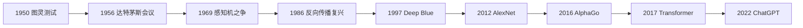

各位读者，欢迎来到"AI 发展史展馆"。

今天这篇不是某个单点技术教程，而是整个系列的"总导览"。你可以把它理解为展馆门口的大地图：先看全貌，再按兴趣进入具体展厅。

在这条时间轴里，我们会看到 AI 发展并不是线性上升，而是多次经历了：

- 理想高涨
- 工程受挫
- 方法突变
- 产业爆发

而每一轮"突变"，几乎都对应一次范式变化。

## 一、先看全景时间线

如果把这张图浓缩成一句话：

**AI 从"能否思考"的哲学问题，走到了"可规模化交付"的系统工程问题。**

## 二、AI 发展史的四个大阶段

### 阶段 1：问题提出与学科诞生（1950-1960s）

这一阶段回答的是：机器是否可能拥有智能？

- 图灵测试提出"行为可判别标准"
- 达特茅斯会议正式提出"人工智能"学科

### 阶段 2：符号主义与早期低谷（1960s-1980s）

这一阶段的特点是"规则系统很强，但泛化很弱"。

- 感知机争议暴露线性模型边界
- 计算资源和数据规模不足导致 AI 冬天

### 阶段 3：统计学习与深度学习崛起（1986-2016）

这一阶段开始出现"可扩展的学习系统"。

- 反向传播重启神经网络研究
- GPU + 大数据 + 深层网络带来视觉与语音突破
- AlphaGo 证明深度学习与搜索结合的上限

### 阶段 4：基础模型与生成式时代（2017-至今）

这一阶段的核心不是单任务 SOTA，而是"通用能力平台化"。

- Transformer 成为统一底座
- 大模型通过预训练实现跨任务迁移
- ChatGPT 引爆"人人可用"的 AI 应用范式

## 三、重大事件目录（扩展篇）

下面这些就是本系列的"分展厅"，每一篇都会用讲解员视角，详细讲"背景-事件-影响-今天的启示"。

1. [1950：图灵测试，AI 的起点问题](./2026-04-10-ai-history-event-turing-test-1950.md)
2. [1956：达特茅斯会议，人工智能学科诞生](./2026-04-10-ai-history-event-dartmouth-conference-1956.md)
3. [1969：感知机之争与第一次 AI 冬天](./2026-04-10-ai-history-event-perceptron-controversy-and-first-ai-winter.md)
4. [1986：反向传播复兴，神经网络重获生命](./2026-04-10-ai-history-event-backpropagation-revival-1986.md)
5. [1997：Deep Blue 击败卡斯帕罗夫，符号与算力的胜利](./2026-04-10-ai-history-event-deep-blue-vs-kasparov-1997.md)
6. [2012：AlexNet 引爆深度学习浪潮](./2026-04-10-ai-history-event-alexnet-deep-learning-breakthrough-2012.md)
7. [2016：AlphaGo 时刻，AI 进入大众视野](./2026-04-10-ai-history-event-alphago-milestone-2016.md)
8. [2017：Transformer 诞生，大模型时代的底座建立](./2026-04-10-ai-history-event-transformer-2017.md)
9. [2022：ChatGPT 出圈，生成式 AI 全面产业化](./2026-04-10-ai-history-event-chatgpt-generative-ai-2022.md)

## 四、如何阅读这个系列

如果你是不同背景，我建议这样读：

- 入门读者：按时间顺序读 1-9，先建立"历史主线"。
- 算法工程师：重点看 4、6、8、9，把范式迁移串起来。
- 产品和业务读者：重点看 7、8、9，理解为何 AI 在近年爆发。

## 五、总导览结语

作为讲解员，我希望你带走的不是"年份背诵"，而是一种历史感：

- 每次技术飞跃都来自"理论 + 工程 + 算力 + 数据 + 场景"的共振。
- 每次泡沫也都来自"预期速度超过工程现实"。
- 今天的大模型并不是终点，而是下一轮系统化创新的起点。

下一站，我们从 1950 年开始，进入第一个展厅：图灵测试。

## 参考资料

1. Turing, A. M. *Computing Machinery and Intelligence* (1950)
2. McCarthy et al. *A Proposal for the Dartmouth Summer Research Project on Artificial Intelligence* (1955)
3. Russell, S. & Norvig, P. *Artificial Intelligence: A Modern Approach*
4. Nilsson, N. *The Quest for Artificial Intelligence*
