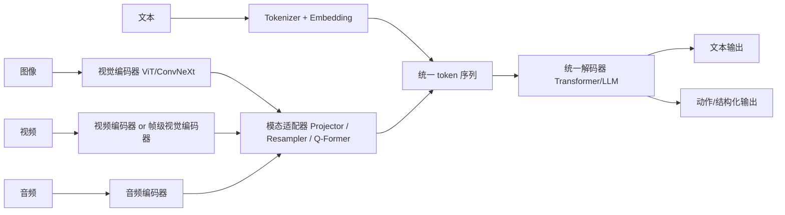
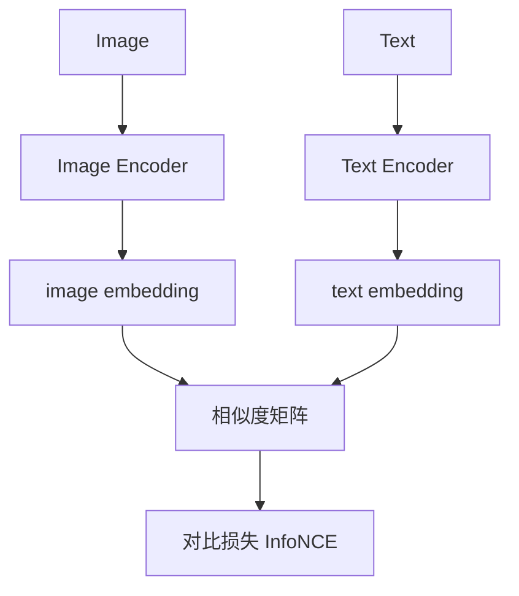
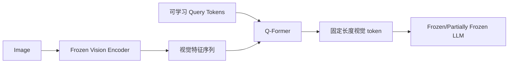
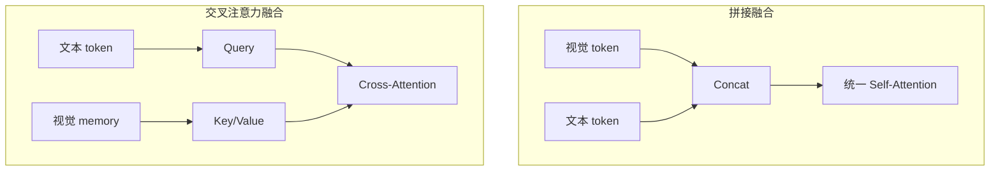
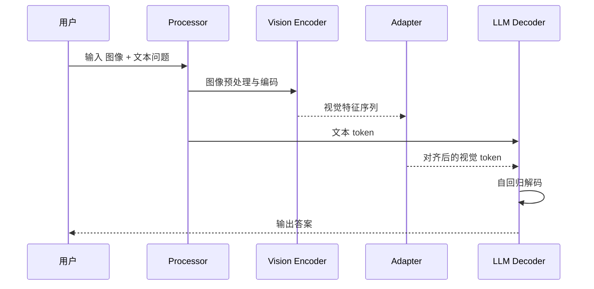

“多模态大模型”看起来很神奇：一边看图，一边理解问题，还能输出长文本推理。

但它的工程本质并不玄学，可以归结成一句话：

**把不同模态（图像、视频、音频等）变成 LLM 能理解的 token/向量，再通过统一的解码器进行条件生成。**

本文会从实现机制出发，深入拆解多模态模型的核心原理、主流架构范式和训练策略，并给出原理图和模型架构图。

## 1. 统一视角：多模态模型到底在做什么？

先看总流程：

这个流程通常分三层：

1. **感知层（Perception）**：用专门编码器提取图像/音频/视频特征。
2. **对齐层（Alignment）**：把跨模态特征映射到语言模型可消费的空间。
3. **生成层（Generation）**：由 LLM 统一做理解、推理和输出。

## 2. 第一性原理：为什么“对齐”是核心难点？

文本 token 本质是离散符号，图像/音频特征是高维连续信号。二者在统计结构上天然不同。

所以多模态模型最关键的问题不是“再堆一个编码器”，而是：

- 如何把视觉/音频特征压缩成有限 token（控制计算量）？
- 如何让这些 token 与语言 token 在同一语义空间可互相注意（attention）？
- 如何避免模型只“看见了特征”却学不会“视觉-语言推理”？

## 3. 三种主流实现范式

### 3.1 双塔对比学习（Dual Encoder）

代表：CLIP [3]。

图像塔和文本塔分别编码，训练目标是“正确图文对相似度更高”。

优点：检索和零样本分类很强；缺点：生成能力弱，不是完整对话式多模态 LLM。

### 3.2 连接器范式（Vision Encoder + Adapter + LLM）

代表：BLIP-2 [5]、LLaVA [6]、Qwen-VL [10]。

典型思路：冻结或半冻结视觉编码器与 LLM，只训练一个“桥接模块”（Projector/Q-Former），把视觉特征对齐到语言空间。

### 3.3 原生统一范式（Unified Multimodal Transformer）

代表：PaLI [8]、Gemini 技术报告 [12]、Qwen2-VL [11]（更偏统一输入范式）。

思路是把多模态 token 更深地纳入统一 Transformer 流程，减少“外挂模块感”，提升跨模态推理一致性。

## 4. 关键模块拆解

### 4.1 视觉 token 化（Visual Tokenization）

视觉输入通常先切 patch，再编码成序列特征（ViT 路线）[2]：

- 输入图像 `H x W x 3`
- 划分为 `P x P` patch
- patch 数量 `N = (H/P) * (W/P)`
- 送入视觉编码器得到 `N x d_v` 特征

问题在于：高分辨率会导致 `N` 急剧增大，推理成本上升。

Qwen2-VL 这类模型引入动态分辨率 token 化策略 [11]，根据输入内容和分辨率动态分配视觉 token 数，缓解固定分辨率带来的浪费。

### 4.2 模态适配器（Projector / Q-Former / Resampler）

这是把视觉特征转为“语言可读表示”的关键层。

### A. 线性/MLP Projector（LLaVA 常见）

`Z_v = MLP(H_v)`，实现简单、成本低，适合快速对齐 [6]。

### B. Q-Former（BLIP-2）

用一组可学习 query 去“查询”冻结视觉特征，输出固定长度视觉 token，再接 LLM [5]。

Q-Former 的价值：把“超长视觉序列”压缩成“可控 token”，显著降低语言侧负担。

### C. Perceiver/Resampler 思路

Flamingo 使用感知重采样模块把视觉信息压缩后，通过门控 cross-attention 插入到语言模型层中 [4][16]。

### 4.3 融合机制（Fusion）

常见两路：

1. **拼接融合**：把视觉 token 与文本 token 拼接成同一序列。
2. **交叉注意力融合**：文本 token 通过 cross-attention 读取视觉 memory。

工程经验上：

- 拼接方式实现更统一，但序列变长更快。
- Cross-attention 更可控，便于插拔，但结构稍复杂。

## 5. 训练是如何分阶段进行的？

大多数多模态 LLM 不会一步到位端到端训练，而是分阶段。

### 5.1 对比学习（ITC）

典型损失（图到文）可写作：

$$
\mathcal{L}_{i2t} = -\frac{1}{N}\sum_{i=1}^{N} \log \frac{\exp(sim(v_i,t_i)/\tau)}{\sum_{j=1}^{N} \exp(sim(v_i,t_j)/\tau)}
$$

通常与 `t2i` 对称项共同优化 [3]。

### 5.2 生成学习（Caption / LM Loss）

让模型在给定视觉条件下预测下一个 token：

$$
\mathcal{L}_{LM} = -\sum_{t} \log p(y_t|y_{<t}, x_{vision}, x_{text})
$$

### 5.3 多任务联合

实际训练常是加权和：

$$
\mathcal{L}=\lambda_1\mathcal{L}_{ITC}+\lambda_2\mathcal{L}_{ITM}+\lambda_3\mathcal{L}_{LM}
$$

其中 `ITM` 是图文匹配二分类损失，常用于增强对齐鲁棒性 [15]。

## 6. 三个代表架构深度对比

### 6.1 Flamingo：跨模态 Few-shot 的代表

核心点：冻结大语言模型 + 视觉编码器，在语言层插入 gated cross-attention 模块 [4]。

优点：上下文示例学习（in-context few-shot）能力强；
代价：训练与实现复杂度高。

### 6.2 BLIP-2：参数高效桥接

核心点：冻结两端（视觉编码器和 LLM），用 Q-Former 作为中间桥 [5]。

优点：训练成本低、迁移强；
代价：桥接瓶颈可能限制极复杂视觉推理上限。

### 6.3 LLaVA / Qwen-VL 路线：工程落地主流

核心点：CLIP/ViT 视觉编码器 + projector + 开源 LLM，再通过视觉指令数据做 SFT [6][10]。

优点：开源生态完善、迭代快；
代价：容易出现视觉幻觉，需持续对齐与评测。

## 7. 从图片问答到答案生成：一次前向过程

如果是视频模型（如 Video-LLaVA [13]），中间会增加“帧采样 + 时序聚合”步骤；
如果是音频模型（如 Whisper 路线用于语音理解 [18]），会先把音频转为声学特征 token 再接语言侧。

## 8. 为什么多模态模型仍然会“看错图”？

常见原因：

1. 视觉 token 压缩过强，细节丢失（尤其文档/OCR小字）。
2. 对齐训练数据偏噪声，模型学到语言先验而非真实视觉证据。
3. 指令微调分布与真实场景分布存在偏移。
4. 评测集过窄，无法覆盖多跳视觉推理。

应对手段：

- 提升高分辨率感知能力（动态分辨率、多尺度裁剪）[11]。
- 增加 grounding 数据（框、区域描述、OCR监督）[10]。
- 使用更严格多模态评测（如 MMMU/MMBench 等）[19][20]。
- 在产品层增加拒答策略、风险分类器和人工复核流程 [17]。

## 9. 设计取舍总表

| 设计点 | 低成本方案 | 高性能方案 | 代价 |
| --- | --- | --- | --- |
| 视觉桥接 | 线性/MLP projector | Q-Former / Resampler / 深层融合 | 参数与训练复杂度上升 |
| 融合方式 | token 拼接 | 分层 cross-attention + gating | 实现复杂度上升 |
| 分辨率策略 | 固定分辨率 | 动态分辨率与多尺度 | 训练和推理调度复杂 |
| 训练路径 | 两阶段（对齐+SFT） | 多阶段联合（对齐+SFT+偏好） | 数据工程和算力投入更大 |
| 模态范围 | 图文 | 图文音视频统一 | token 管理和对齐难度显著增加 |

## 10. 总结

多模态大模型的实现可以浓缩成一个工程闭环：

1. **感知**：把每种模态编码成高质量特征。
2. **对齐**：把跨模态特征压缩并映射到语言空间。
3. **生成**：通过统一 LLM 做条件生成与推理。
4. **对齐再对齐**：用指令数据、偏好数据和安全策略持续修正行为。

从研究趋势看，下一阶段重点会是：

- 更高效的长视频/长音频 token 管理。
- 更强的视觉 grounding 与可验证推理。
- 更统一的“多模态 + 工具调用 + 代理执行”系统能力。

## 参考文献与博客

1. Vaswani et al., *Attention Is All You Need* (2017)
   [https://arxiv.org/abs/1706.03762](https://arxiv.org/abs/1706.03762)
2. Dosovitskiy et al., *An Image is Worth 16x16 Words* (ViT, 2020)
   [https://arxiv.org/abs/2010.11929](https://arxiv.org/abs/2010.11929)
3. Radford et al., *CLIP: Learning Transferable Visual Models From Natural Language Supervision* (2021)
   [https://arxiv.org/abs/2103.00020](https://arxiv.org/abs/2103.00020)
4. Alayrac et al., *Flamingo: a Visual Language Model for Few-Shot Learning* (2022)
   [https://arxiv.org/abs/2204.14198](https://arxiv.org/abs/2204.14198)
5. Li et al., *BLIP-2: Bootstrapping Language-Image Pre-training with Frozen Image Encoders and Large Language Models* (2023)
   [https://arxiv.org/abs/2301.12597](https://arxiv.org/abs/2301.12597)
6. Liu et al., *Visual Instruction Tuning (LLaVA)* (2023)
   [https://arxiv.org/abs/2304.08485](https://arxiv.org/abs/2304.08485)
7. Huang et al., *Language Is Not All You Need: Aligning Perception with Language Models (Kosmos-1)* (2023)
   [https://arxiv.org/abs/2302.14045](https://arxiv.org/abs/2302.14045)
8. Chen et al., *PaLI: A Jointly-Scaled Multilingual Language-Image Model* (2022)
   [https://arxiv.org/abs/2209.06794](https://arxiv.org/abs/2209.06794)
9. Girdhar et al., *ImageBind: One Embedding Space To Bind Them All* (2023)
   [https://arxiv.org/abs/2305.05665](https://arxiv.org/abs/2305.05665)
10. Bai et al., *Qwen-VL: A Versatile Vision-Language Model for Understanding, Localization, Text Reading, and Beyond* (2023)
    [https://arxiv.org/abs/2308.12966](https://arxiv.org/abs/2308.12966)
11. Wang et al., *Qwen2-VL: Enhancing Vision-Language Model's Perception of the World at Any Resolution* (2024)
    [https://arxiv.org/abs/2409.12191](https://arxiv.org/abs/2409.12191)
12. Team et al., *Gemini: A Family of Highly Capable Multimodal Models* (2023)
    [https://arxiv.org/abs/2312.11805](https://arxiv.org/abs/2312.11805)
13. Lin et al., *Video-LLaVA: Learning United Visual Representation by Alignment Before Projection* (2023)
    [https://arxiv.org/abs/2311.10122](https://arxiv.org/abs/2311.10122)
14. Hugging Face Blog, *Vision Language Models Explained* (2024)
    [https://huggingface.co/blog/vlms](https://huggingface.co/blog/vlms)
15. Hugging Face Blog, *A Dive into Vision-Language Models* (2022)
    [https://huggingface.co/blog/vision_language_pretraining](https://huggingface.co/blog/vision_language_pretraining)
16. Google DeepMind Blog, *Tackling multiple tasks with a single visual language model* (Flamingo, 2022)
    [https://deepmind.google/blog/tackling-multiple-tasks-with-a-single-visual-language-model/](https://deepmind.google/blog/tackling-multiple-tasks-with-a-single-visual-language-model/)
17. OpenAI, *GPT-4V(ision) system card* (2023)
   [https://openai.com/index/gpt-4v-system-card/](https://openai.com/index/gpt-4v-system-card/)
18. Radford et al., *Robust Speech Recognition via Large-Scale Weak Supervision* (Whisper, 2022)
    [https://arxiv.org/abs/2212.04356](https://arxiv.org/abs/2212.04356)
19. Yue et al., *MMMU: A Massive Multi-discipline Multimodal Understanding and Reasoning Benchmark for Expert AGI* (2023)
    [https://arxiv.org/abs/2311.16502](https://arxiv.org/abs/2311.16502)
20. Liu et al., *MMBench: Is Your Multi-modal Model an All-around Player?* (2023)
    [https://arxiv.org/abs/2307.06281](https://arxiv.org/abs/2307.06281)
