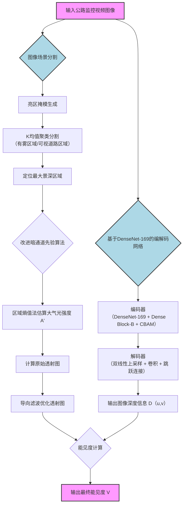

# 引言

当前，能见度获取的主要途径包括人工标识观测、仪器检测和基于视频图像的检测方法[3]。人工标识观测通常由专业人员依据经验来观测放置的标志物，进而估算能见度，但该方法受限于观测者的主观判断和环境条件，效率低且误差较。能见度仪器检测法依赖于散射式或透射式能见度监测仪进行测量，虽然避免了人为因素的影响且精确度显著提升，但其测量范围较小，通常仅能反映局部区域的能见度[4]。此外，该方法的成本较高、安装场景有限，难以满足公路全覆盖检测需求。随着全国高速公路监控网的逐步完善和机器视觉技术的快速发展，基于视频图像的检测方法逐渐成为公路能见度检测的研究热点，该方法主要包括**基于大气散射物理模型的检测方法**和**基于样本数据驱动的检测方法**[5]。

# 基于视频图像的检测方法

## 基于大气散射模型的检测方法

基于大气散射物理模型的能见度检测方法通过大气散射模型研究图像特征信息与能见度之间的关系，推算能见度信息。杨天麟等[6]基于矩形区域测距法和实际场景的物体大小，实现高速公路二维到三维的场景重构，并基于暗通道先验方法计算能见度。廖苗等[7]提出利用雾线先验和霍夫投票估计大气光的想法，并基于图像颜色特征与大气透射系数的关系建立非线性模型。宋海声等[8]引入暗通道先验理论，通过自适应去雾权值优化大气光值，结合自适应滤波窗口获取大气透射系数，并通过车道线首尾端点的透射系数计算大气能见度。此外，Li 等[9]通过比较输入图像与参考图像的透射系数，反演计算大气消光系数以实现能见度估算。这些研究均表明，基于物理模型的方法可以有效利用图像自身特征与大气散射模型的关系实现能见度检测。然而，暗通道先验算法在复杂环境中可能存在误差，需要进一步优化以提高适用

性。

## 基于样本驱动的检测方法

另一方面，基于样本数据驱动的方法依赖深度学习技术，通过对标注图像的大规模训练，学习图像的像素特征与能见度之间的非线性映射关系。例如：Outay等[10]使用预训练的 lexNet 结合非线性支持向量机（SVR）识别能见度；唐绍恩等[11]通过预训练的 VGG16 对图像子区域进行编码，并使用支持向量回归融合权重计算能见度；You 等[12]结合卷积神经网络（CNN）和递归神经网络（RNN），利用全局特征和局部细节从多尺度视角估计能见度。尽管数据驱动方法在特征提取与建模能力上具有优势，但其训练依赖于大规模标注数据集，并可能在实际应用中对样本域外的数据表现不足。

# 理论基础

# 估计方法

## 图像场景分割

## 获取透射系数

## 获取深度信息

# 总结

# 参考文献

[基于编解码深度估计的雾天公路能见度检测方法](/assets/files/ai/bigmodel/fog-visibility-detection/43e6d63295a8ce4f24e22c51a0aa6894.pdf)
