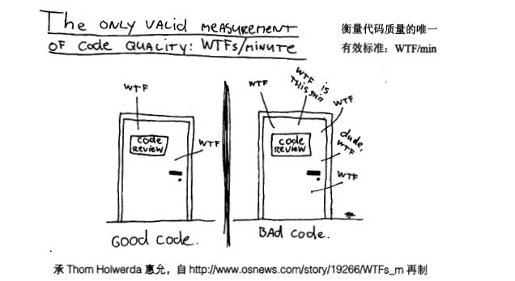

可能是最全的命名规范，建议收藏，文末抽奖福利。

合格的程序员不仅仅是让代码跑起来，而是要做到代码整洁，只满足为了能让编译器通过编译，机器能跑就行而写代码的程序会算不上开发者，码农都不算。

好的命名能体现出代码的特征，含义或者是用途，让阅读者可以根据名称的含义快速厘清程序的脉络。

本篇分享如下代码命名套路来提高我们代码命名：

- 勿模糊，准确达意
- 避免误导
- 做有意义的区分
- 结合上下文简化名称
- 使用可搜索、易读的名称
- 包命名规范
- 类名与方法名规范

# 混乱的代价

我相信每个程序员都被某些人的垃圾代码恶心过，导致开发进度被严重延缓、性能差劲、bug 多。

每次新增和修改代码如履薄冰，我们只有对那堆腐朽的代码了然于胸才敢修改。

随着时间推移，团队生产力下降，所有人都抵触这个项目，对其束手无策。

新手不熟悉原来的场景和设计，不知道如何修改才符合实际意图，导致更容易出现混乱。

最后，开发团队产生了抵触心理并造反了，再也无法忍受在这个垃圾代码基础上做开发，而管理层不愿意投入资源重新设计。

**一个优秀的开发者应该时刻保持代码整洁，无关 deadline。**

为什么会写出垃圾代码呢？

有的人可能会说，需求变化违背了最初的设计、排期太紧没法干好……

其实，这是一种不专业的托词。

推进进度是产品经理他们该干的，虽然痴迷于进度，但是多数产品经理也会期望有良好的可拓展代码以便应对市场变换莫测的需求。

**连海誓山盟的爱情都会变，又如何做到需求不会改变呢？**

所以我们比他们更加重视代码质量，才能应对变化的需求。

**保护代码持续整洁优雅是每个优秀开发者都应该遵守的原则。**

混乱的代码只会拖慢未来的开发进度，唯一加快进度的方法：**始终尽可能保持代码优雅整洁**。

好比医生在做手术之前要先消毒，你说消毒太耗时间了，直接拿刀子整吧。

作为专业的医生你会照做么？

**作为专业的程序员，我们要了解代码变坏的风险并坚持保持代码质量。**

# 什么是整洁代码

代码质量评判需要综合各种因素得到的，我们并不能从单一的维度去评判。

比如代码可读性好，但是空间与时间复杂度高，这并不能算得上是好代码。

好的代码应该具备：**易拓展和维护、简洁（只做好一件事）、可复用性强（没有重复代码）、能快速写出单元测试。可读性强、没有副作用（做了名称以外的工作）。**



## 易拓展和维护

在不破坏原来的代码设计下，可以简单快速的修改和添加代码实现功能拓展。

简单地说就是预留了拓展点，将新代码放在设计的可拓展点，不会因为新增一个功能而改动大量原始代码。

**对修改关闭，对拓展开放，开闭原则。**

对于开发而言，我们维护旧代码的时间超过新项目新代码的时间。

代码的可维护性就变得很重要，也就是说代码分层清晰、模块划分精当，满足高内聚低耦合、抽象出合理的接口，面向接口编程就意味着有较好的可维护性。

同样的代码，熟悉他的资深工程师会觉得很容易维护，而新人因为不熟悉代码，不懂设计模式而无法理解。

所以，易拓展具有主观性，我们需要提高基础技能才有资格说代码是否易拓展和维护。

## 只做好一件事

单一职责：每个函数、每个类、每个模块只专注于一件事。

不要设计大而全的类或者函数，我们需要将他们拆分成更细粒度功能更加单一的类。

它不会隐藏设计者的意图，干净利落的抽象和直截了当的控制语句。

我们应该让每个函数每行代码简单、逻辑清晰。这样的话，类依赖和被依赖的类也会变少，减少耦合度。

需要注意的是，也不能拆分太细，否则就会破坏内聚性。

**高手，就是用最简单的方法去解决复杂问题。**

## 没有重复代码

在开发过程中，我们应该尽可能抽象出「变与不变」，复用已经存在的代码，不要写重复的代码。

比如运用「封装、继承、抽象、多态」特性，代码封装成模块，隐藏变化的细节，暴露不变的接口。

把业务与非业务的代码逻辑分析，抽象成通用的框架、工具类等。

比如应用模板方法设计模式将不变的算法逻辑框架定义出来，把变化的点延迟到子类重写。

## 能快速写成单元测试

代码的可测试性差，比较难写单元测试，那基本上就能说明代码设计得有问题。

试想下，如果一个类大而全，有一个方法依赖了十几个外部对象才能完成工作，耦合严重。

当你在编写单元测试的时候，需要 mock 十几个依赖对象和数据。

那说明这个代码糟透了，需要合理拆分和设计。

## 可读性强

软件设计大师 Martin Fowler 说过：「Any fool can write code that a computer can understand. Good programmers write code that humans can understand.」

翻译成中文就是：“任何二货都会编写计算机能跑的代码。优秀的程序员能够编写人能够理解的代码。”

而可读性就会涉及到编码规范、命名、注释、函数职责是否单一、长度是否精简。

**有数据显示读代码的时间与写代码的时间比例超过 10：1，并且编写当前代码的难度，取决于读周边代码的难度。**

所以我认为可读性强是最重要的一点。

# 高质量命名套路

开发过程后命名随处可见，我们给变量、方法、参数、类、包命名。

而命名的好坏会影响我们的可读性，我们不妨从命名作为切入口来写好代码。

## 勿模糊，准确达意

在开发过程中，一旦发现更好的名称，就换掉旧的。

一个变量、方法、或者类的名称应该展示出它该有的功能。根据名字我们能知道它能做什么事情，如何使用。

**如果一个名称需要大量注释来补充避免使用者跳坑，那就是糟糕的名字。**

1. 变量名体现出该字段作用，比如
LocalDate now = LocaDate.now();
now 标识当前时间。
2. 防止出现让人模糊无法理解，必须还要依据大量上下文才能理解的代码。
3. 不要使用魔术。

### 反例 1 ：使用魔数

```java
// 从数据库获取列表List<String> buyerList = dao.getList();
buyerList.forEach(x -> {
    for (int i = 1; i <= 5; i++) {
        processedBuyerList.add(String.format("%s,%s", i, x));
    }
});
```

你会疑问，为啥索引是从 1 开始？为啥 <= 5。除此之外， i 与 1 极其相似，难以区分。

正确的方式应该使用实际含义的名字让人理解这么写的目的，否则维护的人将痛苦不堪。

### 反例 2：使用生僻字，又臭又长

UltimateAssociatedSubjectRunBatchServiceImpl，当我们看到这样的类名，是不是不知道怎么读，也不知道如何搜索和定位，更不知道到底表达的意思是什么，可能命这个名字的人还以为准确表达，其实是“王大妈的裹脚布，又臭又长”。

原本的业务含义是：执行关联主体任务相关业务类。

鉴于此，我们第一步要避免使用生僻字，可以命名为LinkSubjectServiceImpl ，清晰简单的表达出关联主体的业务逻辑都在该类。

## 不要误导

尽量**不要使用不同之处较小**的名称，这样让他人无法一眼区分两个名称是啥意思。

例如：函数 deleteIndex 和函数deleteIndexEx，这两个函数名区别很小了，加之函数 deleteIndexEx后面Ex还是缩写，也不知道是什么意思，所以他人只能去看函数内容才能明白两者的区别。

4. XYZStringHandler
与
XYZStringStorage
。
5. UserController
与
UserInfoController
。

让人抓狂，他们到底是一个东西还是不同的？差别在哪？没有两年脑血栓写不出这样的。

### 反例 3：名不副实

下面是一个生成文件并提供下载功能的接口。

```java
public void downloadExcel(HttpServletResponse response) {
    List<File> files = listFile();
    String fileName = System.currentTimeMillis() + ".zip";
    DownloadZip.downLoadFiles(files, filePath);
    DownloadZip.fileDownload(response, filePath, fileName);
}
```

我们会疑惑，downLoadFiles 与 fileDownload 到底有啥区别？为啥要调用两次。

这种真的是十年脑血栓才写得出来。

downLoadFiles 的功能是创建将 files 打包成 zip 文件，而 fileDownload则是把指定的文件输出给浏览器下载。

所以 downLoadFiles 应该命名为 createZipFile用于合理区分避免误人子弟。

## 做有意义的区分

```java
getActiveOrder();
getActiveOrderInfo();
getActiveOrderData();
getActiveOrders();
```

上面都是废话命名，别人你怎么知道到底该调用那个方法？

哪个表示订单明细？还是历史订单，还是全部订单查询，废话是另一种没有意义的区分。

**名称不同，意思却无差别。**

Order、OrderInfo、OrderData，他们名称相同 ，意思却无差别，属于**毫无意义的废话**。如果缺少明确约定，变量moneyAmount就与money没区别。

Variable一词永远不应当出现在变量名中。Table一词永远不应当出现在表名中。

## 结合上下文简化名称

```java
public class Order {
    private String orderNum;
    private String orderCreateTime;
    //...}
```

比如 Order类，在该上下文中，没必要给每个成员变量重复添加 order 这个前缀单词，直接命名为 createTime、num。

因为我们可以借助 Order 这个上下文来获取信息。

```java
Order order = new Order();
order.getCreateTime();
```

## 名称易读、可搜索

可读指的是不要使用一些生僻字，难以发音的单词。

可搜索是便于利用 IED 的自动补全和搜索功能，能根据我们的命名规范快速定位想要找的类或者方法等。

### 可读

名称读不出来，在讨论的时候就好像是一个沙雕。

哎，那个「treeNewBeeAxibaKula」类是什么作用？

听到这样的名字尴尬癌都犯了。

使用一些生僻字，犹如「王大妈的裹脚布，又长又臭」，没有两年脑血栓写不出这样的垃圾代码。

### 可搜索

IED 很智能，当我们输入 「Hash」的时候，会列举出所有 Hash 相关的类。

命名的时候最好符合项目命名习惯，列表数据查询大家使用 listXXX，你就不要用 queryXXX，统一命名规范，很重要。

## 包命名

**包名**统一使用**小写**，**点分隔符**之间有且仅有一个自然语义的英文单词或者多个单词自然连接到一块（如 springframework，deepspace 不需要使用任何分割）。

包名的构成可以分为以下几四部分【前缀】 【发起者名】【项目名】【模块名】。

以下表格授权于「Java 填坑笔记」

常见的前缀可以分为以下几种：

| 前缀名 | 例 | 含义 |
| --- | --- | --- |
| indi（或onem ） | indi.发起者名.项目名.模块名.…… | 个体项目，指个人发起，但非自己独自完成的项目，可公开或私有项目，copyright主要属于发起者。 |
| pers | pers.个人名.项目名.模块名.…… | 个人项目，指个人发起，独自完成，可分享的项目，copyright主要属于个人 |
| priv | priv.个人名.项目名.模块名.…… | 私有项目，指个人发起，独自完成，非公开的私人使用的项目，copyright属于个人。 |
| team | team.团队名.项目名.模块名.…… | 团队项目，指由团队发起，并由该团队开发的项目，copyright属于该团队所有 |
| 顶级域名 | com.公司名.项目名.模块名.…… | 公司项目，copyright由项目发起的公司所有 |

## 类名

**类名使用大驼峰命名形式**，应该使用**名词或者名词短语**，比如：Customer、Account。

避免使用 Manager、Processor 等动词。

接口名除了用名词和名词短语以外，还可以使用形容词或形容词短语，如 Cloneable，Callable 等，表示实现该接口的类有某种功能或能力。

| 属性 | 约束 | 例 |
| --- | --- | --- |
| 抽象类 | Abstract 或者 Base 开头 | BaseUserService |
| 枚举类 | Enum 作为后缀 | GenderEnum |
| 工具类 | Utils作为后缀 | StringUtils |
| 异常类 | Exception结尾 | RuntimeException |
| 接口实现类 | 接口名+ ImpI 或者 前缀接口名 + 接口名 | UserService + UserServiceImpl、IUserService + UserService |
| 领域模型相关 | /DO/DTO/VO/DAO | 正例：UserDAO 反例：UserDo， UserDao |
| 设计模式相关类 | Builder，Factory等 | 当使用到设计模式时，需要使用对应的设计模式作为后缀，如ThreadFactory |
| 处理特定功能的 | Handler，Predicate, Validator | 表示处理器，校验器，断言，这些类工厂还有配套的方法名如handle，predicate，validate |
| 测试类 | Test结尾 | UserServiceTest， 表示用来测试UserService类的 |

## 方法名

方法命名一般为**动词或动词短语**，与参数或参数名共同组成动宾短语，即动词 + 名词。一个好的函数名一般能通过名字直接获知该函数实现什么样的功能。

### 布尔返回值的方法

注：Prefix-前缀，Suffix-后缀，Alone-单独使用

| 位置 | 单词 | 意义 | 例 |
| --- | --- | --- | --- |
| Prefix | is | 对象是否符合期待的状态 | isValid |
| Prefix | can | 对象**能否执行**所期待的动作 | canRemove |
| Prefix | should | 调用方执行某个命令或方法是**好还是不好**,**应不应该**，或者说**推荐还是不推荐** | shouldMigrate |
| Prefix | has | 对象**是否持有**所期待的数据和属性 | hasObservers |
| Prefix | needs | 调用方**是否需要**执行某个命令或方法 | needsMigrate |

### 按需执行的方法

| 位置 | 单词 | 意义 | 例 |
| --- | --- | --- | --- |
| Suffix | IfNeeded | 需要的时候执行，不需要的时候什么都不做 | drawIfNeeded |
| Prefix | might | 同上 | mightCreate |
| Prefix | try | 尝试执行，失败时抛出异常或是返回errorcode | tryCreate |
| Suffix | OrDefault | 尝试执行，失败时返回默认值 | getOrDefault |
| Suffix | OrElse | 尝试执行、失败时返回实际参数中指定的值 | getOrElse |
| Prefix | force | 强制尝试执行。error抛出异常或是返回值 | forceCreate, forceStop |

### 用来检查的方法

| 单词 | 意义 | 例 |
| --- | --- | --- |
| ensure | 检查是否为期待的状态，不是则抛出异常或返回error code | ensureCapacity |
| validate | 检查是否为正确的状态，不是则抛出异常或返回error code | validateInputs |

### 异步相关方法

| 位置 | 单词 | 意义 | 例 |
| --- | --- | --- | --- |
| Prefix | blocking | 线程阻塞方法 | blockingGetUser |
| Suffix | InBackground | 执行在后台的线程 | doInBackground |
| Suffix | Async | 异步方法 | sendAsync |
| Suffix | Sync | 对应已有异步方法的同步方法 | sendSync |
| Prefix or Alone | schedule | Job和Task放入队列 | schedule, scheduleJob |
| Prefix or Alone | post | 同上 | postJob |
| Prefix or Alone | execute | 执行异步方法（注：我一般拿这个做同步方法名） | execute, executeTask |
| Prefix or Alone | start | 同上 | start, startJob |
| Prefix or Alone | cancel | 停止异步方法 | cancel, cancelJob |
| Prefix or Alone | stop | 同上 | stop, stopJob |

### 回调方法

| 位置 | 单词 | 意义 | 例 |
| --- | --- | --- | --- |
| Prefix | on | 事件发生时执行 | onCompleted |
| Prefix | before | 事件发生前执行 | beforeUpdate |
| Prefix | pre | 同上 | preUpdate |
| Prefix | will | 同上 | willUpdate |
| Prefix | after | 事件发生后执行 | afterUpdate |
| Prefix | post | 同上 | postUpdate |
| Prefix | did | 同上 | didUpdate |
| Prefix | should | 确认事件是否可以发生时执行 | shouldUpdate |

### 操作对象生命周期的方法

| 单词 | 意义 | 例 |
| --- | --- | --- |
| initialize | 初始化。也可作为延迟初始化使用 | initialize |
| pause | 暂停 | onPause ，pause |
| stop | 停止 | onStop，stop |
| abandon | 销毁的替代 | abandon |
| destroy | 同上 | destroy |
| dispose | 同上 | dispose |

### 4.7 与集合操作相关的方法

| 单词 | 意义 | 例 |
| --- | --- | --- |
| contains | 是否持有与指定对象相同的对象 | contains |
| add | 添加 | addJob |
| append | 添加 | appendJob |
| insert | 插入到下标n | insertJob |
| put | 添加与key对应的元素 | putJob |
| remove | 移除元素 | removeJob |
| enqueue | 添加到队列的最末位 | enqueueJob |
| dequeue | 从队列中头部取出并移除 | dequeueJob |
| push | 添加到栈头 | pushJob |
| pop | 从栈头取出并移除 | popJob |
| peek | 从栈头取出但不移除 | peekJob |
| find | 寻找符合条件的某物 | findById |

### 与数据相关的方法

| 单词 | 意义 | 例 |
| --- | --- | --- |
| create | 新创建 | createAccount |
| new | 新创建 | newAccount |
| from | 从既有的某物新建，或是从其他的数据新建 | fromConfig |
| to | 转换 | toString |
| update | 更新既有某物 | updateAccount |
| load | 读取 | loadAccount |
| fetch | 远程读取 | fetchAccount |
| delete | 删除 | deleteAccount |
| remove | 删除 | removeAccount |
| save | 保存 | saveAccount |
| store | 保存 | storeAccount |
| commit | 保存 | commitChange |
| apply | 保存或应用 | applyChange |
| clear | 清除数据或是恢复到初始状态 | clearAll |
| reset | 清除数据或是恢复到初始状态 | resetAll |

### 成对出现的动词

| 单词 | 意义 |
| --- | --- |
| get获取 | set 设置 |
| add 增加 | remove 删除 |
| create 创建 | destory 移除 |
| start 启动 | stop 停止 |
| open 打开 | close 关闭 |
| read 读取 | write 写入 |
| load 载入 | save 保存 |
| create 创建 | destroy 销毁 |
| begin 开始 | end 结束 |
| backup 备份 | restore 恢复 |
| import 导入 | export 导出 |
| split 分割 | merge 合并 |
| inject 注入 | extract 提取 |
| attach 附着 | detach 脱离 |
| bind 绑定 | separate 分离 |
| view 查看 | browse 浏览 |
| edit 编辑 | modify 修改 |
| select 选取 | mark 标记 |
| copy 复制 | paste 粘贴 |
| undo 撤销 | redo 重做 |
| insert 插入 | delete 移除 |
| add 加入 | append 添加 |
| clean 清理 | clear 清除 |
| index 索引 | sort 排序 |
| find 查找 | search 搜索 |
| increase 增加 | decrease 减少 |
| play 播放 | pause 暂停 |
| launch 启动 | run 运行 |
| compile 编译 | execute 执行 |
| debug 调试 | trace 跟踪 |
| observe 观察 | listen 监听 |
| build 构建 | publish 发布 |
| input 输入 | output 输出 |
| encode 编码 | decode 解码 |
| encrypt 加密 | decrypt 解密 |
| compress 压缩 | decompress 解压缩 |
| pack 打包 | unpack 解包 |
| parse 解析 | emit 生成 |
| connect 连接 | disconnect 断开 |
| send 发送 | receive 接收 |
| download 下载 | upload 上传 |
| refresh 刷新 | synchronize 同步 |
| update 更新 | revert 复原 |
| lock 锁定 | unlock 解锁 |
| check out 签出 | check in 签入 |
| submit 提交 | commit 交付 |
| push 推 | pull 拉 |
| expand 展开 | collapse 折叠 |
| begin 起始 | end 结束 |
| start 开始 | finish 完成 |
| enter 进入 | exit 退出 |
| abort 放弃 | quit 离开 |
| obsolete 废弃 | depreciate 废旧 |
| collect 收集 | aggregate 聚集 |

## 总结

命名目的都是为了让代码和工程师进行对话，增强代码的可读性，可维护性。优秀的代码往往能够见名知意。

%23%20%E4%BC%98%E9%9B%85%E6%95%B4%E6%B4%81%E7%9A%84%20Java%20%E4%BB%A3%E7%A0%81%E5%91%BD%E5%90%8D%E6%8A%80%E5%B7%A7%0A%0A%5Btoc%5D%0A%0A%3E%20%0A%3E%20%E5%8F%AF%E8%83%BD%E6%98%AF%E6%9C%80%E5%85%A8%E7%9A%84%E5%91%BD%E5%90%8D%E8%A7%84%E8%8C%83%EF%BC%8C%E5%BB%BA%E8%AE%AE%E6%94%B6%E8%97%8F%EF%BC%8C%E6%96%87%E6%9C%AB%E6%8A%BD%E5%A5%96%E7%A6%8F%E5%88%A9%E3%80%82%0A%0A%0A%E5%90%88%E6%A0%BC%E7%9A%84%E7%A8%8B%E5%BA%8F%E5%91%98%E4%B8%8D%E4%BB%85%E4%BB%85%E6%98%AF%E8%AE%A9%E4%BB%A3%E7%A0%81%E8%B7%91%E8%B5%B7%E6%9D%A5%EF%BC%8C%E8%80%8C%E6%98%AF%E8%A6%81%E5%81%9A%E5%88%B0%E4%BB%A3%E7%A0%81%E6%95%B4%E6%B4%81%EF%BC%8C%E5%8F%AA%E6%BB%A1%E8%B6%B3%E4%B8%BA%E4%BA%86%E8%83%BD%E8%AE%A9%E7%BC%96%E8%AF%91%E5%99%A8%E9%80%9A%E8%BF%87%E7%BC%96%E8%AF%91%EF%BC%8C%E6%9C%BA%E5%99%A8%E8%83%BD%E8%B7%91%E5%B0%B1%E8%A1%8C%E8%80%8C%E5%86%99%E4%BB%A3%E7%A0%81%E7%9A%84%E7%A8%8B%E5%BA%8F%E4%BC%9A%E7%AE%97%E4%B8%8D%E4%B8%8A%E5%BC%80%E5%8F%91%E8%80%85%EF%BC%8C%E7%A0%81%E5%86%9C%E9%83%BD%E4%B8%8D%E7%AE%97%E3%80%82%20%20%0A%0A%E5%A5%BD%E7%9A%84%E5%91%BD%E5%90%8D%E8%83%BD%E4%BD%93%E7%8E%B0%E5%87%BA%E4%BB%A3%E7%A0%81%E7%9A%84%E7%89%B9%E5%BE%81%EF%BC%8C%E5%90%AB%E4%B9%89%E6%88%96%E8%80%85%E6%98%AF%E7%94%A8%E9%80%94%EF%BC%8C%E8%AE%A9%E9%98%85%E8%AF%BB%E8%80%85%E5%8F%AF%E4%BB%A5%E6%A0%B9%E6%8D%AE%E5%90%8D%E7%A7%B0%E7%9A%84%E5%90%AB%E4%B9%89%E5%BF%AB%E9%80%9F%E5%8E%98%E6%B8%85%E7%A8%8B%E5%BA%8F%E7%9A%84%E8%84%89%E7%BB%9C%E3%80%82%0A%0A%E6%9C%AC%E7%AF%87%E5%88%86%E4%BA%AB%E5%A6%82%E4%B8%8B%E4%BB%A3%E7%A0%81%E5%91%BD%E5%90%8D%E5%A5%97%E8%B7%AF%E6%9D%A5%E6%8F%90%E9%AB%98%E6%88%91%E4%BB%AC%E4%BB%A3%E7%A0%81%E5%91%BD%E5%90%8D%EF%BC%9A%0A%0A%3E%20-%20%E5%8B%BF%E6%A8%A1%E7%B3%8A%EF%BC%8C%E5%87%86%E7%A1%AE%E8%BE%BE%E6%84%8F%0A%3E%20%20%20%20%20%0A%3E%20-%20%E9%81%BF%E5%85%8D%E8%AF%AF%E5%AF%BC%0A%3E%20%20%20%20%20%0A%3E%20-%20%E5%81%9A%E6%9C%89%E6%84%8F%E4%B9%89%E7%9A%84%E5%8C%BA%E5%88%86%0A%3E%20%20%20%20%20%0A%3E%20-%20%E7%BB%93%E5%90%88%E4%B8%8A%E4%B8%8B%E6%96%87%E7%AE%80%E5%8C%96%E5%90%8D%E7%A7%B0%0A%3E%20%20%20%20%20%0A%3E%20-%20%E4%BD%BF%E7%94%A8%E5%8F%AF%E6%90%9C%E7%B4%A2%E3%80%81%E6%98%93%E8%AF%BB%E7%9A%84%E5%90%8D%E7%A7%B0%0A%3E%20%20%20%20%20%0A%3E%20-%20%E5%8C%85%E5%91%BD%E5%90%8D%E8%A7%84%E8%8C%83%0A%3E%20%20%20%20%20%0A%3E%20-%20%E7%B1%BB%E5%90%8D%E4%B8%8E%E6%96%B9%E6%B3%95%E5%90%8D%E8%A7%84%E8%8C%83%0A%20%20%20%20%0A%0A%23%20%E6%B7%B7%E4%B9%B1%E7%9A%84%E4%BB%A3%E4%BB%B7%0A%0A%E6%88%91%E7%9B%B8%E4%BF%A1%E6%AF%8F%E4%B8%AA%E7%A8%8B%E5%BA%8F%E5%91%98%E9%83%BD%E8%A2%AB%E6%9F%90%E4%BA%9B%E4%BA%BA%E7%9A%84%E5%9E%83%E5%9C%BE%E4%BB%A3%E7%A0%81%E6%81%B6%E5%BF%83%E8%BF%87%EF%BC%8C%E5%AF%BC%E8%87%B4%E5%BC%80%E5%8F%91%E8%BF%9B%E5%BA%A6%E8%A2%AB%E4%B8%A5%E9%87%8D%E5%BB%B6%E7%BC%93%E3%80%81%E6%80%A7%E8%83%BD%E5%B7%AE%E5%8A%B2%E3%80%81bug%20%E5%A4%9A%E3%80%82%0A%0A%E6%AF%8F%E6%AC%A1%E6%96%B0%E5%A2%9E%E5%92%8C%E4%BF%AE%E6%94%B9%E4%BB%A3%E7%A0%81%E5%A6%82%E5%B1%A5%E8%96%84%E5%86%B0%EF%BC%8C%E6%88%91%E4%BB%AC%E5%8F%AA%E6%9C%89%E5%AF%B9%E9%82%A3%E5%A0%86%E8%85%90%E6%9C%BD%E7%9A%84%E4%BB%A3%E7%A0%81%E4%BA%86%E7%84%B6%E4%BA%8E%E8%83%B8%E6%89%8D%E6%95%A2%E4%BF%AE%E6%94%B9%E3%80%82%0A%0A%E9%9A%8F%E7%9D%80%E6%97%B6%E9%97%B4%E6%8E%A8%E7%A7%BB%EF%BC%8C%E5%9B%A2%E9%98%9F%E7%94%9F%E4%BA%A7%E5%8A%9B%E4%B8%8B%E9%99%8D%EF%BC%8C%E6%89%80%E6%9C%89%E4%BA%BA%E9%83%BD%E6%8A%B5%E8%A7%A6%E8%BF%99%E4%B8%AA%E9%A1%B9%E7%9B%AE%EF%BC%8C%E5%AF%B9%E5%85%B6%E6%9D%9F%E6%89%8B%E6%97%A0%E7%AD%96%E3%80%82%0A%0A%E6%96%B0%E6%89%8B%E4%B8%8D%E7%86%9F%E6%82%89%E5%8E%9F%E6%9D%A5%E7%9A%84%E5%9C%BA%E6%99%AF%E5%92%8C%E8%AE%BE%E8%AE%A1%EF%BC%8C%E4%B8%8D%E7%9F%A5%E9%81%93%E5%A6%82%E4%BD%95%E4%BF%AE%E6%94%B9%E6%89%8D%E7%AC%A6%E5%90%88%E5%AE%9E%E9%99%85%E6%84%8F%E5%9B%BE%EF%BC%8C%E5%AF%BC%E8%87%B4%E6%9B%B4%E5%AE%B9%E6%98%93%E5%87%BA%E7%8E%B0%E6%B7%B7%E4%B9%B1%E3%80%82%0A%0A%E6%9C%80%E5%90%8E%EF%BC%8C%E5%BC%80%E5%8F%91%E5%9B%A2%E9%98%9F%E4%BA%A7%E7%94%9F%E4%BA%86%E6%8A%B5%E8%A7%A6%E5%BF%83%E7%90%86%E5%B9%B6%E9%80%A0%E5%8F%8D%E4%BA%86%EF%BC%8C%E5%86%8D%E4%B9%9F%E6%97%A0%E6%B3%95%E5%BF%8D%E5%8F%97%E5%9C%A8%E8%BF%99%E4%B8%AA%E5%9E%83%E5%9C%BE%E4%BB%A3%E7%A0%81%E5%9F%BA%E7%A1%80%E4%B8%8A%E5%81%9A%E5%BC%80%E5%8F%91%EF%BC%8C%E8%80%8C%E7%AE%A1%E7%90%86%E5%B1%82%E4%B8%8D%E6%84%BF%E6%84%8F%E6%8A%95%E5%85%A5%E8%B5%84%E6%BA%90%E9%87%8D%E6%96%B0%E8%AE%BE%E8%AE%A1%E3%80%82%0A%0A**%E4%B8%80%E4%B8%AA%E4%BC%98%E7%A7%80%E7%9A%84%E5%BC%80%E5%8F%91%E8%80%85%E5%BA%94%E8%AF%A5%E6%97%B6%E5%88%BB%E4%BF%9D%E6%8C%81%E4%BB%A3%E7%A0%81%E6%95%B4%E6%B4%81%EF%BC%8C%E6%97%A0%E5%85%B3%20deadline%E3%80%82**%0A%0A%0A%3E%20%0A%3E%20%E4%B8%BA%E4%BB%80%E4%B9%88%E4%BC%9A%E5%86%99%E5%87%BA%E5%9E%83%E5%9C%BE%E4%BB%A3%E7%A0%81%E5%91%A2%EF%BC%9F%0A%0A%E6%9C%89%E7%9A%84%E4%BA%BA%E5%8F%AF%E8%83%BD%E4%BC%9A%E8%AF%B4%EF%BC%8C%E9%9C%80%E6%B1%82%E5%8F%98%E5%8C%96%E8%BF%9D%E8%83%8C%E4%BA%86%E6%9C%80%E5%88%9D%E7%9A%84%E8%AE%BE%E8%AE%A1%E3%80%81%E6%8E%92%E6%9C%9F%E5%A4%AA%E7%B4%A7%E6%B2%A1%E6%B3%95%E5%B9%B2%E5%A5%BD……%0A%0A%E5%85%B6%E5%AE%9E%EF%BC%8C%E8%BF%99%E6%98%AF%E4%B8%80%E7%A7%8D%E4%B8%8D%E4%B8%93%E4%B8%9A%E7%9A%84%E6%89%98%E8%AF%8D%E3%80%82%0A%0A%E6%8E%A8%E8%BF%9B%E8%BF%9B%E5%BA%A6%E6%98%AF%E4%BA%A7%E5%93%81%E7%BB%8F%E7%90%86%E4%BB%96%E4%BB%AC%E8%AF%A5%E5%B9%B2%E7%9A%84%EF%BC%8C%E8%99%BD%E7%84%B6%E7%97%B4%E8%BF%B7%E4%BA%8E%E8%BF%9B%E5%BA%A6%EF%BC%8C%E4%BD%86%E6%98%AF%E5%A4%9A%E6%95%B0%E4%BA%A7%E5%93%81%E7%BB%8F%E7%90%86%E4%B9%9F%E4%BC%9A%E6%9C%9F%E6%9C%9B%E6%9C%89%E8%89%AF%E5%A5%BD%E7%9A%84%E5%8F%AF%E6%8B%93%E5%B1%95%E4%BB%A3%E7%A0%81%E4%BB%A5%E4%BE%BF%E5%BA%94%E5%AF%B9%E5%B8%82%E5%9C%BA%E5%8F%98%E6%8D%A2%E8%8E%AB%E6%B5%8B%E7%9A%84%E9%9C%80%E6%B1%82%E3%80%82%0A%0A**%E8%BF%9E%E6%B5%B7%E8%AA%93%E5%B1%B1%E7%9B%9F%E7%9A%84%E7%88%B1%E6%83%85%E9%83%BD%E4%BC%9A%E5%8F%98%EF%BC%8C%E5%8F%88%E5%A6%82%E4%BD%95%E5%81%9A%E5%88%B0%E9%9C%80%E6%B1%82%E4%B8%8D%E4%BC%9A%E6%94%B9%E5%8F%98%E5%91%A2%EF%BC%9F**%0A%0A%E6%89%80%E4%BB%A5%E6%88%91%E4%BB%AC%E6%AF%94%E4%BB%96%E4%BB%AC%E6%9B%B4%E5%8A%A0%E9%87%8D%E8%A7%86%E4%BB%A3%E7%A0%81%E8%B4%A8%E9%87%8F%EF%BC%8C%E6%89%8D%E8%83%BD%E5%BA%94%E5%AF%B9%E5%8F%98%E5%8C%96%E7%9A%84%E9%9C%80%E6%B1%82%E3%80%82%0A%0A**%E4%BF%9D%E6%8A%A4%E4%BB%A3%E7%A0%81%E6%8C%81%E7%BB%AD%E6%95%B4%E6%B4%81%E4%BC%98%E9%9B%85%E6%98%AF%E6%AF%8F%E4%B8%AA%E4%BC%98%E7%A7%80%E5%BC%80%E5%8F%91%E8%80%85%E9%83%BD%E5%BA%94%E8%AF%A5%E9%81%B5%E5%AE%88%E7%9A%84%E5%8E%9F%E5%88%99%E3%80%82**%0A%0A%E6%B7%B7%E4%B9%B1%E7%9A%84%E4%BB%A3%E7%A0%81%E5%8F%AA%E4%BC%9A%E6%8B%96%E6%85%A2%E6%9C%AA%E6%9D%A5%E7%9A%84%E5%BC%80%E5%8F%91%E8%BF%9B%E5%BA%A6%EF%BC%8C%E5%94%AF%E4%B8%80%E5%8A%A0%E5%BF%AB%E8%BF%9B%E5%BA%A6%E7%9A%84%E6%96%B9%E6%B3%95%EF%BC%9A**%E5%A7%8B%E7%BB%88%E5%B0%BD%E5%8F%AF%E8%83%BD%E4%BF%9D%E6%8C%81%E4%BB%A3%E7%A0%81%E4%BC%98%E9%9B%85%E6%95%B4%E6%B4%81**%E3%80%82%0A%0A%E5%A5%BD%E6%AF%94%E5%8C%BB%E7%94%9F%E5%9C%A8%E5%81%9A%E6%89%8B%E6%9C%AF%E4%B9%8B%E5%89%8D%E8%A6%81%E5%85%88%E6%B6%88%E6%AF%92%EF%BC%8C%E4%BD%A0%E8%AF%B4%E6%B6%88%E6%AF%92%E5%A4%AA%E8%80%97%E6%97%B6%E9%97%B4%E4%BA%86%EF%BC%8C%E7%9B%B4%E6%8E%A5%E6%8B%BF%E5%88%80%E5%AD%90%E6%95%B4%E5%90%A7%E3%80%82%0A%0A%E4%BD%9C%E4%B8%BA%E4%B8%93%E4%B8%9A%E7%9A%84%E5%8C%BB%E7%94%9F%E4%BD%A0%E4%BC%9A%E7%85%A7%E5%81%9A%E4%B9%88%EF%BC%9F%0A%0A**%E4%BD%9C%E4%B8%BA%E4%B8%93%E4%B8%9A%E7%9A%84%E7%A8%8B%E5%BA%8F%E5%91%98%EF%BC%8C%E6%88%91%E4%BB%AC%E8%A6%81%E4%BA%86%E8%A7%A3%E4%BB%A3%E7%A0%81%E5%8F%98%E5%9D%8F%E7%9A%84%E9%A3%8E%E9%99%A9%E5%B9%B6%E5%9D%9A%E6%8C%81%E4%BF%9D%E6%8C%81%E4%BB%A3%E7%A0%81%E8%B4%A8%E9%87%8F%E3%80%82**%0A%0A%23%20%E4%BB%80%E4%B9%88%E6%98%AF%E6%95%B4%E6%B4%81%E4%BB%A3%E7%A0%81%0A%0A%E4%BB%A3%E7%A0%81%E8%B4%A8%E9%87%8F%E8%AF%84%E5%88%A4%E9%9C%80%E8%A6%81%E7%BB%BC%E5%90%88%E5%90%84%E7%A7%8D%E5%9B%A0%E7%B4%A0%E5%BE%97%E5%88%B0%E7%9A%84%EF%BC%8C%E6%88%91%E4%BB%AC%E5%B9%B6%E4%B8%8D%E8%83%BD%E4%BB%8E%E5%8D%95%E4%B8%80%E7%9A%84%E7%BB%B4%E5%BA%A6%E5%8E%BB%E8%AF%84%E5%88%A4%E3%80%82%0A%0A%E6%AF%94%E5%A6%82%E4%BB%A3%E7%A0%81%E5%8F%AF%E8%AF%BB%E6%80%A7%E5%A5%BD%EF%BC%8C%E4%BD%86%E6%98%AF%E7%A9%BA%E9%97%B4%E4%B8%8E%E6%97%B6%E9%97%B4%E5%A4%8D%E6%9D%82%E5%BA%A6%E9%AB%98%EF%BC%8C%E8%BF%99%E5%B9%B6%E4%B8%8D%E8%83%BD%E7%AE%97%E5%BE%97%E4%B8%8A%E6%98%AF%E5%A5%BD%E4%BB%A3%E7%A0%81%E3%80%82%0A%0A%E5%A5%BD%E7%9A%84%E4%BB%A3%E7%A0%81%E5%BA%94%E8%AF%A5%E5%85%B7%E5%A4%87%EF%BC%9A**%E6%98%93%E6%8B%93%E5%B1%95%E5%92%8C%E7%BB%B4%E6%8A%A4%E3%80%81%E7%AE%80%E6%B4%81%EF%BC%88%E5%8F%AA%E5%81%9A%E5%A5%BD%E4%B8%80%E4%BB%B6%E4%BA%8B%EF%BC%89%E3%80%81%E5%8F%AF%E5%A4%8D%E7%94%A8%E6%80%A7%E5%BC%BA%EF%BC%88%E6%B2%A1%E6%9C%89%E9%87%8D%E5%A4%8D%E4%BB%A3%E7%A0%81%EF%BC%89%E3%80%81%E8%83%BD%E5%BF%AB%E9%80%9F%E5%86%99%E5%87%BA%E5%8D%95%E5%85%83%E6%B5%8B%E8%AF%95%E3%80%82%E5%8F%AF%E8%AF%BB%E6%80%A7%E5%BC%BA%E3%80%81%E6%B2%A1%E6%9C%89%E5%89%AF%E4%BD%9C%E7%94%A8%EF%BC%88%E5%81%9A%E4%BA%86%E5%90%8D%E7%A7%B0%E4%BB%A5%E5%A4%96%E7%9A%84%E5%B7%A5%E4%BD%9C%EF%BC%89%E3%80%82**%0A%0A!%5B26f9359731a7e3605848235af93b26f9.png%5D(en-resource%3A%2F%2Fdatabase%2F7004%3A1)%0A%0A%0A%23%23%20%E6%98%93%E6%8B%93%E5%B1%95%E5%92%8C%E7%BB%B4%E6%8A%A4%0A%0A%E5%9C%A8%E4%B8%8D%E7%A0%B4%E5%9D%8F%E5%8E%9F%E6%9D%A5%E7%9A%84%E4%BB%A3%E7%A0%81%E8%AE%BE%E8%AE%A1%E4%B8%8B%EF%BC%8C%E5%8F%AF%E4%BB%A5%E7%AE%80%E5%8D%95%E5%BF%AB%E9%80%9F%E7%9A%84%E4%BF%AE%E6%94%B9%E5%92%8C%E6%B7%BB%E5%8A%A0%E4%BB%A3%E7%A0%81%E5%AE%9E%E7%8E%B0%E5%8A%9F%E8%83%BD%E6%8B%93%E5%B1%95%E3%80%82%0A%0A%E7%AE%80%E5%8D%95%E5%9C%B0%E8%AF%B4%E5%B0%B1%E6%98%AF%E9%A2%84%E7%95%99%E4%BA%86%E6%8B%93%E5%B1%95%E7%82%B9%EF%BC%8C%E5%B0%86%E6%96%B0%E4%BB%A3%E7%A0%81%E6%94%BE%E5%9C%A8%E8%AE%BE%E8%AE%A1%E7%9A%84%E5%8F%AF%E6%8B%93%E5%B1%95%E7%82%B9%EF%BC%8C%E4%B8%8D%E4%BC%9A%E5%9B%A0%E4%B8%BA%E6%96%B0%E5%A2%9E%E4%B8%80%E4%B8%AA%E5%8A%9F%E8%83%BD%E8%80%8C%E6%94%B9%E5%8A%A8%E5%A4%A7%E9%87%8F%E5%8E%9F%E5%A7%8B%E4%BB%A3%E7%A0%81%E3%80%82%0A%0A**%E5%AF%B9%E4%BF%AE%E6%94%B9%E5%85%B3%E9%97%AD%EF%BC%8C%E5%AF%B9%E6%8B%93%E5%B1%95%E5%BC%80%E6%94%BE%EF%BC%8C%E5%BC%80%E9%97%AD%E5%8E%9F%E5%88%99%E3%80%82**%0A%0A%E5%AF%B9%E4%BA%8E%E5%BC%80%E5%8F%91%E8%80%8C%E8%A8%80%EF%BC%8C%E6%88%91%E4%BB%AC%E7%BB%B4%E6%8A%A4%E6%97%A7%E4%BB%A3%E7%A0%81%E7%9A%84%E6%97%B6%E9%97%B4%E8%B6%85%E8%BF%87%E6%96%B0%E9%A1%B9%E7%9B%AE%E6%96%B0%E4%BB%A3%E7%A0%81%E7%9A%84%E6%97%B6%E9%97%B4%E3%80%82%0A%0A%E4%BB%A3%E7%A0%81%E7%9A%84%E5%8F%AF%E7%BB%B4%E6%8A%A4%E6%80%A7%E5%B0%B1%E5%8F%98%E5%BE%97%E5%BE%88%E9%87%8D%E8%A6%81%EF%BC%8C%E4%B9%9F%E5%B0%B1%E6%98%AF%E8%AF%B4%E4%BB%A3%E7%A0%81%E5%88%86%E5%B1%82%E6%B8%85%E6%99%B0%E3%80%81%E6%A8%A1%E5%9D%97%E5%88%92%E5%88%86%E7%B2%BE%E5%BD%93%EF%BC%8C%E6%BB%A1%E8%B6%B3%E9%AB%98%E5%86%85%E8%81%9A%E4%BD%8E%E8%80%A6%E5%90%88%E3%80%81%E6%8A%BD%E8%B1%A1%E5%87%BA%E5%90%88%E7%90%86%E7%9A%84%E6%8E%A5%E5%8F%A3%EF%BC%8C%E9%9D%A2%E5%90%91%E6%8E%A5%E5%8F%A3%E7%BC%96%E7%A8%8B%E5%B0%B1%E6%84%8F%E5%91%B3%E7%9D%80%E6%9C%89%E8%BE%83%E5%A5%BD%E7%9A%84%E5%8F%AF%E7%BB%B4%E6%8A%A4%E6%80%A7%E3%80%82%0A%0A%E5%90%8C%E6%A0%B7%E7%9A%84%E4%BB%A3%E7%A0%81%EF%BC%8C%E7%86%9F%E6%82%89%E4%BB%96%E7%9A%84%E8%B5%84%E6%B7%B1%E5%B7%A5%E7%A8%8B%E5%B8%88%E4%BC%9A%E8%A7%89%E5%BE%97%E5%BE%88%E5%AE%B9%E6%98%93%E7%BB%B4%E6%8A%A4%EF%BC%8C%E8%80%8C%E6%96%B0%E4%BA%BA%E5%9B%A0%E4%B8%BA%E4%B8%8D%E7%86%9F%E6%82%89%E4%BB%A3%E7%A0%81%EF%BC%8C%E4%B8%8D%E6%87%82%E8%AE%BE%E8%AE%A1%E6%A8%A1%E5%BC%8F%E8%80%8C%E6%97%A0%E6%B3%95%E7%90%86%E8%A7%A3%E3%80%82%0A%0A%E6%89%80%E4%BB%A5%EF%BC%8C%E6%98%93%E6%8B%93%E5%B1%95%E5%85%B7%E6%9C%89%E4%B8%BB%E8%A7%82%E6%80%A7%EF%BC%8C%E6%88%91%E4%BB%AC%E9%9C%80%E8%A6%81%E6%8F%90%E9%AB%98%E5%9F%BA%E7%A1%80%E6%8A%80%E8%83%BD%E6%89%8D%E6%9C%89%E8%B5%84%E6%A0%BC%E8%AF%B4%E4%BB%A3%E7%A0%81%E6%98%AF%E5%90%A6%E6%98%93%E6%8B%93%E5%B1%95%E5%92%8C%E7%BB%B4%E6%8A%A4%E3%80%82%0A%0A%23%23%20%E5%8F%AA%E5%81%9A%E5%A5%BD%E4%B8%80%E4%BB%B6%E4%BA%8B%0A%0A%E5%8D%95%E4%B8%80%E8%81%8C%E8%B4%A3%EF%BC%9A%E6%AF%8F%E4%B8%AA%E5%87%BD%E6%95%B0%E3%80%81%E6%AF%8F%E4%B8%AA%E7%B1%BB%E3%80%81%E6%AF%8F%E4%B8%AA%E6%A8%A1%E5%9D%97%E5%8F%AA%E4%B8%93%E6%B3%A8%E4%BA%8E%E4%B8%80%E4%BB%B6%E4%BA%8B%E3%80%82%0A%0A%E4%B8%8D%E8%A6%81%E8%AE%BE%E8%AE%A1%E5%A4%A7%E8%80%8C%E5%85%A8%E7%9A%84%E7%B1%BB%E6%88%96%E8%80%85%E5%87%BD%E6%95%B0%EF%BC%8C%E6%88%91%E4%BB%AC%E9%9C%80%E8%A6%81%E5%B0%86%E4%BB%96%E4%BB%AC%E6%8B%86%E5%88%86%E6%88%90%E6%9B%B4%E7%BB%86%E7%B2%92%E5%BA%A6%E5%8A%9F%E8%83%BD%E6%9B%B4%E5%8A%A0%E5%8D%95%E4%B8%80%E7%9A%84%E7%B1%BB%E3%80%82%0A%0A%E5%AE%83%E4%B8%8D%E4%BC%9A%E9%9A%90%E8%97%8F%E8%AE%BE%E8%AE%A1%E8%80%85%E7%9A%84%E6%84%8F%E5%9B%BE%EF%BC%8C%E5%B9%B2%E5%87%80%E5%88%A9%E8%90%BD%E7%9A%84%E6%8A%BD%E8%B1%A1%E5%92%8C%E7%9B%B4%E6%88%AA%E4%BA%86%E5%BD%93%E7%9A%84%E6%8E%A7%E5%88%B6%E8%AF%AD%E5%8F%A5%E3%80%82%0A%0A%E6%88%91%E4%BB%AC%E5%BA%94%E8%AF%A5%E8%AE%A9%E6%AF%8F%E4%B8%AA%E5%87%BD%E6%95%B0%E6%AF%8F%E8%A1%8C%E4%BB%A3%E7%A0%81%E7%AE%80%E5%8D%95%E3%80%81%E9%80%BB%E8%BE%91%E6%B8%85%E6%99%B0%E3%80%82%E8%BF%99%E6%A0%B7%E7%9A%84%E8%AF%9D%EF%BC%8C%E7%B1%BB%E4%BE%9D%E8%B5%96%E5%92%8C%E8%A2%AB%E4%BE%9D%E8%B5%96%E7%9A%84%E7%B1%BB%E4%B9%9F%E4%BC%9A%E5%8F%98%E5%B0%91%EF%BC%8C%E5%87%8F%E5%B0%91%E8%80%A6%E5%90%88%E5%BA%A6%E3%80%82%0A%0A%E9%9C%80%E8%A6%81%E6%B3%A8%E6%84%8F%E7%9A%84%E6%98%AF%EF%BC%8C%E4%B9%9F%E4%B8%8D%E8%83%BD%E6%8B%86%E5%88%86%E5%A4%AA%E7%BB%86%EF%BC%8C%E5%90%A6%E5%88%99%E5%B0%B1%E4%BC%9A%E7%A0%B4%E5%9D%8F%E5%86%85%E8%81%9A%E6%80%A7%E3%80%82%0A%0A**%E9%AB%98%E6%89%8B%EF%BC%8C%E5%B0%B1%E6%98%AF%E7%94%A8%E6%9C%80%E7%AE%80%E5%8D%95%E7%9A%84%E6%96%B9%E6%B3%95%E5%8E%BB%E8%A7%A3%E5%86%B3%E5%A4%8D%E6%9D%82%E9%97%AE%E9%A2%98%E3%80%82**%0A%0A%23%23%20%E6%B2%A1%E6%9C%89%E9%87%8D%E5%A4%8D%E4%BB%A3%E7%A0%81%0A%0A%E5%9C%A8%E5%BC%80%E5%8F%91%E8%BF%87%E7%A8%8B%E4%B8%AD%EF%BC%8C%E6%88%91%E4%BB%AC%E5%BA%94%E8%AF%A5%E5%B0%BD%E5%8F%AF%E8%83%BD%E6%8A%BD%E8%B1%A1%E5%87%BA%E3%80%8C%E5%8F%98%E4%B8%8E%E4%B8%8D%E5%8F%98%E3%80%8D%EF%BC%8C%E5%A4%8D%E7%94%A8%E5%B7%B2%E7%BB%8F%E5%AD%98%E5%9C%A8%E7%9A%84%E4%BB%A3%E7%A0%81%EF%BC%8C%E4%B8%8D%E8%A6%81%E5%86%99%E9%87%8D%E5%A4%8D%E7%9A%84%E4%BB%A3%E7%A0%81%E3%80%82%0A%0A%E6%AF%94%E5%A6%82%E8%BF%90%E7%94%A8%E3%80%8C%E5%B0%81%E8%A3%85%E3%80%81%E7%BB%A7%E6%89%BF%E3%80%81%E6%8A%BD%E8%B1%A1%E3%80%81%E5%A4%9A%E6%80%81%E3%80%8D%E7%89%B9%E6%80%A7%EF%BC%8C%E4%BB%A3%E7%A0%81%E5%B0%81%E8%A3%85%E6%88%90%E6%A8%A1%E5%9D%97%EF%BC%8C%E9%9A%90%E8%97%8F%E5%8F%98%E5%8C%96%E7%9A%84%E7%BB%86%E8%8A%82%EF%BC%8C%E6%9A%B4%E9%9C%B2%E4%B8%8D%E5%8F%98%E7%9A%84%E6%8E%A5%E5%8F%A3%E3%80%82%0A%0A%E6%8A%8A%E4%B8%9A%E5%8A%A1%E4%B8%8E%E9%9D%9E%E4%B8%9A%E5%8A%A1%E7%9A%84%E4%BB%A3%E7%A0%81%E9%80%BB%E8%BE%91%E5%88%86%E6%9E%90%EF%BC%8C%E6%8A%BD%E8%B1%A1%E6%88%90%E9%80%9A%E7%94%A8%E7%9A%84%E6%A1%86%E6%9E%B6%E3%80%81%E5%B7%A5%E5%85%B7%E7%B1%BB%E7%AD%89%E3%80%82%0A%0A%E6%AF%94%E5%A6%82%E5%BA%94%E7%94%A8%E6%A8%A1%E6%9D%BF%E6%96%B9%E6%B3%95%E8%AE%BE%E8%AE%A1%E6%A8%A1%E5%BC%8F%E5%B0%86%E4%B8%8D%E5%8F%98%E7%9A%84%E7%AE%97%E6%B3%95%E9%80%BB%E8%BE%91%E6%A1%86%E6%9E%B6%E5%AE%9A%E4%B9%89%E5%87%BA%E6%9D%A5%EF%BC%8C%E6%8A%8A%E5%8F%98%E5%8C%96%E7%9A%84%E7%82%B9%E5%BB%B6%E8%BF%9F%E5%88%B0%E5%AD%90%E7%B1%BB%E9%87%8D%E5%86%99%E3%80%82%0A%0A%23%23%20%E8%83%BD%E5%BF%AB%E9%80%9F%E5%86%99%E6%88%90%E5%8D%95%E5%85%83%E6%B5%8B%E8%AF%95%0A%0A%E4%BB%A3%E7%A0%81%E7%9A%84%E5%8F%AF%E6%B5%8B%E8%AF%95%E6%80%A7%E5%B7%AE%EF%BC%8C%E6%AF%94%E8%BE%83%E9%9A%BE%E5%86%99%E5%8D%95%E5%85%83%E6%B5%8B%E8%AF%95%EF%BC%8C%E9%82%A3%E5%9F%BA%E6%9C%AC%E4%B8%8A%E5%B0%B1%E8%83%BD%E8%AF%B4%E6%98%8E%E4%BB%A3%E7%A0%81%E8%AE%BE%E8%AE%A1%E5%BE%97%E6%9C%89%E9%97%AE%E9%A2%98%E3%80%82%0A%0A%E8%AF%95%E6%83%B3%E4%B8%8B%EF%BC%8C%E5%A6%82%E6%9E%9C%E4%B8%80%E4%B8%AA%E7%B1%BB%E5%A4%A7%E8%80%8C%E5%85%A8%EF%BC%8C%E6%9C%89%E4%B8%80%E4%B8%AA%E6%96%B9%E6%B3%95%E4%BE%9D%E8%B5%96%E4%BA%86%E5%8D%81%E5%87%A0%E4%B8%AA%E5%A4%96%E9%83%A8%E5%AF%B9%E8%B1%A1%E6%89%8D%E8%83%BD%E5%AE%8C%E6%88%90%E5%B7%A5%E4%BD%9C%EF%BC%8C%E8%80%A6%E5%90%88%E4%B8%A5%E9%87%8D%E3%80%82%0A%0A%E5%BD%93%E4%BD%A0%E5%9C%A8%E7%BC%96%E5%86%99%E5%8D%95%E5%85%83%E6%B5%8B%E8%AF%95%E7%9A%84%E6%97%B6%E5%80%99%EF%BC%8C%E9%9C%80%E8%A6%81%20mock%20%E5%8D%81%E5%87%A0%E4%B8%AA%E4%BE%9D%E8%B5%96%E5%AF%B9%E8%B1%A1%E5%92%8C%E6%95%B0%E6%8D%AE%E3%80%82%0A%0A%E9%82%A3%E8%AF%B4%E6%98%8E%E8%BF%99%E4%B8%AA%E4%BB%A3%E7%A0%81%E7%B3%9F%E9%80%8F%E4%BA%86%EF%BC%8C%E9%9C%80%E8%A6%81%E5%90%88%E7%90%86%E6%8B%86%E5%88%86%E5%92%8C%E8%AE%BE%E8%AE%A1%E3%80%82%0A%0A%23%23%20%E5%8F%AF%E8%AF%BB%E6%80%A7%E5%BC%BA%0A%0A%0A%3E%20%0A%3E%20%E8%BD%AF%E4%BB%B6%E8%AE%BE%E8%AE%A1%E5%A4%A7%E5%B8%88%20Martin%20Fowler%20%E8%AF%B4%E8%BF%87%EF%BC%9A%E3%80%8CAny%20fool%20can%20write%20code%20that%20a%20computer%20can%20understand.%20Good%20programmers%20write%20code%20that%20humans%20can%20understand.%E3%80%8D%0A%0A%E7%BF%BB%E8%AF%91%E6%88%90%E4%B8%AD%E6%96%87%E5%B0%B1%E6%98%AF%EF%BC%9A%22%E4%BB%BB%E4%BD%95%E4%BA%8C%E8%B4%A7%E9%83%BD%E4%BC%9A%E7%BC%96%E5%86%99%E8%AE%A1%E7%AE%97%E6%9C%BA%E8%83%BD%E8%B7%91%E7%9A%84%E4%BB%A3%E7%A0%81%E3%80%82%E4%BC%98%E7%A7%80%E7%9A%84%E7%A8%8B%E5%BA%8F%E5%91%98%E8%83%BD%E5%A4%9F%E7%BC%96%E5%86%99%E4%BA%BA%E8%83%BD%E5%A4%9F%E7%90%86%E8%A7%A3%E7%9A%84%E4%BB%A3%E7%A0%81%E3%80%82%E2%80%9D%0A%0A%E8%80%8C%E5%8F%AF%E8%AF%BB%E6%80%A7%E5%B0%B1%E4%BC%9A%E6%B6%89%E5%8F%8A%E5%88%B0%E7%BC%96%E7%A0%81%E8%A7%84%E8%8C%83%E3%80%81%E5%91%BD%E5%90%8D%E3%80%81%E6%B3%A8%E9%87%8A%E3%80%81%E5%87%BD%E6%95%B0%E8%81%8C%E8%B4%A3%E6%98%AF%E5%90%A6%E5%8D%95%E4%B8%80%E3%80%81%E9%95%BF%E5%BA%A6%E6%98%AF%E5%90%A6%E7%B2%BE%E7%AE%80%E3%80%82%0A%0A**%E6%9C%89%E6%95%B0%E6%8D%AE%E6%98%BE%E7%A4%BA%E8%AF%BB%E4%BB%A3%E7%A0%81%E7%9A%84%E6%97%B6%E9%97%B4%E4%B8%8E%E5%86%99%E4%BB%A3%E7%A0%81%E7%9A%84%E6%97%B6%E9%97%B4%E6%AF%94%E4%BE%8B%E8%B6%85%E8%BF%87%2010%EF%BC%9A1%EF%BC%8C%E5%B9%B6%E4%B8%94%E7%BC%96%E5%86%99%E5%BD%93%E5%89%8D%E4%BB%A3%E7%A0%81%E7%9A%84%E9%9A%BE%E5%BA%A6%EF%BC%8C%E5%8F%96%E5%86%B3%E4%BA%8E%E8%AF%BB%E5%91%A8%E8%BE%B9%E4%BB%A3%E7%A0%81%E7%9A%84%E9%9A%BE%E5%BA%A6%E3%80%82**%0A%0A%E6%89%80%E4%BB%A5%E6%88%91%E8%AE%A4%E4%B8%BA%E5%8F%AF%E8%AF%BB%E6%80%A7%E5%BC%BA%E6%98%AF%E6%9C%80%E9%87%8D%E8%A6%81%E7%9A%84%E4%B8%80%E7%82%B9%E3%80%82%0A%0A%23%20%E9%AB%98%E8%B4%A8%E9%87%8F%E5%91%BD%E5%90%8D%E5%A5%97%E8%B7%AF%0A%0A%E5%BC%80%E5%8F%91%E8%BF%87%E7%A8%8B%E5%90%8E%E5%91%BD%E5%90%8D%E9%9A%8F%E5%A4%84%E5%8F%AF%E8%A7%81%EF%BC%8C%E6%88%91%E4%BB%AC%E7%BB%99%E5%8F%98%E9%87%8F%E3%80%81%E6%96%B9%E6%B3%95%E3%80%81%E5%8F%82%E6%95%B0%E3%80%81%E7%B1%BB%E3%80%81%E5%8C%85%E5%91%BD%E5%90%8D%E3%80%82%0A%0A%E8%80%8C%E5%91%BD%E5%90%8D%E7%9A%84%E5%A5%BD%E5%9D%8F%E4%BC%9A%E5%BD%B1%E5%93%8D%E6%88%91%E4%BB%AC%E7%9A%84%E5%8F%AF%E8%AF%BB%E6%80%A7%EF%BC%8C%E6%88%91%E4%BB%AC%E4%B8%8D%E5%A6%A8%E4%BB%8E%E5%91%BD%E5%90%8D%E4%BD%9C%E4%B8%BA%E5%88%87%E5%85%A5%E5%8F%A3%E6%9D%A5%E5%86%99%E5%A5%BD%E4%BB%A3%E7%A0%81%E3%80%82%0A%0A%23%23%20%E5%8B%BF%E6%A8%A1%E7%B3%8A%EF%BC%8C%E5%87%86%E7%A1%AE%E8%BE%BE%E6%84%8F%0A%0A%E5%9C%A8%E5%BC%80%E5%8F%91%E8%BF%87%E7%A8%8B%E4%B8%AD%EF%BC%8C%E4%B8%80%E6%97%A6%E5%8F%91%E7%8E%B0%E6%9B%B4%E5%A5%BD%E7%9A%84%E5%90%8D%E7%A7%B0%EF%BC%8C%E5%B0%B1%E6%8D%A2%E6%8E%89%E6%97%A7%E7%9A%84%E3%80%82%0A%0A%E4%B8%80%E4%B8%AA%E5%8F%98%E9%87%8F%E3%80%81%E6%96%B9%E6%B3%95%E3%80%81%E6%88%96%E8%80%85%E7%B1%BB%E7%9A%84%E5%90%8D%E7%A7%B0%E5%BA%94%E8%AF%A5%E5%B1%95%E7%A4%BA%E5%87%BA%E5%AE%83%E8%AF%A5%E6%9C%89%E7%9A%84%E5%8A%9F%E8%83%BD%E3%80%82%E6%A0%B9%E6%8D%AE%E5%90%8D%E5%AD%97%E6%88%91%E4%BB%AC%E8%83%BD%E7%9F%A5%E9%81%93%E5%AE%83%E8%83%BD%E5%81%9A%E4%BB%80%E4%B9%88%E4%BA%8B%E6%83%85%EF%BC%8C%E5%A6%82%E4%BD%95%E4%BD%BF%E7%94%A8%E3%80%82%0A%0A**%E5%A6%82%E6%9E%9C%E4%B8%80%E4%B8%AA%E5%90%8D%E7%A7%B0%E9%9C%80%E8%A6%81%E5%A4%A7%E9%87%8F%E6%B3%A8%E9%87%8A%E6%9D%A5%E8%A1%A5%E5%85%85%E9%81%BF%E5%85%8D%E4%BD%BF%E7%94%A8%E8%80%85%E8%B7%B3%E5%9D%91%EF%BC%8C%E9%82%A3%E5%B0%B1%E6%98%AF%E7%B3%9F%E7%B3%95%E7%9A%84%E5%90%8D%E5%AD%97%E3%80%82**%0A%0A1.%20%E5%8F%98%E9%87%8F%E5%90%8D%E4%BD%93%E7%8E%B0%E5%87%BA%E8%AF%A5%E5%AD%97%E6%AE%B5%E4%BD%9C%E7%94%A8%EF%BC%8C%E6%AF%94%E5%A6%82%20%C2%A0%60LocalDate%20now%20%3D%20LocaDate.now()%3B%60%20%C2%A0now%20%E6%A0%87%E8%AF%86%E5%BD%93%E5%89%8D%E6%97%B6%E9%97%B4%E3%80%82%0A%20%20%20%20%0A2.%20%E9%98%B2%E6%AD%A2%E5%87%BA%E7%8E%B0%E8%AE%A9%E4%BA%BA%E6%A8%A1%E7%B3%8A%E6%97%A0%E6%B3%95%E7%90%86%E8%A7%A3%EF%BC%8C%E5%BF%85%E9%A1%BB%E8%BF%98%E8%A6%81%E4%BE%9D%E6%8D%AE%E5%A4%A7%E9%87%8F%E4%B8%8A%E4%B8%8B%E6%96%87%E6%89%8D%E8%83%BD%E7%90%86%E8%A7%A3%E7%9A%84%E4%BB%A3%E7%A0%81%E3%80%82%0A%20%20%20%20%0A3.%20%E4%B8%8D%E8%A6%81%E4%BD%BF%E7%94%A8%E9%AD%94%E6%9C%AF%E3%80%82%0A%20%20%20%20%0A%0A%23%23%23%20%E5%8F%8D%E4%BE%8B%201%20%EF%BC%9A%E4%BD%BF%E7%94%A8%E9%AD%94%E6%95%B0%0A%0A%60%60%60java%0A%2F%2F%C2%A0%E4%BB%8E%E6%95%B0%E6%8D%AE%E5%BA%93%E8%8E%B7%E5%8F%96%E5%88%97%E8%A1%A8%20%20%0AList%3CString%3E%C2%A0buyerList%C2%A0%3D%C2%A0dao.getList()%3B%20%20%0AbuyerList.forEach(x%C2%A0-%3E%C2%A0%7B%20%20%0A%C2%A0for%C2%A0(int%C2%A0i%C2%A0%3D%C2%A01%3B%C2%A0i%C2%A0%3C%3D%C2%A05%3B%C2%A0i%2B%2B)%C2%A0%7B%20%20%0A%C2%A0%C2%A0processedBuyerList.add(String.format(%22%25s%2C%25s%22%2C%C2%A0i%2C%C2%A0x))%3B%20%20%0A%C2%A0%7D%20%20%0A%7D)%3B%0A%60%60%60%0A%0A%E4%BD%A0%E4%BC%9A%E7%96%91%E9%97%AE%EF%BC%8C%E4%B8%BA%E5%95%A5%E7%B4%A2%E5%BC%95%E6%98%AF%E4%BB%8E%201%20%E5%BC%80%E5%A7%8B%EF%BC%9F%E4%B8%BA%E5%95%A5%20%3C%3D%205%E3%80%82%E9%99%A4%E6%AD%A4%E4%B9%8B%E5%A4%96%EF%BC%8C%20i%20%E4%B8%8E%201%20%E6%9E%81%E5%85%B6%E7%9B%B8%E4%BC%BC%EF%BC%8C%E9%9A%BE%E4%BB%A5%E5%8C%BA%E5%88%86%E3%80%82%0A%0A%E6%AD%A3%E7%A1%AE%E7%9A%84%E6%96%B9%E5%BC%8F%E5%BA%94%E8%AF%A5%E4%BD%BF%E7%94%A8%E5%AE%9E%E9%99%85%E5%90%AB%E4%B9%89%E7%9A%84%E5%90%8D%E5%AD%97%E8%AE%A9%E4%BA%BA%E7%90%86%E8%A7%A3%E8%BF%99%E4%B9%88%E5%86%99%E7%9A%84%E7%9B%AE%E7%9A%84%EF%BC%8C%E5%90%A6%E5%88%99%E7%BB%B4%E6%8A%A4%E7%9A%84%E4%BA%BA%E5%B0%86%E7%97%9B%E8%8B%A6%E4%B8%8D%E5%A0%AA%E3%80%82%0A%0A%23%23%23%20%E5%8F%8D%E4%BE%8B%202%EF%BC%9A%E4%BD%BF%E7%94%A8%E7%94%9F%E5%83%BB%E5%AD%97%EF%BC%8C%E5%8F%88%E8%87%AD%E5%8F%88%E9%95%BF%0A%0A%60UltimateAssociatedSubjectRunBatchServiceImpl%60%EF%BC%8C%E5%BD%93%E6%88%91%E4%BB%AC%E7%9C%8B%E5%88%B0%E8%BF%99%E6%A0%B7%E7%9A%84%E7%B1%BB%E5%90%8D%EF%BC%8C%E6%98%AF%E4%B8%8D%E6%98%AF%E4%B8%8D%E7%9F%A5%E9%81%93%E6%80%8E%E4%B9%88%E8%AF%BB%EF%BC%8C%E4%B9%9F%E4%B8%8D%E7%9F%A5%E9%81%93%E5%A6%82%E4%BD%95%E6%90%9C%E7%B4%A2%E5%92%8C%E5%AE%9A%E4%BD%8D%EF%BC%8C%E6%9B%B4%E4%B8%8D%E7%9F%A5%E9%81%93%E5%88%B0%E5%BA%95%E8%A1%A8%E8%BE%BE%E7%9A%84%E6%84%8F%E6%80%9D%E6%98%AF%E4%BB%80%E4%B9%88%EF%BC%8C%E5%8F%AF%E8%83%BD%E5%91%BD%E8%BF%99%E4%B8%AA%E5%90%8D%E5%AD%97%E7%9A%84%E4%BA%BA%E8%BF%98%E4%BB%A5%E4%B8%BA%E5%87%86%E7%A1%AE%E8%A1%A8%E8%BE%BE%EF%BC%8C%E5%85%B6%E5%AE%9E%E6%98%AF%E2%80%9C%E7%8E%8B%E5%A4%A7%E5%A6%88%E7%9A%84%E8%A3%B9%E8%84%9A%E5%B8%83%EF%BC%8C%E5%8F%88%E8%87%AD%E5%8F%88%E9%95%BF%E2%80%9D%E3%80%82%0A%0A%E5%8E%9F%E6%9C%AC%E7%9A%84%E4%B8%9A%E5%8A%A1%E5%90%AB%E4%B9%89%E6%98%AF%EF%BC%9A%E6%89%A7%E8%A1%8C%E5%85%B3%E8%81%94%E4%B8%BB%E4%BD%93%E4%BB%BB%E5%8A%A1%E7%9B%B8%E5%85%B3%E4%B8%9A%E5%8A%A1%E7%B1%BB%E3%80%82%0A%0A%E9%89%B4%E4%BA%8E%E6%AD%A4%EF%BC%8C%E6%88%91%E4%BB%AC%E7%AC%AC%E4%B8%80%E6%AD%A5%E8%A6%81%E9%81%BF%E5%85%8D%E4%BD%BF%E7%94%A8%E7%94%9F%E5%83%BB%E5%AD%97%EF%BC%8C%E5%8F%AF%E4%BB%A5%E5%91%BD%E5%90%8D%E4%B8%BA%60LinkSubjectServiceImpl%60%20%EF%BC%8C%E6%B8%85%E6%99%B0%E7%AE%80%E5%8D%95%E7%9A%84%E8%A1%A8%E8%BE%BE%E5%87%BA%E5%85%B3%E8%81%94%E4%B8%BB%E4%BD%93%E7%9A%84%E4%B8%9A%E5%8A%A1%E9%80%BB%E8%BE%91%E9%83%BD%E5%9C%A8%E8%AF%A5%E7%B1%BB%E3%80%82%0A%0A%23%23%20%E4%B8%8D%E8%A6%81%E8%AF%AF%E5%AF%BC%0A%0A%E5%B0%BD%E9%87%8F**%E4%B8%8D%E8%A6%81%E4%BD%BF%E7%94%A8%E4%B8%8D%E5%90%8C%E4%B9%8B%E5%A4%84%E8%BE%83%E5%B0%8F**%E7%9A%84%E5%90%8D%E7%A7%B0%EF%BC%8C%E8%BF%99%E6%A0%B7%E8%AE%A9%E4%BB%96%E4%BA%BA%E6%97%A0%E6%B3%95%E4%B8%80%E7%9C%BC%E5%8C%BA%E5%88%86%E4%B8%A4%E4%B8%AA%E5%90%8D%E7%A7%B0%E6%98%AF%E5%95%A5%E6%84%8F%E6%80%9D%E3%80%82%0A%0A%E4%BE%8B%E5%A6%82%EF%BC%9A%E5%87%BD%E6%95%B0%20%60deleteIndex%60%20%E5%92%8C%E5%87%BD%E6%95%B0%60deleteIndexEx%60%EF%BC%8C%E8%BF%99%E4%B8%A4%E4%B8%AA%E5%87%BD%E6%95%B0%E5%90%8D%E5%8C%BA%E5%88%AB%E5%BE%88%E5%B0%8F%E4%BA%86%EF%BC%8C%E5%8A%A0%E4%B9%8B%E5%87%BD%E6%95%B0%20%60deleteIndexEx%60%E5%90%8E%E9%9D%A2%60Ex%60%E8%BF%98%E6%98%AF%E7%BC%A9%E5%86%99%EF%BC%8C%E4%B9%9F%E4%B8%8D%E7%9F%A5%E9%81%93%E6%98%AF%E4%BB%80%E4%B9%88%E6%84%8F%E6%80%9D%EF%BC%8C%E6%89%80%E4%BB%A5%E4%BB%96%E4%BA%BA%E5%8F%AA%E8%83%BD%E5%8E%BB%E7%9C%8B%E5%87%BD%E6%95%B0%E5%86%85%E5%AE%B9%E6%89%8D%E8%83%BD%E6%98%8E%E7%99%BD%E4%B8%A4%E8%80%85%E7%9A%84%E5%8C%BA%E5%88%AB%E3%80%82%0A%0A1.%20%60XYZStringHandler%60%E4%B8%8E%20%60XYZStringStorage%60%E3%80%82%0A%20%20%20%20%0A2.%20%60UserController%60%E4%B8%8E%20%60UserInfoController%60%E3%80%82%0A%20%20%20%20%0A%0A%E8%AE%A9%E4%BA%BA%E6%8A%93%E7%8B%82%EF%BC%8C%E4%BB%96%E4%BB%AC%E5%88%B0%E5%BA%95%E6%98%AF%E4%B8%80%E4%B8%AA%E4%B8%9C%E8%A5%BF%E8%BF%98%E6%98%AF%E4%B8%8D%E5%90%8C%E7%9A%84%EF%BC%9F%E5%B7%AE%E5%88%AB%E5%9C%A8%E5%93%AA%EF%BC%9F%E6%B2%A1%E6%9C%89%E4%B8%A4%E5%B9%B4%E8%84%91%E8%A1%80%E6%A0%93%E5%86%99%E4%B8%8D%E5%87%BA%E8%BF%99%E6%A0%B7%E7%9A%84%E3%80%82%0A%0A%23%23%23%20%E5%8F%8D%E4%BE%8B%203%EF%BC%9A%E5%90%8D%E4%B8%8D%E5%89%AF%E5%AE%9E%0A%0A%E4%B8%8B%E9%9D%A2%E6%98%AF%E4%B8%80%E4%B8%AA%E7%94%9F%E6%88%90%E6%96%87%E4%BB%B6%E5%B9%B6%E6%8F%90%E4%BE%9B%E4%B8%8B%E8%BD%BD%E5%8A%9F%E8%83%BD%E7%9A%84%E6%8E%A5%E5%8F%A3%E3%80%82%0A%60%60%60java%0Apublic%C2%A0void%C2%A0downloadExcel(HttpServletResponse%C2%A0response)%20%7B%20%20%0A%20%20%20%20%20List%3CFile%3E%C2%A0files%C2%A0%3D%C2%A0listFile()%3B%20%20%0A%20%20%20%20%20String%C2%A0fileName%C2%A0%3D%C2%A0System.currentTimeMillis()%C2%A0%2B%C2%A0%22.zip%22%3B%20%20%0A%20%20%20%20%20DownloadZip.downLoadFiles(files%2C%C2%A0filePath)%3B%20%20%0A%20%20%20%20%20DownloadZip.fileDownload(response%2C%C2%A0filePath%2C%C2%A0fileName)%3B%20%20%0A%20%7D%0A%60%60%60%0A%0A%0A%E6%88%91%E4%BB%AC%E4%BC%9A%E7%96%91%E6%83%91%EF%BC%8C%60downLoadFiles%60%20%E4%B8%8E%20%60fileDownload%60%20%E5%88%B0%E5%BA%95%E6%9C%89%E5%95%A5%E5%8C%BA%E5%88%AB%EF%BC%9F%E4%B8%BA%E5%95%A5%E8%A6%81%E8%B0%83%E7%94%A8%E4%B8%A4%E6%AC%A1%E3%80%82%0A%0A%E8%BF%99%E7%A7%8D%E7%9C%9F%E7%9A%84%E6%98%AF%E5%8D%81%E5%B9%B4%E8%84%91%E8%A1%80%E6%A0%93%E6%89%8D%E5%86%99%E5%BE%97%E5%87%BA%E6%9D%A5%E3%80%82%0A%0A%60downLoadFiles%60%20%E7%9A%84%E5%8A%9F%E8%83%BD%E6%98%AF%E5%88%9B%E5%BB%BA%E5%B0%86%20files%20%E6%89%93%E5%8C%85%E6%88%90%20zip%20%E6%96%87%E4%BB%B6%EF%BC%8C%E8%80%8C%20%C2%A0%60fileDownload%60%E5%88%99%E6%98%AF%E6%8A%8A%E6%8C%87%E5%AE%9A%E7%9A%84%E6%96%87%E4%BB%B6%E8%BE%93%E5%87%BA%E7%BB%99%E6%B5%8F%E8%A7%88%E5%99%A8%E4%B8%8B%E8%BD%BD%E3%80%82%0A%0A%E6%89%80%E4%BB%A5%20%60downLoadFiles%60%20%E5%BA%94%E8%AF%A5%E5%91%BD%E5%90%8D%E4%B8%BA%20%60createZipFile%60%E7%94%A8%E4%BA%8E%E5%90%88%E7%90%86%E5%8C%BA%E5%88%86%E9%81%BF%E5%85%8D%E8%AF%AF%E4%BA%BA%E5%AD%90%E5%BC%9F%E3%80%82%0A%0A%23%23%20%E5%81%9A%E6%9C%89%E6%84%8F%E4%B9%89%E7%9A%84%E5%8C%BA%E5%88%86%0A%0A%60%60%60java%0AgetActiveOrder()%3B%20%20%0AgetActiveOrderInfo()%3B%20%20%0AgetActiveOrderData()%3B%20%20%0AgetActiveOrders()%3B%20%20%0A%60%60%60%0A%0A%E4%B8%8A%E9%9D%A2%E9%83%BD%E6%98%AF%E5%BA%9F%E8%AF%9D%E5%91%BD%E5%90%8D%EF%BC%8C%E5%88%AB%E4%BA%BA%E4%BD%A0%E6%80%8E%E4%B9%88%E7%9F%A5%E9%81%93%E5%88%B0%E5%BA%95%E8%AF%A5%E8%B0%83%E7%94%A8%E9%82%A3%E4%B8%AA%E6%96%B9%E6%B3%95%EF%BC%9F%0A%0A%E5%93%AA%E4%B8%AA%E8%A1%A8%E7%A4%BA%E8%AE%A2%E5%8D%95%E6%98%8E%E7%BB%86%EF%BC%9F%E8%BF%98%E6%98%AF%E5%8E%86%E5%8F%B2%E8%AE%A2%E5%8D%95%EF%BC%8C%E8%BF%98%E6%98%AF%E5%85%A8%E9%83%A8%E8%AE%A2%E5%8D%95%E6%9F%A5%E8%AF%A2%EF%BC%8C%E5%BA%9F%E8%AF%9D%E6%98%AF%E5%8F%A6%E4%B8%80%E7%A7%8D%E6%B2%A1%E6%9C%89%E6%84%8F%E4%B9%89%E7%9A%84%E5%8C%BA%E5%88%86%E3%80%82%0A%0A**%E5%90%8D%E7%A7%B0%E4%B8%8D%E5%90%8C%EF%BC%8C%E6%84%8F%E6%80%9D%E5%8D%B4%E6%97%A0%E5%B7%AE%E5%88%AB%E3%80%82**%0A%0A%60Order%E3%80%81OrderInfo%E3%80%81OrderData%60%EF%BC%8C%E4%BB%96%E4%BB%AC%E5%90%8D%E7%A7%B0%E7%9B%B8%E5%90%8C%20%EF%BC%8C%E6%84%8F%E6%80%9D%E5%8D%B4%E6%97%A0%E5%B7%AE%E5%88%AB%EF%BC%8C%E5%B1%9E%E4%BA%8E**%E6%AF%AB%E6%97%A0%E6%84%8F%E4%B9%89%E7%9A%84%E5%BA%9F%E8%AF%9D**%E3%80%82%E5%A6%82%E6%9E%9C%E7%BC%BA%E5%B0%91%E6%98%8E%E7%A1%AE%E7%BA%A6%E5%AE%9A%EF%BC%8C%E5%8F%98%E9%87%8F%60moneyAmount%60%E5%B0%B1%E4%B8%8E%60money%60%E6%B2%A1%E5%8C%BA%E5%88%AB%E3%80%82%0A%0A%60Variable%60%E4%B8%80%E8%AF%8D%E6%B0%B8%E8%BF%9C%E4%B8%8D%E5%BA%94%E5%BD%93%E5%87%BA%E7%8E%B0%E5%9C%A8%E5%8F%98%E9%87%8F%E5%90%8D%E4%B8%AD%E3%80%82%60Table%60%E4%B8%80%E8%AF%8D%E6%B0%B8%E8%BF%9C%E4%B8%8D%E5%BA%94%E5%BD%93%E5%87%BA%E7%8E%B0%E5%9C%A8%E8%A1%A8%E5%90%8D%E4%B8%AD%E3%80%82%0A%0A%23%23%20%E7%BB%93%E5%90%88%E4%B8%8A%E4%B8%8B%E6%96%87%E7%AE%80%E5%8C%96%E5%90%8D%E7%A7%B0%0A%0A%60%60%60java%0Apublic%C2%A0class%C2%A0Order%20%7B%20%20%0A%C2%A0%C2%A0private%C2%A0String%C2%A0orderNum%3B%20%20%0A%C2%A0%C2%A0private%C2%A0String%C2%A0orderCreateTime%3B%20%20%0A%C2%A0%C2%A0%2F%2F…%20%20%0A%7D%20%20%0A%60%60%60%0A%0A%E6%AF%94%E5%A6%82%20%60Order%60%E7%B1%BB%EF%BC%8C%E5%9C%A8%E8%AF%A5%E4%B8%8A%E4%B8%8B%E6%96%87%E4%B8%AD%EF%BC%8C%E6%B2%A1%E5%BF%85%E8%A6%81%E7%BB%99%E6%AF%8F%E4%B8%AA%E6%88%90%E5%91%98%E5%8F%98%E9%87%8F%E9%87%8D%E5%A4%8D%E6%B7%BB%E5%8A%A0%20order%20%E8%BF%99%E4%B8%AA%E5%89%8D%E7%BC%80%E5%8D%95%E8%AF%8D%EF%BC%8C%E7%9B%B4%E6%8E%A5%E5%91%BD%E5%90%8D%E4%B8%BA%20%60createTime%60%E3%80%81%60num%60%E3%80%82%0A%0A%E5%9B%A0%E4%B8%BA%E6%88%91%E4%BB%AC%E5%8F%AF%E4%BB%A5%E5%80%9F%E5%8A%A9%20%60Order%60%20%E8%BF%99%E4%B8%AA%E4%B8%8A%E4%B8%8B%E6%96%87%E6%9D%A5%E8%8E%B7%E5%8F%96%E4%BF%A1%E6%81%AF%E3%80%82%0A%0A%60%60%60java%0AOrder%C2%A0order%C2%A0%3D%C2%A0new%C2%A0Order()%3B%20%20%0Aorder.getCreateTime()%3B%20%20%0A%60%60%60%0A%0A%23%23%20%E5%90%8D%E7%A7%B0%E6%98%93%E8%AF%BB%E3%80%81%E5%8F%AF%E6%90%9C%E7%B4%A2%0A%0A%E5%8F%AF%E8%AF%BB%E6%8C%87%E7%9A%84%E6%98%AF%E4%B8%8D%E8%A6%81%E4%BD%BF%E7%94%A8%E4%B8%80%E4%BA%9B%E7%94%9F%E5%83%BB%E5%AD%97%EF%BC%8C%E9%9A%BE%E4%BB%A5%E5%8F%91%E9%9F%B3%E7%9A%84%E5%8D%95%E8%AF%8D%E3%80%82%0A%0A%E5%8F%AF%E6%90%9C%E7%B4%A2%E6%98%AF%E4%BE%BF%E4%BA%8E%E5%88%A9%E7%94%A8%20IED%20%E7%9A%84%E8%87%AA%E5%8A%A8%E8%A1%A5%E5%85%A8%E5%92%8C%E6%90%9C%E7%B4%A2%E5%8A%9F%E8%83%BD%EF%BC%8C%E8%83%BD%E6%A0%B9%E6%8D%AE%E6%88%91%E4%BB%AC%E7%9A%84%E5%91%BD%E5%90%8D%E8%A7%84%E8%8C%83%E5%BF%AB%E9%80%9F%E5%AE%9A%E4%BD%8D%E6%83%B3%E8%A6%81%E6%89%BE%E7%9A%84%E7%B1%BB%E6%88%96%E8%80%85%E6%96%B9%E6%B3%95%E7%AD%89%E3%80%82%0A%0A%23%23%23%20%E5%8F%AF%E8%AF%BB%0A%0A%E5%90%8D%E7%A7%B0%E8%AF%BB%E4%B8%8D%E5%87%BA%E6%9D%A5%EF%BC%8C%E5%9C%A8%E8%AE%A8%E8%AE%BA%E7%9A%84%E6%97%B6%E5%80%99%E5%B0%B1%E5%A5%BD%E5%83%8F%E6%98%AF%E4%B8%80%E4%B8%AA%E6%B2%99%E9%9B%95%E3%80%82%0A%0A%E5%93%8E%EF%BC%8C%E9%82%A3%E4%B8%AA%E3%80%8CtreeNewBeeAxibaKula%E3%80%8D%E7%B1%BB%E6%98%AF%E4%BB%80%E4%B9%88%E4%BD%9C%E7%94%A8%EF%BC%9F%0A%0A%E5%90%AC%E5%88%B0%E8%BF%99%E6%A0%B7%E7%9A%84%E5%90%8D%E5%AD%97%E5%B0%B4%E5%B0%AC%E7%99%8C%E9%83%BD%E7%8A%AF%E4%BA%86%E3%80%82%0A%0A%E4%BD%BF%E7%94%A8%E4%B8%80%E4%BA%9B%E7%94%9F%E5%83%BB%E5%AD%97%EF%BC%8C%E7%8A%B9%E5%A6%82%E3%80%8C%E7%8E%8B%E5%A4%A7%E5%A6%88%E7%9A%84%E8%A3%B9%E8%84%9A%E5%B8%83%EF%BC%8C%E5%8F%88%E9%95%BF%E5%8F%88%E8%87%AD%E3%80%8D%EF%BC%8C%E6%B2%A1%E6%9C%89%E4%B8%A4%E5%B9%B4%E8%84%91%E8%A1%80%E6%A0%93%E5%86%99%E4%B8%8D%E5%87%BA%E8%BF%99%E6%A0%B7%E7%9A%84%E5%9E%83%E5%9C%BE%E4%BB%A3%E7%A0%81%E3%80%82%0A%0A%23%23%23%20%E5%8F%AF%E6%90%9C%E7%B4%A2%0A%0AIED%20%E5%BE%88%E6%99%BA%E8%83%BD%EF%BC%8C%E5%BD%93%E6%88%91%E4%BB%AC%E8%BE%93%E5%85%A5%20%E3%80%8CHash%E3%80%8D%E7%9A%84%E6%97%B6%E5%80%99%EF%BC%8C%E4%BC%9A%E5%88%97%E4%B8%BE%E5%87%BA%E6%89%80%E6%9C%89%20Hash%20%E7%9B%B8%E5%85%B3%E7%9A%84%E7%B1%BB%E3%80%82%0A%0A%E5%91%BD%E5%90%8D%E7%9A%84%E6%97%B6%E5%80%99%E6%9C%80%E5%A5%BD%E7%AC%A6%E5%90%88%E9%A1%B9%E7%9B%AE%E5%91%BD%E5%90%8D%E4%B9%A0%E6%83%AF%EF%BC%8C%E5%88%97%E8%A1%A8%E6%95%B0%E6%8D%AE%E6%9F%A5%E8%AF%A2%E5%A4%A7%E5%AE%B6%E4%BD%BF%E7%94%A8%20listXXX%EF%BC%8C%E4%BD%A0%E5%B0%B1%E4%B8%8D%E8%A6%81%E7%94%A8%20queryXXX%EF%BC%8C%E7%BB%9F%E4%B8%80%E5%91%BD%E5%90%8D%E8%A7%84%E8%8C%83%EF%BC%8C%E5%BE%88%E9%87%8D%E8%A6%81%E3%80%82%0A%0A%23%23%20%E5%8C%85%E5%91%BD%E5%90%8D%0A%0A**%E5%8C%85%E5%90%8D**%E7%BB%9F%E4%B8%80%E4%BD%BF%E7%94%A8**%E5%B0%8F%E5%86%99**%EF%BC%8C**%E7%82%B9%E5%88%86%E9%9A%94%E7%AC%A6**%E4%B9%8B%E9%97%B4%E6%9C%89%E4%B8%94%E4%BB%85%E6%9C%89%E4%B8%80%E4%B8%AA%E8%87%AA%E7%84%B6%E8%AF%AD%E4%B9%89%E7%9A%84%E8%8B%B1%E6%96%87%E5%8D%95%E8%AF%8D%E6%88%96%E8%80%85%E5%A4%9A%E4%B8%AA%E5%8D%95%E8%AF%8D%E8%87%AA%E7%84%B6%E8%BF%9E%E6%8E%A5%E5%88%B0%E4%B8%80%E5%9D%97%EF%BC%88%E5%A6%82%20springframework%EF%BC%8Cdeepspace%20%E4%B8%8D%E9%9C%80%E8%A6%81%E4%BD%BF%E7%94%A8%E4%BB%BB%E4%BD%95%E5%88%86%E5%89%B2%EF%BC%89%E3%80%82%0A%0A%E5%8C%85%E5%90%8D%E7%9A%84%E6%9E%84%E6%88%90%E5%8F%AF%E4%BB%A5%E5%88%86%E4%B8%BA%E4%BB%A5%E4%B8%8B%E5%87%A0%E5%9B%9B%E9%83%A8%E5%88%86%E3%80%90%E5%89%8D%E7%BC%80%E3%80%91%20%E3%80%90%E5%8F%91%E8%B5%B7%E8%80%85%E5%90%8D%E3%80%91%E3%80%90%E9%A1%B9%E7%9B%AE%E5%90%8D%E3%80%91%E3%80%90%E6%A8%A1%E5%9D%97%E5%90%8D%E3%80%91%E3%80%82%0A%0A%3E%20%0A%3E%20%E4%BB%A5%E4%B8%8B%E8%A1%A8%E6%A0%BC%E6%8E%88%E6%9D%83%E4%BA%8E%E3%80%8CJava%20%E5%A1%AB%E5%9D%91%E7%AC%94%E8%AE%B0%E3%80%8D%0A%0A%E5%B8%B8%E8%A7%81%E7%9A%84%E5%89%8D%E7%BC%80%E5%8F%AF%E4%BB%A5%E5%88%86%E4%B8%BA%E4%BB%A5%E4%B8%8B%E5%87%A0%E7%A7%8D%EF%BC%9A%0A%0A%7C%20%E5%89%8D%E7%BC%80%E5%90%8D%20%7C%20%E4%BE%8B%20%7C%20%E5%90%AB%E4%B9%89%20%7C%0A%7C%20—%20%7C%20—%20%7C%20—%20%7C%0A%7C%20indi%EF%BC%88%E6%88%96onem%20%EF%BC%89%20%7C%20indi.%E5%8F%91%E8%B5%B7%E8%80%85%E5%90%8D.%E9%A1%B9%E7%9B%AE%E5%90%8D.%E6%A8%A1%E5%9D%97%E5%90%8D.%E2%80%A6%E2%80%A6%20%7C%20%E4%B8%AA%E4%BD%93%E9%A1%B9%E7%9B%AE%EF%BC%8C%E6%8C%87%E4%B8%AA%E4%BA%BA%E5%8F%91%E8%B5%B7%EF%BC%8C%E4%BD%86%E9%9D%9E%E8%87%AA%E5%B7%B1%E7%8B%AC%E8%87%AA%E5%AE%8C%E6%88%90%E7%9A%84%E9%A1%B9%E7%9B%AE%EF%BC%8C%E5%8F%AF%E5%85%AC%E5%BC%80%E6%88%96%E7%A7%81%E6%9C%89%E9%A1%B9%E7%9B%AE%EF%BC%8Ccopyright%E4%B8%BB%E8%A6%81%E5%B1%9E%E4%BA%8E%E5%8F%91%E8%B5%B7%E8%80%85%E3%80%82%20%7C%0A%7C%20pers%20%7C%20pers.%E4%B8%AA%E4%BA%BA%E5%90%8D.%E9%A1%B9%E7%9B%AE%E5%90%8D.%E6%A8%A1%E5%9D%97%E5%90%8D.%E2%80%A6%E2%80%A6%20%7C%20%E4%B8%AA%E4%BA%BA%E9%A1%B9%E7%9B%AE%EF%BC%8C%E6%8C%87%E4%B8%AA%E4%BA%BA%E5%8F%91%E8%B5%B7%EF%BC%8C%E7%8B%AC%E8%87%AA%E5%AE%8C%E6%88%90%EF%BC%8C%E5%8F%AF%E5%88%86%E4%BA%AB%E7%9A%84%E9%A1%B9%E7%9B%AE%EF%BC%8Ccopyright%E4%B8%BB%E8%A6%81%E5%B1%9E%E4%BA%8E%E4%B8%AA%E4%BA%BA%20%7C%0A%7C%20priv%20%7C%20priv.%E4%B8%AA%E4%BA%BA%E5%90%8D.%E9%A1%B9%E7%9B%AE%E5%90%8D.%E6%A8%A1%E5%9D%97%E5%90%8D.%E2%80%A6%E2%80%A6%20%7C%20%E7%A7%81%E6%9C%89%E9%A1%B9%E7%9B%AE%EF%BC%8C%E6%8C%87%E4%B8%AA%E4%BA%BA%E5%8F%91%E8%B5%B7%EF%BC%8C%E7%8B%AC%E8%87%AA%E5%AE%8C%E6%88%90%EF%BC%8C%E9%9D%9E%E5%85%AC%E5%BC%80%E7%9A%84%E7%A7%81%E4%BA%BA%E4%BD%BF%E7%94%A8%E7%9A%84%E9%A1%B9%E7%9B%AE%EF%BC%8Ccopyright%E5%B1%9E%E4%BA%8E%E4%B8%AA%E4%BA%BA%E3%80%82%20%7C%0A%7C%20team%20%7C%20team.%E5%9B%A2%E9%98%9F%E5%90%8D.%E9%A1%B9%E7%9B%AE%E5%90%8D.%E6%A8%A1%E5%9D%97%E5%90%8D.%E2%80%A6%E2%80%A6%20%7C%20%E5%9B%A2%E9%98%9F%E9%A1%B9%E7%9B%AE%EF%BC%8C%E6%8C%87%E7%94%B1%E5%9B%A2%E9%98%9F%E5%8F%91%E8%B5%B7%EF%BC%8C%E5%B9%B6%E7%94%B1%E8%AF%A5%E5%9B%A2%E9%98%9F%E5%BC%80%E5%8F%91%E7%9A%84%E9%A1%B9%E7%9B%AE%EF%BC%8Ccopyright%E5%B1%9E%E4%BA%8E%E8%AF%A5%E5%9B%A2%E9%98%9F%E6%89%80%E6%9C%89%20%7C%0A%7C%20%E9%A1%B6%E7%BA%A7%E5%9F%9F%E5%90%8D%20%7C%20com.%E5%85%AC%E5%8F%B8%E5%90%8D.%E9%A1%B9%E7%9B%AE%E5%90%8D.%E6%A8%A1%E5%9D%97%E5%90%8D.%E2%80%A6%E2%80%A6%20%7C%20%E5%85%AC%E5%8F%B8%E9%A1%B9%E7%9B%AE%EF%BC%8Ccopyright%E7%94%B1%E9%A1%B9%E7%9B%AE%E5%8F%91%E8%B5%B7%E7%9A%84%E5%85%AC%E5%8F%B8%E6%89%80%E6%9C%89%20%7C%0A%0A%23%23%20%E7%B1%BB%E5%90%8D%0A%0A**%E7%B1%BB%E5%90%8D%E4%BD%BF%E7%94%A8%E5%A4%A7%E9%A9%BC%E5%B3%B0%E5%91%BD%E5%90%8D%E5%BD%A2%E5%BC%8F**%EF%BC%8C%E5%BA%94%E8%AF%A5%E4%BD%BF%E7%94%A8**%E5%90%8D%E8%AF%8D%E6%88%96%E8%80%85%E5%90%8D%E8%AF%8D%E7%9F%AD%E8%AF%AD**%EF%BC%8C%E6%AF%94%E5%A6%82%EF%BC%9ACustomer%E3%80%81Account%E3%80%82%0A%0A%E9%81%BF%E5%85%8D%E4%BD%BF%E7%94%A8%20Manager%E3%80%81Processor%20%E7%AD%89%E5%8A%A8%E8%AF%8D%E3%80%82%0A%0A%E6%8E%A5%E5%8F%A3%E5%90%8D%E9%99%A4%E4%BA%86%E7%94%A8%E5%90%8D%E8%AF%8D%E5%92%8C%E5%90%8D%E8%AF%8D%E7%9F%AD%E8%AF%AD%E4%BB%A5%E5%A4%96%EF%BC%8C%E8%BF%98%E5%8F%AF%E4%BB%A5%E4%BD%BF%E7%94%A8%E5%BD%A2%E5%AE%B9%E8%AF%8D%E6%88%96%E5%BD%A2%E5%AE%B9%E8%AF%8D%E7%9F%AD%E8%AF%AD%EF%BC%8C%E5%A6%82%20Cloneable%EF%BC%8CCallable%20%E7%AD%89%EF%BC%8C%E8%A1%A8%E7%A4%BA%E5%AE%9E%E7%8E%B0%E8%AF%A5%E6%8E%A5%E5%8F%A3%E7%9A%84%E7%B1%BB%E6%9C%89%E6%9F%90%E7%A7%8D%E5%8A%9F%E8%83%BD%E6%88%96%E8%83%BD%E5%8A%9B%E3%80%82%0A%0A%7C%20%E5%B1%9E%E6%80%A7%20%7C%20%E7%BA%A6%E6%9D%9F%20%7C%20%E4%BE%8B%20%7C%0A%7C%20—%20%7C%20—%20%7C%20—%20%7C%0A%7C%20%E6%8A%BD%E8%B1%A1%E7%B1%BB%20%7C%20Abstract%20%E6%88%96%E8%80%85%20Base%20%E5%BC%80%E5%A4%B4%20%7C%20BaseUserService%20%7C%0A%7C%20%E6%9E%9A%E4%B8%BE%E7%B1%BB%20%7C%20Enum%20%E4%BD%9C%E4%B8%BA%E5%90%8E%E7%BC%80%20%7C%20GenderEnum%20%7C%0A%7C%20%E5%B7%A5%E5%85%B7%E7%B1%BB%20%7C%20Utils%E4%BD%9C%E4%B8%BA%E5%90%8E%E7%BC%80%20%7C%20StringUtils%20%7C%0A%7C%20%E5%BC%82%E5%B8%B8%E7%B1%BB%20%7C%20Exception%E7%BB%93%E5%B0%BE%20%7C%20RuntimeException%20%7C%0A%7C%20%E6%8E%A5%E5%8F%A3%E5%AE%9E%E7%8E%B0%E7%B1%BB%20%7C%20%E6%8E%A5%E5%8F%A3%E5%90%8D%2B%20ImpI%20%E6%88%96%E8%80%85%20%E5%89%8D%E7%BC%80%E6%8E%A5%E5%8F%A3%E5%90%8D%20%2B%20%E6%8E%A5%E5%8F%A3%E5%90%8D%20%7C%20UserService%20%2B%20UserServiceImpl%E3%80%81IUserService%20%2B%20UserService%20%7C%0A%7C%20%E9%A2%86%E5%9F%9F%E6%A8%A1%E5%9E%8B%E7%9B%B8%E5%85%B3%20%7C%20%2FDO%2FDTO%2FVO%2FDAO%20%7C%20%E6%AD%A3%E4%BE%8B%EF%BC%9AUserDAO%20%E5%8F%8D%E4%BE%8B%EF%BC%9AUserDo%EF%BC%8C%20UserDao%20%7C%0A%7C%20%E8%AE%BE%E8%AE%A1%E6%A8%A1%E5%BC%8F%E7%9B%B8%E5%85%B3%E7%B1%BB%20%7C%20Builder%EF%BC%8CFactory%E7%AD%89%20%7C%20%E5%BD%93%E4%BD%BF%E7%94%A8%E5%88%B0%E8%AE%BE%E8%AE%A1%E6%A8%A1%E5%BC%8F%E6%97%B6%EF%BC%8C%E9%9C%80%E8%A6%81%E4%BD%BF%E7%94%A8%E5%AF%B9%E5%BA%94%E7%9A%84%E8%AE%BE%E8%AE%A1%E6%A8%A1%E5%BC%8F%E4%BD%9C%E4%B8%BA%E5%90%8E%E7%BC%80%EF%BC%8C%E5%A6%82ThreadFactory%20%7C%0A%7C%20%E5%A4%84%E7%90%86%E7%89%B9%E5%AE%9A%E5%8A%9F%E8%83%BD%E7%9A%84%20%7C%20Handler%EF%BC%8CPredicate%2C%20Validator%20%7C%20%E8%A1%A8%E7%A4%BA%E5%A4%84%E7%90%86%E5%99%A8%EF%BC%8C%E6%A0%A1%E9%AA%8C%E5%99%A8%EF%BC%8C%E6%96%AD%E8%A8%80%EF%BC%8C%E8%BF%99%E4%BA%9B%E7%B1%BB%E5%B7%A5%E5%8E%82%E8%BF%98%E6%9C%89%E9%85%8D%E5%A5%97%E7%9A%84%E6%96%B9%E6%B3%95%E5%90%8D%E5%A6%82handle%EF%BC%8Cpredicate%EF%BC%8Cvalidate%20%7C%0A%7C%20%E6%B5%8B%E8%AF%95%E7%B1%BB%20%7C%20Test%E7%BB%93%E5%B0%BE%20%7C%20UserServiceTest%EF%BC%8C%20%E8%A1%A8%E7%A4%BA%E7%94%A8%E6%9D%A5%E6%B5%8B%E8%AF%95UserService%E7%B1%BB%E7%9A%84%20%7C%0A%0A%23%23%20%E6%96%B9%E6%B3%95%E5%90%8D%0A%0A%E6%96%B9%E6%B3%95%E5%91%BD%E5%90%8D%E4%B8%80%E8%88%AC%E4%B8%BA**%E5%8A%A8%E8%AF%8D%E6%88%96%E5%8A%A8%E8%AF%8D%E7%9F%AD%E8%AF%AD**%EF%BC%8C%E4%B8%8E%E5%8F%82%E6%95%B0%E6%88%96%E5%8F%82%E6%95%B0%E5%90%8D%E5%85%B1%E5%90%8C%E7%BB%84%E6%88%90%E5%8A%A8%E5%AE%BE%E7%9F%AD%E8%AF%AD%EF%BC%8C%E5%8D%B3%E5%8A%A8%E8%AF%8D%20%2B%20%E5%90%8D%E8%AF%8D%E3%80%82%E4%B8%80%E4%B8%AA%E5%A5%BD%E7%9A%84%E5%87%BD%E6%95%B0%E5%90%8D%E4%B8%80%E8%88%AC%E8%83%BD%E9%80%9A%E8%BF%87%E5%90%8D%E5%AD%97%E7%9B%B4%E6%8E%A5%E8%8E%B7%E7%9F%A5%E8%AF%A5%E5%87%BD%E6%95%B0%E5%AE%9E%E7%8E%B0%E4%BB%80%E4%B9%88%E6%A0%B7%E7%9A%84%E5%8A%9F%E8%83%BD%E3%80%82%0A%0A%23%23%23%20%E5%B8%83%E5%B0%94%E8%BF%94%E5%9B%9E%E5%80%BC%E7%9A%84%E6%96%B9%E6%B3%95%0A%0A%E6%B3%A8%EF%BC%9APrefix-%E5%89%8D%E7%BC%80%EF%BC%8CSuffix-%E5%90%8E%E7%BC%80%EF%BC%8CAlone-%E5%8D%95%E7%8B%AC%E4%BD%BF%E7%94%A8%0A%0A%7C%20%E4%BD%8D%E7%BD%AE%20%7C%20%E5%8D%95%E8%AF%8D%20%7C%20%E6%84%8F%E4%B9%89%20%7C%20%E4%BE%8B%20%7C%0A%7C%20—%20%7C%20—%20%7C%20—%20%7C%20—%20%7C%0A%7C%20Prefix%20%7C%20is%20%7C%20%E5%AF%B9%E8%B1%A1%E6%98%AF%E5%90%A6%E7%AC%A6%E5%90%88%E6%9C%9F%E5%BE%85%E7%9A%84%E7%8A%B6%E6%80%81%20%7C%20isValid%20%7C%0A%7C%20Prefix%20%7C%20can%20%7C%20%E5%AF%B9%E8%B1%A1**%E8%83%BD%E5%90%A6%E6%89%A7%E8%A1%8C**%E6%89%80%E6%9C%9F%E5%BE%85%E7%9A%84%E5%8A%A8%E4%BD%9C%20%7C%20canRemove%20%7C%0A%7C%20Prefix%20%7C%20should%20%7C%20%E8%B0%83%E7%94%A8%E6%96%B9%E6%89%A7%E8%A1%8C%E6%9F%90%E4%B8%AA%E5%91%BD%E4%BB%A4%E6%88%96%E6%96%B9%E6%B3%95%E6%98%AF**%E5%A5%BD%E8%BF%98%E6%98%AF%E4%B8%8D%E5%A5%BD**%2C**%E5%BA%94%E4%B8%8D%E5%BA%94%E8%AF%A5**%EF%BC%8C%E6%88%96%E8%80%85%E8%AF%B4**%E6%8E%A8%E8%8D%90%E8%BF%98%E6%98%AF%E4%B8%8D%E6%8E%A8%E8%8D%90**%20%7C%20shouldMigrate%20%7C%0A%7C%20Prefix%20%7C%20has%20%7C%20%E5%AF%B9%E8%B1%A1**%E6%98%AF%E5%90%A6%E6%8C%81%E6%9C%89**%E6%89%80%E6%9C%9F%E5%BE%85%E7%9A%84%E6%95%B0%E6%8D%AE%E5%92%8C%E5%B1%9E%E6%80%A7%20%7C%20hasObservers%20%7C%0A%7C%20Prefix%20%7C%20needs%20%7C%20%E8%B0%83%E7%94%A8%E6%96%B9**%E6%98%AF%E5%90%A6%E9%9C%80%E8%A6%81**%E6%89%A7%E8%A1%8C%E6%9F%90%E4%B8%AA%E5%91%BD%E4%BB%A4%E6%88%96%E6%96%B9%E6%B3%95%20%7C%20needsMigrate%20%7C%0A%0A%23%23%23%20%E6%8C%89%E9%9C%80%E6%89%A7%E8%A1%8C%E7%9A%84%E6%96%B9%E6%B3%95%0A%0A%7C%20%E4%BD%8D%E7%BD%AE%20%7C%20%E5%8D%95%E8%AF%8D%20%7C%20%E6%84%8F%E4%B9%89%20%7C%20%E4%BE%8B%20%7C%0A%7C%20—%20%7C%20—%20%7C%20—%20%7C%20—%20%7C%0A%7C%20Suffix%20%7C%20IfNeeded%20%7C%20%E9%9C%80%E8%A6%81%E7%9A%84%E6%97%B6%E5%80%99%E6%89%A7%E8%A1%8C%EF%BC%8C%E4%B8%8D%E9%9C%80%E8%A6%81%E7%9A%84%E6%97%B6%E5%80%99%E4%BB%80%E4%B9%88%E9%83%BD%E4%B8%8D%E5%81%9A%20%7C%20drawIfNeeded%20%7C%0A%7C%20Prefix%20%7C%20might%20%7C%20%E5%90%8C%E4%B8%8A%20%7C%20mightCreate%20%7C%0A%7C%20Prefix%20%7C%20try%20%7C%20%E5%B0%9D%E8%AF%95%E6%89%A7%E8%A1%8C%EF%BC%8C%E5%A4%B1%E8%B4%A5%E6%97%B6%E6%8A%9B%E5%87%BA%E5%BC%82%E5%B8%B8%E6%88%96%E6%98%AF%E8%BF%94%E5%9B%9Eerrorcode%20%7C%20tryCreate%20%7C%0A%7C%20Suffix%20%7C%20OrDefault%20%7C%20%E5%B0%9D%E8%AF%95%E6%89%A7%E8%A1%8C%EF%BC%8C%E5%A4%B1%E8%B4%A5%E6%97%B6%E8%BF%94%E5%9B%9E%E9%BB%98%E8%AE%A4%E5%80%BC%20%7C%20getOrDefault%20%7C%0A%7C%20Suffix%20%7C%20OrElse%20%7C%20%E5%B0%9D%E8%AF%95%E6%89%A7%E8%A1%8C%E3%80%81%E5%A4%B1%E8%B4%A5%E6%97%B6%E8%BF%94%E5%9B%9E%E5%AE%9E%E9%99%85%E5%8F%82%E6%95%B0%E4%B8%AD%E6%8C%87%E5%AE%9A%E7%9A%84%E5%80%BC%20%7C%20getOrElse%20%7C%0A%7C%20Prefix%20%7C%20force%20%7C%20%E5%BC%BA%E5%88%B6%E5%B0%9D%E8%AF%95%E6%89%A7%E8%A1%8C%E3%80%82error%E6%8A%9B%E5%87%BA%E5%BC%82%E5%B8%B8%E6%88%96%E6%98%AF%E8%BF%94%E5%9B%9E%E5%80%BC%20%7C%20forceCreate%2C%20forceStop%20%7C%0A%0A%23%23%23%20%E7%94%A8%E6%9D%A5%E6%A3%80%E6%9F%A5%E7%9A%84%E6%96%B9%E6%B3%95%0A%0A%7C%20%E5%8D%95%E8%AF%8D%20%7C%20%E6%84%8F%E4%B9%89%20%7C%20%E4%BE%8B%20%7C%0A%7C%20—%20%7C%20—%20%7C%20—%20%7C%0A%7C%20ensure%20%7C%20%E6%A3%80%E6%9F%A5%E6%98%AF%E5%90%A6%E4%B8%BA%E6%9C%9F%E5%BE%85%E7%9A%84%E7%8A%B6%E6%80%81%EF%BC%8C%E4%B8%8D%E6%98%AF%E5%88%99%E6%8A%9B%E5%87%BA%E5%BC%82%E5%B8%B8%E6%88%96%E8%BF%94%E5%9B%9Eerror%20code%20%7C%20ensureCapacity%20%7C%0A%7C%20validate%20%7C%20%E6%A3%80%E6%9F%A5%E6%98%AF%E5%90%A6%E4%B8%BA%E6%AD%A3%E7%A1%AE%E7%9A%84%E7%8A%B6%E6%80%81%EF%BC%8C%E4%B8%8D%E6%98%AF%E5%88%99%E6%8A%9B%E5%87%BA%E5%BC%82%E5%B8%B8%E6%88%96%E8%BF%94%E5%9B%9Eerror%20code%20%7C%20validateInputs%20%7C%0A%0A%23%23%23%20%E5%BC%82%E6%AD%A5%E7%9B%B8%E5%85%B3%E6%96%B9%E6%B3%95%0A%0A%7C%20%E4%BD%8D%E7%BD%AE%20%7C%20%E5%8D%95%E8%AF%8D%20%7C%20%E6%84%8F%E4%B9%89%20%7C%20%E4%BE%8B%20%7C%0A%7C%20—%20%7C%20—%20%7C%20—%20%7C%20—%20%7C%0A%7C%20Prefix%20%7C%20blocking%20%7C%20%E7%BA%BF%E7%A8%8B%E9%98%BB%E5%A1%9E%E6%96%B9%E6%B3%95%20%7C%20blockingGetUser%20%7C%0A%7C%20Suffix%20%7C%20InBackground%20%7C%20%E6%89%A7%E8%A1%8C%E5%9C%A8%E5%90%8E%E5%8F%B0%E7%9A%84%E7%BA%BF%E7%A8%8B%20%7C%20doInBackground%20%7C%0A%7C%20Suffix%20%7C%20Async%20%7C%20%E5%BC%82%E6%AD%A5%E6%96%B9%E6%B3%95%20%7C%20sendAsync%20%7C%0A%7C%20Suffix%20%7C%20Sync%20%7C%20%E5%AF%B9%E5%BA%94%E5%B7%B2%E6%9C%89%E5%BC%82%E6%AD%A5%E6%96%B9%E6%B3%95%E7%9A%84%E5%90%8C%E6%AD%A5%E6%96%B9%E6%B3%95%20%7C%20sendSync%20%7C%0A%7C%20Prefix%20or%20Alone%20%7C%20schedule%20%7C%20Job%E5%92%8CTask%E6%94%BE%E5%85%A5%E9%98%9F%E5%88%97%20%7C%20schedule%2C%20scheduleJob%20%7C%0A%7C%20Prefix%20or%20Alone%20%7C%20post%20%7C%20%E5%90%8C%E4%B8%8A%20%7C%20postJob%20%7C%0A%7C%20Prefix%20or%20Alone%20%7C%20execute%20%7C%20%E6%89%A7%E8%A1%8C%E5%BC%82%E6%AD%A5%E6%96%B9%E6%B3%95%EF%BC%88%E6%B3%A8%EF%BC%9A%E6%88%91%E4%B8%80%E8%88%AC%E6%8B%BF%E8%BF%99%E4%B8%AA%E5%81%9A%E5%90%8C%E6%AD%A5%E6%96%B9%E6%B3%95%E5%90%8D%EF%BC%89%20%7C%20execute%2C%20executeTask%20%7C%0A%7C%20Prefix%20or%20Alone%20%7C%20start%20%7C%20%E5%90%8C%E4%B8%8A%20%7C%20start%2C%20startJob%20%7C%0A%7C%20Prefix%20or%20Alone%20%7C%20cancel%20%7C%20%E5%81%9C%E6%AD%A2%E5%BC%82%E6%AD%A5%E6%96%B9%E6%B3%95%20%7C%20cancel%2C%20cancelJob%20%7C%0A%7C%20Prefix%20or%20Alone%20%7C%20stop%20%7C%20%E5%90%8C%E4%B8%8A%20%7C%20stop%2C%20stopJob%20%7C%0A%0A%23%23%23%20%E5%9B%9E%E8%B0%83%E6%96%B9%E6%B3%95%0A%0A%7C%20%E4%BD%8D%E7%BD%AE%20%7C%20%E5%8D%95%E8%AF%8D%20%7C%20%E6%84%8F%E4%B9%89%20%7C%20%E4%BE%8B%20%7C%0A%7C%20—%20%7C%20—%20%7C%20—%20%7C%20—%20%7C%0A%7C%20Prefix%20%7C%20on%20%7C%20%E4%BA%8B%E4%BB%B6%E5%8F%91%E7%94%9F%E6%97%B6%E6%89%A7%E8%A1%8C%20%7C%20onCompleted%20%7C%0A%7C%20Prefix%20%7C%20before%20%7C%20%E4%BA%8B%E4%BB%B6%E5%8F%91%E7%94%9F%E5%89%8D%E6%89%A7%E8%A1%8C%20%7C%20beforeUpdate%20%7C%0A%7C%20Prefix%20%7C%20pre%20%7C%20%E5%90%8C%E4%B8%8A%20%7C%20preUpdate%20%7C%0A%7C%20Prefix%20%7C%20will%20%7C%20%E5%90%8C%E4%B8%8A%20%7C%20willUpdate%20%7C%0A%7C%20Prefix%20%7C%20after%20%7C%20%E4%BA%8B%E4%BB%B6%E5%8F%91%E7%94%9F%E5%90%8E%E6%89%A7%E8%A1%8C%20%7C%20afterUpdate%20%7C%0A%7C%20Prefix%20%7C%20post%20%7C%20%E5%90%8C%E4%B8%8A%20%7C%20postUpdate%20%7C%0A%7C%20Prefix%20%7C%20did%20%7C%20%E5%90%8C%E4%B8%8A%20%7C%20didUpdate%20%7C%0A%7C%20Prefix%20%7C%20should%20%7C%20%E7%A1%AE%E8%AE%A4%E4%BA%8B%E4%BB%B6%E6%98%AF%E5%90%A6%E5%8F%AF%E4%BB%A5%E5%8F%91%E7%94%9F%E6%97%B6%E6%89%A7%E8%A1%8C%20%7C%20shouldUpdate%20%7C%0A%0A%23%23%23%20%E6%93%8D%E4%BD%9C%E5%AF%B9%E8%B1%A1%E7%94%9F%E5%91%BD%E5%91%A8%E6%9C%9F%E7%9A%84%E6%96%B9%E6%B3%95%0A%0A%7C%20%E5%8D%95%E8%AF%8D%20%7C%20%E6%84%8F%E4%B9%89%20%7C%20%E4%BE%8B%20%7C%0A%7C%20—%20%7C%20—%20%7C%20—%20%7C%0A%7C%20initialize%20%7C%20%E5%88%9D%E5%A7%8B%E5%8C%96%E3%80%82%E4%B9%9F%E5%8F%AF%E4%BD%9C%E4%B8%BA%E5%BB%B6%E8%BF%9F%E5%88%9D%E5%A7%8B%E5%8C%96%E4%BD%BF%E7%94%A8%20%7C%20initialize%20%7C%0A%7C%20pause%20%7C%20%E6%9A%82%E5%81%9C%20%7C%20onPause%20%EF%BC%8Cpause%20%7C%0A%7C%20stop%20%7C%20%E5%81%9C%E6%AD%A2%20%7C%20onStop%EF%BC%8Cstop%20%7C%0A%7C%20abandon%20%7C%20%E9%94%80%E6%AF%81%E7%9A%84%E6%9B%BF%E4%BB%A3%20%7C%20abandon%20%7C%0A%7C%20destroy%20%7C%20%E5%90%8C%E4%B8%8A%20%7C%20destroy%20%7C%0A%7C%20dispose%20%7C%20%E5%90%8C%E4%B8%8A%20%7C%20dispose%20%7C%0A%0A%23%23%23%204.7%20%E4%B8%8E%E9%9B%86%E5%90%88%E6%93%8D%E4%BD%9C%E7%9B%B8%E5%85%B3%E7%9A%84%E6%96%B9%E6%B3%95%0A%0A%7C%20%E5%8D%95%E8%AF%8D%20%7C%20%E6%84%8F%E4%B9%89%20%7C%20%E4%BE%8B%20%7C%0A%7C%20—%20%7C%20—%20%7C%20—%20%7C%0A%7C%20contains%20%7C%20%E6%98%AF%E5%90%A6%E6%8C%81%E6%9C%89%E4%B8%8E%E6%8C%87%E5%AE%9A%E5%AF%B9%E8%B1%A1%E7%9B%B8%E5%90%8C%E7%9A%84%E5%AF%B9%E8%B1%A1%20%7C%20contains%20%7C%0A%7C%20add%20%7C%20%E6%B7%BB%E5%8A%A0%20%7C%20addJob%20%7C%0A%7C%20append%20%7C%20%E6%B7%BB%E5%8A%A0%20%7C%20appendJob%20%7C%0A%7C%20insert%20%7C%20%E6%8F%92%E5%85%A5%E5%88%B0%E4%B8%8B%E6%A0%87n%20%7C%20insertJob%20%7C%0A%7C%20put%20%7C%20%E6%B7%BB%E5%8A%A0%E4%B8%8Ekey%E5%AF%B9%E5%BA%94%E7%9A%84%E5%85%83%E7%B4%A0%20%7C%20putJob%20%7C%0A%7C%20remove%20%7C%20%E7%A7%BB%E9%99%A4%E5%85%83%E7%B4%A0%20%7C%20removeJob%20%7C%0A%7C%20enqueue%20%7C%20%E6%B7%BB%E5%8A%A0%E5%88%B0%E9%98%9F%E5%88%97%E7%9A%84%E6%9C%80%E6%9C%AB%E4%BD%8D%20%7C%20enqueueJob%20%7C%0A%7C%20dequeue%20%7C%20%E4%BB%8E%E9%98%9F%E5%88%97%E4%B8%AD%E5%A4%B4%E9%83%A8%E5%8F%96%E5%87%BA%E5%B9%B6%E7%A7%BB%E9%99%A4%20%7C%20dequeueJob%20%7C%0A%7C%20push%20%7C%20%E6%B7%BB%E5%8A%A0%E5%88%B0%E6%A0%88%E5%A4%B4%20%7C%20pushJob%20%7C%0A%7C%20pop%20%7C%20%E4%BB%8E%E6%A0%88%E5%A4%B4%E5%8F%96%E5%87%BA%E5%B9%B6%E7%A7%BB%E9%99%A4%20%7C%20popJob%20%7C%0A%7C%20peek%20%7C%20%E4%BB%8E%E6%A0%88%E5%A4%B4%E5%8F%96%E5%87%BA%E4%BD%86%E4%B8%8D%E7%A7%BB%E9%99%A4%20%7C%20peekJob%20%7C%0A%7C%20find%20%7C%20%E5%AF%BB%E6%89%BE%E7%AC%A6%E5%90%88%E6%9D%A1%E4%BB%B6%E7%9A%84%E6%9F%90%E7%89%A9%20%7C%20findById%20%7C%0A%0A%23%23%23%20%E4%B8%8E%E6%95%B0%E6%8D%AE%E7%9B%B8%E5%85%B3%E7%9A%84%E6%96%B9%E6%B3%95%0A%0A%7C%20%E5%8D%95%E8%AF%8D%20%7C%20%E6%84%8F%E4%B9%89%20%7C%20%E4%BE%8B%20%7C%0A%7C%20—%20%7C%20—%20%7C%20—%20%7C%0A%7C%20create%20%7C%20%E6%96%B0%E5%88%9B%E5%BB%BA%20%7C%20createAccount%20%7C%0A%7C%20new%20%7C%20%E6%96%B0%E5%88%9B%E5%BB%BA%20%7C%20newAccount%20%7C%0A%7C%20from%20%7C%20%E4%BB%8E%E6%97%A2%E6%9C%89%E7%9A%84%E6%9F%90%E7%89%A9%E6%96%B0%E5%BB%BA%EF%BC%8C%E6%88%96%E6%98%AF%E4%BB%8E%E5%85%B6%E4%BB%96%E7%9A%84%E6%95%B0%E6%8D%AE%E6%96%B0%E5%BB%BA%20%7C%20fromConfig%20%7C%0A%7C%20to%20%7C%20%E8%BD%AC%E6%8D%A2%20%7C%20toString%20%7C%0A%7C%20update%20%7C%20%E6%9B%B4%E6%96%B0%E6%97%A2%E6%9C%89%E6%9F%90%E7%89%A9%20%7C%20updateAccount%20%7C%0A%7C%20load%20%7C%20%E8%AF%BB%E5%8F%96%20%7C%20loadAccount%20%7C%0A%7C%20fetch%20%7C%20%E8%BF%9C%E7%A8%8B%E8%AF%BB%E5%8F%96%20%7C%20fetchAccount%20%7C%0A%7C%20delete%20%7C%20%E5%88%A0%E9%99%A4%20%7C%20deleteAccount%20%7C%0A%7C%20remove%20%7C%20%E5%88%A0%E9%99%A4%20%7C%20removeAccount%20%7C%0A%7C%20save%20%7C%20%E4%BF%9D%E5%AD%98%20%7C%20saveAccount%20%7C%0A%7C%20store%20%7C%20%E4%BF%9D%E5%AD%98%20%7C%20storeAccount%20%7C%0A%7C%20commit%20%7C%20%E4%BF%9D%E5%AD%98%20%7C%20commitChange%20%7C%0A%7C%20apply%20%7C%20%E4%BF%9D%E5%AD%98%E6%88%96%E5%BA%94%E7%94%A8%20%7C%20applyChange%20%7C%0A%7C%20clear%20%7C%20%E6%B8%85%E9%99%A4%E6%95%B0%E6%8D%AE%E6%88%96%E6%98%AF%E6%81%A2%E5%A4%8D%E5%88%B0%E5%88%9D%E5%A7%8B%E7%8A%B6%E6%80%81%20%7C%20clearAll%20%7C%0A%7C%20reset%20%7C%20%E6%B8%85%E9%99%A4%E6%95%B0%E6%8D%AE%E6%88%96%E6%98%AF%E6%81%A2%E5%A4%8D%E5%88%B0%E5%88%9D%E5%A7%8B%E7%8A%B6%E6%80%81%20%7C%20resetAll%20%7C%0A%0A%23%23%23%20%E6%88%90%E5%AF%B9%E5%87%BA%E7%8E%B0%E7%9A%84%E5%8A%A8%E8%AF%8D%0A%0A%7C%20%E5%8D%95%E8%AF%8D%20%7C%20%E6%84%8F%E4%B9%89%20%7C%0A%7C%20—%20%7C%20—%20%7C%0A%7C%20get%E8%8E%B7%E5%8F%96%20%7C%20set%20%E8%AE%BE%E7%BD%AE%20%7C%0A%7C%20add%20%E5%A2%9E%E5%8A%A0%20%7C%20remove%20%E5%88%A0%E9%99%A4%20%7C%0A%7C%20create%20%E5%88%9B%E5%BB%BA%20%7C%20destory%20%E7%A7%BB%E9%99%A4%20%7C%0A%7C%20start%20%E5%90%AF%E5%8A%A8%20%7C%20stop%20%E5%81%9C%E6%AD%A2%20%7C%0A%7C%20open%20%E6%89%93%E5%BC%80%20%7C%20close%20%E5%85%B3%E9%97%AD%20%7C%0A%7C%20read%20%E8%AF%BB%E5%8F%96%20%7C%20write%20%E5%86%99%E5%85%A5%20%7C%0A%7C%20load%20%E8%BD%BD%E5%85%A5%20%7C%20save%20%E4%BF%9D%E5%AD%98%20%7C%0A%7C%20create%20%E5%88%9B%E5%BB%BA%20%7C%20destroy%20%E9%94%80%E6%AF%81%20%7C%0A%7C%20begin%20%E5%BC%80%E5%A7%8B%20%7C%20end%20%E7%BB%93%E6%9D%9F%20%7C%0A%7C%20backup%20%E5%A4%87%E4%BB%BD%20%7C%20restore%20%E6%81%A2%E5%A4%8D%20%7C%0A%7C%20import%20%E5%AF%BC%E5%85%A5%20%7C%20export%20%E5%AF%BC%E5%87%BA%20%7C%0A%7C%20split%20%E5%88%86%E5%89%B2%20%7C%20merge%20%E5%90%88%E5%B9%B6%20%7C%0A%7C%20inject%20%E6%B3%A8%E5%85%A5%20%7C%20extract%20%E6%8F%90%E5%8F%96%20%7C%0A%7C%20attach%20%E9%99%84%E7%9D%80%20%7C%20detach%20%E8%84%B1%E7%A6%BB%20%7C%0A%7C%20bind%20%E7%BB%91%E5%AE%9A%20%7C%20separate%20%E5%88%86%E7%A6%BB%20%7C%0A%7C%20view%20%E6%9F%A5%E7%9C%8B%20%7C%20browse%20%E6%B5%8F%E8%A7%88%20%7C%0A%7C%20edit%20%E7%BC%96%E8%BE%91%20%7C%20modify%20%E4%BF%AE%E6%94%B9%20%7C%0A%7C%20select%20%E9%80%89%E5%8F%96%20%7C%20mark%20%E6%A0%87%E8%AE%B0%20%7C%0A%7C%20copy%20%E5%A4%8D%E5%88%B6%20%7C%20paste%20%E7%B2%98%E8%B4%B4%20%7C%0A%7C%20undo%20%E6%92%A4%E9%94%80%20%7C%20redo%20%E9%87%8D%E5%81%9A%20%7C%0A%7C%20insert%20%E6%8F%92%E5%85%A5%20%7C%20delete%20%E7%A7%BB%E9%99%A4%20%7C%0A%7C%20add%20%E5%8A%A0%E5%85%A5%20%7C%20append%20%E6%B7%BB%E5%8A%A0%20%7C%0A%7C%20clean%20%E6%B8%85%E7%90%86%20%7C%20clear%20%E6%B8%85%E9%99%A4%20%7C%0A%7C%20index%20%E7%B4%A2%E5%BC%95%20%7C%20sort%20%E6%8E%92%E5%BA%8F%20%7C%0A%7C%20find%20%E6%9F%A5%E6%89%BE%20%7C%20search%20%E6%90%9C%E7%B4%A2%20%7C%0A%7C%20increase%20%E5%A2%9E%E5%8A%A0%20%7C%20decrease%20%E5%87%8F%E5%B0%91%20%7C%0A%7C%20play%20%E6%92%AD%E6%94%BE%20%7C%20pause%20%E6%9A%82%E5%81%9C%20%7C%0A%7C%20launch%20%E5%90%AF%E5%8A%A8%20%7C%20run%20%E8%BF%90%E8%A1%8C%20%7C%0A%7C%20compile%20%E7%BC%96%E8%AF%91%20%7C%20execute%20%E6%89%A7%E8%A1%8C%20%7C%0A%7C%20debug%20%E8%B0%83%E8%AF%95%20%7C%20trace%20%E8%B7%9F%E8%B8%AA%20%7C%0A%7C%20observe%20%E8%A7%82%E5%AF%9F%20%7C%20listen%20%E7%9B%91%E5%90%AC%20%7C%0A%7C%20build%20%E6%9E%84%E5%BB%BA%20%7C%20publish%20%E5%8F%91%E5%B8%83%20%7C%0A%7C%20input%20%E8%BE%93%E5%85%A5%20%7C%20output%20%E8%BE%93%E5%87%BA%20%7C%0A%7C%20encode%20%E7%BC%96%E7%A0%81%20%7C%20decode%20%E8%A7%A3%E7%A0%81%20%7C%0A%7C%20encrypt%20%E5%8A%A0%E5%AF%86%20%7C%20decrypt%20%E8%A7%A3%E5%AF%86%20%7C%0A%7C%20compress%20%E5%8E%8B%E7%BC%A9%20%7C%20decompress%20%E8%A7%A3%E5%8E%8B%E7%BC%A9%20%7C%0A%7C%20pack%20%E6%89%93%E5%8C%85%20%7C%20unpack%20%E8%A7%A3%E5%8C%85%20%7C%0A%7C%20parse%20%E8%A7%A3%E6%9E%90%20%7C%20emit%20%E7%94%9F%E6%88%90%20%7C%0A%7C%20connect%20%E8%BF%9E%E6%8E%A5%20%7C%20disconnect%20%E6%96%AD%E5%BC%80%20%7C%0A%7C%20send%20%E5%8F%91%E9%80%81%20%7C%20receive%20%E6%8E%A5%E6%94%B6%20%7C%0A%7C%20download%20%E4%B8%8B%E8%BD%BD%20%7C%20upload%20%E4%B8%8A%E4%BC%A0%20%7C%0A%7C%20refresh%20%E5%88%B7%E6%96%B0%20%7C%20synchronize%20%E5%90%8C%E6%AD%A5%20%7C%0A%7C%20update%20%E6%9B%B4%E6%96%B0%20%7C%20revert%20%E5%A4%8D%E5%8E%9F%20%7C%0A%7C%20lock%20%E9%94%81%E5%AE%9A%20%7C%20unlock%20%E8%A7%A3%E9%94%81%20%7C%0A%7C%20check%20out%20%E7%AD%BE%E5%87%BA%20%7C%20check%20in%20%E7%AD%BE%E5%85%A5%20%7C%0A%7C%20submit%20%E6%8F%90%E4%BA%A4%20%7C%20commit%20%E4%BA%A4%E4%BB%98%20%7C%0A%7C%20push%20%E6%8E%A8%20%7C%20pull%20%E6%8B%89%20%7C%0A%7C%20expand%20%E5%B1%95%E5%BC%80%20%7C%20collapse%20%E6%8A%98%E5%8F%A0%20%7C%0A%7C%20begin%20%E8%B5%B7%E5%A7%8B%20%7C%20end%20%E7%BB%93%E6%9D%9F%20%7C%0A%7C%20start%20%E5%BC%80%E5%A7%8B%20%7C%20finish%20%E5%AE%8C%E6%88%90%20%7C%0A%7C%20enter%20%E8%BF%9B%E5%85%A5%20%7C%20exit%20%E9%80%80%E5%87%BA%20%7C%0A%7C%20abort%20%E6%94%BE%E5%BC%83%20%7C%20quit%20%E7%A6%BB%E5%BC%80%20%7C%0A%7C%20obsolete%20%E5%BA%9F%E5%BC%83%20%7C%20depreciate%20%E5%BA%9F%E6%97%A7%20%7C%0A%7C%20collect%20%E6%94%B6%E9%9B%86%20%7C%20aggregate%20%E8%81%9A%E9%9B%86%20%7C%0A%0A%23%23%20%E6%80%BB%E7%BB%93%0A%0A%E5%91%BD%E5%90%8D%E7%9B%AE%E7%9A%84%E9%83%BD%E6%98%AF%E4%B8%BA%E4%BA%86%E8%AE%A9%E4%BB%A3%E7%A0%81%E5%92%8C%E5%B7%A5%E7%A8%8B%E5%B8%88%E8%BF%9B%E8%A1%8C%E5%AF%B9%E8%AF%9D%EF%BC%8C%E5%A2%9E%E5%BC%BA%E4%BB%A3%E7%A0%81%E7%9A%84%E5%8F%AF%E8%AF%BB%E6%80%A7%EF%BC%8C%E5%8F%AF%E7%BB%B4%E6%8A%A4%E6%80%A7%E3%80%82%E4%BC%98%E7%A7%80%E7%9A%84%E4%BB%A3%E7%A0%81%E5%BE%80%E5%BE%80%E8%83%BD%E5%A4%9F%E8%A7%81%E5%90%8D%E7%9F%A5%E6%84%8F%E3%80%82%0A%0A
