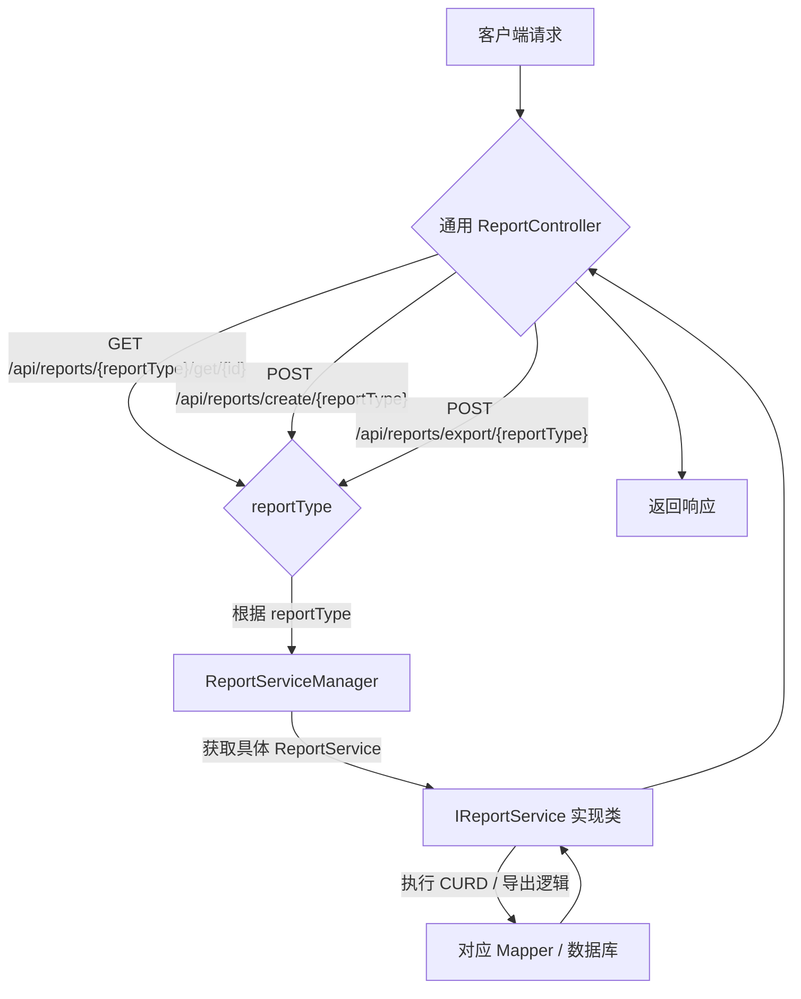

> 在企业应用开发中，报表功能是不可或缺的一部分。随着业务的发展，我们面临着这样的挑战：
> 
> * **报表类型众多：** 可能有每日报表、月度报表、年度报表、施工计划报表等几十种甚至上百种报表。
> * **未来扩展性：** 业务不断发展，新的报表类型会源源不断地涌现。
> * **统一操作需求：** 无论是哪种报表，它们都具备相似的基本操作：查询详情、列表查询、新增、修改、删除和导出。
> * **管理复杂度：** 如果每种报表都独立开发一套 Controller、Service、Mapper，代码量巨大，且维护成本呈指数级增长。

我们的目标是设计一个**通用、灵活且易于扩展**的报表管理方案，能够使用**一个通用的接口**完成所有报表的 CURD 及导出工作，并且在将来新增报表时，仅需少量修改甚至无需修改核心通用代码。

## 整体方案思路：策略模式与工厂模式的融合

为了实现上述目标，我们决定采用 **策略模式**（Strategy Pattern）与 **工厂模式**（Factory Pattern）相结合，并充分利用 Spring Boot 的依赖注入特性。

**核心思想：**

1.  **定义报表服务契约：** 所有的报表操作都遵循一个通用的接口 `IReportService`。
2.  **具体报表服务实现策略：** 每种具体的报表（如每日报表、施工计划报表）都实现 `IReportService` 接口，封装各自的业务逻辑。
3.  **报表服务工厂：** 创建一个 `ReportServiceManager` 类，作为获取具体报表服务的中央工厂。它将 `报表类型标识` (String) 映射到对应的 `IReportService` 实例。
4.  **通用 Controller：** 暴露一个统一的 RESTful API 入口，根据请求中的 `reportType` 参数，通过 `ReportServiceManager` 获取对应的 `IReportService`，并将请求转发给它。

### 方案流程图



### 核心组件设计

1.  **`BaseReport` (抽象实体父类)**

    * 作为所有报表实体类的基类，包含通用字段如 `id`。
    * **不包含**任何 Jackson 注解（如 `@JsonTypeInfo`），保持其纯粹性。

2.  **具体报表实体类 (例如 `ConstrPlanRecord`)**

    * 继承 `BaseReport`，包含该报表特有的业务字段。
    * 可添加 Bean Validation 注解（`@NotBlank` 等）进行参数校验。

3.  **`IReportService<T extends BaseReport>` (通用报表服务接口)**

    * 定义通用的 CURD 方法：`create(T entity)`、`update(T entity)`、`getById(String id)`、`list(Map<String, Object> params)`、`delete(String id)`。
    * 定义导出方法：`List<?> getExportData(ReportExportDto exportDto)`。
    * 包含一个抽象方法 `String getReportType()`，用于在 `ReportServiceManager` 中注册服务。

4.  **具体报表服务实现 (例如 `ConstrPlanRecordServiceImpl`)**

    * 实现 `IReportService<ConstrPlanRecord>` 接口。
    * 注入各自的 Mapper 进行数据持久化操作。
    * `getReportType()` 方法返回该服务对应的字符串标识（例如 "constrPlanRecord"）。
    * `getExportData()` 方法负责根据 `ReportExportDto` 查询数据，并将其转换为带有 EasyExcel 注解的 `XxxExcelVo` 列表。

5.  **`ReportServiceManager` (报表服务工厂)**

    * `@Component` 注解使其成为 Spring Bean。
    * 通过 `@Autowired List<IReportService<? extends BaseReport>>` 注入所有 `IReportService` 的实现类。
    * 在 `@PostConstruct` 方法中，遍历注入的 Service，调用其 `getReportType()` 方法，将 `reportType` 作为 key，Service 实例作为 value，存储在 `Map<String, IReportService<? extends BaseReport>>` 中。
    * 提供 `getService(String reportType)` 方法，根据 `reportType` 返回对应的 `IReportService` 实例。
    * 新增一个方法 `getReportEntityClass(String reportType)`，用于获取该 `reportType` 对应的实体类（例如 `ConstrPlanRecord.class`）。

6.  **`ReportExportDto` (通用导出参数)**

    * 一个**具体的类**，包含所有报表导出可能用到的通用参数（如 `reportType`, `fileName`, `fileFormat`, `startDate`, `endDate`, `extraParams`）。
    * 不涉及多态，直接通过 `@RequestBody` 绑定。

7.  **`XxxExcelVo` (EasyExcel 导出数据对象)**

    * 每个具体的报表类型对应一个 `XxxExcelVo` 类（例如 `ConstrPlanRecordExcelVo`）。
    * 包含用于 Excel 列映射的 `@ExcelProperty` 注解。
    * Service 在 `getExportData()` 中将查询到的业务实体转换为 `XxxExcelVo` 列表。

8.  **`ExcelExportService` (通用 Excel 导出工具)**

    * 一个独立的 `@Service` 类，封装所有 EasyExcel 的导出细节。
    * 提供 `doExport(HttpServletResponse response, List<?> data, Class<?> headClass, ReportExportDto exportDto)` 等通用导出方法。
    * 负责设置响应头、获取 `OutputStream`、调用 `EasyExcel.write()` 等。

9.  **`ReportController` (通用 RESTful 接口)**

    * `@RestController` 接收所有报表请求。
    * 对于 `create`、`update` 方法，接收 `@RequestBody BaseReport dto`。
    * 对于 `export` 方法，接收 `@RequestBody ReportExportDto dto`。
    * 通过 `ReportServiceManager` 获取具体的 `IReportService`。
    * 对于 `export`，它调用 `IReportService.getExportData()` 获取数据列表，并利用 `data.get(0).getClass()` 动态获取 `headClass`，然后将这些参数传递给 `ExcelExportService.doExport()`。

-----

## 踩坑与解决方案

在实际开发过程中，我们遇到了几个关键问题，这些问题驱动了方案的不断完善：

### 问题一：泛型 `@RequestBody` 参数的类型擦除问题

**现象：**
当我们最初尝试使用泛型方法 `public <T extends BaseReport> RespResult<?> create(@RequestBody T dto)` 时，尽管 `ReportServiceManager` 返回了 `IReportService<ConstrPlanRecord>`，但在运行时，`@RequestBody` 绑定 `T dto` 时，Jackson 并没有将其反序列化为 `ConstrPlanRecord`，而是其上界 `BaseReport`。导致后续调用 `reportService.create(dto)` 时，发生 `java.lang.ClassCastException: BaseReport cannot be cast to ConstrPlanRecord`。

**原因：**
Java 的泛型在编译后会进行类型擦除。在运行时，`T dto` 对于 Jackson 而言就是 `BaseReport dto`。Jackson 在没有明确提示的情况下，只会实例化其声明类型 `BaseReport`。它不会“预知”你稍后会把这个对象传给一个期望 `ConstrPlanRecord` 的方法。

**解决方案：自定义 `HttpMessageConverter` (复杂但健壮)**
为了在不修改 `BaseReport` 的前提下解决多态反序列化问题，我们引入了：

* **`ReportTypeContext` (ThreadLocal)：** 在 Controller 收到 `reportType` PathVariable 后，在 `@RequestBody` 绑定前，将其存入 `ThreadLocal`。
* **`HandlerMethodArgumentResolver`：** 拦截 `@PathVariable("reportType")`，并设置 `ReportTypeContext`。
* **`DynamicReportConverter` (Custom `HttpMessageConverter`)：** 在 `WebConfig` 中注册为最高优先级。当它处理 `@RequestBody BaseReport dto` 时，它会从 `ReportTypeContext` 获取 `reportType`，再通过 `ReportServiceManager.getReportEntityClass(reportType)` 获取到具体的实体类（如 `ConstrPlanRecord.class`），然后使用 Jackson 将 JSON 正确反序列化为该具体类的实例。
* **Controller 方法签名：** `public RespResult<?> create(@PathVariable("reportType") String reportType, @Valid @RequestBody BaseReport dto)`。

通过这一系列操作，确保了 `dto` 进入 Controller 方法时，已经是正确的子类实例。

### 问题二：导出功能中 Service 代码重复问题

**背景：**
最初的导出方案，可能让每个 Service 都直接处理 `HttpServletResponse` 和 EasyExcel 的细节，导致大量重复代码。

**解决方案：抽离通用 `ExcelExportService` 并简化 Service 接口**

1.  **引入 `ReportExportDto`：** 作为一个通用类，它包含了所有导出可能用到的查询参数（无需多态）。
2.  **`IReportService.getExportData(ReportExportDto exportDto)`：** Service 层的 `export` 方法被重命名为 `getExportData`，并且不再直接处理 `HttpServletResponse`。它的职责被明确为：
    * 接收通用的 `ReportExportDto`。
    * 根据其业务逻辑，查询数据。
    * 将查询到的业务实体数据**转换为**一个 `List<XxxExcelVo>` (例如 `List<ConstrPlanRecordExcelVo>`)，其中 `XxxExcelVo` 是带有 `@ExcelProperty` 注解的 Excel 导出 POJO。
    * 直接返回这个 `List<?>`。
3.  **`ExcelExportService`：** 创建一个专门的 Service 负责所有 EasyExcel 的通用逻辑：
    * 接收 `HttpServletResponse`、`List<?> data`、`Class<?> headClass` 和 `ReportExportDto`。
    * 统一设置响应头、获取输出流、调用 `EasyExcel.write(outputStream, headClass).sheet().doWrite(data)`。
    * **动态获取 `headClass`：** 在 `ReportController` 中，通过 `Class<?> headClass = exportData.get(0).getClass();` 来获取数据列表中第一个元素的类型，作为 EasyExcel 的 `headClass`。这简化了 Service 接口，避免了 `ExportDataInfo` 包装类。

通过这样的分层和职责划分，极大地减少了 Service 层的重复代码，提高了导出功能的通用性和可维护性。

### 问题三：Maven 依赖冲突 (`NoClassDefFoundError`, `IllegalStateException`)

**现象：**
在引入 `easyexcel`、`poi-tl` 和多个 `org.apache.poi` 模块时，经常出现 `java.lang.NoClassDefFoundError` (如 `UnsynchronizedByteArrayOutputStream`) 或 `java.lang.IllegalStateException: getOutputStream() has already been called`。

**原因：**

* `NoClassDefFoundError`：通常是由于缺少 `commons-io` 依赖，或者 `easyexcel` 或 `poi-tl` 传递性引入了旧版本的 `commons-io`，而该旧版本不包含所需的类。
* `IllegalStateException`：在 Web 环境中，`HttpServletResponse` 不允许同时调用 `getOutputStream()` 和 `getWriter()`。当 Excel 导出逻辑使用 `getOutputStream()` 写入文件流时，如果发生异常，全局异常处理器又尝试通过 `response.getWriter()` 写入错误信息，就会导致冲突。

**解决方案：**

1.  **Maven `dependencyManagement` 统一版本：**
    在 `pom.xml` 的 `<dependencyManagement>` 块中，统一所有 `Apache POI` 相关模块（`poi`, `poi-ooxml`, `poi-ooxml-schemas`, `poi-scratchpad`）、`easyexcel`、`poi-tl` 以及 `commons-io` 的版本。这样可以避免传递性依赖导致的版本冲突，确保每个库都使用你期望的兼容版本。
    ```xml
    <dependencyManagement>
        <dependencies>
            <dependency>...</dependency>
            <dependency>...</dependency>
            <dependency>...</dependency>
            <dependency>
                <groupId>commons-io</groupId>
                <artifactId>commons-io</artifactId>
                <version>${commons-io.version}</version>
            </dependency>
        </dependencies>
    </dependencyManagement>
    <dependencies>
        <dependency>
            <groupId>com.alibaba</groupId>
            <artifactId>easyexcel</artifactId>
        </dependency>
        <dependency>
            <groupId>commons-io</groupId>
            <artifactId>commons-io</artifactId>
        </dependency>
        </dependencies>
    ```
2.  **Controller 层统一异常处理：**
    在 `ReportController` 的 `export` 方法中，捕获异常后：
    * **首先调用 `response.reset()`** 清除所有已设置的头和写入的数据。
    * **然后统一通过 `response.getOutputStream()`**（即使是文本错误信息）来写入错误响应，而不是 `getWriter()`，避免冲突。
    * 设置 `Content-Type` 为 `text/plain` 和正确的字符编码。

-----

## 总结：从复杂到优雅的报表管理系统

通过上述一系列的设计、踩坑和优化，我们成功构建了一个**通用、灵活、易于扩展且高度可维护**的 Spring Boot 报表管理系统。

* **开闭原则的体现：** 新增报表类型，只需创建新的实体、Service 实现和 Excel Vo，无需修改核心通用代码。
* **职责清晰：** Controller 负责路由，Service 负责业务数据，`ExcelExportService` 负责通用导出，Mapper 负责持久化。
* **依赖管理优化：** 通过 `dependencyManagement` 解决了复杂的库版本冲突，保证了系统稳定性。
* **通用导出：** 实现了只关注数据提供，而无需关心导出细节的通用 Excel 导出方案。

这个演进过程不仅解决了具体的业务问题，也加深了对 Spring Boot 内部机制、Java 泛型、设计模式以及 Maven 依赖管理的理解。希望这篇博客能为您在构建类似系统时提供有价值的参考和经验。
