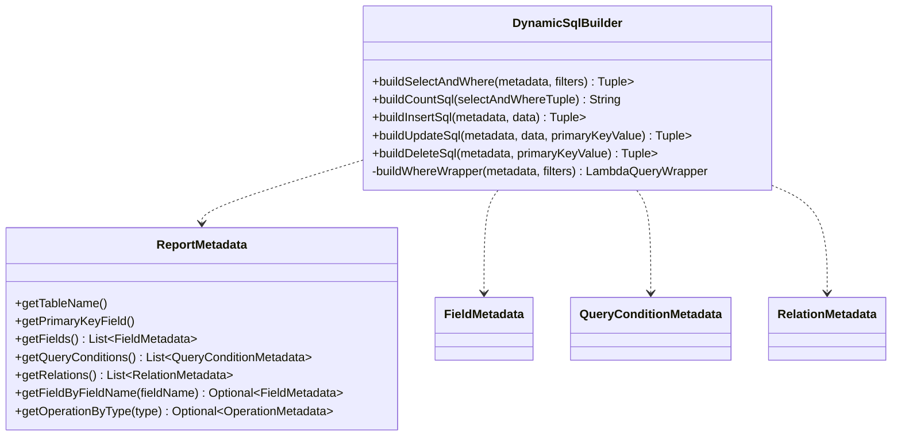

1. 核心思路概述
SELECT 和 JOIN 子句：仍然由 DynamicSqlBuilder 根据元数据手动构建 SQL 字符串。MyBatis-Plus 的 Wrapper 在处理动态表名和复杂 JOIN 方面不直接提供类似 where 的 fluent API。

WHERE 子句：完全利用 MyBatis-Plus 的 LambdaQueryWrapper 来构建。这将确保参数化查询和条件的链式调用能力。

SQL 执行：通过 DynamicReportMapper（使用 @SelectProvider 等）接收构建好的完整 SQL 字符串和 Wrapper 内部生成的参数 Map，并交由 MyBatis-Plus 框架执行。




```java
// com.example.report.core.sql.DynamicSqlBuilder
import com.baomidou.mybatisplus.core.conditions.query.LambdaQueryWrapper;
import com.baomidou.mybatisplus.core.conditions.update.LambdaUpdateWrapper;
import com.baomidou.mybatisplus.core.toolkit.Wrappers;
import com.baomidou.mybatisplus.extension.plugins.pagination.Page;
import lombok.RequiredArgsConstructor;
import org.springframework.stereotype.Component;

import java.util.ArrayList;
import java.util.List;
import java.util.Map;
import java.util.stream.Collectors;
import java.util.HashMap;

@Component
@RequiredArgsConstructor
public class DynamicSqlBuilder {

    // 辅助元组，用于返回 SQL 字符串和 QueryWrapper
    // String 部分包含 SELECT ... FROM ... JOIN ...
    // QueryWrapper 包含 WHERE 和 ORDER BY 条件
    public record SqlAndWrapperTuple(String selectFromJoinSql, LambdaQueryWrapper<?> queryWrapper) {}

    /**
     * 构建 SELECT, FROM 和 JOIN 子句的 SQL 字符串，并创建 WHERE 条件的 LambdaQueryWrapper。
     *
     * @param metadata 报表元数据
     * @param filters 筛选条件
     * @return 包含 SQL 字符串和 LambdaQueryWrapper 的元组
     */
    public SqlAndWrapperTuple buildSelectAndWhere(
            ReportMetadata metadata,
            Map<String, Object> filters
    ) {
        StringBuilder selectFromJoinSql = new StringBuilder();

        // 1. SELECT 子句
        List<String> selectFields = metadata.getFields().stream()
                .filter(FieldMetadata::getIsVisible)
                .map(f -> "`" + f.getFieldName() + "`" + (f.getDisplayName() != null && !f.getDisplayName().equals(f.getFieldName()) ? (" AS `" + f.getDisplayName() + "`") : ""))
                .collect(Collectors.toList());
        selectFromJoinSql.append("SELECT ").append(String.join(", ", selectFields));

        // 2. FROM 和 JOIN 子句
        selectFromJoinSql.append(" FROM `").append(metadata.getTableName()).append("` t1");
        if (metadata.getRelations() != null && !metadata.getRelations().isEmpty()) {
            int tableAliasIndex = 2; // t2, t3...
            for (RelationMetadata relation : metadata.getRelations()) {
                String relatedTableAlias = "t" + tableAliasIndex++;
                selectFromJoinSql.append(" ").append(relation.getJoinType())
                                 .append(" `").append(relation.getRelatedTableName()).append("` ").append(relatedTableAlias)
                                 .append(" ON t1.`").append(relation.getMainTableField()).append("` = ").append(relatedTableAlias).append(".`").append(relation.getRelatedTableField()).append("`");
                if (relation.getJoinCondition() != null && !relation.getJoinCondition().isEmpty()) {
                    selectFromJoinSql.append(" AND ").append(relation.getJoinCondition());
                }
            }
        }

        // 3. 构建 WHERE 条件的 LambdaQueryWrapper
        LambdaQueryWrapper<Object> queryWrapper = buildWhereWrapper(metadata, filters);

        return new SqlAndWrapperTuple(selectFromJoinSql.toString(), queryWrapper);
    }

    /**
     * 构建 WHERE 条件的 LambdaQueryWrapper。
     *
     * @param metadata 报表元数据
     * @param filters 筛选条件
     * @return 构建好的 LambdaQueryWrapper
     */
    private LambdaQueryWrapper<Object> buildWhereWrapper(
            ReportMetadata metadata,
            Map<String, Object> filters
    ) {
        LambdaQueryWrapper<Object> wrapper = Wrappers.lambdaQuery();
        if (filters != null && !filters.isEmpty()) {
            for (Map.Entry<String, Object> entry : filters.entrySet()) {
                String fieldName = entry.getKey();
                Object value = entry.getValue();

                FieldMetadata fieldMeta = metadata.getFieldByFieldName(fieldName)
                        .orElseThrow(() -> new InvalidFieldException("无效的筛选字段: " + fieldName));
                if (!fieldMeta.getIsFilterable()) {
                    throw new FieldNotFilterableException("字段不可筛选: " + fieldName);
                }

                // 获取查询条件特定操作符（如果可用），否则使用默认值
                String operator = metadata.getQueryConditions().stream()
                        .filter(qc -> qc.getFieldName().equalsIgnoreCase(fieldName))
                        .map(QueryConditionMetadata::getOperator)
                        .findFirst()
                        .orElse("EQ"); // 默认为等于

                // 使用 fieldMeta.getFieldName() 作为数据库列名
                // 注意：这里需要确保 Lambda 表达式能识别 Map 内部的键，MyBatis-Plus 的LambdaQueryWrapper
                // 通常用于实体类，直接传入字符串列名在某些情况下更直接
                // 对于 Map 类型，通常使用 QueryWrapper.eq("column_name", value) 这种形式
                switch (operator.toUpperCase()) {
                    case "EQ":
                        wrapper.eq(fieldMeta.getFieldName(), value);
                        break;
                    case "LIKE":
                        wrapper.like(fieldMeta.getFieldName(), value);
                        break;
                    case "GT":
                        wrapper.gt(fieldMeta.getFieldName(), value);
                        break;
                    case "LT":
                        wrapper.lt(fieldMeta.getFieldName(), value);
                        break;
                    case "GTE":
                        wrapper.ge(fieldMeta.getFieldName(), value);
                        break;
                    case "LTE":
                        wrapper.le(fieldMeta.getFieldName(), value);
                        break;
                    case "BETWEEN": // 假设 value 是包含两个元素的列表 [start, end]
                        if (!(value instanceof List) || ((List<?>) value).size() != 2) {
                            throw new IllegalArgumentException("BETWEEN 运算符需要两个值的列表。");
                        }
                        wrapper.between(fieldMeta.getFieldName(), ((List<?>) value).get(0), ((List<?>) value).get(1));
                        break;
                    case "IN": // 假设 value 是一个列表
                        if (!(value instanceof List) || ((List<?>) value).isEmpty()) {
                            throw new IllegalArgumentException("IN 运算符需要一个非空值的列表。");
                        }
                        wrapper.in(fieldMeta.getFieldName(), (List<?>) value);
                        break;
                    default:
                        throw new UnsupportedOperationException("不支持的操作符: " + operator);
                }
            }
        }
        return wrapper;
    }

    /**
     * 构建 COUNT SQL。
     *
     * @param selectAndWhereTuple 包含 SELECT/FROM/JOIN SQL 和 QueryWrapper 的元组
     * @return COUNT SQL 字符串
     */
    public String buildCountSql(SqlAndWrapperTuple selectAndWhereTuple) {
        String fromAndJoin = selectAndWhereTuple.selectFromJoinSql()
                                                .substring(selectAndWhereTuple.selectFromJoinSql().indexOf(" FROM "));
        // 注意：Wrapper 的 SQL 片段会包含 WHERE，但这里我们只构建 COUNT(*) FROM 部分
        // 实际执行时，Wrapper 会与 COUNT(*) 结合
        return "SELECT COUNT(*) " + fromAndJoin;
    }

    /**
     * 构建 INSERT SQL。
     *
     * @param metadata 报表元数据
     * @param data 要插入的数据
     * @return 包含 SQL 字符串和参数 Map 的元组
     */
    public SqlTuple buildInsertSql(ReportMetadata metadata, Map<String, Object> data) {
        List<String> columns = new ArrayList<>();
        List<String> values = new ArrayList<>();
        Map<String, Object> params = new HashMap<>();

        int paramCount = 0;
        for (FieldMetadata field : metadata.getFields()) {
            if (field.getIsEditable()) {
                String fieldName = field.getFieldName();
                String paramKey = "param" + (paramCount++); // 使用命名参数键
                if (data.containsKey(fieldName)) {
                    columns.add("`" + fieldName + "`");
                    values.add("#{" + paramKey + "}");
                    params.put(paramKey, data.get(fieldName));
                } else if (field.getIsRequired() && field.getOptions() == null) {
                    throw new IllegalArgumentException("插入操作缺少必填字段 '" + field.getDisplayName() + "' (" + field.getFieldName() + ")。");
                }
            }
        }
        if (columns.isEmpty()) {
            throw new IllegalArgumentException("未提供任何可编辑字段用于插入。");
        }

        String sql = "INSERT INTO `" + metadata.getTableName() + "` (" + String.join(", ", columns) + ") VALUES (" + String.join(", ", values) + ")";
        return new SqlTuple(sql, params);
    }

    /**
     * 构建 UPDATE SQL。
     *
     * @param metadata 报表元数据
     * @param data 要更新的数据
     * @param primaryKeyValue 主键值
     * @return 包含 SQL 字符串和参数 Map 的元组
     */
    public SqlTuple buildUpdateSql(ReportMetadata metadata, Map<String, Object> data, Object primaryKeyValue) {
        List<String> sets = new ArrayList<>();
        Map<String, Object> params = new HashMap<>();

        int paramCount = 0;
        for (FieldMetadata field : metadata.getFields()) {
            if (field.getIsEditable()) {
                String fieldName = field.getFieldName();
                String paramKey = "param" + (paramCount++);
                if (data.containsKey(fieldName)) {
                    sets.add("`" + fieldName + "` = #{" + paramKey + "}");
                    params.put(paramKey, data.get(fieldName));
                }
            }
        }
        if (sets.isEmpty()) {
            throw new IllegalArgumentException("未提供任何可编辑字段用于更新。");
        }

        String pkParamKey = "primaryKey"; // 主键参数键
        params.put(pkParamKey, primaryKeyValue);

        String sql = "UPDATE `" + metadata.getTableName() + "` SET " + String.join(", ", sets) + " WHERE `" + metadata.getPrimaryKeyField() + "` = #{" + pkParamKey + "}";
        return new SqlTuple(sql, params);
    }

    /**
     * 构建 DELETE SQL。
     *
     * @param metadata 报表元数据
     * @param primaryKeyValue 主键值
     * @return 包含 SQL 字符串和参数 Map 的元组
     */
    public SqlTuple buildDeleteSql(ReportMetadata metadata, Object primaryKeyValue) {
        Map<String, Object> params = new HashMap<>();
        String pkParamKey = "primaryKey"; // 主键参数键
        params.put(pkParamKey, primaryKeyValue);
        String sql = "DELETE FROM `" + metadata.getTableName() + "` WHERE `" + metadata.getPrimaryKeyField() + "` = #{" + pkParamKey + "}";
        return new SqlTuple(sql, params);
    }

    // 辅助类，用于返回 SQL 和参数 Map
    public record SqlTuple(String sql, Map<String, Object> params) {}
}

```
