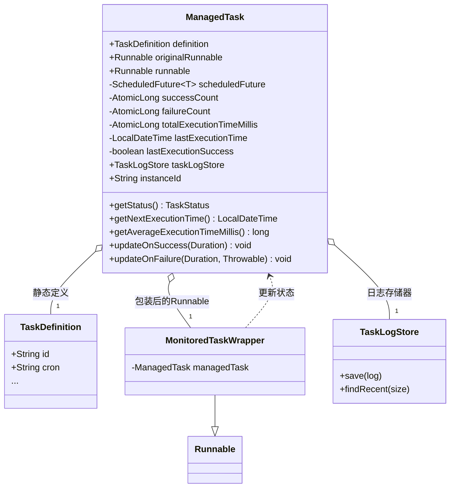
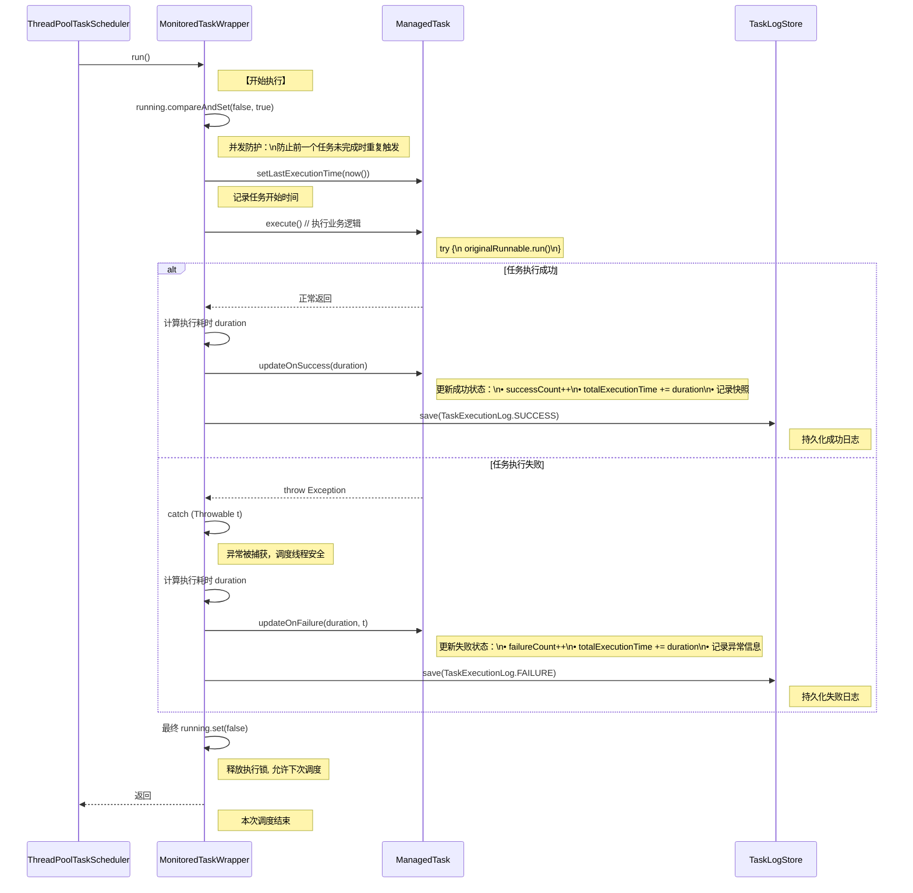

## 引言

> 要是说前几章咱是“建筑师”，给调度框架搭好了骨架和地基，那从这章开始，咱就得变身“飞行控制中心设计师”。再先进的飞机，要是地面中心看不到它的高度、速度、航向和引擎状态，那跟失控的废铁没啥区别。

> 定时任务框架也一样——企业级框架要是给不出详细的运行数据，咱根本没法回答关键问题：“这任务现在在干啥？”“跑得顺不顺利？”“下次啥时候跑？”。这一章，咱就深扒
`hadoken-scheduler`的“可观测性”设计，看看咱是咋靠`ManagedTask`这个核心模型和`MonitoredTaskWrapper`
> 这个“数据探针”，把每个任务的“生命体征”实时抓下来，彻底跟“黑盒运维”说再见的。

## 第一部分：企业级调度的 “中枢神经” ——ManagedTask运行时模型深度解析

要监控任务，首先得有个“容器”装监控数据。在咱框架里，干这活儿的就是`ManagedTask`类。它不是个简单的POJO，而是每个调度任务在内存里的
**实时镜像**——是个有状态、“活”着的对象。

`ManagedTask`把任务运行时需要的所有信息都整合到一起，既有静态配置，也有动态数据。

上图把`ManagedTask`的内部结构说透了，咱拆成两部分看：

* **静态信息**:
    * `definition`: 任务的“身份证”，里面是从`@EnhanceScheduled`注解或动态API里解析出来的所有配置，比如任务ID、描述、Cron表达式这些。
    * `originalRunnable`: 用户自己写的业务逻辑代码。
* **动态运行时信息**:
    * `runnable`: 这不是用户写的原始逻辑，而是被`MonitoredTaskWrapper`包装过的版本——调度器实际执行的就是它。
    * `scheduledFuture`: 这是`ThreadPoolTaskScheduler.schedule()`返回的“把手”，靠它能取消任务（`future.cancel()`
      ），还能查下次执行要等多久（`future.getDelay()`）。
    * **统计计数器**: `successCount`（成功次数）、`failureCount`（失败次数）、`totalExecutionTimeMillis`（总耗时）。这些用的都是
      `java.util.concurrent.atomic`包的原子类，多线程环境下计数也不会乱。
    * **最近执行快照**: `lastExecutionTime`（上次执行时间）、`lastExecutionSuccess`（上次成功没）、`lastErrorMessage`
      （上次错哪儿了）——一眼能看到最近一次任务的状态。
    * `taskLogStore`: 持久化层的日志存储接口，负责把执行日志存到数据库或Redis里。

`ManagedTask`就像每个任务的“黑匣子+仪表盘”，有了它，后面所有的监控和管理操作才有了靠谱的数据基础。

## 第二部分：任务监控体系的构建基石 —— `MonitoredTaskWrapper`的设计哲学与实现奥秘

有了`ManagedTask`装数据，还得有个机制“抓数据”——这就是`MonitoredTaskWrapper`的活儿。

它用的是典型的**装饰器模式**：实现`Runnable`接口，把用户的`originalRunnable`包在里面。调度器执行任务时，其实是调用
`MonitoredTaskWrapper`的`run()`方法——这就给了咱完美的“插入点”，能在业务逻辑执行前后，塞进去监控代码。

## `run()`方法的执行时序

`MonitoredTaskWrapper.run()`里的逻辑，用下面的时序图一看就懂：

这张图藏着`MonitoredTaskWrapper`的四个核心作用，咱一个个说：

1. **并发防护**: 靠一个`AtomicBoolean running`锁，保证同一个任务“前一个没跑完，后一个不进来”。对`fixedRate`
   这类按固定频率跑的任务特别重要，能防止任务“堆活儿”（越积越多，最后把线程池堵死）。
2. **生命周期日志与计时**: 业务逻辑执行前记“开始时间”，执行完（不管成功失败）记“结束时间”，精准算出任务跑了多久。
3. **异常隔离**: 用`try...catch(Throwable t)`抓所有可能的异常——这步太关键了！要是不抓，用户业务逻辑里抛个
   `NullPointerException`，可能把调度线程池的线程搞崩，最后整个调度器都没法用。
4. **状态更新与持久化**: 不管成功失败，`finally`块里都会更新`ManagedTask`的统计数据，还会调用`TaskLogStore`
   把执行日志存起来——下次查历史的时候，就能看到详细记录。

## 第三部分：数据驱动下的调度智慧 —— 可视化与深度分析

靠`ManagedTask`和`MonitoredTaskWrapper`配合，咱能抓着一堆运行时数据。这些数据能帮咱从好几个维度看透任务的状态：

* **当前状态**: 调用`managedTask.getStatus()`，再结合`scheduledFuture`是不是`null`、有没有被取消（`isCancelled()`
  ），就能精准判断任务是“正在跑（RUNNING）”还是“停了（STOPPED）”。
* **未来预测**: 用`managedTask.getNextExecutionTime()`，结合`scheduledFuture.getDelay(TimeUnit.MILLISECONDS)`
  ，能算出下次任务啥时候跑——提前知道调度时间，方便做运维准备。
* **性能评估**: `managedTask.getAverageExecutionTimeMillis()`会算“总耗时 /
  总执行次数”，能看出任务跑得多快，有没有性能瓶颈（比如最近平均耗时突然涨了，可能是业务数据多了，得优化）。
* **历史追溯**: 调用`managedTask.getExecutionLogs()`，其实是委托`TaskLogStore.findRecent()`
  查最近N次的执行日志——出问题的时候，不用翻服务器日志，直接查这里就行，排障效率高多了。

## 结语：从框架内置定时到可视化动态调度的演进之路

这一章咱讲透了：`hadoken-scheduler`是咋靠**`ManagedTask`当数据中心**、**`MonitoredTaskWrapper`当数据探针**
，搭起一套全自动的可观测体系的。以前`@Scheduled`是“黑盒”，咱啥也看不见；现在每个任务都“透明”了，是个能被精准度量的“数字化实体”。

现在咱不光知道任务在干啥，还知道它跑得好不好、以前跑过啥、下次啥时候跑——相当于开了“上帝视角”。

但光有“眼睛”和“仪表盘”还不够，强大的系统还得有“动手干预”的能力。下一章，咱就给框架装“遥控器”，聊聊咋靠RESTful
API实时控制任务：启停、临时触发，甚至动态创建、删除任务，真正做到“坐在后台，掌控所有任务”。

