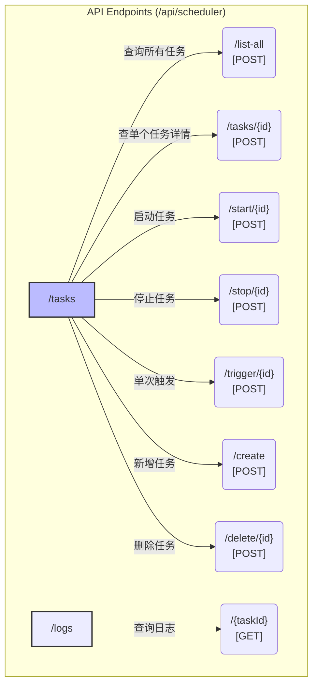
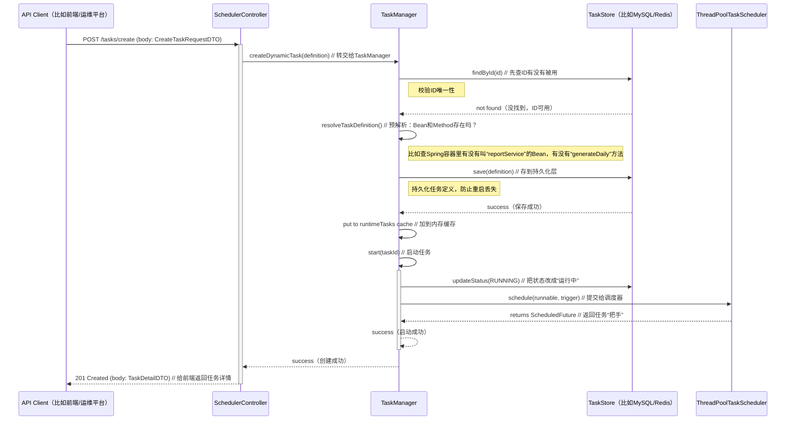

## 引言

> 前面几章咱把`@Scheduled` 从“黑盒”改成了“透明体”——有长期记忆（持久化），还能实时监控（看状态、查日志），相当于开了“上帝视角”。但光看不行啊，真正的“掌控”得能动手：业务高峰时，得能暂停非核心任务；运营要数据，得能马上触发报表生成；甚至不用重启服务，就能新建或删掉任务。

> 这一章，咱就给框架装“手臂”——一套设计好的RESTful API。跟大家唠唠`SchedulerController`
> 是咋设计的，看看咋靠几个简单的接口，把所有定时任务的生命周期捏在手里，真正做到“坐在后台，控制所有任务”。

## 第一部分：任务调度控制器——`SchedulerController` & `SchedulerLogController`

想从外部控制任务，最通用的办法就是搞RESTful API。我把功能拆到两个Controller里，这样职责更清晰：

1. **`SchedulerController`**: 任务管理的核心。管任务的全生命周期——启停、临时触发、查列表、新建、删除，都靠它。
2. **`SchedulerLogController`**: 日志查询的窗口。就干一件事——按任务ID查最近的执行日志。

这两个Controller要不要创建，由`HadokenSchedulerAutoConfiguration`说了算。用户只要在配置文件里设
`hadoken.scheduler.endpoint.enabled = true`，它们才会被装到Spring容器里。要是用户不想暴露这些管理接口，关了就行，灵活得很。

## API端点结构

整个API设计跟着RESTful的规矩来，路径一看就懂，不用猜。



* **`/tasks` 资源**: 代表所有被管理的任务，管查询和生命周期控制。
* **`/logs` 资源**: 代表任务的执行日志，目前只支持按任务ID查。

可能有人会问：“启停、触发这些操作，为啥不用`PUT`或`GET`，全用`POST`？”

这是实际用的时候权衡过的：严格来说，启停算“改状态”（该用`PUT`），触发算“执行动作”（该用`POST`）。但为了简化——不管前端还是后端，不用记哪个接口用啥方法，而且
`GET`请求有“无副作用”的规矩（不能改状态），干脆把所有“改状态、做动作”的操作全统一成`POST`，省得搞混，用起来也简单。

## 第二部分：核心控制能力的构建与实现

`SchedulerController`里的每个接口方法，其实都是“转发器”——把请求转给`TaskManager`，让它去干实际的活儿。

### 1. 任务生命周期管控：启动、暂停与手动触发实践

先看最常用的三个操作，逻辑不复杂，但细节很重要。

* **`start(String taskId)`**: 调用`taskManager.start(taskId)`，启动任务。

  内部流程是这样的：
    1. 从内存里的`runtimeTasks`（一个`ConcurrentHashMap`）找到对应的`ManagedTask`。
    2. 先查状态——要是已经在跑了，直接返回，不做无用功。
    3. 把`ManagedTask`和持久化层（`TaskStore`）里的状态都改成`RUNNING`（同步状态，防止重启后丢配置）。
    4. 按`TaskDefinition`里的规则（比如Cron表达式），重新建个`Trigger`。
    5. 调用`ThreadPoolTaskScheduler.schedule()`提交任务，把返回的`ScheduledFuture`（相当于“任务把手”）存回`ManagedTask`
       ，后面停任务要用。

* **`stop(String taskId)`**: 调用`taskManager.stop(taskId)`，停止任务。

  内部流程要注意“优雅停机”：
    1. 找到`ManagedTask`，拿到里面的`ScheduledFuture`。
    2. 调用`future.cancel(false)`——这里的`false`很关键，意思是“不中断正在执行的任务”，只取消未来的调度。比如任务正在生成报表，总不能半路杀了它，得让它跑完，不然数据会乱。
    3. 把`ManagedTask`和持久化层的状态改成`STOPPED`。

* **`triggerOnce(String taskId)`**: 调用`taskManager.triggerOnce(taskId)`，临时触发一次任务。

  这个操作很实用，比如运营临时要一份数据，不用等定时：
    1. 找到`ManagedTask`。
    2. 直接调用`taskScheduler.schedule(runnable, Instant.now())`——让任务“现在就跑”，而且不影响原来的调度周期（比如原来每天凌晨跑，触发一次后，下次还是凌晨）。

### 2. 动态调度：解锁定时任务框架的核心引擎

能动态新建、删除任务，这才是`hadoken-scheduler`比原生`@Scheduled`强的核心——不用改代码、不用重启服务，随时能加任务。

* **`createDynamicTask(CreateTaskRequestDTO requestDTO)`**: 调用`taskManager.createDynamicTask(definition)`，新建动态任务。

  调用时，前端要传个JSON（`CreateTaskRequestDTO`），里面得包含任务的关键信息：`id`（唯一标识）、`description`（描述）、`beanName`
  （Spring Bean名）、`methodName`（Bean里的方法名）、`triggerType`（触发类型，比如Cron）、`triggerValue`（具体值，比如
  `0 0 2 * * ?`）。

  后台处理时，逻辑很严谨，要过好几道校验，防止出问题：

  ```mermaid
  graph TD
      A[接收 TaskDefinition] --> B{ID是否已存在?};
      B -- 是 --> Z1[抛出异常（ID重复）];
      B -- 否 --> C{Bean+Method是否已被其他任务用了?};
      C -- 是 --> Z2[抛出异常（避免重复调度同一个方法）];
      C -- 否 --> D[标记任务来源为 DYNAMIC，状态设为 RUNNING];
      D --> E{预解析：能找到对应的Bean和Method吗?};
      E -- 否 --> Z3[抛出异常（Bean不存在或方法不对）];
      E -- 是 --> F[创建 ManagedTask 实例];
      F --> G["持久化：调用 taskStore.save() 存到数据库/Redis"];
      G --> H[加入运行时缓存 runtimeTasks];
      H --> I["启动任务：调用 start(taskId)"];
      I --> J["成功返回（给前端任务详情）"];

      style Z1 fill:#fbb,stroke:#f00,stroke-width:2px
      style Z2 fill:#fbb,stroke:#f00,stroke-width:2px
      style Z3 fill:#fbb,stroke:#f00,stroke-width:2px
  ```

  这套流程能保证：只有“合法能跑”的任务才会被创建，不会出现“存了但跑不起来”的脏数据。

* **`deleteTask(String taskId)`**: 调用`taskManager.deleteTask(taskId)`，删除任务。

  删任务得“先停再删”，不然可能出问题：
    1. 先调用`stop(taskId)`——确保任务已经不调度了，正在跑的也让它跑完。
    2. 从`runtimeTasks`里把`ManagedTask`删掉——内存里清干净。
    3. 调用`taskStore.deleteById(taskId)`——从持久化层彻底删掉，下次重启也不会再出现。

### 3. API调用时序图示例：创建一个动态任务

用一张时序图，看看调用“新建动态任务”接口时，整个系统是咋配合的：



## 结语：从被动执行到主动掌控的飞跃

这一章，咱给调度框架装了“遥控器”——一套功能全的RESTful API。这套API不只是“开关”，更重要的是它带来了**动态性**和**可编程性**
：通过`create`和`delete`接口，咱的调度系统从“只能跑代码里写死的任务”，变成了“能被外部系统（配置中心、运维平台）随时控制的服务”。

现在咱既有“上帝视角”（监控），又有“上帝之手”（API控制），看似啥都能搞定了。但在真实生产环境里，尤其是集群部署时，还有个“幽灵”没解决——
**并发安全**。比如多个节点同时改一个任务的状态，或者同一个任务在多个节点上跑重复了。下一章，咱就聊`hadoken-scheduler`
的分布式锁设计，给任务在集群里“保驾护航”，确保“指令不会乱，任务不重复跑”。

