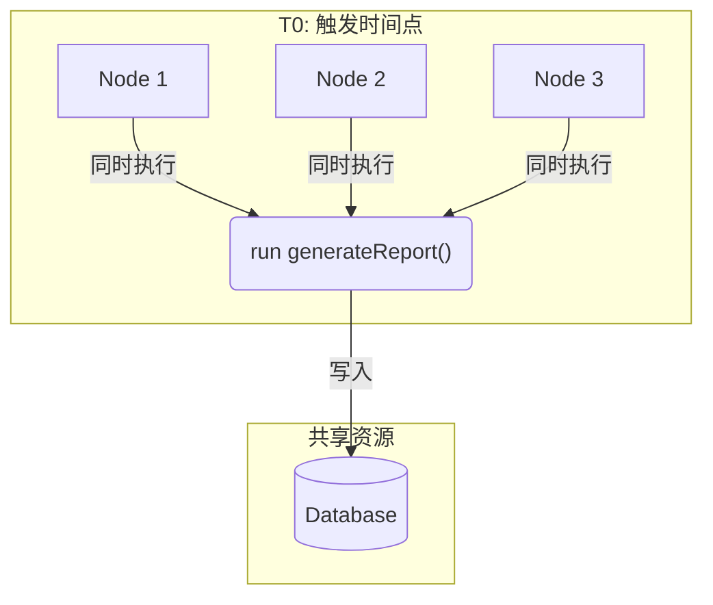
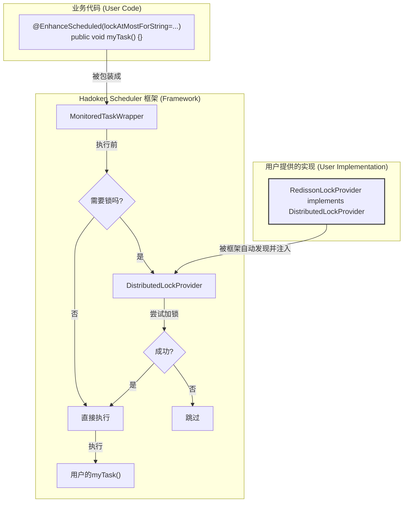

## 引言

> 到目前为止，我们精心打造的调度框架，在单个节点上已经表现得非常出色了。它有眼睛（监控），有记忆（持久化），还有手（API）。但现代应用架构，几乎都是分布式的。一旦我们的应用被部署到多个节点上，一个潜伏的"幽灵"就会浮现——
> **并发执行**。如果不加控制，集群里的每个节点都会在同一时间执行同一个任务，这会从"资源浪费"升级到"数据灾难"。本章，我们就来正面硬刚这个"幽灵"，聊聊
> `hadoken-scheduler`是如何通过一套**无侵入、可插拔**的分布式锁设计，来确保在集群环境中"令行禁止"，让任务在任何时候都只有一个实例在运行。

## 第一章 集群调度困境：从并发冲突到 "调度风暴" 危机

咱们再简单回顾一下这个问题，因为它太重要了。假设我们有一个"每日生成汇总报表"的任务，部署在3个节点的集群上。



到了触发时间，三个节点上的`@Scheduled`
就像收到了同一个信号，同时开始工作。它们都会去数据库里读今天的数据，计算，然后生成一份报表再写回去。结果就是，数据库里凭空多出了三份一模一样的报表。这还算是好的，万一逻辑不是幂等的，比如是"给所有未处理订单派发优惠券"，那用户可能会收到三份优惠券，公司就得亏钱了。

要解决这个问题，就必须引入一个"交通警察"的角色，确保在同一时间，只有一条路（一个节点）能通过。这个"交警"，就是分布式锁。

## 架构设计理念：分离锁逻辑，让业务代码轻装上阵

作为框架的设计者，我的核心思路是：**分布式锁的逻辑，绝对不能污染用户的业务代码**。

我可不想看到用户这样写代码：

```java
// 这是我极力避免的反模式
@Scheduled(...)
public void myTask()
{
    Lock lock = redisLock.lock("my-task-lock");
    try
    {
        if (lock.tryLock())
        {
            // ...真正的业务逻辑...
        }
    } finally {
        lock.unlock();
    }
}
```

这段代码不仅看着乱、写起来麻烦，还把关键的 "锁" 机制和业务功能强行绑在一起。后续修改维护时，就像在一团乱麻里找线头，特别费劲。
更好的解决办法是：把 "锁" 的处理逻辑藏到框架底层，对用户完全透明。用户只需要像填表格一样，简单设置几个参数，就能轻松给任务加上 "安全锁"。

基于这个思路，我设计了一套基于"接口"和"自动装配"的方案。



这个流程的核心是：

1. 用户只需要在注解上加个属性，表明"我这个任务需要锁"。
2. 框架的`MonitoredTaskWrapper`在执行任务前，会检查这个"标记"。
3. 如果需要锁，它会去找一个叫`DistributedLockProvider`的东西来加锁。
4. 这个`DistributedLockProvider`不是框架自己写的，而是**由用户提供**的一个Bean。框架只负责定义接口（规矩），不负责具体实现。

### 构建调度秩序 ——DistributedLockProvider接口设计解析

为了让框架能和用户提供的各种锁（Redisson, Curator, etc.）对话，我们需要一个统一的"契约"，这就是`DistributedLockProvider`接口。

这个接口定义得非常简单：

```java
// DistributedLockProvider.java
public interface DistributedLockProvider
{

    // 代表一个已获取的锁，能自动关闭
    interface Lock extends AutoCloseable
    {
        @Override
        void close(); // close() 负责释放锁
    }

    // 尝试获取锁
    Optional<Lock> tryLock(String lockKey, Duration lockAtMostFor);
}


```

* `tryLock(lockKey, lockAtMostFor)`:
    * `lockKey`: 锁的唯一名字，框架会自动用任务的ID来当`lockKey`。
    * `lockAtMostFor`: **这是个保险丝**。它代表"这个锁，我最多持有这么长时间"。万一拿到锁的节点挂了，没来得及释放锁，这个锁也会在
      `lockAtMostFor`时间后自动过期，防止整个集群的任务都被"死锁"卡住。
    * 返回值是`Optional<Lock>`。如果拿到了锁，就返回一个`Lock`实例；如果没拿到（别的节点已经锁了），就返回`Optional.empty()`。
* `Lock extends AutoCloseable`: 这是一个很巧妙的设计。`AutoCloseable`接口让我们可以使用`try-with-resources`
  语法，代码写出来会非常干净，能确保锁一定被释放。

## 第四部分：任务执行监控机制 —— MonitoredTaskWrapper的锁机制设计与实现

有了规则，就得有人监督执行。这个 "监督员" 就是第五章讲过的MonitoredTaskWrapper类。

我在它的run()方法里添加了一段逻辑，专门负责任务执行前加锁、执行任务、执行完后解锁，就像监督员全程把控任务执行流程一样。

```java
// MonitoredTaskWrapper.java
@Override
public void run()
{
    // 检查是否配置了锁
    boolean needsLocking = lockProviderOpt.isPresent() && StringUtils.hasText(lockConfig);

    if (needsLocking)
    {
        // 如果需要，就走带锁的逻辑
        executeWithLock(lockConfig);
    } else {
        // 否则，走原来的逻辑
        executeTaskLogic();
    }
}

private void executeWithLock(String lockConfig)
{
    DistributedLockProvider lockProvider = lockProviderOpt.get();
    String taskId = managedTask.getDefinition().getId();

    Optional<DistributedLockProvider.Lock> lockOpt = lockProvider.tryLock(taskId, lockAtMostFor);

    // try-with-resources 语法
    if (lockOpt.isPresent())
    {
        try (DistributedLockProvider.Lock lock = lockOpt.get())
        {
            // 拿到锁了，执行核心逻辑
            executeTaskLogic();
        }
    } else {
        // 没拿到锁，打印日志，直接跳过
        log.debug("无法获取任务 '{}' 的锁。跳过执行。", taskId);
    }
}
```

这段代码的核心就在`try-with-resources`。只要`tryLock`成功，代码块里的`executeTaskLogic()`就会执行。无论业务逻辑是成功还是抛异常，只要跳出
`try`代码块，`lock.close()`方法就一定会被自动调用，从而释放锁。优雅，而且万无一失。

## 第五部分：极简升级：注解改造实现动态调度

框架把那些复杂又麻烦的工作都处理好了，用户操作特别容易，就两步：

1. **提供一个`DistributedLockProvider`的实现**
   用户需要自己写一个实现类，并把它注册成Spring的Bean。比如用Redisson：

   ```java
@Component
public class RedissonLockProvider implements DistributedLockProvider
{
    // ... 实现 tryLock 和 Lock ...
}
```

   框架的`TaskManagerImpl`在初始化时，会通过`ObjectProvider`去容器里找这个Bean。只要找到了，分布式锁功能就**自动激活**了。

2. **在任务上"加锁"**

   有两种方式给任务加锁：

* **单个任务加锁**：在注解里写上`lockAtMostForString`属性就行。
  ```java
@EnhanceScheduled(id = "report-task", cron = "...", lockAtMostForString = "PT5M") // 锁5分钟 public void generateReport()
{
    ...
}
```
* **全局加锁**：在`application.yml`里配置，让所有任务都默认带锁。
  ```yaml
  hadoken:
    scheduler:
      lock:
        enabled: true # 开启全局锁
        default-at-most-for: PT5M # 默认锁5分钟
  ```
  单个任务上的配置优先级更高。

## 结语：透明化加锁机制，实现安全高效的任务调度

本章，我们解决了一个分布式系统里最常见也最头疼的问题——任务的并发执行。通过**定义清晰的接口**、**将锁逻辑下沉到框架**、*
*利用自动配置**，我们实现了一套对业务代码**完全无侵入**
的分布式锁方案。开发者不再需要关心锁的实现细节，只需要一个简单的注解或配置，就能为自己的定时任务在集群环境中加上一把安全可靠的"锁"。

至此，我们的`hadoken-scheduler`已经真正成长为一个能力全面的"多边形战士"了。它既能在单机环境下提供强大的管理和监控能力，也能在复杂的集群环境中保证执行的唯一和安全。

在接下来的章节，我们将进入实战演练，看看如何将这个框架与真实的业务场景结合，并探讨一些更高级的用法和扩展技巧。
