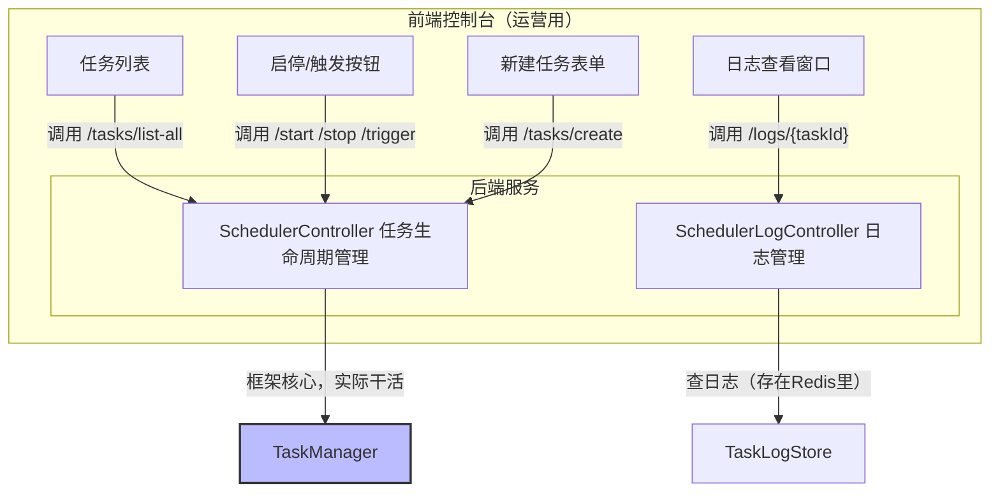

## 引言

> 前面七章咱把`hadoken-scheduler`的“家底”都摸透了——架构、持久化、监控、API、分布式锁，这些“武功”学完了，总不能光在本地练手，得拿实际业务试试水。框架好不好用，关键看能不能解决真实的业务痛点。

> 这一章咱彻底切换到“实战模式”，手把手教你用`hadoken-scheduler`搭个常见场景：**动态数据同步中心**。这玩意儿在微服务、SaaS应用里特别常用，能支持动态加任务、实时控开关，还能在集群里安全跑，不重复执行。

## 第一部分 解码业务需求：动态调度系统的核心驱动力

咱先设定个场景：假设咱在开发一个聚合平台，得从各种第三方合作方那儿同步数据到自己系统。具体需求有这么几个：

1.  **数据源能随时加/删**：合作方可能今天加一个、明天少一个，咱得做到“不用重启服务”，就能加新的同步任务，或者删掉不用的。
2.  **每个任务的调度规则不一样**：A合作方要5分钟同步一次，B合作方是商业数据，每天凌晨同步就行。每个任务的调度策略（Cron、固定频率）得能单独配。
3.  **运营能自己操作**：得给运营同学一个后台（或者API），让他们能看任务状态、查执行日志，还能手动暂停、恢复任务，甚至临时触发一次同步。
4.  **集群里跑着安全**：咱平台是多节点部署的，必须保证同一个任务同一时间只在一个节点上跑，不然数据会重复、错乱。

要是用原生`@Scheduled`，这需求几乎没法做——加个任务得改代码、重启服务，运营也没法自己操作。但用`hadoken-scheduler`，这些都不是事儿。

## 第二部分：项目基础建设 —— 构建稳固开发框架

咱先整个标准的Spring Boot项目，步骤很简单：

### 1. 加依赖（`pom.xml`）

先把需要的包引进来，核心是`hadoken-scheduler`的starter，再加上Web（要暴露API）、Redis（存任务和日志）：

```xml
<dependency>
    <groupId>com.hadoken.framework</groupId>
    <artifactId>hadoken-scheduler-spring-boot-starter</artifactId>
    <version>1.0.0</version>
</dependency>

<dependency>
    <groupId>org.springframework.boot</groupId>
    <artifactId>spring-boot-starter-web</artifactId>
</dependency>

<dependency>
    <groupId>org.springframework.boot</groupId>
    <artifactId>spring-boot-starter-data-redis</artifactId>
</dependency>
```

### 2. 写业务逻辑

咱把每个数据源的同步逻辑写成独立方法，这样后面动态调用的时候能精准定位。注意给Bean起个名字（`dataSyncService`），后面API里要用到。

```java
// DataSyncService.java
@Slf4j
@Component("dataSyncService") // 给Bean起名，后续API调用要用
public class DataSyncService {

    // 同步数据源A
    public void syncFromSourceA() {
        log.info("【数据源A】开始同步数据...");
        // 实际逻辑：调用A的API、拉数据、存数据库
        // 比如：restTemplate.getForObject("https://api.source-a.com/data", DataDTO.class);
        log.info("【数据源A】同步完成。");
    }

    // 同步数据源B
    public void syncFromSourceB() {
        log.info("【数据源B】开始同步数据...");
        // 实际逻辑：连B的数据库、查数据、同步到自己库
        log.info("【数据源B】同步完成。");
    }

    // 以后加新数据源，在这儿加方法就行
    public void syncFromSourceC() {
        log.info("【数据源C】开始同步...");
        // ...
    }
}
```

**为啥这么设计？** 因为框架的动态任务只能调用“无参方法”，所以咱把每个数据源的同步逻辑拆成独立方法，后面用API创建任务时，指定“调用哪个Bean的哪个方法”就行。

### 3. 配配置文件（`application.yml`）

把`hadoken-scheduler`的功能开起来，指定用Redis存数据、暴露API、开全局分布式锁：

```yaml
hadoken:
  scheduler:
    enabled: true # 开启hadoken-scheduler
    # 用Redis存任务定义和日志（也可以选mybatis存数据库）
    store:
      type: redis
    # 暴露API管理端点（比如/tasks/create、/tasks/stop这些）
    endpoint:
      enabled: true
    # 开全局分布式锁，默认锁5分钟（防止节点挂了锁不释放）
    lock:
      enabled: true
      default-at-most-for: PT5M # PT5M是ISO格式，代表5分钟
```

到这儿，项目架子就搭好了。启动Spring Boot应用，`hadoken-scheduler`会自动初始化，等着咱用API控任务。

## 第三部分：API 驱动任务管理实战

咱不用写任何`@EnhanceScheduled`注解，全靠API来创建、管理任务。下面用`curl`命令模拟调用（实际项目里，这些API会对接前端后台）。

### 1. 给“数据源A”加同步任务（动态创建）

假设运营在后台配置了“数据源A每1分钟同步一次”，后台系统会调用这个API创建任务：

```bash
curl -X POST http://localhost:8080/api/scheduler/tasks/create \
-H "Content-Type: application/json" \
-d '{
    "id": "sync-source-a", # 任务唯一ID（自己起，别重复）
    "description": "同步数据源A的数据", # 任务描述
    "beanName": "dataSyncService", # 要调用的Bean名（就是前面定义的）
    "methodName": "syncFromSourceA", # 要调用的方法名
    "triggerType": "FIXED_RATE", # 触发类型：固定频率（也可以选CRON）
    "triggerValue": "60000" # 触发值：60000毫秒=1分钟
}'
```

调用完之后，`hadoken-scheduler`会干这些事：
- 校验任务合法性（比如Bean和方法存在吗？ID重复吗？）
- 把任务定义存到Redis里（重启服务也不会丢）
- 立即启动任务，每1分钟集群里会有一个节点执行`dataSyncService.syncFromSourceA()`
- 因为开了全局锁，这任务会自动加分布式锁，不会多节点重复跑

### 2. 看所有任务状态

运营想知道现在有哪些任务在跑，调用这个API：

```bash
curl -X POST http://localhost:8080/api/scheduler/tasks/list-all
```

会返回一个JSON数组，里面有每个任务的详情，比如：
```json
[
    {
        "id": "sync-source-a",
        "description": "同步数据源A的数据",
        "status": "RUNNING", # 任务状态：运行中
        "nextExecutionTime": "2025-09-20T15:30:00", # 下次执行时间
        "triggerType": "FIXED_RATE",
        "triggerValue": "60000"
    }
]
```

### 3. 暂停“数据源A”任务

假设数据源A的API在维护，运营需要暂停同步，调用这个API：

```bash
curl -X POST http://localhost:8080/api/scheduler/tasks/stop/sync-source-a
```

调用后：
- 任务会立刻停止调度（下次到点也不跑）
- Redis里任务的状态会改成`STOPPED`
- 就算重启服务，这任务也不会自动启动，得手动开

### 4. 临时触发“数据源B”同步

假设运营需要“立即同步一次数据源B”，但还没给B配定时任务。步骤是：
1. 先给B创建一个“很久才执行一次”的任务（比如每天凌晨3点，避免自动跑）
2. 再调用`trigger`接口临时触发一次

**第一步：创建数据源B的任务**
```bash
curl -X POST http://localhost:8080/api/scheduler/tasks/create \
-H "Content-Type: application/json" \
-d '{
    "id": "sync-source-b",
    "description": "同步数据源B的数据",
    "beanName": "dataSyncService",
    "methodName": "syncFromSourceB",
    "triggerType": "CRON", # 用CRON表达式
    "triggerValue": "0 0 3 * * ?" # 每天凌晨3点执行
}'
```

**第二步：临时触发一次**
```bash
curl -X POST http://localhost:8080/api/scheduler/tasks/trigger/sync-source-b
```

调用后，集群会立刻有一个节点执行`syncFromSourceB()`，而且只执行一次，不影响原来的“每天凌晨3点”调度规则。

### 5. 删掉“数据源A”任务（下线）

要是咱和数据源A不合作了，需要彻底删掉任务，调用这个API：

```bash
curl -X POST http://localhost:8080/api/scheduler/tasks/delete/sync-source-a
```

框架会干这些事：
1. 先停止任务（确保不调度了）
2. 从`TaskManager`的内存里删掉任务
3. 从Redis里彻底删除任务定义（下次启动也不会有了）

## 第四部分：搭个简易控制台——让运营能自己操作

上面的API已经能实现全功能控制了，接下来只要把这些API对接个前端页面（Vue/React），就能搭个可视化控制台。



该控制台赋予运营人员强大的自主管理能力：

  * 任务状态总览：直观呈现所有任务运行状态，包括执行状态、下次执行时间等关键信息
  * 灵活任务控制：通过可视化按钮实现任务启停与临时触发，快速响应业务需求
  * 便捷任务创建：依托标准化表单界面，支持自定义任务参数配置，零代码完成任务新增
  * 日志深度分析：点击任务即可调取近 30 条执行日志，精准展示执行结果、耗时统计及异常详情

这种设计极大降低了运维成本，让运营人员无需依赖开发团队，即可高效完成任务全生命周期管理。
不用麻烦开发改代码，运营自己就能搞定，效率高多了。

## 结语：从静态编码到动态架构 —— 定时任务的服务化蜕变之路

这一章咱用真实场景演示了`hadoken-scheduler`的价值：全程没写一行调度相关的硬编码，把“调度规则”和“控制权”从开发手里，转移到了“可配置、可API调用”的层面。

这意味着咱的定时任务系统，从“嵌在代码里的小功能”，进化成了“能独立管理、被外部系统调用的调度服务”。它把复杂的底层逻辑（调度、持久化、分布式锁）都包起来，对外只给简单的HTTP接口，业务系统不用关心底层咋实现，只管调用就行。

这种“服务化”的思路，能让咱的系统更灵活——不管是加数据源、改调度规则，还是换存储方式，都不用大改代码，轻松应对业务变化。

下一章，咱聊点高级玩法：比如自己写持久化实现（不用Redis/MySQL，用MongoDB）、跟配置中心联动（改配置自动更任务），把框架的潜力再挖一挖。


