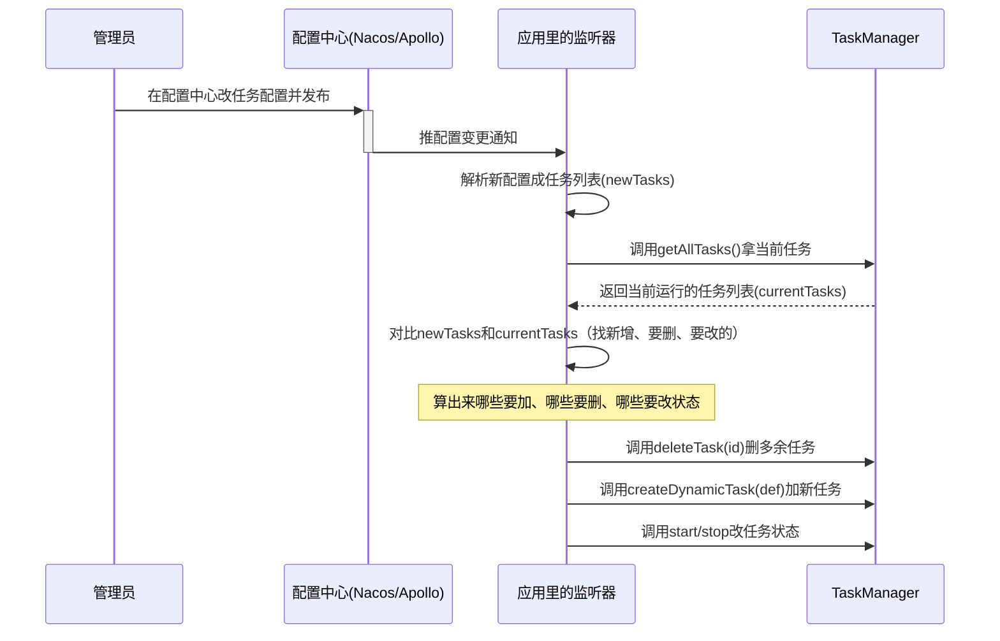

## 引言

> 到目前为止，咱把`hadoken-scheduler`从一个想法，做成了功能全、够稳定的调度服务。对80%的常规场景来说，前面讲的功能已经够用了。但真实业务里总有那20%的“特殊情况”：比如公司技术栈全靠JPA/MongoDB，框架自带的Mybatis方案用不了；或者想把任务配置统一放到Nacos/Apollo里，改一处全生效。

> 这一章咱跳出框架的“舒适区”，聊点高级玩法和扩展技巧，看看`hadoken-scheduler`作为现代框架，是咋靠开放接口和松耦合设计，适应不同场景、融入各种技术生态的。

## 第一部分：定制化持久化方案 —— 构建适配企业生态的专属语言

第四章咱讲了框架自带的三套持久化方案，但这不是说咱只能用这些。多亏了“面向接口”的设计，换个持久化实现跟换U盘一样简单。

### **为啥要自定义持久化？**

有几种常见情况：

* **技术栈要统一**：项目里全用JPA/Hibernate，总不能为了个调度框架单独加Mybatis，得用JPA实现`TaskStore`才顺手。
* **存储特殊**：用了MongoDB、Elasticsearch，或者公司自己搞的存储中间件，框架自带的方案不支持。
* **加额外逻辑**：存任务的时候想顺便写审计日志，或者发个通知，自带方案满足不了。

### **咋实现？就两步**

#### 1. 写个类实现接口

比如用JPA实现`TaskStore`，伪代码长这样：

```java
// JpaTaskStore.java
@Component // 关键：注册成Spring Bean
public class JpaTaskStore implements TaskStore {

    @Autowired
    private TaskDefinitionRepository taskRepo; // 自己写的JPA Repository

    @Override
    public void save(TaskDefinition definition) {
        // 把框架的TaskDefinition转成JPA实体
        TaskDefinitionEntity entity = TaskDefinitionEntity.from(definition);
        taskRepo.save(entity); // 用JPA存数据
    }

    // ... 实现TaskStore接口的其他方法（findById、deleteById这些）
}
```

#### 2. 注册成Bean

只要用`@Component`、`@Service`或者`@Bean`把这个类注册到Spring容器，剩下的交给框架就行。

### **背后的“黑魔法”：`@ConditionalOnMissingBean`**

还记得`HadokenSchedulerAutoConfiguration`里的这个注解不？它是灵活扩展的关键：

```java

@Bean
@ConditionalOnMissingBean(TaskStore.class) // 容器里没有TaskStore，我才生效
public TaskStore taskStore(...) {
    // 框架默认的实现（比如RedisTaskStore、MybatisTaskStore）
}
```

这套逻辑的流程是这样的：

```mermaid
graph TD
    A[Spring容器启动] --> B{扫用户配置};
    B --> C{发现用户写的`@Bean JpaTaskStore`?};
C -- " 是 " --> D[把JpaTaskStore注册成TaskStore];
D --> E{框架的taskStore()方法执行};
E --> F{@ConditionalOnMissingBean检查};
F -- " 失败！容器里已有TaskStore" --> G[框架默认Bean跳过];
C -- " 否 " --> H[框架的taskStore()方法执行];
H --> I{@ConditionalOnMissingBean检查};
I -- " 通过！容器里没TaskStore " --> J[按配置创建默认Bean（比如RedisTaskStore）];
J --> K[注册默认TaskStore];

style G fill: #fbb, stroke: #f00, stroke-width: 2px
style J fill: #bbf, stroke: #333, stroke-width: 2px
```

就这个小注解，让框架特别灵活——**用户的实现永远比框架默认的优先级高**，想换就换。

## 第二部分：配置中心联动赋能 —— 解锁任务管理的智能运维新范式

用API管任务虽然灵活，但微服务多了之后，一个个调API创建、修改任务，还是有点麻烦。

更现代的玩法是“声明式管理”：**我在配置中心里写清楚“我想要的任务状态”，系统自己帮我调成这个状态**。

### **咋实现？监听配置+自动同步**

搞个配置中心监听器，配置一改，自动调用`TaskManager`同步任务。



#### 具体步骤：

##### 1. 在配置中心定义任务格式

比如在Nacos里建个`nacos-task-config.yaml`，写清楚要哪些任务：

```yaml
# nacos-task-config.yaml
- id: sync-source-a
  description: "同步数据源A"
  beanName: "dataSyncService"
  methodName: "syncFromSourceA"
  triggerType: "CRON"
  triggerValue: "0/30 * * * * ?" # 改成30秒同步一次
  status: "RUNNING" # 期望状态是运行中
- id: sync-source-b
  description: "同步数据源B"
  beanName: "dataSyncService"
  methodName: "syncFromSourceB"
  triggerType: "CRON"
  triggerValue: "0 0 2 * * ?"
  status: "STOPPED" # 期望状态是暂停
```

##### 2. 写个监听器

在Spring Boot应用里加个监听器，监听配置中心的变更：

```java

@Component
public class NacosTaskListener {

    @Autowired
    private TaskManager taskManager;

    // Nacos的监听注解，配置变了就调用这个方法
    @NacosConfigListener(dataId = "nacos-task-config.yaml", group = "DEFAULT_GROUP")
    public void onConfigChange(String configContent) {
        // 1. 把配置内容转成List<TaskDefinition> newTasks
        List<TaskDefinition> newTasks = YamlUtil.parse(configContent, new TypeReference<List<TaskDefinition>>() {
        });

        // 2. 拿当前运行的任务
        List<ManagedTask> currentTasks = taskManager.getAllTasks();

        // 3. 对比差异：删多余的、加新的、改状态
        syncTasks(newTasks, currentTasks);
    }

    private void syncTasks(List<TaskDefinition> newTasks, List<ManagedTask> currentTasks) {
        // 这里写具体的同步逻辑：
        // - 遍历currentTasks，不在newTasks里的就删
        // - 遍历newTasks，不在currentTasks里的就加
        // - 状态不一样的就改（比如配置里是RUNNING，当前是STOPPED就启动）
    }
}
```

这样一来，改任务不用调API了，改配置中心就行，系统自己同步，微服务多了也省心。

## 第三部分：进阶探索 —— 任务参数传递的深度实践

`hadoken-scheduler`当前版本有个限制：动态任务调用的方法不能传参数——为了保证类型安全，简化反射调用。但实际业务里，经常需要给任务传参数。

虽然框架没直接支持，但咱能用设计模式绕过去。

### 小技巧：用任务ID当“参数索引”

这方法不用改框架，特别实用。

#### 1. 改造业务方法

```java

@Component
public class ParamTaskService {

    @Autowired
    private TaskParamRepository paramRepo; // 存任务参数的库（可以是DB/Redis）

    // 方法还是无参，但能通过任务ID拿参数
    public void processWithParam() {
        // 问题：咋知道当前是哪个任务在调用？
        // 框架没传上下文，这是个小坑
        String taskId = ???; // 这里需要拿到当前任务的ID
        TaskParam param = paramRepo.findByTaskId(taskId); // 按ID拿参数
        // 用参数执行业务逻辑
    }
}
```

这里的关键是“拿到当前任务ID”——框架当前没直接提供，但可以小改框架支持。

### 框架扩展方向：传`TaskDefinition`上下文

要彻底解决参数问题，框架可以加个小功能：调用方法时把`TaskDefinition`传过去。

#### 改框架的`TaskManagerImpl`：

```java
// TaskManagerImpl.java 里的resolveTaskDefinition方法
private Runnable resolveTaskDefinition(TaskDefinition definition) {
    Object bean = applicationContext.getBean(definition.getBeanName());
    Method method = findMethod(bean.getClass(), definition.getMethodName(), TaskDefinition.class); // 找带参数的方法

    // 原来的无参调用：() -> method.invoke(bean)
    // 改成传TaskDefinition：() -> method.invoke(bean, definition)
    return () -> {
        try {
            method.invoke(bean, definition); // 把任务定义传过去
        } catch (Exception e) {
            throw new RuntimeException("任务执行失败", e);
        }
    };
}
```

#### 业务方法就能这么写：

```java

@Component
public class ParamTaskService {

    @Autowired
    private TaskParamRepository paramRepo;

    // 方法接收TaskDefinition参数
    public void processWithParam(TaskDefinition context) {
        String taskId = context.getId(); // 从上下文拿任务ID
        // 还能把参数存在context的description里（用JSON格式）
        String paramJson = context.getDescription();
        TaskParam param = JSON.parseObject(paramJson, TaskParam.class);

        // 用参数执行业务逻辑
        System.out.println("任务" + taskId + "的参数是：" + param);
    }
}
```

这么一改，任务就能灵活传参数了，框架的能力又上一个台阶。

## 结语：从工具使用到架构演进的深度跃迁

优秀的技术框架，其核心价值不仅在于开箱即用的便捷性，更在于高度的可扩展性与适应性。
本章着重探讨了hadoken-scheduler框架的三大进阶实践：**自定义持久化策略、与配置中心的深度集成，以及参数化任务的拓展方案**。
这些特性充分彰显了框架 **“开放包容、灵活适配”** 的设计哲学，旨在赋予开发者深度定制的能力 —— 从被动使用框架，到主动改造框架，使其无缝融入业务场景，高效应对复杂多变的实际需求。

至此，对hadoken-scheduler的探索已接近尾声。在收官章节中，我们将系统回顾整个系列的核心要点，梳理框架设计的关键逻辑，并展望其未来的演进方向与创新可能。
