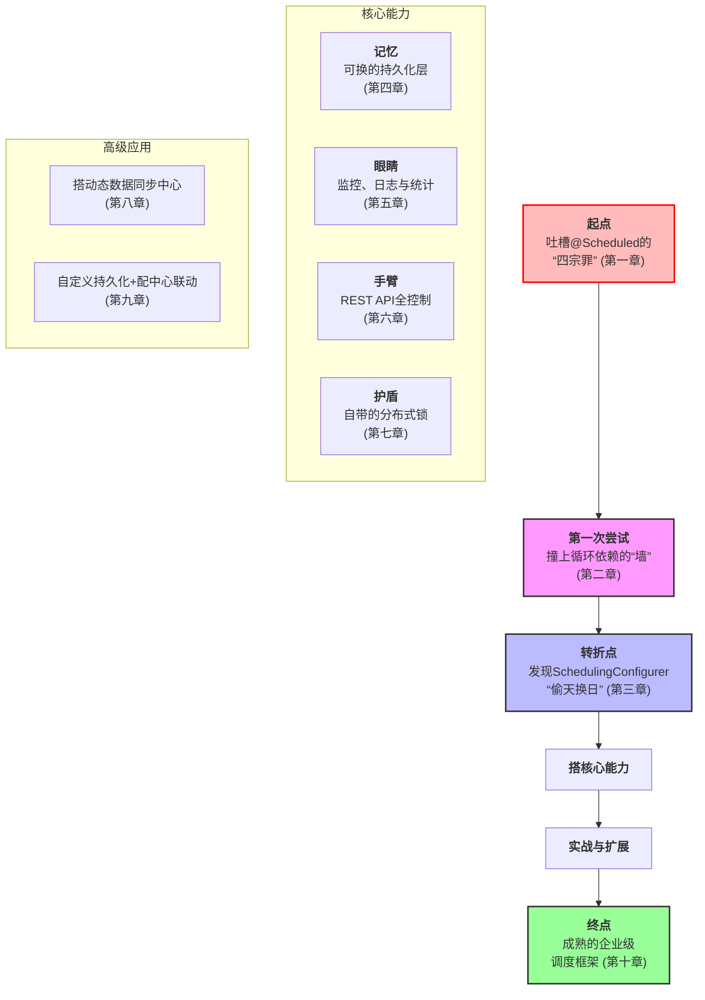
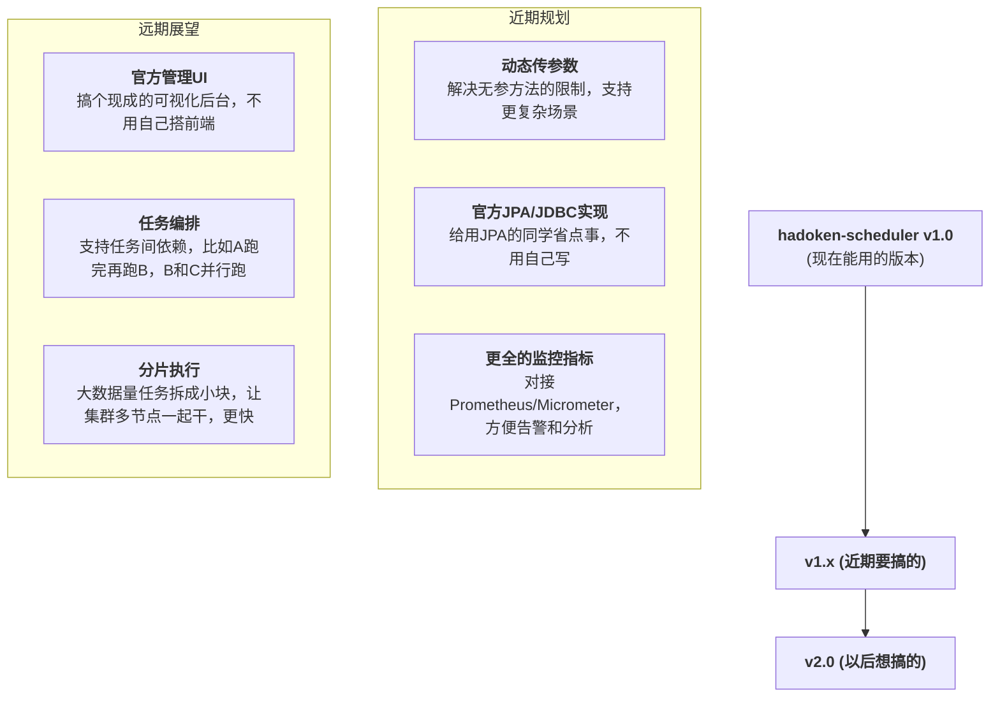

## 引言

> 过去九章，咱一起走完了一趟挺带劲的技术远征。从吐槽`@Scheduled`那几个让人头疼的毛病开始，一路解决问题、填坑，最后搞出了一套全新的调度方案。
> 咱不只是做了个叫`hadoken-scheduler`的工具，更重要的是，完整走了一遍“从发现问题→定思路→搭架构→写实现”的软件工程流程。

> 这一章作为收尾，咱不聊新技术细节了，放慢节奏好好复盘：回顾这趟旅程的关键节点，提炼贯穿始终的设计思路，再给这个“亲手养出来的框架”规划下未来的路。

## 第一部分：技术远征之路的深度复盘 —— 从痛点剖析到自主框架构建

用一张图，把咱这一路的历程串起来，看着更清楚：

咱一步步捋：

- 最开始，咱吐槽`@Scheduled`在**灵活性、集群安全、可观测性、动态性**上的坑，这是出发的理由；
- 第一次改造栽在**循环依赖**上，也正是这次失败，让咱明白得跟着Spring的生命周期走，不能硬来；
- 转折点是发现`SchedulingConfigurer`这个“突破口”，用“融入框架而非对抗框架”的思路，优雅接管了调度流程；
- 之后给框架搭“骨架”：加持久化让它“记事儿”，加监控让它“透明”，加API让它“可控”，加分布式锁让它在集群里“安全”；
- 最后用实战（搭数据同步中心）和扩展（自定义存储、配中心联动）证明，这框架不是“玩具”，是能解决真问题的“利器”。

## 第二部分：企业级动态调度框架的核心设计哲学

整个开发过程中，有三个思路像“灯塔”一样指引方向，这是`hadoken-scheduler`的“魂”：

### 1. 跟着框架节奏走，别硬刚（融入而非对抗）

咱没选择“另起炉灶”抛弃Spring调度体系，而是先摸透它的逻辑，再找`SchedulingConfigurer`
这个“约定好的接口”跟它配合。这样做的好处是框架特别“轻”，能直接用Spring生态的便利（比如Bean管理、自动配置），不用重复造轮子。

就像跟人合作：与其强行按自己的节奏来，不如先理解对方的习惯，找到合适的配合方式，效率反而更高。

### 2. 把麻烦事藏到底层（下沉复杂性）

分布式锁咋实现？任务状态咋跟踪？API咋设计才好用？这些复杂又琐碎的事，全让框架在底层搞定。对用户来说，不用关心这些细节，加个
`@EnhanceScheduled`注解、改改配置，就能用起来。

框架的核心价值不就是这样吗？**让用户专注于业务逻辑，别被基础设施的破事分心**。

### 3. 先定规矩再填内容（面向接口，可插拔）

不管是`TaskStore`（存任务）、`TaskLogStore`（存日志），还是`DistributedLockProvider`
（分布式锁），咱都是先定义好接口（规矩），再写具体实现（比如Redis版、Mybatis版）。

这样做的好处是“灵活”——技术一直在变，只要接口不变，以后想换MongoDB存任务、换ZooKeeper做分布式锁，直接加个实现类就行，不用改框架核心代码，框架的生命力才强。

## 探索与展望 —— 即将解锁的前沿功能

`hadoken-scheduler`1.0版本已经能打了，但这只是开始。未来还有不少值得做的事，分近期和远期规划：

### 近期要搞定的：

- **动态传参数**：这是第九章聊到的痛点，搞定了就能支持更多业务场景（比如不同任务传不同参数同步数据）；
- **官方JPA/JDBC实现**：现在官方有Redis、Mybatis版，再加JPA和纯JDBC版，用各种ORM的同学都能直接用；
- **更全的监控指标**：比如任务执行成功率、平均耗时、排队数这些，对接监控系统后，能及时发现任务变慢、失败率升高等问题。

### 以后想实现的：

- **官方管理UI**：搞个独立的前端项目，用户配置下地址就能用，不用自己写Vue/React页面；
- **任务编排**：从“管单个任务”升级到“管一堆有依赖的任务”，比如生成报表前先同步数据，同步数据分A、B两个数据源并行同步；
- **分片执行**：比如同步100万条数据，拆成10片，让10个节点各同步10万条，比一个节点干快10倍。

## 结语：从造轮子到共成长，这场技术探索永不停歇

从一个简单的想法开始，用十章内容，咱完整见证了一个企业级调度框架的诞生。`hadoken-scheduler`
的故事，其实是每个爱技术的工程师都会有的经历：发现问题、想办法、动手做、追求更好。

这个系列到这就结束了，但`hadoken-scheduler`的故事才刚开始。它不只是我一个人的作品，更希望能变成大家一起维护的项目——如果你用的时候发现BUG，或者有更好的想法，欢迎提Issue、贡献代码。

毕竟，技术圈最酷的事，从来都是“咱们一起把东西做得更牛”。谢谢大家一路看完！
