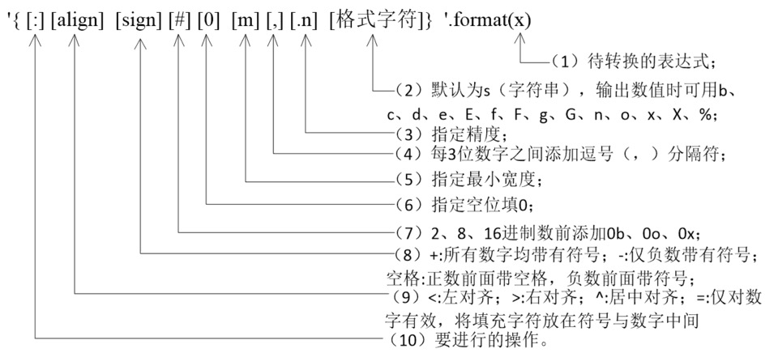
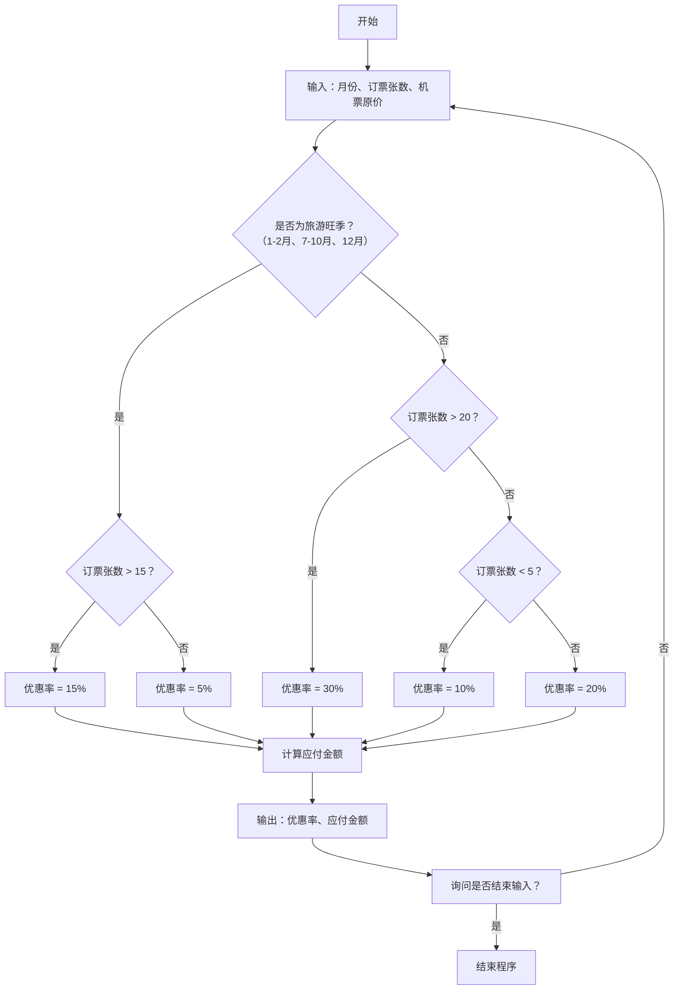

本项目来源于和鲸社区，使用转载需要标注来源
* 作者: 和鲸社区
* 来源: 和鲸社区

<!-- more -->

* toc
{:toc}

# Python常用数据结构

## 内容概要
  * 字符串的使用 - 计算长度 / 下标运算 / 切片 / 常用方法
  * 列表基本用法 - 定义列表 / 用下表访问元素 / 下标越界 / 添加元素 / 删除元素 / 修改元素 / 切片 / 循环遍历
  * 列表常用操作 - 连接 / 复制(复制元素和复制数组) / 长度 / 排序 / 倒转 / 查找
  * 生成列表 - 使用range创建数字列表 / 生成表达式 / 生成器
  * 元组的使用 - 定义元组 / 使用元组中的值 / 修改元组变量 / 元组和列表转换
  * 集合基本用法 - 集合和列表的区别 / 创建集合 / 添加元素 / 删除元素 / 清空
  * 集合常用操作 - 交集 / 并集 / 差集 / 对称差 / 子集 / 超集
  * 字典的基本用法 - 字典的特点 / 创建字典 / 添加元素 / 删除元素 / 取值 / 清空
  * 字典常用操作 - keys()方法 / values()方法 / items()方法 / setdefault()方法 
  * 基础练习


## 1.字符串的构造

在Python中字符串的构造，主要通过两种方法来实现，一是使用str函数，二是用单引号、双引号或三引号。在Python中，使用引号是一种非常便捷的构造字符串方式。

### 1.1 单引号或双引号构造字符串

* 在用单引号或双引号构造字符串时，要求引号成对出现。
* 如：'Python World!'、'ABC'、"what is your name？"，都是构造字符串的方法。
* 'string"在Python中不是一个合法的字符串。

### 1.2 单双引号构造字符串的特殊用法

如果代码中的字符串包含了单引号，且不用转义字符，那么整个字符串就要用双引号来构造，否则就会出错。

```python
print("let's go!")
```

```python
print('let's go!')
```

### 1.3 字符串中引号的转义
字符串中引号的转义，可以解决上面的错误。

```python
print('let\'s go!')
```

> 上面代码中的反斜线“\”对字符串中的引号进行了转义，表示反斜线后的单引号是字符串中的一个字符，而不是字符串的构造字符。

### 1.4 转义字符

转义字符以“\”开头，后接某些特定的字符或数字。Python中常用的转义字符如表5所示。


```python
print('你好\n再见') #\n表示换行，相当于敲了一个回车键
print('你好我好\t大家都很好\t爱你们')
print('\123\x6a') #8进制数123对应的字符是's'，16进制数6a对应的字符是'j'
```

在字符串前面加上字母r或R表示原始字符串，所有的字符都是原始的本义而不会进行任何转义。

```python
print('C:\test\net') #字符串中“\t”和“\n”都表示转义字符
print(r'C:\test\net')
```

### 1.5 三重引号字符串

三重引号字符串是一种特殊的用法。三重引号将保留所有字符串的格式信息。如字符串跨越多行，行与行之间的回车符、引号、制表符或者其他任何信息，都将保存下来。在三重引号中可以自由的使用单引号和双引号。

```python
print('''"what's your name?"
    "My name is jone"''')
```


## 2. 字符串格式化

使用print()函数很容易输出各种对象，但print()函数无法输出设计复杂的格式。Python提供了字符串格式化的方法来处理复杂格式的字符串。

### 2.1 %符号格式化字符串

* 字符串格式化涉及到两个概念：格式和格式化，其中格式以%开头，格式化运算符用%表示用对象代替格式串中的格式，最终得到1个字符串。
* 字符串格式化的一般形式如图5所示：


#### 2.1.1 字符串格式的书写
* []中的内容可以省略；
* 简单的格式是%加格式字符，如%f、%d、%c等；
* 当最小宽度及精度都出现时，它们之间不能有空格，格式字符和其他选项之间也不能有空格，如%8.2f。


#### 2.1.2 常用格式字符的含义


```python
name='Lily'
age=18
print('我叫%s,今年%d岁'%(name,age))#一次转换多个对象，这些对象表示成一个元组形式，位置与格式化字符一一对应
```


### 2.2 format()方法格式化字符串
format()方法是通过{}和:来代替传统%方式。一般形式如图所示:



format方法格式化时，可以使用位置参数，根据位置来传递参数;也可以通过索引值来引用位置参数，只要format方法相应位置上有参数值即可，参数索引从0开始；

```python
print('我叫{}，今年{}岁'.format('张三',18))
print('我叫{0}，今年{1}岁'.format('张三',18))
print('我叫{1}，今年{0}岁'.format(18,'张三'))
```

### 2.3 f-string格式化字符
f-string 格式化字符串以 f 开头，后面跟着字符串，字符串中的表达式用大括号 {} 包起来，它会将变量或表达式计算后的值替换进去，实例如下：

```python
name='张三'
age=18
print(f'我叫{name},今年{age}岁')
```

## 3. 字符串截取

* 字符串的截取就是取出字符串中的子串。截取有两种方法：一种是索引 `str[index]` 取出单个字符；另一种是切片 `str[[start]:[end]:[step]]` 取出一片字符。切片方式与列表部分介绍的一样。
* 字符串中字符的索引跟列表一样，可以双向索引。如图所示:

```python
s='student'
print(s[0])
print(s[-1])
print(s[1:3])#取出位置1到位置2的字符，不包括位置3的字符
print(s[:3])#取出从头到位置2的字符
print(s[-2:])#取出从倒数第2个位置开始的所有字符
print(s[:])#取出全部字符
print(s[::2])#步长为2
```

**实例**

Python为字符串类型提供了非常丰富的运算符，我们可以使用+运算符来实现字符串的拼接，可以使用*运算符来重复一个字符串的内容，可以使用in和not in来判断一个字符串是否包含另外一个字符串（成员运算），我们也可以用[]和[:]运算符从字符串取出某个字符或某些字符（切片运算），代码如下所示。

```python
a = "Hello"
b = "Python"

print("a + b 输出结果：", a + b)
print("a * 2 输出结果：", a * 2)
print("a[1] 输出结果：", a[1])
print("a[1:4] 输出结果：", a[1:4])

if( "H" in a) :
    print("H 在变量 a 中")
else :
    print("H 不在变量 a 中")

if( "M" not in a) :
    print("M 不在变量 a 中")
else :
    print("M 在变量 a 中")

print (r'\n')
print (R'\n')
```

在Python中，我们还可以通过一系列的方法来完成对字符串的处理，代码如下所示。

```python
str1 = 'hello, world!'
# 通过内置函数len计算字符串的长度
print(len(str1)) # 13
# 获得字符串首字母大写的拷贝
print(str1.capitalize()) # Hello, world!
# 获得字符串每个单词首字母大写的拷贝
print(str1.title()) # Hello, World!
# 获得字符串变大写后的拷贝
print(str1.upper()) # HELLO, WORLD!
# 从字符串中查找子串所在位置
print(str1.find('or')) # 8
print(str1.find('shit')) # -1
# 与find类似但找不到子串时会引发异常
# print(str1.index('or'))
# print(str1.index('shit'))

# 检查字符串是否以指定的字符串开头
print(str1.startswith('He')) # False
print(str1.startswith('hel')) # True
# 检查字符串是否以指定的字符串结尾
print(str1.endswith('!')) # True
# 将字符串以指定的宽度居中并在两侧填充指定的字符
print(str1.center(50, '*'))
# 将字符串以指定的宽度靠右放置左侧填充指定的字符
print(str1.rjust(50, ' '))
str2 = 'abc123456'
# 检查字符串是否由数字构成
print(str2.isdigit())  # False
# 检查字符串是否以字母构成
print(str2.isalpha())  # False
# 检查字符串是否以数字和字母构成
print(str2.isalnum())  # True

str3 = '  jackfrued@126.com '
print(str3)
# 获得字符串修剪左右两侧空格之后的拷贝
print(str3.strip())
```

## 4. 列表
* 不知道大家是否注意到，刚才我们讲到的字符串类型（str）和之前我们讲到的数值类型（int和float）有一些区别。
* 数值类型是标量类型，也就是说这种类型的对象没有可以访问的内部结构；而字符串类型是一种结构化的、非标量类型，所以才会有一系列的属性和方法。 
* 接下来我们要介绍的列表（list），也是一种结构化的、非标量类型，它是值的有序序列，每个值都可以通过索引进行标识，定义列表可以将列表的元素放在[]中，多个元素用,进行分隔，可以使用for循环对列表元素进行遍历，也可以使用[]或[:]运算符取出列表中的一个或多个元素。 
 
下面的代码演示了如何定义列表、如何遍历列表以及列表的下标运算。

```python
list1 = [1, 3, 5, 7, 100]#创建列表
print(list1) # [1, 3, 5, 7, 100]

# 乘号表示列表元素的重复
list2 = ['hello'] * 3
print(list2) # ['hello', 'hello', 'hello']
# 计算列表长度(元素个数)
print(len(list1)) # 5
# 下标(索引)运算
print(list1[0]) # 1
print(list1[4]) # 100
# print(list1[5])  # IndexError: list index out of range
print(list1[-1]) # 100
print(list1[-3]) # 5
```

```python
# 通过循环用下标遍历列表元素
for index in range(len(list1)):
    print(list1[index])

# 通过for循环遍历列表元素
for elem in list1:
    print(elem)

# 通过enumerate函数处理列表之后再遍历可以同时获得元素索引和值
for index, elem in enumerate(list1):
    print(index, elem)
```


### 4.1 更新列表

你可以对列表的数据项进行修改或更新，你也可以使用 append() 方法来添加列表项，如下所示

```python
list = ['Google', 'modelwhale', 1997, 2000]

print ("第三个元素为 : ", list[2])
list[2] = 2001
print ("更新后的第三个元素为 : ", list[2])

list1 = ['Google', 'modelwhale', 'Taobao']
list1.append('Baidu')
print ("更新后的列表 : ", list1)
```

```python
list1 = [1, 3, 5, 7, 100]
# 添加元素
list1.append(200)
list1.insert(1, 400)

# 合并两个列表
# list1.extend([1000, 2000])
list1 += [1000, 2000]
print(list1) # [1, 400, 3, 5, 7, 100, 200, 1000, 2000]
print(len(list1)) # 9
```


### 4.2 删除列表元素

可以使用 del 语句来删除列表的的元素，如下实例：也可以使用remove函数

```python
list = ['Google', 'modelwhale', 1997, 2000]

print ("原始列表 : ", list)
del list[2]
print ("删除第三个元素 : ", list)
```

```python
list1=[1, 400, 3, 5, 7, 100, 200, 1000, 2000]
# 先通过成员运算判断元素是否在列表中，如果存在就删除该元素
if 3 in list1:
    list1.remove(3)
if 1234 in list1:
    list1.remove(1234)
print(list1) # [1, 400, 5, 7, 100, 200, 1000, 2000]

# 从指定的位置删除元素
list1.pop(0)
list1.pop(len(list1) - 1)
print(list1) # [400, 5, 7, 100, 200, 1000]

# 清空列表元素
list1.clear()
print(list1) # []
```

### 4.3 列表截取与拼接

和字符串一样，列表也可以做切片操作，通过切片操作我们可以实现对列表的复制或者将列表中的一部分取出来创建出新的列表，代码如下所示。

```python
fruits = ['grape', 'apple', 'strawberry', 'waxberry']
fruits += ['pitaya', 'pear', 'mango']
# 列表切片
fruits2 = fruits[1:4]
print(fruits2) # apple strawberry waxberry

# 可以通过完整切片操作来复制列表
fruits3 = fruits[:]
print(fruits3) # ['grape', 'apple', 'strawberry', 'waxberry', 'pitaya', 'pear', 'mango']
fruits4 = fruits[-3:-1]
print(fruits4) # ['pitaya', 'pear']

# 可以通过反向切片操作来获得倒转后的列表的拷贝
fruits5 = fruits[::-1]
print(fruits5) # ['mango', 'pear', 'pitaya', 'waxberry', 'strawberry', 'apple', 'grape']
```

### 4.4 列表的排序

下面的代码实现了对列表的排序操作。

```python
list1 = ['orange', 'apple', 'zoo', 'internationalization', 'blueberry']
list2 = sorted(list1)
# sorted函数返回列表排序后的拷贝不会修改传入的列表
# 函数的设计就应该像sorted函数一样尽可能不产生副作用
list3 = sorted(list1, reverse=True)
# 通过key关键字参数指定根据字符串长度进行排序而不是默认的字母表顺序
list4 = sorted(list1, key=len)
print(list1)
print(list2)
print(list3)
print(list4)
# 给列表对象发出排序消息直接在列表对象上进行排序
list1.sort(reverse=True)
print(list1)
```


## 5. 使用元组

Python中的元组与列表类似也是一种容器数据类型，可以用一个变量（对象）来存储多个数据，不同之处在于元组的元素不能修改，在前面的代码中我们已经不止一次使用过元组了。顾名思义，我们把多个元素组合到一起就形成了一个元组，所以它和列表一样可以保存多条数据。下面的代码演示了如何定义和使用元组。

```python
# 定义元组
t = ('李小锤', 38, True, '四川成都')
print(t)

# 获取元组中的元素
print(t[0])
print(t[3])

# 遍历元组中的值
for member in t:
    print(member)

# 重新给元组赋值
# t[0] = '王大锤'  # TypeError
# 变量t重新引用了新的元组原来的元组将被垃圾回收
t = ('王大锤', 20, True, '云南昆明')
print(t)

# 将元组转换成列表
person = list(t)
print(person)

# 列表是可以修改它的元素的
person[0] = '李小龙'
person[1] = 25
print(person)

# 将列表转换成元组
fruits_list = ['apple', 'banana', 'orange']
fruits_tuple = tuple(fruits_list)
print(fruits_tuple)
```

这里有一个非常值得探讨的问题，我们已经有了列表这种数据结构，为什么还需要元组这样的类型呢？

1. 元组中的元素是无法修改的，事实上我们在项目中尤其是多线程环境（后面会讲到）中可能更喜欢使用的是那些不变对象。所以结论就是：如果不需要对元素进行添加、删除、修改的时候，可以考虑使用元组，当然如果一个方法要返回多个值，使用元组也是不错的选择。
2. 元组在创建时间和占用的空间上面都优于列表。

## 6. 使用集合

Python中的集合跟数学上的集合是一致的，不允许有重复元素，而且可以进行交集、并集、差集等运算。

可以按照下面代码所示的方式来创建和使用集合。

```python
# 创建集合的字面量语法
set1 = {1, 2, 3, 3, 3, 2}
print(set1)
print('Length =', len(set1))

# 创建集合的构造器语法(面向对象部分会进行详细讲解)
set2 = set(range(1, 10))
set3 = set((1, 2, 3, 3, 2, 1)) #集合不允许有重复元素因此set3={1，2，3}
print(set2, set3)

# 创建集合的推导式语法(推导式也可以用于推导集合)
set4 = {num for num in range(1, 100) if num % 3 == 0 or num % 5 == 0}#1-100之间能整除3或者5的数字创建集合
print(set4)
```


向集合添加元素和从集合删除元素。

```python
set1.add(4)
set1.add(5)
set2.update([11, 12])
set2.discard(5)
if 4 in set2:
    set2.remove(4)

print(set1, set2)
print(set3.pop())
print(set3)
```

集合的成员、交集、并集、差集等运算。

```python

# 集合的交集、并集、差集、对称差运算
print(set1 & set2)
# print(set1.intersection(set2))
print(set1 | set2)
# print(set1.union(set2))
print(set1 - set2)
# print(set1.difference(set2))
print(set1 ^ set2)
# print(set1.symmetric_difference(set2))

# 判断子集和超集
print(set2 <= set1)
# print(set2.issubset(set1))
print(set3 <= set1)
# print(set3.issubset(set1))
print(set1 >= set2)
# print(set1.issuperset(set2))
print(set1 >= set3)
# print(set1.issuperset(set3))
```

## 7. 使用字典 

字典是另一种可变容器模型，Python中的字典跟我们生活中使用的字典是一样一样的，它可以存储任意类型对象，与列表、集合不同的是，字典的每个元素都是由一个键和一个值组成的“键值对”，键和值通过冒号分开。下面的代码演示了如何定义和使用字典。

```python
# 创建字典的字面量语法
scores = {'骆昊': 95, '白元芳': 78, '狄仁杰': 82}
print(scores)
# 创建字典的构造器语法
items1 = dict(one=1, two=2, three=3, four=4)
# 通过zip函数将两个序列压成字典
items2 = dict(zip(['a', 'b', 'c'], '123'))
# 创建字典的推导式语法
items3 = {num: num ** 2 for num in range(1, 10)}
print(items1, items2, items3)
# 通过键可以获取字典中对应的值
print(scores['骆昊'])
print(scores['狄仁杰'])
# 对字典中所有键值对进行遍历
for key in scores:
    print(f'{key}: {scores[key]}')
# 更新字典中的元素
scores['白元芳'] = 65
scores['诸葛王朗'] = 71
scores.update(冷面=67, 方启鹤=85)
print(scores)
if '武则天' in scores:
    print(scores['武则天'])

print(scores.get('武则天'))
# get方法也是通过键获取对应的值但是可以设置默认值
print(scores.get('武则天', 60))
# 删除字典中的元素
print(scores.popitem())
print(scores.popitem())
print(scores.pop('骆昊', 100))
# 清空字典
scores.clear()
print(scores)
```

## ✍作业
### 题目1：计算约瑟夫环问题

tips：《幸运的基督徒》

有15个基督徒和15个非基督徒在海上遇险，为了能让一部分人活下来不得不将其中15个人扔到海里面去，
有个人想了个办法就是大家围成一个圈，由某个人开始从1报数，报到9的人就扔到海里面，
他后面的人接着从1开始报数，报到9的人继续扔到海里面，直到扔掉15个人。
由于上帝的保佑，15个基督徒都幸免于难，问这些人最开始是怎么站的，哪些位置是基督徒哪些位置是非基督徒。
输出最后站位，用1表示是基督徒，0表示非基督徒；

> ⚠️ 约瑟夫环问题中的1和0最好用字符串表示，不要用数字，因为下面代码合并的时候会根据第二题浮点型数字默认第一题的整型数据也为浮点型


这不是一个简单的模拟题，而是构造一个满足条件的初始排列的问题。

**解法核心：**

* 我们不知道谁是起点，也不知道初始排列。
* 目标是找到一种初始排列方式（长度为30的数组，包含15个1和15个0），使得按照约瑟夫环规则淘汰15人后，剩下的15个位置全是1（基督徒）。

所以我们可以：
* 构造一个空的列表；
* 然后依次模拟被淘汰的人的位置；
* 把这些位置标记为非基督徒（0）；
* 剩下的位置就是基督徒（1）。


```python
def find_christian_positions(total_people=30, kill_step=9, num_to_kill=15):
    # 初始时所有人都不存在，初始化全为 0，后续设置幸存者为 1
    people = [0] * total_people

    # 当前人的索引（从0开始）
    current_index = 0

    # 存储被淘汰的人的索引
    eliminated = []

    # 模拟约瑟夫环过程，直到淘汰15人
    for _ in range(num_to_kill):
        # 数8步（因为当前人也算一步）
        current_index = (current_index + kill_step - 1) % len(people)
        # 记录要被淘汰的人的位置
        eliminated_person = people.pop(current_index)
        eliminated.append(eliminated_person)

    # 此时 people 中剩下的是15个应该为基督徒的位置
    # 但是我们之前初始化的是 0 ，所以我们现在反向设置：
    # 所有人初始化为1（基督徒）
    final_positions = [1] * total_people

    # 被淘汰的15个人（即要设为0的位置）在原数组中的索引
    # 因为我们pop了元素，所以要重新计算原始索引
    original_indices = []
    temp_list = list(range(total_people))  # 模拟删除过程，获取真实被淘汰索引
    current_index = 0
    for _ in range(num_to_kill):
        current_index = (current_index + kill_step - 1) % len(temp_list)
        original_index = temp_list.pop(current_index)
        original_indices.append(original_index)

    # 将被淘汰的15个位置设为0（非基督徒）
    for idx in original_indices:
        final_positions[idx] = 0
    return final_positions

# 调用函数并输出结果
result = find_christian_positions()
print(result)
```


```python
L1 = [1, 1, 1, 1, 0, 0, 0, 0, 0, 1, 1, 0, 1, 1, 1, 0, 1, 0, 0, 1, 1, 0, 0, 0, 1, 0, 0, 1, 1, 0]
```

### 题目2：计算机票票价

某航空公司机票采用浮动制：根据月份和订票张数来确定机票的优惠率：

* 旅游旺季（1~2月、7月~10月、12月），如果订票张数超过15张，票价优惠15%，否则票价优惠5%；
* 其余月份为旅游淡季，旅游淡季时如果订票张数超过20张，票价优惠30%，订票张数5张以下，票价优惠10%，其余情况票价优惠20%。

从键盘输入月份、订票张数和机票原价，输出票价优惠率和应付票款（=机票原价×订票张数×（1-优惠率）），询问是否输入结束，当输入提示为“y”或者“yes”（大小写无关）的时候结束输入。（为了简单，默认输入均正确。）

按照下面程序给的运行结果计算出票款优惠率和应付票款，并保存到 L2 中：

```python
请输入月份：2    
请输入订票张数：20    
请输入机票原价：2000    
票价优惠率：0.15    
应付票款：34000.0    
输入结束了吗？（y或yes结束，大小写无关，其他继续）：n    
请输入月份：
```



```python
# 航空公司浮动票价计算程序
def calculate_discount_rate(month, tickets):
    """
    根据月份和订票数量返回优惠率
    :param month: int, 月份 (1~12)
    :param tickets: int, 订票张数
    :return: float, 优惠率（如0.15表示15%）
    """
    # 判断是否是旅游旺季：1-2月、7-10月、12月
    if month in [1, 2, 7, 8, 9, 10, 12]:
        # 旺季逻辑
        if tickets > 15:
            return 0.15  # 超过15张，优惠15%
        else:
            return 0.05  # 否则优惠5%
    else:
        # 淡季逻辑
        if tickets > 20:
            return 0.30  # 超过20张，优惠30%
        elif tickets < 5:
            return 0.10  # 不足5张，优惠10%
        else:
            return 0.20  # 其他情况优惠20%

def main():
    """
    主函数：处理用户输入和输出
    """
    while True:
        # 接收用户输入
        month = int(input("请输入月份(1~12)："))
        tickets = int(input("请输入订票张数："))
        price = float(input("请输入机票原价："))

        # 计算优惠率
        discount_rate = calculate_discount_rate(month, tickets)

        # 计算应付金额：原价 × 张数 × (1 - 优惠率)
        total_cost = price * tickets * (1 - discount_rate)

        # 输出结果
        print(f"票价优惠率为：{discount_rate * 100:.0f}%")
        print(f"应付票款为：{total_cost:.2f}元")

        # 判断是否结束输入
        choice = input("是否结束输入？(y/yes): ").strip().lower()
        if choice == 'y' or choice == 'yes':
            print("感谢使用，再见！")
            break

# 启动主程序
if __name__ == "__main__":
    main()
```

```python
L2 = [0.15, 34000.0] # 开始写作业 加油
```


### 题目3：计算指定的年月日是这一年的第几天。

给定三个日期：1980-11-28，2020-1-1，2021-5-1，计算该年的多少天，并保存到L3中


**算法思路**

* 判断是否为闰年：根据公历规则，如果年份能被4整除但不能被100整除，或者能被400整除，则该年为闰年。闰年2月有29天，平年2月有28天。
* 每个月的天数：除了2月以外，其他月份的天数都是固定的（1月31天、3月31天、4月30天等）。因此，我们需要一个数组来存储每个月的天数，并且对于闰年情况，将2月的天数设置为29。
* 累计天数：从1月到给定日期的前一个月逐月累加每个月的天数，最后加上给定日期所在月的日数

```python
def is_leap_year(year):
    """判断是否为闰年"""
    return year % 4 == 0 and (year % 100 != 0 or year % 400 == 0)

def day_of_year(year, month, day):
    """计算指定年月日是一年的第几天"""
    
    # 每个月的天数，默认按照平年计算
    days_in_month = [31, 28, 31, 30, 31, 30, 31, 31, 30, 31, 30, 31]
    
    # 如果是闰年，修改2月的天数为29
    if is_leap_year(year):
        days_in_month[1] = 29
    
    # 计算从1月到上一个月的总天数
    total_days = sum(days_in_month[:month - 1])
    
    # 加上当月的天数
    total_days += day
    
    return total_days

# 示例调用
if __name__ == "__main__":
    print(day_of_year(1980, 11, 28))
    print(day_of_year(2020, 1, 1))
    print(day_of_year(2021, 5, 1))
```


```python
L3 = [333, 1, 121] # 开始写作业 加油
```


