[分布式事务（ 图解 + 史上最全 + 吐血推荐 ）](https://www.cnblogs.com/crazymakercircle/p/13917517.html)

参考链接系统架构知识图谱（一张价值10w的系统架构知识图谱）

[https://www.processon.com/view/link/60fb9421637689719d246739](https://www.processon.com/view/link/60fb9421637689719d246739)

秒杀系统的架构

[https://www.processon.com/view/link/61148c2b1e08536191d8f92f](https://www.processon.com/view/link/61148c2b1e08536191d8f92f)

先来看下为什么会产生分布式事务问题

## 分布式事务使用场景

简单来说：

一次业务操作需要跨多个数据源或需要跨多个系统进行远程调用,就会产生分布式事务问题

作为典型案例，搬出经典的银行转账问题：

**需求：**

假设银行(bank)中有两个客户(name)张三和李四, 我们需要将张三的1000元存款(sal)转到李四的账户上

**约束：**

不能出现中间状态，张三减1000，李四没加 ， 或者 反之

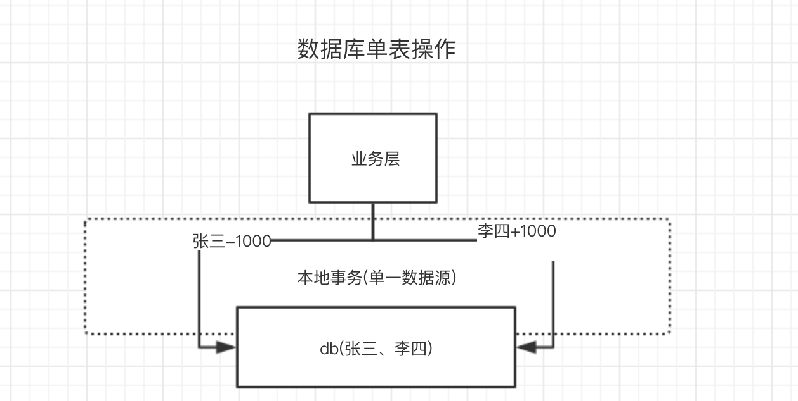

如果两个用户对应的银行存款数据在一个数据源中，即一个数据库中，那么通过spring框架下的@Transactional注解来保证单一数据源增删改查的一致性。

### 数据库的水平分割倒逼分布式事务

但是随着业务的不断扩大，用户数在不断变多，几百万几千万用户时数据可以存一个库甚至一个表里，假设有10个亿的用户？

一个表当然放不下，需要分表，当然需要分库来配合。

为了解决数据库上的瓶颈，分库是很常见的解决方案，不同用户就可能落在不同的数据库里，原来一个库里的事务操作，现在变成了跨数据库的事务操作。

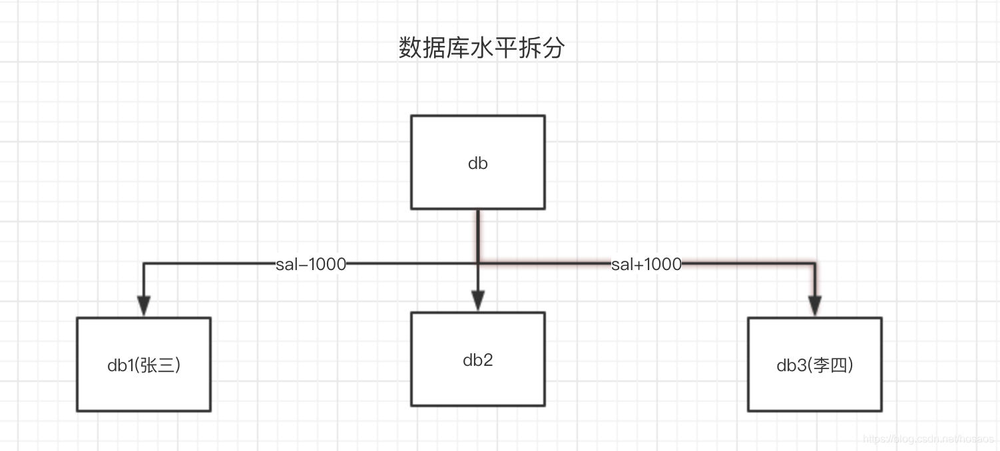

此时@Transactional注解就失效了，这就是**跨数据库分布式事务问题**

### 微服务化倒逼分布式事务

当然，更多的情形是随着业务不断增长，将业务中不同模块服务拆分成微服务后，同时调用多个微服务所产生的

设想一个传统的单体应用，无论多少内部调用，最后终归是在同一个数据库上进行操作来完成一向业务操作，如图：

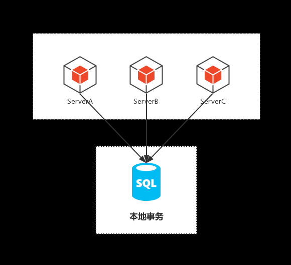

随着业务量的发展，业务需求和架构发生了巨大的变化，整体架构由原来的单体应用逐渐拆分成为了微服务，

原来的3个服务被从一个单体架构上拆开了，成为了3个独立的服务，分别使用独立的数据源，也不在之前共享同一个数据源了，具体的业务将由三个服务的调用来完成，如图：

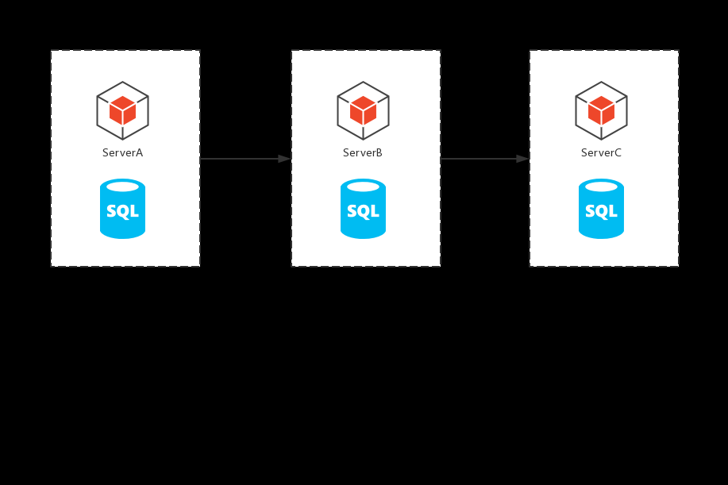

此时，每一个服务的内部数据一致性仍然有本地事务来保证。

但是面对整个业务流程上的事务应该如何保证呢？这就是在微服务架构下面临的挑战，如何保证在微服务中的数据一致性。

微服务化的银行转账情景往往是这样的

1. 调用交易系统服务创建交易订单；
2. 调用支付系统记录支付明细；
3. 调用账务系统执行 A 扣钱；
4. 调用账务系统执行 B 加钱;
5. 调用账务系统执行 B 加钱;

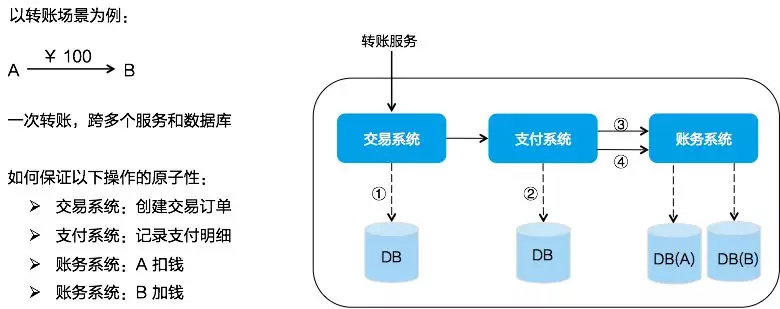

如图所示，每个系统都对应一个独立的数据源，且可能位于不同机房，同时调用多个系统的服务很难保证同时成功，这就是**跨服务分布式事务问题**

### 10WQPS秒杀实操的分库架构

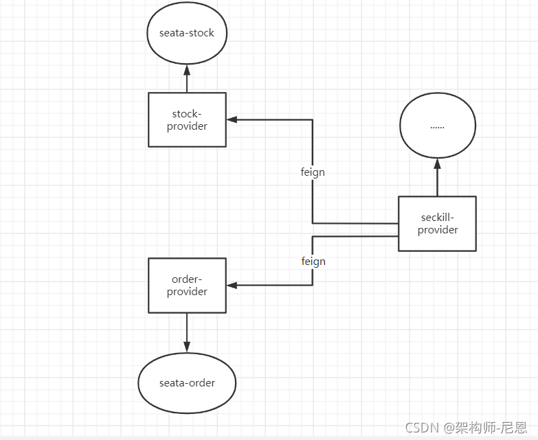

## Spring Cloud Alibaba Seata

解决分布式事务问题，有两个设计初衷

- 对业务无侵入：即减少技术架构上的微服务化所带来的分布式事务问题对业务的侵入
- 高性能：减少分布式事务解决方案所带来的性能消耗

seata中常用的有两种分布式事务实现方案，AT及TCC

- AT模式主要关注多 DB 访问的数据一致性，当然也包括多服务下的多 DB 数据访问一致性问题
- TCC 模式主要关注业务拆分，在按照业务横向扩展资源时，解决微服务间调用的一致性问题

### AT模式(业务侵入小)

Seata AT模式是基于XA事务演进而来的一个分布式事务中间件，

XA是一个基于数据库实现的分布式事务协议，本质上和两阶段提交一样，需要数据库支持，Mysql5.6以上版本支持XA协议，其他数据库如Oracle，DB2也实现了XA接口

### AT模式角色如下

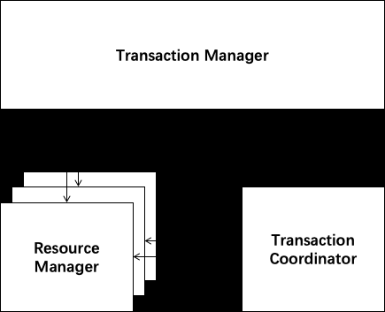

6. Transaction Coordinator (TC)：
事务协调器，维护全局事务的运行状态，负责协调并驱动全局事务的提交或回滚
7. Transaction Manager
™
：

控制全局事务的边界，负责开启一个全局事务，并最终发起全局提交或全局回滚的决议

8. Resource Manager (RM)：

控制分支事务，负责分支注册、状态汇报，并接收事务协调器的指令，驱动分支（本地）事务的提交和回滚

### **AT模式(2PC)基本处理逻辑如下**

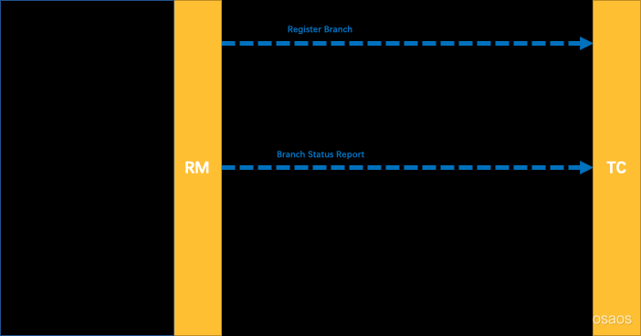

Branch就是指的分布式事务中每个独立的本地局部事务

### AT模式第一阶段

Seata 的 JDBC 数据源代理通过对业务 SQL 的解析，把业务数据在更新前后的数据镜像组织成回滚日志，利用 本地事务 的 ACID 特性，将业务数据的更新和回滚日志的写入在同一个 本地事务 中提交。

这样，可以保证：**任何提交的业务数据的更新一定有相应的回滚日志存在**

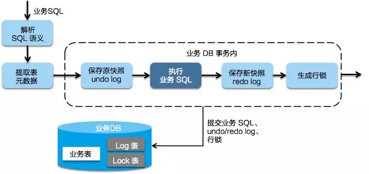

基于这样的机制，分支的本地事务便可以在全局事务的第一阶段提交，并马上释放本地事务锁定的资源

### **这也是Seata和XA事务的不同之处：**

经典的2PC两阶段提交（XA）往往对**资源的锁定需要持续到第二阶段实际的提交或者回滚操作**，

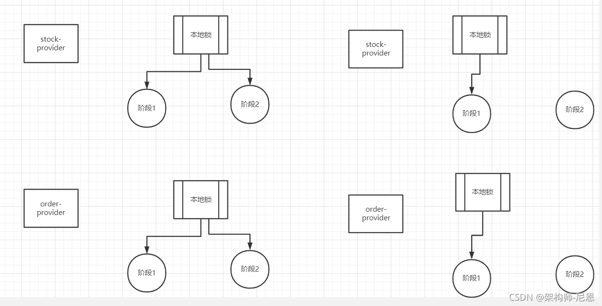

AT模式，可以在第一阶段释放对资源的锁定，降低了锁范围

谁的功劳：回滚日志

### AT模式第二阶段

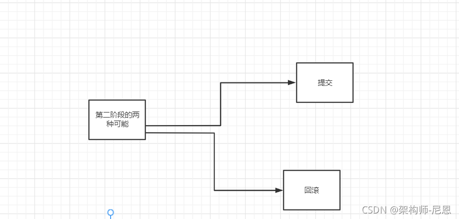

### 场景一：提交，全局提交

如果决议是

**全局提交**

，此时分支事务此时已经完成提交，不需要同步协调处理（只需要异步清理回滚日志），Phase2 可以非常快速地完成

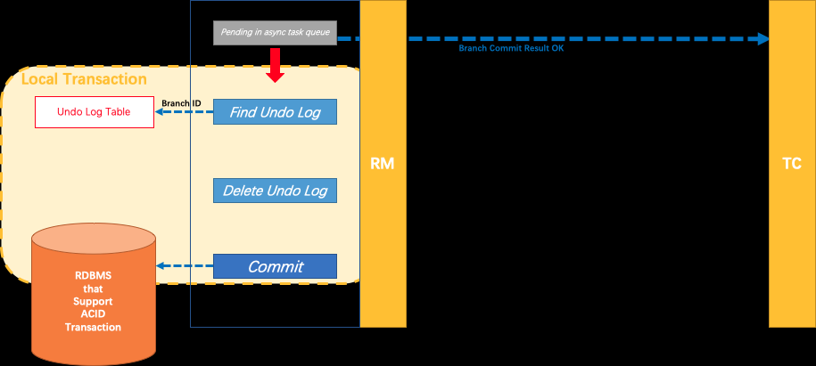

### 场景2：回滚，全局回滚

如果决议是全局回滚，RM 收到协调器发来的回滚请求，通过 XID 和 Branch ID 找到相应的回滚日志记录，**通过回滚记录生成反向的更新 SQL 并执行**，以完成分支的回滚

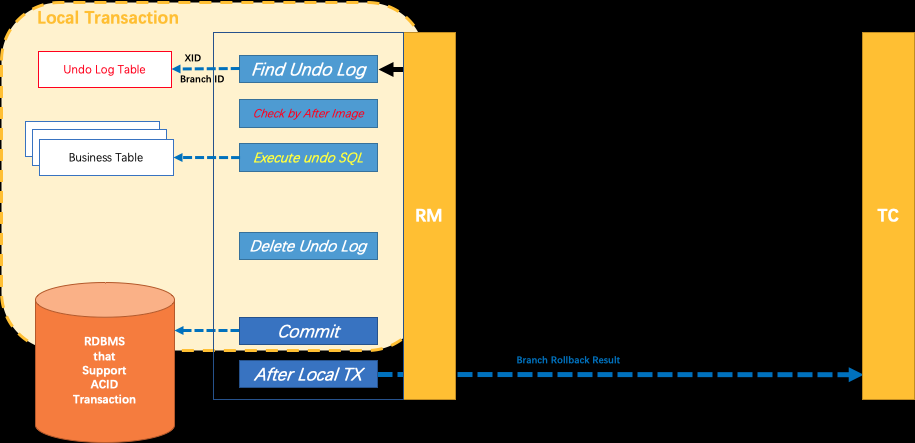

### AT模式相对于XA模式的优势

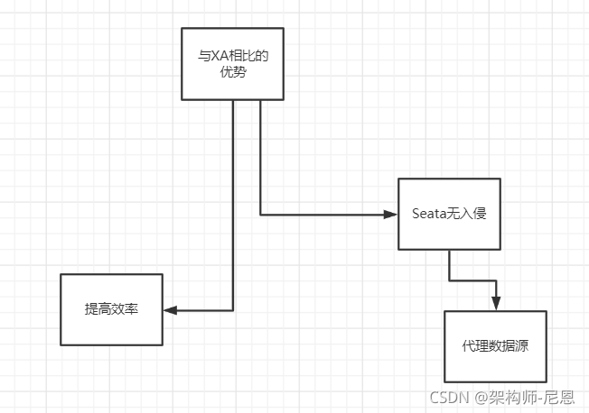

提高效率，即使第二阶段发生异常需要回滚，只需找对undolog中对应数据并反解析成sql来达到回滚目的

同时Seata无入侵，通过代理数据源将业务sql的执行解析成undolog来与业务数据的更新同时入库，达到了对业务无侵入的效果

### 10WQPS秒杀实操的AT分布式事务架构


## 快速开始搭建Seata环境

### 全局事务和分支事务的存储模式

因为 TC 需要进行全局事务和分支事务的记录，所以需要对应的存储。

目前，TC 有两种存储模式( store.mode )：

- file 模式：适合单机模式，全局事务会话信息在内存中读写，并持久化本地文件 root.data，性能较高。
- db 模式：适合集群模式，全局事务会话信息通过 db 共享，相对性能差点。

### file 模式

全局事务会话信息在内存中读写

并持久化本地文件 root.data

file 模式，最终部署单机 TC Server 如下图所示：

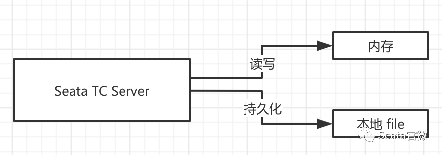

### db 模式

集群 Seata TC Server，实现高可用，生产环境下必备。

在集群时，多个 Seata TC Server 通过 db 数据库，实现全局事务会话信息的共享。

每个 Seata TC Server 可以注册自己到注册中心上，方便应用从注册中心获得到他们。 集群 TC Server 如下图所示：

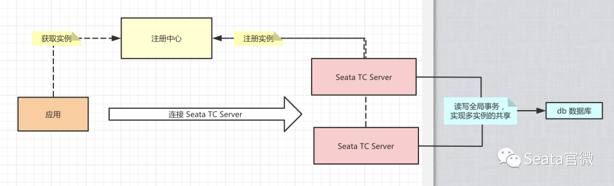

Seata TC Server 对主流的注册中心都提供了集成。国内使用 Nacos 作为注册中心越来越流行，推荐使用nacos。

### 配置和启动Seata-server服务（TC服务）

seata 官方文档地址：

[http://seata.io/zh-cn/docs/overview/what-is-seata.html](http://seata.io/zh-cn/docs/overview/what-is-seata.html)

下载seata-server-1.3.0和seata-1.3.0源码

seate-server下载： [https://seata.io/zh-cn/blog/download.html，](https://seata.io/zh-cn/blog/download.html%EF%BC%8C)

seata-1.3.0源码下载：

[https://github.com/seata/seata/releases](https://github.com/seata/seata/releases)

[https://github.com/seata/seata/releases/download/v1.3.0/seata-server-1.3.0.tar.gz](https://github.com/seata/seata/releases/download/v1.3.0/seata-server-1.3.0.tar.gz)

[https://gitee.com/seata-io/seata.git](https://gitee.com/seata-io/seata.git)

下载所有的源码后，切换到1.3的分支

### seata-server包下载和解压

第一步:[https://github.com/seata/seata/releases](https://github.com/seata/seata/releases) 下载seata-server包

推荐使用1.3.0版本，最新版本有些配套的依赖包，不一定来得及更新，可能会出现一些奇怪的问题

seata-server-1.3 上传后，大致如下：

```plain text
[root@cdh1 ~]# cd /work/
[root@cdh1 work]# ll
total 333360

-rw-r--r--  1 root root 33959771 Sep 13 16:00 seata-server-1.3.0.tar.gz

drwxr-xr-x  5 root root       87 Dec 26  2020 zookeeper
```

然后解压缩，tar 命令如下：

```plain text
[root@cdh1 ~]# rm -rf /work/seata
[root@cdh1 ~]# cd /work/
[root@cdh1 work]# tar -zxvf seata-server-1.3.0.tar.gz
seata/LICENSE
seata/conf/
seata/conf/META-INF/
seata/conf/META-INF/services/
seata/conf/logback.xml
seata/conf/file.conf
seata/conf/registry.conf
seata/conf/META-INF/services/io.seata.server.session.SessionManager
seata/conf/META-INF/services/io.seata.core.rpc.RegisterCheckAuthHandler
seata/conf/META-INF/services/io.seata.core.store.db.DataSourceProvider
seata/conf/META-INF/services/io.seata.server.coordinator.AbstractCore
seata/conf/META-INF/servi......
```

### 启动 TC Server（单体的实例）

bin下执行 sh ./seata-server.sh 命令，启动 TC Server 在后台。

我们看到如下日志，说明启动成功：

```plain text
[root@cdh1 bin]# cd /work/seata/bin/
[root@cdh1 bin]# sh bin/seata-server.sh
sh: bin/seata-server.sh: No such file or directory
[root@cdh1 bin]# sh ./seata-server.sh
Java HotSpot(TM) 64-Bit Server VM warning: Cannot open file /work/seata/logs/seata_gc.log due to No such file or directory

.....
2021-09-15 04:47:36.143 WARN [main]i.s.c.l.EnhancedServiceLoader$InnerEnhancedServiceLoader.loadFile:482 -The same extension io.seata.server.storage.file.lock.FileLockManager has already been loaded, skipped
2021-09-15 04:47:36.248 INFO [main]io.seata.core.rpc.netty.RpcServerBootstrap.start:155 -Server started ...
```

- 默认配置下，Seata TC Server 启动在 8091 端点。

### 使用 File 存储器全局会话

因为我们没有修改任何配置文件，默认情况seata使用的是file模式进行数据持久化，所以可以看到用于持久化的本地文件 root.data；操作命令如下：

```plain text
[root@cdh1 bin]# ll -ls /work/seata/bin/sessionStore/
total 0
0 -rw-r--r-- 1 root root 0 Sep 15 11:47 root.data
```

### seata-server的TC端配置

file.conf 配置文件，是RM(各大微服务的)和TC之间的通信配置

### TC端的参数清单，大致如下：

| key | desc | remark |
| --- | --- | --- |
| transaction.undo.log.save.days | undo保留天数 | 默认7天,log_status=1（附录3）和未正常清理的undo |
| transaction.undo.log.delete.period | undo清理线程间隔时间 | 默认86400000，单位毫秒 |
| service.max.commit.retry.timeout | 二阶段提交重试超时时长 | 单位ms,s,m,h,d,对应毫秒,秒,分,小时,天,默认毫秒。默认值-1表示无限重试。公式: timeout>=now-globalTransactionBeginTime,true表示超时则不再重试 |
| service.max.rollback.retry.timeout | 二阶段回滚重试超时时长 | 同commit |
| recovery.committing-retry-period | 二阶段提交未完成状态全局事务重试提交线程间隔时间 | 默认1000，单位毫秒 |
| recovery.asyn-committing-retry-period | 二阶段异步提交状态重试提交线程间隔时间 | 默认1000，单位毫秒 |
| recovery.rollbacking-retry-period | 二阶段回滚状态重试回滚线程间隔时间 | 默认1000，单位毫秒 |
| recovery.timeout-retry-period | 超时状态检测重试线程间隔时间 | 默认1000，单位毫秒，检测出超时将全局事务置入回滚会话管理器 |
| store.mode | 事务会话信息存储方式 | file本地文件(不支持HA)，db数据库(支持HA) |
| store.file.dir | file模式文件存储文件夹名 | 默认sessionStore |
| store.db.datasource | db模式数据源类型 | 默认dbcp |
| store.db.db-type | db模式数据库类型 | 默认mysql |
| store.db.driver-class-name | db模式数据库驱动 | 默认com.mysql.jdbc.Driver |
| store.db.url | db模式数据源库url | 默认jdbc:mysql://127.0.0.1:3306/seata |
| store.db.user | db模式数据库账户 | 默认mysql |
| store.db.min-conn | db模式数据库初始连接数 | 默认1 |
| store.db.max-conn | db模式数据库最大连接数 | 默认3 |
| store.db.global.table | db模式全局事务表名 | 默认global_table |
| store.db.branch.table | db模式分支事务表名 | 默认branch_table |
| store.db.lock-table | db模式全局锁表名 | 默认lock_table |
| store.db.query-limit | db模式查询全局事务一次的最大条数 | 默认1000 |
| metrics.enabled | 是否启用Metrics | 默认false关闭，在False状态下，所有与Metrics相关的组件将不会被初始化，使得性能损耗最低 |
| metrics.registry-type | 指标注册器类型 | Metrics使用的指标注册器类型，默认为内置的compact（简易）实现，这个实现中的Meter仅使用有限内存计数，性能高足够满足大多数场景；目前只能设置一个指标注册器实现 |
| metrics.exporter-list | 指标结果Measurement数据输出器列表 | 默认prometheus，多个输出器使用英文逗号分割，例如”prometheus,jmx”，目前仅实现了对接prometheus的输出器 |
| metrics.exporter-prometheus-port | prometheus输出器Client端口号 | 默认9898 |

## 部署集群 TC Server

本小节，我们来学习部署集群 Seata TC Server，实现高可用，生产环境下必备。

在集群时，多个 Seata TC Server 通过 db 数据库，实现全局事务会话信息的共享。

每个 Seata TC Server 可以注册自己到注册中心上，方便应用从注册中心获得到他们。最终我们部署 集群 TC Server 如下图所示：

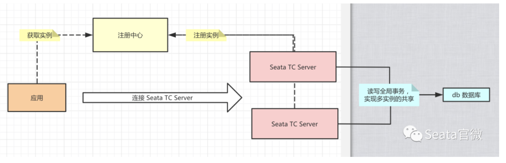

### 使用 Nacos 作为注册中心

修改 conf/registry.conf 配置文件，设置使用 Nacos 注册中心。如下图所示：

```plain text
registry {
  # file 、nacos 、eureka、redis、zk、consul、etcd3、sofa
  # type = "file"
  type = "nacos"

  nacos {
    application = "seata-server"
    serverAddr = "localhost"
    namespace = ""
    cluster = "default"
    username = "nacos"
    password = "nacos"
  }
  eureka {
    serviceUrl = "http://localhost:8761/eureka"
    application = "default"
    weight = "1"
  }
  redis {
    serverAddr = "localhost:6379"
    db = 0
    password = ""
    cluster = "default"
    timeout = 0
  }
  zk {
    cluster = "default"
    serverAddr = "127.0.0.1:2181"
    sessionTimeout = 6000
    connectTimeout = 2000
    username = ""
    password = ""
  }
  consul {
    cluster = "default"
    serverAddr = "127.0.0.1:8500"
  }
  etcd3 {
    cluster = "default"
    serverAddr = "http://localhost:2379"
  }
  sofa {
    serverAddr = "127.0.0.1:9603"
    application = "default"
    region = "DEFAULT_ZONE"
    datacenter = "DefaultDataCenter"
    cluster = "default"
    group = "SEATA_GROUP"
    addressWaitTime = "3000"
  }
  file {
    name = "file.conf"
  }
}
```

如果设置的 -t 参数，表示设置了命名空间，则需要提前创建命名空间。然后拿到其 命名空间ID—- uuid。

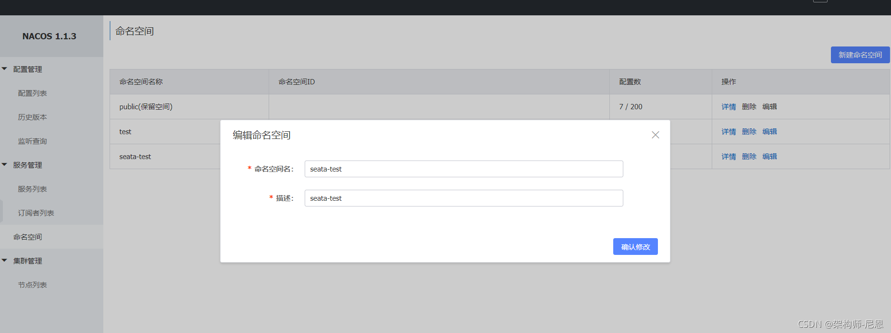

### TC端数据库初始化

下载TC端的配置文件，可以从github：

[https://github.com/seata-io/seata/tree/v1.3.0/script/server/db](https://github.com/seata-io/seata/tree/v1.3.0/script/server/db)

或者 gitee：

[https://gitee.com/seata-io/seata/tree/v1.3.0/script/server/db](https://gitee.com/seata-io/seata/tree/v1.3.0/script/server/db)

下载Seata1.3的版本对应的脚本。目前支持mysql、oracle、postgresql这三种数据库，

上述三种脚本是针对Seata的Sever端在协调处理分布式事务时所需要的3张表，提供了不同数据库的global_table表、branch_table表、lock_table表创建脚本，根据自身数据库执行对应的sql脚本执行即可。

这里以mysql为例，在你的mysql数据库中创建名为seata的库，并执行以下sql，将会生成三张表：global_table表、branch_table表、lock_table表

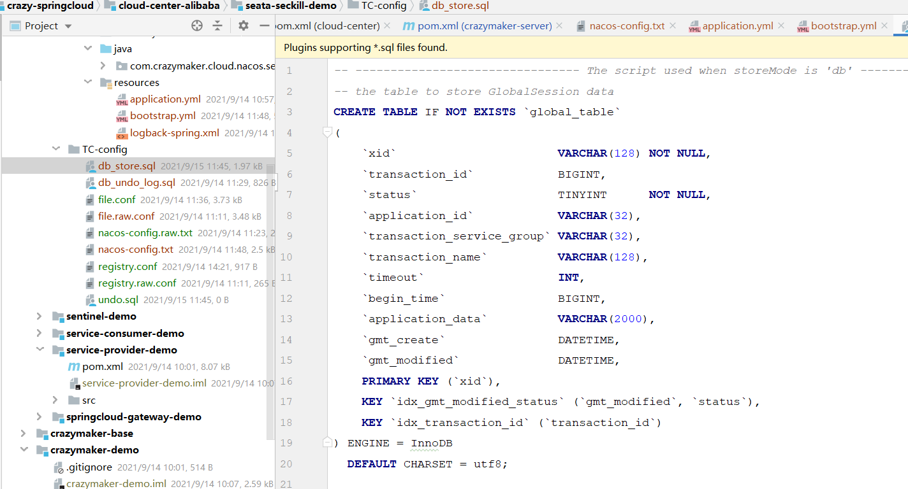

### 创建TC端的专属独立库seata。

连接MYSQL：

格式： mysql -h主机地址 -u用户名 －p用户密码

```plain text
mysql -h192.168.9.1 -uroot -p123456

mysql -uroot -p123456
```

```plain text
/usr/bin/mysql -uroot -p"123456" --connect-expired-password <<EOF
    CREATE DATABASE `seata` CHARACTER SET utf8mb4 COLLATE utf8mb4_unicode_ci;
    show databases;
    grant all privileges on seata.* to root@'%' identified by '123456'  WITH GRANT OPTION;
    flush privileges;
EOF
```

授权的时候，如果出现出现以下提示：

ERROR 1819 (HY000): Your password does not satisfy the current policy requirements那么导致问题的原因就是密码规则没有修改喽，以下提供两种方法更改简单密码：

1.在/etc/my.cnf关闭密码规则validate_password = off

2.进入mysql以后修改密码规则

```plain text
set global validate_password_policy=0; ----------把密码策略设置成0
    set global validate_password_length=0; ----------把密码长度限制设置成0
    flush privileges; -------------------------------刷新权限使其生效
```

需要在刚才配置的数据库中执行数据初始脚本 db_store.sql ，这个是全局事务控制的表，需要提前初始化。

db_store.sql 为seata库必须的表，执行sql即可

### 通过 source 命令，导致sql脚本就可以了。

mysql> source /work/seata/conf/db_store.sql;

```plain text
mysql> use seata;
Database changed
mysql> source   /work/seata/conf/db_store.sql;
Query OK, 0 rows affected, 1 warning (0.00 sec)

Query OK, 0 rows affected (0.02 sec)

Query OK, 0 rows affected, 1 warning (0.00 sec)

Query OK, 0 rows affected (0.00 sec)

Query OK, 0 rows affected, 1 warning (0.00 sec)

Query OK, 0 rows affected (0.01 sec)
```

这里我们只是做演示，理论上上面三个业务服务应该分属不同的数据库，这里我们只是在同一台数据库下面创建三个 Schema ，分别为 db_account 、 db_order 和 db_storage ，具体如图：

```plain text
mysql> show tables;
+-----------------+
| Tables_in_seata |
+-----------------+
| branch_table    |
| global_table    |
| lock_table      |
+-----------------+
3 rows in set (0.00 sec)
```

通过windows 工具操作，也是类似的，导入 db_store.sql之后，创建了3个表 db_account 、 db_order 和 db_storage ，具体如图：

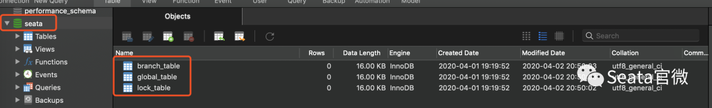

### db 数据库共享全局事务会话信息：

### 如果使用file作为配置文件

修改 conf/file.conf 配置文件，修改使用 db 数据库，实现 Seata TC Server 的全局事务会话信息的共享。

如下图所示：

```plain text
## transaction log store, only used in seata-server
store {
  ## store mode: file、db
  ## mode = "file"
  mode = "db"

  ## file store property
  file {
    ## store location dir
    dir = "sessionStore"
    # branch session size , if exceeded first try compress lockkey, still exceeded throws exceptions
    maxBranchSessionSize = 16384
    # globe session size , if exceeded throws exceptions
    maxGlobalSessionSize = 512
    # file buffer size , if exceeded allocate new buffer
    fileWriteBufferCacheSize = 16384
    # when recover batch read size
    sessionReloadReadSize = 100
    # async, sync
    flushDiskMode = async
  }

  ## database store property
  db {
    ## the implement of javax.sql.DataSource, such as DruidDataSource(druid)/BasicDataSource(dbcp) etc.
    datasource = "druid"
    ## mysql/oracle/postgresql/h2/oceanbase etc.
    dbType = "mysql"
    ## driverClassName = "com.mysql.jdbc.Driver"
    driverClassName = "com.mysql.jdbc.Driver"
    url = "jdbc:mysql://192.168.56.121:3306/seata?useUnicode=true&characterEncoding=utf8&allowMultiQueries=true&useSSL=true&serverTimezone=UTC"
    user = "root"
    password = "123456"
    minConn = 5
    maxConn = 30
    globalTable = "global_table"
    branchTable = "branch_table"
    lockTable = "lock_table"
    queryLimit = 100
    maxWait = 5000
  }
}
```

### 如何使用nacos作为配置中心：

修改使用 db 数据库，实现 Seata TC Server 的全局事务会话信息的共享。

```plain text
transport.type=TCP
transport.server=NIO
transport.heartbeat=true
transport.enableClientBatchSendRequest=false
transport.threadFactory.bossThreadPrefix=NettyBoss
transport.threadFactory.workerThreadPrefix=NettyServerNIOWorker
transport.threadFactory.serverExecutorThreadPrefix=NettyServerBizHandler
transport.threadFactory.shareBossWorker=false
transport.threadFactory.clientSelectorThreadPrefix=NettyClientSelector
transport.threadFactory.clientSelectorThreadSize=1
transport.threadFactory.clientWorkerThreadPrefix=NettyClientWorkerThread
transport.threadFactory.bossThreadSize=1
transport.threadFactory.workerThreadSize=default
transport.shutdown.wait=3
service.vgroupMapping.my_test_tx_group=default
service.vgroupMapping.seata-seckill-demo-seata-service-group=default
service.vgroupMapping.seata-order-demo-seata-service-group=default
service.vgroupMapping.seata-stock-demo-seata-service-group=default
service.default.grouplist=cdh1:8091
service.enableDegrade=false
service.disableGlobalTransaction=false
client.rm.asyncCommitBufferLimit=10000
client.rm.lock.retryInterval=10
client.rm.lock.retryTimes=30
client.rm.lock.retryPolicyBranchRollbackOnConflict=true
client.rm.reportRetryCount=5
client.rm.tableMetaCheckEnable=false
client.rm.sqlParserType=druid
client.rm.reportSuccessEnable=false
client.rm.sagaBranchRegisterEnable=false
client.tm.commitRetryCount=5
client.tm.rollbackRetryCount=5
#store.mode=file
store.mode=db
store.file.dir=file_store/data
store.file.maxBranchSessionSize=16384
store.file.maxGlobalSessionSize=512
store.file.fileWriteBufferCacheSize=16384
store.file.flushDiskMode=async
store.file.sessionReloadReadSize=100
store.db.datasource=druid
store.db.dbType=mysql
store.db.driverClassName=com.mysql.jdbc.Driver
store.db.url=jdbc:mysql://cdh1:3306/seata?useUnicode=true
store.db.user=root
store.db.password=123456
store.db.minConn=5
store.db.maxConn=30
store.db.globalTable=global_table
store.db.branchTable=branch_table
store.db.queryLimit=100
store.db.lockTable=lock_table
store.db.maxWait=5000
server.recovery.committingRetryPeriod=1000
server.recovery.asynCommittingRetryPeriod=1000
server.recovery.rollbackingRetryPeriod=1000
server.recovery.timeoutRetryPeriod=1000
server.maxCommitRetryTimeout=-1
server.maxRollbackRetryTimeout=-1
server.rollbackRetryTimeoutUnlockEnable=false
client.undo.dataValidation=true
client.undo.logSerialization=jackson
server.undo.logSaveDays=7
server.undo.logDeletePeriod=86400000
client.undo.logTable=undo_log
client.log.exceptionRate=100
transport.serialization=seata
transport.compressor=none
metrics.enabled=false
metrics.registryType=compact
metrics.exporterList=prometheus
metrics.exporterPrometheusPort=9898
```

### 补充：MySQL8 的支持

如果使用的 MySQL 是 8.X 版本，需要下载 MySQL 8.X JDBC 驱动，命令行操作如下：

```plain text
$ cd lib
$ wget https://repo1.maven.org/maven2/mysql/mysql-connector-java/8.0.19/mysql-connector-java-8.0.19.jar
```

然后，修改 conf/file 配置文件，使用该 MySQL 8.X JDBC 驱动。如下图所示：

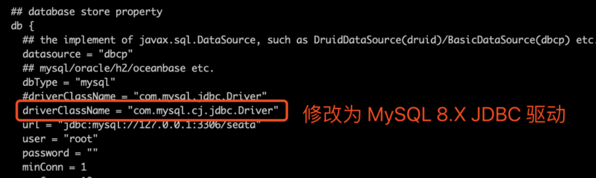

### 启动 第一个TC Server

执行 nohup sh bin/seata-server.sh -p 18091 -n 1 & 命令，启动第一个 TC Server 在后台。

- p：Seata TC Server 监听的端口。
- n：Server node。在多个 TC Server 时，需区分各自节点，用于生成不同区间的 transactionId 事务编号，以免冲突。

```plain text
nohup sh /work/seata/bin/seata-server.sh -p 18091 -n 1 > /work/seata/bin/consol.log &

tail -f /work/seata/bin/consol.log
```

在 consol.log 文件中，我们看到如下日志，说明启动成功：

```plain text
e.session.FileSessionManager has already been loaded, skipped
2021-09-15 07:46:33.472 WARN [main]i.s.c.l.EnhancedServiceLoader$InnerEnhancedServiceLoader.loadFile:482 -The same extension io.seata.server.storage.db.session.DataBaseSessionManager has already been loaded, skipped
.....
2021-09-15 07:46:34.094 WARN [main]i.s.c.l.EnhancedServiceLoader$InnerEnhancedServiceLoader.loadFile:482 -The same extension io.seata.server.storage.file.lock.FileLockManager has already been loaded, skipped
2021-09-15 07:46:34.220 INFO [main]io.seata.core.rpc.netty.RpcServerBootstrap.start:155 -Server started ...
```

### 启动 第2个TC Server

执行 nohup sh bin/seata-server.sh -p 18092 -n 2 & 命令，启动第二个 TC Server 在后台。

```plain text
nohup sh /work/seata/bin/seata-server.sh -p 18092 -n 1 > /work/seata/bin/consol2.log &

tail -f /work/seata/bin/consol2.log
```

### 实验演示：注册到nacos之后，可以在nacos上看效果

具体演示，参见此博客的配套视频

### 控制台提交nacos配置脚本

下载nacos的配置文件，原始config.txt文件可以从github：

[https://github.com/seata/seata/tree/develop/script/config-center](https://github.com/seata/seata/tree/develop/script/config-center)

或者 gitee：

[https://gitee.com/seata-io/seata/tree/develop/script/config-center](https://gitee.com/seata-io/seata/tree/develop/script/config-center)

下载的并修改：

```plain text
transport.type=TCP
transport.server=NIO
transport.heartbeat=true
transport.enableClientBatchSendRequest=true
transport.threadFactory.bossThreadPrefix=NettyBoss
transport.threadFactory.workerThreadPrefix=NettyServerNIOWorker
transport.threadFactory.serverExecutorThreadPrefix=NettyServerBizHandler
transport.threadFactory.shareBossWorker=false
transport.threadFactory.clientSelectorThreadPrefix=NettyClientSelector
transport.threadFactory.clientSelectorThreadSize=1
transport.threadFactory.clientWorkerThreadPrefix=NettyClientWorkerThread
transport.threadFactory.bossThreadSize=1
transport.threadFactory.workerThreadSize=default
transport.shutdown.wait=3
service.vgroup_mapping.my_test_tx_group=default
service.vgroup_mapping.seata-seckill-demo=default
service.vgroup_mapping.seata-order-demo=default
service.vgroup_mapping.seata-stock-demo=default
service.default.grouplist=127.0.0.1:8091
service.enableDegrade=false
service.disableGlobalTransaction=false
client.rm.asyncCommitBufferLimit=10000
client.rm.lock.retryInterval=10
client.rm.lock.retryTimes=30
client.rm.lock.retryPolicyBranchRollbackOnConflict=true
client.rm.reportRetryCount=5
client.rm.tableMetaCheckEnable=false
client.rm.tableMetaCheckerInterval=60000
client.rm.sqlParserType=druid
client.rm.reportSuccessEnable=false
client.rm.sagaBranchRegisterEnable=false
client.rm.tccActionInterceptorOrder=-2147482648
client.tm.commitRetryCount=5
client.tm.rollbackRetryCount=5
client.tm.defaultGlobalTransactionTimeout=60000
client.tm.degradeCheck=false
client.tm.degradeCheckAllowTimes=10
client.tm.degradeCheckPeriod=2000
client.tm.interceptorOrder=-2147482648
store.mode=file
store.lock.mode=file
store.session.mode=file
store.publicKey=
store.file.dir=file_store/data
store.file.maxBranchSessionSize=16384
store.file.maxGlobalSessionSize=512
store.file.fileWriteBufferCacheSize=16384
store.file.flushDiskMode=async
store.file.sessionReloadReadSize=100
store.db.datasource=druid
store.db.dbType=mysql
store.db.driverClassName=com.mysql.jdbc.Driver
store.db.url=jdbc:mysql://cdh1:3306/seata?useUnicode=true&rewriteBatchedStatements=true
store.db.user=root
store.db.password=123456
store.db.minConn=5
store.db.maxConn=30
store.db.globalTable=global_table
store.db.branchTable=branch_table
store.db.queryLimit=100
store.db.lockTable=lock_table
store.db.maxWait=5000
store.redis.mode=single
store.redis.single.host=cdh1
store.redis.single.port=6379
store.redis.sentinel.masterName=
store.redis.sentinel.sentinelHosts=
store.redis.maxConn=10
store.redis.minConn=1
store.redis.maxTotal=100
store.redis.database=0
store.redis.password=123456
store.redis.queryLimit=100
server.recovery.committingRetryPeriod=1000
server.recovery.asynCommittingRetryPeriod=1000
server.recovery.rollbackingRetryPeriod=1000
server.recovery.timeoutRetryPeriod=1000
server.maxCommitRetryTimeout=-1
server.maxRollbackRetryTimeout=-1
server.rollbackRetryTimeoutUnlockEnable=false
server.distributedLockExpireTime=10000
client.undo.dataValidation=true
client.undo.logSerialization=jackson
client.undo.onlyCareUpdateColumns=true
server.undo.logSaveDays=7
server.undo.logDeletePeriod=86400000
client.undo.logTable=undo_log
client.undo.compress.enable=true
client.undo.compress.type=zip
client.undo.compress.threshold=64k
log.exceptionRate=100
transport.serialization=seata
transport.compressor=none
metrics.enabled=false
metrics.registryType=compact
metrics.exporterList=prometheus
metrics.exporterPrometheusPort=9898
```

### 修改 自己定义的服务组

在 nacos-config.txt 文件 修改 自己定义的服务组 ，参考如下：

```plain text
service.vgroup_mapping.my_test_tx_group=default
service.vgroup_mapping.seata-seckill-demo=default
service.vgroup_mapping.seata-order-demo=default
service.vgroup_mapping.seata-stock-demo=default
```

中间的${your-service-gruop}为自己定义的服务组名称，这里需要我们在程序的配置文件中配置，笔者这里直接使用程序的 spring.application.name。

### 修改数据库连接

用到2个文件，nacos-config.txt和nacos-config.sh，都在config目录下。

config.txt需要：

- 修改数据库连接

```plain text
store.db.datasource=druid
store.db.dbType=mysql
store.db.driverClassName=com.mysql.jdbc.Driver # 这里
store.db.url=jdbc:mysql://127.0.0.1:3306/seata?useUnicode=true # 这里
store.db.user=username # 这里
store.db.password=password # 这里
```

### 将文件中的配置导入nacos 即可

下载nacos的配置文件，原始config.txt文件可以从github：

[https://github.com/seata/seata/tree/develop/script/config-center](https://github.com/seata/seata/tree/develop/script/config-center)

或者 gitee：

[https://gitee.com/seata-io/seata/tree/develop/script/config-center](https://gitee.com/seata-io/seata/tree/develop/script/config-center)

提供的nacos脚本nacos-config.sh，将上面的config.txt文件复制到seata的config目录,通过 nacos-config.sh ，将文件中的配置导入nacos 即可。执行以下命令：

```plain text
sh /work/seata/script/config-center/nacos/nacos-config.sh -h localhost -p 8848 -g SEATA_GROUP -t 5a3c7d6c-f497-4d68-a71a-2e5e3340b3ca -u nacos -w nacos
```

将以上信息提交到nacos控制台，当然，如果有需要修改参数，可直接通过登录nacos控制台修改。

```plain text
[root@cdh1 script]# sh /work/seata/script/nacos-config.sh -h localhost -p 8848 -g SEATA_GROUP -t 5a3c7d6c-f497-4d68-a71a-2e5e3340b3ca -u nacos -w nacos
set nacosAddr=localhost:8848
set group=SEATA_GROUP
Set transport.type=TCP successfully
Set transport.server=NIO successfully
Set transport.heartbeat=true successfully
Set transport.enableClientBatchSendRequest=true successfully
Set transport.threadFactory.bossThreadPrefix=NettyBoss successfully
Set transport.threadFactory.workerThreadPrefix=NettyServerNIOWorker successfully
Set transport.threadFactory.serverExecutorThreadPrefix=NettyServerBizHandler successfully
Set transport.threadFactory.shareBossWorker=false successfully
Set transport.threadFactory.clientSelectorThreadPrefix=NettyClientSelector successfully
Set transport.threadFactory.clientSelectorThreadSize=1 successfully
Set transport.threadFactory.clientWorkerThreadPrefix=NettyClientWorkerThread successfully
Set transport.threadFactory.bossThreadSize=1 successfully
Set transport.threadFactory.workerThreadSize=default successfully
Set transport.shutdown.wait=3 successfully
Set service.vgroup_mapping.my_test_tx_group=default successfully
Set service.vgroup_mapping.seata-seckill-demo=default successfully
Set service.vgroup_mapping.seata-order-demo=default successfully
Set service.vgroup_mapping.seata-stock-demo=default successfully
Set service.default.grouplist=127.0.0.1:8091 successfully
Set service.enableDegrade=false successfully
Set service.disableGlobalTransaction=false successfully
Set client.rm.asyncCommitBufferLimit=10000 successfully
Set client.rm.lock.retryInterval=10 successfully
Set client.rm.lock.retryTimes=30 successfully
Set client.rm.lock.retryPolicyBranchRollbackOnConflict=true successfully
Set client.rm.reportRetryCount=5 successfully
Set client.rm.tableMetaCheckEnable=false successfully
Set client.rm.tableMetaCheckerInterval=60000 successfully
Set client.rm.sqlParserType=druid successfully
Set client.rm.reportSuccessEnable=false successfully
Set client.rm.sagaBranchRegisterEnable=false successfully
Set client.rm.tccActionInterceptorOrder=-2147482648 successfully
Set client.tm.commitRetryCount=5 successfully
Set client.tm.rollbackRetryCount=5 successfully
Set client.tm.defaultGlobalTransactionTimeout=60000 successfully
Set client.tm.degradeCheck=false successfully
Set client.tm.degradeCheckAllowTimes=10 successfully
Set client.tm.degradeCheckPeriod=2000 successfully
Set client.tm.interceptorOrder=-2147482648 successfully
Set store.mode=file successfully
Set store.lock.mode=file successfully
Set store.session.mode=file successfully
Set store.publicKey= failure
Set store.file.dir=file_store/data successfully
Set store.file.maxBranchSessionSize=16384 successfully
Set store.file.maxGlobalSessionSize=512 successfully
Set store.file.fileWriteBufferCacheSize=16384 successfully
Set store.file.flushDiskMode=async successfully
Set store.file.sessionReloadReadSize=100 successfully
Set store.db.datasource=druid successfully
Set store.db.dbType=mysql successfully
Set store.db.driverClassName=com.mysql.jdbc.Driver successfully
Set store.db.url=jdbc:mysql://cdh1:3306/seata?useUnicode=true&rewriteBatchedStatements=true successfully
Set store.db.user=root successfully
Set store.db.password=123456 successfully
Set store.db.minConn=5 successfully
Set store.db.maxConn=30 successfully
Set store.db.globalTable=global_table successfully
Set store.db.branchTable=branch_table successfully
Set store.db.queryLimit=100 successfully
Set store.db.lockTable=lock_table successfully
Set store.db.maxWait=5000 successfully
Set store.redis.mode=single successfully
Set store.redis.single.host=cdh1 successfully
Set store.redis.single.port=6379 successfully
Set store.redis.sentinel.masterName= failure
Set store.redis.sentinel.sentinelHosts= failure
Set store.redis.maxConn=10 successfully
Set store.redis.minConn=1 successfully
Set store.redis.maxTotal=100 successfully
Set store.redis.database=0 successfully
Set store.redis.password=123456 successfully
Set store.redis.queryLimit=100 successfully
Set server.recovery.committingRetryPeriod=1000 successfully
Set server.recovery.asynCommittingRetryPeriod=1000 successfully
Set server.recovery.rollbackingRetryPeriod=1000 successfully
Set server.recovery.timeoutRetryPeriod=1000 successfully
Set server.maxCommitRetryTimeout=-1 successfully
Set server.maxRollbackRetryTimeout=-1 successfully
Set server.rollbackRetryTimeoutUnlockEnable=false successfully
Set server.distributedLockExpireTime=10000 successfully
Set client.undo.dataValidation=true successfully
Set client.undo.logSerialization=jackson successfully
Set client.undo.onlyCareUpdateColumns=true successfully
Set server.undo.logSaveDays=7 successfully
Set server.undo.logDeletePeriod=86400000 successfully
Set client.undo.logTable=undo_log successfully
Set client.undo.compress.enable=true successfully
Set client.undo.compress.type=zip successfully
Set client.undo.compress.threshold=64k successfully
Set log.exceptionRate=100 successfully
Set transport.serialization=seata successfully
Set transport.compressor=none successfully
Set metrics.enabled=false successfully
Set metrics.registryType=compact successfully
Set metrics.exporterList=prometheus successfully
Set metrics.exporterPrometheusPort=9898 successfully
=========================================================================
 Complete initialization parameters,  total-count:97 ,  failure-count:3
=========================================================================
 init nacos config fail.
```

顺利完成后，nacos中如下

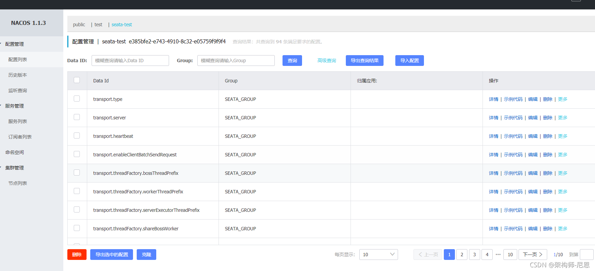

如果设置的 -t 参数，表示设置了命名空间，则需要提前创建命名空间。然后拿到其 命名空间ID—- uuid。


### 直接使用nacos 的data-id配置文件

### 制作和上传配置文件

把上面的配置，做成一个文件，放在nacos中

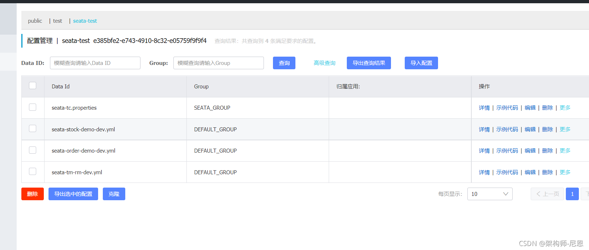

### config文件中的修改

```plain text
##配置seata-server的注册中心，支持file 、nacos 、eureka、redis、zk、consul、etcd3、sofa

registry {
  # file 、nacos 、eureka、redis、zk、consul、etcd3、sofa
  # type = "file"
  type = "nacos"

  nacos {
    application = "seata-server"
    serverAddr = "cdh1:8848"
    namespace = "e385bfe2-e743-4910-8c32-e05759f9f9f4"
    cluster = "default"
    username = "nacos"
    password = "nacos"
  }
  eureka {
    serviceUrl = "http://localhost:8761/eureka"
    application = "default"
    weight = "1"
  }
  redis {
    serverAddr = "localhost:6379"
    db = 0
    password = ""
    cluster = "default"
    timeout = 0
  }
  zk {
    cluster = "default"
    serverAddr = "127.0.0.1:2181"
    sessionTimeout = 6000
    connectTimeout = 2000
    username = ""
    password = ""
  }
  consul {
    cluster = "default"
    serverAddr = "127.0.0.1:8500"
  }
  etcd3 {
    cluster = "default"
    serverAddr = "http://localhost:2379"
  }
  sofa {
    serverAddr = "127.0.0.1:9603"
    application = "default"
    region = "DEFAULT_ZONE"
    datacenter = "DefaultDataCenter"
    cluster = "default"
    group = "SEATA_GROUP"
    addressWaitTime = "3000"
  }
  file {
    name = "file.conf"
  }
}
##配置seata-server的配置中心，支持file、nacos 、apollo、zk、consul、etcd3

config {
  # file、nacos 、apollo、zk、consul、etcd3
  # type = "file"
  type = "nacos"
  #nacos {
  #   serverAddr = "ch"
  #  namespace = "e385bfe2-e743-4910-8c32-e05759f9f9f4"
  #  group = "SEATA_GROUP"
  #  username = ""
  #  password = ""
  # }
  nacos {
    application = "seata-server"
    #  serverAddr = "192.168.56.121:8848"
    serverAddr = "cdh1:8848"
    namespace = "e385bfe2-e743-4910-8c32-e05759f9f9f4"
    group = "SEATA_GROUP"
    dataId = "seata-tc.properties"
    cluster = "default"
    username = "nacos"
    password = "nacos"
  }

  consul {
    serverAddr = "127.0.0.1:8500"
  }
  apollo {
    appId = "seata-server"
    apolloMeta = "http://192.168.1.204:8801"
    namespace = "application"
  }
  zk {
    serverAddr = "127.0.0.1:2181"
    sessionTimeout = 6000
    connectTimeout = 2000
    username = ""
    password = ""
  }
  etcd3 {
    serverAddr = "http://localhost:2379"
  }
  file {
    name = "file.conf"
  }
}
```

**重启 TC，一切OK**

## NameSpace、Group、DataId

nacos中提供了NameSpace、Group、DataId，他的作用是能让我们对配置文件进行分类管理，三个能够确定唯一的配置文件。我说一点，可能不同的公司，会对这3个的定义是不同的。

比如 定义一：

1. NameSpace：区分不同的环境

2. Group：区分不同的项目或系统

3. DataId：项目中的配置文件

定义二：

1. NameSpace：区分不同的项目

2. Group：区分不同的模块

3. DataId：区分不同的环境

定义三：

1. NameSpace：区分不同的租户

2. Group：区分不同的应用

3. DataId：区分不同的环境

还有其他的定义，看公司。

### NameSpace：区分不同的环境

一般开发都会有多套环境，如果多套环境公用一个nacos，那么配置中心和注册中心都会发生冲突，所以需要用namespace隔离开

```plain text
address: 0.0.0.0
  port: 8083
  servlet:
    # 这里设置了context-path
    context-path: /settlement/v1

spring:
  application:
    name: settlement
  cloud:
    nacos:
      config:
        server-addr: nacos-headless.default.svc.cluster.local:8848
        # 控制台创建命名空间得到的uuid
        namespace: c9ad103a-5420-4628-aba7-c147e3048d9d
      discovery:
        server-addr: nacos-headless.default.svc.cluster.local:8848
        # 控制台创建命名空间得到的uuid
        namespace: c9ad103a-5420-4628-aba7-c147e3048d9d
        metadata:
          management:
            # 这里要适配下健康检查的endpoint
            context-path: '${server.servlet.context-path}/actuator'

management:
  endpoints:
    web:
      exposure:
        # actuator暴露所有endpoint
        include: "*"
```

### 进行Group的切换

假设要进行Group的切换，只需要改下面的配置的值：

```plain text
server:
  port: 3377
spring:
  application:
    name: nacos-config-client
  cloud:
    nacos:
      discovery:
        server-addr: localhost:8848 #注册中心的地址
      config:
        server-addr: localhost:8848 #配置中心的地址
        file-extension: yaml # 要读取nacos上的配置文件的后缀，这里只能是yaml，不能是yml
        group: TEST_GROUP
```

### 进行NameSpace的切换

假设要进行NameSpace的切换，只需要改下面的配置的值：

```plain text
server:
  port: 3377
spring:
  application:
    name: nacos-config-client
  cloud:
    nacos:
      discovery:
        server-addr: localhost:8848 #注册中心的地址
        namespace: 命名空间的ID
      config:
        server-addr: localhost:8848 #配置中心的地址
        file-extension: yaml # 要读取nacos上的配置文件的后缀，这里只能是yaml，不能是yml
        namespace: 命名空间的ID
```

假设同一个NameSpace、Group，要进行DataId的 profile 后缀切换，只需要改下面的配置的值：

```plain text
spring:
  profiles:
    active: dev
```

## AT模式的RM&TM&TC直接的交互流程

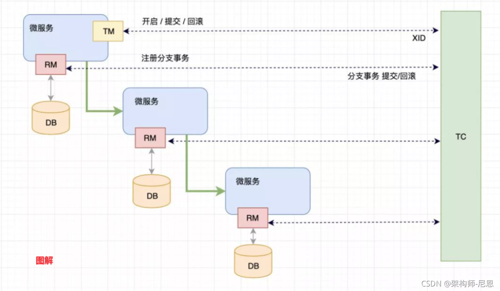

```plain text
- 事务协调器 TC :  维护全局和分支事务的状态，指示全局提交或者回滚。
- 事务管理者 TM :  开启、提交或者回滚一个全局事务。
- 资源管理者 RM(数据库) :  管理执行分支事务的那些资源，向TC注册分支事务、上报分支事务状态、控制分支事务的提交或者回滚。
```

大致的流程

```plain text
① TM 请求 TC， 开始一个新的全局事务，TC 会为这个全局事务生成一个 唯一XID
② XID 通过微服务的调用链传递到其他微服务。
③ RM 向TC 注册分支事务, 将其纳入XID 对应全局事务的管辖 ;
④ TM 请求 TC 对这个 XID 进行提交或回滚
⑤ TC 指挥这个 XID 下面的所有分支事务进行提交、回滚。
```

上面的流程有点复杂，如果搞不清楚，可以看下 配套视频

## TM&RM 应用开发

如果你经过前面的步骤搭建Seata环境完成了，那么你可以尝试一下分布式事务的应用开发，也就是TM&RM这块。


### 业务场景

那么下面准备以Seata官方文档上的一个经典例子为题，模拟用户下单，创建订单同时扣减库存数量这一过程中产生的分布式事务问题，然后使用Seata解决，正好使用以下Seata的特性。

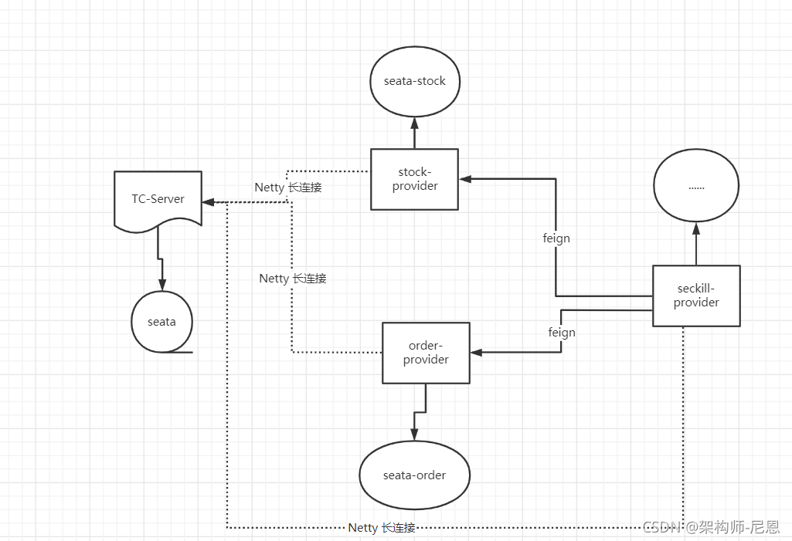

### 中间件版本选型

在当下微服务架构比较火热时，新一代微服务解决方案Spring Cloud Alibaba提供的开源分布式事务解决框架Seata无疑成为了我们在解决分布式事务时的首要之选，

**版本选择： Spring Cloud Alibaba与Spring Boot、Spring Cloud版本对应关系**


坑点：

如果项目中使用了druid数据库连接池，引入的是SpringBoot的Starter依赖druid-spring-boot-starter，那么需要把druid-spring-boot-starter依赖换成druid1.1.23，

因为seata源码中引入的druid依赖跟druid-spring-boot-starter的自动装配类冲突了，冲突的情况下项目启动出现异常

### 数据库准备

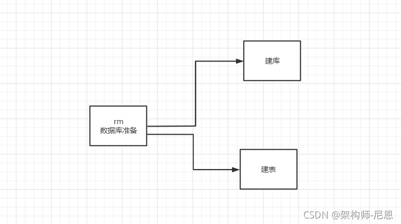

连接MYSQL：

格式： mysql -h主机地址 -u用户名 －p用户密码

```plain text
mysql -h192.168.9.1 -uroot -p123456

mysql -uroot -p123456
```

### 创建RM端的专属独立库seata。

```plain text
/usr/bin/mysql -uroot -p"123456" --connect-expired-password <<EOF
CREATE DATABASE `seata-stock-demo` default character set utf8mb4 collate utf8mb4_unicode_ci;
CREATE DATABASE `seata-order-demo`  default character set utf8mb4 collate utf8mb4_unicode_ci;
show databases;
grant all privileges on `seata-order-demo`.* to root@'%' identified by '123456'  WITH GRANT OPTION;
grant all privileges on `seata-stock-demo`.* to root@'%' identified by '123456'  WITH GRANT OPTION;
flush privileges;
EOF
```

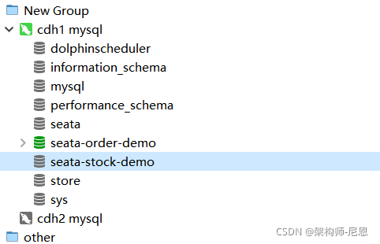

### 创建RM端的专属独立的表。

在自己微服务数据库里面创建undo_log表，sql在源码里面有

下载TM端的配置文件，原始config.txt文件可以从github：

[https://github.com/seata-io/seata/blob/v1.3.0/script/client/at/db/mysql.sql](https://github.com/seata-io/seata/blob/v1.3.0/script/client/at/db/mysql.sql)

或者 gitee：

[https://gitee.com/seata-io/seata/blob/v1.3.0/script/client/at/db/mysql.sql](https://gitee.com/seata-io/seata/blob/v1.3.0/script/client/at/db/mysql.sql)

mysql> source /work/seata/conf/un_do.sql;

```plain text
mysql -uroot -p123456

mysql> use seata-stock-demo;
Database changed
mysql>source   /work/seata/conf/un_do.sql;

mysql> use seata-order-demo;
Database changed
mysql>source   /work/seata/conf/un_do.sql;
```

这里我们只是做演示，理论上上面三个业务服务应该分属不同的数据库，这里我们只是在同一台数据库下面创建三个 Schema ，分别为 db_account 、 db_order 和 db_storage ，具体如图：

```plain text
mysql> show tables;
+-----------------+
| Tables_in_seata |
+-----------------+
| branch_table    |
| global_table    |
| lock_table      |
+-----------------+
3 rows in set (0.00 sec)
```

## TM端的注册中心配置

下载TM端的配置文件，原始config.txt文件可以从github：

[https://github.com/seata/seata/tree/develop/script/client](https://github.com/seata/seata/tree/develop/script/client)

或者 gitee：

[https://gitee.com/seata-io/seata/tree/develop/script/client](https://gitee.com/seata-io/seata/tree/develop/script/client)

下载的并修改 register.config：

```plain text
registry {
  # file 、nacos 、eureka、redis、zk、consul、etcd3、sofa、custom
  # type = "file"
  type = "nacos"

  nacos {
    application = "seata-server"
    serverAddr = "cdh1"
    namespace = "e385bfe2-e743-4910-8c32-e05759f9f9f4"
    cluster = "SEATA_GROUP"
    username = "nacos"
    password = "nacos"
  }
 #  nacos {
  #   application = "seata-server"
 #    serverAddr = "127.0.0.1:8848"
 #    group = "SEATA_GROUP"
 #    namespace = ""
 #    username = ""
 #    password = ""
 #  }
  eureka {
    serviceUrl = "http://localhost:8761/eureka"
    weight = "1"
  }
  redis {
    serverAddr = "localhost:6379"
    db = "0"
    password = ""
    timeout = "0"
  }
  zk {
    serverAddr = "127.0.0.1:2181"
    sessionTimeout = 6000
    connectTimeout = 2000
    username = ""
    password = ""
  }
  consul {
    serverAddr = "127.0.0.1:8500"
    aclToken = ""
  }
  etcd3 {
    serverAddr = "http://localhost:2379"
  }
  sofa {
    serverAddr = "127.0.0.1:9603"
    region = "DEFAULT_ZONE"
    datacenter = "DefaultDataCenter"
    group = "SEATA_GROUP"
    addressWaitTime = "3000"
  }
  file {
    name = "file.conf"
  }
  custom {
    name = ""
  }
}

config {
  # file、nacos 、apollo、zk、consul、etcd3、springCloudConfig、custom
  type = "file"

  nacos {
    serverAddr = "127.0.0.1:8848"
    namespace = ""
    group = "SEATA_GROUP"
    username = ""
    password = ""
    dataId = "seata.properties"
  }
  consul {
    serverAddr = "127.0.0.1:8500"
    aclToken = ""
  }
  apollo {
    appId = "seata-server"
    apolloMeta = "http://192.168.1.204:8801"
    namespace = "application"
    apolloAccesskeySecret = ""
  }
  zk {
    serverAddr = "127.0.0.1:2181"
    sessionTimeout = 6000
    connectTimeout = 2000
    username = ""
    password = ""
    nodePath = "/seata/seata.properties"
  }
  etcd3 {
    serverAddr = "http://localhost:2379"
  }
  file {
    name = "file.conf"
  }
  custom {
    name = ""
  }
}
```

### file.conf本地配置

如果配置中心的类型都不是file时，就不需要file.conf文件了

如果配置中心的类型是file时，就需要file.conf

```plain text
transport {
  # tcp udt unix-domain-socket
  type = "TCP"
  #NIO NATIVE
  server = "NIO"
  #enable heartbeat
  heartbeat = true
  # the client batch send request enable
  enableClientBatchSendRequest = true
  #thread factory for netty
  threadFactory {
    bossThreadPrefix = "NettyBoss"
    workerThreadPrefix = "NettyServerNIOWorker"
    serverExecutorThread-prefix = "NettyServerBizHandler"
    shareBossWorker = false
    clientSelectorThreadPrefix = "NettyClientSelector"
    clientSelectorThreadSize = 1
    clientWorkerThreadPrefix = "NettyClientWorkerThread"
    # netty boss thread size,will not be used for UDT
    bossThreadSize = 1
    #auto default pin or 8
    workerThreadSize = "default"
  }
  shutdown {
    # when destroy server, wait seconds
    wait = 3
  }
  serialization = "seata"
  compressor = "none"
}
service {
  #transaction service group mapping
  # my_test_tx_group为分组名称，需要与应用中的配置分组名称一致
  # "default"为seata-server的集群名称，即seata-server注册到注册中心的名称
  vgroupMapping.my_test_tx_group = "default"
  #only support when registry.type=file, please don't set multiple addresses
  # 当registry.type=file时，客户端通过ip:port连接到seata-server
  default.grouplist = "127.0.0.1:8091"
  #degrade, current not support
  enableDegrade = false
  #disable seata
  disableGlobalTransaction = false
}

client {
  rm {
    asyncCommitBufferLimit = 10000
    lock {
      retryInterval = 10
      retryTimes = 30
      retryPolicyBranchRollbackOnConflict = true
    }
    reportRetryCount = 5
    tableMetaCheckEnable = false
    reportSuccessEnable = false
  }
  tm {
    commitRetryCount = 5
    rollbackRetryCount = 5
  }
  undo {
    dataValidation = true
    logSerialization = "jackson"
    # undo表名称,SEATA AT模式需要UNDO_LOG表
    logTable = "undo_log"
  }
  log {
    exceptionRate = 100
  }
}
```

### file.conf 配置文件分部分说明

这里说一下配置的内容，已默认的file为例：在file.conf中有3部分配置内容：

### 1.transport

transport部分的配置是关于Netty的配置，主要体现在io.seata.core.rpc.netty包下的NettyBaseConfig、NettyServerConfig、NettyClientConfig，client与server的通信使用的是Netty

### 2.service

仅针对client有效

```plain text
# service configuration, only used in client side
service {
  #transaction service group mapping
  #my_test_tx_group--->自定义分布式事务组名称
  vgroupMapping.my_test_tx_group = "default"
  #only support when registry.type=file, please don't set multiple addresses
  #db模式改配置无效
  default.grouplist = "127.0.0.1:8091"
  #degrade, current not support
  enableDegrade = false
  #disable seata
  #是否启用seata的分布式事务
  disableGlobalTransaction = false
}
```

io.seata.spring.annotation.GlobalTransactionScanner

### 3.client

仅针对client有效

```plain text
#client transaction configuration, only used in client side
client {
  rm {
    #RM接收TC的commit通知后缓冲上限
    asyncCommitBufferLimit = 10000
    lock {
      #校验或占用全局锁重试间隔 默认10，单位毫秒
      retryInterval = 10
      #校验或占用全局锁重试次数 默认30
      retryTimes = 30
      #分支事务与其它全局回滚事务冲突时锁策略  默认true，优先释放本地锁让回滚成功
      retryPolicyBranchRollbackOnConflict = true
    }
    #一阶段结果上报TC重试次数  默认5次
    reportRetryCount = 5
    #自动刷新缓存中的表结构    默认false
    tableMetaCheckEnable = false
    #是否上报一阶段成功  true、false，从1.1.0版本开始,默认false.true用于保持分支事务生命周期记录完整，false可提高不少性能
    reportSuccessEnable = false
    sqlParserType = druid
  }
  tm {
    #一阶段全局提交结果上报TC重试次数  默认1次，建议大于1
    commitRetryCount = 5
    #一阶段全局回滚结果上报TC重试次数  默认1次，建议大于1
    rollbackRetryCount = 5
  }
  undo {
    #二阶段回滚镜像校验  默认true开启，false关闭
    dataValidation = true
    #undo序列化方式  默认jackson
    logSerialization = "jackson"
    #自定义undo表名  默认undo_log
    logTable = "undo_log"
  }
  log {
    #日志异常输出概率 默认100，目前用于undo回滚失败时异常堆栈输出，百分之一的概率输出，回滚失败基本是脏数据，无需输出堆栈占用硬盘空间
    exceptionRate = 100
  }
}
```

## 项目准备

### 模块架构

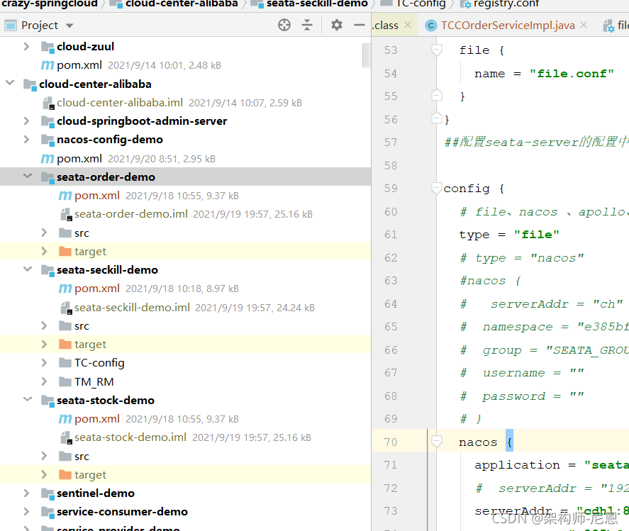

### 模块的角色架构

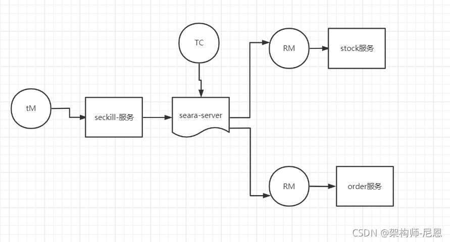

### maven依赖

```plain text
<!-- 分布式事务seata包 -->
<!--seata begin-->
<dependency>
   <groupId>com.alibaba.cloud</groupId>
   <artifactId>spring-cloud-starter-alibaba-seata</artifactId>
   <version>2.1.3.RELEASE</version>
   <exclusions>
     <exclusion>
        <groupId>io.seata</groupId>
        <artifactId>seata-spring-boot-starter</artifactId>
     </exclusion>
   </exclusions>
</dependency>
<dependency>
    <groupId>io.seata</groupId>
    <artifactId>seata-spring-boot-starter</artifactId>
    <version>1.3.0</version>
</dependency>
<!--seata end-->
```

### 事务分组是什么？

于是，上官网查看相关的参数配置，搜索serviceGroup

[https://seata.io/zh-cn/docs/user/transaction-group.html](https://seata.io/zh-cn/docs/user/transaction-group.html)

事务分组是什么？事务分组是 Seata 的资源逻辑，类似于服务实例。在file.conf中的my_test_tx_group就是一个事务分组。

通过事务分组如何找到后端集群？首先程序中配置了事务分组（GlobalTransactionScanner 构造方法的txServiceGroup参数），程序会通过用户配置的配置中心去寻找service.vgroupMapping.事务分组配置项，取得配置项的值就是TC集群的名称。拿到集群名称程序通过一定的前后缀+集群名称去构造服务名，各配置中心的服务名实现不同。拿到服务名去相应的注册中心去拉取相应服务名的服务列表，获得后端真实的TC服务列表。

为什么这么设计，不直接取服务名？这里多了一层获取事务分组到映射集群的配置。这样设计后，事务分组可以作为资源的逻辑隔离单位，当发生故障时可以快速failover。

根据第 2 点的说明，就可以知道问题所在了：

## TM&RM配置详解

9. registry.conf：配置注册中心和配置中心，默认是file。
10. file.conf：seata工作规则信息
11. DataSourceConfig：配置代理数据源实现分支事务，如果没有注入，事务无法成功回滚

### registry.conf配置：配置注册中心和配置中心

该文件包含两部分配置：

12. 注册中心
13. 配置中心

### 注册中心

```plain text
registry { # 注册中心配置
  # 可选项：file 、nacos 、eureka、redis、zk
  type = "nacos" # 指定nacos注册中心，默认是file。由于项目整体使用nacos，所以后续选择nacos

  nacos {
    serverAddr = "127.0.0.1:8848"
    namespace = "public"
    cluster = "default"
  }
  eureka {
    serviceUrl = "http://localhost:1001/eureka"
    application = "default"
    weight = "1"
  }
  redis {
    serverAddr = "localhost:6381"
    db = "0"
  }
  zk {
    cluster = "default"
    serverAddr = "127.0.0.1:2181"
    session.timeout = 6000
    connect.timeout = 2000
  }
  file {
    name = "file.conf"
  }
}
```

### 配置中心

```plain text
config { # 配置中心
  # 可选项：file、nacos 、apollo、zk
  type = "file" # 指向file配置中心，也可以指向nacos等其他注册中心

  nacos {
    serverAddr = "localhost"
    namespace = "public"
    cluster = "default"
  }
  apollo {
    app.id = "fescar-server"
    apollo.meta = "http://192.168.1.204:8801"
  }
  zk {
    serverAddr = "127.0.0.1:2181"
    session.timeout = 6000
    connect.timeout = 2000
  }
  file {
    name = "file.conf"   # 通过file.conf配置seata参数，指向第二个配置文件
  }
}
```

### file.conf

该文件的命名取决于registry.conf配置中心的配置

由于registry.conf中配置的是

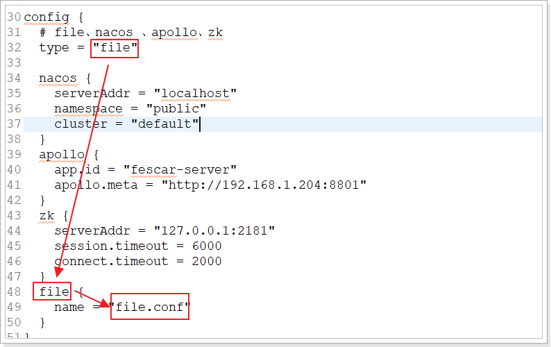

也就是说：file.conf

文件名取决于registry的配置中心(config{…})配置，如果registry配置的配置中心不是file，可以没有改文件。

如果配置中心是nacos，这是file.conf文件就不需要了，把file.conf文件内容交给nacos就可

### 事务日志存储配置：

```plain text
store {
  ## store mode: file、db
  mode = "file"  # 存储方式file、db

  ## file store
  file {
    dir = "sessionStore"

    # branch session size , if exceeded first try compress lockkey, still exceeded throws exceptions
    max-branch-session-size = 16384
    # globe session size , if exceeded throws exceptions
    max-global-session-size = 512
    # file buffer size , if exceeded allocate new buffer
    file-write-buffer-cache-size = 16384
    # when recover batch read size
    session.reload.read_size = 100
    # async, sync
    flush-disk-mode = async
  }

  ## database store
  db {
    driver_class = ""
    url = ""
    user = ""
    password = ""
  }
}
```

### TC信息配置

当前微服务在seata服务器中注册的信息配置：

```plain text
service {
  #vgroup->rgroup
  #必须和服务名一致：${spring.applicaiton.name}
  #vgroup_mapping.${spring.application.name}-fescar-service-group = "default"
  vgroup_mapping.${spring.application.name}-fescar-service-group = "default"
  #only support single node
  default.grouplist = "cdh1:18091" #seata-server服务器地址，默认是8091
  #degrade current not support
  enableDegrade = false
  #disable
  disable = false
}
```

### 客户端相关工作的机制

```plain text
client {
  async.commit.buffer.limit = 10000
  lock {
    retry.internal = 10
    retry.times = 30
  }
}
```

### DataSourceConfig

每一个微服务原来自己的数据源都必须使用DataSourceProxy代理，这样seata才能掌控所有事务。

```plain text
@Configuration
public class DataSourceConfig {

    @Bean
    @ConfigurationProperties(prefix = "spring.datasource")
    public DruidDataSource druidDataSource() {
        return new DruidDataSource();
    }

    /**
     * 需要将 DataSourceProxy 设置为主数据源，否则事务无法回滚
     *
     * @param druidDataSource The DruidDataSource
     * @return The default datasource
     */
    @Primary
    @Bean("dataSource")
    public DataSource dataSource(DruidDataSource druidDataSource) {
        return new DataSourceProxy(druidDataSource);
    }
}
```

### 事务注解

RM主业务方法添加全局事务：@GlobalTransactional

TM分支业务方法添加本地事务注解：@Transactional

说明：以上的配置，如果不能够理解，请参考配套视频

## 代码实现

### 10WQPS秒杀实操的AT分布式事务架构


如果你经过前面的步骤搭建Seata环境完成了，那么你可以尝试一下启动项目，控制台无异常则搭建成功。

那么下面准备以Seata官方文档上的一个经典例子为题，模拟用户下单，创建订单同时扣减库存数量这一过程中产生的分布式事务问题，然后使用Seata解决，正好使用以下Seata的特性。

### 服务秒杀

### seckillController

```plain text
@RestController
@RequestMapping("/api/seckill/seglock/")
@Api(tags = "秒杀练习分布式事务 版本")
public class SeckillBySegmentLockController {

    @Resource
    SeataSeckillServiceImpl seataSeckillServiceImpl;

    /**
     * 执行秒杀的操作
     * 减库存，下订单
     * <p>
     * {
     * "exposedKey": "4b70903f6e1aa87788d3ea962f8b2f0e",
     * "newStockNum": 10000,
     * "seckillSkuId": 1247695238068177920,
     * "seckillToken": "0f8459cbae1748c7b14e4cea3d991000",
     * "userId": 37
     * }
     *
     * @return
     */
    @ApiOperation(value = "秒杀")
    @PostMapping("/doSeckill/v1")
    RestOut<SeckillDTO> doSeckill(@RequestBody SeckillDTO dto) {

        seataSeckillServiceImpl.doSeckill(dto);

        return RestOut.success(dto).setRespMsg("秒杀成功");
    }

}
```

### seckillServiceImpl

```plain text
public class SeataSeckillServiceImpl {

    @Autowired
    private SeataDemoOrderFeignClient stockFeignClient;
    @Autowired
    private SeataDemoStockFeignClient orderFeignClient;

    /**
     * 减库存，下订单
     */
    @GlobalTransactional  //开启全局事务（重点） 使用 seata 的全局事务
    public void doSeckill(@RequestBody SeckillDTO dto) {

        orderFeignClient.minusStock(dto);
        stockFeignClient.addOrder(dto);
    }
}
```

### 库存服务的Feign类

```plain text
@FeignClient(name = "seata-stock-demo", path = "/seata-stock-demo/api/seckill/sku/")
public interface SeataDemoStockFeignClient {
    /**
     * minusStock 秒杀库存
     *
     * @param dto 商品与库存
     * @return 商品 skuDTO
     */
    @RequestMapping(value = "/minusStock/v1", method = RequestMethod.POST)
    RestOut<SeckillSkuDTO> minusStock(@RequestBody SeckillDTO dto);

}
```

### 订单服务的Feign类

```plain text
@FeignClient(name = "seata-order-demo", path = "/seata-order-demo/api/seckill/order/")
public interface SeataDemoOrderFeignClient {

    @RequestMapping(value = "/addOrder/v1", method = RequestMethod.POST)
    RestOut<SeckillOrderDTO> addOrder(@RequestBody SeckillDTO dto);
}
```

### 订单服务

### orderController

```plain text
@RestController
@RequestMapping("/api/seckill/order/")
@Api(tags = "秒杀练习 订单管理")
public class SeataATOrderController {
    @Resource
    SeckillOrderServiceImpl seckillOrderService;

    /**
     * 查询用户订单信息
     *
     * @param userId 用户id
     * @return 商品 dto
     */
    @PostMapping("/user/{id}/list/v1")
    @ApiOperation(value = "查询用户订单信息")
    RestOut<PageOut<SeckillOrderDTO>> userOrders(
            @PathVariable(value = "id") Long userId, @RequestBody PageReq pageReq) {
        PageOut<SeckillOrderDTO> dto = seckillOrderService.findOrderByUserID(userId, pageReq);
        if (null != dto) {
            return RestOut.success(dto).setRespMsg("查询成功");
        }
        return RestOut.error("查询失败");
    }

    /**
     * 查询用户的订单信息
     *
     * @param userId 用户id
     * @param skuId  商品id
     * @return 商品 dto
     */
    @GetMapping("/{userId}/{skuId}/v1")
    @ApiOperation(value = "查询用户订单信息")
    RestOut<SeckillOrderDTO> userOrders(
            @PathVariable(value = "userId") Long userId,
            @PathVariable(value = "skuId") Long skuId,
            @RequestBody PageReq pageReq) {
        List<SeckillOrderPO> pos = seckillOrderService.findOrderByUserIDAndSkuId(userId, skuId);
        if (null != pos && pos.size() > 0) {
            SeckillOrderDTO orderDTO = new SeckillOrderDTO();
            BeanUtils.copyProperties(pos.get(0), orderDTO);
            return RestOut.success(orderDTO).setRespMsg("查询成功");
        }
        return RestOut.error("查询失败");
    }

    /**
     * 清除用户订单信息
     *
     * @param dto 含有  用户id的dto
     * @return 操作结果
     */
    @PostMapping("/user/clear/v1")
    @ApiOperation(value = "清除用户订单信息")
    RestOut<String> userOrdersClear(@RequestBody SeckillDTO dto) {
        Long userId = dto.getUserId();
        String result = seckillOrderService.clearOrderByUserID(userId);

        return RestOut.success(result).setRespMsg("处理完成");
    }

    /**
     * 执行秒杀的操作
     * <p>
     * <p>
     * {
     * "exposedKey": "4b70903f6e1aa87788d3ea962f8b2f0e",
     * "newStockNum": 10000,
     * "seckillSkuId": 1157197244718385152,
     * "seckillToken": "0f8459cbae1748c7b14e4cea3d991000",
     * "userId": 37
     * }
     *
     * @return
     */
    @ApiOperation(value = "下订单")
    @PostMapping("/addOrder/v1")
    RestOut<SeckillOrderDTO> addOrder(@RequestBody SeckillDTO dto) {
        SeckillOrderDTO orderDTO = seckillOrderService.addOrder(dto);
        return RestOut.success(orderDTO).setRespMsg("下订单成功");
    }
}
```

### OrderServiceImpl

```plain text
/**
     * 执行秒杀下单
     *
     * @param inDto
     * @return
     */
    @Transactional //开启本地事务
    // @GlobalTransactional//不，开启全局事务（重点） 使用 seata 的全局事务
    public SeckillOrderDTO addOrder(SeckillDTO inDto) {

        long skuId = inDto.getSeckillSkuId();
        Long userId = inDto.getUserId();

        /**
         * 创建订单对象
         */
        SeckillOrderPO order =
                SeckillOrderPO.builder()
                        .skuId(skuId).userId(userId).build();

        Date nowTime = new Date();
        order.setCreateTime(nowTime);
        order.setStatus(SeckillConstants.ORDER_VALID);

        SeckillOrderDTO dto = null;

        /**
         * 创建重复性检查的订单对象
         */
        SeckillOrderPO checkOrder =
                SeckillOrderPO.builder().skuId(
                        order.getSkuId()).userId(order.getUserId()).build();

        //记录秒杀订单信息
        long insertCount = seckillOrderDao.count(Example.of(checkOrder));

        //唯一性判断：skuId,id 保证一个用户只能秒杀一件商品
        if (insertCount >= 1) {
            //重复秒杀
            log.error("重复秒杀");
            throw BusinessException.builder().errMsg("重复秒杀").build();
        }

        /**
         * 插入秒杀订单
         */
        seckillOrderDao.save(order);

        dto = new SeckillOrderDTO();
        BeanUtils.copyProperties(order, dto);

        return dto;

    }
```

### 库存服务

### stockController

```plain text
@Slf4j
@RestController
@RequestMapping("/api/seckill/sku/")
@Api(tags = "商品库存")
public class SeataSeckillStockController {
    @Resource
    SeataStockServiceImpl seckillSkuStockService;

    /**
     * minusStock 秒杀库存
     *
     * @param dto 商品与库存
     * @return 商品 skuDTO
     */
    @PostMapping("/minusStock/v1")
    @ApiOperation(value = "减少秒杀库存")
    RestOut<SeckillSkuDTO> minusStock(@RequestBody SeckillDTO dto, HttpServletRequest request) {

        // 绑定 XID，自动创建分支事物
        // 异常后，整个调用链路回滚
        String keyId = request.getHeader(RootContext.KEY_XID);

        if (null != keyId) {

            log.info("RootContext.KEY_XID is {}", keyId);
            // 绑定 XID，自动创建分支事物
            RootContext.bind(keyId);
        }

        Long skuId = dto.getSeckillSkuId();

        SeckillSkuDTO skuDTO = seckillSkuStockService.minusStock(dto);

        if (null != skuDTO) {
            return RestOut.success(skuDTO).setRespMsg("减少秒杀库存成功");
        }
        return RestOut.error("未找到指定秒杀商品");
    }

}
```

### StockServiceImpl

```plain text
/**
     * 执行秒杀下单
     *
     * @param inDto
     * @return
     */
    @Transactional
    public SeckillSkuDTO minusStock(SeckillDTO inDto) {

        long skuId = inDto.getSeckillSkuId();

        Optional<SeckillSkuPO> optional = seckillSkuDao.findById(skuId);

        if (!optional.isPresent()) {
            throw BusinessException.builder().errMsg("商品不存在").build();
        }

        SeckillSkuPO po = optional.get();
        if (po.getStockCount() <= 0) {
            throw BusinessException.builder().errMsg("库存不够").build();
        }
        seckillSkuDao.decreaseStockCountById(skuId);
//        po.setStockCount(po.getStockCount() - 1);
        SeckillSkuDTO dto = new SeckillSkuDTO();
        dto.setStockCount(po.getStockCount() - 1);
        BeanUtils.copyProperties(po, dto);
        return dto;

    }
```

### 实验演示：启动后进行事务演示

启动之后，可以进行秒杀下单演示，注意，第二阶段的成功或者回滚

具体演示，参见此博客的配套视频

### 错误排除

NettyClientChannelManager : no available service ’null‘ found, please make sure registry config…

项目中在使用 Seata 作为分布式事务的时候，好像特别容易遇到这个错误~总结原因，还是对Seata配置参数不熟悉导致的。首先是看到错误描述，找到抛出错误的地方：

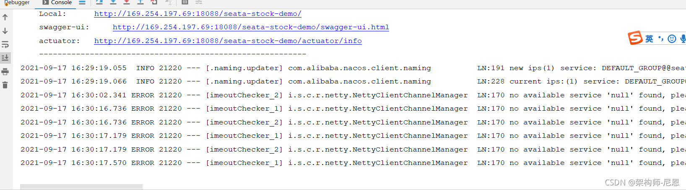

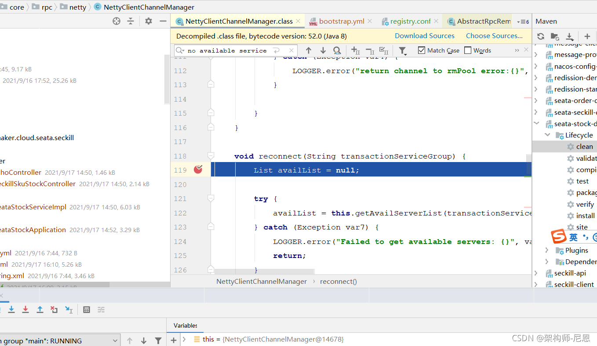

看到 getAvailServerList(transactionServiceGroup); 的入参是：transactionServiceGroup。刚好在配置文件中也有一项配置与之对应：

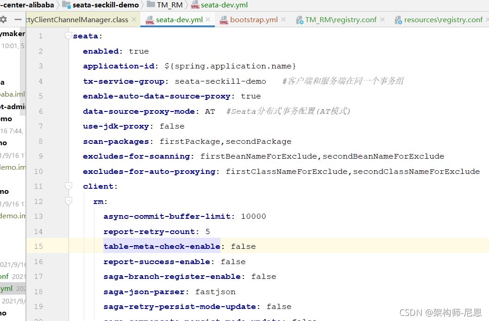

## Seata AT分布式事务执行流程演示

同步调用的3个阶段：

1、主事务调用分支事务之前；

2、分支事务结束并返回之前；

3、分支事务提交后，且主事务提交前

同步调用出问题的情况：

1、主事务成功，分支事务失败

2、主事务失败，分支事务成功

### 正常执行

### 观察每个阶段的undo_log和TC的记录

阶段一全局事务：

通过seckill 服务，观察 TC的记录 几个表的数据。

阶段一分支事务观察：

通过库存服务，观察undolog记录；

阶段一观察：

观察seata全局锁。

阶段二全局事务观察：

通过seckill 服务，观察 TC的记录 几个表的数据。

阶段二分支事务观察：

通过库存服务，观察undolog记录；

### 本实验演示：通过配套视频给出

### 异常执行

### 观察每个阶段的undo_log和TC的记录

阶段一全局事务：

通过seckill 服务，观察 TC的记录 几个表的数据。

阶段一分支事务观察：

通过库存服务，观察undolog记录；

阶段二全局事务观察：

通过seckill 服务，观察 TC的记录 几个表的数据。

阶段二分支事务观察：

通过库存服务，观察undolog记录；

### 本实验演示：通过配套视频给出

## 参考面试题

### 简述：Seata AT模式的事务流程

Seata的分布式事务解决方案是业务层面的解决方案，只依赖于单台数据库的事务能力。Seata框架中一个分布式事务包含3中角色：

- **Transaction Coordinator (TC)： 事务协调器，维护全局事务的运行状态，负责协调并驱动全局事务的提交或回滚。**
- **Transaction Manager (TM)： 控制全局事务的边界，负责开启一个全局事务，并最终发起全局提交或全局回滚的决议。**
- **Resource Manager (RM)： 控制分支事务，负责分支注册、状态汇报，并接收事务协调器的指令，驱动分支（本地）事务的提交和回滚。**

其中，TM是一个分布式事务的发起者和终结者，TC负责维护分布式事务的运行状态，而RM则负责本地事务的运行。如下图所示：


下面是一个分布式事务在Seata中的执行流程：

14. **TM 向 TC 申请开启一个全局事务，全局事务创建成功并生成一个全局唯一的 XID。**
15. **XID 在微服务调用链路的上下文中传播。**
16. **RM 向 TC 注册分支事务，接着执行这个分支事务并提交（重点：RM在第一阶段就已经执行了本地事务的提交/回滚），最后将执行结果汇报给TC。**
17. **TM 根据 TC 中所有的分支事务的执行情况，发起全局提交或回滚决议。**
18. **TC 调度 XID 下管辖的全部分支事务完成提交或回滚请求。**

### 回顾： Seata执行流程

下面是一个Seata中一个分布式事务执行的详细过程：

19. 首先TM 向 TC 申请开启一个全局事务，全局事务创建成功并生成一个全局唯一的 XID。
20. XID 在微服务调用链路的上下文中传播。
21. RM 开始执行这个分支事务，RM首先解析这条SQL语句，生成对应的UNDO_LOG记录。下面是一条UNDO_LOG中的记录：

```plain text
{
    "branchId": 641789253,
    "undoItems": [{
        "afterImage": {
            "rows": [{
                "fields": [{
                    "name": "id",
                    "type": 4,
                    "value": 1
                }, {
                    "name": "name",
                    "type": 12,
                    "value": "GTS"
                }, {
                    "name": "since",
                    "type": 12,
                    "value": "2014"
                }]
            }],
            "tableName": "product"
        },
        "beforeImage": {
            "rows": [{
                "fields": [{
                    "name": "id",
                    "type": 4,
                    "value": 1
                }, {
                    "name": "name",
                    "type": 12,
                    "value": "TXC"
                }, {
                    "name": "since",
                    "type": 12,
                    "value": "2014"
                }]
            }],
            "tableName": "product"
        },
        "sqlType": "UPDATE"
    }],
    "xid": "xid:xxx"
}
```

可以看到，UNDO_LOG表中记录了分支ID，全局事务ID，以及事务执行的redo和undo数据以供二阶段恢复。

22. RM在同一个本地事务中执行业务SQL和UNDO_LOG数据的插入。
在提交这个本地事务前，RM会向TC申请关于这条记录的全局锁。
如果申请不到，则说明有其他事务也在对这条记录进行操作，因此它会在一段时间内重试，重试失败则回滚本地事务，并向TC汇报本地事务执行失败。如下图所示：


23. RM在事务提交前，申请到了相关记录的全局锁，因此直接提交本地事务，并向TC汇报本地事务执行成功。此时全局锁并没有释放，全局锁的释放取决于二阶段是提交命令还是回滚命令。
24. TC根据所有的分支事务执行结果，向RM下发提交或回滚命令。
25. RM如果收到TC的提交命令，首先立即释放相关记录的全局锁，然后把提交请求放入一个异步任务的队列中，马上返回提交成功的结果给 TC。异步队列中的提交请求真正执行时，只是删除相应 UNDO LOG 记录而已。


提交.png

26. RM如果收到TC的回滚命令，则会开启一个本地事务，通过 XID 和 Branch ID 查找到相应的 UNDO LOG 记录。将 UNDO LOG 中的后镜与当前数据进行比较，如果有不同，说明数据被当前全局事务之外的动作做了修改。这种情况，需要根据配置策略来做处理。否则，根据 UNDO LOG 中的前镜像和业务 SQL 的相关信息生成并执行回滚的语句并执行，然后提交本地事务达到回滚的目的，最后释放相关记录的全局锁。


回滚.png

### 为什么Seata在第一阶段就直接提交了分支事务？

Seata能够在第一阶段直接提交事务，原因是啥？

因为Seata框架为每一个RM维护了一张UNDO_LOG表（这张表需要客户端自行创建），其中保存了每一次本地事务的回滚数据。

因此，二阶段的回滚并不依赖于本地数据库事务的回滚，而是RM直接读取这张UNDO_LOG表，并将数据库中的数据更新为UNDO_LOG中存储的历史数据。

Seata的本地事务提交，并不是发生在第二个阶段，为啥?

如果第二阶段是提交命令，那么RM事实上并不会对数据进行提交（因为一阶段已经提交了），而事实上，seata是发起一个异步请求，删除UNDO_LOG中关于本事务的记录。

### 怎么使用Seata框架，来保证事务的隔离性？

### Seata隔离级别

由于Seata一阶段直接提交了本地事务，因此会造成隔离性问题，因此Seata的默认隔离级别为Read Uncommitted。

然而Seata也支持Read Committed的隔离级别，该如何如何实现呢？

Seata由于一阶段RM自动提交本地事务的原因，默认隔离级别为Read Uncommitted。如果希望隔离级别为Read Committed，那么可以使用SELECT…FOR UPDATE语句。Seata引擎重写了SELECT…FOR UPDATE语句执行逻辑，SELECT…FOR UPDATE 语句的执行会申请 全局锁 ，如果 全局锁 被其他事务持有，则释放本地锁（回滚 SELECT…FOR UPDATE 语句的本地执行）并重试。这个过程中，查询是被 block 住的，直到 全局锁 拿到，即读取的相关数据是已提交的才返回。


SELECT FOR UPDATE.PNG

出于总体性能上的考虑，Seata 目前的方案并没有对所有 SELECT 语句都进行代理，仅针对 FOR UPDATE 的 SELECT 语句。

因 seata一阶段本地事务已提交，为防止其他事务脏读脏写需要加强隔离。【1】脏读 select语句加 for update（会去申请全局锁），代理方法增加 @GlobalLock或 @GlobalTransaction；【2】脏写 必须使用 @GlobalTransaction；【3】注：如果你查询的业务的接口没有 GlobalTransactional 包裹，也就是这个方法上压根没有分布式事务的需求，这时你可以在方法上标注 @GlobalLock注解，并且在查询语句上加 for update。 如果你查询的接口在事务链路上外层有GlobalTransactional注解，那么你查询的语句只要加for update就行。设计这个注解的原因是在没有这个注解之前，需要查询分布式事务读已提交的数据，但业务本身不需要分布式事务。 若使用 GlobalTransactional注解就会增加一些没用的额外的 rpc开销比如 begin 返回xid，提交事务等。GlobalLock简化了 rpc过程，使其做到更高的性能。

默认spring只在发生未被捕获的runtimeexcetpion时才回滚。

### 请比较一下：经典 XA和Seata AT模式


XA和Seata.PNG

注：Seata的曾用名为FESCAR。

如图所示，**XA 方案的 RM 实际上是在数据库层，RM 本质上就是数据库自身（通过提供支持 XA 的驱动程序来供应用使用）。而 Seata 的 RM 是以二方包的形式作为中间件层部署在应用程序这一侧的，不依赖与数据库本身对协议的支持，当然也不需要数据库支持 XA 协议**。这点对于微服务化的架构来说是非常重要的：应用层不需要为本地事务和分布式事务两类不同场景来适配两套不同的数据库驱动。

另外，**XA方案无论 Phase2 的决议是 commit 还是 rollback，事务性资源的锁都要保持到 Phase2 完成才释放。而对于Seata，将锁分为了本地锁和全局锁，本地锁由本地事务管理，在分支事务Phase1结束时就直接释放。而全局锁由TC管理，在决议 Phase2 全局提交时，全局锁马上可以释放。**只有在决议全局回滚的情况下，全局锁 才被持有至分支的 Phase2 结束。因此，Seata对于资源的占用时间要少的多。对比如下图所示：


XA锁资源.PNG


Seata锁资源.PNG

Seata 的方案其实一个 XA 两阶段提交的改进版，具体区别如下：

**架构的层面**：

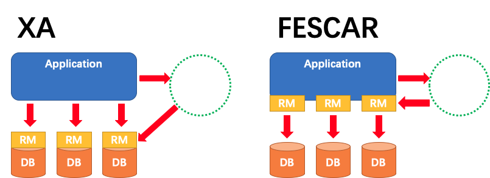

XA 方案的 RM 实际上是在数据库层，RM 本质上就是数据库自身（通过提供支持 XA 的驱动程序来供应用使用）。

而 Seata 的 RM 是以二方包的形式作为中间件层部署在应用程序这一侧的，不依赖与数据库本身对协议的支持，当然也不需要数据库支持 XA 协议。这点对于微服务化的架构来说是非常重要的：应用层不需要为本地事务和分布式事务两类不同场景来适配两套不同的数据库驱动。

这个设计，剥离了分布式事务方案对数据库在 协议支持 上的要求。

**两阶段提交**：

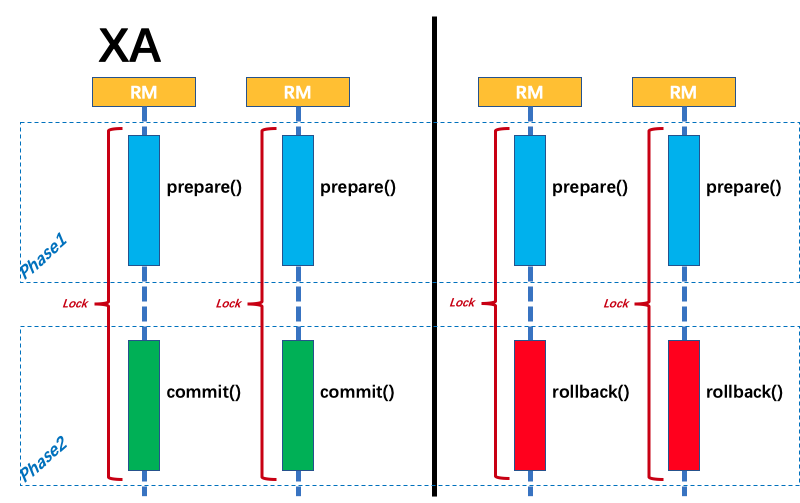

无论 Phase2 的决议是 commit 还是 rollback，事务性资源的锁都要保持到 Phase2 完成才释放。

设想一个正常运行的业务，大概率是 90% 以上的事务最终应该是成功提交的，我们是否可以在 Phase1 就将本地事务提交呢？这样 90% 以上的情况下，可以省去 Phase2 持锁的时间，整体提高效率。

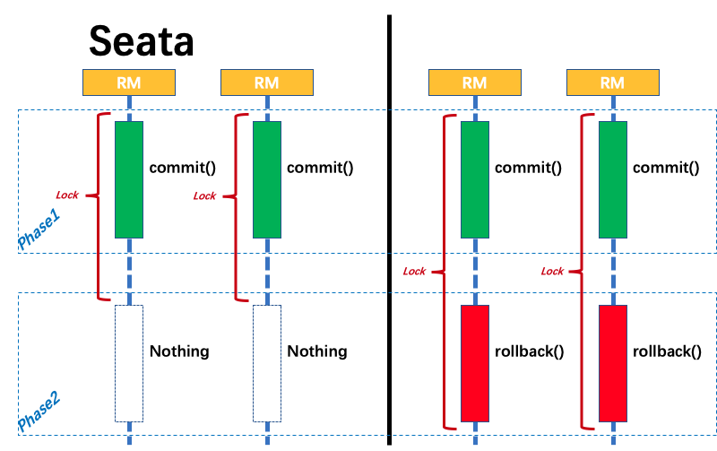

- 分支事务中数据的 本地锁 由本地事务管理，在分支事务 Phase1 结束时释放。
- 同时，随着本地事务结束，连接 也得以释放。
- 分支事务中数据的 全局锁 在事务协调器侧管理，在决议 Phase2 全局提交时，全局锁马上可以释放。只有在决议全局回滚的情况下，全局锁 才被持有至分支的 Phase2 结束。

这个设计，极大地减少了分支事务对资源（数据和连接）的锁定时间，给整体并发和吞吐的提升提供了基础。

### 简述：AT模式的性能问题？

## 参考文档：

seata 官方文档地址：

[http://seata.io/zh-cn/docs/overview/what-is-seata.html](http://seata.io/zh-cn/docs/overview/what-is-seata.html)

[https://www.cnblogs.com/babycomeon/p/11504210.html](https://www.cnblogs.com/babycomeon/p/11504210.html)

[https://www.cnblogs.com/javashare/p/12535702.html](https://www.cnblogs.com/javashare/p/12535702.html)

[https://blog.csdn.net/qq853632587/article/details/111356009](https://blog.csdn.net/qq853632587/article/details/111356009)

[https://blog.csdn.net/qq_35721287/article/details/103573862](https://blog.csdn.net/qq_35721287/article/details/103573862)

[https://www.cnblogs.com/anhaogoon/p/13033986.html](https://www.cnblogs.com/anhaogoon/p/13033986.html)

[https://blog.51cto.com/u_15072921/2606182](https://blog.51cto.com/u_15072921/2606182)

[https://blog.csdn.net/weixin_45661382/article/details/105539999](https://blog.csdn.net/weixin_45661382/article/details/105539999)

[https://blog.csdn.net/f4761/article/details/89077400](https://blog.csdn.net/f4761/article/details/89077400)

[https://blog.csdn.net/qq_27834905/article/details/107353159](https://blog.csdn.net/qq_27834905/article/details/107353159)

[https://zhuanlan.zhihu.com/p/266584169](https://zhuanlan.zhihu.com/p/266584169)

以下内容，来自 [官网](https://seata.io/zh-cn/)

Seata 是一款开源的分布式事务解决方案，致力于提供高性能和简单易用的分布式事务服务。Seata 将为用户提供了 AT、TCC、SAGA 和 XA 事务模式，为用户打造一站式的分布式解决方案。

### seata简介

Seata , [官网](https://seata.io/zh-cn/) , [github](https://github.com/seata/seata) , 1万多星

- Seata 是一款开源的分布式事务解决方案，致力于在微服务架构下提供高性能和简单易用的分布式事务服务。Seata 将为用户提供了 AT、TCC、SAGA 和 XA 事务模式
- 在 Seata 开源之前，Seata 对应的内部版本在阿里经济体内部一直扮演着分布式一致性中间件的角色，帮助经济体平稳的度过历年的双11，对各BU业务进行了有力的支撑。商业化产品[GTS](https://www.aliyun.com/aliware/txc?spm=5176.8142029.388261.386.a72376f4lqvQxv)
先后在阿里云、金融云进行售卖

**相关链接：**

**什么是seata：**[https://seata.io/zh-cn/docs/overview/what-is-seata.html](https://www.oschina.net/action/GoToLink?url=https%3A%2F%2Fseata.io%2Fzh-cn%2Fdocs%2Foverview%2Fwhat-is-seata.html)

**下载**[https://seata.io/zh-cn/blog/download.html](https://www.oschina.net/action/GoToLink?url=https%3A%2F%2Fseata.io%2Fzh-cn%2Fblog%2Fdownload.html)

**官方例子**[https://seata.io/zh-cn/docs/user/quickstart.html](https://www.oschina.net/action/GoToLink?url=https%3A%2F%2Fseata.io%2Fzh-cn%2Fdocs%2Fuser%2Fquickstart.html)

### Seata 的三大模块

Seata AT使用了增强型二阶段提交实现。

Seata 分三大模块 :

- TC ：事务协调者。负责我们的事务ID的生成，事务注册、提交、回滚等。
- TM：事务发起者。定义事务的边界，负责告知 TC，分布式事务的开始，提交，回滚。
- RM：资源管理者。管理每个分支事务的资源，每一个 RM 都会作为一个分支事务注册在 TC。

在Seata的AT模式中，TM和RM都作为SDK的一部分和业务服务在一起，我们可以认为是Client。TC是一个独立的服务，通过服务的注册、发现将自己暴露给Client们。

Seata 中有三大模块中， TM 和 RM 是作为 Seata 的客户端与业务系统集成在一起，TC 作为 Seata 的服务端独立部署。

### Seata 的分布式事务的执行流程

在 Seata 中，分布式事务的执行流程：

- TM 开启分布式事务（TM 向 TC 注册全局事务记录）；
- 按业务场景，编排数据库、服务等事务内资源（RM 向 TC 汇报资源准备状态 ）；
- TM 结束分布式事务，事务一阶段结束（TM 通知 TC 提交/回滚分布式事务）；
- TC 汇总事务信息，决定分布式事务是提交还是回滚；
- TC 通知所有 RM 提交/回滚 资源，事务二阶段结束；

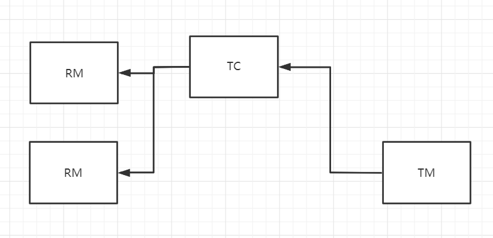

Seata的TC、TM、RM三个角色 ， 是不是和XA模型很像. 下图是XA模型的事务大致流程。

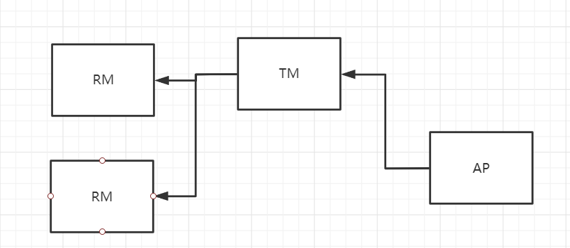

在X/Open **DTP(Distributed Transaction Process)**模型里面，有三个角色：

- AP: Application，应用程序。也就是业务层。哪些操作属于一个事务，就是AP定义的。
- TM: Transaction Manager，事务管理器。接收AP的事务请求，对全局事务进行管理，管理事务分支状态，协调RM的处理，通知RM哪些操作属于哪些全局事务以及事务分支等等。这个也是整个事务调度模型的核心部分。
- RM：Resource Manager，资源管理器。一般是数据库，也可以是其他的资源管理器，如消息队列(如JMS数据源)，文件系统等。

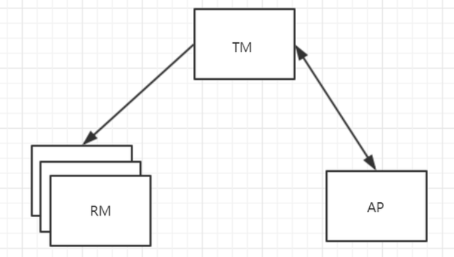

### 4 种分布式事务解决方案

Seata 会有 4 种分布式事务解决方案，分别是 AT 模式、TCC 模式、Saga 模式和 XA 模式。

## Seata AT模式

Seata AT模式是最早支持的模式。AT模式是指**Automatic (Branch) Transaction Mode**自动化分支事务。

Seata AT 模式是增强型2pc模式，或者说是增强型的XA模型。

总体来说，AT 模式，是 2pc两阶段提交协议的演变，不同的地方，Seata AT 模式不会一直锁表。

### Seata AT模式的使用前提

- 基于支持本地 ACID 事务的关系型数据库。
比如，在MySQL 5.1之前的版本中，默认的搜索引擎是MyISAM，从MySQL 5.5之后的版本中，默认的搜索引擎变更为InnoDB。MyISAM存储引擎的特点是：表级锁、不支持事务和全文索引。 所以，基于MyISAM 的表，就不支持Seata AT模式。
- Java 应用，通过 JDBC 访问数据库。

### Seata AT模型图

两阶段提交协议的演变：

- 一阶段：业务数据和回滚日志记录在同一个本地事务中提交，释放本地锁和连接资源。
- 二阶段：
    - 提交异步化，非常快速地完成。
    - 或回滚通过一阶段的回滚日志进行反向补偿

完整的AT在Seata所制定的事务模式下的模型图：

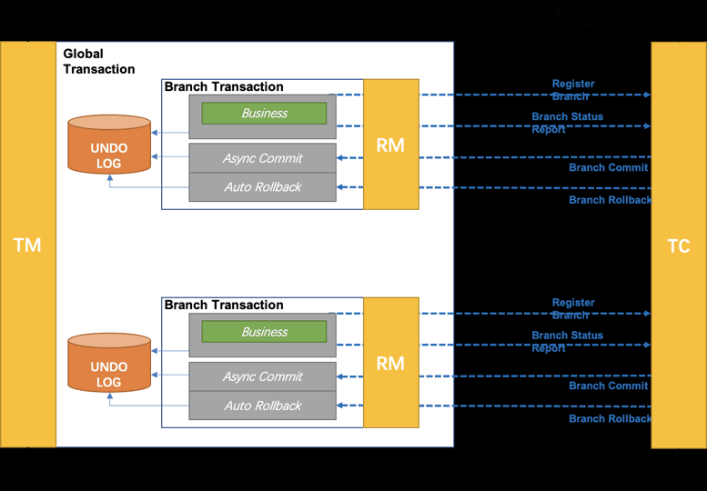

### Seata AT模式的例子

我们用一个比较简单的业务场景来描述一下Seata AT模式的工作过程。

有个充值业务，现在有两个服务，一个负责管理用户的余额，另外一个负责管理用户的积分。

当用户充值的时候，首先增加用户账户上的余额，然后增加用户的积分。

Seata AT分为两阶段，主要逻辑全部在第一阶段，第二阶段主要做回滚或日志清理的工作。

### 第一阶段流程：

第一阶段流程如

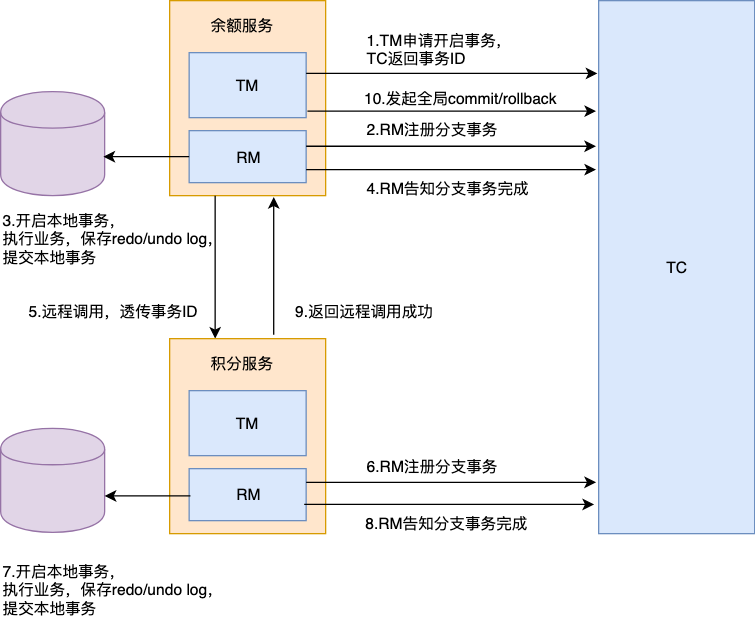

1）余额服务中的TM，向TC申请开启一个全局事务，TC会返回一个全局的事务ID。

2）余额服务在执行本地业务之前，RM会先向TC注册分支事务。

3）余额服务依次生成undo log、执行本地事务、生成redo log，最后直接提交本地事务。

4）余额服务的RM向TC汇报，事务状态是成功的。

5）余额服务发起远程调用，把事务ID传给积分服务。

6）积分服务在执行本地业务之前，也会先向TC注册分支事务。

7）积分服务次生成undo log、执行本地事务、生成redo log，最后直接提交本地事务。

8）积分服务的RM向TC汇报，事务状态是成功的。

9）积分服务返回远程调用成功给余额服务。

10）余额服务的TM向TC申请全局事务的提交/回滚。

积分服务中也有TM，但是由于没有用到，因此直接可以忽略。

我们如果使用 Spring框架的注解式事务，远程调用会在本地事务提交之前发生。但是，先发起远程调用还是先提交本地事务，这个其实没有任何影响。

### 第二阶段流程如：

第二阶段的逻辑就比较简单了。

Client和TC之间是有长连接的，如果是正常全局提交，则TC通知多个RM异步清理掉本地的redo和undo log即可。如果是回滚，则TC通知每个RM回滚数据即可。

这里就会引出一个问题，由于本地事务都是自己直接提交了，后面如何回滚，由于我们在操作本地业务操作的前后，做记录了undo和redo log，因此可以通过undo log进行回滚。

由于undo和redo log和业务操作在同一个事务中，因此肯定会同时成功或同时失败。

但是还会存在一个问题，因为每个事务从本地提交到通知回滚这段时间里，可能这条数据已经被别的事务修改，如果直接用undo log回滚，会导致数据不一致的情况。

此时，RM会用redo log进行校验，对比数据是否一样，从而得知数据是否有别的事务修改过。注意：undo log是被修改前的数据，可以用于回滚；redo log是被修改后的数据，用于回滚校验。

如果数据未被其他事务修改过，则可以直接回滚；如果是脏数据，再根据不同策略处理。

### Seata AT 模式在电商下单场景的使用

下面描述 Seata AT mode 的工作原理使用的电商下单场景的使用

如下图所示：

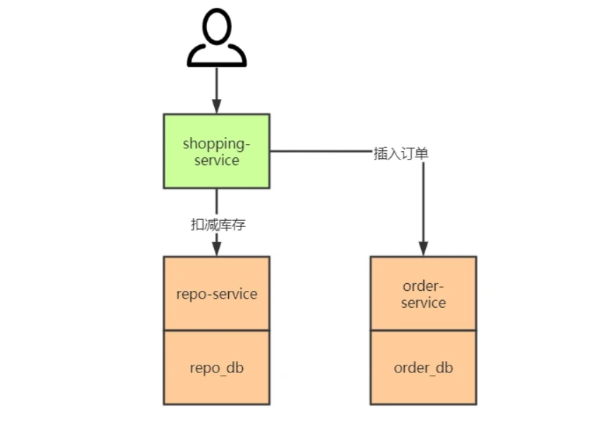

在上图中，协调者 shopping-service 先调用参与者 repo-service 扣减库存，后调用参与者 order-service 生成订单。这个业务流使用 Seata in XA mode 后的全局事务流程如下图所示：

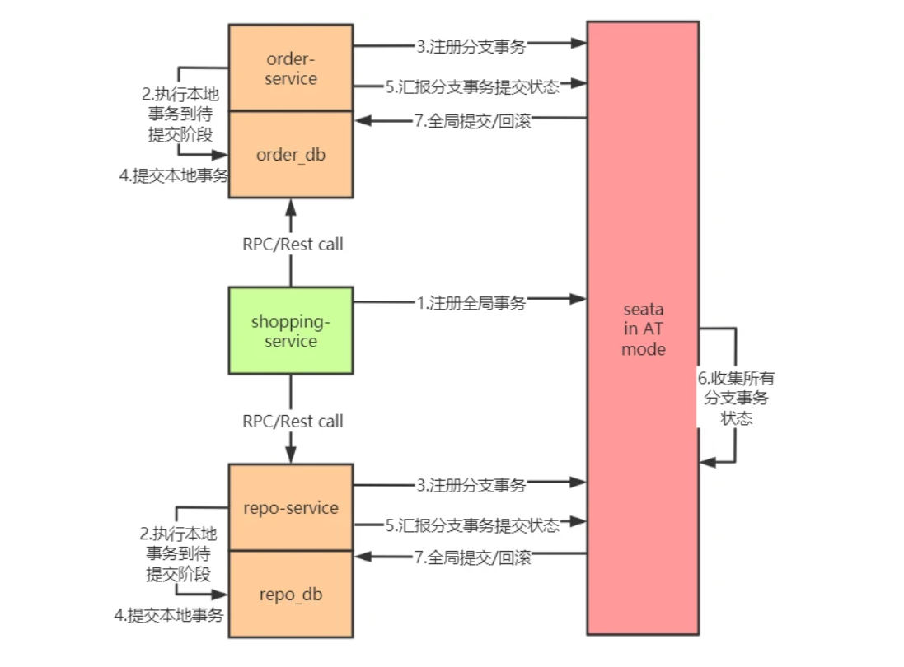

上图描述的全局事务执行流程为：

1）shopping-service 向 Seata 注册全局事务，并产生一个全局事务标识 XID

2）将 repo-service.repo_db、order-service.order_db 的本地事务执行到待提交阶段，事务内容包含对 repo-service.repo_db、order-service.order_db 进行的查询操作以及写每个库的 undo_log 记录

3）repo-service.repo_db、order-service.order_db 向 Seata 注册分支事务，并将其纳入该 XID 对应的全局事务范围

4）提交 repo-service.repo_db、order-service.order_db 的本地事务

5）repo-service.repo_db、order-service.order_db 向 Seata 汇报分支事务的提交状态

6）Seata 汇总所有的 DB 的分支事务的提交状态，决定全局事务是该提交还是回滚

7）Seata 通知 repo-service.repo_db、order-service.order_db 提交/回滚本地事务，若需要回滚，采取的是补偿式方法

其中 1）2）3）4）5）属于第一阶段，6）7）属于第二阶段。

### 电商业务场景中 Seata in AT mode 工作流程详述

在上面的电商业务场景中，购物服务调用库存服务扣减库存，调用订单服务创建订单，显然这两个调用过程要放在一个事务里面。即：

```plain text
start global_trx

 call 库存服务的扣减库存接口

 call 订单服务的创建订单接口

commit global_trx
```

在库存服务的数据库中，存在如下的库存表 t_repo：

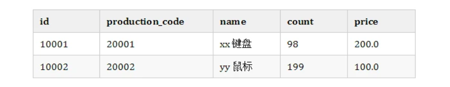

在订单服务的数据库中，存在如下的订单表 t_order：


现在，id 为 40002 的用户要购买一只商品代码为 20002 的鼠标，整个分布式事务的内容为：

1）在库存服务的库存表中将记录

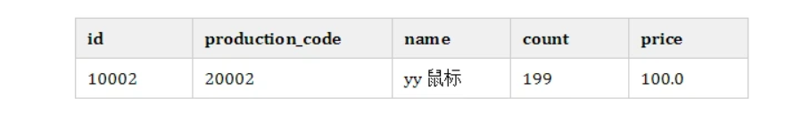

修改为

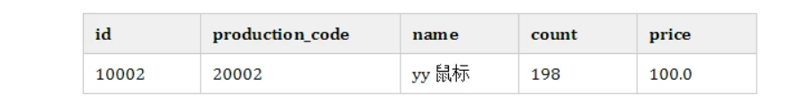

2）在订单服务的订单表中添加一条记录

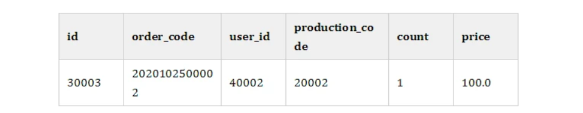

以上操作，在 AT 模式的第一阶段的流程图如下：

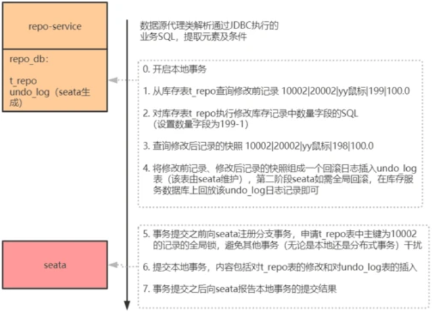

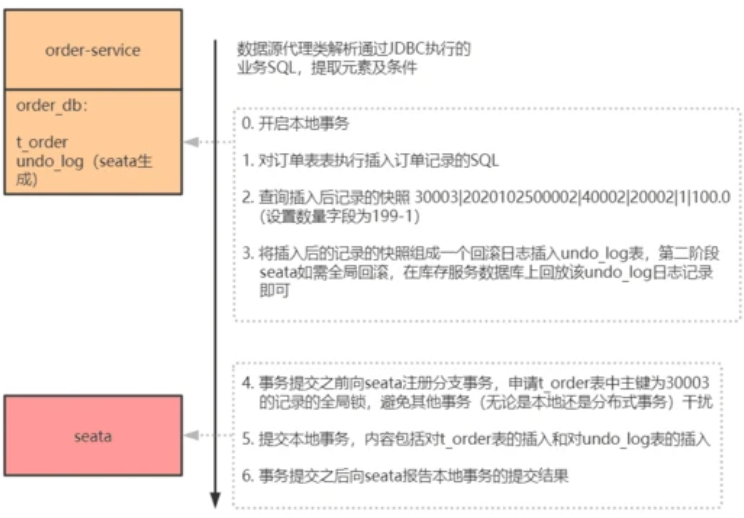

从 AT 模式第一阶段的流程来看，分支的本地事务在第一阶段提交完成之后，就会释放掉本地事务锁定的本地记录。这是 AT 模式和 XA 最大的不同点，在 XA 事务的两阶段提交中，被锁定的记录直到第二阶段结束才会被释放。所以 AT 模式减少了锁记录的时间，从而提高了分布式事务的处理效率。AT 模式之所以能够实现第一阶段完成就释放被锁定的记录，是因为 Seata 在每个服务的数据库中维护了一张 undo_log 表，其中记录了对 t_order / t_repo 进行操作前后记录的镜像数据，即便第二阶段发生异常，只需回放每个服务的 undo_log 中的相应记录即可实现全局回滚。

undo_log 的表结构：

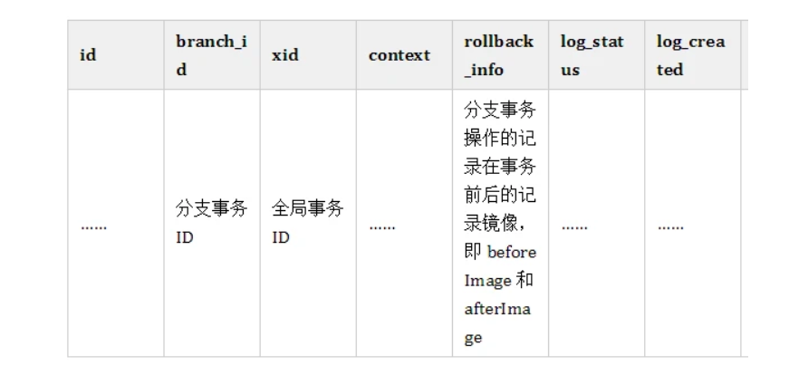

第一阶段结束之后，Seata 会接收到所有分支事务的提交状态，然后决定是提交全局事务还是回滚全局事务。

1）若所有分支事务本地提交均成功，则 Seata 决定全局提交。Seata 将分支提交的消息发送给各个分支事务，各个分支事务收到分支提交消息后，会将消息放入一个缓冲队列，然后直接向 Seata 返回提交成功。之后，每个本地事务会慢慢处理分支提交消息，处理的方式为：删除相应分支事务的 undo_log 记录。之所以只需删除分支事务的 undo_log 记录，而不需要再做其他提交操作，是因为提交操作已经在第一阶段完成了（这也是 AT 和 XA 不同的地方）。这个过程如下图所示：

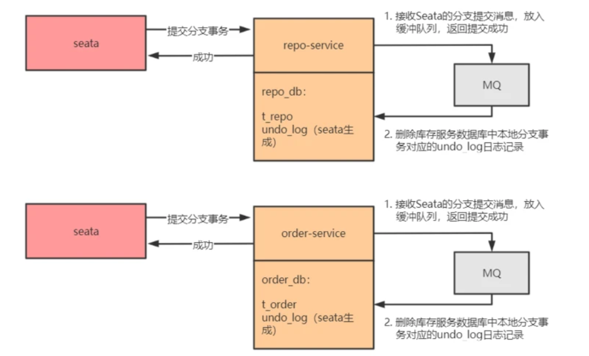

分支事务之所以能够直接返回成功给 Seata，是因为真正关键的提交操作在第一阶段已经完成了，清除 undo_log 日志只是收尾工作，即便清除失败了，也对整个分布式事务不产生实质影响。

2）若任一分支事务本地提交失败，则 Seata 决定全局回滚，将分支事务回滚消息发送给各个分支事务，由于在第一阶段各个服务的数据库上记录了 undo_log 记录，分支事务回滚操作只需根据 undo_log 记录进行补偿即可。全局事务的回滚流程如下图所示：

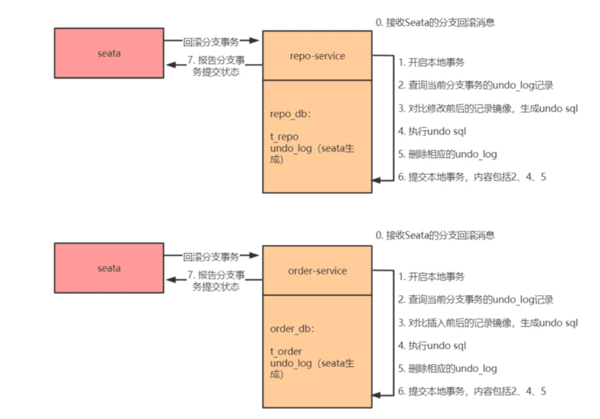

这里对图中的 2、3 步做进一步的说明：

1）由于上文给出了 undo_log 的表结构，所以可以通过 xid 和 branch_id 来找到当前分支事务的所有 undo_log 记录；

2）拿到当前分支事务的 undo_log 记录之后，首先要做数据校验，如果 afterImage 中的记录与当前的表记录不一致，说明从第一阶段完成到此刻期间，有别的事务修改了这些记录，这会导致分支事务无法回滚，向 Seata 反馈回滚失败；如果 afterImage 中的记录与当前的表记录一致，说明从第一阶段完成到此刻期间，没有别的事务修改这些记录，分支事务可回滚，进而根据 beforeImage 和 afterImage 计算出补偿 SQL，执行补偿 SQL 进行回滚，然后删除相应 undo_log，向 Seata 反馈回滚成功。

### Seata的数据隔离性

seata的at模式主要实现逻辑是数据源代理，而数据源代理将基于如MySQL和Oracle等关系事务型数据库实现，基于数据库的隔离级别为read committed。换而言之，本地事务的支持是seata实现at模式的必要条件，这也将限制seata的at模式的使用场景。

### 写隔离

从前面的工作流程，我们可以很容易知道，Seata的写隔离级别是全局独占的。

首先，我们理解一下写隔离的流程

```plain text
分支事务1-开始
|
V 获取 本地锁
|
V 获取 全局锁    分支事务2-开始
|               |
V 释放 本地锁     V 获取 本地锁
|               |
V 释放 全局锁     V 获取 全局锁
                |
                V 释放 本地锁
                |
                V 释放 全局锁
```

如上所示，一个分布式事务的锁获取流程是这样的1）先获取到本地锁，这样你已经可以修改本地数据了，只是还不能本地事务提交2）而后，能否提交就是看能否获得全局锁3）获得了全局锁，意味着可以修改了，那么提交本地事务，释放本地锁4）当分布式事务提交，释放全局锁。这样就可以让其它事务获取全局锁，并提交它们对本地数据的修改了。

可以看到，这里有两个关键点1）本地锁获取之前，不会去争抢全局锁2）全局锁获取之前，不会提交本地锁

这就意味着，数据的修改将被互斥开来。也就不会造成写入脏数据。全局锁可以让分布式修改中的写数据隔离。

### 写隔离的原则：

- 一阶段本地事务提交前，需要确保先拿到 **全局锁**
。
- 拿不到 **全局锁**
，不能提交本地事务。
- 拿 **全局锁**
的尝试被限制在一定范围内，超出范围将放弃，并回滚本地事务，释放本地锁。

以一个示例来说明：

两个全局事务 tx1 和 tx2，分别对 a 表的 m 字段进行更新操作，m 的初始值 1000。

tx1 先开始，开启本地事务，拿到本地锁，更新操作 m = 1000 - 100 = 900。本地事务提交前，先拿到该记录的 **全局锁** ，本地提交释放本地锁。

tx2 后开始，开启本地事务，拿到本地锁，更新操作 m = 900 - 100 = 800。本地事务提交前，尝试拿该记录的 **全局锁** ，tx1 全局提交前，该记录的全局锁被 tx1 持有，tx2 需要重试等待 **全局锁** 。

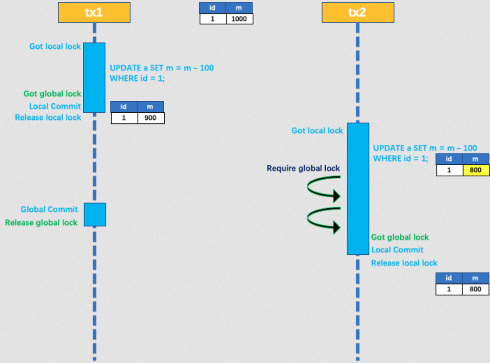

tx1 二阶段全局提交，释放 **全局锁** 。tx2 拿到 **全局锁** 提交本地事务。

如果 tx1 的二阶段全局回滚，则 tx1 需要重新获取该数据的本地锁，进行反向补偿的更新操作，实现分支的回滚。

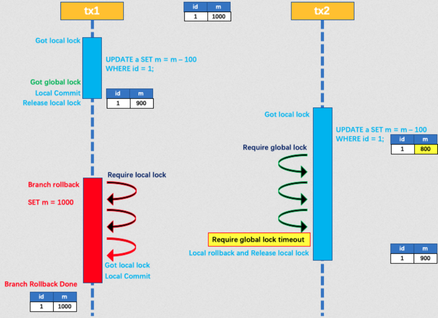

此时，如果 tx2 仍在等待该数据的 **全局锁**，同时持有本地锁，则 tx1 的分支回滚会失败。分支的回滚会一直重试，直到 tx2 的 **全局锁** 等锁超时，放弃 **全局锁** 并回滚本地事务释放本地锁，tx1 的分支回滚最终成功。

因为整个过程 **全局锁** 在 tx1 结束前一直是被 tx1 持有的，所以不会发生 **脏写** 的问题。

### 读的隔离级别

在数据库本地事务隔离级别 **读已提交（Read Committed）** 或以上的基础上，Seata（AT 模式）的默认全局隔离级别是 **读未提交（Read Uncommitted）** 。

如果应用在特定场景下，必需要求全局的 **读已提交** ，目前 Seata 的方式是通过 SELECT FOR UPDATE 语句的代理。

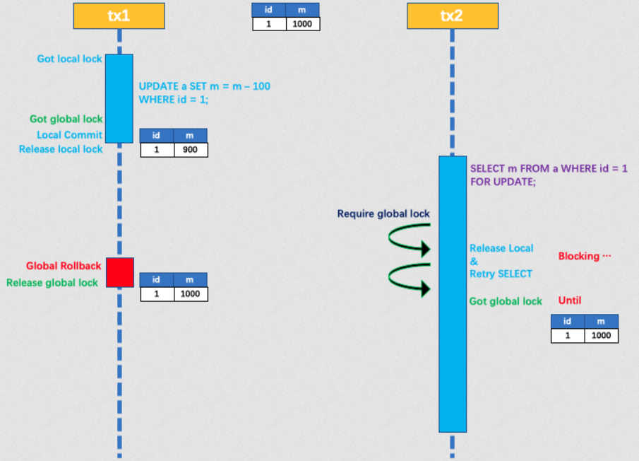

SELECT FOR UPDATE 语句的执行会申请 **全局锁** ，如果 **全局锁** 被其他事务持有，则释放本地锁（回滚 SELECT FOR UPDATE 语句的本地执行）并重试。这个过程中，查询是被 block 住的，直到 **全局锁** 拿到，即读取的相关数据是 **已提交** 的，才返回。

出于总体性能上的考虑，Seata 目前的方案并没有对所有 SELECT 语句都进行代理，仅针对 FOR UPDATE 的 SELECT 语句。

### Spring Cloud集成Seata AT模式

AT模式是指**Automatic (Branch) Transaction Mode 自动化分支事务，**使用AT模式的前提是

- 基于支持本地 ACID 事务的关系型数据库。
- Java 应用，通过 JDBC 访问数据库。

**seata-at的使用步骤**

1、引入seata框架，配置好seata基本配置，建立undo_log表

2、消费者引入全局事务注解@GlobalTransactional

3、生产者引入全局事务注解@GlobalTransactional

此处没有写完， 尼恩的博文，都是迭代模式，后续会持续

## Seata TCC 模式

### 简介

TCC 与 Seata AT 事务一样都是**两阶段事务**，它与 AT 事务的主要区别为：

- **TCC 对业务代码侵入严重**
每个阶段的数据操作都要自己进行编码来实现，事务框架无法自动处理。
- **TCC 性能更高全局锁**
不必对数据加
，允许多个事务同时操作数据。
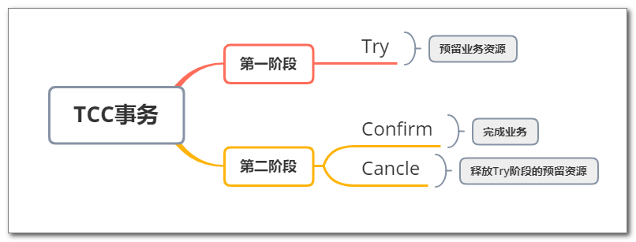

Seata TCC 整体是 **两阶段提交** 的模型。一个分布式的全局事务，全局事务是由若干分支事务组成的，分支事务要满足 **两阶段提交** 的模型要求，即需要每个分支事务都具备自己的：

- 一阶段 prepare 行为
- 二阶段 commit 或 rollback 行为

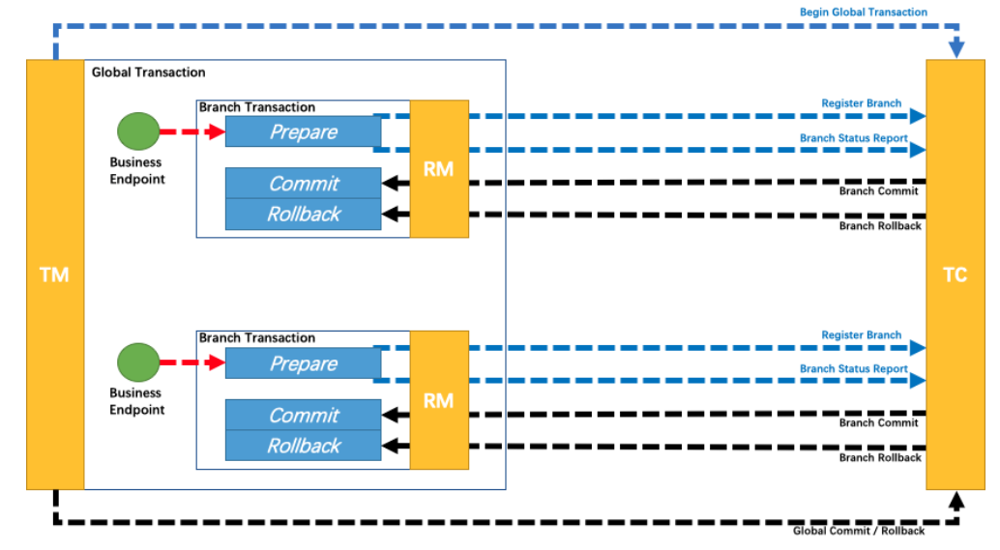

根据两阶段行为模式的不同，我们将分支事务划分为 **Automatic (Branch) Transaction Mode** 和 **TCC (Branch) Transaction Mode**.

AT 模式（[参考链接 TBD](https://seata.io/zh-cn/docs/dev/mode/tcc-mode.html)）基于 **支持本地 ACID 事务** 的 **关系型数据库**：

- 一阶段 prepare 行为：在本地事务中，一并提交业务数据更新和相应回滚日志记录。
- 二阶段 commit 行为：马上成功结束，**自动**
异步批量清理回滚日志。
- 二阶段 rollback 行为：通过回滚日志，**自动**
生成补偿操作，完成数据回滚。

相应的，TCC 模式，不依赖于底层数据资源的事务支持：

- 一阶段 prepare 行为：调用 **自定义**
的 prepare 逻辑。
- 二阶段 commit 行为：调用 **自定义**
的 commit 逻辑。
- 二阶段 rollback 行为：调用 **自定义**
的 rollback 逻辑。

所谓 TCC 模式，是指支持把 **自定义** 的分支事务纳入到全局事务的管理中。

### 第一阶段 Try

以账户服务为例，当下订单时要扣减用户账户金额：

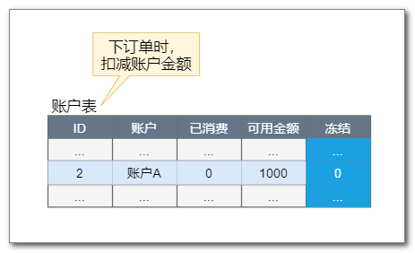

假如用户购买 100 元商品，要扣减 100 元。

TCC 事务首先对这100元的扣减金额进行预留，或者说是先冻结这100元：

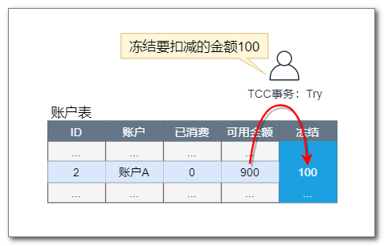

### 第二阶段 Confirm

如果第一阶段能够顺利完成，那么说明“扣减金额”业务(分支事务)最终肯定是可以成功的。当全局事务提交时， TC会控制当前分支事务进行提交，如果提交失败，TC 会反复尝试，直到提交成功为止。

当全局事务提交时，就可以使用冻结的金额来最终实现业务数据操作：

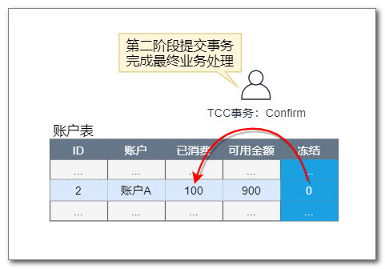

### 第二阶段 Cancel

如果全局事务回滚，就把冻结的金额进行解冻，恢复到以前的状态，TC 会控制当前分支事务回滚，如果回滚失败，TC 会反复尝试，直到回滚完成为止。

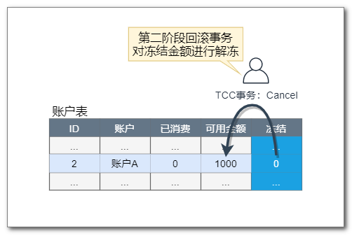

### 多个事务并发的情况

多个TCC全局事务允许并发，它们执行扣减金额时，只需要冻结各自的金额即可：

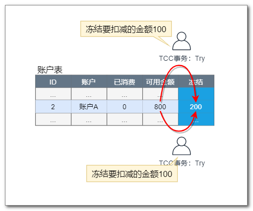

## SEATA Saga 模式

Saga模式是SEATA提供的长事务解决方案，在Saga模式中，业务流程中每个参与者都提交本地事务，当出现某一个参与者失败则补偿前面已经成功的参与者，一阶段正向服务和二阶段补偿服务都由业务开发实现。

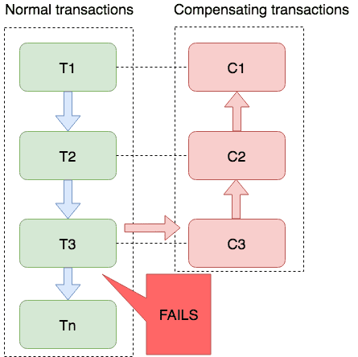

理论基础：Hector & Kenneth 发表论⽂ Sagas （1987）

### 适用场景：

- 业务流程长、业务流程多
- 参与者包含其它公司或遗留系统服务，无法提供 TCC 模式要求的三个接口

### 优势：

- 一阶段提交本地事务，无锁，高性能
- 事件驱动架构，参与者可异步执行，高吞吐
- 补偿服务易于实现

### 缺点：

- 不保证隔离性（应对方案见后面文档）

### Saga的实现：

### 基于状态机引擎的 Saga 实现：

目前SEATA提供的Saga模式是基于状态机引擎来实现的，机制是：

1. 通过状态图来定义服务调用的流程并生成 json 状态语言定义文件
2. 状态图中一个节点可以是调用一个服务，节点可以配置它的补偿节点
3. 状态图 json 由状态机引擎驱动执行，当出现异常时状态引擎反向执行已成功节点对应的补偿节点将事务回滚

注意: 异常发生时是否进行补偿也可由用户自定义决定

4. 可以实现服务编排需求，支持单项选择、并发、子流程、参数转换、参数映射、服务执行状态判断、异常捕获等功能

示例状态图:

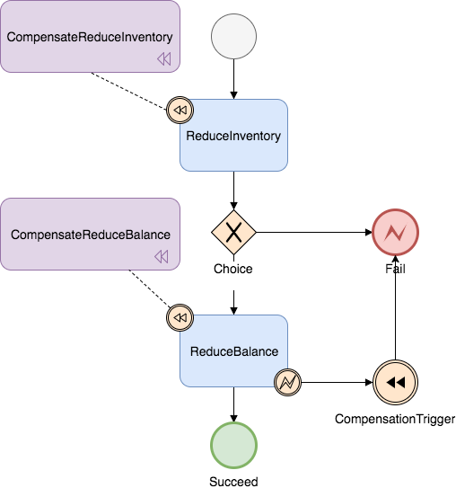

Seata Saga 模式 没有写完， 尼恩的博文，都是迭代模式，后续会持续优化

## Seata XA 模式

### 使用Seata XA 模式的前提

- 支持XA 事务的数据库。
- Java 应用，通过 JDBC 访问数据库。

### Seata XA 模式的整体机制

在 Seata 定义的分布式事务框架内，利用事务资源（数据库、消息服务等）对 XA 协议的支持，以 XA 协议的机制来管理分支事务的一种 事务模式。

注意这里的重点：利用事务资源对 XA 协议的支持，以 XA 协议的机制来管理分支事务。

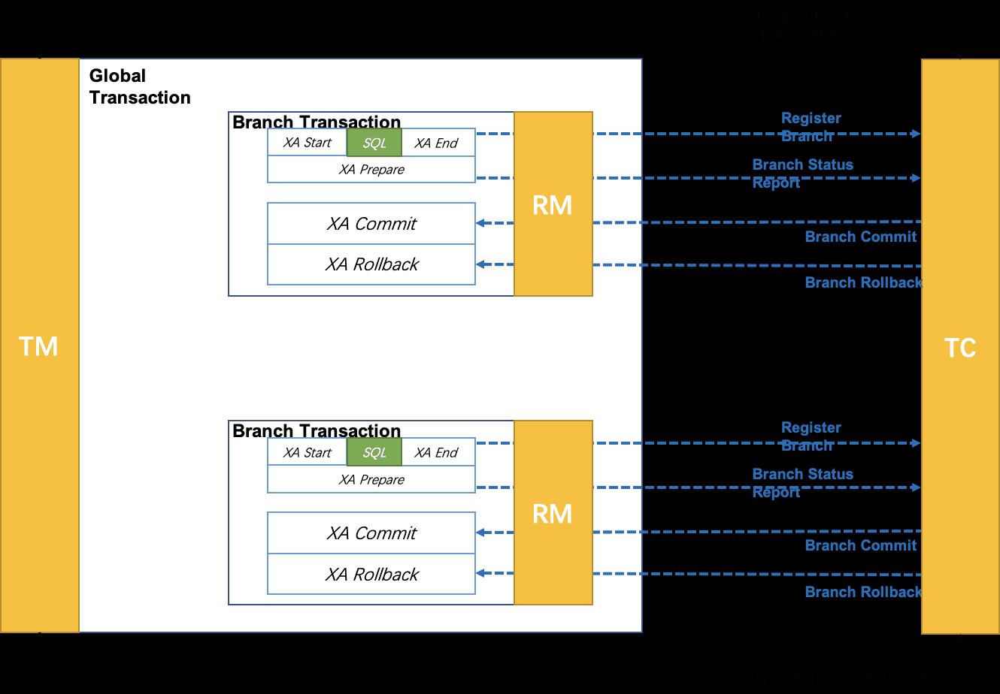

### Seata XA 模式的工作机制

### 1. 整体运行机制

XA 模式 运行在 Seata 定义的事务框架内：

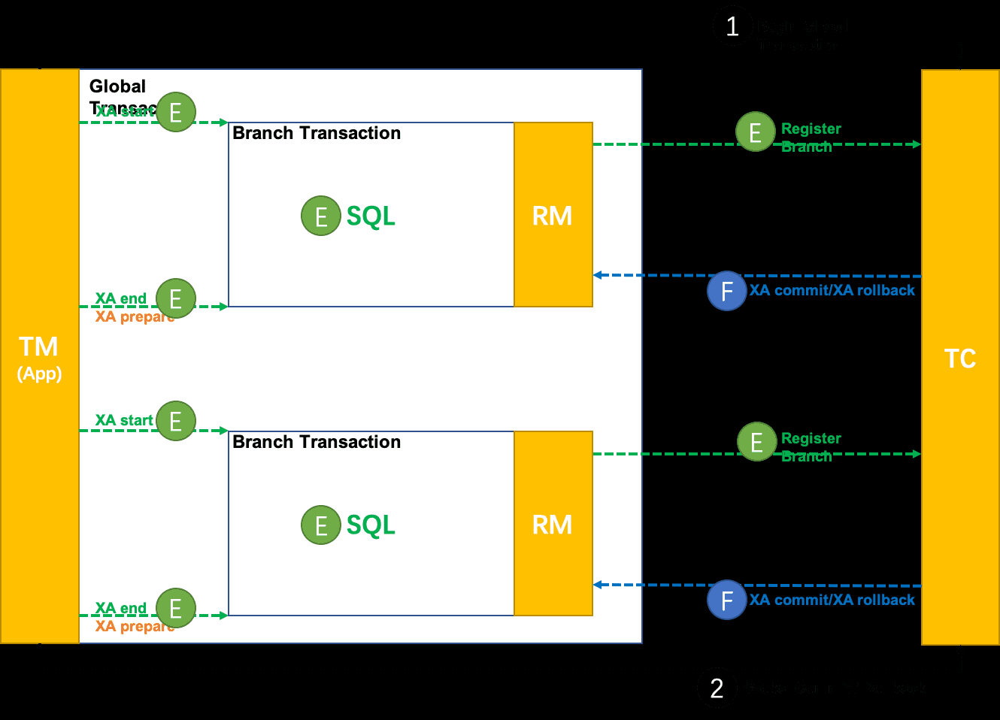

### 2. 数据源代理

XA 模式需要 XAConnection。

获取 XAConnection 两种方式：

- 方式一：要求开发者配置 XADataSource
- 方式二：根据开发者的普通 DataSource 来创建

第一种方式，给开发者增加了认知负担，需要为 XA 模式专门去学习和使用 XA 数据源，与 透明化 XA 编程模型的设计目标相违背。

第二种方式，对开发者比较友好，和 AT 模式使用一样，开发者完全不必关心 XA 层面的任何问题，保持本地编程模型即可。

我们优先设计实现第二种方式：数据源代理根据普通数据源中获取的普通 JDBC 连接创建出相应的 XAConnection。

类比 AT 模式的数据源代理机制，如下：

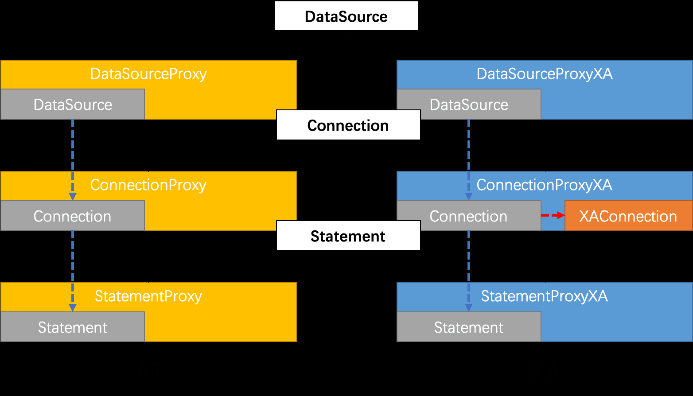

实际上，这种方法是在做数据库驱动程序要做的事情。不同的厂商、不同版本的数据库驱动实现机制是厂商私有的，我们只能保证在充分测试过的驱动程序上是正确的，开发者使用的驱动程序版本差异很可能造成机制的失效。

这点在 Oracle 上体现非常明显。参见 Druid issue：[https://github.com/alibaba/druid/issues/3707](https://github.com/alibaba/druid/issues/3707)

综合考虑，XA 模式的数据源代理设计需要同时支持第一种方式：基于 XA 数据源进行代理。

类比 AT 模式的数据源代理机制，如下：

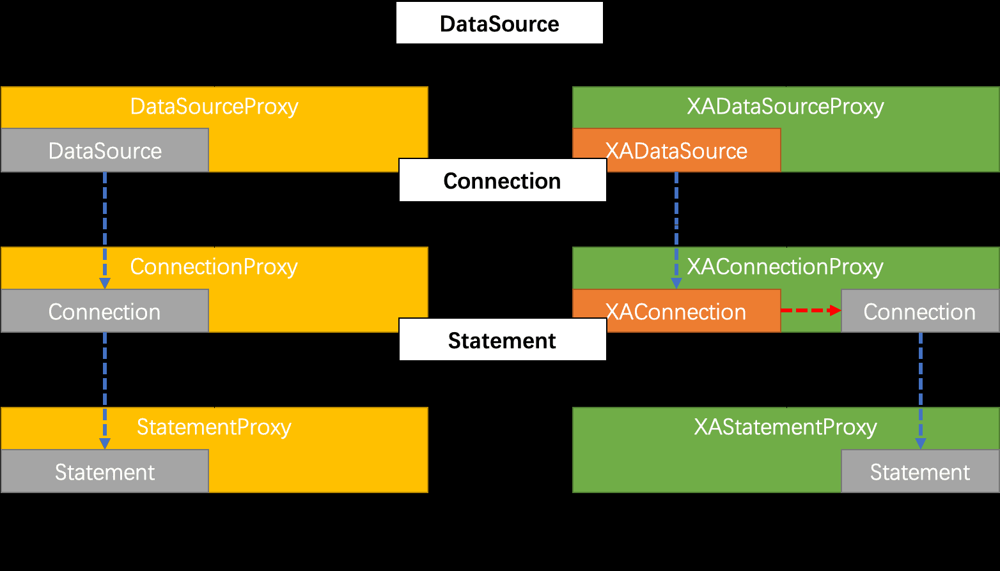

XA start 需要 Xid 参数。

这个 Xid 需要和 Seata 全局事务的 XID 和 BranchId 关联起来，以便由 TC 驱动 XA 分支的提交或回滚。

目前 Seata 的 BranchId 是在分支注册过程，由 TC 统一生成的，所以 XA 模式分支注册的时机需要在 XA start 之前。

将来一个可能的优化方向：

把分支注册尽量延后。类似 AT 模式在本地事务提交之前才注册分支，避免分支执行失败情况下，没有意义的分支注册。

这个优化方向需要 BranchId 生成机制的变化来配合。BranchId 不通过分支注册过程生成，而是生成后再带着 BranchId 去注册分支。

### XA 模式的使用

从编程模型上，XA 模式与 AT 模式保持完全一致。

可以参考 Seata 官网的样例：[seata-xa](https://github.com/seata/seata-samples/tree/master/seata-xa)

样例场景是 Seata 经典的，涉及库存、订单、账户 3 个微服务的商品订购业务。

在样例中，上层编程模型与 AT 模式完全相同。只需要修改数据源代理，即可实现 XA 模式与 AT 模式之间的切换。

```plain text
@Bean("dataSource")
    public DataSource dataSource(DruidDataSource druidDataSource) {
        // DataSourceProxy for AT mode
        // return new DataSourceProxy(druidDataSource);

        // DataSourceProxyXA for XA mode
        return new DataSourceProxyXA(druidDataSource);
    }
```
