# 分布式事务的解决方案

在分布式系统、微服务架构大行其道的今天，服务间互相调用出现失败已经成为常态。如何处理异常，如何保证数据一致性，成为微服务设计过程中，绕不开的一个难题。在不同的业务场景下，解决方案会有所差异，常见的方式有：

1. 阻塞式重试；
2. 2PC、3PC 传统事务；
3. 使用队列，后台异步处理；
4. TCC 补偿事务；
5. 本地消息表（异步确保）；
6. MQ 事务。

本文侧重于其他几项，关于 2PC、3PC 传统事务，网上资料已经非常多了，这里不多做重复。

## 阻塞式重试

在微服务架构中，阻塞式重试是比较常见的一种方式。伪代码示例：

如上，当请求B服务的API失败后，发起最多三次重试，如果三次还是失败，就打印日志，继续执行下或向上层抛出错误。这种方式会带来以下问题

- 调用B服务成功，但由于网络超时问题，当前服务认为其失败了，继续重试，这样B服务会产生2条一样的数据
- 调用B服务失败，由于B服务不可用，重试3次依然失败，当前服务在前面代码中插入到DB的一条记录，就变成了脏数据
- 重试会增加上游对本次调用的延迟，如果下游负载较大，重试会放大下游服务的压力

第一个问题：通过让B服务的API支持幂等性来解决

第二个问题：可以通过后台定时脚本去修正数据，但并不是一个很好的解决方法

第三个问题：这是通过阻塞式重试提高一致性、可用性，必不可少的牺牲

阻塞式重试适用于业务对一致性要求不敏感的场景下。如果对数据一致性有要求的话，就必须要引入额外的机制来解决。

异步队列

在解决方案演化的过程中，引入队列是一个比较常见也比较好的方式。

m := db.Insert(sql)

err := mq.pubsh("B-service-topic",m)

在当前服务将数据写入DB后，推送一条消息给MQ，由独立的服务去消费MQ处理业务逻辑。和阻塞式重试相比，虽然MQ在稳定性上远高于普通的业务服务，但在推送消息到MQ中的调用，还是会有失败的可能性，比如网络问题、当前服务宕机等。这样还是会遇到阻塞式重试相同的问题，即DB写入成功了，但推送失败了。

理论上来讲，分布式系统下，设计多个服务调用的代码都存在这样的情况，在长期运行中，调用失败的情况一定会出现。这也是分布式系统设计的难点之一。

TCC补偿事务

在对事务有要求，且不方便解耦的情况下，TCC补偿事务是个较好的选择。

TCC把调用每个服务都分为2个阶段、3个操作：

阶段一、try操作，对业务资源做检测、资源预留，比如对库存的检查、预扣。

阶段二、Confirm操作：提交确认Try操作的资源预留。比如把库存预扣更新为扣除。

阶段二、Cancel操作：Try操作失败后，释放其预扣的资源。比如把库存预扣的加回去。

TCC要求每个服务都实现上面3个操作的API，服务接入TCC事务前，一次调用就完成的操作，现在需要分为2个阶段、三次操作来完成

比如一个商城应用需要调用A库存服务、B金额服务、C积分服务，如下

代码中分别调用A、B、C服务API检查并保留资源，都返回成功了再提交确认（Confirm）操作：如果C服务Try操作失败后，则分别调用A、B、C的CancelAPI释放其保留的资源。

TCC在业务上解决了分布式系统下，跨多个服务、跨多个数据库的数据一致性问题。

但TCC方式依然存在一些问题，实际使用中需要注意，包括上面章节提到的调用失败的情况。

空释放

在上面的代码中如果C.Try()是真正的调用失败，那么下面多余的C.Cancel()调用会出现释放并没有锁定资源的行为。这是因为当前服务无法判断调用失败是不是真的锁定C资源了。如果不调用，实际上成功了，但由于网络原因返回失败了，这会导致C的资源被锁定，一直得不到释放。

空释放在生产环境经常出现，服务在实现TCC事务API时，应支持空释放的执行。

时序

上面代码中如果C.try()失败，接着调用C.Cancel()操作。因为网络原因，有可能会出现C.Cancel()请求会先到C服务，C.Try()请求后到，这会导致空释放问题，同时引起C的资源被锁定，一直得不到释放。

所以C服务应拒绝释放资源之后的Try()操作。具体实现上，可以用唯一事务ID来区分第一次Try()还是释放后的Try()

调用失败

Cancel、Confirm在调用过程中，还是会存在失败的情况，v比如常见的网络原因。

Cancel()或Confirm()操作失败都会导致资源被锁定，一直得不到释放。这种情况常见的解决方案有：

阻塞式重试。但有同样的问题，比如宕机、一直失败的情况

写入日志、队列，然后有单独的异步服务自动或人工介入处理。但一样会有问题，写日志或队列时，会存在失败的情况。

理论上来讲非原子性、事务性的二段代码，都会存在中间态，有中间态就会有失败的可能性。

本地消息表

本地消息表最初是ebay提出的，他让本地消息表与业务数据表处于同一个数据库中，这样就能利用本地事务来满足事务特性。

具体做法是在本地事务中插入业务数据时，也插入一条消息数据。然后再做后续操作，如果其他操作成功，则删除该消息；如果失败则不删除，异步监听这个消息，不断重试。

本地消息表是一个很好的思路，可以有多种使用方式：

配合MQ

示例伪代码：

上面代码中其messageTxSql是插入本地消息表的一段SQL：

insert into `tcc_async_task` (`uid`,`name`,`value`,`status`) values ('?','?','?','?')

它和业务SQL再同一个事务中去执行，要么成功，要么失败。

成功则推送到队列，推送成功，则调用messageTxCancel()删除本地消息：推送失败则标记消息为confirm。本地消息表中status有两种状态try、confirm，无论哪种状态在OnMessage都可以监听到，从而发起重试。

本地事务保障消息和业务一定会写入数据库，此后的执行无论宕机还是网络推送失败，异步监听都可以进行后续处理，从而保障了消息一定会推到MQ

而MQ则保障一定会到达消费者服务中，利用MQ的QOS策略，消费者服务一定能处理，或继续投递到下一个业务队列中，从而保障了事务的完整性。

配合服务调用

示例伪代码：

messageTx := tc.NewTransaction("order")

messageTxSql := tx.TryPlan("content")

body,err := db.InsertTx(sql,messageTxSql)

if err!=nil {

return err

}

aErr := request.POST("B-Service",body)

if aErr!=nil { // 调用 B-Service 失败

messageTx.Confirm() // 更新消息的状态为 confirm

}else {

messageTx.Cancel() // 删除消息

}

// 异步处理 confirm 或 try 的消息，继续调用 B-Service

func OnMessage(task *Task){

// request.POST("B-Service",body)

}

这是本地消息表+调用其他服务的例子，没有MQ的引入。这种使用异步重试，并用本地消息表保障消息的可靠性，解决了阻塞式重试带来的问题，在日常开发中比较常见。

如果本地没有要写DB的操作，可以只写入本地消息表，同样在OnMessage中处理

messageTx := tc.NewTransaction("order")

messageTx := tx.Try("content")

aErr := request.POST("B-Service",body)

// ….

消息过期

配置本地消息表的Try和Confirm消息的处理器

TCC.SetTryHandler(OnTryMessage())

TCC.SetConfirmHandler(OnConfirmMessage())

在消息处理函数中要判断当前消息任务是否存在过久，比如一直重试了一个小时，还是失败，就考虑发邮件、短信、日志告警等方式，让人工介入

func OnConfirmMessage(task *tcc.Task) {

if time.Now().Sub(task.CreatedAt) > time.Hour {

err := task.Cancel() // 删除该消息，停止重试。

// doSomeThing() 告警，人工介入

return

}

}

在Try处理函数中，还要单独判断当前消息任务是否存在过短，因为Try状态的消息，可能才刚刚创建，还没被确认提交或删除。这会和正常业务逻辑的执行重复，意味着成功的调用，也会被重试；为尽量避免这种情况，可以检测消息的创建时间是否很短，短的话可以跳过。

重试机制必然依赖下游API在业务逻辑上的幂等性，虽然不处理也可行，但设计上还是要尽量避免干扰正常的请求。

独立消息服务

独立消息服务是本地消息表的升级版，把本地消息表抽离成一个独立的服务。所有操作之前现在消息服务添加个消息，后续操作成功则删除消息，失败则提交确认消息。

然后用异步逻辑去监听消息，做对应的处理，和本地消息表的处理逻辑基本一致。但由于向消息服务添加消息，无法和本地操作放到一个事务里，所以会存在添加消息成功，后续失败，则此时的消息就是个无用消息。

如下示例场景：

err := request.POST("Message-Service",body)

if err!=nil {

return err

}

aErr := request.POST("B-Service",body)

if aErr!=nil {

return aErr

}

这个无用的消息，需要消息服务去确认这个消息是否执行成功，没有则删除，有就继续执行后续逻辑。相比本地事务表try和confirm，消息服务器在前面多了一种状态prepare。

MQ事务

有些MQ的实现支持事务，比如RocketMQ。MQ的事务可以看作独立消息服务的一种具体实现，逻辑完全一致。

所有操作之前先在MQ投递个消息，后续操作成功则Confirm确认提交消息，失败则Cancel删除消息。MQ事务也会存在prepare状态，需要MQ的消费处理逻辑来确认业务是否成功。

总结

从分布式系统实践中来看，要保障数据一致性的场景，必然要引入额外的机制处理。

TCC的优点是作用于业务服务层，不依赖某个具体数据库、不与具体框架耦合、资源锁的粒度比较灵活，非常适用于微服务场景下。缺点是每个服务都要实现3个API，对于业务侵入和改动较大，要处理各种失败异常。开发者很难完整处理各种情况，找个成熟的框架可以大大降低成本，比如阿里的Fescar。

本地消息表的优点是简单、不依赖其他服务的改造、可以很好的配合服务调用和MQ一起使用，在大多业务场景下都比较实用。缺点是本地数据库多了消息表，和业务表耦合在一起。

MQ事务和独立消息服务的优点是抽离出一个公共的服务来解决事务问题，避免每个服务都有消息表和服务耦合在一起，增加服务自身的处理复杂性。缺点是支持事务的MQ很少：且每次操作前都先调用API添加个消息，会增加整体调用的延迟，在绝大多数正常响应的业务场景下，是一种多余的开销。

```plain text
m := db.Insert(sql)

err := request(B-Service,m)

func request(url string,body interface{}){
  for i:=0; i<3; i ++ {
    result, err = request.POST(url,body)
    if err == nil {
        break
    }else {
      log.Print()
    }
  }
}
```

```plain text
m := db.Insert(sql)
    aResult, aErr := A.Try(m)
 bResult, bErr := B.Try(m)
 cResult, cErr := C.Try(m)
 if cErr != nil {
  A.Cancel()
  B.Cancel()
    C.Cancel()
 } else {
  A.Confirm()
  B.Confirm()
  C.Confirm()
 }
```

```plain text
messageTx := tc.NewTransaction("order")
 messageTxSql := tx.TryPlan("content")

  m,err := db.InsertTx(sql,messageTxSql)
  if err!=nil {
    return err
  }

  aErr := mq.Publish("B-Service-topic",m)
  if aErr!=nil { // 推送到 MQ 失败
    messageTx.Confirm() // 更新消息的状态为 confirm
  }else {
    messageTx.Cancel() // 删除消息
  }
// 异步处理 confirm 的消息，继续推送
func OnMessage(task *Task){
   err := mq.Publish("B-Service-topic", task.Value())
   if err==nil {
     messageTx.Cancel()
   }
}
```

# 补偿型

## 补偿型

但是基于消息实现的事务并不能解决所有的业务场景，例如以下场景：某笔订单完成时，同时扣掉用户的现金。

这里事务发起方是管理订单库的服务，但对整个事务是否提交并不能只由订单服务决定，因为还要确保用户有足够的钱，才能完成这笔交易，而这个信息在管理现金的服务里。这里我们可以引入基于补偿实现的事务，其流程如下：

- 创建订单数据，但暂不提交本地事务
- 订单服务发送远程调用到现金服务，以扣除对应的金额
- 上述步骤成功后提交订单库的事务

以上这个是正常成功的流程，异常流程需要回滚的话，将额外发送远程调用到现金服务以加上之前扣掉的金额。

以上流程比基于消息队列实现的事务的流程要复杂，同时开发的工作量也更多：

- 编写订单服务里创建订单的逻辑
- 编写现金服务里扣钱的逻辑
- 编写现金服务里补偿返还的逻辑

可以看到，该事务流程相对于基于消息实现的分布式事务更为复杂，需要额外开发相关的业务回滚方法，也失去了服务间流量削峰填谷的功能。但其仅仅只比基于消息的事务复杂多一点，若不能使用基于消息队列的最终一致性事务，那么可以优先考虑使用基于补偿的事务形态。

### 什么是补偿模式？

补偿模式使用一个额外的协调服务来协调各个需要保证一致性的业务服务，协调服务按顺序调用各个业务微服务，如果某个业务服务调用异常（包括业务异常和技术异常）就取消之前所有已经调用成功的业务服务。

补偿模式大致有TCC，和Saga两种细分的方案

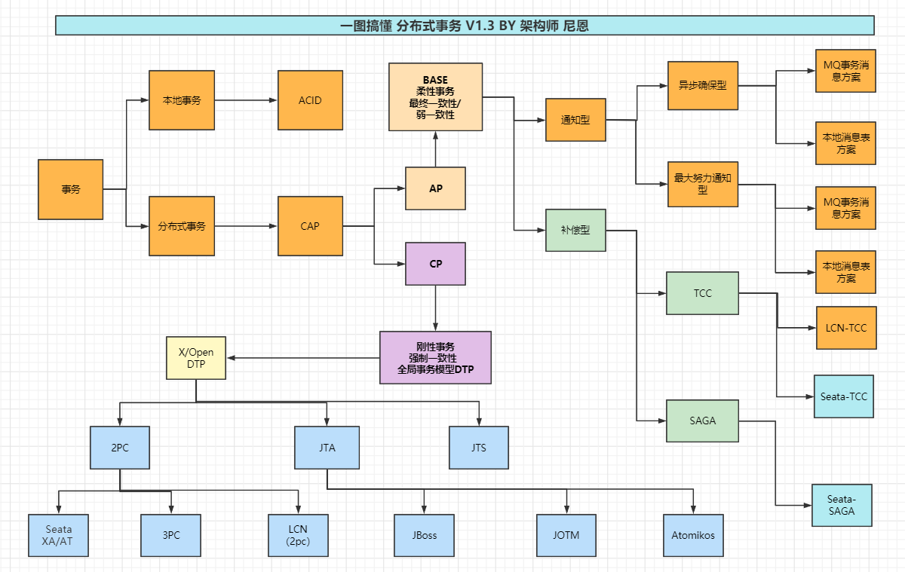

## TCC 事务模型

### 什么是TCC 事务模型

TCC（Try-Confirm-Cancel）的概念来源于 Pat Helland 发表的一篇名为"Life beyond Distributed Transactions:an Apostate's Opinion"的论文。

**TCC 分布式事务模型包括三部分：**

1.**主业务服务**：主业务服务为整个业务活动的发起方，服务的编排者，负责发起并完成整个业务活动。

2.**从业务服务**：从业务服务是整个业务活动的参与方，负责提供 TCC 业务操作，实现初步操作(Try)、确认操作(Confirm)、取消操作(Cancel)三个接口，供主业务服务调用。

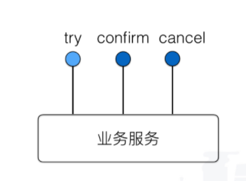

3.**业务活动管理器**：业务活动管理器管理控制整个业务活动，包括记录维护 TCC 全局事务的事务状态和每个从业务服务的子事务状态，并在业务活动提交时调用所有从业务服务的 Confirm 操作，在业务活动取消时调用所有从业务服务的 Cancel 操作。

TCC 提出了一种新的事务模型，基于业务层面的事务定义，锁粒度完全由业务自己控制，目的是解决复杂业务中，跨表跨库等大颗粒度资源锁定的问题。

TCC 把事务运行过程分成 Try、Confirm / Cancel 两个阶段，每个阶段的逻辑由业务代码控制，避免了长事务，可以获取更高的性能。

### TCC的工作流程

TCC(Try-Confirm-Cancel)分布式事务模型相对于 XA 等传统模型，其特征在于**它不依赖资源管理器(RM)对分布式事务的支持，而是通过对业务逻辑的分解来实现分布式事务**。

**TCC 模型认为对于业务系统中一个特定的业务逻辑，其对外提供服务时，必须接受一些不确定性，即对业务逻辑初步操作的调用仅是一个临时性操作，调用它的主业务服务保留了后续的取消权。如果主业务服务认为全局事务应该回滚，它会要求取消之前的临时性操作，这就对应从业务服务的取消操作。而当主业务服务认为全局事务应该提交时，它会放弃之前临时性操作的取消权，这对应从业务服务的确认操作。每一个初步操作，最终都会被确认或取消。**

因此，针对一个具体的业务服务，TCC 分布式事务模型需要业务系统提供三段业务逻辑：初步操作 Try：完成所有业务检查，预留必须的业务资源。

确认操作 Confirm：真正执行的业务逻辑，不作任何业务检查，只使用 Try 阶段预留的业务资源。因此，只要 Try 操作成功，Confirm 必须能成功。另外，Confirm 操作需满足幂等性，保证一笔分布式事务有且只能成功一次。

取消操作 Cancel：释放 Try 阶段预留的业务资源。同样的，Cancel 操作也需要满足幂等性。

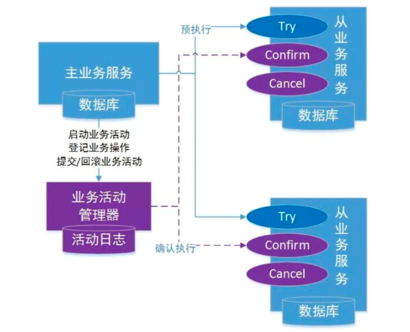

**TCC 分布式事务模型包括三部分：**

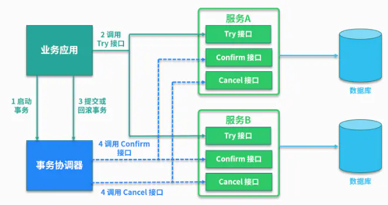

**Try 阶段**： 调用 Try 接口，尝试执行业务，完成所有业务检查，预留业务资源。

**Confirm 或 Cancel 阶段**： 两者是互斥的，只能进入其中一个，并且都满足幂等性，允许失败重试。

**Confirm 操作**： 对业务系统做确认提交，确认执行业务操作，不做其他业务检查，只使用 Try 阶段预留的业务资源。**Cancel 操作**： 在业务执行错误，需要回滚的状态下执行业务取消，释放预留资源。

*Try 阶段失败可以 Cancel，如果 Confirm 和 Cancel 阶段失败了怎么办？*

TCC 中会添加事务日志，如果 Confirm 或者 Cancel 阶段出错，则会进行重试，所以这两个阶段需要支持幂等；如果重试失败，则需要人工介入进行恢复和处理等。

### TCC事务案例

然而基于补偿的事务形态也并非能实现所有的需求，如以下场景：某笔订单完成时，同时扣掉用户的现金，但交易未完成，也未被取消时，不能让客户看到钱变少了。

这时我们可以引入TCC，其流程如下：

- 订单服务创建订单
- 订单服务发送远程调用到现金服务，冻结客户的现金
- 提交订单服务数据
- 订单服务发送远程调用到现金服务，扣除客户冻结的现金

以上是正常完成的流程，若为异常流程，则需要发送远程调用请求到现金服务，撤销冻结的金额。

以上流程比基于补偿实现的事务的流程要复杂，同时开发的工作量也更多：

- 订单服务编写创建订单的逻辑
- 现金服务编写冻结现金的逻辑
- 现金服务编写扣除现金的逻辑
- 现金服务编写解冻现金的逻辑

TCC实际上是最为复杂的一种情况，其能处理所有的业务场景，但无论出于性能上的考虑，还是开发复杂度上的考虑，都应该尽量避免该类事务。

### TCC事务模型的要求：

1. 可查询操作：服务操作具有全局唯一的标识，操作唯一的确定的时间。
2. 幂等操作：重复调用多次产生的业务结果与调用一次产生的结果相同。一是通过业务操作实现幂等性，二是系统缓存所有请求与处理的结果，最后是检测到重复请求之后，自动返回之前的处理结果。
3. TCC操作：Try阶段，尝试执行业务，完成所有业务的检查，实现一致性；预留必须的业务资源，实现准隔离性。Confirm阶段：真正的去执行业务，不做任何检查，仅适用Try阶段预留的业务资源，Confirm操作还要满足幂等性。Cancel阶段：取消执行业务，释放Try阶段预留的业务资源，Cancel操作要满足幂等性。TCC与2PC(两阶段提交)协议的区别：TCC位于业务服务层而不是资源层，TCC没有单独准备阶段，Try操作兼备资源操作与准备的能力，TCC中Try操作可以灵活的选择业务资源，锁定粒度。TCC的开发成本比2PC高。实际上TCC也属于两阶段操作，但是TCC不等同于2PC操作。
4. 可补偿操作：Do阶段：真正的执行业务处理，业务处理结果外部可见。Compensate阶段：抵消或者部分撤销正向业务操作的业务结果，补偿操作满足幂等性。约束：补偿操作在业务上可行，由于业务执行结果未隔离或者补偿不完整带来的风险与成本可控。实际上，TCC的Confirm和Cancel操作可以看做是补偿操作。

### TCC事务模型 VS DTP事务模型

比较一下TCC事务模型和DTP事务模型，如下所示：

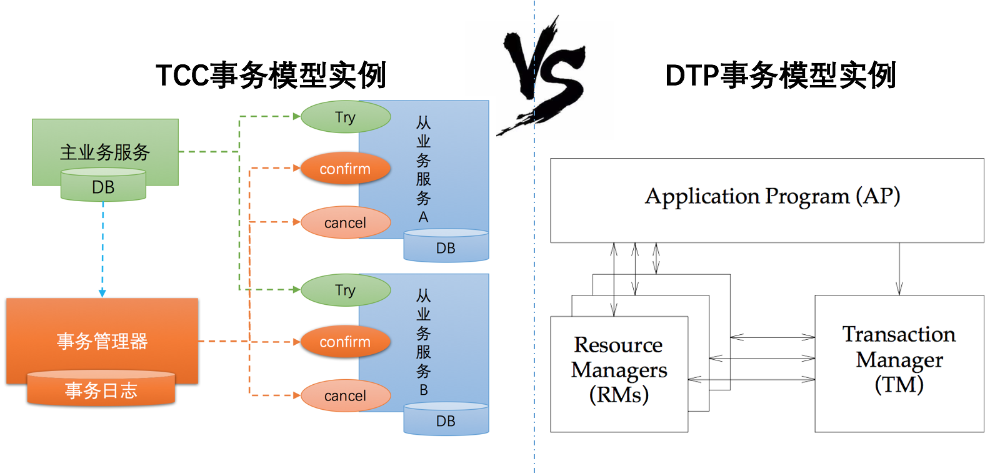

这两张图看起来差别较大，实际上很多地方是类似的!

1、TCC模型中的 主业务服务 相当于 DTP模型中的AP，TCC模型中的从业务服务 相当于 DTP模型中的RM

- 在DTP模型中，应用AP操作多个资源管理器RM上的资源；而在TCC模型中，是主业务服务操作多个从业务服务上的资源。例如航班预定案例中，美团App就是主业务服务，而川航和东航就是从业务服务，主业务服务需要使用从业务服务上的机票资源。不同的是DTP模型中的资源提供者是类似于Mysql这种关系型数据库，而TCC模型中资源的提供者是其他业务服务。
2、TCC模型中，从业务服务提供的try、confirm、cancel接口 相当于 DTP模型中RM提供的prepare、commit、rollback接口
- XA协议中规定了DTP模型中定RM需要提供prepare、commit、rollback接口给TM调用，以实现两阶段提交。
- 而在TCC模型中，从业务服务相当于RM，提供了类似的try、confirm、cancel接口。
3、事务管理器
- DTP模型和TCC模型中都有一个事务管理器。不同的是：
- 在DTP模型中，阶段1的(prepare)和阶段2的(commit、rollback)，都是由TM进行调用的。
- 在TCC模型中，阶段1的try接口是主业务服务调用(绿色箭头)，阶段2的(confirm、cancel接口)是事务管理器TM调用(红色箭头)。这就是 TCC 分布式事务模型的二阶段异步化功能，从业务服务的第一阶段执行成功，主业务服务就可以提交完成，然后再由事务管理器框架异步的执行各从业务服务的第二阶段。这里牺牲了一定的隔离性和一致性的，但是提高了长事务的可用性。

### TCC与2PC对比

### **TCC其实本质和2PC是差不多的：**

- T就是Try，两个C分别是Confirm和Cancel。
- Try就是尝试，请求链路中每个参与者依次执行Try逻辑，如果都成功，就再执行Confirm逻辑，如果有失败，就执行Cancel逻辑。

TCC与XA两阶段提交有着异曲同工之妙，下图列出了二者之间的对比

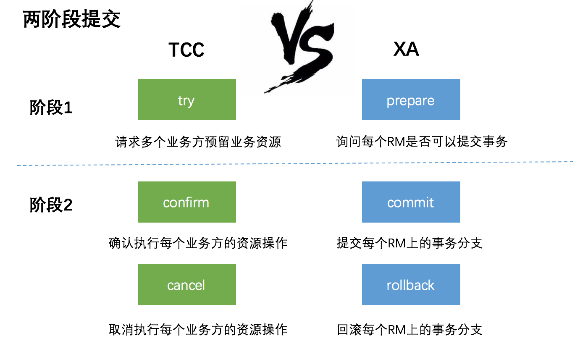

5. 在阶段1：
- 在XA中，各个RM准备提交各自的事务分支，事实上就是准备提交资源的更新操作(insert、delete、update等)；
- 而在TCC中，是主业务活动请求(try)各个从业务服务预留资源。
    1. 在阶段2：
- XA根据第一阶段每个RM是否都prepare成功，判断是要提交还是回滚。如果都prepare成功，那么就commit每个事务分支，反之则rollback每个事务分支。
- TCC中，如果在第一阶段所有业务资源都预留成功，那么confirm各个从业务服务，否则取消(cancel)所有从业务服务的资源预留请求。

### **TCC和2PC不同的是：**

- XA是资源层面的分布式事务，强一致性，在两阶段提交的整个过程中，一直会持有资源的锁。基于数据库锁实现，需要数据库支持XA协议，由于在执行事务的全程都需要对相关数据加锁，一般高并发性能会比较差
- TCC是业务层面的分布式事务，最终一致性，不会一直持有资源的锁，性能较好。但是对微服务的侵入性强，微服务的每个事务都必须实现try、confirm、cancel等3个方法，开发成本高，今后维护改造的成本也高为了达到事务的一致性要求，try、confirm、cancel接口必须实现幂等性操作由于事务管理器要记录事务日志，必定会损耗一定的性能，并使得整个TCC事务时间拉长

TCC它会弱化每个步骤中对于资源的锁定，以达到一个能承受高并发的目的（基于最终一致性）。

**具体的说明如下：**

XA是资源层面的分布式事务，强一致性，在两阶段提交的整个过程中，一直会持有资源的锁。

XA事务中的两阶段提交内部过程是对开发者屏蔽的，开发者从代码层面是感知不到这个过程的。而事务管理器在两阶段提交过程中，从prepare到commit/rollback过程中，资源实际上一直都是被加锁的。如果有其他人需要更新这两条记录，那么就必须等待锁释放。

TCC是业务层面的分布式事务，最终一致性，不会一直持有资源的锁。

TCC中的两阶段提交并没有对开发者完全屏蔽，也就是说从代码层面，开发者是可以感受到两阶段提交的存在。try、confirm/cancel在执行过程中，一般都会开启各自的本地事务，来保证方法内部业务逻辑的ACID特性。其中：

1、try过程的本地事务，是保证资源预留的业务逻辑的正确性。

2、confirm/cancel执行的本地事务逻辑确认/取消预留资源，以保证最终一致性，也就是所谓的补偿型事务(Compensation-Based Transactions)。由于是多个独立的本地事务，因此不会对资源一直加锁。

另外，这里提到confirm/cancel执行的本地事务是 **补偿性事务：**

补偿是一个独立的支持ACID特性的本地事务，用于在逻辑上取消服务提供者上一个ACID事务造成的影响，对于一个长事务(long-running transaction)，与其实现一个巨大的分布式ACID事务，不如使用基于补偿性的方案，把每一次服务调用当做一个较短的本地ACID事务来处理，执行完就立即提交

### TCC 的使用场景

TCC是可以解决部分场景下的分布式事务的，但是，它的一个问题在于，需要每个参与者都分别实现Try，Confirm和Cancel接口及逻辑，这对于业务的侵入性是巨大的。

TCC 方案严重依赖回滚和补偿代码，最终的结果是：回滚代码逻辑复杂，业务代码很难维护。所以，TCC 方案的使用场景较少，但是也有使用的场景。

比如说跟钱打交道的，支付、交易相关的场景，大家会用 TCC方案，严格保**证分布式事务要么全部成功，要么全部自动回滚**，严格保证资金的正确性，保证在资金上不会出现问题。

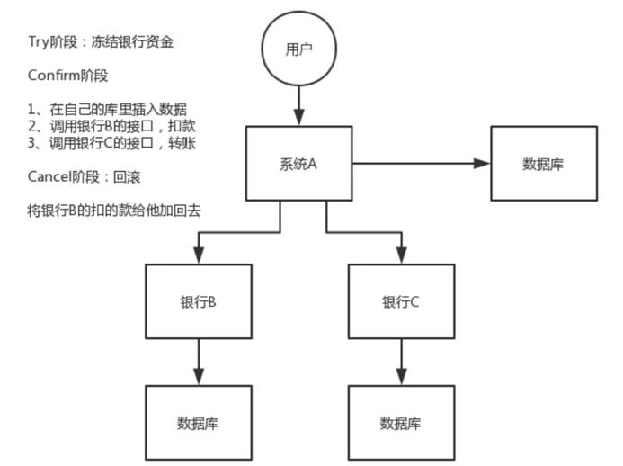

## SAGA长事务模型

SAGA可以看做一个异步的、利用队列实现的补偿事务。

### Saga相关概念

1987年普林斯顿大学的Hector Garcia-Molina和Kenneth Salem发表了一篇Paper Sagas，讲述的是如何处理long lived transaction（长活事务）。Saga是一个长活事务可被分解成可以交错运行的子事务集合。其中每个子事务都是一个保持数据库一致性的真实事务。论文地址：[sagas](/assets/files/learning/distributed/distributed-transaction-solutions/dda6ab86019742511d9b047e99da4e62.pdf)

**Saga**模型是把一个分布式事务拆分为多个本地事务，每个本地事务都有相应的执行模块和补偿模块（对应TCC中的Confirm和Cancel），当Saga事务中任意一个本地事务出错时，可以通过调用相关的补偿方法恢复之前的事务，达到事务最终一致性。

这样的SAGA事务模型，是牺牲了一定的隔离性和一致性的，但是提高了long-running事务的可用性。

### **Saga 模型由三部分组成**：

- **LLT**
（Long Live Transaction）：由一个个本地事务组成的事务链**。**
- **本地事务**
：事务链由一个个子事务（本地事务）组成，LLT = T1+T2+T3+…+Ti。
- **补偿**
：每个本地事务 Ti 有对应的补偿 Ci。

### **Saga的执行顺序有两种：**

- T1, T2, T3, …, Tn
- T1, T2, …, Tj, Cj,…, C2, C1，其中0 < j < n

### **Saga 两种恢复策略**：

- **向后恢复**
（Backward Recovery）：撤销掉之前所有成功子事务。如果任意本地子事务失败，则补偿已完成的事务。如异常情况的执行顺序T1,T2,T3,..Ti,Ci,…C3,C2,C1。

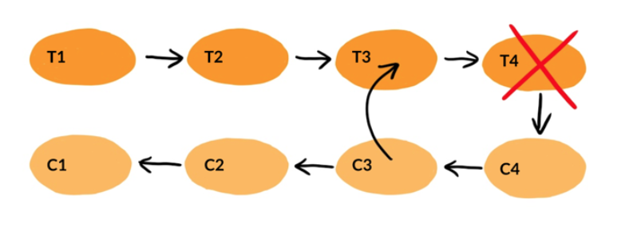

- **向前恢复**
（Forward Recovery）：即重试失败的事务，适用于必须要成功的场景，该情况下不需要Ci。执行顺序：T1,T2,…,Tj（失败）,Tj（重试）,…,Ti。

显然，向前恢复没有必要提供补偿事务，如果你的业务中，子事务（最终）总会成功，或补偿事务难以定义或不可能，向前恢复更符合你的需求。

理论上补偿事务永不失败，然而，在分布式世界中，服务器可能会宕机，网络可能会失败，甚至数据中心也可能会停电。在这种情况下我们能做些什么？ 最后的手段是提供回退措施，比如人工干预。

### Saga的使用条件

Saga看起来很有希望满足我们的需求。所有长活事务都可以这样做吗？这里有一些限制：

6. Saga只允许**两个层次的嵌套**
，顶级的Saga和简单子事务
7. 在外层，全原子性不能得到满足。也就是说，sagas可能会看到其他sagas的部分结果
8. 每个子事务应该是独立的原子行为
9. 在我们的业务场景下，各个业务环境（如：航班预订、租车、酒店预订和付款）是自然独立的行为，而且每个事务都可以用对应服务的数据库保证原子操作。

补偿也有需考虑的事项：

- 补偿事务从语义角度撤消了事务Ti的行为，但未必能将数据库返回到执行Ti时的状态。（例如，如果事务触发导弹发射， 则可能无法撤消此操作）

但这对我们的业务来说不是问题。其实难以撤消的行为也有可能被补偿。例如，发送电邮的事务可以通过发送解释问题的另一封电邮来补偿。

### **对于ACID的保证：**

Saga对于ACID的保证和TCC一样：

- 原子性（Atomicity）：正常情况下保证。
- 一致性（Consistency），在某个时间点，会出现A库和B库的数据违反一致性要求的情况，但是最终是一致的。
- 隔离性（Isolation），在某个时间点，A事务能够读到B事务部分提交的结果。
- 持久性（Durability），和本地事务一样，只要commit则数据被持久。

Saga不提供ACID保证，因为原子性和隔离性不能得到满足。原论文描述如下：

```plain text
full atomicity is not provided. That is, sagas may view the partial results of other sagas
```

通过saga log，saga可以保证一致性和持久性。

### SAGA模型的解决方案

SAGA模型的核心思想是，通过某种方案，将分布式事务转化为本地事务，从而降低问题的复杂性。

比如以DB和MQ的场景为例，业务逻辑如下：

10. 向DB中插入一条数据。
11. 向MQ中发送一条消息。

由于上述逻辑中，对应了两种存储端，即DB和MQ，所以，简单的通过本地事务是无法解决的。那么，依照SAGA模型，可以有两种解决方案。

### 方案一：半消息模式。

RocketMQ新版本中，就支持了这种模式。

首先，我们理解什么是半消息。简单来说，就是在消息上加了一个状态。当发送者第一次将消息放入MQ后，该消息为待确认状态。该状态下，该消息是不能被消费者消费的。发送者必须二次和MQ进行交互，将消息从待确认状态变更为确认状态后，消息才能被消费者消费。待确认状态的消息，就称之为半消息。

半消息的完整事务逻辑如下：

12. 向MQ发送半消息。
13. 向DB插入数据。
14. 向MQ发送确认消息。

我们发现，通过半消息的形式，将DB的操作夹在了两个MQ操作的中间。假设，第2步失败了，那么，MQ中的消息就会一直是半消息状态，也就不会被消费者消费。

那么，半消息就一直存在于MQ中吗？或者是说如果第3步失败了呢？

为了解决上面的问题，MQ引入了一个扫描的机制。即MQ会每隔一段时间，对所有的半消息进行扫描，并就扫描到的存在时间过长的半消息，向发送者进行询问，询问如果得到确认回复，则将消息改为确认状态，如得到失败回复，则将消息删除。

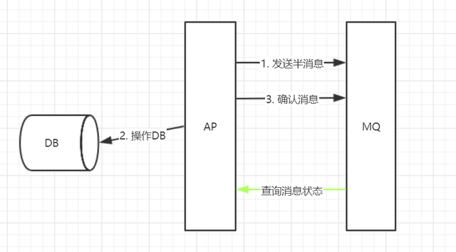

半消息

如上，半消息机制的一个问题是：要求业务方提供查询消息状态接口，对业务方依然有较大的侵入性。

### 方案二：本地消息表

在DB中，新增一个消息表，用于存放消息。如下：

15. 在DB业务表中插入数据。
16. 在DB消息表中插入数据。
17. 异步将消息表中的消息发送到MQ，收到ack后，删除消息表中的消息。

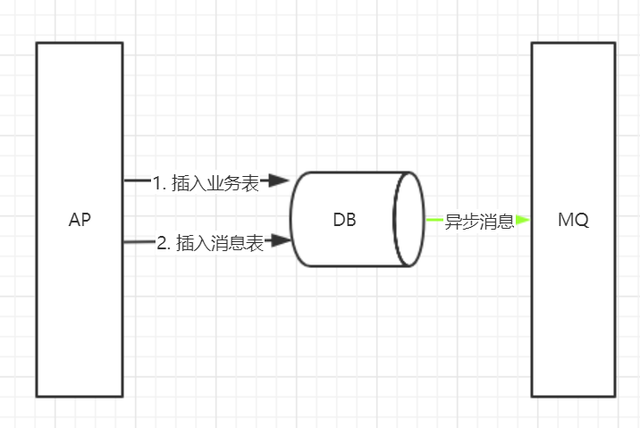

本地消息表

如上，通过上述逻辑，将一个分布式的事务，拆分成两大步。第1和第2，构成了一个本地的事务，从而解决了分布式事务的问题。

这种解决方案，不需要业务端提供消息查询接口，只需要稍微修改业务逻辑，侵入性是最小的。

### SAGA的案例

SAGA适用于无需马上返回业务发起方最终状态的场景，例如：你的请求已提交，请稍后查询或留意通知 之类。

将上述补偿事务的场景用SAGA改写，其流程如下：

- 订单服务创建最终状态未知的订单记录，并提交事务
- 现金服务扣除所需的金额，并提交事务
- 订单服务更新订单状态为成功，并提交事务

以上为成功的流程，若现金服务扣除金额失败，那么，最后一步订单服务将会更新订单状态为失败。

其业务编码工作量比补偿事务多一点，包括以下内容：

- 订单服务创建初始订单的逻辑
- 订单服务确认订单成功的逻辑
- 订单服务确认订单失败的逻辑
- 现金服务扣除现金的逻辑
- 现金服务补偿返回现金的逻辑

但其相对于补偿事务形态有性能上的优势，所有的本地子事务执行过程中，都无需等待其调用的子事务执行，减少了加锁的时间，这在事务流程较多较长的业务中性能优势更为明显。同时，其利用队列进行进行通讯，具有削峰填谷的作用。

因此该形式适用于不需要同步返回发起方执行最终结果、可以进行补偿、对性能要求较高、不介意额外编码的业务场景。

但当然SAGA也可以进行稍微改造，变成与TCC类似、可以进行资源预留的形态

### **Saga和TCC对比**

Saga相比TCC的缺点是缺少预留动作，导致补偿动作的实现比较麻烦：Ti就是commit，比如一个业务是发送邮件，在TCC模式下，先保存草稿（Try）再发送（Confirm），撤销的话直接删除草稿（Cancel）就行了。而Saga则就直接发送邮件了（Ti），如果要撤销则得再发送一份邮件说明撤销（Ci），实现起来有一些麻烦。

如果把上面的发邮件的例子换成：A服务在完成Ti后立即发送Event到ESB（企业服务总线，可以认为是一个消息中间件），下游服务监听到这个Event做自己的一些工作然后再发送Event到ESB，如果A服务执行补偿动作Ci，那么整个补偿动作的层级就很深。

不过没有预留动作也可以认为是优点：

- 有些业务很简单，套用TCC需要修改原来的业务逻辑，而Saga只需要添加一个补偿动作就行了。
- TCC最少通信次数为2n，而Saga为n（n=sub-transaction的数量）。
- 有些第三方服务没有Try接口，TCC模式实现起来就比较tricky了，而Saga则很简单。
- 没有预留动作就意味着不必担心资源释放的问题，异常处理起来也更简单。

**Saga对比TCC**

Saga和TCC都是补偿型事务，他们的区别为：

劣势：

- 无法保证隔离性；

优势：

- 一阶段提交本地事务，无锁，高性能；
- 事件驱动模式，参与者可异步执行，高吞吐；
- Saga 对业务侵入较小，只需要提供一个逆向操作的Cancel即可；而TCC需要对业务进行全局性的流程改造；

## 总体的方案对比：

| 属性 | 2PC | TCC | Saga | 异步确保型事务 | 尽最大努力通知 |
| --- | --- | --- | --- | --- | --- |
| 事务一致性 | 强 | 弱 | 弱 | 弱 | 弱 |
| 复杂性 | 中 | 高 | 中 | 低 | 低 |
| 业务侵入性 | 小 | 大 | 小 | 中 | 中 |
| 使用局限性 | 大 | 大 | 中 | 小 | 中 |
| 性能 | 低 | 中 | 高 | 高 | 高 |
| 维护成本 | 低 | 高 | 中 | 低 | 中 |

# 3PC

## 3PC

- <u>3PC</u>
    - <u>详解：三个阶段</u>
        - <u>阶段一：CanCommit</u>
        - <u>阶段二：PreCommit</u>
        - <u>阶段三：doCommit</u>
    - <u>2PC和3PC的区别：</u>
        - <u>3PC主要解决的单点故障问题：</u>
        - <u>3PC主要没有解决的数据一致性问题：</u>
        - <u>"3PC相对于2PC而言到底优化了什么地方呢?"</u>

针对2PC的缺点，研究者提出了3PC，即Three-Phase Commit。

作为2PC的改进版，3PC将原有的两阶段过程，重新划分为CanCommit、PreCommit和do Commit三个阶段。

3PC 协议将 2PC 协议的准备阶段一分为二，从而形成了三个阶段：

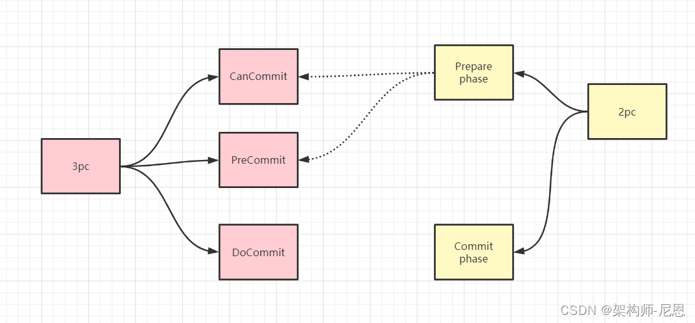

### 详解：三个阶段

所谓的三个阶段分别是：**询问，然后再锁资源，最后真正提交**。

- 第一阶段：CanCommit
- 第二阶段：PreCommit
- 第三阶段：Do Commit

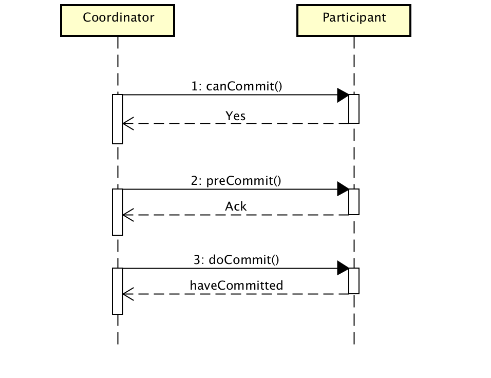

### 阶段一：CanCommit

1. 事务询问。协调者向所有参与者发送包含事务内容的canCommit的请求，询问是否可以执行事务提交，并等待应答；
2. 各参与者反馈事务询问。正常情况下，如果参与者认为可以顺利执行事务，则返回Yes，否则返回No。

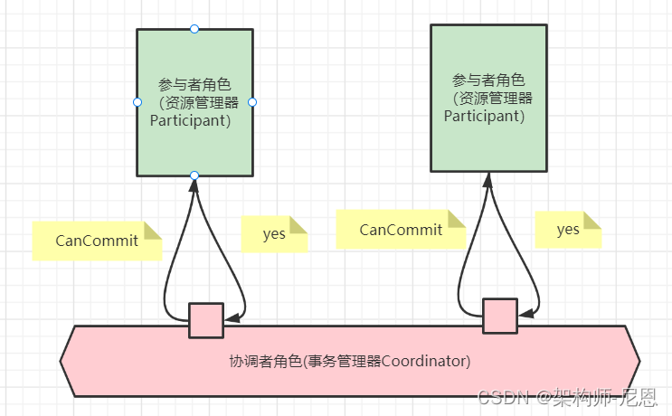

### 阶段二：PreCommit

在本阶段，协调者会根据上一阶段的反馈情况来决定是否可以执行事务的PreCommit操作。有以下两种可能：

- 执行事务预提交
- 中断事务

**执行事务预提交**

3. 发送预提交请求。协调者向所有节点发出PreCommit请求，并进入prepared阶段；
4. 事务预提交。参与者收到PreCommit请求后，会**开始事务操作**
，并将Undo和Redo日志写入本机事务日志；
5. 各参与者成功执行事务操作，同时将反馈以Ack响应形式发送给协调者，同事等待最终的Commit或Abort指令。

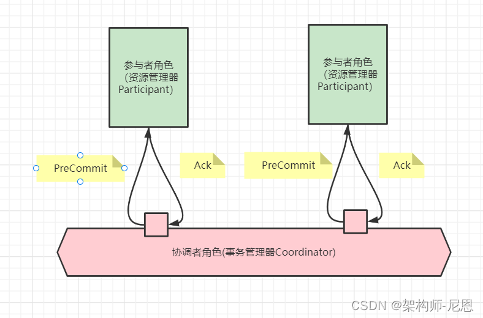

**中断事务**

如果任意一个参与者向协调者发送No响应，或者等待超时，协调者在没有得到所有参与者响应时，即可以中断事务。

中断事务的操作为：

6. 发送中断请求。 协调者向所有参与者发送Abort请求；
7. 中断事务。无论是participant 收到协调者的Abort请求，还是participant 等待协调者请求过程中出现超时，参与者都会中断事务；

coordinator发送Abort的两个场景

场景1： 任意一个参与者向协调者发送No响应

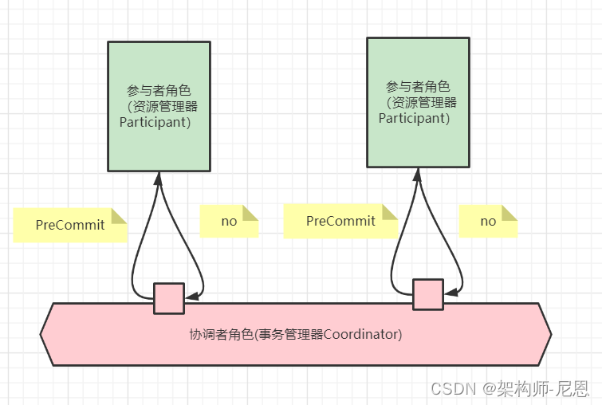

场景2： 协调者在没有得到所有参与者响应时

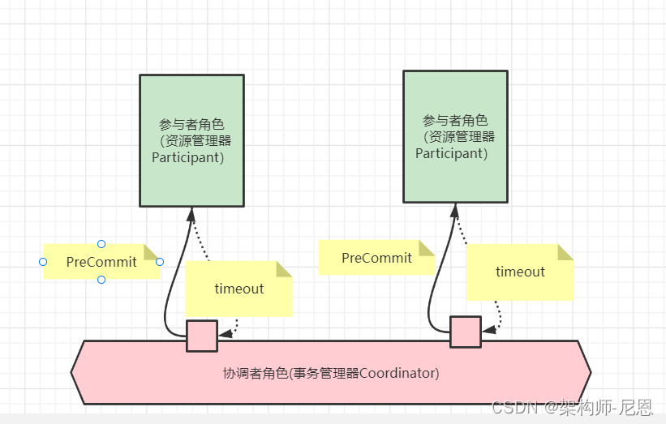

中断事务

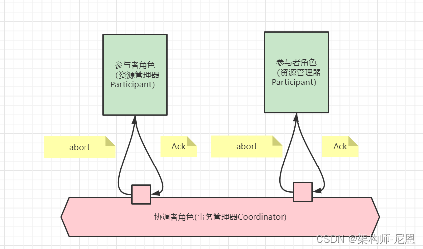

### 阶段三：doCommit

在这个阶段，会真正的进行事务提交，同样存在两种可能。

- 执行提交
- 回滚事务

**执行提交**

8. coordinator发送提交请求。假如coordinator协调者收到了所有参与者的Ack响应，那么将从预提交转换到提交状态，并向所有参与者，发送doCommit请求；
9. 事务提交。参与者收到doCommit请求后，会正式执行事务提交操作，并在完成提交操作后释放占用资源；
10. 反馈事务提交结果。参与者将在完成事务提交后，向协调者发送Ack消息；
11. 完成事务。协调者接收到所有参与者的Ack消息后，完成事务。

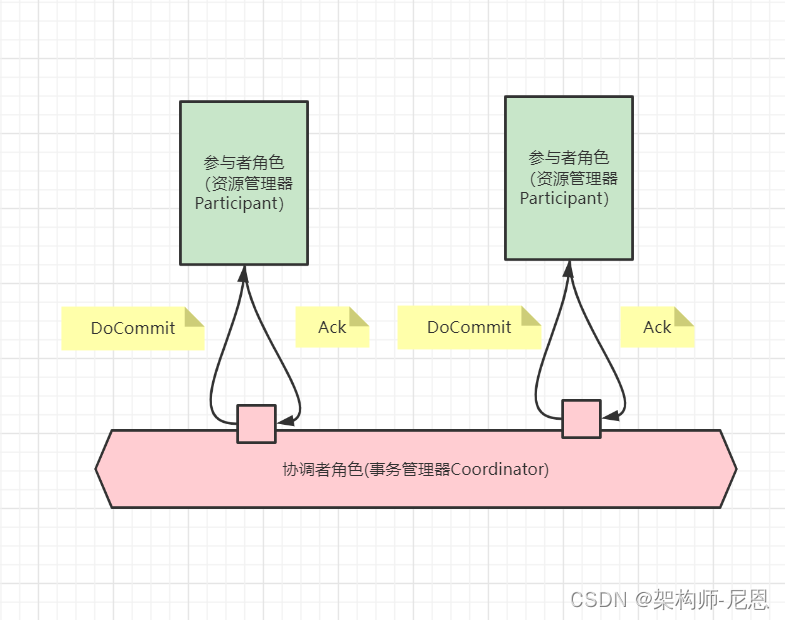

**回滚事务**

在该阶段，假设正常状态的协调者接收到任一个参与者发送的No响应，或在超时时间内，仍旧没收到反馈消息，就会回滚事务：

12. 发送中断请求。协调者向所有的参与者发送rollback请求；
13. 事务回滚。参与者收到rollback请求后，会利用阶段二中的Undo消息执行事务回滚，并在完成回滚后释放占用资源；
14. 反馈事务回滚结果。参与者在完成回滚后向协调者发送Ack消息；
15. 回滚事务。协调者接收到所有参与者反馈的Ack消息后，完成事务回滚。

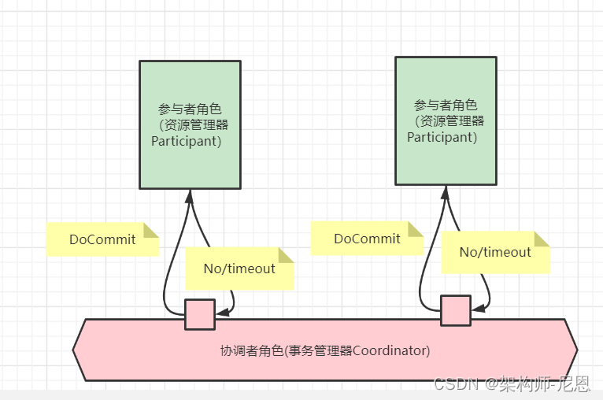

回滚事务

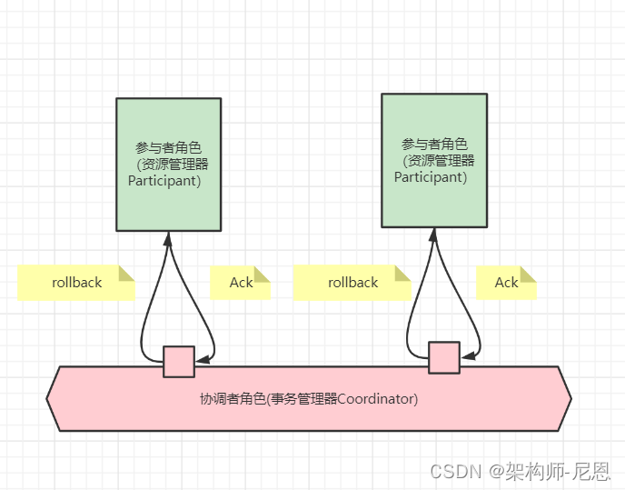

### 2PC和3PC的区别：

三阶段提交协议在协调者和参与者中都引入 **超时机制**，并且把两阶段提交协议的第一个阶段拆分成了两步：询问，然后再锁资源，最后真正提交。

三阶段提交的三个阶段分别为：can_commit，pre_commit，do_commit。

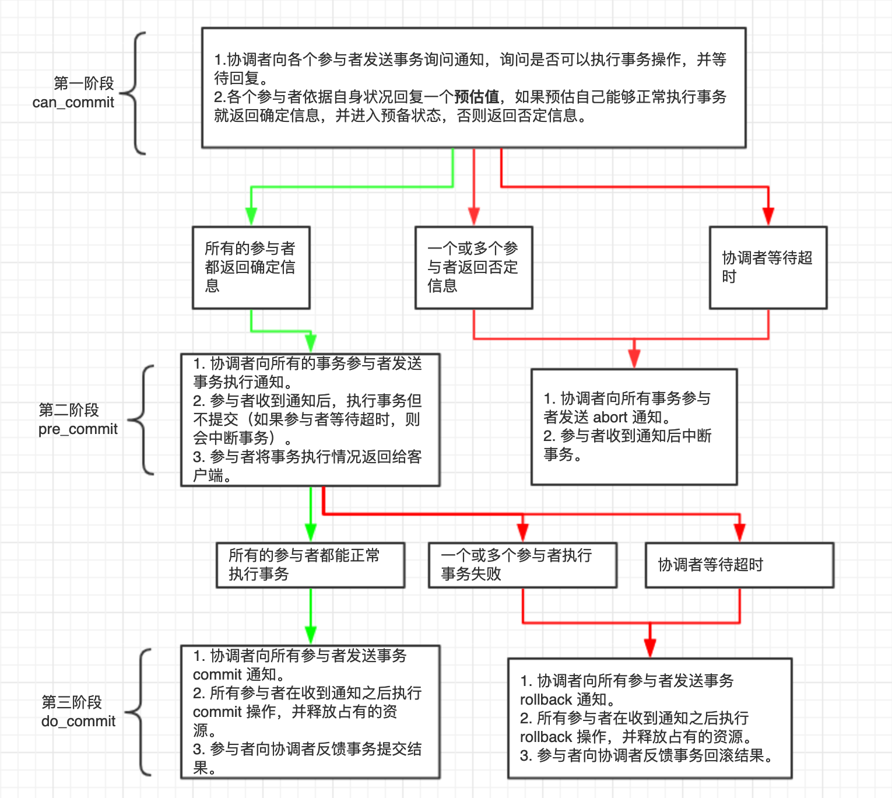

在doCommit阶段，如果参与者无法及时接收到来自协调者的doCommit或者rollback请求时，会在等待超时之后，继续进行事务的提交。

其实这个应该是基于概率来决定的，

当进入第三阶段时，说明参与者在第二阶段已经收到了PreCommit请求，什么场景会产生PreCommit请求呢？

协调者产生PreCommit请求的前提条件比较严格：是在第二阶段开始之前，收到所有参与者的CanCommit响应都是Yes。

所以，一旦参与者收到了PreCommit，意味他知道大家其实都同意修改了

一句话概括就是：

**当进入第三阶段时，由于网络超时/网络分区等原因，虽然参与者没有收到commit或者abort响应，但是他有理由相信：成功提交的几率很大**。

### 3PC主要解决的单点故障问题：

相对于2PC，3PC主要解决的单点故障问题，并减少阻塞，

**因为一旦参与者无法及时收到来自协调者的信息之后，他会默认执行commit。而不会一直持有事务资源并处于阻塞状态**。

由于在docommit阶段，participant参与者如果超时，能自己决定提交本地事务，所以，3pc没有2pc那么**保守**或者说**悲观**，或者说3pc更加的**乐观**。

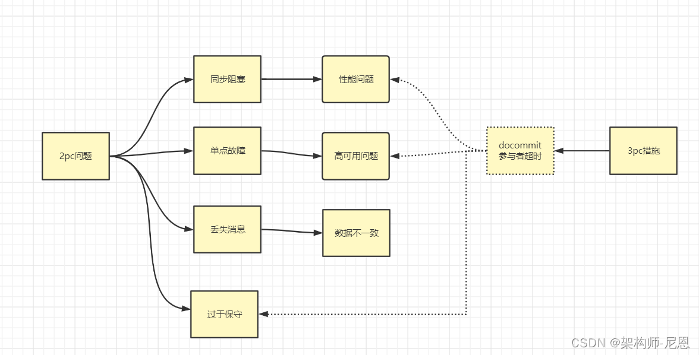

### 3PC主要没有解决的数据一致性问题：

但是这种机制，还是有数据一致性问题，或者说，没有彻底解决数据一致性问题。

'因为，由于网络原因，协调者发送的rollback命令没有及时被参与者接收到，那么参与者在等待超时之后执行了commit操作。

这样就和其他接到rollback命令并执行回滚的参与者之间存在数据不一致的情况。

### "3PC相对于2PC而言到底优化了什么地方呢?"

相比较2PC而言，3PC对于协调者（Coordinator）和参与者（Participant）都设置了超时时间，而2PC只有协调者才拥有超时机制。

这解决了一个什么问题呢？

这个优化点，主要是避免了Participant 参与者在长时间无法与协调者节点通讯（协调者挂掉了）的情况下，无法释放资源的问题，

因为参与者自身拥有超时机制会在超时后，自动进行本地commit从而进行释放资源。

而这种机制也侧面降低了整个事务的阻塞时间和范围。

另外，通过CanCommit、PreCommit、DoCommit三个阶段的设计，相较于2PC而言，多设置了一个缓冲阶段保证了在最后提交阶段之前各参与节点的状态是一致的。

以上就是3PC相对于2PC的一个提高（相对缓解了2PC中的前两个问题），但是3PC依然没有完全解决数据不一致的问题。

假如在 DoCommit 过程，参与者A无法接收协调者的通信，那么参与者A会自动提交，但是提交失败了，其他参与者成功了，此时数据就会不一致。

%23%23%203PC%0A%0A%5Btoc%5D%0A%0A%E9%92%88%E5%AF%B92PC%E7%9A%84%E7%BC%BA%E7%82%B9%EF%BC%8C%E7%A0%94%E7%A9%B6%E8%80%85%E6%8F%90%E5%87%BA%E4%BA%863PC%EF%BC%8C%E5%8D%B3Three-Phase%20Commit%E3%80%82%0A%0A%E4%BD%9C%E4%B8%BA2PC%E7%9A%84%E6%94%B9%E8%BF%9B%E7%89%88%EF%BC%8C3PC%E5%B0%86%E5%8E%9F%E6%9C%89%E7%9A%84%E4%B8%A4%E9%98%B6%E6%AE%B5%E8%BF%87%E7%A8%8B%EF%BC%8C%E9%87%8D%E6%96%B0%E5%88%92%E5%88%86%E4%B8%BACanCommit%E3%80%81PreCommit%E5%92%8Cdo%20Commit%E4%B8%89%E4%B8%AA%E9%98%B6%E6%AE%B5%E3%80%82%0A%0A3PC%20%E5%8D%8F%E8%AE%AE%E5%B0%86%202PC%20%E5%8D%8F%E8%AE%AE%E7%9A%84%E5%87%86%E5%A4%87%E9%98%B6%E6%AE%B5%E4%B8%80%E5%88%86%E4%B8%BA%E4%BA%8C%EF%BC%8C%E4%BB%8E%E8%80%8C%E5%BD%A2%E6%88%90%E4%BA%86%E4%B8%89%E4%B8%AA%E9%98%B6%E6%AE%B5%EF%BC%9A%0A%0A!%5B741e2d0c8ab90da3227a41cfc06cddf5.png%5D(en-resource%3A%2F%2Fdatabase%2F6941%3A0)%0A%0A%0A%23%23%23%20%E8%AF%A6%E8%A7%A3%EF%BC%9A%E4%B8%89%E4%B8%AA%E9%98%B6%E6%AE%B5%0A%0A%E6%89%80%E8%B0%93%E7%9A%84%E4%B8%89%E4%B8%AA%E9%98%B6%E6%AE%B5%E5%88%86%E5%88%AB%E6%98%AF%EF%BC%9A**%E8%AF%A2%E9%97%AE%EF%BC%8C%E7%84%B6%E5%90%8E%E5%86%8D%E9%94%81%E8%B5%84%E6%BA%90%EF%BC%8C%E6%9C%80%E5%90%8E%E7%9C%9F%E6%AD%A3%E6%8F%90%E4%BA%A4**%E3%80%82%0A%0A-%20%E7%AC%AC%E4%B8%80%E9%98%B6%E6%AE%B5%EF%BC%9ACanCommit%0A%20%20%20%20%0A-%20%E7%AC%AC%E4%BA%8C%E9%98%B6%E6%AE%B5%EF%BC%9APreCommit%0A%20%20%20%20%0A-%20%E7%AC%AC%E4%B8%89%E9%98%B6%E6%AE%B5%EF%BC%9ADo%20Commit%0A%20%20%20%20%0A%0A!%5B52f46731db0dc9bc68114c4ab67853af.png%5D(en-resource%3A%2F%2Fdatabase%2F6943%3A0)%0A%0A%0A%23%23%23%23%20%E9%98%B6%E6%AE%B5%E4%B8%80%EF%BC%9ACanCommit%0A%0A1.%20%E4%BA%8B%E5%8A%A1%E8%AF%A2%E9%97%AE%E3%80%82%E5%8D%8F%E8%B0%83%E8%80%85%E5%90%91%E6%89%80%E6%9C%89%E5%8F%82%E4%B8%8E%E8%80%85%E5%8F%91%E9%80%81%E5%8C%85%E5%90%AB%E4%BA%8B%E5%8A%A1%E5%86%85%E5%AE%B9%E7%9A%84canCommit%E7%9A%84%E8%AF%B7%E6%B1%82%EF%BC%8C%E8%AF%A2%E9%97%AE%E6%98%AF%E5%90%A6%E5%8F%AF%E4%BB%A5%E6%89%A7%E8%A1%8C%E4%BA%8B%E5%8A%A1%E6%8F%90%E4%BA%A4%EF%BC%8C%E5%B9%B6%E7%AD%89%E5%BE%85%E5%BA%94%E7%AD%94%EF%BC%9B%0A2.%20%E5%90%84%E5%8F%82%E4%B8%8E%E8%80%85%E5%8F%8D%E9%A6%88%E4%BA%8B%E5%8A%A1%E8%AF%A2%E9%97%AE%E3%80%82%E6%AD%A3%E5%B8%B8%E6%83%85%E5%86%B5%E4%B8%8B%EF%BC%8C%E5%A6%82%E6%9E%9C%E5%8F%82%E4%B8%8E%E8%80%85%E8%AE%A4%E4%B8%BA%E5%8F%AF%E4%BB%A5%E9%A1%BA%E5%88%A9%E6%89%A7%E8%A1%8C%E4%BA%8B%E5%8A%A1%EF%BC%8C%E5%88%99%E8%BF%94%E5%9B%9EYes%EF%BC%8C%E5%90%A6%E5%88%99%E8%BF%94%E5%9B%9ENo%E3%80%82%0A%0A!%5B92704b10afd803193f50a8675e3fc2df.png%5D(en-resource%3A%2F%2Fdatabase%2F6945%3A0)%0A%0A%0A%23%23%23%23%20%E9%98%B6%E6%AE%B5%E4%BA%8C%EF%BC%9APreCommit%0A%0A%E5%9C%A8%E6%9C%AC%E9%98%B6%E6%AE%B5%EF%BC%8C%E5%8D%8F%E8%B0%83%E8%80%85%E4%BC%9A%E6%A0%B9%E6%8D%AE%E4%B8%8A%E4%B8%80%E9%98%B6%E6%AE%B5%E7%9A%84%E5%8F%8D%E9%A6%88%E6%83%85%E5%86%B5%E6%9D%A5%E5%86%B3%E5%AE%9A%E6%98%AF%E5%90%A6%E5%8F%AF%E4%BB%A5%E6%89%A7%E8%A1%8C%E4%BA%8B%E5%8A%A1%E7%9A%84PreCommit%E6%93%8D%E4%BD%9C%E3%80%82%E6%9C%89%E4%BB%A5%E4%B8%8B%E4%B8%A4%E7%A7%8D%E5%8F%AF%E8%83%BD%EF%BC%9A%0A%0A-%20%E6%89%A7%E8%A1%8C%E4%BA%8B%E5%8A%A1%E9%A2%84%E6%8F%90%E4%BA%A4%0A%20%20%20%20%0A-%20%E4%B8%AD%E6%96%AD%E4%BA%8B%E5%8A%A1%0A%20%20%20%20%0A%0A**%E6%89%A7%E8%A1%8C%E4%BA%8B%E5%8A%A1%E9%A2%84%E6%8F%90%E4%BA%A4**%0A%0A1.%20%E5%8F%91%E9%80%81%E9%A2%84%E6%8F%90%E4%BA%A4%E8%AF%B7%E6%B1%82%E3%80%82%E5%8D%8F%E8%B0%83%E8%80%85%E5%90%91%E6%89%80%E6%9C%89%E8%8A%82%E7%82%B9%E5%8F%91%E5%87%BAPreCommit%E8%AF%B7%E6%B1%82%EF%BC%8C%E5%B9%B6%E8%BF%9B%E5%85%A5prepared%E9%98%B6%E6%AE%B5%EF%BC%9B%0A2.%20%E4%BA%8B%E5%8A%A1%E9%A2%84%E6%8F%90%E4%BA%A4%E3%80%82%E5%8F%82%E4%B8%8E%E8%80%85%E6%94%B6%E5%88%B0PreCommit%E8%AF%B7%E6%B1%82%E5%90%8E%EF%BC%8C%E4%BC%9A**%E5%BC%80%E5%A7%8B%E4%BA%8B%E5%8A%A1%E6%93%8D%E4%BD%9C**%EF%BC%8C%E5%B9%B6%E5%B0%86Undo%E5%92%8CRedo%E6%97%A5%E5%BF%97%E5%86%99%E5%85%A5%E6%9C%AC%E6%9C%BA%E4%BA%8B%E5%8A%A1%E6%97%A5%E5%BF%97%EF%BC%9B%0A3.%20%E5%90%84%E5%8F%82%E4%B8%8E%E8%80%85%E6%88%90%E5%8A%9F%E6%89%A7%E8%A1%8C%E4%BA%8B%E5%8A%A1%E6%93%8D%E4%BD%9C%EF%BC%8C%E5%90%8C%E6%97%B6%E5%B0%86%E5%8F%8D%E9%A6%88%E4%BB%A5Ack%E5%93%8D%E5%BA%94%E5%BD%A2%E5%BC%8F%E5%8F%91%E9%80%81%E7%BB%99%E5%8D%8F%E8%B0%83%E8%80%85%EF%BC%8C%E5%90%8C%E4%BA%8B%E7%AD%89%E5%BE%85%E6%9C%80%E7%BB%88%E7%9A%84Commit%E6%88%96Abort%E6%8C%87%E4%BB%A4%E3%80%82%0A%0A!%5Babe1f061edead2b71846ea96477fc6e1.png%5D(en-resource%3A%2F%2Fdatabase%2F6947%3A0)%0A%0A%0A**%E4%B8%AD%E6%96%AD%E4%BA%8B%E5%8A%A1**%20%20%0A%E5%A6%82%E6%9E%9C%E4%BB%BB%E6%84%8F%E4%B8%80%E4%B8%AA%E5%8F%82%E4%B8%8E%E8%80%85%E5%90%91%E5%8D%8F%E8%B0%83%E8%80%85%E5%8F%91%E9%80%81No%E5%93%8D%E5%BA%94%EF%BC%8C%E6%88%96%E8%80%85%E7%AD%89%E5%BE%85%E8%B6%85%E6%97%B6%EF%BC%8C%E5%8D%8F%E8%B0%83%E8%80%85%E5%9C%A8%E6%B2%A1%E6%9C%89%E5%BE%97%E5%88%B0%E6%89%80%E6%9C%89%E5%8F%82%E4%B8%8E%E8%80%85%E5%93%8D%E5%BA%94%E6%97%B6%EF%BC%8C%E5%8D%B3%E5%8F%AF%E4%BB%A5%E4%B8%AD%E6%96%AD%E4%BA%8B%E5%8A%A1%E3%80%82%0A%0A%E4%B8%AD%E6%96%AD%E4%BA%8B%E5%8A%A1%E7%9A%84%E6%93%8D%E4%BD%9C%E4%B8%BA%EF%BC%9A%0A%0A1.%20%E5%8F%91%E9%80%81%E4%B8%AD%E6%96%AD%E8%AF%B7%E6%B1%82%E3%80%82%20%E5%8D%8F%E8%B0%83%E8%80%85%E5%90%91%E6%89%80%E6%9C%89%E5%8F%82%E4%B8%8E%E8%80%85%E5%8F%91%E9%80%81Abort%E8%AF%B7%E6%B1%82%EF%BC%9B%0A2.%20%E4%B8%AD%E6%96%AD%E4%BA%8B%E5%8A%A1%E3%80%82%E6%97%A0%E8%AE%BA%E6%98%AFparticipant%20%E6%94%B6%E5%88%B0%E5%8D%8F%E8%B0%83%E8%80%85%E7%9A%84Abort%E8%AF%B7%E6%B1%82%EF%BC%8C%E8%BF%98%E6%98%AFparticipant%20%E7%AD%89%E5%BE%85%E5%8D%8F%E8%B0%83%E8%80%85%E8%AF%B7%E6%B1%82%E8%BF%87%E7%A8%8B%E4%B8%AD%E5%87%BA%E7%8E%B0%E8%B6%85%E6%97%B6%EF%BC%8C%E5%8F%82%E4%B8%8E%E8%80%85%E9%83%BD%E4%BC%9A%E4%B8%AD%E6%96%AD%E4%BA%8B%E5%8A%A1%EF%BC%9B%0A%0Acoordinator%E5%8F%91%E9%80%81Abort%E7%9A%84%E4%B8%A4%E4%B8%AA%E5%9C%BA%E6%99%AF%0A%0A%E5%9C%BA%E6%99%AF1%EF%BC%9A%20%E4%BB%BB%E6%84%8F%E4%B8%80%E4%B8%AA%E5%8F%82%E4%B8%8E%E8%80%85%E5%90%91%E5%8D%8F%E8%B0%83%E8%80%85%E5%8F%91%E9%80%81No%E5%93%8D%E5%BA%94%0A%0A!%5B3087029e632e18aeed999cde9eeb7169.png%5D(en-resource%3A%2F%2Fdatabase%2F6949%3A0)%0A%0A%0A%E5%9C%BA%E6%99%AF2%EF%BC%9A%20%E5%8D%8F%E8%B0%83%E8%80%85%E5%9C%A8%E6%B2%A1%E6%9C%89%E5%BE%97%E5%88%B0%E6%89%80%E6%9C%89%E5%8F%82%E4%B8%8E%E8%80%85%E5%93%8D%E5%BA%94%E6%97%B6%0A%0A!%5B1fe26752cb71c0f6cecb9c9157a0b45a.png%5D(en-resource%3A%2F%2Fdatabase%2F6951%3A0)%0A%0A%0A%E4%B8%AD%E6%96%AD%E4%BA%8B%E5%8A%A1%0A%0A!%5Be604c92bc8a45c6e4d03edb3924eff69.png%5D(en-resource%3A%2F%2Fdatabase%2F6953%3A0)%0A%0A%0A%23%23%23%23%20%E9%98%B6%E6%AE%B5%E4%B8%89%EF%BC%9AdoCommit%0A%0A%E5%9C%A8%E8%BF%99%E4%B8%AA%E9%98%B6%E6%AE%B5%EF%BC%8C%E4%BC%9A%E7%9C%9F%E6%AD%A3%E7%9A%84%E8%BF%9B%E8%A1%8C%E4%BA%8B%E5%8A%A1%E6%8F%90%E4%BA%A4%EF%BC%8C%E5%90%8C%E6%A0%B7%E5%AD%98%E5%9C%A8%E4%B8%A4%E7%A7%8D%E5%8F%AF%E8%83%BD%E3%80%82%0A%0A-%20%E6%89%A7%E8%A1%8C%E6%8F%90%E4%BA%A4%0A%20%20%20%20%0A-%20%E5%9B%9E%E6%BB%9A%E4%BA%8B%E5%8A%A1%0A%20%20%20%20%0A%0A**%E6%89%A7%E8%A1%8C%E6%8F%90%E4%BA%A4**%0A%0A1.%20coordinator%E5%8F%91%E9%80%81%E6%8F%90%E4%BA%A4%E8%AF%B7%E6%B1%82%E3%80%82%E5%81%87%E5%A6%82coordinator%E5%8D%8F%E8%B0%83%E8%80%85%E6%94%B6%E5%88%B0%E4%BA%86%E6%89%80%E6%9C%89%E5%8F%82%E4%B8%8E%E8%80%85%E7%9A%84Ack%E5%93%8D%E5%BA%94%EF%BC%8C%E9%82%A3%E4%B9%88%E5%B0%86%E4%BB%8E%E9%A2%84%E6%8F%90%E4%BA%A4%E8%BD%AC%E6%8D%A2%E5%88%B0%E6%8F%90%E4%BA%A4%E7%8A%B6%E6%80%81%EF%BC%8C%E5%B9%B6%E5%90%91%E6%89%80%E6%9C%89%E5%8F%82%E4%B8%8E%E8%80%85%EF%BC%8C%E5%8F%91%E9%80%81doCommit%E8%AF%B7%E6%B1%82%EF%BC%9B%0A2.%20%E4%BA%8B%E5%8A%A1%E6%8F%90%E4%BA%A4%E3%80%82%E5%8F%82%E4%B8%8E%E8%80%85%E6%94%B6%E5%88%B0doCommit%E8%AF%B7%E6%B1%82%E5%90%8E%EF%BC%8C%E4%BC%9A%E6%AD%A3%E5%BC%8F%E6%89%A7%E8%A1%8C%E4%BA%8B%E5%8A%A1%E6%8F%90%E4%BA%A4%E6%93%8D%E4%BD%9C%EF%BC%8C%E5%B9%B6%E5%9C%A8%E5%AE%8C%E6%88%90%E6%8F%90%E4%BA%A4%E6%93%8D%E4%BD%9C%E5%90%8E%E9%87%8A%E6%94%BE%E5%8D%A0%E7%94%A8%E8%B5%84%E6%BA%90%EF%BC%9B%0A3.%20%E5%8F%8D%E9%A6%88%E4%BA%8B%E5%8A%A1%E6%8F%90%E4%BA%A4%E7%BB%93%E6%9E%9C%E3%80%82%E5%8F%82%E4%B8%8E%E8%80%85%E5%B0%86%E5%9C%A8%E5%AE%8C%E6%88%90%E4%BA%8B%E5%8A%A1%E6%8F%90%E4%BA%A4%E5%90%8E%EF%BC%8C%E5%90%91%E5%8D%8F%E8%B0%83%E8%80%85%E5%8F%91%E9%80%81Ack%E6%B6%88%E6%81%AF%EF%BC%9B%0A4.%20%E5%AE%8C%E6%88%90%E4%BA%8B%E5%8A%A1%E3%80%82%E5%8D%8F%E8%B0%83%E8%80%85%E6%8E%A5%E6%94%B6%E5%88%B0%E6%89%80%E6%9C%89%E5%8F%82%E4%B8%8E%E8%80%85%E7%9A%84Ack%E6%B6%88%E6%81%AF%E5%90%8E%EF%BC%8C%E5%AE%8C%E6%88%90%E4%BA%8B%E5%8A%A1%E3%80%82%0A%0A!%5B14ef33a2927d1aa7e96ce7d28a8f774b.png%5D(en-resource%3A%2F%2Fdatabase%2F6955%3A0)%0A%0A%0A**%E5%9B%9E%E6%BB%9A%E4%BA%8B%E5%8A%A1**%0A%0A%E5%9C%A8%E8%AF%A5%E9%98%B6%E6%AE%B5%EF%BC%8C%E5%81%87%E8%AE%BE%E6%AD%A3%E5%B8%B8%E7%8A%B6%E6%80%81%E7%9A%84%E5%8D%8F%E8%B0%83%E8%80%85%E6%8E%A5%E6%94%B6%E5%88%B0%E4%BB%BB%E4%B8%80%E4%B8%AA%E5%8F%82%E4%B8%8E%E8%80%85%E5%8F%91%E9%80%81%E7%9A%84No%E5%93%8D%E5%BA%94%EF%BC%8C%E6%88%96%E5%9C%A8%E8%B6%85%E6%97%B6%E6%97%B6%E9%97%B4%E5%86%85%EF%BC%8C%E4%BB%8D%E6%97%A7%E6%B2%A1%E6%94%B6%E5%88%B0%E5%8F%8D%E9%A6%88%E6%B6%88%E6%81%AF%EF%BC%8C%E5%B0%B1%E4%BC%9A%E5%9B%9E%E6%BB%9A%E4%BA%8B%E5%8A%A1%EF%BC%9A%0A%0A1.%20%E5%8F%91%E9%80%81%E4%B8%AD%E6%96%AD%E8%AF%B7%E6%B1%82%E3%80%82%E5%8D%8F%E8%B0%83%E8%80%85%E5%90%91%E6%89%80%E6%9C%89%E7%9A%84%E5%8F%82%E4%B8%8E%E8%80%85%E5%8F%91%E9%80%81rollback%E8%AF%B7%E6%B1%82%EF%BC%9B%0A%20%20%20%20%0A2.%20%E4%BA%8B%E5%8A%A1%E5%9B%9E%E6%BB%9A%E3%80%82%E5%8F%82%E4%B8%8E%E8%80%85%E6%94%B6%E5%88%B0rollback%E8%AF%B7%E6%B1%82%E5%90%8E%EF%BC%8C%E4%BC%9A%E5%88%A9%E7%94%A8%E9%98%B6%E6%AE%B5%E4%BA%8C%E4%B8%AD%E7%9A%84Undo%E6%B6%88%E6%81%AF%E6%89%A7%E8%A1%8C%E4%BA%8B%E5%8A%A1%E5%9B%9E%E6%BB%9A%EF%BC%8C%E5%B9%B6%E5%9C%A8%E5%AE%8C%E6%88%90%E5%9B%9E%E6%BB%9A%E5%90%8E%E9%87%8A%E6%94%BE%E5%8D%A0%E7%94%A8%E8%B5%84%E6%BA%90%EF%BC%9B%0A%20%20%20%20%0A3.%20%E5%8F%8D%E9%A6%88%E4%BA%8B%E5%8A%A1%E5%9B%9E%E6%BB%9A%E7%BB%93%E6%9E%9C%E3%80%82%E5%8F%82%E4%B8%8E%E8%80%85%E5%9C%A8%E5%AE%8C%E6%88%90%E5%9B%9E%E6%BB%9A%E5%90%8E%E5%90%91%E5%8D%8F%E8%B0%83%E8%80%85%E5%8F%91%E9%80%81Ack%E6%B6%88%E6%81%AF%EF%BC%9B%0A%20%20%20%20%0A4.%20%E5%9B%9E%E6%BB%9A%E4%BA%8B%E5%8A%A1%E3%80%82%E5%8D%8F%E8%B0%83%E8%80%85%E6%8E%A5%E6%94%B6%E5%88%B0%E6%89%80%E6%9C%89%E5%8F%82%E4%B8%8E%E8%80%85%E5%8F%8D%E9%A6%88%E7%9A%84Ack%E6%B6%88%E6%81%AF%E5%90%8E%EF%BC%8C%E5%AE%8C%E6%88%90%E4%BA%8B%E5%8A%A1%E5%9B%9E%E6%BB%9A%E3%80%82%0A%20%20%20%20%0A%0A!%5B62c99a93d56ae63505e28269c0e4740b.png%5D(en-resource%3A%2F%2Fdatabase%2F6957%3A0)%0A%0A%0A%E5%9B%9E%E6%BB%9A%E4%BA%8B%E5%8A%A1%0A%0A!%5B3ea3c731a8810598fbd9414e7ad5d583.png%5D(en-resource%3A%2F%2Fdatabase%2F6959%3A0)%0A%0A%0A%23%23%23%202PC%E5%92%8C3PC%E7%9A%84%E5%8C%BA%E5%88%AB%EF%BC%9A%0A%0A%E4%B8%89%E9%98%B6%E6%AE%B5%E6%8F%90%E4%BA%A4%E5%8D%8F%E8%AE%AE%E5%9C%A8%E5%8D%8F%E8%B0%83%E8%80%85%E5%92%8C%E5%8F%82%E4%B8%8E%E8%80%85%E4%B8%AD%E9%83%BD%E5%BC%95%E5%85%A5%20**%E8%B6%85%E6%97%B6%E6%9C%BA%E5%88%B6**%EF%BC%8C%E5%B9%B6%E4%B8%94%E6%8A%8A%E4%B8%A4%E9%98%B6%E6%AE%B5%E6%8F%90%E4%BA%A4%E5%8D%8F%E8%AE%AE%E7%9A%84%E7%AC%AC%E4%B8%80%E4%B8%AA%E9%98%B6%E6%AE%B5%E6%8B%86%E5%88%86%E6%88%90%E4%BA%86%E4%B8%A4%E6%AD%A5%EF%BC%9A%E8%AF%A2%E9%97%AE%EF%BC%8C%E7%84%B6%E5%90%8E%E5%86%8D%E9%94%81%E8%B5%84%E6%BA%90%EF%BC%8C%E6%9C%80%E5%90%8E%E7%9C%9F%E6%AD%A3%E6%8F%90%E4%BA%A4%E3%80%82%0A%0A%E4%B8%89%E9%98%B6%E6%AE%B5%E6%8F%90%E4%BA%A4%E7%9A%84%E4%B8%89%E4%B8%AA%E9%98%B6%E6%AE%B5%E5%88%86%E5%88%AB%E4%B8%BA%EF%BC%9Acan%5C_commit%EF%BC%8Cpre%5C_commit%EF%BC%8Cdo%5C_commit%E3%80%82%0A%0A!%5B39296406ab9a2f08c4c3bd158bd8ac66.png%5D(en-resource%3A%2F%2Fdatabase%2F6961%3A0)%0A%0A%0A%E5%9C%A8doCommit%E9%98%B6%E6%AE%B5%EF%BC%8C%E5%A6%82%E6%9E%9C%E5%8F%82%E4%B8%8E%E8%80%85%E6%97%A0%E6%B3%95%E5%8F%8A%E6%97%B6%E6%8E%A5%E6%94%B6%E5%88%B0%E6%9D%A5%E8%87%AA%E5%8D%8F%E8%B0%83%E8%80%85%E7%9A%84doCommit%E6%88%96%E8%80%85rollback%E8%AF%B7%E6%B1%82%E6%97%B6%EF%BC%8C%E4%BC%9A%E5%9C%A8%E7%AD%89%E5%BE%85%E8%B6%85%E6%97%B6%E4%B9%8B%E5%90%8E%EF%BC%8C%E7%BB%A7%E7%BB%AD%E8%BF%9B%E8%A1%8C%E4%BA%8B%E5%8A%A1%E7%9A%84%E6%8F%90%E4%BA%A4%E3%80%82%0A%0A%E5%85%B6%E5%AE%9E%E8%BF%99%E4%B8%AA%E5%BA%94%E8%AF%A5%E6%98%AF%E5%9F%BA%E4%BA%8E%E6%A6%82%E7%8E%87%E6%9D%A5%E5%86%B3%E5%AE%9A%E7%9A%84%EF%BC%8C%0A%0A%E5%BD%93%E8%BF%9B%E5%85%A5%E7%AC%AC%E4%B8%89%E9%98%B6%E6%AE%B5%E6%97%B6%EF%BC%8C%E8%AF%B4%E6%98%8E%E5%8F%82%E4%B8%8E%E8%80%85%E5%9C%A8%E7%AC%AC%E4%BA%8C%E9%98%B6%E6%AE%B5%E5%B7%B2%E7%BB%8F%E6%94%B6%E5%88%B0%E4%BA%86PreCommit%E8%AF%B7%E6%B1%82%EF%BC%8C%E4%BB%80%E4%B9%88%E5%9C%BA%E6%99%AF%E4%BC%9A%E4%BA%A7%E7%94%9FPreCommit%E8%AF%B7%E6%B1%82%E5%91%A2%EF%BC%9F%0A%0A%E5%8D%8F%E8%B0%83%E8%80%85%E4%BA%A7%E7%94%9FPreCommit%E8%AF%B7%E6%B1%82%E7%9A%84%E5%89%8D%E6%8F%90%E6%9D%A1%E4%BB%B6%E6%AF%94%E8%BE%83%E4%B8%A5%E6%A0%BC%EF%BC%9A%E6%98%AF%E5%9C%A8%E7%AC%AC%E4%BA%8C%E9%98%B6%E6%AE%B5%E5%BC%80%E5%A7%8B%E4%B9%8B%E5%89%8D%EF%BC%8C%E6%94%B6%E5%88%B0%E6%89%80%E6%9C%89%E5%8F%82%E4%B8%8E%E8%80%85%E7%9A%84CanCommit%E5%93%8D%E5%BA%94%E9%83%BD%E6%98%AFYes%E3%80%82%0A%0A%3E%20%E6%89%80%E4%BB%A5%EF%BC%8C%E4%B8%80%E6%97%A6%E5%8F%82%E4%B8%8E%E8%80%85%E6%94%B6%E5%88%B0%E4%BA%86PreCommit%EF%BC%8C%E6%84%8F%E5%91%B3%E4%BB%96%E7%9F%A5%E9%81%93%E5%A4%A7%E5%AE%B6%E5%85%B6%E5%AE%9E%E9%83%BD%E5%90%8C%E6%84%8F%E4%BF%AE%E6%94%B9%E4%BA%86%0A%0A%E4%B8%80%E5%8F%A5%E8%AF%9D%E6%A6%82%E6%8B%AC%E5%B0%B1%E6%98%AF%EF%BC%9A%0A%0A**%E5%BD%93%E8%BF%9B%E5%85%A5%E7%AC%AC%E4%B8%89%E9%98%B6%E6%AE%B5%E6%97%B6%EF%BC%8C%E7%94%B1%E4%BA%8E%E7%BD%91%E7%BB%9C%E8%B6%85%E6%97%B6%2F%E7%BD%91%E7%BB%9C%E5%88%86%E5%8C%BA%E7%AD%89%E5%8E%9F%E5%9B%A0%EF%BC%8C%E8%99%BD%E7%84%B6%E5%8F%82%E4%B8%8E%E8%80%85%E6%B2%A1%E6%9C%89%E6%94%B6%E5%88%B0commit%E6%88%96%E8%80%85abort%E5%93%8D%E5%BA%94%EF%BC%8C%E4%BD%86%E6%98%AF%E4%BB%96%E6%9C%89%E7%90%86%E7%94%B1%E7%9B%B8%E4%BF%A1%EF%BC%9A%E6%88%90%E5%8A%9F%E6%8F%90%E4%BA%A4%E7%9A%84%E5%87%A0%E7%8E%87%E5%BE%88%E5%A4%A7**%E3%80%82%0A%0A%E2%80%8B%0A%0A%23%23%23%23%203PC%E4%B8%BB%E8%A6%81%E8%A7%A3%E5%86%B3%E7%9A%84%E5%8D%95%E7%82%B9%E6%95%85%E9%9A%9C%E9%97%AE%E9%A2%98%EF%BC%9A%0A%0A%E7%9B%B8%E5%AF%B9%E4%BA%8E2PC%EF%BC%8C3PC%E4%B8%BB%E8%A6%81%E8%A7%A3%E5%86%B3%E7%9A%84%E5%8D%95%E7%82%B9%E6%95%85%E9%9A%9C%E9%97%AE%E9%A2%98%EF%BC%8C%E5%B9%B6%E5%87%8F%E5%B0%91%E9%98%BB%E5%A1%9E%EF%BC%8C%0A%0A**%E5%9B%A0%E4%B8%BA%E4%B8%80%E6%97%A6%E5%8F%82%E4%B8%8E%E8%80%85%E6%97%A0%E6%B3%95%E5%8F%8A%E6%97%B6%E6%94%B6%E5%88%B0%E6%9D%A5%E8%87%AA%E5%8D%8F%E8%B0%83%E8%80%85%E7%9A%84%E4%BF%A1%E6%81%AF%E4%B9%8B%E5%90%8E%EF%BC%8C%E4%BB%96%E4%BC%9A%E9%BB%98%E8%AE%A4%E6%89%A7%E8%A1%8Ccommit%E3%80%82%E8%80%8C%E4%B8%8D%E4%BC%9A%E4%B8%80%E7%9B%B4%E6%8C%81%E6%9C%89%E4%BA%8B%E5%8A%A1%E8%B5%84%E6%BA%90%E5%B9%B6%E5%A4%84%E4%BA%8E%E9%98%BB%E5%A1%9E%E7%8A%B6%E6%80%81**%E3%80%82%0A%0A%E7%94%B1%E4%BA%8E%E5%9C%A8docommit%E9%98%B6%E6%AE%B5%EF%BC%8Cparticipant%E5%8F%82%E4%B8%8E%E8%80%85%E5%A6%82%E6%9E%9C%E8%B6%85%E6%97%B6%EF%BC%8C%E8%83%BD%E8%87%AA%E5%B7%B1%E5%86%B3%E5%AE%9A%E6%8F%90%E4%BA%A4%E6%9C%AC%E5%9C%B0%E4%BA%8B%E5%8A%A1%EF%BC%8C%E6%89%80%E4%BB%A5%EF%BC%8C3pc%E6%B2%A1%E6%9C%892pc%E9%82%A3%E4%B9%88**%E4%BF%9D%E5%AE%88**%E6%88%96%E8%80%85%E8%AF%B4**%E6%82%B2%E8%A7%82**%EF%BC%8C%E6%88%96%E8%80%85%E8%AF%B43pc%E6%9B%B4%E5%8A%A0%E7%9A%84**%E4%B9%90%E8%A7%82**%E3%80%82%0A%0A!%5Bd2b932bd3220710466252a43ba0686f1.png%5D(en-resource%3A%2F%2Fdatabase%2F6963%3A0)%0A%0A%0A%23%23%23%23%203PC%E4%B8%BB%E8%A6%81%E6%B2%A1%E6%9C%89%E8%A7%A3%E5%86%B3%E7%9A%84%E6%95%B0%E6%8D%AE%E4%B8%80%E8%87%B4%E6%80%A7%E9%97%AE%E9%A2%98%EF%BC%9A%0A%0A%E4%BD%86%E6%98%AF%E8%BF%99%E7%A7%8D%E6%9C%BA%E5%88%B6%EF%BC%8C%E8%BF%98%E6%98%AF%E6%9C%89%E6%95%B0%E6%8D%AE%E4%B8%80%E8%87%B4%E6%80%A7%E9%97%AE%E9%A2%98%EF%BC%8C%E6%88%96%E8%80%85%E8%AF%B4%EF%BC%8C%E6%B2%A1%E6%9C%89%E5%BD%BB%E5%BA%95%E8%A7%A3%E5%86%B3%E6%95%B0%E6%8D%AE%E4%B8%80%E8%87%B4%E6%80%A7%E9%97%AE%E9%A2%98%E3%80%82%0A%0A%E2%80%98%E5%9B%A0%E4%B8%BA%EF%BC%8C%E7%94%B1%E4%BA%8E%E7%BD%91%E7%BB%9C%E5%8E%9F%E5%9B%A0%EF%BC%8C%E5%8D%8F%E8%B0%83%E8%80%85%E5%8F%91%E9%80%81%E7%9A%84rollback%E5%91%BD%E4%BB%A4%E6%B2%A1%E6%9C%89%E5%8F%8A%E6%97%B6%E8%A2%AB%E5%8F%82%E4%B8%8E%E8%80%85%E6%8E%A5%E6%94%B6%E5%88%B0%EF%BC%8C%E9%82%A3%E4%B9%88%E5%8F%82%E4%B8%8E%E8%80%85%E5%9C%A8%E7%AD%89%E5%BE%85%E8%B6%85%E6%97%B6%E4%B9%8B%E5%90%8E%E6%89%A7%E8%A1%8C%E4%BA%86commit%E6%93%8D%E4%BD%9C%E3%80%82%0A%0A%E8%BF%99%E6%A0%B7%E5%B0%B1%E5%92%8C%E5%85%B6%E4%BB%96%E6%8E%A5%E5%88%B0rollback%E5%91%BD%E4%BB%A4%E5%B9%B6%E6%89%A7%E8%A1%8C%E5%9B%9E%E6%BB%9A%E7%9A%84%E5%8F%82%E4%B8%8E%E8%80%85%E4%B9%8B%E9%97%B4%E5%AD%98%E5%9C%A8%E6%95%B0%E6%8D%AE%E4%B8%8D%E4%B8%80%E8%87%B4%E7%9A%84%E6%83%85%E5%86%B5%E3%80%82%0A%0A%23%23%23%23%20%223PC%E7%9B%B8%E5%AF%B9%E4%BA%8E2PC%E8%80%8C%E8%A8%80%E5%88%B0%E5%BA%95%E4%BC%98%E5%8C%96%E4%BA%86%E4%BB%80%E4%B9%88%E5%9C%B0%E6%96%B9%E5%91%A2%3F%22%0A%0A%E7%9B%B8%E6%AF%94%E8%BE%832PC%E8%80%8C%E8%A8%80%EF%BC%8C3PC%E5%AF%B9%E4%BA%8E%E5%8D%8F%E8%B0%83%E8%80%85%EF%BC%88Coordinator%EF%BC%89%E5%92%8C%E5%8F%82%E4%B8%8E%E8%80%85%EF%BC%88Participant%EF%BC%89%E9%83%BD%E8%AE%BE%E7%BD%AE%E4%BA%86%E8%B6%85%E6%97%B6%E6%97%B6%E9%97%B4%EF%BC%8C%E8%80%8C2PC%E5%8F%AA%E6%9C%89%E5%8D%8F%E8%B0%83%E8%80%85%E6%89%8D%E6%8B%A5%E6%9C%89%E8%B6%85%E6%97%B6%E6%9C%BA%E5%88%B6%E3%80%82%0A%0A%E8%BF%99%E8%A7%A3%E5%86%B3%E4%BA%86%E4%B8%80%E4%B8%AA%E4%BB%80%E4%B9%88%E9%97%AE%E9%A2%98%E5%91%A2%EF%BC%9F%0A%0A%E8%BF%99%E4%B8%AA%E4%BC%98%E5%8C%96%E7%82%B9%EF%BC%8C%E4%B8%BB%E8%A6%81%E6%98%AF%E9%81%BF%E5%85%8D%E4%BA%86Participant%20%E5%8F%82%E4%B8%8E%E8%80%85%E5%9C%A8%E9%95%BF%E6%97%B6%E9%97%B4%E6%97%A0%E6%B3%95%E4%B8%8E%E5%8D%8F%E8%B0%83%E8%80%85%E8%8A%82%E7%82%B9%E9%80%9A%E8%AE%AF%EF%BC%88%E5%8D%8F%E8%B0%83%E8%80%85%E6%8C%82%E6%8E%89%E4%BA%86%EF%BC%89%E7%9A%84%E6%83%85%E5%86%B5%E4%B8%8B%EF%BC%8C%E6%97%A0%E6%B3%95%E9%87%8A%E6%94%BE%E8%B5%84%E6%BA%90%E7%9A%84%E9%97%AE%E9%A2%98%EF%BC%8C%0A%0A%E5%9B%A0%E4%B8%BA%E5%8F%82%E4%B8%8E%E8%80%85%E8%87%AA%E8%BA%AB%E6%8B%A5%E6%9C%89%E8%B6%85%E6%97%B6%E6%9C%BA%E5%88%B6%E4%BC%9A%E5%9C%A8%E8%B6%85%E6%97%B6%E5%90%8E%EF%BC%8C%E8%87%AA%E5%8A%A8%E8%BF%9B%E8%A1%8C%E6%9C%AC%E5%9C%B0commit%E4%BB%8E%E8%80%8C%E8%BF%9B%E8%A1%8C%E9%87%8A%E6%94%BE%E8%B5%84%E6%BA%90%E3%80%82%0A%0A%E8%80%8C%E8%BF%99%E7%A7%8D%E6%9C%BA%E5%88%B6%E4%B9%9F%E4%BE%A7%E9%9D%A2%E9%99%8D%E4%BD%8E%E4%BA%86%E6%95%B4%E4%B8%AA%E4%BA%8B%E5%8A%A1%E7%9A%84%E9%98%BB%E5%A1%9E%E6%97%B6%E9%97%B4%E5%92%8C%E8%8C%83%E5%9B%B4%E3%80%82%0A%0A%E5%8F%A6%E5%A4%96%EF%BC%8C%E9%80%9A%E8%BF%87CanCommit%E3%80%81PreCommit%E3%80%81DoCommit%E4%B8%89%E4%B8%AA%E9%98%B6%E6%AE%B5%E7%9A%84%E8%AE%BE%E8%AE%A1%EF%BC%8C%E7%9B%B8%E8%BE%83%E4%BA%8E2PC%E8%80%8C%E8%A8%80%EF%BC%8C%E5%A4%9A%E8%AE%BE%E7%BD%AE%E4%BA%86%E4%B8%80%E4%B8%AA%E7%BC%93%E5%86%B2%E9%98%B6%E6%AE%B5%E4%BF%9D%E8%AF%81%E4%BA%86%E5%9C%A8%E6%9C%80%E5%90%8E%E6%8F%90%E4%BA%A4%E9%98%B6%E6%AE%B5%E4%B9%8B%E5%89%8D%E5%90%84%E5%8F%82%E4%B8%8E%E8%8A%82%E7%82%B9%E7%9A%84%E7%8A%B6%E6%80%81%E6%98%AF%E4%B8%80%E8%87%B4%E7%9A%84%E3%80%82%0A%0A%E4%BB%A5%E4%B8%8A%E5%B0%B1%E6%98%AF3PC%E7%9B%B8%E5%AF%B9%E4%BA%8E2PC%E7%9A%84%E4%B8%80%E4%B8%AA%E6%8F%90%E9%AB%98%EF%BC%88%E7%9B%B8%E5%AF%B9%E7%BC%93%E8%A7%A3%E4%BA%862PC%E4%B8%AD%E7%9A%84%E5%89%8D%E4%B8%A4%E4%B8%AA%E9%97%AE%E9%A2%98%EF%BC%89%EF%BC%8C%E4%BD%86%E6%98%AF3PC%E4%BE%9D%E7%84%B6%E6%B2%A1%E6%9C%89%E5%AE%8C%E5%85%A8%E8%A7%A3%E5%86%B3%E6%95%B0%E6%8D%AE%E4%B8%8D%E4%B8%80%E8%87%B4%E7%9A%84%E9%97%AE%E9%A2%98%E3%80%82%0A%0A%E5%81%87%E5%A6%82%E5%9C%A8%20DoCommit%20%E8%BF%87%E7%A8%8B%EF%BC%8C%E5%8F%82%E4%B8%8E%E8%80%85A%E6%97%A0%E6%B3%95%E6%8E%A5%E6%94%B6%E5%8D%8F%E8%B0%83%E8%80%85%E7%9A%84%E9%80%9A%E4%BF%A1%EF%BC%8C%E9%82%A3%E4%B9%88%E5%8F%82%E4%B8%8E%E8%80%85A%E4%BC%9A%E8%87%AA%E5%8A%A8%E6%8F%90%E4%BA%A4%EF%BC%8C%E4%BD%86%E6%98%AF%E6%8F%90%E4%BA%A4%E5%A4%B1%E8%B4%A5%E4%BA%86%EF%BC%8C%E5%85%B6%E4%BB%96%E5%8F%82%E4%B8%8E%E8%80%85%E6%88%90%E5%8A%9F%E4%BA%86%EF%BC%8C%E6%AD%A4%E6%97%B6%E6%95%B0%E6%8D%AE%E5%B0%B1%E4%BC%9A%E4%B8%8D%E4%B8%80%E8%87%B4%E3%80%82

# XA规范的问题

## XA规范的问题

但是XA规范在1994年就出现了，至今没有大规模流行起来，必然有他一定的缺陷：

1. 数据锁定：数据在事务未结束前，为了保障一致性，根据数据隔离级别进行锁定。
2. 协议阻塞：本地事务在全局事务 没 commit 或 callback前都是阻塞等待的。
3. 性能损耗高：主要体现在事务协调增加的RT成本，并发事务数据使用锁进行竞争阻塞。

XA协议比较简单，而且一旦商业数据库实现了XA协议，使用分布式事务的成本也比较低。但是，XA也有致命的缺点，那就是性能不理想，特别是在交易下单链路，往往并发量很高，XA无法满足高并发场景。XA目前在商业数据库支持的比较理想，在mysql数据库中支持的不太理想，mysql的XA实现，没有记录prepare阶段日志，主备切换回导致主库与备库数据不一致。许多nosql也没有支持XA，这让XA的应用场景变得非常狭隘。

其实也并非不用，例如在IBM大型机上基于CICS很多跨资源是基于XA协议实现的分布式事务，事实上XA也算分布式事务处理的规范了，但在为什么互联网中很少使用，究其原因有以下几个：

- 性能（阻塞性协议，增加响应时间、锁时间、死锁）；
- 数据库支持完善度（MySQL 5.7之前都有缺陷）；
- 协调者依赖独立的J2EE中间件（早期重量级Weblogic、Jboss、后期轻量级Atomikos、Narayana和Bitronix）；
- 运维复杂，DBA缺少这方面经验；
- 并不是所有资源都支持XA协议；

准确讲XA是一个规范、协议，它只是定义了一系列的接口，只是目前大多数实现XA的都是数据库或者MQ，所以提起XA往往多指基于资源层的底层分布式事务解决方案。其实现在也有些数据分片框架或者中间件也支持XA协议，毕竟它的兼容性、普遍性更好。

# 2PC（标准XA模型）

# 2PC（标准XA模型）

- <u>2PC（标准XA模型）</u>
    - <u>2PC节点角色</u>
    - <u>详解：二个阶段</u>
        - <u>阶段一：提交事务请求</u>
        - <u>阶段二：执行事务提交，或者执行中断事务;</u>
        - <u>执行事务提交</u>
        - <u>执行事务中断</u>
    - <u>2pc解决的是分布式数据强一致性问题</u>
    - <u>2PC二阶段提交的特点</u>
        - <u>2PC方案比较适合单体应用</u>
        - <u>2PC具有明显的优缺点：</u>
        - <u>总结一下： XA-两阶段提交协议（以2PC为参考）中会遇到的一些问题</u>
            - <u>性能问题</u>
            - <u>协调者单点故障问题</u>
            - <u>丢失消息导致的数据不一致问题</u>

2PC即Two-Phase Commit，二阶段提交。

## 2PC节点角色

二阶段提交协议将节点分为：

- 协调者角色(事务管理器Coordinator)
- 参与者角色（资源管理器Participant）

2PC角色中，事务管理器的角色，负责协调多个数据库（资源管理器）的事务，

协调者角色(事务管理器Coordinator)，负责向参与者发送指令，收集参与者反馈，做出提交或者回滚决策参与者角色（资源管理器Participant），接收协调者的指令执行事务操作，向协调者反馈操作结果，并继续执行协调者发送的最终指令

## 详解：二个阶段

广泛应用在数据库领域，为了使得基于分布式架构的所有节点可以在进行事务处理时能够保持原子性和一致性。

顾名思义，2PC分为两个阶段处理，

- 阶段一：提交事务请求、
- 阶段二：执行事务提交，或者执行中断事务;

如果阶段一超时或者出现异常，2PC的阶段二为：执行中断事务

说明：绝大部分关系型数据库，都是基于2PC完成分布式的事务处理。

### 阶段一：提交事务请求

1. 事务询问。协调者向所有参与者发送事务内容，询问是否可以执行提交操作，并开始等待各参与者进行响应；
2. 执行事务。各参与者节点，执行事务操作，并将Undo和Redo操作计入本机事务日志；
3. 各参与者向协调者反馈事务问询的响应。成功执行返回Yes，否则返回No。

### 阶段二：执行事务提交，或者执行中断事务;

这一阶段包含两种情形：

- 执行事务提交，
- 执行中断事务

协调者在阶段二决定是否最终执行事务提交操作。

- 所有参与者reply Yes，那么执行事务提交。
- 当存在某一参与者向协调者发送No响应，或者等待超时。协调者只要无法收到所有参与者的Yes响应，就会中断事务。

### 执行事务提交

所有参与者reply Yes，那么执行事务提交。

4. 发送提交请求。协调者向所有参与者发送Commit请求；
5. 事务提交。参与者收到Commit请求后，会**正式执行事务提交操作**
，并在完成提交操作之后，释放在整个事务执行期间占用的资源；
6. 反馈事务提交结果。参与者在完成事务提交后，写协调者发送Ack消息确认；
7. 完成事务。协调者在收到所有参与者的Ack后，完成事务。

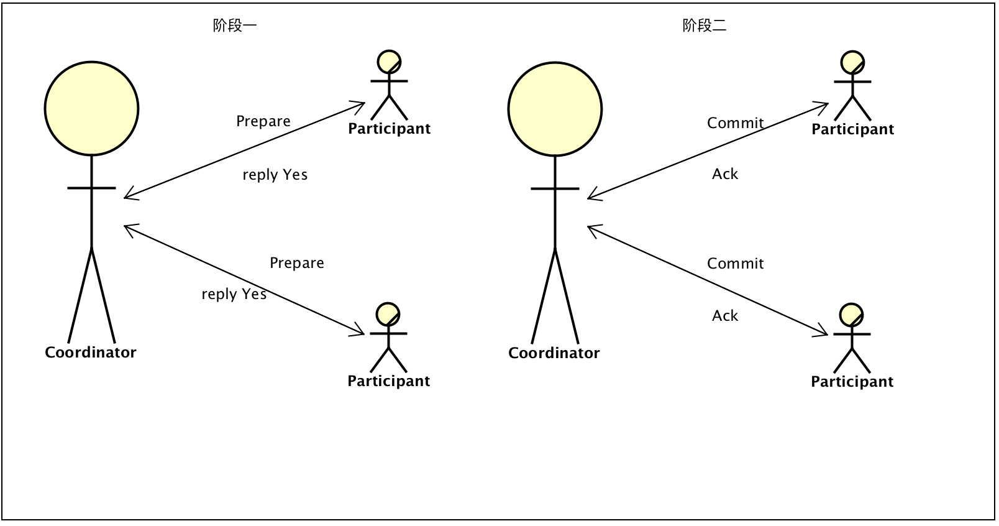

### 执行事务中断

事情总会出现意外，当存在某一参与者向协调者发送No响应，或者等待超时。协调者只要无法收到所有参与者的Yes响应，就会中断事务。

8. 发送回滚请求。协调者向所有参与者发送Rollback请求；
9. 回滚。参与者收到请求后，利用本机Undo信息，执行Rollback操作。并在回滚结束后释放该事务所占用的系统资源；
10. 反馈回滚结果。参与者在完成回滚操作后，向协调者发送Ack消息；
11. 中断事务。协调者收到所有参与者的回滚Ack消息后，完成事务中断。

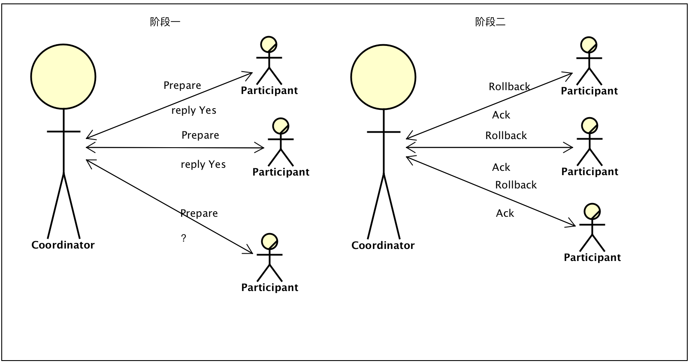

## 2pc解决的是分布式数据强一致性问题

顾名思义，两阶段提交在处理分布式事务时分为两个阶段：voting（投票阶段，有的地方会叫做prepare阶段）和commit阶段。

2pc中存在两个角色，事务协调者（如 seata、atomikos、lcn）和**事务参与者**，其中，事务参与者通常是指应用的数据库。

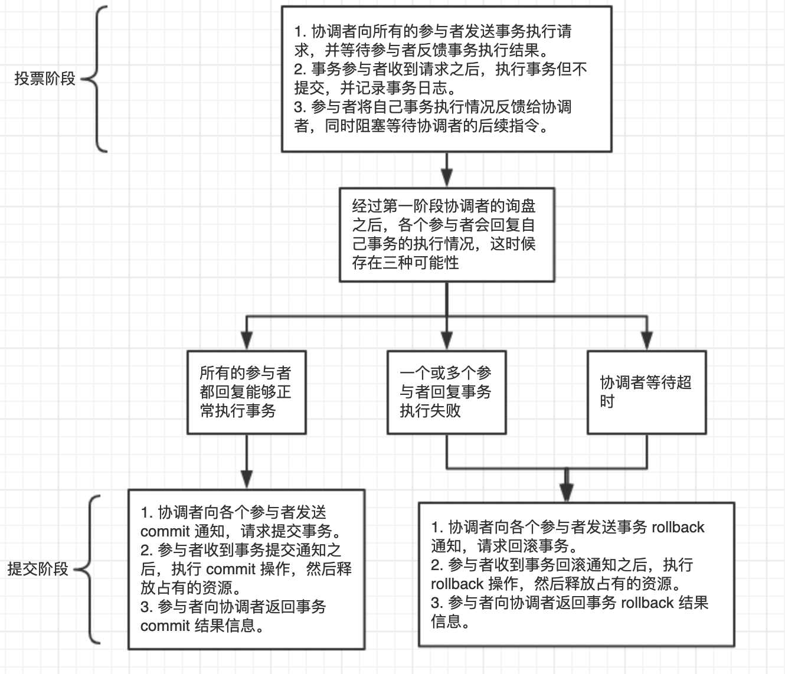

## 2PC二阶段提交的特点

### 2PC方案比较适合单体应用

2PC 方案中，有一个事务管理器的角色，负责协调多个数据库（资源管理器）的事务，事务管理器先问问各个数据库你准备好了吗？

- 如果每个数据库都回复 ok，那么就正式提交事务，在各个数据库上执行操作；
- 如果任何其中一个数据库回答不 ok，那么就回滚事务。

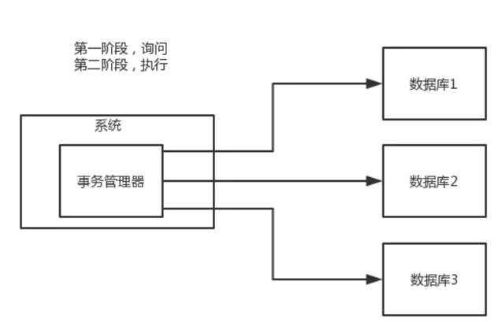

2PC 方案比较适合单体应用里，跨多个库的分布式事务，而且因为**严重依赖于数据库层面来搞定复杂的事务**，效率很低，绝对不适合高并发的场景。

2PC 方案实际很少用，一般来说某个系统内部如果出现跨多个库的这么一个操作，是不合规的。

现在的微服务系统，一个大的系统分成几百个服务，几十个服务。一般来说，我们的规定和规范，是要求每个服务只能操作自己对应的一个数据库。

如果你要操作别的服务对应的库，不允许直连别的服务的库，违反微服务架构的规范，你随便交叉胡乱访问，几百个服务的话，全体乱套，这样的一套服务是没法管理的，没法治理的，可能会出现数据被别人改错，自己的库被别人写挂等情况。

如果你要操作别人的服务的库，你必须是通过调用别的服务的接口来实现，绝对不允许交叉访问别人的数据库。

### 2PC具有明显的优缺点：

**优点:**

- 主要体现在实现原理简单；

**缺点比较多：**

- 同步阻塞导致性能问题

执行过程中，所有参与节点都是事务阻塞型的。

所有participant 都处于阻塞状态，各个participant 都在等待其他参与者响应，无法进行其他操作。

所有分支的资源锁定时间，由最长的分支事务决定。

另外当参与者锁定公共资源时，处于事务之外的其他第三方访问者，也不得不处于阻塞状态。

- 单点故障导致高可用（HA）问题：

协调者是个单点，一旦出现问题，各个participant 将无法释放事务资源，也无法完成事务操作；

并且，由于协调者的重要性，一旦协调者发生故障，参与者会一直阻塞下去。

尤其在第二阶段，协调者发生故障，那么所有的参与者还都处于锁定事务资源的状态中，而无法继续完成事务操作。

假设，协调者挂掉，可以重新选举一个协调者，但是，还是无法解决因为协调者宕机导致的参与者处于阻塞状态的问题。

- 丢失消息导致的数据不一致问题：

如果协调者向所有参与者发送Commit请求后，发生局部网络异常,

或者协调者在尚未给全部的participant发送完Commit请求即出现崩溃，最终导致只有部分participant收到、执行请求。

于是整个系统将会出现数据不一致的情形，why？

只有一部分参与者接受到了commit请求。

部分参与者接到commit请求之后就会执行commit操作。但是其他部分未接到commit请求的机器则无法执行事务提交。于是整个分布式系统便出现了数据部一致性的现象。

- 过于保守：

二阶段提交协议没有设计较为完善的容错机制，**任意一个节点的失败都会导致整个事务的失败**。

具体来说：

2PC没有完善的容错机制，当参与者出现故障时，协调者无法快速得知这一失败，只能严格依赖超时设置来决定是否进一步的执行提交还是中断事务。

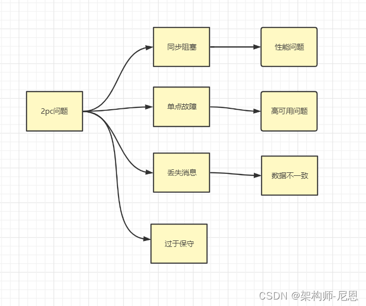

### 总结一下： XA-两阶段提交协议（以2PC为参考）中会遇到的一些问题

### 性能问题

从流程上我们可以看得出，其最大缺点就在于它的执行过程中间，节点都处于阻塞状态，各个操作数据库的节点此时都占用着数据库资源，

只有当所有节点准备完毕，事务协调者才会通知进行全局提交，参与者进行本地事务提交后才会释放资源。

这样的过程会比较漫长，对性能影响比较大。

### 协调者单点故障问题

事务协调者是整个XA模型的核心，一旦事务协调者节点挂掉，会导致参与者收不到提交或回滚的通知，

从而导致参与者节点始终处于事务无法完成的中间状态。

### 丢失消息导致的数据不一致问题

在第二个阶段，如果发生局部网络问题，一部分事务参与者收到了提交消息，另一部分事务参与者没收到提交消息，那么就会导致节点间数据的不一致问题。

- 过于保守：

二阶段提交协议没有设计较为完善的容错机制，**任意一个节点的失败都会导致整个事务的失败**。

%23%202PC%EF%BC%88%E6%A0%87%E5%87%86XA%E6%A8%A1%E5%9E%8B%EF%BC%89%0A%0A%5Btoc%5D%0A%0A2PC%E5%8D%B3Two-Phase%20Commit%EF%BC%8C%E4%BA%8C%E9%98%B6%E6%AE%B5%E6%8F%90%E4%BA%A4%E3%80%82%0A%0A%23%23%202PC%E8%8A%82%E7%82%B9%E8%A7%92%E8%89%B2%0A%0A%E4%BA%8C%E9%98%B6%E6%AE%B5%E6%8F%90%E4%BA%A4%E5%8D%8F%E8%AE%AE%E5%B0%86%E8%8A%82%E7%82%B9%E5%88%86%E4%B8%BA%EF%BC%9A%0A%0A-%20%E5%8D%8F%E8%B0%83%E8%80%85%E8%A7%92%E8%89%B2(%E4%BA%8B%E5%8A%A1%E7%AE%A1%E7%90%86%E5%99%A8Coordinator)%0A%20%20%20%20%0A-%20%E5%8F%82%E4%B8%8E%E8%80%85%E8%A7%92%E8%89%B2%EF%BC%88%E8%B5%84%E6%BA%90%E7%AE%A1%E7%90%86%E5%99%A8Participant%EF%BC%89%0A%20%20%20%20%0A%0A2PC%E8%A7%92%E8%89%B2%E4%B8%AD%EF%BC%8C%E4%BA%8B%E5%8A%A1%E7%AE%A1%E7%90%86%E5%99%A8%E7%9A%84%E8%A7%92%E8%89%B2%EF%BC%8C%E8%B4%9F%E8%B4%A3%E5%8D%8F%E8%B0%83%E5%A4%9A%E4%B8%AA%E6%95%B0%E6%8D%AE%E5%BA%93%EF%BC%88%E8%B5%84%E6%BA%90%E7%AE%A1%E7%90%86%E5%99%A8%EF%BC%89%E7%9A%84%E4%BA%8B%E5%8A%A1%EF%BC%8C%0A%0A%E5%8D%8F%E8%B0%83%E8%80%85%E8%A7%92%E8%89%B2(%E4%BA%8B%E5%8A%A1%E7%AE%A1%E7%90%86%E5%99%A8Coordinator)%EF%BC%8C%E8%B4%9F%E8%B4%A3%E5%90%91%E5%8F%82%E4%B8%8E%E8%80%85%E5%8F%91%E9%80%81%E6%8C%87%E4%BB%A4%EF%BC%8C%E6%94%B6%E9%9B%86%E5%8F%82%E4%B8%8E%E8%80%85%E5%8F%8D%E9%A6%88%EF%BC%8C%E5%81%9A%E5%87%BA%E6%8F%90%E4%BA%A4%E6%88%96%E8%80%85%E5%9B%9E%E6%BB%9A%E5%86%B3%E7%AD%96%20%20%0A%E5%8F%82%E4%B8%8E%E8%80%85%E8%A7%92%E8%89%B2%EF%BC%88%E8%B5%84%E6%BA%90%E7%AE%A1%E7%90%86%E5%99%A8Participant%EF%BC%89%EF%BC%8C%E6%8E%A5%E6%94%B6%E5%8D%8F%E8%B0%83%E8%80%85%E7%9A%84%E6%8C%87%E4%BB%A4%E6%89%A7%E8%A1%8C%E4%BA%8B%E5%8A%A1%E6%93%8D%E4%BD%9C%EF%BC%8C%E5%90%91%E5%8D%8F%E8%B0%83%E8%80%85%E5%8F%8D%E9%A6%88%E6%93%8D%E4%BD%9C%E7%BB%93%E6%9E%9C%EF%BC%8C%E5%B9%B6%E7%BB%A7%E7%BB%AD%E6%89%A7%E8%A1%8C%E5%8D%8F%E8%B0%83%E8%80%85%E5%8F%91%E9%80%81%E7%9A%84%E6%9C%80%E7%BB%88%E6%8C%87%E4%BB%A4%0A%0A%23%23%20%E8%AF%A6%E8%A7%A3%EF%BC%9A%E4%BA%8C%E4%B8%AA%E9%98%B6%E6%AE%B5%0A%0A%E5%B9%BF%E6%B3%9B%E5%BA%94%E7%94%A8%E5%9C%A8%E6%95%B0%E6%8D%AE%E5%BA%93%E9%A2%86%E5%9F%9F%EF%BC%8C%E4%B8%BA%E4%BA%86%E4%BD%BF%E5%BE%97%E5%9F%BA%E4%BA%8E%E5%88%86%E5%B8%83%E5%BC%8F%E6%9E%B6%E6%9E%84%E7%9A%84%E6%89%80%E6%9C%89%E8%8A%82%E7%82%B9%E5%8F%AF%E4%BB%A5%E5%9C%A8%E8%BF%9B%E8%A1%8C%E4%BA%8B%E5%8A%A1%E5%A4%84%E7%90%86%E6%97%B6%E8%83%BD%E5%A4%9F%E4%BF%9D%E6%8C%81%E5%8E%9F%E5%AD%90%E6%80%A7%E5%92%8C%E4%B8%80%E8%87%B4%E6%80%A7%E3%80%82%0A%0A%E9%A1%BE%E5%90%8D%E6%80%9D%E4%B9%89%EF%BC%8C2PC%E5%88%86%E4%B8%BA%E4%B8%A4%E4%B8%AA%E9%98%B6%E6%AE%B5%E5%A4%84%E7%90%86%EF%BC%8C%0A%0A-%20%E9%98%B6%E6%AE%B5%E4%B8%80%EF%BC%9A%E6%8F%90%E4%BA%A4%E4%BA%8B%E5%8A%A1%E8%AF%B7%E6%B1%82%E3%80%81%0A%20%20%20%20%0A-%20%E9%98%B6%E6%AE%B5%E4%BA%8C%EF%BC%9A%E6%89%A7%E8%A1%8C%E4%BA%8B%E5%8A%A1%E6%8F%90%E4%BA%A4%EF%BC%8C%E6%88%96%E8%80%85%E6%89%A7%E8%A1%8C%E4%B8%AD%E6%96%AD%E4%BA%8B%E5%8A%A1%3B%0A%20%20%20%20%0A%0A%E5%A6%82%E6%9E%9C%E9%98%B6%E6%AE%B5%E4%B8%80%E8%B6%85%E6%97%B6%E6%88%96%E8%80%85%E5%87%BA%E7%8E%B0%E5%BC%82%E5%B8%B8%EF%BC%8C2PC%E7%9A%84%E9%98%B6%E6%AE%B5%E4%BA%8C%E4%B8%BA%EF%BC%9A%E6%89%A7%E8%A1%8C%E4%B8%AD%E6%96%AD%E4%BA%8B%E5%8A%A1%0A%0A%3E%20%E8%AF%B4%E6%98%8E%EF%BC%9A%E7%BB%9D%E5%A4%A7%E9%83%A8%E5%88%86%E5%85%B3%E7%B3%BB%E5%9E%8B%E6%95%B0%E6%8D%AE%E5%BA%93%EF%BC%8C%E9%83%BD%E6%98%AF%E5%9F%BA%E4%BA%8E2PC%E5%AE%8C%E6%88%90%E5%88%86%E5%B8%83%E5%BC%8F%E7%9A%84%E4%BA%8B%E5%8A%A1%E5%A4%84%E7%90%86%E3%80%82%0A%0A%23%23%23%20%E9%98%B6%E6%AE%B5%E4%B8%80%EF%BC%9A%E6%8F%90%E4%BA%A4%E4%BA%8B%E5%8A%A1%E8%AF%B7%E6%B1%82%0A%0A1.%20%E4%BA%8B%E5%8A%A1%E8%AF%A2%E9%97%AE%E3%80%82%E5%8D%8F%E8%B0%83%E8%80%85%E5%90%91%E6%89%80%E6%9C%89%E5%8F%82%E4%B8%8E%E8%80%85%E5%8F%91%E9%80%81%E4%BA%8B%E5%8A%A1%E5%86%85%E5%AE%B9%EF%BC%8C%E8%AF%A2%E9%97%AE%E6%98%AF%E5%90%A6%E5%8F%AF%E4%BB%A5%E6%89%A7%E8%A1%8C%E6%8F%90%E4%BA%A4%E6%93%8D%E4%BD%9C%EF%BC%8C%E5%B9%B6%E5%BC%80%E5%A7%8B%E7%AD%89%E5%BE%85%E5%90%84%E5%8F%82%E4%B8%8E%E8%80%85%E8%BF%9B%E8%A1%8C%E5%93%8D%E5%BA%94%EF%BC%9B%0A2.%20%E6%89%A7%E8%A1%8C%E4%BA%8B%E5%8A%A1%E3%80%82%E5%90%84%E5%8F%82%E4%B8%8E%E8%80%85%E8%8A%82%E7%82%B9%EF%BC%8C%E6%89%A7%E8%A1%8C%E4%BA%8B%E5%8A%A1%E6%93%8D%E4%BD%9C%EF%BC%8C%E5%B9%B6%E5%B0%86Undo%E5%92%8CRedo%E6%93%8D%E4%BD%9C%E8%AE%A1%E5%85%A5%E6%9C%AC%E6%9C%BA%E4%BA%8B%E5%8A%A1%E6%97%A5%E5%BF%97%EF%BC%9B%0A3.%20%E5%90%84%E5%8F%82%E4%B8%8E%E8%80%85%E5%90%91%E5%8D%8F%E8%B0%83%E8%80%85%E5%8F%8D%E9%A6%88%E4%BA%8B%E5%8A%A1%E9%97%AE%E8%AF%A2%E7%9A%84%E5%93%8D%E5%BA%94%E3%80%82%E6%88%90%E5%8A%9F%E6%89%A7%E8%A1%8C%E8%BF%94%E5%9B%9EYes%EF%BC%8C%E5%90%A6%E5%88%99%E8%BF%94%E5%9B%9ENo%E3%80%82%0A%0A%23%23%23%20%E9%98%B6%E6%AE%B5%E4%BA%8C%EF%BC%9A%E6%89%A7%E8%A1%8C%E4%BA%8B%E5%8A%A1%E6%8F%90%E4%BA%A4%EF%BC%8C%E6%88%96%E8%80%85%E6%89%A7%E8%A1%8C%E4%B8%AD%E6%96%AD%E4%BA%8B%E5%8A%A1%3B%0A%0A%E8%BF%99%E4%B8%80%E9%98%B6%E6%AE%B5%E5%8C%85%E5%90%AB%E4%B8%A4%E7%A7%8D%E6%83%85%E5%BD%A2%EF%BC%9A%0A%0A-%20%E6%89%A7%E8%A1%8C%E4%BA%8B%E5%8A%A1%E6%8F%90%E4%BA%A4%EF%BC%8C%0A%20%20%20%20%0A-%20%E6%89%A7%E8%A1%8C%E4%B8%AD%E6%96%AD%E4%BA%8B%E5%8A%A1%0A%20%20%20%20%0A%0A%E5%8D%8F%E8%B0%83%E8%80%85%E5%9C%A8%E9%98%B6%E6%AE%B5%E4%BA%8C%E5%86%B3%E5%AE%9A%E6%98%AF%E5%90%A6%E6%9C%80%E7%BB%88%E6%89%A7%E8%A1%8C%E4%BA%8B%E5%8A%A1%E6%8F%90%E4%BA%A4%E6%93%8D%E4%BD%9C%E3%80%82%0A%0A-%20%E6%89%80%E6%9C%89%E5%8F%82%E4%B8%8E%E8%80%85reply%20Yes%EF%BC%8C%E9%82%A3%E4%B9%88%E6%89%A7%E8%A1%8C%E4%BA%8B%E5%8A%A1%E6%8F%90%E4%BA%A4%E3%80%82%0A-%20%E5%BD%93%E5%AD%98%E5%9C%A8%E6%9F%90%E4%B8%80%E5%8F%82%E4%B8%8E%E8%80%85%E5%90%91%E5%8D%8F%E8%B0%83%E8%80%85%E5%8F%91%E9%80%81No%E5%93%8D%E5%BA%94%EF%BC%8C%E6%88%96%E8%80%85%E7%AD%89%E5%BE%85%E8%B6%85%E6%97%B6%E3%80%82%E5%8D%8F%E8%B0%83%E8%80%85%E5%8F%AA%E8%A6%81%E6%97%A0%E6%B3%95%E6%94%B6%E5%88%B0%E6%89%80%E6%9C%89%E5%8F%82%E4%B8%8E%E8%80%85%E7%9A%84Yes%E5%93%8D%E5%BA%94%EF%BC%8C%E5%B0%B1%E4%BC%9A%E4%B8%AD%E6%96%AD%E4%BA%8B%E5%8A%A1%E3%80%82%0A%0A%23%23%23%20%E6%89%A7%E8%A1%8C%E4%BA%8B%E5%8A%A1%E6%8F%90%E4%BA%A4%0A%0A%E6%89%80%E6%9C%89%E5%8F%82%E4%B8%8E%E8%80%85reply%20Yes%EF%BC%8C%E9%82%A3%E4%B9%88%E6%89%A7%E8%A1%8C%E4%BA%8B%E5%8A%A1%E6%8F%90%E4%BA%A4%E3%80%82%0A%0A1.%20%E5%8F%91%E9%80%81%E6%8F%90%E4%BA%A4%E8%AF%B7%E6%B1%82%E3%80%82%E5%8D%8F%E8%B0%83%E8%80%85%E5%90%91%E6%89%80%E6%9C%89%E5%8F%82%E4%B8%8E%E8%80%85%E5%8F%91%E9%80%81Commit%E8%AF%B7%E6%B1%82%EF%BC%9B%0A2.%20%E4%BA%8B%E5%8A%A1%E6%8F%90%E4%BA%A4%E3%80%82%E5%8F%82%E4%B8%8E%E8%80%85%E6%94%B6%E5%88%B0Commit%E8%AF%B7%E6%B1%82%E5%90%8E%EF%BC%8C%E4%BC%9A**%E6%AD%A3%E5%BC%8F%E6%89%A7%E8%A1%8C%E4%BA%8B%E5%8A%A1%E6%8F%90%E4%BA%A4%E6%93%8D%E4%BD%9C**%EF%BC%8C%E5%B9%B6%E5%9C%A8%E5%AE%8C%E6%88%90%E6%8F%90%E4%BA%A4%E6%93%8D%E4%BD%9C%E4%B9%8B%E5%90%8E%EF%BC%8C%E9%87%8A%E6%94%BE%E5%9C%A8%E6%95%B4%E4%B8%AA%E4%BA%8B%E5%8A%A1%E6%89%A7%E8%A1%8C%E6%9C%9F%E9%97%B4%E5%8D%A0%E7%94%A8%E7%9A%84%E8%B5%84%E6%BA%90%EF%BC%9B%0A3.%20%E5%8F%8D%E9%A6%88%E4%BA%8B%E5%8A%A1%E6%8F%90%E4%BA%A4%E7%BB%93%E6%9E%9C%E3%80%82%E5%8F%82%E4%B8%8E%E8%80%85%E5%9C%A8%E5%AE%8C%E6%88%90%E4%BA%8B%E5%8A%A1%E6%8F%90%E4%BA%A4%E5%90%8E%EF%BC%8C%E5%86%99%E5%8D%8F%E8%B0%83%E8%80%85%E5%8F%91%E9%80%81Ack%E6%B6%88%E6%81%AF%E7%A1%AE%E8%AE%A4%EF%BC%9B%0A4.%20%E5%AE%8C%E6%88%90%E4%BA%8B%E5%8A%A1%E3%80%82%E5%8D%8F%E8%B0%83%E8%80%85%E5%9C%A8%E6%94%B6%E5%88%B0%E6%89%80%E6%9C%89%E5%8F%82%E4%B8%8E%E8%80%85%E7%9A%84Ack%E5%90%8E%EF%BC%8C%E5%AE%8C%E6%88%90%E4%BA%8B%E5%8A%A1%E3%80%82%0A%0A!%5B5743d34dc567bd3d002e86e5bc627168.png%5D(en-resource%3A%2F%2Fdatabase%2F6928%3A0)%0A%0A%0A%23%23%23%20%E6%89%A7%E8%A1%8C%E4%BA%8B%E5%8A%A1%E4%B8%AD%E6%96%AD%0A%0A%E4%BA%8B%E6%83%85%E6%80%BB%E4%BC%9A%E5%87%BA%E7%8E%B0%E6%84%8F%E5%A4%96%EF%BC%8C%E5%BD%93%E5%AD%98%E5%9C%A8%E6%9F%90%E4%B8%80%E5%8F%82%E4%B8%8E%E8%80%85%E5%90%91%E5%8D%8F%E8%B0%83%E8%80%85%E5%8F%91%E9%80%81No%E5%93%8D%E5%BA%94%EF%BC%8C%E6%88%96%E8%80%85%E7%AD%89%E5%BE%85%E8%B6%85%E6%97%B6%E3%80%82%E5%8D%8F%E8%B0%83%E8%80%85%E5%8F%AA%E8%A6%81%E6%97%A0%E6%B3%95%E6%94%B6%E5%88%B0%E6%89%80%E6%9C%89%E5%8F%82%E4%B8%8E%E8%80%85%E7%9A%84Yes%E5%93%8D%E5%BA%94%EF%BC%8C%E5%B0%B1%E4%BC%9A%E4%B8%AD%E6%96%AD%E4%BA%8B%E5%8A%A1%E3%80%82%0A%0A1.%20%E5%8F%91%E9%80%81%E5%9B%9E%E6%BB%9A%E8%AF%B7%E6%B1%82%E3%80%82%E5%8D%8F%E8%B0%83%E8%80%85%E5%90%91%E6%89%80%E6%9C%89%E5%8F%82%E4%B8%8E%E8%80%85%E5%8F%91%E9%80%81Rollback%E8%AF%B7%E6%B1%82%EF%BC%9B%0A2.%20%E5%9B%9E%E6%BB%9A%E3%80%82%E5%8F%82%E4%B8%8E%E8%80%85%E6%94%B6%E5%88%B0%E8%AF%B7%E6%B1%82%E5%90%8E%EF%BC%8C%E5%88%A9%E7%94%A8%E6%9C%AC%E6%9C%BAUndo%E4%BF%A1%E6%81%AF%EF%BC%8C%E6%89%A7%E8%A1%8CRollback%E6%93%8D%E4%BD%9C%E3%80%82%E5%B9%B6%E5%9C%A8%E5%9B%9E%E6%BB%9A%E7%BB%93%E6%9D%9F%E5%90%8E%E9%87%8A%E6%94%BE%E8%AF%A5%E4%BA%8B%E5%8A%A1%E6%89%80%E5%8D%A0%E7%94%A8%E7%9A%84%E7%B3%BB%E7%BB%9F%E8%B5%84%E6%BA%90%EF%BC%9B%0A3.%20%E5%8F%8D%E9%A6%88%E5%9B%9E%E6%BB%9A%E7%BB%93%E6%9E%9C%E3%80%82%E5%8F%82%E4%B8%8E%E8%80%85%E5%9C%A8%E5%AE%8C%E6%88%90%E5%9B%9E%E6%BB%9A%E6%93%8D%E4%BD%9C%E5%90%8E%EF%BC%8C%E5%90%91%E5%8D%8F%E8%B0%83%E8%80%85%E5%8F%91%E9%80%81Ack%E6%B6%88%E6%81%AF%EF%BC%9B%0A4.%20%E4%B8%AD%E6%96%AD%E4%BA%8B%E5%8A%A1%E3%80%82%E5%8D%8F%E8%B0%83%E8%80%85%E6%94%B6%E5%88%B0%E6%89%80%E6%9C%89%E5%8F%82%E4%B8%8E%E8%80%85%E7%9A%84%E5%9B%9E%E6%BB%9AAck%E6%B6%88%E6%81%AF%E5%90%8E%EF%BC%8C%E5%AE%8C%E6%88%90%E4%BA%8B%E5%8A%A1%E4%B8%AD%E6%96%AD%E3%80%82%0A%0A!%5Bbbf835bae9348db3a8f40c654e6c6544.png%5D(en-resource%3A%2F%2Fdatabase%2F6930%3A0)%0A%0A%0A%23%23%202pc%E8%A7%A3%E5%86%B3%E7%9A%84%E6%98%AF%E5%88%86%E5%B8%83%E5%BC%8F%E6%95%B0%E6%8D%AE%E5%BC%BA%E4%B8%80%E8%87%B4%E6%80%A7%E9%97%AE%E9%A2%98%0A%0A%E9%A1%BE%E5%90%8D%E6%80%9D%E4%B9%89%EF%BC%8C%E4%B8%A4%E9%98%B6%E6%AE%B5%E6%8F%90%E4%BA%A4%E5%9C%A8%E5%A4%84%E7%90%86%E5%88%86%E5%B8%83%E5%BC%8F%E4%BA%8B%E5%8A%A1%E6%97%B6%E5%88%86%E4%B8%BA%E4%B8%A4%E4%B8%AA%E9%98%B6%E6%AE%B5%EF%BC%9Avoting%EF%BC%88%E6%8A%95%E7%A5%A8%E9%98%B6%E6%AE%B5%EF%BC%8C%E6%9C%89%E7%9A%84%E5%9C%B0%E6%96%B9%E4%BC%9A%E5%8F%AB%E5%81%9Aprepare%E9%98%B6%E6%AE%B5%EF%BC%89%E5%92%8Ccommit%E9%98%B6%E6%AE%B5%E3%80%82%0A%0A2pc%E4%B8%AD%E5%AD%98%E5%9C%A8%E4%B8%A4%E4%B8%AA%E8%A7%92%E8%89%B2%EF%BC%8C%E4%BA%8B%E5%8A%A1%E5%8D%8F%E8%B0%83%E8%80%85%EF%BC%88%E5%A6%82%20seata%E3%80%81atomikos%E3%80%81lcn%EF%BC%89%E5%92%8C**%E4%BA%8B%E5%8A%A1%E5%8F%82%E4%B8%8E%E8%80%85**%EF%BC%8C%E5%85%B6%E4%B8%AD%EF%BC%8C%E4%BA%8B%E5%8A%A1%E5%8F%82%E4%B8%8E%E8%80%85%E9%80%9A%E5%B8%B8%E6%98%AF%E6%8C%87%E5%BA%94%E7%94%A8%E7%9A%84%E6%95%B0%E6%8D%AE%E5%BA%93%E3%80%82%0A%0A!%5Bc687f75b58340045506e691078ee5dd4.png%5D(en-resource%3A%2F%2Fdatabase%2F6932%3A0)%0A%0A%0A%23%23%202PC%E4%BA%8C%E9%98%B6%E6%AE%B5%E6%8F%90%E4%BA%A4%E7%9A%84%E7%89%B9%E7%82%B9%0A%0A%23%23%23%202PC%E6%96%B9%E6%A1%88%E6%AF%94%E8%BE%83%E9%80%82%E5%90%88%E5%8D%95%E4%BD%93%E5%BA%94%E7%94%A8%0A%0A2PC%20%E6%96%B9%E6%A1%88%E4%B8%AD%EF%BC%8C%E6%9C%89%E4%B8%80%E4%B8%AA%E4%BA%8B%E5%8A%A1%E7%AE%A1%E7%90%86%E5%99%A8%E7%9A%84%E8%A7%92%E8%89%B2%EF%BC%8C%E8%B4%9F%E8%B4%A3%E5%8D%8F%E8%B0%83%E5%A4%9A%E4%B8%AA%E6%95%B0%E6%8D%AE%E5%BA%93%EF%BC%88%E8%B5%84%E6%BA%90%E7%AE%A1%E7%90%86%E5%99%A8%EF%BC%89%E7%9A%84%E4%BA%8B%E5%8A%A1%EF%BC%8C%E4%BA%8B%E5%8A%A1%E7%AE%A1%E7%90%86%E5%99%A8%E5%85%88%E9%97%AE%E9%97%AE%E5%90%84%E4%B8%AA%E6%95%B0%E6%8D%AE%E5%BA%93%E4%BD%A0%E5%87%86%E5%A4%87%E5%A5%BD%E4%BA%86%E5%90%97%EF%BC%9F%0A%0A-%20%E5%A6%82%E6%9E%9C%E6%AF%8F%E4%B8%AA%E6%95%B0%E6%8D%AE%E5%BA%93%E9%83%BD%E5%9B%9E%E5%A4%8D%20ok%EF%BC%8C%E9%82%A3%E4%B9%88%E5%B0%B1%E6%AD%A3%E5%BC%8F%E6%8F%90%E4%BA%A4%E4%BA%8B%E5%8A%A1%EF%BC%8C%E5%9C%A8%E5%90%84%E4%B8%AA%E6%95%B0%E6%8D%AE%E5%BA%93%E4%B8%8A%E6%89%A7%E8%A1%8C%E6%93%8D%E4%BD%9C%EF%BC%9B%0A%20%20%20%20%0A-%20%E5%A6%82%E6%9E%9C%E4%BB%BB%E4%BD%95%E5%85%B6%E4%B8%AD%E4%B8%80%E4%B8%AA%E6%95%B0%E6%8D%AE%E5%BA%93%E5%9B%9E%E7%AD%94%E4%B8%8D%20ok%EF%BC%8C%E9%82%A3%E4%B9%88%E5%B0%B1%E5%9B%9E%E6%BB%9A%E4%BA%8B%E5%8A%A1%E3%80%82%0A%20%20%20%20%0A%0A!%5B9bc56edb97db872ee848010d2bd31569.png%5D(en-resource%3A%2F%2Fdatabase%2F6934%3A0)%0A%0A%0A2PC%20%E6%96%B9%E6%A1%88%E6%AF%94%E8%BE%83%E9%80%82%E5%90%88%E5%8D%95%E4%BD%93%E5%BA%94%E7%94%A8%E9%87%8C%EF%BC%8C%E8%B7%A8%E5%A4%9A%E4%B8%AA%E5%BA%93%E7%9A%84%E5%88%86%E5%B8%83%E5%BC%8F%E4%BA%8B%E5%8A%A1%EF%BC%8C%E8%80%8C%E4%B8%94%E5%9B%A0%E4%B8%BA**%E4%B8%A5%E9%87%8D%E4%BE%9D%E8%B5%96%E4%BA%8E%E6%95%B0%E6%8D%AE%E5%BA%93%E5%B1%82%E9%9D%A2%E6%9D%A5%E6%90%9E%E5%AE%9A%E5%A4%8D%E6%9D%82%E7%9A%84%E4%BA%8B%E5%8A%A1**%EF%BC%8C%E6%95%88%E7%8E%87%E5%BE%88%E4%BD%8E%EF%BC%8C%E7%BB%9D%E5%AF%B9%E4%B8%8D%E9%80%82%E5%90%88%E9%AB%98%E5%B9%B6%E5%8F%91%E7%9A%84%E5%9C%BA%E6%99%AF%E3%80%82%0A%0A2PC%20%E6%96%B9%E6%A1%88%E5%AE%9E%E9%99%85%E5%BE%88%E5%B0%91%E7%94%A8%EF%BC%8C%E4%B8%80%E8%88%AC%E6%9D%A5%E8%AF%B4%E6%9F%90%E4%B8%AA%E7%B3%BB%E7%BB%9F%E5%86%85%E9%83%A8%E5%A6%82%E6%9E%9C%E5%87%BA%E7%8E%B0%E8%B7%A8%E5%A4%9A%E4%B8%AA%E5%BA%93%E7%9A%84%E8%BF%99%E4%B9%88%E4%B8%80%E4%B8%AA%E6%93%8D%E4%BD%9C%EF%BC%8C%E6%98%AF%E4%B8%8D%E5%90%88%E8%A7%84%E7%9A%84%E3%80%82%0A%0A%E7%8E%B0%E5%9C%A8%E7%9A%84%E5%BE%AE%E6%9C%8D%E5%8A%A1%E7%B3%BB%E7%BB%9F%EF%BC%8C%E4%B8%80%E4%B8%AA%E5%A4%A7%E7%9A%84%E7%B3%BB%E7%BB%9F%E5%88%86%E6%88%90%E5%87%A0%E7%99%BE%E4%B8%AA%E6%9C%8D%E5%8A%A1%EF%BC%8C%E5%87%A0%E5%8D%81%E4%B8%AA%E6%9C%8D%E5%8A%A1%E3%80%82%E4%B8%80%E8%88%AC%E6%9D%A5%E8%AF%B4%EF%BC%8C%E6%88%91%E4%BB%AC%E7%9A%84%E8%A7%84%E5%AE%9A%E5%92%8C%E8%A7%84%E8%8C%83%EF%BC%8C%E6%98%AF%E8%A6%81%E6%B1%82%E6%AF%8F%E4%B8%AA%E6%9C%8D%E5%8A%A1%E5%8F%AA%E8%83%BD%E6%93%8D%E4%BD%9C%E8%87%AA%E5%B7%B1%E5%AF%B9%E5%BA%94%E7%9A%84%E4%B8%80%E4%B8%AA%E6%95%B0%E6%8D%AE%E5%BA%93%E3%80%82%0A%0A%E5%A6%82%E6%9E%9C%E4%BD%A0%E8%A6%81%E6%93%8D%E4%BD%9C%E5%88%AB%E7%9A%84%E6%9C%8D%E5%8A%A1%E5%AF%B9%E5%BA%94%E7%9A%84%E5%BA%93%EF%BC%8C%E4%B8%8D%E5%85%81%E8%AE%B8%E7%9B%B4%E8%BF%9E%E5%88%AB%E7%9A%84%E6%9C%8D%E5%8A%A1%E7%9A%84%E5%BA%93%EF%BC%8C%E8%BF%9D%E5%8F%8D%E5%BE%AE%E6%9C%8D%E5%8A%A1%E6%9E%B6%E6%9E%84%E7%9A%84%E8%A7%84%E8%8C%83%EF%BC%8C%E4%BD%A0%E9%9A%8F%E4%BE%BF%E4%BA%A4%E5%8F%89%E8%83%A1%E4%B9%B1%E8%AE%BF%E9%97%AE%EF%BC%8C%E5%87%A0%E7%99%BE%E4%B8%AA%E6%9C%8D%E5%8A%A1%E7%9A%84%E8%AF%9D%EF%BC%8C%E5%85%A8%E4%BD%93%E4%B9%B1%E5%A5%97%EF%BC%8C%E8%BF%99%E6%A0%B7%E7%9A%84%E4%B8%80%E5%A5%97%E6%9C%8D%E5%8A%A1%E6%98%AF%E6%B2%A1%E6%B3%95%E7%AE%A1%E7%90%86%E7%9A%84%EF%BC%8C%E6%B2%A1%E6%B3%95%E6%B2%BB%E7%90%86%E7%9A%84%EF%BC%8C%E5%8F%AF%E8%83%BD%E4%BC%9A%E5%87%BA%E7%8E%B0%E6%95%B0%E6%8D%AE%E8%A2%AB%E5%88%AB%E4%BA%BA%E6%94%B9%E9%94%99%EF%BC%8C%E8%87%AA%E5%B7%B1%E7%9A%84%E5%BA%93%E8%A2%AB%E5%88%AB%E4%BA%BA%E5%86%99%E6%8C%82%E7%AD%89%E6%83%85%E5%86%B5%E3%80%82%0A%0A%E5%A6%82%E6%9E%9C%E4%BD%A0%E8%A6%81%E6%93%8D%E4%BD%9C%E5%88%AB%E4%BA%BA%E7%9A%84%E6%9C%8D%E5%8A%A1%E7%9A%84%E5%BA%93%EF%BC%8C%E4%BD%A0%E5%BF%85%E9%A1%BB%E6%98%AF%E9%80%9A%E8%BF%87%E8%B0%83%E7%94%A8%E5%88%AB%E7%9A%84%E6%9C%8D%E5%8A%A1%E7%9A%84%E6%8E%A5%E5%8F%A3%E6%9D%A5%E5%AE%9E%E7%8E%B0%EF%BC%8C%E7%BB%9D%E5%AF%B9%E4%B8%8D%E5%85%81%E8%AE%B8%E4%BA%A4%E5%8F%89%E8%AE%BF%E9%97%AE%E5%88%AB%E4%BA%BA%E7%9A%84%E6%95%B0%E6%8D%AE%E5%BA%93%E3%80%82%0A%0A%23%23%23%202PC%E5%85%B7%E6%9C%89%E6%98%8E%E6%98%BE%E7%9A%84%E4%BC%98%E7%BC%BA%E7%82%B9%EF%BC%9A%0A%0A**%E4%BC%98%E7%82%B9%3A**%0A%0A-%20%E4%B8%BB%E8%A6%81%E4%BD%93%E7%8E%B0%E5%9C%A8%E5%AE%9E%E7%8E%B0%E5%8E%9F%E7%90%86%E7%AE%80%E5%8D%95%EF%BC%9B%0A%0A**%E7%BC%BA%E7%82%B9%E6%AF%94%E8%BE%83%E5%A4%9A%EF%BC%9A**%0A%0A-%20%E5%90%8C%E6%AD%A5%E9%98%BB%E5%A1%9E%E5%AF%BC%E8%87%B4%E6%80%A7%E8%83%BD%E9%97%AE%E9%A2%98%0A%0A%E6%89%A7%E8%A1%8C%E8%BF%87%E7%A8%8B%E4%B8%AD%EF%BC%8C%E6%89%80%E6%9C%89%E5%8F%82%E4%B8%8E%E8%8A%82%E7%82%B9%E9%83%BD%E6%98%AF%E4%BA%8B%E5%8A%A1%E9%98%BB%E5%A1%9E%E5%9E%8B%E7%9A%84%E3%80%82%0A%0A%E6%89%80%E6%9C%89participant%20%E9%83%BD%E5%A4%84%E4%BA%8E%E9%98%BB%E5%A1%9E%E7%8A%B6%E6%80%81%EF%BC%8C%E5%90%84%E4%B8%AAparticipant%20%E9%83%BD%E5%9C%A8%E7%AD%89%E5%BE%85%E5%85%B6%E4%BB%96%E5%8F%82%E4%B8%8E%E8%80%85%E5%93%8D%E5%BA%94%EF%BC%8C%E6%97%A0%E6%B3%95%E8%BF%9B%E8%A1%8C%E5%85%B6%E4%BB%96%E6%93%8D%E4%BD%9C%E3%80%82%0A%0A%E6%89%80%E6%9C%89%E5%88%86%E6%94%AF%E7%9A%84%E8%B5%84%E6%BA%90%E9%94%81%E5%AE%9A%E6%97%B6%E9%97%B4%EF%BC%8C%E7%94%B1%E6%9C%80%E9%95%BF%E7%9A%84%E5%88%86%E6%94%AF%E4%BA%8B%E5%8A%A1%E5%86%B3%E5%AE%9A%E3%80%82%0A%0A%E5%8F%A6%E5%A4%96%E5%BD%93%E5%8F%82%E4%B8%8E%E8%80%85%E9%94%81%E5%AE%9A%E5%85%AC%E5%85%B1%E8%B5%84%E6%BA%90%E6%97%B6%EF%BC%8C%E5%A4%84%E4%BA%8E%E4%BA%8B%E5%8A%A1%E4%B9%8B%E5%A4%96%E7%9A%84%E5%85%B6%E4%BB%96%E7%AC%AC%E4%B8%89%E6%96%B9%E8%AE%BF%E9%97%AE%E8%80%85%EF%BC%8C%E4%B9%9F%E4%B8%8D%E5%BE%97%E4%B8%8D%E5%A4%84%E4%BA%8E%E9%98%BB%E5%A1%9E%E7%8A%B6%E6%80%81%E3%80%82%0A%0A-%20%E5%8D%95%E7%82%B9%E6%95%85%E9%9A%9C%E5%AF%BC%E8%87%B4%E9%AB%98%E5%8F%AF%E7%94%A8%EF%BC%88HA%EF%BC%89%E9%97%AE%E9%A2%98%EF%BC%9A%0A%0A%E5%8D%8F%E8%B0%83%E8%80%85%E6%98%AF%E4%B8%AA%E5%8D%95%E7%82%B9%EF%BC%8C%E4%B8%80%E6%97%A6%E5%87%BA%E7%8E%B0%E9%97%AE%E9%A2%98%EF%BC%8C%E5%90%84%E4%B8%AAparticipant%20%E5%B0%86%E6%97%A0%E6%B3%95%E9%87%8A%E6%94%BE%E4%BA%8B%E5%8A%A1%E8%B5%84%E6%BA%90%EF%BC%8C%E4%B9%9F%E6%97%A0%E6%B3%95%E5%AE%8C%E6%88%90%E4%BA%8B%E5%8A%A1%E6%93%8D%E4%BD%9C%EF%BC%9B%0A%0A%E5%B9%B6%E4%B8%94%EF%BC%8C%E7%94%B1%E4%BA%8E%E5%8D%8F%E8%B0%83%E8%80%85%E7%9A%84%E9%87%8D%E8%A6%81%E6%80%A7%EF%BC%8C%E4%B8%80%E6%97%A6%E5%8D%8F%E8%B0%83%E8%80%85%E5%8F%91%E7%94%9F%E6%95%85%E9%9A%9C%EF%BC%8C%E5%8F%82%E4%B8%8E%E8%80%85%E4%BC%9A%E4%B8%80%E7%9B%B4%E9%98%BB%E5%A1%9E%E4%B8%8B%E5%8E%BB%E3%80%82%0A%0A%E5%B0%A4%E5%85%B6%E5%9C%A8%E7%AC%AC%E4%BA%8C%E9%98%B6%E6%AE%B5%EF%BC%8C%E5%8D%8F%E8%B0%83%E8%80%85%E5%8F%91%E7%94%9F%E6%95%85%E9%9A%9C%EF%BC%8C%E9%82%A3%E4%B9%88%E6%89%80%E6%9C%89%E7%9A%84%E5%8F%82%E4%B8%8E%E8%80%85%E8%BF%98%E9%83%BD%E5%A4%84%E4%BA%8E%E9%94%81%E5%AE%9A%E4%BA%8B%E5%8A%A1%E8%B5%84%E6%BA%90%E7%9A%84%E7%8A%B6%E6%80%81%E4%B8%AD%EF%BC%8C%E8%80%8C%E6%97%A0%E6%B3%95%E7%BB%A7%E7%BB%AD%E5%AE%8C%E6%88%90%E4%BA%8B%E5%8A%A1%E6%93%8D%E4%BD%9C%E3%80%82%0A%0A%E5%81%87%E8%AE%BE%EF%BC%8C%E5%8D%8F%E8%B0%83%E8%80%85%E6%8C%82%E6%8E%89%EF%BC%8C%E5%8F%AF%E4%BB%A5%E9%87%8D%E6%96%B0%E9%80%89%E4%B8%BE%E4%B8%80%E4%B8%AA%E5%8D%8F%E8%B0%83%E8%80%85%EF%BC%8C%E4%BD%86%E6%98%AF%EF%BC%8C%E8%BF%98%E6%98%AF%E6%97%A0%E6%B3%95%E8%A7%A3%E5%86%B3%E5%9B%A0%E4%B8%BA%E5%8D%8F%E8%B0%83%E8%80%85%E5%AE%95%E6%9C%BA%E5%AF%BC%E8%87%B4%E7%9A%84%E5%8F%82%E4%B8%8E%E8%80%85%E5%A4%84%E4%BA%8E%E9%98%BB%E5%A1%9E%E7%8A%B6%E6%80%81%E7%9A%84%E9%97%AE%E9%A2%98%E3%80%82%0A%0A-%20%E4%B8%A2%E5%A4%B1%E6%B6%88%E6%81%AF%E5%AF%BC%E8%87%B4%E7%9A%84%E6%95%B0%E6%8D%AE%E4%B8%8D%E4%B8%80%E8%87%B4%E9%97%AE%E9%A2%98%EF%BC%9A%0A%0A%E5%A6%82%E6%9E%9C%E5%8D%8F%E8%B0%83%E8%80%85%E5%90%91%E6%89%80%E6%9C%89%E5%8F%82%E4%B8%8E%E8%80%85%E5%8F%91%E9%80%81Commit%E8%AF%B7%E6%B1%82%E5%90%8E%EF%BC%8C%E5%8F%91%E7%94%9F%E5%B1%80%E9%83%A8%E7%BD%91%E7%BB%9C%E5%BC%82%E5%B8%B8%2C%0A%0A%E6%88%96%E8%80%85%E5%8D%8F%E8%B0%83%E8%80%85%E5%9C%A8%E5%B0%9A%E6%9C%AA%E7%BB%99%E5%85%A8%E9%83%A8%E7%9A%84participant%E5%8F%91%E9%80%81%E5%AE%8CCommit%E8%AF%B7%E6%B1%82%E5%8D%B3%E5%87%BA%E7%8E%B0%E5%B4%A9%E6%BA%83%EF%BC%8C%E6%9C%80%E7%BB%88%E5%AF%BC%E8%87%B4%E5%8F%AA%E6%9C%89%E9%83%A8%E5%88%86participant%E6%94%B6%E5%88%B0%E3%80%81%E6%89%A7%E8%A1%8C%E8%AF%B7%E6%B1%82%E3%80%82%0A%0A%E4%BA%8E%E6%98%AF%E6%95%B4%E4%B8%AA%E7%B3%BB%E7%BB%9F%E5%B0%86%E4%BC%9A%E5%87%BA%E7%8E%B0%E6%95%B0%E6%8D%AE%E4%B8%8D%E4%B8%80%E8%87%B4%E7%9A%84%E6%83%85%E5%BD%A2%EF%BC%8Cwhy%EF%BC%9F%0A%0A%E5%8F%AA%E6%9C%89%E4%B8%80%E9%83%A8%E5%88%86%E5%8F%82%E4%B8%8E%E8%80%85%E6%8E%A5%E5%8F%97%E5%88%B0%E4%BA%86commit%E8%AF%B7%E6%B1%82%E3%80%82%0A%0A%E9%83%A8%E5%88%86%E5%8F%82%E4%B8%8E%E8%80%85%E6%8E%A5%E5%88%B0commit%E8%AF%B7%E6%B1%82%E4%B9%8B%E5%90%8E%E5%B0%B1%E4%BC%9A%E6%89%A7%E8%A1%8Ccommit%E6%93%8D%E4%BD%9C%E3%80%82%E4%BD%86%E6%98%AF%E5%85%B6%E4%BB%96%E9%83%A8%E5%88%86%E6%9C%AA%E6%8E%A5%E5%88%B0commit%E8%AF%B7%E6%B1%82%E7%9A%84%E6%9C%BA%E5%99%A8%E5%88%99%E6%97%A0%E6%B3%95%E6%89%A7%E8%A1%8C%E4%BA%8B%E5%8A%A1%E6%8F%90%E4%BA%A4%E3%80%82%E4%BA%8E%E6%98%AF%E6%95%B4%E4%B8%AA%E5%88%86%E5%B8%83%E5%BC%8F%E7%B3%BB%E7%BB%9F%E4%BE%BF%E5%87%BA%E7%8E%B0%E4%BA%86%E6%95%B0%E6%8D%AE%E9%83%A8%E4%B8%80%E8%87%B4%E6%80%A7%E7%9A%84%E7%8E%B0%E8%B1%A1%E3%80%82%0A%0A-%20%E8%BF%87%E4%BA%8E%E4%BF%9D%E5%AE%88%EF%BC%9A%0A%0A%E4%BA%8C%E9%98%B6%E6%AE%B5%E6%8F%90%E4%BA%A4%E5%8D%8F%E8%AE%AE%E6%B2%A1%E6%9C%89%E8%AE%BE%E8%AE%A1%E8%BE%83%E4%B8%BA%E5%AE%8C%E5%96%84%E7%9A%84%E5%AE%B9%E9%94%99%E6%9C%BA%E5%88%B6%EF%BC%8C**%E4%BB%BB%E6%84%8F%E4%B8%80%E4%B8%AA%E8%8A%82%E7%82%B9%E7%9A%84%E5%A4%B1%E8%B4%A5%E9%83%BD%E4%BC%9A%E5%AF%BC%E8%87%B4%E6%95%B4%E4%B8%AA%E4%BA%8B%E5%8A%A1%E7%9A%84%E5%A4%B1%E8%B4%A5**%E3%80%82%0A%0A%E5%85%B7%E4%BD%93%E6%9D%A5%E8%AF%B4%EF%BC%9A%0A%0A2PC%E6%B2%A1%E6%9C%89%E5%AE%8C%E5%96%84%E7%9A%84%E5%AE%B9%E9%94%99%E6%9C%BA%E5%88%B6%EF%BC%8C%E5%BD%93%E5%8F%82%E4%B8%8E%E8%80%85%E5%87%BA%E7%8E%B0%E6%95%85%E9%9A%9C%E6%97%B6%EF%BC%8C%E5%8D%8F%E8%B0%83%E8%80%85%E6%97%A0%E6%B3%95%E5%BF%AB%E9%80%9F%E5%BE%97%E7%9F%A5%E8%BF%99%E4%B8%80%E5%A4%B1%E8%B4%A5%EF%BC%8C%E5%8F%AA%E8%83%BD%E4%B8%A5%E6%A0%BC%E4%BE%9D%E8%B5%96%E8%B6%85%E6%97%B6%E8%AE%BE%E7%BD%AE%E6%9D%A5%E5%86%B3%E5%AE%9A%E6%98%AF%E5%90%A6%E8%BF%9B%E4%B8%80%E6%AD%A5%E7%9A%84%E6%89%A7%E8%A1%8C%E6%8F%90%E4%BA%A4%E8%BF%98%E6%98%AF%E4%B8%AD%E6%96%AD%E4%BA%8B%E5%8A%A1%E3%80%82%0A%0A!%5B9ec43d7bd49f535982d4b8d05b8ae852.png%5D(en-resource%3A%2F%2Fdatabase%2F6936%3A0)%0A%0A%0A%23%23%23%20%E6%80%BB%E7%BB%93%E4%B8%80%E4%B8%8B%EF%BC%9A%20XA-%E4%B8%A4%E9%98%B6%E6%AE%B5%E6%8F%90%E4%BA%A4%E5%8D%8F%E8%AE%AE%EF%BC%88%E4%BB%A52PC%E4%B8%BA%E5%8F%82%E8%80%83%EF%BC%89%E4%B8%AD%E4%BC%9A%E9%81%87%E5%88%B0%E7%9A%84%E4%B8%80%E4%BA%9B%E9%97%AE%E9%A2%98%0A%0A%23%23%23%23%23%20%E6%80%A7%E8%83%BD%E9%97%AE%E9%A2%98%0A%20%20%20%20%0A%0A%E4%BB%8E%E6%B5%81%E7%A8%8B%E4%B8%8A%E6%88%91%E4%BB%AC%E5%8F%AF%E4%BB%A5%E7%9C%8B%E5%BE%97%E5%87%BA%EF%BC%8C%E5%85%B6%E6%9C%80%E5%A4%A7%E7%BC%BA%E7%82%B9%E5%B0%B1%E5%9C%A8%E4%BA%8E%E5%AE%83%E7%9A%84%E6%89%A7%E8%A1%8C%E8%BF%87%E7%A8%8B%E4%B8%AD%E9%97%B4%EF%BC%8C%E8%8A%82%E7%82%B9%E9%83%BD%E5%A4%84%E4%BA%8E%E9%98%BB%E5%A1%9E%E7%8A%B6%E6%80%81%EF%BC%8C%E5%90%84%E4%B8%AA%E6%93%8D%E4%BD%9C%E6%95%B0%E6%8D%AE%E5%BA%93%E7%9A%84%E8%8A%82%E7%82%B9%E6%AD%A4%E6%97%B6%E9%83%BD%E5%8D%A0%E7%94%A8%E7%9D%80%E6%95%B0%E6%8D%AE%E5%BA%93%E8%B5%84%E6%BA%90%EF%BC%8C%0A%0A%E5%8F%AA%E6%9C%89%E5%BD%93%E6%89%80%E6%9C%89%E8%8A%82%E7%82%B9%E5%87%86%E5%A4%87%E5%AE%8C%E6%AF%95%EF%BC%8C%E4%BA%8B%E5%8A%A1%E5%8D%8F%E8%B0%83%E8%80%85%E6%89%8D%E4%BC%9A%E9%80%9A%E7%9F%A5%E8%BF%9B%E8%A1%8C%E5%85%A8%E5%B1%80%E6%8F%90%E4%BA%A4%EF%BC%8C%E5%8F%82%E4%B8%8E%E8%80%85%E8%BF%9B%E8%A1%8C%E6%9C%AC%E5%9C%B0%E4%BA%8B%E5%8A%A1%E6%8F%90%E4%BA%A4%E5%90%8E%E6%89%8D%E4%BC%9A%E9%87%8A%E6%94%BE%E8%B5%84%E6%BA%90%E3%80%82%0A%0A%E8%BF%99%E6%A0%B7%E7%9A%84%E8%BF%87%E7%A8%8B%E4%BC%9A%E6%AF%94%E8%BE%83%E6%BC%AB%E9%95%BF%EF%BC%8C%E5%AF%B9%E6%80%A7%E8%83%BD%E5%BD%B1%E5%93%8D%E6%AF%94%E8%BE%83%E5%A4%A7%E3%80%82%0A%0A%23%23%23%23%23%20%E5%8D%8F%E8%B0%83%E8%80%85%E5%8D%95%E7%82%B9%E6%95%85%E9%9A%9C%E9%97%AE%E9%A2%98%0A%20%20%20%20%0A%0A%E4%BA%8B%E5%8A%A1%E5%8D%8F%E8%B0%83%E8%80%85%E6%98%AF%E6%95%B4%E4%B8%AAXA%E6%A8%A1%E5%9E%8B%E7%9A%84%E6%A0%B8%E5%BF%83%EF%BC%8C%E4%B8%80%E6%97%A6%E4%BA%8B%E5%8A%A1%E5%8D%8F%E8%B0%83%E8%80%85%E8%8A%82%E7%82%B9%E6%8C%82%E6%8E%89%EF%BC%8C%E4%BC%9A%E5%AF%BC%E8%87%B4%E5%8F%82%E4%B8%8E%E8%80%85%E6%94%B6%E4%B8%8D%E5%88%B0%E6%8F%90%E4%BA%A4%E6%88%96%E5%9B%9E%E6%BB%9A%E7%9A%84%E9%80%9A%E7%9F%A5%EF%BC%8C%0A%0A%E4%BB%8E%E8%80%8C%E5%AF%BC%E8%87%B4%E5%8F%82%E4%B8%8E%E8%80%85%E8%8A%82%E7%82%B9%E5%A7%8B%E7%BB%88%E5%A4%84%E4%BA%8E%E4%BA%8B%E5%8A%A1%E6%97%A0%E6%B3%95%E5%AE%8C%E6%88%90%E7%9A%84%E4%B8%AD%E9%97%B4%E7%8A%B6%E6%80%81%E3%80%82%0A%0A%23%23%23%23%23%20%E4%B8%A2%E5%A4%B1%E6%B6%88%E6%81%AF%E5%AF%BC%E8%87%B4%E7%9A%84%E6%95%B0%E6%8D%AE%E4%B8%8D%E4%B8%80%E8%87%B4%E9%97%AE%E9%A2%98%0A%20%20%20%20%0A%0A%E5%9C%A8%E7%AC%AC%E4%BA%8C%E4%B8%AA%E9%98%B6%E6%AE%B5%EF%BC%8C%E5%A6%82%E6%9E%9C%E5%8F%91%E7%94%9F%E5%B1%80%E9%83%A8%E7%BD%91%E7%BB%9C%E9%97%AE%E9%A2%98%EF%BC%8C%E4%B8%80%E9%83%A8%E5%88%86%E4%BA%8B%E5%8A%A1%E5%8F%82%E4%B8%8E%E8%80%85%E6%94%B6%E5%88%B0%E4%BA%86%E6%8F%90%E4%BA%A4%E6%B6%88%E6%81%AF%EF%BC%8C%E5%8F%A6%E4%B8%80%E9%83%A8%E5%88%86%E4%BA%8B%E5%8A%A1%E5%8F%82%E4%B8%8E%E8%80%85%E6%B2%A1%E6%94%B6%E5%88%B0%E6%8F%90%E4%BA%A4%E6%B6%88%E6%81%AF%EF%BC%8C%E9%82%A3%E4%B9%88%E5%B0%B1%E4%BC%9A%E5%AF%BC%E8%87%B4%E8%8A%82%E7%82%B9%E9%97%B4%E6%95%B0%E6%8D%AE%E7%9A%84%E4%B8%8D%E4%B8%80%E8%87%B4%E9%97%AE%E9%A2%98%E3%80%82%0A%0A-%20%E8%BF%87%E4%BA%8E%E4%BF%9D%E5%AE%88%EF%BC%9A%0A%0A%E4%BA%8C%E9%98%B6%E6%AE%B5%E6%8F%90%E4%BA%A4%E5%8D%8F%E8%AE%AE%E6%B2%A1%E6%9C%89%E8%AE%BE%E8%AE%A1%E8%BE%83%E4%B8%BA%E5%AE%8C%E5%96%84%E7%9A%84%E5%AE%B9%E9%94%99%E6%9C%BA%E5%88%B6%EF%BC%8C**%E4%BB%BB%E6%84%8F%E4%B8%80%E4%B8%AA%E8%8A%82%E7%82%B9%E7%9A%84%E5%A4%B1%E8%B4%A5%E9%83%BD%E4%BC%9A%E5%AF%BC%E8%87%B4%E6%95%B4%E4%B8%AA%E4%BA%8B%E5%8A%A1%E7%9A%84%E5%A4%B1%E8%B4%A5**%E3%80%82
