[《分布式系统模式》（Patterns of Distributed Systems）](https://martinfowler.com/articles/patterns-of-distributed-systems/)是 [Unmesh Joshi](https://twitter.com/unmeshjoshi) 编写的一系列关于分布式系统实现的文章。这个系列的文章采用模式的格式，介绍了像 Kafka、Zookeeper 这种分布式系统在实现过程采用的通用模式，是学习分布式系统实现的基础。

## 目录

<u>概述</u>

### 模式

- <u>一致性内核（Consistent Core）</u>
- 固定分区（Fixed Partitions）
- <u>追随者读取（Follower Reads）</u>
- <u>世代时钟（Generation Clock）</u>
- <u>Gossip 传播（Gossip Dissemination）</u>
- <u>心跳（HeartBeat）</u>
- <u>高水位标记（High-Water Mark）</u>
- <u>混合时钟（Hybrid Clock）</u>
- <u>幂等接收者（Idempotent Receiver）</u>
- 键值与值（Key And Value）
- <u>Lamport 时钟（Lamport Clock）</u>
- <u>领导者和追随者（Leader and Followers）</u>
- <u>租约（Lease）</u>
- <u>低水位标记（Low-Water Mark）</u>
- <u>Paxos</u>
- <u>Quorum</u>
- <u>复制日志（Replicated Log）</u>
- 批量请求（Request Batch）
- <u>请求管道（Request Pipeline）</u>
- <u>分段日志（Segmented Log）</u>
- <u>单一 Socket 通道（Single Socket Channel）</u>
- <u>单一更新队列（Singular Update Queue）</u>
- <u>状态监控（State Watch）</u>
- <u>两阶段提交（Two Phase Commit）</u>
- <u>版本向量（Version Vector）</u>
- <u>有版本的值（Versioned Values）</u>
- <u>预写日志（Write-Ahead Log）</u>

## 术语表

| 英文 | 翻译 |
| --- | --- |
| durability | 持久性 |
| Write-Ahead Log | 预写日志 |
| append | 追加 |
| hash | 哈希 |
| replicate | 复制 |
| failure | 失效 |
| partition | 分区 |
| HeartBeat | 心跳 |
| Quorum | Quorum |
| Leader | 领导者 |
| Follower | 追随者 |
| High Water Mark | 高水位标记 |
| Low Water Mark | 低水位标记 |
| entry | 条目 |
| propagate | 传播 |
| disconnect | 失联、断开连接 |
| Generation Clock | 世代时钟 |
| group membership | 分组成员 |
| partitions | 分区 |
| liveness | 活跃情况 |
| round trip | 往返 |
| in-flight | 在途 |
| time to live | 存活时间 |
| head of line blocking | 队首阻塞 |
| coordinator | 协调者 |
| lag | 滞后 |
| fanout | 扇出 |
| incoming | 传入 |
| CommitIndex | 提交索引 |
| candidate | 候选者 |

**原文**

https://martinfowler.com/articles/patterns-of-distributed-systems/

分布式系统给软件开发带来了一些特殊的挑战，要求数据有多个副本，且彼此间要保持同步。然而，我们不能保证所有工作节点都能可靠地工作，网络延迟会轻易地造成不一致。尽管如此，许多组织依然要依赖一系列核心的分布式软件来处理数据存储、消息通信、系统管理以及计算能力。这些系统面临着共同的问题，可以采用类似的方案解决。本文将这些方案进行分类，并进一步提炼成模式。通过模式，我们可以认识到如何更好的理解、交流和传授分布式系统设计。

**2020.6.17**

Unmesh Joshi

Unmesh Joshi 是 ThoughtWorks 的总监级咨询师。他是一个软件架构的爱好者，相信在今天理解分布式系统的原则，同过去十年里理解 Web 架构或面向对象编程一样至关重要。

## 这个系列在讨论什么

在过去的几个月里，我在 ThoughtWorks 内部组织了许多分布式系统的工作坊。在组织这些工作坊的过程中，我们面临的一个严峻挑战就是，如何将分布式系统的理论映射到诸如 Kafka 或Cassandra 这样的开源代码库上，同时，还要保持讨论足够通用，覆盖尽可能广泛的解决方案。模式的概念为此提供了一个不错的出路。

从模式的本质上说，其结构让我们可以专注在一个特定的问题上，这就很容易说清楚，为什么需要一个特定的解决方案。解决方案的描述让我们有了一个代码结构，对于展示一个实际的解决方案而言，它足够具体，对于涵盖广泛的变体而言，它又足够通用。模式技术还可以将不同的模式联系在一起，构建出一个完整的系统。由此，便有了一个讨论分布式系统实现非常好的词汇表。

下面就是从主流开源分布式系统中观察到的第一组模式。希望这组模式对所有的程序员都有用。

### 分布式系统：一个实现的视角

今天的企业架构充满了各种天生就分布的平台和框架。如果从今天典型的企业应用架构选取典型平台和框架组成列表，我们可能会得到类似于下面这样一个列表：

| **平台/框架的类型** | **样例** |
| --- | --- |
| 数据库 | Cassandra、HBase、Riak |
| 消息队列 | Kafka、Pulsar |
| 基础设施 | Kubernetes、Mesos、Zookeeper、etcd、Consul |
| 内存数据/计算网格 | Hazelcast、Pivotal、Gemfire |
| 有状态微服务 | Akka Actors、Axon |
| 文件系统 | HDFS、Ceph |

所有这些天生都是“分布式的”。对一个系统而言，分布式意味着什么呢？它包含两个方面：

- 这个系统运行在多个服务器上。集群中的服务器数量差异极大，少则两三台，多则数千台。
- 这个系统管理着数据。因此，其本质上是一个“有状态”的系统。

当多台服务器参与到存储数据中，总有一些地方会出错。上述所有提及的系统都需要解决这些问题。在这些系统的实现中，解决这些问题时总有一些类似的解决方案。以通用的形式理解这些解决方案，有助于在更大的范围内理解这些系统的实现，也可以当做构建新系统的指导原则。

好，进入模式。

### 模式

[模式](https://martinfowler.com/articles/writingPatterns.html)，这是 Christopher Alexander 引入的一个概念，现在在软件设计社区得到了广泛地接受，用以记录在构建软件系统所用的各种设计构造。模式提供一种“从问题到解决方案”的结构化方式，它可以在许多地方见到，并且得到了证明。使用模式的一种有意思的方式是，采用模式序列或模式语言的形式，将多个模式联系在一起，这为实现“整个”或完整的系统提供了指导方向。将分布式系统视为一系列模式是一种有价值的做法，可以获得关于其实现更多的洞见。

## 问题及可复用的解决方案

当数据要存储在多台服务器上时，有很多地方可能会出错。

### 进程崩溃

进程随时都会崩溃，无论是硬件故障，还是软件故障。进程崩溃的方式有许多种：

- 系统管理员进行常规维护时，进程可能会挂掉
- 因为磁盘已满，异常未能正确处理，做一些文件 IO 时进程可能被杀掉
- 在云环境中，甚至更加诡异，一些无关因素都会让服务器宕机

如果进程负责存储数据，底线是其设计要对存储在服务器上的数据给予一定的持久性（durability）保证。即便进程突然崩溃，所有已经通知用户成功存储的数据也要得以保障。依赖于其存储模式，不同的存储引擎有不同的的存储结构，从简单的哈希表到复杂的图存储。因为将数据写入磁盘是最耗时的过程，可能不是每个对存储的插入或更新都来得及写入到磁盘中。因此，大多数数据库都有内存存储结构，其只完成周期性的磁盘写入。这就增加了“进程突然崩溃丢失所有数据”的风险。

有一种叫[预写日志（Write-Ahead Log，简称 WAL）](https://write-ahead-log.md/)的技术就是用来对付这种情况的。服务器存储将每个状态改变当做一个命令记录在硬盘上的一个只追加（append-only）的文件上。在文件上附加是一个非常快的操作，因此，它几乎对性能完全没有影响。这样一个可以顺序追加的日志可以存储每次更新。在服务器启动时，日志可以回放，以重建内存状态。

这就保证了持久性。即便服务器突然崩溃再重启，数据也不会丢失。但是，客户端在服务器恢复之前是不能获取或存储数据的。因此，在服务器失效时，我们缺乏了可用性。

一个显而易见的解决方案是将数据存储在多台服务器上。因此，我们可以将 WAL 复制到多台服务器上。

一旦有了多台服务器，就需要考虑更多的失效场景了。

### 网络延迟

在 TCP/IP 协议栈中，跨网络传输消息的延迟并没有一个上限。由于网络负载，这个值差异会很大。比如，由于触发了一个大数据的任务，一个 1Gbps 的网络也可能会被吞噬，网络缓冲被填满，一些消息到达服务器的延迟可能会变得任意长。

在一个典型的数据中心里，服务器并排放在机架上，多个机架通过顶端的机架交换机连接在一起。可能还会有一棵交换机树，将数据中心的一部分同另外的部分连接在一起。在某些情况下，一组服务器可以彼此通信，却与另一组服务器断开连接。这种情况称为网络分区。服务器通过网络进行通信时，一个基本的问题就是，知道一个特定的服务器何时失效。

这里有两个问题要解决。

- 一个特定的服务器不能为了知晓其它服务器是否已崩溃而无限期地等待。
- 不应该出现两组服务器，彼此都认为对方已经失效，因此，继续为不同的客户端提供服务，这种情况称为脑裂。

要解决第一个问题，每个服务器都要以固定的间隔像其它服务器发送一个[心跳（HeartBeat）](https://heartbeat.md/)消息。如果心跳丢失，那台服务器就会被认为是崩溃了。心跳间隔要足够小，确保检测到服务器失效并不需要花太长的时间。正如我们下面将要看到的那样，在最糟糕的情况下，服务器可能已经重新启动，集群作为一个整体依然认为这台服务器还在失效中，这样才能确保提供给客户端的服务不会就此中断。

第二个问题是脑裂。一旦产生脑裂，两组服务器就会独立接受更新，不同的客户端就会读写不同的数据，脑裂即便解决了，这些冲突也不可能自动得到解决。

要解决脑裂问题，必须确保两组失联的服务器不能独立地前进。为了确保这一点，服务器采取的每个动作，只有经过大多数服务器的确认之后，才能认为是成功的。如果服务器无法获得多数确认，就不能提供必要的服务。某些客户端可能无法获得服务，但服务器集群总能保持一致的状态。占多数的服务器的数量称为 [Quorum](https://quorum.md/)。如何确定 Quorum 呢？这取决于集群所容忍的失效数量。如果有一个 5 个节点的集群，Quorum 就应该是 3。总的来说，如果想容忍 f 个失效，集群的规模就应该是 2f + 1。

Quorum 保证了我们拥有足够的数据副本，以拯救一些服务器的失效。但这不足以给客户端以强一致性保证。比如，一个客户在 Quorum 上发起了一个写操作，但该操作只在一台服务器上成功了。Quorum 上其它服务器依旧是原有的值。当客户端从这个 Quorum 上读取数据时，如果有最新值的服务器可用，它得到的就可能是最新的值。但是，如果客户端开始读取这个值时，有最新值的服务器不可用，它得到的就可能是一个原有的值了。为了避免这种情况，就需要有人追踪是否 Quorum 对于特定的操作达成了一致，只有那些在所有服务器上都可用的值才会发送给客户端。在这种场景下，会使用[领导者和追随者（Leader and Followers）](https://leader-and-followers.md/)。领导者控制和协调在追随者上的复制。由领导者决定什么样的变化对于客户端是可见的。[高水位标记（High Water Mark）](https://high-water-mark.md/)用于追踪在 WAL 上的项是否已经成功复制到 Quorum 的追随者上。所有达到高水位标记的条目就会对客户端可见。领导者还会将高水位标记传播给追随者。因此，当领导者出现失效时，某个追随者就会成为新的领导者，所以，从客户端的角度看，是不会出现不一致的。

### 进程暂停

但这并非全部，即便有了 Quorum、领导者以及追随者，还有一个诡异的问题需要解决。领导者进程可能会随意地暂停。进程的暂停原因有很多。对于支持垃圾回收的语言来说，可能存在长时间的垃圾回收暂停。如果领导者有一次长时间的垃圾回收暂停，追随者就可能会失联，领导者在暂停结束之后，会不断地给追随者发消息。与此同时，因为追随者无法收到来自领导者的心跳，它们可能会重新选出一个领导者，以便接收来自客户端的更新。如果原有领导者的请求还是正常处理，它们可能会改写掉一些更新。因此，需要有一个机制检测请求是否是来自过期的领导者。[世代时钟（Generation Clock）](https://generation-clock.md/)就是用于标记和检测请求是否来自原有领导者的一种方式。世代，就是一个单调递增的数字。

### 不同步的时钟和定序问题

检测消息是来自原有的领导者还是新的领导者，这个问题是一个维护消息顺序的问题。一种显而易见的解决方案是，采用系统时间戳为一组消息定序，但是，我们不能这么做。主要原因在于，跨服务器使用系统时钟是无法保证同步的。计算机时钟的时间是由石英晶体管理，并依据晶体震荡来测量时间。

这种机制非常容易出错，因为晶体震荡可能会快，也可能会慢，因此，不同的服务器会产生不同的时间。跨服务器同步时钟，可以使用一种称为 NTP 的服务。这个服务周期性地去查看一组全局的时间服务器，然后，据此调整计算时钟。

因为这种情况出现在网络通信上，正如我们前面讨论过的那样，网络延迟可能会有很大差异，由于网络原因，时钟同步可能会造成延迟。这就会造成服务器时钟彼此偏移，经过 NTP 同步之后，甚至会出现时间倒退。因为这些计算机时钟存在的问题，时间通常是不能用于对事件定序。取而代之的是，可以使用一种简单的技术，称为 Lamport 时间戳。[世代时钟](https://generation-clock.md/)就是其中一种。

## 综合运用——一个分布式系统示例

理解这些模式有什么用呢？接下来，我们就从头构建一个完整的系统，看看这些理解会怎样帮助我们。下面我们以一个共识系统为例。分布式共识，是分布式系统实现的一个特例，它给予了我们强一致性的保证。在常见的企业级系统中，这方面的典型例子是，[Zookeeper](https://zookeeper.apache.org/)、[etcd](https://etcd.io/) 和 [Consul](https://www.consul.io/)。它们实现了诸如 [zab](https://zookeeper.apache.org/doc/r3.4.13/zookeeperInternals.html#sc_atomicBroadcast) 和 [Raft](https://raft.github.io/) 之类的共识算法，提供了复制和强一致性。还有其它一些流行的算法实现共识机制，比如[Paxos](https://en.wikipedia.org/wiki/Paxos_(computer_science))，[Google Chubby](https://research.google/pubs/pub27897/) 把这种算法用在了锁服务、视图戳复制和[虚拟同步（virtual-synchrony）](/assets/files/learning/distributed/distributed-system-cn-wal/d41d8cd98f00b204e9800998ecf8427e.pdf)上。简单来说，共识就是指，一组服务器就存储数据达成一致，以决定哪个数据要存储起来，什么时候数据对于客户端可见。

### 实现共识的模式序列

共识实现使用[状态机复制（state machine replication）](https://en.wikipedia.org/wiki/State_machine_replication)，以达到对于失效的容忍。在状态机复制的过程中，类似于键值存储这样的存储服务是在所有服务器上进行复制，用户输入是在每个服务器上以相同的顺序执行。做到这一点，一个关键的实现技术就是在所有服务器上复制[预写日志（Write-Ahead Log）](https://write-ahead-log.md/)，这样就有了可复制的 WAL。

我们按照下面的方式可以将模式放在一起去实现可复制的 WAL。

为了提供持久性的保证，要使用[预写日志（Write-Ahead Log）](https://write-ahead-log.md/)。使用[分段日志（Segmented Log）](https://segmented-log.md/)可以将预写日志分成多个段。这么有助于实现日志的清理，通常这会采用[低水位标记（Low-Water Mark）](https://low-water-mark.md/)进行处理。通过将预写日志复制到多个服务器上，失效容忍性就得到了保障。在服务器间复制由[领导者和追随者（Leader and Followers）](https://leader-and-followers.md/)保障。[Quorum](https://quorum.md/) 用于更新[高水位标记（High Water Mark）](https://high-water-mark.md/)，以决定哪些值对客户端可见。所有的请求都严格按照顺序进行处理，这可以通过[单一更新队列（Singular Update Queue）](https://singular-update-queue.md/)实现。领导者发送请求给追随者时，使用[单一 Socket 通道（Single Socket Channel）](https://single-socket-channel.md/)就可以保证顺序。要在单一 Socket 通道上优化吞吐和延迟，可以使用[请求管道（Request Pipeline）](https://request-pipeline.md/)。追随者通过接受来自领导者的[心跳（HeartBeat）](https://heartbeat.md/)以确定领导者的可用性。如果领导者因为网络分区的原因，临时在集群中失联，可以使用[世代时钟（Generation Clock）](https://generation-clock.md/)检测出来。如果只由领导者服务所有的请求，它就可能会过载。当客户端是只读的，而且能够容忍读取到陈旧的值，追随者服务器也可以提供服务。[追随者读取（Follower Reads）](https://follower-reads.md/)就允许由追随者服务器对读取请求提供服务。

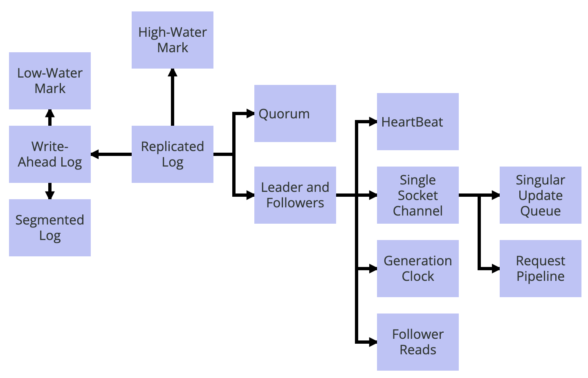

### Kubernetes 或 Kafka 的控制平面

像 [Kubernetes](https://kubernetes.io/) 或 [Kafka](https://kafka.apache.org/) 这样产品的架构是围绕着一个强一致的元数据存储构建起来的。我们可以把它理解成一个模式序列。[一致性内核（Consistent Core）](https://consistent-core.md/)用作一个强一致、可容错的元数据存储。[租约（Lease）](https://lease.md/)用于实现集群节点的分组成员和失效检测。当集群节点失效或更新其元数据时，其它集群节点可以通过[状态监控（State Watch）](https://state-watch.md/)获得通知。在网络失效重试的情况下，[一致性内核（Consistent Core）](https://consistent-core.md/)的实现可以用[幂等接收者（Idempotent Receiver）]忽略集群节点发送的重复请求。[一致性内核（Consistent Core）](https://consistent-core.md/)可以采用可复制的 WAL，上一节已经描述过这个模式序列了。

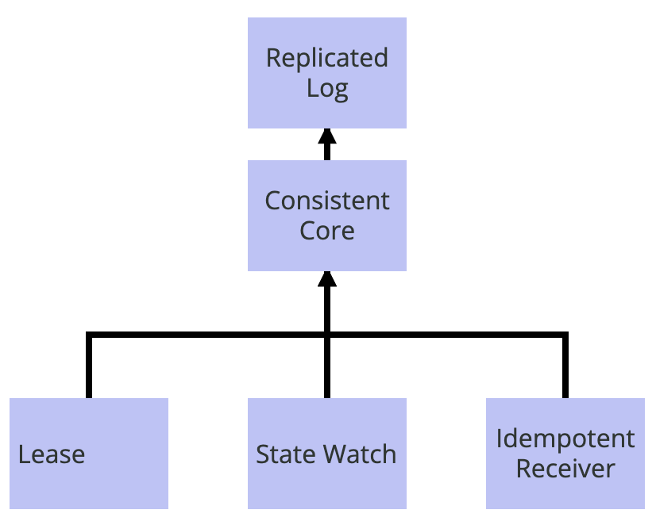

### 逻辑时间戳的使用

各种类型逻辑时间戳的使用也可以看作是一个模式序列。各种产品可以使用 [Gossip 传播（Gossip Dissemination）](https://gossip-dissemination.md/)或[一致性内核（Consistent Core）](https://consistent-core.md/)处理群集节点的分组成员和失效检测。数据存储使用[有版本的值（Versioned Value）](https://versioned-value.md/)就能够确定哪个值是最新的。如果有单台服务器负责更新值，或是使用了[领导者和追随者（Leader and Followers）](https://leader-and-followers.md/)，可以使用 [Lamport 时钟（Lamport Clock）](https://lamport-clock.md/)当做[有版本的值（Versioned Value）](https://versioned-value.md/) 中的版本。当时间戳需要从一天中时间中推导出来时，可以使用[混合时钟（Hybrid Clock）](https://hybrid-clock.md/)，替代简单的 Lamport 时钟（Lamport Clock）。如果允许多台服务器处理客户端请求，更新同样的值，可以使用[版本向量（Version Vector）](https://version-vector.md/)，这样能够检测出在不同集群节点上的并发写入。

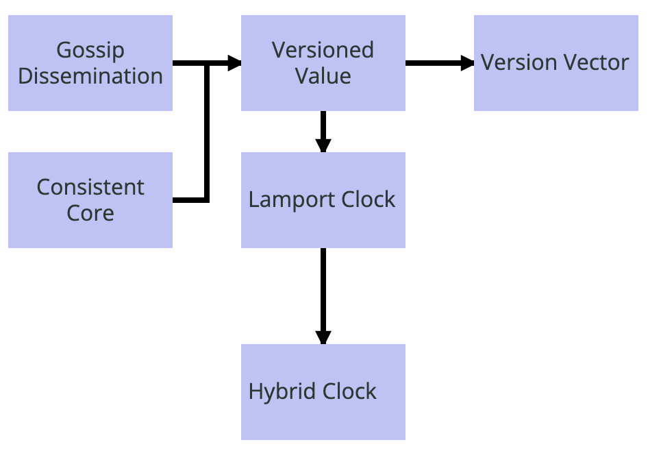

这样，以通用的形式理解问题以及其可复用的解决方案，有助于理解整个系统的构造块。

## 下一步

分布式系统是一个巨大的话题。这里涵盖的这套模式只是其中的一小部分，它们覆盖了不同的主题，展示了一个模式能够如何帮助我们理解和设计分布式问题。我将持续在添加更多的模式，包括分布式系统中解决的下列主题：

- 成员分组以及失效检测
- 分区
- 复制与一致性
- 存储
- 处理

**原文**

https://martinfowler.com/articles/patterns-of-distributed-systems/consistent-core.html

维护一个较小的内核，为大规模数据集群提供更强的一致性，这样，可以在无需实现基于 Quorum 算法的前提下协调服务器行为。

**2021.1.5**

## 问题

集群需要处理大规模的数据，就需要越来越多的服务器。对于服务器集群而言，有一些通用性的需求，比如，选择某个特定的服务器成为某个任务的主节点、管理分组成员信息、将数据分区映射到服务器上等等。这些需求都需要强一致性的保证，也就是说，要有线性一致性。实现本身还要有对失效的容忍。一种常见的方式是，使用一种基于 [Quorum](https://quorum.md/) 且支持失效容忍的一致性算法。但是，基于 Quorum 的系统，其吞吐量会随着集群规模的变大而降低。

## 解决方案

实现一个三五个节点的小集群，提供线性一致性的保证，同时支持失效容忍[1]。一个单独数据集群可以使用小的一致性集群管理元数据，采用类似于[租约（Lease）](https://lease.md/) 之类的原语在集群范围内进行决策。这样一来，数据集群就可以增长到很大的规模，但对于某些需要强一致性保证的动作，可以使用比较小的元数据集群。

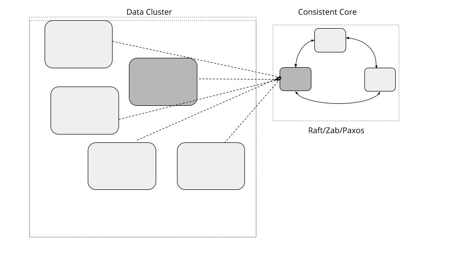

一个典型一致性内核接口应该是下面这个样子：

```java
public interface ConsistentCore
{
    CompletableFuture put(String key, String value);
    List<String> get(String keyPrefix);
    CompletableFuture registerLease(String name, long ttl);

    void refreshLease(String name);

    void watch(String name, Consumer<WatchEvent> watchCallback);
}
```

以最低的标准看，一致性内核提供了一个简单的键值存储机制，用于存储元数据。

### 元数据存储

存储可以用诸如 Raft 之类的共识算法实现。它是可复制的预写日志的一个样例实现，其中的复制由[领导者和追随者（Leader and Followers）](https://leader-and-followers.md/) 进行处理，使用 [Quorum](https://quorum.md/) 的话，可以使用[高水位标记（High-Water Mark）](https://high-water-mark.md/)追踪成功的复制。

### 支持层级结构的存储

一致性内核通常用于存储这样的数据，比如，分组成员、跨服务器的任务分布。一种常见的使用模式是，通过前缀将元数据的类型做一个分类，比如，对于分组成员信息，键值可以存成类似于 /servers/1、servers/2 等等。对于任务分配给哪些服务器，键值可以是 /tasks/task1、/tasks/task2。通常来说，要读取这些数据，所有的键值上都要带上特定的前缀。比如，要读取集群中的所有服务器信息，就要读取所有与以 /servers 为前缀的键值。

下面是一个示例的用法：

服务器只要创建一个属于自己的有 /servers 前缀的键值，就可以将自身注册到一致性内核中。

```plain text
client1.setValue("/servers/1", "{address:192.168.199.10, port:8000}");
client2.setValue("/servers/2", "{address:192.168.199.11, port:8000}");
client3.setValue("/servers/3", "{address:192.168.199.12, port:8000}");
```

客户端只要读取以 /servers 为前缀的键值，就可以获取所有集群中的服务器信息，像下面这样：

```plain text
assertEquals(client1.getValue("/servers"), Arrays.asList(
  "{address:192.168.199.12, port:8000}",
  "{address:192.168.199.11, port:8000}",
  "{address:192.168.199.10, port:8000}"));
```

因为数据存储的层次结构属性，像 [zookeeper](https://zookeeper.apache.org/)、[chubby](https://research.google/pubs/pub27897/) 提供了类似于文件系统的接口，其中，用户可以创建目录和文件，或是节点，有父子节点概念的那种。[etcd3](https://coreos.com/blog/etcd3-a-new-etcd.html) 有扁平的键值空间，这样它就有能力获取更大范围的键值。

### 处理客户端交互

一致性内核功能的一个关键需求是，客户端如何与内核进行交互。下面是客户端与一致性内核协同工作的关键方面。

### 找到领导者

所有的操作都要在领导者上执行，这是至关重要的，因此，客户端程序库需要先找到领导者服务器。要做到这一点，有两种可能的方式。

- 一致性内核的追随者服务器知道当前的领导者，因此，如果客户端连接追随者，它会返回 领导者的地址。客户端可以直接连接应答中给出的领导者。值得注意的是，客户端尝试连接时，服务器可能正处于领导者选举过程中。在这种情况下，服务器无法返回领导者地址，客户端需要等待片刻，再尝试连接另外的服务器。
- 服务器实现转发机制，将所有的客户端请求转发给领导者。这样就允许客户端连接任意的服务器。同样，如果服务器处于领导者 选举过程中，客户端需要不断重试，直到领导者选举成功，一个合法的领导者获得确认。
类似于 zookeeper 和 etcd 这样的产品都实现了这种方式，它们允许追随者服务器处理只读请求，以免领导者面对大量客户端的只读请求时出现瓶颈。这就降低了客户端基于请求类型去连接领导者或追随者的复杂性。

一个找到领导者的简单机制是，尝试连接每一台服务器，尝试发送一个请求，如果服务器不是领导者，它给出的应答就是一个重定向的应答。

```java
private void establishConnectionToLeader(List<InetAddressAndPort> servers)
{
    for (InetAddressAndPort server : servers)
    {
        try
        {
            SingleSocketChannel socketChannel = new SingleSocketChannel(server, 10);
            logger.info("Trying to connect to " + server);
            RequestOrResponse response = sendConnectRequest(socketChannel);
            if (isRedirectResponse(response))
            {
                redirectToLeader(response);
                break;
                } else if (isLookingForLeader(response)) {
                logger.info("Server is looking for leader. Trying next server");
                continue;
                } else {
                //we know the leader
                logger.info("Found leader. Establishing a new connection.");
                newPipelinedConnection(server);
                break;
            }
            } catch (IOException e) {
            logger.info("Unable to connect to " + server);
            //try next server
        }
    }
}

private boolean isLookingForLeader(RequestOrResponse requestOrResponse)
{
    return requestOrResponse.getRequestId() == RequestId.LookingForLeader.getId();
}

private void redirectToLeader(RequestOrResponse response)
{
    RedirectToLeaderResponse redirectResponse = deserialize(response);
    new PipelinedConnection(redirectResponse.leaderAddress);
    logger.info("Connected to the new leader "
    + redirectResponse.leaderServerId
    + " " + redirectResponse.leaderAddress
    + ". Checking connection");
}

private boolean isRedirectResponse(RequestOrResponse requestOrResponse)
{
    return requestOrResponse.getRequestId() == RequestId.RedirectToLeader.getId();
}
```

仅仅建立 TCP 连接还不够，我们还需要知道服务器能否处理我们的请求。因此，客户端会给服务器发送一个特殊的连接请求，服务器需要响应，它是可以处理请求，还是要重定向到领导者服务器上。

```java
private RequestOrResponse sendConnectRequest(SingleSocketChannel socketChannel) throws IOException
{
    RequestOrResponse request = new RequestOrResponse(RequestId.ConnectRequest.getId(), "CONNECT", 0);
    try
    {
        return socketChannel.blockingSend(request);
        } catch (IOException e) {
        resetConnectionToLeader();
        throw e;
    }
}
```

如果既有的领导者失效了，同样的技术将用于识别集群中新选出的领导者。

一旦连接成功，客户端将同领导者服务器间维持一个[单一 Socket 通道（Single Socket Channel）](https://single-socket-channel.md/)。

### 处理重复请求

在失效的场景下，客户端可以重新连接新的 领导者，重新发送请求。但是，如果这些请求在失效的领导者之前已经处理过了，这就有可能产生重复。因此，至关重要的一点是，服务器需要有一种机制，忽略重复的请求。[幂等接收者（Idempotent Receiver）](https://idempotent-receiver.md/)模式就是用来实现重复检测的。

使用[租约（Lease）](https://lease.md/)，可以在一组服务器上协调任务。同样的技术也可以用于实现分组成员信息和失效检测机制。

[状态监控（State Watch）](https://state-watch.md/)，可以在元数据发生改变，或是基于时间的租约到期时，获得通知。

## 示例

众所周知，Google 使用 [chubby](https://research.google/pubs/pub27897/) 锁服务进行协调和元数据管理。

[kafka](https://kafka.apache.org/) 使用 [zookeeper](https://zookeeper.apache.org/) 管理元数据，以及做一些类似于为集群选举领导者之类的决策。Kafka 中[提议的一个架构调整](https://cwiki.apache.org/confluence/display/KAFKA/KIP-500%3A+Replace+ZooKeeper+with+a+Self-Managed+Metadata+Quorum)是在将来使用自己基于 [raft](https://raft.github.io/) 的控制器集群替换 Zookeeper。

[bookkeeper](https://bookkeeper.apache.org/) 使用 Zookeeper 管理集群的元数据。

[kubernetes](https://kubernetes.io/) 使用 [etcd](https://etcd.io/) 进行协调、管理集群的元数据和分组成员信息。

所有的大数据存储和处理系统类似于 [hdfs](https://hadoop.apache.org/docs/r3.0.0/hadoop-project-dist/hadoop-hdfs/HDFSHighAvailabilityWithNFS.html)、[spark](http://spark.apache.org/docs/latest/spark-standalone.html#standby-masters-with-zookeeper)、[flink](https://ci.apache.org/projects/flink/flink-docs-release-1.11/ops/jobmanager_high_availability.html) 都使用 [zookeeper](https://zookeeper.apache.org/) 实现高可用以及集群协调。

**原文**

https://martinfowler.com/articles/patterns-of-distributed-systems/follower-reads.html

由追随者为读取请求提供服务，获取更好的吞吐和更低的延迟。

**2021.7.1**

## 问题

使用领导者和追随者模式时，如果有太多请求发给领导者，它可能会出现过载。此外，在多数据中心的情况下，客户端如果在远程的数据中心，向领导者发送的请求可能会有额外的延迟。

## 解决方案

当写请求要到领导者那去维持一致性，只读请求就会转到最近的追随者。当客户端大多都是只读的，这种做法就特别有用。

值得注意的是，从追随者那里读取的客户端得到可能是旧值。领导者和追随者之间总会存在一个复制滞后，即使是在像 [Raft](https://raft.github.io/) 这样实现共识算法的系统中。这是因为即使领导者知道哪些值提交过了，它也需要另外一个消息将这个信息传达给跟随者。因此，从追随者服务器上读取信息只能用于“可以容忍稍旧的值”的情况。

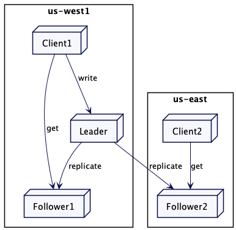

### 找到最近的节点

集群节点要额外维护其位置的元数据。

```java
class ReplicaDescriptor…
public class ReplicaDescriptor
{
    public ReplicaDescriptor(InetAddressAndPort address, String region)
    {
        this.address = address;
        this.region = region;
    }
    InetAddressAndPort address;
    String region;

    public InetAddressAndPort getAddress()
    {
        return address;
    }

    public String getRegion()
    {
        return region;
    }
}
```

然后，集群客户端可以根据自己的区域选取本地的副本。

```java
class ClusterClient
{
    public List<String> get(String key)
    {
        List<ReplicaDescriptor> allReplicas = allFollowerReplicas(key);
        ReplicaDescriptor nearestFollower = findNearestFollowerBasedOnLocality(allReplicas, clientRegion);
        GetValueResponse getValueResponse = sendGetRequest(nearestFollower.getAddress(), new GetValueRequest(key));
        return getValueResponse.getValue();
    }

    ReplicaDescriptor findNearestFollowerBasedOnLocality(List<ReplicaDescriptor> followers, String clientRegion)
    {
        List<ReplicaDescriptor> sameRegionFollowers = matchLocality(followers, clientRegion);
        List<ReplicaDescriptor> finalList = sameRegionFollowers.isEmpty()?followers:sameRegionFollowers;
        return finalList.get(0);
    }

    private List<ReplicaDescriptor> matchLocality(List<ReplicaDescriptor> followers, String clientRegion)
    {
        return followers.stream().filter(rd -> clientRegion.equals(rd.region)).collect(Collectors.toList());
    }

}
```

例如，如果有两个追随者副本，一个在美国西部（us-west），另一个在美国东部（us-east）。美国东部的客户端就会连接到美国东部的副本上。

```java
class CausalKVStoreTest
{
    @Test
    public void getFollowersInSameRegion()
    {
        List<ReplicaDescriptor> followers = createReplicas("us-west", "us-east");
        ReplicaDescriptor nearestFollower = new ClusterClient(followers, "us-east").findNearestFollower(followers);
        assertEquals(nearestFollower.getRegion(), "us-east");
    }
}
```

集群客户端或协调的集群节点也会追踪其同集群节点之间可观察的延迟。它可以发送周期性的心跳来获取延迟，并根据它选出延迟最小的追随者。为了做一个更公平的选择，像 [mongodb](https://www.mongodb.com/) 或 [cockroachdb](https://www.cockroachlabs.com/docs/stable/) 这样的产品会把延迟当做滑动平均来计算。集群节点一般会同其它集群节点之间维护一个[单一 Socket 通道（Single Socket Channel）](https://single-socket-channel.md/)进行通信。单一 Socket 通道（Single Socket Channel）会使用心跳（HeartBeat）进行连接保活。因此，获取延迟和计算滑动移动平均就可以很容易地实现。

```java
class WeightedAverage…
public class WeightedAverage
{
    long averageLatencyMs = 0;
    public void update(long heartbeatRequestLatency)
    {
        //Example implementation of weighted average as used in Mongodb
        //The running, weighted average round trip time for heartbeat messages to the target node.
        // Weighted 80% to the old round trip time, and 20% to the new round trip time.
        averageLatencyMs = averageLatencyMs == 0 ? heartbeatRequestLatency : (averageLatencyMs * 4 + heartbeatRequestLatency) / 5;
    }

    public long getAverageLatency()
    {
        return averageLatencyMs;
    }
}

class ClusterClient…
private Map<InetAddressAndPort, WeightedAverage> latencyMap = new HashMap<>();
private void sendHeartbeat(InetAddressAndPort clusterNodeAddress)
{
    try
    {
        long startTimeNanos = System.nanoTime();
        sendHeartbeatRequest(clusterNodeAddress);
        long endTimeNanos = System.nanoTime();
        WeightedAverage heartbeatStats = latencyMap.get(clusterNodeAddress);
        if (heartbeatStats == null)
        {
            heartbeatStats = new WeightedAverage();
            latencyMap.put(clusterNodeAddress, new WeightedAverage());
        }

        heartbeatStats.update(endTimeNanos - startTimeNanos);
        } catch (NetworkException e) {
        logger.error(e);
    }
}
```

This latency information can then be used to pick up the follower with the least network latency.

```java
class ClusterClient…
ReplicaDescriptor findNearestFollower(List<ReplicaDescriptor> allFollowers)
{
    List<ReplicaDescriptor> sameRegionFollowers = matchLocality(allFollowers, clientRegion);
    List<ReplicaDescriptor> finalList = sameRegionFollowers.isEmpty() ? allFollowers:sameRegionFollowers;
    return finalList.stream().sorted((r1, r2) ->
    {
        if (!latenciesAvailableFor(r1, r2))
        {
            return 0;
        }
        return Long.compare(latencyMap.get(r1).getAverageLatency(),
        latencyMap.get(r2).getAverageLatency());
        }).findFirst().get();
}

private boolean latenciesAvailableFor(ReplicaDescriptor r1, ReplicaDescriptor r2)
{
    return latencyMap.containsKey(r1) && latencyMap.containsKey(r2);
}
```

这样，就可以利用延迟信息选取网络延迟最小的追随者。

```java
class ClusterClient…
ReplicaDescriptor findNearestFollower(List<ReplicaDescriptor> allFollowers)
{
    List<ReplicaDescriptor> sameRegionFollowers = matchLocality(allFollowers, clientRegion);
    List<ReplicaDescriptor> finalList = sameRegionFollowers.isEmpty() ? allFollowers : sameRegionFollowers;
    return finalList.stream().sorted((r1, r2) ->
    {
        if (!latenciesAvailableFor(r1, r2))
        {
            return 0;
        }
        return Long.compare(latencyMap.get(r1).getAverageLatency(),
        latencyMap.get(r2).getAverageLatency());
        }).findFirst().get();
}

private boolean latenciesAvailableFor(ReplicaDescriptor r1, ReplicaDescriptor r2)
{
    return latencyMap.containsKey(r1) && latencyMap.containsKey(r2);
}
```

### 断连或缓慢的追随者

追随者可能会与领导者之间失去联系，停止获得更新。在某些情况下，追随者可能会受到慢速磁盘的影响，阻碍整个的复制过程，这会导致追随者滞后于领导者。追随者追踪到其是否有一段时间没有收到领导者的消息，在这种情况下，可以停止对用户请求进行服务。

比如，像 [mongodb](https://www.mongodb.com/) 这样的产品会选择带有[最大可接受滞后时间（maximum allowed lag time）](https://docs.mongodb.com/manual/core/read-preference-staleness/#std-label-replica-set-read-preference-max-staleness)的副本。如果副本滞后于领导者超过了这个最大时间，就不会选择它继续对用户请求提供服务。在 [kafka](https://kafka.apache.org/) 中，如果追随者检测到消费者请求的偏移量过大，它就会给出一个 OFFSET_OUT_OF_RANGE 的错误。我们就预期消费者会与领导者进行通信。

### 读自己写

从追随者服务器读取可能会有问题，当客户端写入一些东西，然后立即尝试读取它时，即便是这样常规的场景，也可能给出令人吃惊的结果。

考虑这样一个情况，一个客户端注意到一些书籍数据有误，比如，“title”: “Nitroservices”。通过一次写操作，它把数据修正成 “title”: “Microservices”，这个数据要发到领导者那里。然后，这个客户端要立即读取这个值，但是，这个读的请求到了追随者，也许这个追随者还没有更新。

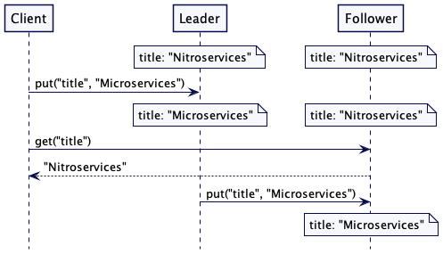

图 2：从追随者读取陈旧的值

This can be a common problem. For example, untill very recently Amazon S3 did not prevent this.

这可能是个常见的问题。比如，[直到最近](https://aws.amazon.com/about-aws/whats-new/2020/12/amazon-s3-now-delivers-strong-read-after-write-consistency-automatically-for-all-applications/)，Amazon 的 S3 也并没有完全阻止这个问题。

为了解决这个问题，每次写入时，服务器不仅存储新值，还有存储一个单调递增的版本戳。这个版本戳可以是[高水位标记（High-Water Mark）](https://high-water-mark.md/)或是[混合时钟（Hybrid Clock）](https://hybrid-clock.md/)。然后，如果客户端希望稍后读取该值的话，它就把这个版本戳当做读取请求的一部分。如果读取请求到了追随者那里，它就会检查其存储的值，看它是等于或晚于请求的版本戳。如果不是，它就会等待，直到有了最新的版本，再返回该值。通过这种做法，这个客户端总会读取与它写入一直的值——这种做法通常称为“读自己写”的一致性。

请求流程如下所示。为了修正一个写错的值，“title”: “Microservices” 写到了领导者。在返回给客户端的应答中，领导者返回版本 2。当客户端尝试读取 “title” 的值时，它会在请求中带上版本 2。接收到这个请求的追随者服务器会检查自己的版本号是否是最新的。因为追随者的版本号还是 1，它就会等待，知道从领导者那里获取那个版本。一旦获得匹配（更晚的）版本，它就完成这个读取请求，返回值 “Microservices”。

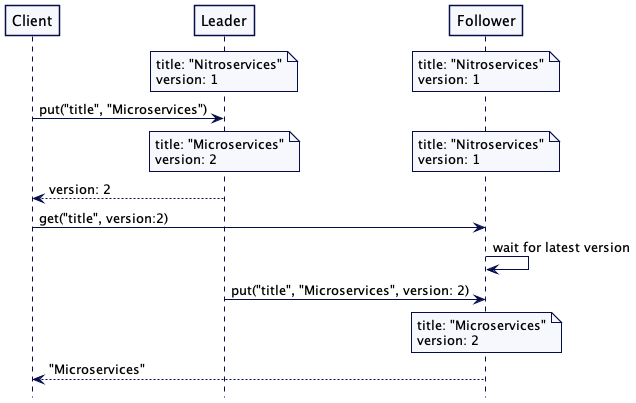

图 3：在追随者读自己写

键值存储的代码如下所示。值得注意的是，追随者可能落后太多，或者已经与领导者失去连接。因此，它不会无限地等待。有一个配置的超时值，如果追随者无法在超时时间内得到更新，它会给客户端返回一个错误的应答。客户端之后尝试从其他追随者那里读取。

```java
class ReplicatedKVStore…
Map<Integer, CompletableFuture> waitingRequests = new ConcurrentHashMap<>();public CompletableFuture<Optional<String>> get(String key, int atVersion) {    if(this.server.serverRole() == ServerRole.FOLLOWING) {        //check if we have the version with us;        if (!isVersionUptoDate(atVersion)) {            //wait till we get the latest version.            CompletableFuture<Optional<String>> future = new CompletableFuture<>();            //Timeout if version does not progress to required version            //before followerWaitTimeout ms.            future.orTimeout(config.getFollowerWaitTimeoutMs(), TimeUnit.MILLISECONDS);            waitingRequests.put(atVersion, future);            return future;        }    }    return CompletableFuture.completedFuture(mvccStore.get(key, atVersion));}private boolean isVersionUptoDate(int atVersion) {    Optional<Integer> maxVersion = mvccStore.getMaxVersion();    return maxVersion.map(v -> v >= atVersion).orElse(false);}
```

一旦键值存储的内容前进到客户端请求的版本，它就可以给客户端发送应答了。

```java
class ReplicatedKVStore…

private Response applyWalEntry(WALEntry walEntry)
{
    Command command = deserialize(walEntry);
    if (command instanceof SetValueCommand)
    {
        return applySetValueCommandsAndCompleteClientRequests((SetValueCommand) command);
    }
    throw new IllegalArgumentException("Unknown command type " + command);
}

private Response applySetValueCommandsAndCompleteClientRequests(SetValueCommand setValueCommand)
{
    getLogger().info("Setting key value " + setValueCommand);
    version = version + 1;
    mvccStore.put(new VersionedKey(setValueCommand.getKey(), version), setValueCommand.getValue());
    completeWaitingFuturesIfFollower(version, setValueCommand.getValue());
    Response response = Response.success(version);
    return response;
}

private void completeWaitingFuturesIfFollower(int version, String value)
{
    CompletableFuture completableFuture = waitingRequests.remove(version);
    if (completableFuture != null)
    {
        completableFuture.complete(Optional.of(value));
    }
}
```

### 线性读

有时，读取请求需要获取最新的可用数据，复制的滞后是无法容忍的。在这种情况下，读取请求需要重定向到领导者。这是一个常见的设计问题，通常由[一致性内核（Consistent Core）](https://consistent-core.md/)来解决。

## 示例

[neo4j](https://neo4j.com/docs/operations-manual/current/clustering/) 允许建立[因果集群（causal clusters）](https://neo4j.com/docs/operations-manual/current/clustering-advanced/lifecycle/#causal-clustering-lifecycle)。每次写操作会返回一个书签，在读取副本上执行查询时会返回这个书签。这个书签会确保客户端总能获得写在书签处的值。

[mongodb](https://www.mongodb.com/) 会在其副本集中保持[因果一致性（causal consistency）](https://docs.mongodb.com/manual/core/causal-consistency-read-write-concerns/)。写操作会返回一个操作时间（operationTime）；这个时间会在随后的读请求中传递，以确保读请求能够返回这个读请求之前写入的数据。

[cockroachdb](https://www.cockroachlabs.com/docs/stable/) 允许客户端从[追随者服务器](https://www.cockroachlabs.com/docs/v20.2/follower-reads.html)上进行读取。领导者服务器会在写操作完成之后发布最新的时间戳，称之为封闭时间戳（closed timestamps）。如果追随者在封闭的时间戳上有值，追随者就允许读取该值。

Kafka 允许消费来自追随者服务器的消息。追随者知道领导者的[高水位标记（High-Water Mark）](https://high-water-mark.md/)。在 Kafka 的设计中，追随者不会等待最新的更新，而是会给消费者返回 OFFSET_NOT_AVAILABLE 错误，期待消费者进行重试。

**原文**

https://martinfowler.com/articles/patterns-of-distributed-systems/generation.html

一个单调递增的数字，表示服务器的世代。

**2020.8.20**

又称：Term、Epoch 或世代（Generation）

## 问题

在[领导者和追随者（Leader and Followers）](https://leader-and-followers.md/)的构建过程中，有一种可能性，领导者临时同追随者失联了。可能是因为垃圾回收造成而暂停，也可能是临时的网络中断，这些都会让领导者进程与追随者之间失联。在这种情况下，领导者进程依旧在运行，暂停之后或是网络中断停止之后，它还是会尝试发送复制请求给追随者。这么做是有危险的，因为与此同时，集群余下的部分可能已经选出了一个新的领导者，接收来自客户端的请求。有一点非常重要，集群余下的部分要能检测出有的请求是来自原有的领导者。原有的领导者本身也要能检测出，它是临时从集群中断开了，然后，采用必要的修正动作，交出领导权。

## 解决方案

维护一个单调递增的数字，表示服务器的世代。每次选出新的领导者，这个世代都应该递增。即便服务器重启，这个世代也应该是可用的，因此，它应该存储在[预写日志（Write-Ahead Log）](https://write-ahead-log.md/)每一个条目里。在[高水位标记（High-Water Mark）](https://high-water-mark.md/)里，我们讨论过，追随者会使用这个信息找出日志中冲突的部分。

启动时，服务器要从日志中读取最后一个已知的世代。

```java
class ReplicationModule
{
    this.replicationState = new ReplicationState(config, wal.getLastLogEntryGeneration());
}
```

采用[领导者和追随者（Leader and Followers）](https://leader-and-followers.md/)模式，选举新的领导者选举时，服务器对这个世代的值进行递增。

```java
class ReplicationModule
{
    private void startLeaderElection()
    {
        replicationState.setGeneration(replicationState.getGeneration() + 1);
        registerSelfVote();
        requestVoteFrom(followers);
    }
}
```

服务器会把世代当做投票请求的一部分发给其它服务器。在这种方式下，经过了成功的领导者选举之后，所有的服务器都有了相同的世代。一旦选出新的领导者，追随者就会被告知新的世代。

```java
follower (class ReplicationModule...)

private void becomeFollower(int leaderId, Long generation)
{
    replicationState.setGeneration(generation);
    replicationState.setLeaderId(leaderId);
    transitionTo(ServerRole.FOLLOWING);
}
```

自此之后，领导者会在它发给追随者的每个请求中都包含这个世代信息。它也包含在发给追随者的每个[心跳（HeartBeat）](https://heartbeat.md/)消息里，也包含在复制请求中。

领导者也会把世代信息持久化到[预写日志（Write-Ahead Log）](https://write-ahead-log.md/)的每一个条目里。

```java
leader (class ReplicationModule...)

Long appendToLocalLog(byte[] data)
{
    var logEntryId = wal.getLastLogEntryId() + 1;
    var logEntry = new WALEntry(logEntryId, data, EntryType.DATA, replicationState.getGeneration());
    return wal.writeEntry(logEntry);
}
```

按照这种做法，它还会持久化在追随者日志中，作为[领导者和追随者（Leader and Followers）](https://leader-and-followers.md/)复制机制的一部分。

如果追随者得到了一个来自已罢免领导的消息，追随者就可以告知其世代过低。追随者会给出一个失败的应答。

```java
follower (class ReplicationModule...)

Long currentGeneration = replicationState.getGeneration();

if (currentGeneration > replicationRequest.getGeneration())
{
    return new ReplicationResponse(FAILED, serverId(), currentGeneration, wal.getLastLogEntryId());
}
```

当领导者得到了一个失败的应答，它就会变成追随者，期待与新的领导者建立通信。

```java
Old leader (class ReplicationModule...)

if (!response.isSucceeded())
{
    stepDownIfHigherGenerationResponse(response);
    return;
}

private void stepDownIfHigherGenerationResponse(ReplicationResponse replicationResponse)
{
    if (replicationResponse.getGeneration() > replicationState.getGeneration())
    {
        becomeFollower(-1, replicationResponse.getGeneration());
    }
}
```

考虑一下下面这个例子。在一个服务器集群里，leader1 是既有的领导者。集群里所有服务器的世代都是 1。leader1 持续发送心跳给追随者。leader1 产生了一次长的垃圾收集暂停，比如说，5 秒。追随者没有得到心跳，超时了，然后选举出新的领导者。新的领导者将世代递增到 2。垃圾收集暂停结束之后，leader1 持续发送请求给其它服务器。追随者和新的领导者现在都是世代 2 了，拒绝了其请求，发送一个失败应答，其中的世代是 2。leader1 处理失败的应答，退下来成为一个追随者，将世代更新成 2。

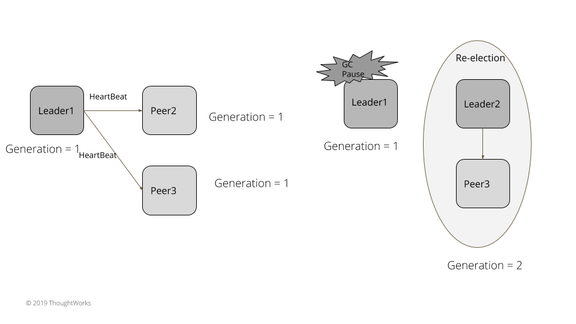

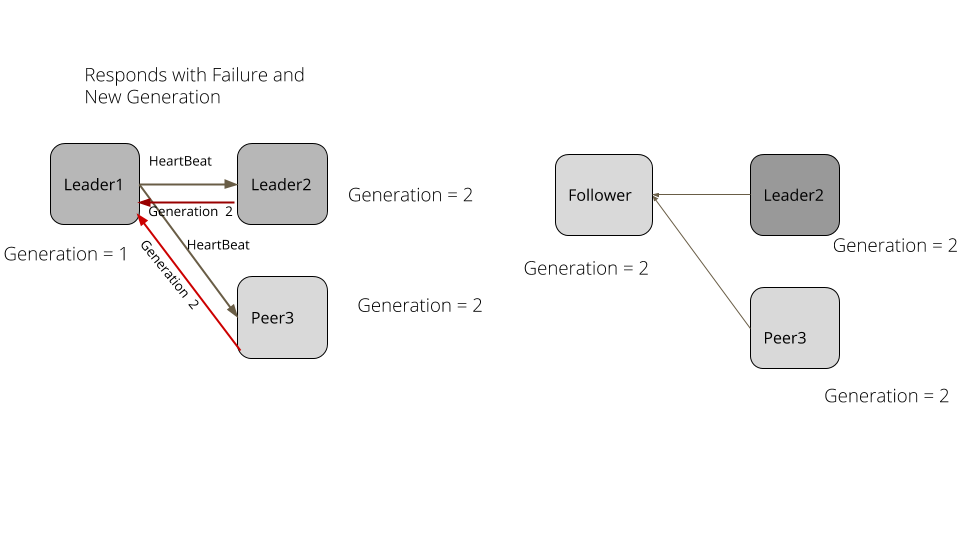

图1：世代

## 示例

### Raft

[Raft](https://raft.github.io/) 使用了 Term 的概念标记领导者世代。

### Zab

在 [Zookeeper](https://zookeeper.apache.org/doc/r3.4.13/zookeeperInternals.html#sc_atomicBroadcast) 里，每个 epoch 数是作为每个事务 ID 的一部分进行维护的。因此，每个持久化在 Zookeeper 里的事务都有一个世代，通过 epoch 表示。

### Cassandra

在 [Cassandra](http://cassandra.apache.org/) 里，每个服务器都存储了一个世代数字，每次服务器重启时都会递增。世代信息持久化在系统的键值空间里，也作为 Gossip 消息的一部分传给其它服务器。服务器接收到 Gossip 消息之后，将它知道的世代值与 Gossip 消息的世代值进行比较。如果 Gossip 消息中世代更高，它就知道服务器重启了，然后，丢弃它维护的关于这个服务器的所有状态，请求新的状态。

### Kafka 中的 Epoch

[Kafka](https://kafka.apache.org/) 每次为集群选出新的控制器，都会创建一个 epoch 数，将其存在 Zookeeper 里。epoch 会包含在集群里从控制器发到其它服务器的每个请求中。它还维护了另外一个 epoch，称为 [LeaderEpoch](https://cwiki.apache.org/confluence/display/KAFKA/KIP-101+-+Alter+Replication+Protocol+to+use+Leader+Epoch+rather+than+High+Watermark+for+Truncation)，以便了解一个分区的追随者是否落后于其[高水位标记（High-Water Mark）](https://high-water-mark.md/)。

**原文**

https://martinfowler.com/articles/patterns-of-distributed-systems/gossip-dissemination.html

使用节点的随机选择进行信息传递，以确保信息可以到达集群中的所有节点，而不会淹没网络。

**2021.6.17**

## 问题

在拥有多个节点的集群中，每个节点都要向集群中的所有其它节点传递其所拥有的元数据信息，无需依赖于共享存储。在一个很大的集群里，如果所有的服务器要和所有其它的服务器通信，就会消耗大量的网络带宽。信息应该能够到达所有节点，即便有些网络连接遇到一些问题。

在大型的集群中，需要考虑下面一些东西：

- 对每台服务器产生的信息数量进行固定的限制
- 消息不应消耗大量的网络带宽。应该有一个上限，比如说几百 Kbs，确保不会因为集群中有过多的消息影响到应用的数据传输。
- 元数据的传播应该可以容忍网络和部分服务器的失效。即便有一些网络链接中断，或是有部分服务器失效，消息也能到达所有的服务器节点。

正如边栏中所讨论的，Gossip 式的通信满足了所有这些要求。

每个集群节点都把元数据存储为一个键值对列表，每个键值都到关联集群的一个节点，就像下面这样：

```java
class Gossip
{
    Map<NodeId, NodeState> clusterMetadata = new HashMap<>();

    class NodeState…
    Map<String, VersionedValue> values = new HashMap<>();
}
```

启动时，每个集群节点都会添加关于自己的元数据，这些元数据需要传播给其他节点。元数据的一个例子可以是节点监听的 IP 地址和端口，它负责的分区等等。Gossip 实例需要知晓至少一个其它节点的情况，以便开始进行 Gossip 通信。有一个集群节点需要众所周知，用于初始化 Gossip 实例，这个节点称为种子节点（a seed node），或者创始节点（introducer）。任何节点都可以充当创始节点。

```java
class Gossip
{
    public Gossip(InetAddressAndPort listenAddress,
    List<InetAddressAndPort> seedNodes,
    String nodeId) throws IOException
    {
        this.listenAddress = listenAddress;
        //filter this node itself in case its part of the seed nodes
        this.seedNodes = removeSelfAddress(seedNodes);
        this.nodeId = new NodeId(nodeId);
        addLocalState(GossipKeys.ADDRESS, listenAddress.toString());
        this.socketServer = new NIOSocketListener(newGossipRequestConsumer(), listenAddress);
    }

    private void addLocalState(String key, String value)
    {
        NodeState nodeState = clusterMetadata.get(listenAddress);
        if (nodeState == null)
        {
            nodeState = new NodeState();
            clusterMetadata.put(nodeId, nodeState);
        }
        nodeState.add(key, new VersionedValue(value, incremenetVersion()));
    }
}
```

每个集群节点都会调度一个 job 用以定期将其拥有的元数据传输给其他节点。

```java
class Gossip
{
    private ScheduledThreadPoolExecutor gossipExecutor = new ScheduledThreadPoolExecutor(1);
    private long gossipIntervalMs = 1000;
    private ScheduledFuture<?> taskFuture;

    public void start()
    {
        socketServer.start();
        taskFuture = gossipExecutor.scheduleAtFixedRate(()-> doGossip(), gossipIntervalMs, gossipIntervalMs, TimeUnit.MILLISECONDS);
    }
}
```

调用调度任务时，它会从元数据集合的服务器列表中随机选取一小群节点。我们会定义一个小的常数，称为 Gossip 扇出，它会确定会选取多少节点称为 Gossip 的目标。如果什么都不知道，它会随机选取一个种子节点，然后发送其拥有的元数据集合给该节点。

```java
class Gossip
{
    public void doGossip()
    {
        List<InetAddressAndPort> knownClusterNodes = liveNodes();
        if (knownClusterNodes.isEmpty())
        {
            sendGossip(seedNodes, gossipFanout);
            } else {
            sendGossip(knownClusterNodes, gossipFanout);
        }
    }

    private List<InetAddressAndPort> liveNodes()
    {
        Set<InetAddressAndPort> nodes = clusterMetadata.values()
        .stream()
        .map(n -> InetAddressAndPort.parse(n.get(GossipKeys.ADDRESS).getValue()))
        .collect(Collectors.toSet());
        return removeSelfAddress(nodes);
    }

    private void sendGossip(List<InetAddressAndPort> knownClusterNodes, int gossipFanout)
    {
        if (knownClusterNodes.isEmpty())
        {
            return;
        }

        for (int i = 0; i < gossipFanout; i++)
        {
            InetAddressAndPort nodeAddress = pickRandomNode(knownClusterNodes);
            sendGossipTo(nodeAddress);
        }
    }

    private void sendGossipTo(InetAddressAndPort nodeAddress)
    {
        try
        {
            getLogger().info("Sending gossip state to " + nodeAddress);
            SocketClient<RequestOrResponse> socketClient = new SocketClient(nodeAddress);
            GossipStateMessage gossipStateMessage = new GossipStateMessage(this.clusterMetadata);
            RequestOrResponse request = createGossipStateRequest(gossipStateMessage);
            byte[] responseBytes = socketClient.blockingSend(request);
            GossipStateMessage responseState = deserialize(responseBytes);
            merge(responseState.getNodeStates());
            } catch (IOException e) {
            getLogger().error("IO error while sending gossip state to " + nodeAddress, e);
        }
    }

    private RequestOrResponse createGossipStateRequest(GossipStateMessage gossipStateMessage)
    {
        return new RequestOrResponse(RequestId.PushPullGossipState.getId(), JsonSerDes.serialize(gossipStateMessage), correlationId++);
    }
}
```

接收 Gossip 消息的集群节点会检查其拥有的元数据，发现三件事。

- 传入消息中的值，且不再该节点状态集合中
- 该节点拥有，但不再传入的 Gossip 消息中
- 节点拥有传入消息的值，这时会选择版本更高的值

稍后，它会将缺失的值添加到自己的状态集合中。传入消息中若有任何值缺失，就会在应答中返回这些值。

发送 Gossip 消息的集群节点会将从 Gossip 应答中得到值添加到自己的状态中。

```java
class Gossip…

private void handleGossipRequest(org.distrib.patterns.common.Message<RequestOrResponse> request)
{
    GossipStateMessage gossipStateMessage = deserialize(request.getRequest());
    Map<NodeId, NodeState> gossipedState = gossipStateMessage.getNodeStates();
    getLogger().info("Merging state from " + request.getClientSocket());
    merge(gossipedState);
    Map<NodeId, NodeState> diff = delta(this.clusterMetadata, gossipedState);
    GossipStateMessage diffResponse = new GossipStateMessage(diff);
    getLogger().info("Sending diff response " + diff);
    request.getClientSocket().write(new RequestOrResponse(RequestId.PushPullGossipState.getId(), JsonSerDes.serialize(diffResponse), request.getRequest().getCorrelationId()));
}

public Map<NodeId, NodeState> delta(Map<NodeId, NodeState> fromMap, Map<NodeId, NodeState> toMap)
{
    Map<NodeId, NodeState> delta = new HashMap<>();
    for (NodeId key : fromMap.keySet())
    {
        if (!toMap.containsKey(key))
        {
            delta.put(key, fromMap.get(key));
            continue;
        }

        NodeState fromStates = fromMap.get(key);
        NodeState toStates = toMap.get(key);
        NodeState diffStates = fromStates.diff(toStates);
        if (!diffStates.isEmpty())
        {
            delta.put(key, diffStates);
        }
    }

    return delta;
}

public void merge(Map<NodeId, NodeState> otherState)
{
    Map<NodeId, NodeState> diff = delta(otherState, this.clusterMetadata);
    for (NodeId diffKey : diff.keySet())
    {
        if(!this.clusterMetadata.containsKey(diffKey))
        {
            this.clusterMetadata.put(diffKey, diff.get(diffKey));
            } else {
            NodeState stateMap = this.clusterMetadata.get(diffKey);
            stateMap.putAll(diff.get(diffKey));
        }
    }
}
```

每隔一秒，这个过程就会在集群的每个节点上发生一次，每次都会选择不同的节点进行状态交换。

### 避免不必要的状态交换

上面的代码例子显示，在 Gossip 消息里发送了节点的完整状态。对于新加入的节点，这是没问题的，但一旦状态是最新的，就没有必要发送完整状态了。集群节点只需要发送自上个 Gossip 消息以来的状态变化。为了实现这一点，每个节点都维护着一个版本号，每当本地添加了一个新的元数据条目，这个版本就会递增一次。

```java
class Gossip…

private int gossipStateVersion = 1;

private int incremenetVersion()
{
    return gossipStateVersion++;
}
```

集群元数据的每个值都维护有一个版本号。这就是[有版本的值（Versioned Value）](https://versioned-value.md/)这个模式的一个例子。

```java
class VersionedValue
{
    int version;
    String value;

    public VersionedValue(String value, int version)
    {
        this.version = version;
        this.value = value;
    }

    public int getVersion()
    {
        return version;
    }
    public String getValue()
    {
        return value;
    }
}
```

之后，每个 Gossip 循环都可以交换从特定版本开始的状态。

```java
class Gossip
{
    private void sendKnownVersions(InetAddressAndPort gossipTo) throws IOException
    {
        Map<NodeId, Integer> maxKnownNodeVersions = getMaxKnownNodeVersions();
        RequestOrResponse knownVersionRequest = new RequestOrResponse(RequestId.GossipVersions.getId(), JsonSerDes.serialize(new GossipStateVersions(maxKnownNodeVersions)), 0);
        SocketClient<RequestOrResponse> socketClient = new SocketClient(gossipTo);
        byte[] knownVersionResponseBytes = socketClient.blockingSend(knownVersionRequest);
    }

    private Map<NodeId, Integer> getMaxKnownNodeVersions()
    {
        return clusterMetadata.entrySet()
        .stream()
        .collect(Collectors.toMap(e -> e.getKey(), e -> e.getValue().maxVersion()));
    }
    }

    class NodeState
    {
        public int maxVersion()
        {
            return values.values().stream().map(v -> v.getVersion()).max(Comparator.naturalOrder()).orElse(0);
        }
    }
```

再之后，接收节点只会把版本号大于请求中版本号的那些值发送出去。

```java
class Gossip
{
    Map<NodeId, NodeState> getMissingAndNodeStatesHigherThan(Map<NodeId, Integer> nodeMaxVersions)
    {
        Map<NodeId, NodeState> delta = new HashMap<>();
        delta.putAll(higherVersionedNodeStates(nodeMaxVersions));
        delta.putAll(missingNodeStates(nodeMaxVersions));
        return delta;
    }

    private Map<NodeId, NodeState> missingNodeStates(Map<NodeId, Integer> nodeMaxVersions)
    {
        Map<NodeId, NodeState> delta = new HashMap<>();
        List<NodeId> missingKeys = clusterMetadata.keySet().stream().filter(key -> !nodeMaxVersions.containsKey(key)).collect(Collectors.toList());

        for (NodeId missingKey : missingKeys)
        {
            delta.put(missingKey, clusterMetadata.get(missingKey));
        }
        return delta;
    }

    private Map<NodeId, NodeState> higherVersionedNodeStates(Map<NodeId, Integer> nodeMaxVersions)
    {
        Map<NodeId, NodeState> delta = new HashMap<>();
        Set<NodeId> keySet = nodeMaxVersions.keySet();

        for (NodeId node : keySet)
        {
            Integer maxVersion = nodeMaxVersions.get(node);
            NodeState nodeState = clusterMetadata.get(node);
            if (nodeState == null)
            {
                continue;
            }

            NodeState deltaState = nodeState.statesGreaterThan(maxVersion);
            if (!deltaState.isEmpty())
            {
                delta.put(node, deltaState);
            }
        }
        return delta;
    }
}
```

[cassandra](http://cassandra.apache.org/) 的 Gossip 实现通过三次握手优化了状态交换，接收 Gossip 消息的节点也会发出它在发送者那里所需的版本，以及它返回的元数据。然后，发送者立即在应答中给出了请求的元数据。这样就避免原本需要的额外消息。

[cockroachdb](https://www.cockroachlabs.com/docs/stable/) 使用的 Gossip 协议维护每个相连节点的状态。对每个连接来说，它都维护着发送给那个节点最后的版本，以及从那个节点接收到的版本。这是为了让它能够发送“从最后发送的版本以来的值”，以及请求“从最后收到版本开始的状态”。

还可以使用其它的一些高效的替代方案，比如，发送整个状态集的哈希值，如果哈希值相同，则什么都不做。

### Gossip 节点选择的标准

集群节点可以随机选择节点发送 Gossip 消息。下面是一个用 Java 实现的例子，使用了 java.util.Random：

```java
class Gossip
{
    private Random random = new Random();
    private InetAddressAndPort pickRandomNode(List<InetAddressAndPort> knownClusterNodes)
    {
        int randomNodeIndex = random.nextInt(knownClusterNodes.size());
        InetAddressAndPort gossipTo = knownClusterNodes.get(randomNodeIndex);
        return gossipTo;
    }
}
```

还可以有其它的考量，比如，选择之前联系最少的节点。比如，[Cockroachdb](https://github.com/cockroachdb/cockroach/blob/master/docs/design.md) 的 Gossip 协议就是这么选择节点的。

还存在一些[感知网络拓扑（network-topology-aware）](https://dl.acm.org/doi/10.1109/TPDS.2006.85)的 Gossip 目标选择的方式。

所有这些方法都可以以模块化的方式实现在 pickRandomNode() 方法里。

### 分组成员和失效检测

维护集群中的可用节点列表是 Gossip 协议最常见的用法之一。有两种方式在使用。

- [swim-gossip](/assets/files/learning/distributed/distributed-system-cn-wal/484285e3b7f365d250794b397cbb345d.pdf)
使用了一个单独的探测组件，它会不断地探测集群中的不同节点，以检测它们是否可用。如果它检测到某个节点是活的或死的，这个结果会通过 Gossip 通信传播给整个集群。探测器会随机选择一个节点发送 Gossip 消息。如果接收节点检测这是一条新的消息，它会立即将消息发送给一个随机选择的节点。这样，如果集群中有节点失效或者有新加入的节点，整个集群很快就都知道了。
- 集群节点可以定期更新自己的状态以反映其心跳，稍后，这种状态通过 Gossip 消息的交换传播到整个集群。然后，每个集群节点都可以检查它是否在固定的时间内收到某个特定集群节点的更新，否则，就将该节点标记为宕机。在这种情况下，每个集群节点独立地确定一个节点是在运行中还是宕机了。

### 处理节点重启

在节点崩溃或重启的情况下，有版本的值就不能很好的运作了，因为所有的内存状态都会丢失。更重要的是，对于同样的键值，节点可能会有不同的值。比如，集群节点以不同的 IP 地址和端口启动，或是以不同配置启动。[世代时钟（Generation Clock）](https://generation-clock.md/)可以用来标记每个值的世代，因此，当元数据状态发送给一个随机的集群节点，接收的节点就不仅可以凭借版本号，还可以用世代信息检测变化。

值得注意的是，对于 Gossip 协议的工作而言，这个机制并非必要的。但在实践中，这个实现能够确保状态变化得到正确地跟踪。

## 示例

[cassandra](http://cassandra.apache.org/) 使用 Gossip 协议处理集群节点的分组成员和失效检测。每个集群节点的元数据，诸如分配给每个集群节点的令牌，也使用 Gossip 协议进行传输。

[consul](https://www.consul.io/) 使用 [swim-gossip](assets/files/learning/distributed/2022-08-12-distributed-system-cn-wal/SWIM.pdf) 协议处理 consul 代理的分组成员和失效检测。

[cockroachdb](https://www.cockroachlabs.com/docs/stable/) 使用 Gossip 协议传播节点的元数据。

像 [Hyperledger Fabric](https://hyperledger-fabric.readthedocs.io/en/release-2.2/gossip.html) 这样的区块链实现会使用 Gossip 协议处理分组成员以及发送账本的元数据。

**原文**

https://martinfowler.com/articles/patterns-of-distributed-systems/heartbeat.html

通过周期性地发送消息给所有其它服务器，表明一个服务器处于可用状态。

**2020.8.20**

## 问题

如果集群里有多个服务器，根据所用的分区和复制的模式，各个服务器都要负责存储一部分数据。及时检测出服务器的失败是很重要的，这样可以确保采用一些修正的行动，让其它服务器负责处理失败服务器对应数据的请求。

## 解决方案

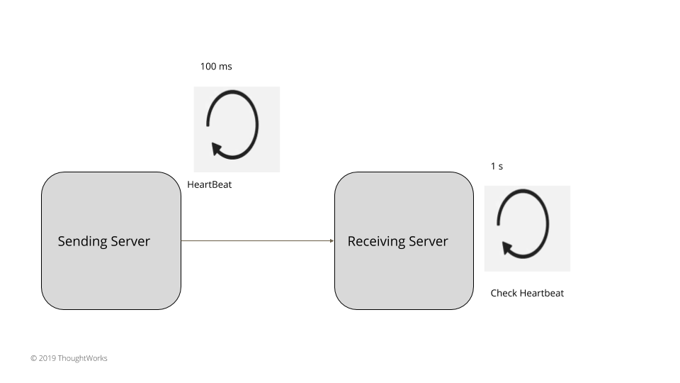

图1：心跳

一个服务器周期性地发送请求给所有其它的服务器，以此表明它依然活跃。选择的请求间隔应该大于服务器间的网络往返的时间。所有的服务器在检查心跳时，都要等待一个超时间隔，超时间隔应该是多个请求间隔。通常来说，

超时间隔 > 请求间隔 > 服务器间的网络往返时间

比如，如果服务器间的网络往返时间是 20ms，心跳可以每 100ms 发送一次，服务器检查在 1s 之后执行，这样就给了多个心跳足够的时间，不会产生漏报。如果在这个间隔里没收到心跳，就可以说发送服务器已经失效了。

无论是发送心跳的服务器，还是接收心跳的服务器，都有一个调度器，定义如下。调度器会接受一个方法，以固定的间隔执行。启动时，任务就会开始调度，执行给定的方法。

```java
class HeartBeatScheduler
{
    public class HeartBeatScheduler implements Logging
    {
        private ScheduledThreadPoolExecutor executor = new ScheduledThreadPoolExecutor(1);
        private Runnable action;
        private Long heartBeatInterval;

        public HeartBeatScheduler(Runnable action, Long heartBeatIntervalMs)
        {
            this.action = action;
            this.heartBeatInterval = heartBeatIntervalMs;
        }

        private ScheduledFuture<?> scheduledTask;

        public void start()
        {
            scheduledTask = executor.scheduleWithFixedDelay(new HeartBeatTask(action), heartBeatInterval, heartBeatInterval, TimeUnit.MILLISECONDS);
        }
    }
}
```

在发送端的服务器，调度器会执行方法，发送心跳消息。

```java
class SendingServer
{
    private void sendHeartbeat() throws IOException
    {
        socketChannel.blockingSend(newHeartbeatRequest(serverId));
    }
}
```

在接收端的服务器，失效检测机制要启动一个类似的调度器。在固定的时间间隔，检查心跳是否收到。

```java
class AbstractFailureDetector
{
    private HeartBeatScheduler heartbeatScheduler = new HeartBeatScheduler(this::heartBeatCheck, 100l);

    abstract void heartBeatCheck();

    abstract void heartBeatReceived(T serverId);
}
```

失效检测器需要有两个方法：

- 接收服务器接收到心跳调用的方法，告诉失效检测器，心跳收到了。

```java
class ReceivingServer
{
    private void handleRequest(Message<RequestOrResponse> request)
    {
        RequestOrResponse clientRequest = request.getRequest();
        if (isHeartbeatRequest(clientRequest))
        {
            HeartbeatRequest heartbeatRequest = JsonSerDes.deserialize(clientRequest.getMessageBodyJson(), HeartbeatRequest.class);
            failureDetector.heartBeatReceived(heartbeatRequest.getServerId());
            sendResponse(request);
            } else {
            //processes other requests
        }
    }
}
```

- 一个周期性调用的方法，检查心跳状态，检测可能的失效。

什么时候将服务器标记为失效，这个实现取决于不同的评判标准。其中是有一些权衡的。总的来说，心跳间隔越小，失效检测得越快，但是，也就更有可能出现失效检测的误报。因此，心跳间隔和心跳丢失的解释是按照集群的需求来的。总的来说，分成下面两大类。

### 小集群，比如，像Raft、Zookeeper等基于共识的系统

在所有的共识实现中，心跳是从领导者服务器发给所有追随者服务器的。每次收到心跳，都要记录心跳到达的时间戳。

```java
class TimeoutBasedFailureDetector
{
    @Override
    void heartBeatReceived(T serverId)
    {
        Long currentTime = System.nanoTime();
        heartbeatReceivedTimes.put(serverId, currentTime);
        markUp(serverId);
    }
}
```

如果固定的时间窗口内没有收到心跳，就可以认为领导者崩溃了，需要选出一个新的服务器成为领导者。由于进程或网络缓慢，可能会一些虚报的失效。因此，[世代时钟（Generation Clock）](https://generation-clock.md/)常用来检测过期的领导者。这就给系统提供了更好的可用性，这样很短的时间周期里就能检测出崩溃。对于比较小的集群，这很适用，典型的就是有三五个节点，大多数共识实现比如 Zookeeper 或 Raft 都是这样的。

```java
class TimeoutBasedFailureDetector
{
    @Override
    void heartBeatCheck()
    {
        Long now = System.nanoTime();
        Set<T> serverIds = heartbeatReceivedTimes.keySet();
        for (T serverId : serverIds)
        {
            Long lastHeartbeatReceivedTime = heartbeatReceivedTimes.get(serverId);
            Long timeSinceLastHeartbeat = now - lastHeartbeatReceivedTime;
            if (timeSinceLastHeartbeat >= timeoutNanos)
            {
                markDown(serverId);
            }
        }
    }
}
```

### 技术考量

采用[单一 Socket 通道（Single Socket Channel）](https://single-socket-channel.md/)在服务器间通信时，有一点需要考虑，就是[队首阻塞（head-of-line-blocking）](https://en.wikipedia.org/wiki/Head-of-line_blocking)，这会让心跳消息得不到处理。这样一来，延迟就会非常长，以致于产生虚报，认为发送服务器已经宕机，即便它还在按照固定的间隔发送心跳。使用[请求管道（Request Pipeline）](https://request-pipeline.md/)，可以保证服务器在发送心跳之前不必等待之前请求的应答回来。有时，使用[单一更新队列（Singular Update Queue）](https://singular-update-queue.md/)，像写磁盘这样的任务，就可能会造成延迟，这可能会延迟定时中断的处理，也会延迟发送心跳。

这个问题可以通过在单独的线程中异步发送心跳来解决。类似于 [consul](https://www.consul.io/) 和 [akka](https://akka.io/) 这样的框架都会异步发送心跳。对于接收者服务器同样也是一个问题。接收服务器也要进行磁盘写，检查心跳只能在写完成后才能检查心跳，这就会造成虚报的失效检测。因此接收服务器可以使用[单一更新队列（Singular Update Queue）](https://singular-update-queue.md/)，解决心跳检查机制的延迟问题。[raft](https://raft.github.io/) 的参考实现、[log-cabin](https://github.com/logcabin/logcabin) 就是这么做的。

有时，一些运行时特定事件，比如垃圾收集，会造成[本地停顿](https://issues.apache.org/jira/browse/CASSANDRA-9183)，进而造成心跳处理的延迟。这就需要有一种机制在本地暂停（可能）发生后，检查心跳处理是否发生过。一个简单的机制就是，在一段足够长的时间窗口之后（如，5s），检查是否有心跳。在这种情况下，如果在这个时间窗口内不需要标记为心跳失效，那么就进入到下一个循环。[Cassandra 的实现](https://issues.apache.org/jira/browse/CASSANDRA-9183)就是这种做法的一个很好的示例。

### 大集群，基于 Gossip 的协议

前面部分描述的心跳机制，并不能扩展到大规模集群，也就是那种有几百到上千台服务器，横跨广域网的集群。在大规模集群中，有两件事要考虑：

- 每台服务器生成的消息数量要有一个固定的限制。
- 心跳消息消耗的总共的带宽。它不该消耗大量的网络带宽。应该有个几百 K 字节的上限，确保即便有太多的心跳也不会影响到在集群上实际传输的数据。

基于这些原因，应该避免所有节点对所有节点的心跳。在这些情况下，通常会使用失效检测器，以及 [Gossip](https://en.wikipedia.org/wiki/Gossip_protocol) 协议，在集群中传播失效信息。在失效的场景下，这些集群会采取一些行动，比如，在节点间搬运数据，因此，集群会倾向于进行正确性的检测，容忍更多的延迟（虽然是有界的）。这里的主要挑战在于，不要因为网络的延迟或进程的缓慢，造成对于节点失效的虚报。那么，一种常用的机制是，给每个进程分配一个怀疑计数，在限定的时间内，如果没有收到该进程的 Gossip 消息，则怀疑计数递增。它可以根据过去的统计信息计算出来，只有在这个怀疑计数到达配置的上限时，才将其标记为失效。

有两种主流的实现：

据说 Akka 尝试过 [2400](https://www.lightbend.com/blog/running-a-2400-akka-nodes-cluster-on-google-compute-engine) 台服务器。Hashicorp Consul 在一个群组内常规部署了几千台 consul 服务器。有一个可靠的失效检测器，可以有效地用于大规模集群部署，同时，又能提供一些一致性保证，这仍然是一个积极发展中的领域。最近在一些框架的研究看上去非常有希望，比如 [Rapid](https://www.usenix.org/conference/atc18/presentation/suresh)。

## 示例

- 共识实现，诸如 ZAB 或 RAFT，可以在三五个节点的集群中很好的运行，实现了基于固定时间窗口的失效检测。
- Akka Actor 和 Cassandra 采用 [Phi Accrual 的失效检测器](http://citeseerx.ist.psu.edu/viewdoc/download?doi=10.1.1.80.7427&rep=rep1&type=pdf)。
- Hashicorp consul 采用了基于 Gossip 的失效检测器 [SWIM](assets/files/learning/distributed/2022-08-12-distributed-system-cn-wal/SWIM.pdf)。

**原文**

https://martinfowler.com/articles/patterns-of-distributed-systems/high-watermark.html

预写日志中的索引，表示最后一次成功的复制。

**2020.8.5**

又称：提交索引

## 问题

[预写日志（Write-Ahead Log）](https://write-ahead-log.md/)模式用于在服务器奔溃重启之后恢复状态。但在服务器失效的情况下，想要保障可用性，仅有预写日志是不够的。如果单个服务器失效了，只有等到服务器重启之后，客户端才能够继续使用其功能。为了得到一个更可用的系统，我们需要将日志复制到多台服务器上。使用[领导者和追随者（Leader and Followers）](https://leader-and-followers.md/)时，领导者会将所有的日志条目都复制到追随者的 [Quorum](https://quorum.md/) 上。如果领导者失效了，集群会选出一个新的领导者，客户端在大部分情况下还是能像从前一样继续在集群中工作。但是，还有几件事可能会有问题：

- 在向任意的追随者发送日志条目之前，领导者失效了。
- 给一部分追随者发送日志条目之后，领导者失效了，日志条目没有发送给大部分的追随者。

在这些错误的场景下，一部分追随者的日志中可能会缺失一些条目，一部分追随者则拥有比其它部分多的日志条目。因此，对于每个追随者来说，有一点变得很重要，了解日志中哪个部分是安全的，对客户端是可用的。

## 解决方案

高水位标记就是一个日志文件中的索引，记录了在追随者的 [Quorum](https://quorum.md/) 中都成功复制的最后一个日志条目。在复制期间，领导者也会把高水位标记传给追随者。对于集群中的所有服务器而言，只有反映的更新小于高水位标记的数据才能传输给客户端。

下面是这个操作的序列图。

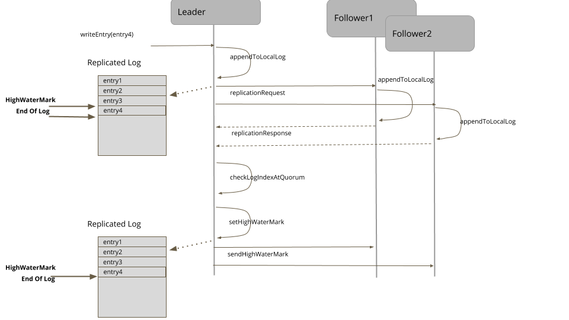

图1：高水位标记

对于每个日志条目而言，领导者将其追加到本地的预写日志中，然后，发送给所有的追随者。

```java
leader(class ReplicationModule...)

private Long appendAndReplicate(byte[] data)
{
    Long lastLogEntryIndex = appendToLocalLog(data);
    logger.info("Replicating log entries till index " + lastLogEntryIndex + " on followers");
    replicateOnFollowers(lastLogEntryIndex);
    return lastLogEntryIndex;
}

private void replicateOnFollowers(Long entryAtIndex)
{
    for (final FollowerHandler follower : followers)
    {
        replicateOn(follower, entryAtIndex);
        //send replication requests to followers
    }
}
```

追随者会处理复制请求，将日志条目追加到本地日志中。在成功地追加日志条目之后，它们会把最新的日志条目索引回给领导者。应答中还包括服务器当前的[时代时钟（Generation Clock）](https://generation-clock.md/)。

```java
follower(class ReplicationModule...)

private ReplicationResponse handleReplicationRequest(ReplicationRequest replicationRequest)
{
    List<WALEntry> entries = replicationRequest.getEntries();
    for (WALEntry entry : entries)
    {
        logger.info("Appending log entry " + entry.getEntryId() + " in " + serverId());
        if (wal.exists(entry))
        {
            logger.info("Entry " + wal.readAt(entry.getEntryId()) + " already exists on " + config.getServerId());
            continue;
        }
        wal.writeEntry(entry);
    }
    return new ReplicationResponse(SUCCEEDED, serverId(), replicationState.getGeneration(), wal.getLastLogEntryId());
}
```

领导者在收到应答时，会追踪每台服务器上已复制日志的索引。

```java
class ReplicationModule
{
    recordReplicationConfirmedFor(response.getServerId(),response.

    getReplicatedLogIndex());
    long logIndexAtQuorum = computeHighwaterMark(logIndexesAtAllServers(), config.numberOfServers());    logger.info("logIndexAtQuorum in "+config.getServerId()+" is "+logIndexAtQuorum +" highWaterMark is "+replicationState.getHighWaterMark());
    var currentHighWaterMark = replicationState.getHighWaterMark();    if(logIndexAtQuorum >currentHighWaterMark)

    {
        applyLogAt(currentHighWaterMark, logIndexAtQuorum);
        logger.info("Setting highwatermark in " + config.getServerId() + " to " + logIndexAtQuorum);
        replicationState.setHighWaterMark(logIndexAtQuorum);
        } else

    {
        logger.info("HighWaterMark in " + config.getServerId() + " is " + replicationState.getHighWaterMark() + " >= " + logIndexAtQuorum);
    }
}
```

通过查看所有追随者的日志索引和领导者自身的日志，高水位标记是可以计算出来的，选取大多数服务器中可用的索引即可。

```java
class ReplicationModule
{
    Long computeHighwaterMark(List<Long> serverLogIndexes, int noOfServers)
    {
        serverLogIndexes.sort(Long::compareTo);
        return serverLogIndexes.get(noOfServers / 2);
    }
}
```

领导者会将高水位标记传播给追随者，可能是当做常规心跳的一部分，也可能一个单独的请求。追随者随后据此设置自己的高水位标记。

客户端只能读取到高水位标记前的日志条目。超出高水位标记的对客户端是不可见的。因为这些条目是否复制还未确认，如果领导者失效了，其它服务器成了领导者，这些条目就是不可用的。

```java
class ReplicationModule
{
    public WALEntry readEntry(long index)
    {
        if (index > replicationState.getHighWaterMark())
        {
            throw new IllegalArgumentException("Log entry not available");
        }
        return wal.readAt(index);
    }
}
```

### 日志截断

一台服务器在崩溃/重启之后，重新加入集群，日志中总有可能出现一些冲突的条目。因此，每当有一台服务器加入集群时，它都会检查集群的领导者，了解日志中哪些条目可能是冲突的。然后，它会做一次日志截断，以便与领导者的条目相匹配，然后用随后的条目更新日志，以确保它的日志与集群的节点相匹配。

考虑下面这个例子。客户端发送请求在日志中添加四个条目。领导者成功地复制了三个条目，但在日志中添加了第四项后，失败了。一个新的追随者被选为新的领导者，从客户端接收了更多的项。当失效的领导者再次加入集群时，它的第四项就冲突了。因此，它要把自己的日志截断至第三项，然后，添加第五项，以便于集群的其它节点相匹配。

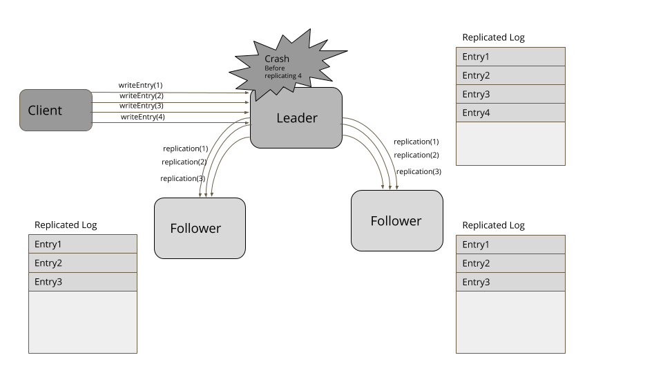

图2：领导者失效

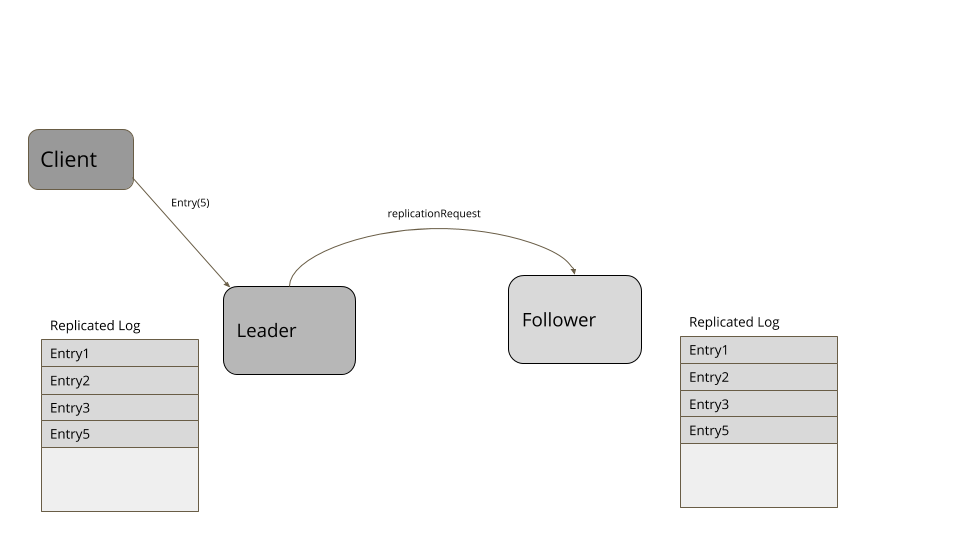

图3：新的领导者

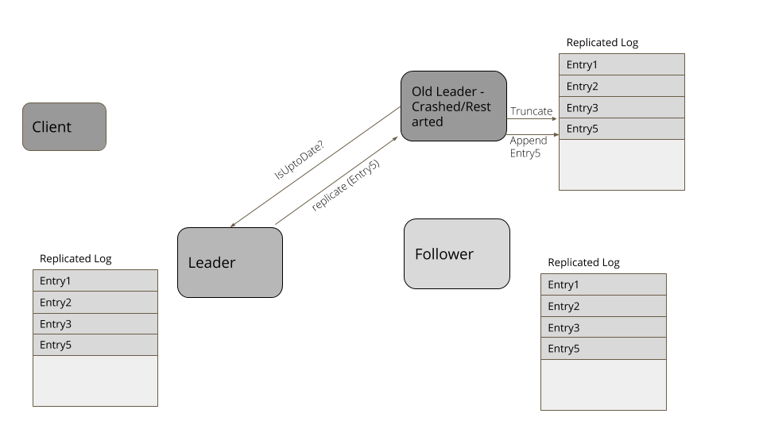

图4：日志截断

暂停之后，重新启动或是重新加入集群，服务器都会先去寻找新的领导者。然后，它会显式地查询当前的高水位标记，将日志截断至高水位标记，然后，从领导者那里获取超过高水位标记的所有条目。类似 RAFT 之类的复制算法有一些方式找出冲突项，比如，查看自己日志里的日志条目，对比请求里的日志条目。如果日志条目拥有相同的索引，但[时代时钟（Generation Clock）](https://generation-clock.md/)更低的话，就删除这些条目。

```java
class ReplicationModule
{
    private void maybeTruncate(ReplicationRequest replicationRequest) throws IOException
    {
        if (replicationRequest.hasNoEntries() || wal.isEmpty())
        {
            return;
        }
        List<WALEntry> entries = replicationRequest.getEntries();
        for (WALEntry entry : entries)
        {
            if (wal.getLastLogEntryId() >= entry.getEntryId())
            {
                if (entry.getGeneration() == wal.readAt(entry.getEntryId()).getGeneration())
                {
                    continue;
                }
                wal.truncate(entry.getEntryId());
            }
        }
    }
}
```

要支持日志截断，有一种简单的实现，保存一个日志索引到文件位置的映射。这样，日志就可以按照给定的索引进行截断，如下所示：

```java
class WALSegment
{
    public void truncate(Long logIndex) throws IOException
    {
        var filePosition = entryOffsets.get(logIndex);
        if (filePosition == null)
        throw new IllegalArgumentException("No file position available for logIndex=" + logIndex);
        fileChannel.truncate(filePosition);
        readAll();
    }
}
```

## 示例

- 所有共识算法都有高水位标记的概念，以便了解应用状态修改的时机，比如，在 [RAFT](https://raft.github.io/)
共识算法中，高水位标记称为“提交索引”。
- 在 [Kafka 的复制协议](https://www.confluent.io/blog/hands-free-kafka-replication-a-lesson-in-operational-simplicity/)
中，维护着一个单独的索引，称为高水位标记。消费者只能看到高水位标记之前的条目。
- [Apache BookKeeper](https://bookkeeper.apache.org/)[最后添加确认（last add confirmed）](https://bookkeeper.apache.org/archives/docs/r4.4.0/bookkeeperProtocol.html)
有一个概念，叫‘
’，它表示在 bookie 的 Quorum 上已经成功复制的条目。

**原文**

https://martinfowler.com/articles/patterns-of-distributed-systems/hybrid-clock.html

使用系统时间戳和逻辑时间戳的组合，这样时间-日期就可以当做版本，用以排序。

**2021.6.24**

## 问题

采用[有版本的值（Versioned Value）](https://versioned-value.md/)时，如果用 [Lamport 时钟](https://lamport-clock.md/)当做版本，存储版本时，客户端并不知道实际的日期-时间。对于客户端而言，有时需要能够访问到像 01-01-2020 这样采用日期-时间的版本，而不仅仅是像 1、2、3 这样的整数。

## 解决方案

[混合逻辑时钟（Hybrid Logical Clock）](/assets/files/learning/distributed/distributed-system-cn-wal/83ef848c02e45c55dff24182a6f943c6.pdf) 提供了一种方式，让我们可以拥有一种像简单整数一样能够单调递增的版本，但与实际的日期时间也有关系。在实践中，像 [mongodb](https://www.mongodb.com/blog/post/transactions-background-part-4-the-global-logical-clock) 或 [cockroachdb](https://www.cockroachlabs.com/docs/stable/architecture/transaction-layer.html) 这样的数据就采用了混合时钟。

混合逻辑时钟可以这样实现：

```java
class HybridClock
{
    public class HybridClock
    {
        private final SystemClock systemClock;
        private HybridTimestamp latestTime;

        public HybridClock(SystemClock systemClock)
        {
            this.systemClock = systemClock;
            this.latestTime = new HybridTimestamp(systemClock.currentTimeMillis(), 0);
        }
    }
}
```

它在混合时间戳里维护了最新的时间，这个时间戳使用系统时间和整数计数器共同构建。

```java
public class HybridTimestamp implements Comparable<HybridTimestamp>
{
    private final long wallClockTime;
    private final int ticks;

    public HybridTimestamp(long systemTime, int ticks)
    {
        this.wallClockTime = systemTime;
        this.ticks = ticks;
    }

    public static HybridTimestamp fromSystemTime(long systemTime)
    {
        return new HybridTimestamp(systemTime, -1);
        //initializing with -1 so that addTicks resets it to 0
    }

    public HybridTimestamp max(HybridTimestamp other)
    {
        if (this.getWallClockTime() == other.getWallClockTime())
        {
            return this.getTicks() > other.getTicks() ? this : other;
        }
        return this.getWallClockTime() > other.getWallClockTime() ? this : other;
    }

    public long getWallClockTime()
    {
        return wallClockTime;
    }

    public HybridTimestamp addTicks(int ticks)
    {
        return new HybridTimestamp(wallClockTime, this.ticks + ticks);
    }

    public int getTicks()
    {
        return ticks;
    }

    @Override
    public int compareTo(HybridTimestamp other)
    {
        if (this.wallClockTime == other.wallClockTime)
        {
            return Integer.compare(this.ticks, other.ticks);
        }
        return Long.compare(this.wallClockTime, other.wallClockTime);
    }
}
```

混合时钟的使用方式与[Lamport Clock](https://lamport-clock.md/)版本完全相同。每个服务器都持有一个混合时钟的实例。

```java
class Server
{
    HybridClockMVCCStore mvccStore;
    HybridClock clock;

    public Server(HybridClockMVCCStore mvccStore)
    {
        this.clock = new HybridClock(new SystemClock());
        this.mvccStore = mvccStore;
    }
}
```

每次写入一个值，都会关联上一个混合时间戳。诀窍是检查系统时间值是否在往回走，如果是，则递增另一个代表组件逻辑部分的数字，以反映时钟的进展。

```java
class HybridClock
{
    public synchronized HybridTimestamp now()
    {
        long currentTimeMillis = systemClock.currentTimeMillis();
        if (latestTime.getWallClockTime() >= currentTimeMillis)
        {
            latestTime = latestTime.addTicks(1);
            } else {
            latestTime = new HybridTimestamp(currentTimeMillis, 0);
        }
        return latestTime;
    }
}
```

服务器从客户端收到的每个写请求都会带有一个时间戳。接收的服务器会将自己的时间戳与请求的时间戳进行比较，将二者中较高的一个设置为自己的时间戳。

```java
class Server
{
    public HybridTimestamp write(String key, String value, HybridTimestamp requestTimestamp)
    {
        //update own clock to reflect causality
        HybridTimestamp writeAtTimestamp = clock.tick(requestTimestamp);
        mvccStore.put(key, writeAtTimestamp, value);
        return writeAtTimestamp;
    }
}

class HybridClock
{
    public synchronized HybridTimestamp tick(HybridTimestamp requestTime)
    {
        long nowMillis = systemClock.currentTimeMillis();
        //set ticks to -1, so that, if this is the max, the next addTicks reset it to zero.
        HybridTimestamp now = HybridTimestamp.fromSystemTime(nowMillis);
        latestTime = max(now, requestTime, latestTime);
        latestTime = latestTime.addTicks(1);
        return latestTime;
    }

    private HybridTimestamp max(HybridTimestamp... times)
    {
        HybridTimestamp maxTime = times[0];
        for (int i = 1; i < times.length; i++)
        {
            maxTime = maxTime.max(times[i]);
        }
        return maxTime;
    }
}
```

用于写入值的时间戳会返回给客户端。请求的客户端会更新自己的时间戳，然后，在发起进一步的写入时会带上这个时间戳。

```java
class Client
{
    HybridClock clock = new HybridClock(new SystemClock());

    public void write()
    {
        HybridTimestamp server1WrittenAt = server1.write("key1", "value1", clock.now());
        clock.tick(server1WrittenAt);
        HybridTimestamp server2WrittenAt = server2.write("key2", "value2", clock.now());
        assertTrue(server2WrittenAt.compareTo(server1WrittenAt) > 0);
    }
}
```

### 使用混合时钟进行多版本存储

在键值存储中进行值的存储时，可以采用混合时间戳作为版本。值的存储在[有版本的值（Versioned Value）](https://versioned-value.md/)中讨论过。

```java
class HybridClockReplicatedKVStore
{
    private Response applySetValueCommand(VersionedSetValueCommand setValueCommand)
    {
        mvccStore.put(setValueCommand.getKey(), setValueCommand.timestamp, setValueCommand.value);
        Response response = Response.success(setValueCommand.timestamp);
        return response;
    }
}

class HybridClockMVCCStore
{
    ConcurrentSkipListMap<HybridClockKey, String> kv = new ConcurrentSkipListMap<>();

    public void put(String key, HybridTimestamp version, String value)
    {
        kv.put(new HybridClockKey(key, version), value);
    }
}

class HybridClockKey
{
    public class HybridClockKey implements Comparable<HybridClockKey>
    {
        private String key;
        private HybridTimestamp version;

        public HybridClockKey(String key, HybridTimestamp version)
        {
            this.key = key;
            this.version = version;
        }

        public String getKey()
        {
            return key;
        }

        public HybridTimestamp getVersion()
        {
            return version;
        }

        @Override
        public int compareTo(HybridClockKey o)
        {
            int keyCompare = this.key.compareTo(o.key);
            if (keyCompare == 0)
            {
                return this.version.compareTo(o.version);
            }
            return keyCompare;
        }
    }
}
```

这些值的读取完全是按照[有版本的值排序](https://versioned-value.md/#%E6%9C%89%E7%89%88%E6%9C%AC%E9%94%AE%E5%80%BC%E7%9A%84%E6%8E%92%E5%BA%8F)所讨论的那样。使用混合时间戳作为键值后缀，有版本的键值就可以按照自然顺序的方式进行排列。这个实现让我们可以使用可导航的 Map API（navigable map API）获取特定版本对应的值。

```java
class HybridClockMVCCStore
{
    public Optional<String> get(String key, HybridTimestamp atTimestamp)
    {
        Map.Entry<HybridClockKey, String> versionKeys = kv.floorEntry(new HybridClockKey(key, atTimestamp));
        getLogger().info("Available version keys " + versionKeys + ". Reading@" + versionKeys);
        return (versionKeys == null) ? Optional.empty() : Optional.of(versionKeys.getValue());
    }
}
```

### 将混合时间戳转换为日期时间

通过将系统时间戳和逻辑计数合并在一起，混合时钟可以转换成实际的时间戳。正如在[混合时钟（hybrid-clock）](assets/files/learning/distributed/2022-08-12-distributed-system-cn-wal/2014-04.pdf)这篇论文中所讨论的，保留系统时间的前 48 位，而低 16 位有逻辑计数器所取代。

```java
class HybridTimestamp
{
    public LocalDateTime toDateTime()
    {
        return LocalDateTime.ofInstant(Instant.ofEpochMilli(epochMillis()), ZoneOffset.UTC);
    }

    public long epochMillis()
    {
        //Compact timestamp as discussed in https://cse.buffalo.edu/tech-reports/2014-04.pdf.
        return (wallClockTime >> 16 << 16) | (ticks << 48 >> 48);
    }
}
```

### 将时间戳赋给分布式事务

像 [mongodb](https://www.mongodb.com/) 和 [cockroachdb](https://www.cockroachlabs.com/docs/stable/) 这样的数据库会使用[混合时钟（Hybrid Clock）](https://hybrid-clock.md/)维持分布式事务的因果性。对于分布式事务而言，需要注意的是，事务提交时，作为事务一部分，所有要存的值在整个服务器集群中都要以相同的时间戳进行存储。请求的服务器或许会在稍后的写请求中知晓了一个更高的时间戳。因此，这个请求服务器就会用它在事务提交时得到的最高的时间戳与所有参与的服务器进行通信。这与标准的[两阶段提交（two-phase-commit）](https://en.wikipedia.org/wiki/Two-phase_commit_protocol)协议非常契合。

下面是一个例子，演示了如何在事务提交时确定最高的时间戳。假设有三台服务器。蓝色服务器（Server Blue）存储名字，绿色服务器（Server Green）存储标题。还有一个单独服务器扮演协调者的角色。可以看出，每个服务器都有自己一个不同的本地时钟值。这可以是一个单一的整数，或是混合时钟。扮演协调者的服务器先向蓝色服务器写入它知道的时钟值，也就是 1.但是，蓝色服务器的时钟是 2，所以，它会递增这个值，它会写入一个值，其时间戳是 3。时间戳 3 会返回给协调者。绿色服务器接收到的请求时间戳就是 3，但是，它的时钟是 4。因此，它会选择最高的值，也就是 4.递增它，写入的值时间是 5，再把 5 返回给协调者。当事务提交时，协调者就会采用提交事务中它收到的最高时间戳。在事务中所有更新的值都会以最高的时间戳进行存储。

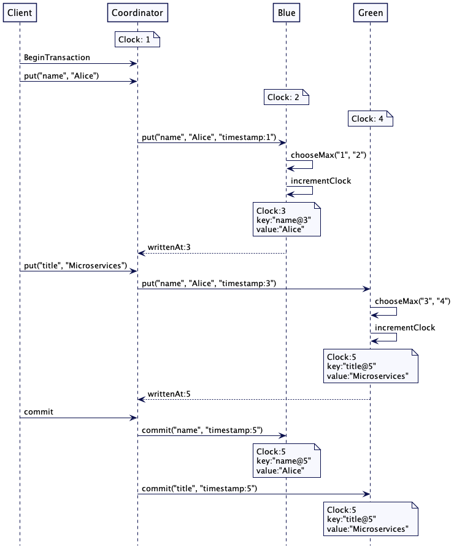

图 1：在服务器中传播提交的时间戳

一个极简的在事务中处理时间戳的代码是这样的：

```java
class TransactionCoordinator
{
    public Transaction beginTransaction()
    {
        return new Transaction(UUID.randomUUID().toString());
    }

    public void putTransactionally()
    {
        Transaction txn = beginTransaction();
        HybridTimestamp coordinatorTime = new HybridTimestamp(1);
        HybridTimestamp server1WriteTime
        = server1.write("name", "Alice", coordinatorTime, txn);
        HybridTimestamp server2WriteTime = server2.write("title", "Microservices", server1WriteTime, txn);
        HybridTimestamp commitTimestamp = server1WriteTime.max(server2WriteTime);
        commit(txn, commitTimestamp);
    }

    private void commit(Transaction txn, HybridTimestamp commitTimestamp)
    {
        server1.commitTxn("name", commitTimestamp, txn);
        server2.commitTxn("title", commitTimestamp, txn);
    }
}
```

事务实现也可以使用两阶段提交协议中的准备阶段来了解每个参与的服务器所使用的最高时间戳。

## 示例

[mongodb](https://www.mongodb.com/) 采用混合时间戳维护其 MVCC 存储中的版本。

[cockroachdb](https://www.cockroachlabs.com/docs/stable/) 采用混合时间戳维护分布式事务的因果关系。

**原文**

https://martinfowler.com/articles/patterns-of-distributed-systems/idempotent-receiver.html

识别来自客户端的请求是否唯一，以便在客户端重试时，忽略重复的请求。

**2021.1.26**

## 问题

客户端给服务器发请求，可能没有得到应答。客户端不可能知道应答是丢失了，还是服务端在处理请求之前就崩溃了。为了确保请求得到处理，客户端唯有重复发送请求。

如果服务器已经处理了请求，然后奔溃了，之后，客户端重试时，服务器端会收到客户端的重复请求。

## 解决方案

每个客户端都会分配得到一个唯一的 ID，用以对客户端进行识别。发送任何请求之前，客户端需要先向服务器进行注册。

```java
class ConsistentCoreClient
{
    private void registerWithLeader()
    {
        RequestOrResponse request
        = new RequestOrResponse(RequestId.RegisterClientRequest.getId(), correlationId.incrementAndGet());
        //blockingSend will attempt to create a new connection if there is a network error.
        RequestOrResponse response = blockingSend(request);
        RegisterClientResponse registerClientResponse
        = JsonSerDes.deserialize(response.getMessageBodyJson(), RegisterClientResponse.class);
        this.clientId = registerClientResponse.getClientId();
    }
}
```

当服务器接收到来自客户端的注册请求，它就给客户端分配一个唯一的 ID，如果服务器是一个<u>一致性内核（Consistent Core）</u>，它可以先分配预写日志索引当做客户端标识符。

```java
class ReplicatedKVStore
{
    private Map<Long, Session> clientSessions = new ConcurrentHashMap<>();

    private RegisterClientResponse registerClient(WALEntry walEntry)
    {
        Long clientId = walEntry.getEntryId();
        //clientId to store client responses.
        clientSessions.put(clientId, new Session(clock.nanoTime()));
        return new RegisterClientResponse(clientId);
    }
}
```

服务器会创建一个会话（session），以便为注册客户端的请求存储应答。它还会追踪会话的创建时间，这样，会话不起作用时，就可以把它丢弃了，这会在后面详细讨论。

```java
class Session
{
    long lastAccessTimestamp;
    Queue<Response> clientResponses = new ArrayDeque<>();

    public Session(long lastAccessTimestamp)
    {
        this.lastAccessTimestamp = lastAccessTimestamp;
    }

    public long getLastAccessTimestamp()
    {
        return lastAccessTimestamp;
    }

    public Optional<Response> getResponse(int requestNumber)
    {
        return clientResponses.stream().filter(r -> requestNumber == r.getRequestNumber()).findFirst();
    }

    private static final int MAX_SAVED_RESPONSES = 5;

    public void addResponse(Response response)
    {
        if (clientResponses.size() == MAX_SAVED_RESPONSES)
        {
            clientResponses.remove();
            //remove the oldest request
        }
        clientResponses.add(response);
    }

    public void refresh(long nanoTime)
    {
        this.lastAccessTimestamp = nanoTime;
    }
}
```

对一个一致性内核而言，客户端的注册请求也要作为共识算法的一部分进行复制。如此一来，即便既有的领导者失效了，客户端的注册依然是可用的。对于后续的请求，服务器还要存储发送给客户端的应答。

幂等和非幂等请求

注意到一些请求的幂等属性是很重要的。比如说，在一个键值存储中，设置键值和值就天然是幂等的。即便同样的键值和值设置了多次，也不会产生什么问题。另一方面，创建[租约（Lease）](https://lease.md/)却并不幂等。如果租约已经创建，再次尝试创建租约 的请求就会失败。这就是问题了。考虑一下这样一个场景。一个客户端发送请求创建租约，服务器成功地创建了租约，然后，崩溃了，或者是，应答发给客户端之前连接断开了。客户端会重新创建连接，重新尝试创建租约；因为服务端已经有了一个指定名称的租约，所以，它会返回错误。因此，客户端就会认为没有这个租约。显然，这并不是我们预期的行为。有了幂等接收者，客户端会用同样的请求号发送租约请求。因为表示“请求已经处理过”的应答已经存在服务器上了，这个应答就可以直接返回。这样一来，如果是客户端在连接断开之前已经成功创建了租约，后续重试相同的请求时，它会得到应有的应答。

对于收到的每个非幂等请求（参见边栏），服务端成功执行之后，都会将应答存在客户端会话中。

```java
class ReplicatedKVStore
{
    private Response applyRegisterLeaseCommand(WALEntry walEntry, RegisterLeaseCommand command)
    {
        logger.info("Creating lease with id " + command.getName() + "with timeout " + command.getTimeout() + " on server " + getServer().getServerId());
        try
        {
            leaseTracker.addLease(command.getName(), command.getTimeout());
            Response success = Response.success(walEntry.getEntryId());
            if (command.hasClientId())
            {
                Session session = clientSessions.get(command.getClientId());
                session.addResponse(success.withRequestNumber(command.getRequestNumber()));
            }
            return success;
            } catch (DuplicateLeaseException e) {
            return Response.error(1, e.getMessage(), walEntry.getEntryId());
        }
    }
}
```

客户端发送给服务器的每个请求里都包含客户端的标识符。客户端还保持了一个计数器，每个发送给服务器的请求都会分配到一个请求号。

```java
class ConsistentCoreClient
{
    int nextRequestNumber = 1;

    public void registerLease(String name, long ttl)
    {
        RegisterLeaseRequest registerLeaseRequest
        = new RegisterLeaseRequest(clientId, nextRequestNumber, name, ttl);
        nextRequestNumber++;
        //increment request number for next request.
        var serializedRequest = serialize(registerLeaseRequest);
        logger.info("Sending RegisterLeaseRequest for " + name);
        blockingSendWithRetries(serializedRequest);
    }

    private static final int MAX_RETRIES = 3;

    private RequestOrResponse blockingSendWithRetries(RequestOrResponse request)
    {
        for (int i = 0; i <= MAX_RETRIES; i++)
        {
            try
            {
                //blockingSend will attempt to create a new connection is there is no connection.
                return blockingSend(request);
                } catch (NetworkException e) {
                resetConnectionToLeader();
                logger.error("Failed sending request  " + request + ". Try " + i, e);
            }
        }
        throw new NetworkException("Timed out after " + MAX_RETRIES + " retries");
    }
}
```

服务器收到请求时，它会先检查来自同一个客户端给定的请求号是否已经处理过了。如果找到已保存的应答，它就会把相同的应答返回给客户端，而无需重新处理请求。

```java
class ReplicatedKVStore
{
    private Response applyWalEntry(WALEntry walEntry)
    {
        Command command = deserialize(walEntry);
        if (command.hasClientId())
        {
            Session session = clientSessions.get(command.getClientId());
            Optional<Response> savedResponse = session.getResponse(command.getRequestNumber());
            if (savedResponse.isPresent())
            {
                return savedResponse.get();
            }
            //else continue and execute this command.
        }
    }
}
```

### 已保存的客户端请求过期处理

按客户端存储的请求不可能是永久保存的。有几种方式可以对请求进行过期处理。在 Raft 的[参考实现](https://github.com/logcabin/logcabin)中，客户端会保存一个单独的号码，以便记录成功收到应答的请求号。这个号码稍后会随着每个请求发送给服务器。这样，对于请求号小于这个号码的请求，服务器就可以安全地将其丢弃了。

如果客户端能够保证只在接收到上一个请求的应答之后，再发起下一个请求，那么，服务器端一旦接收到来自这个客户端的请求，就可以放心地删除之前所有的请求。使用[请求管道（Request Pipeline）](https://request-pipeline.md/)还会有个问题，可能有在途（in-flight）请求存在，也就是客户端没有收到应答。如果服务器端知道客户端能够接受的在途请求的最大数量，它就可以保留那么多的应答，删除其它的应答。比如说，[kafka](https://kafka.apache.org/) 的 producer 能够接受的最大在途请求数量是 5 个，因此，它最多保存 5 个之前的请求。

```java
class Session
{
    private static final int MAX_SAVED_RESPONSES = 5;

    public void addResponse(Response response)
    {
        if (clientResponses.size() == MAX_SAVED_RESPONSES)
        {
            clientResponses.remove();
            //remove the oldest request
        }
        clientResponses.add(response);
    }
}
```

### 删除已注册的客户端

客户端的会话也不会在服务器上永久保存。一个服务器会对其存储的客户端会话有一个最大保活时间。客户端周期性地发送[心跳（HeartBeat）](https://heartbeat.md/)。如果在保活时间内没有收到心跳，服务器上客户端的状态就会被删除掉。

服务器会启动一个定时任务，周期性地检查是否有过期会话，删除已过期的会话。

```java
class ReplicatedKVStore
{
    private long heartBeatIntervalMs = TimeUnit.SECONDS.toMillis(10);
    private long sessionTimeoutNanos = TimeUnit.MINUTES.toNanos(5);

    private void startSessionCheckerTask()
    {
        scheduledTask = executor.scheduleWithFixedDelay(() ->
        {
            removeExpiredSession();
            }, heartBeatIntervalMs, heartBeatIntervalMs, TimeUnit.MILLISECONDS);
    }

    private void removeExpiredSession()
    {
        long now = System.nanoTime();
        for (Long clientId : clientSessions.keySet())
        {
            Session session = clientSessions.get(clientId);
            long elapsedNanosSinceLastAccess = now - session.getLastAccessTimestamp();
            if (elapsedNanosSinceLastAccess > sessionTimeoutNanos)
            {
                clientSessions.remove(clientId);
            }
        }
    }
}
```

## 示例

[Raft](https://raft.github.io/) 有一个实现了幂等性的参考实现，提供了线性一致性的行为。

[Kafka](https://kafka.apache.org/) 有一个[幂等 Producer](https://cwiki.apache.org/confluence/display/KAFKA/Idempotent+Producer)，允许客户端重试请求，忽略重复的请求。

[ZooKeeper](https://zookeeper.apache.org/) 有 Session 的概念，还有 zxid，用于客户端恢复。HBase 有一个 [hbase-recoverable-zookeeper](https://docs.cloudera.com/HDPDocuments/HDP2/HDP-2.4.0/bk_hbase_java_api/org/apache/hadoop/hbase/zookeeper/RecoverableZooKeeper.html) 的封装，它实现了遵循 [zookeeper-error-handling](https://cwiki.apache.org/confluence/display/ZOOKEEPER/ErrorHandling) 指导的幂等的行为。

**原文**

https://martinfowler.com/articles/patterns-of-distributed-systems/lamport-clock.html

使用逻辑时间戳作为一个值的版本，以便支持跨服务器的值排序。

**2021.6.23**

## 问题

当值要在多个服务器上进行存储时，需要有一种方式知道一个值要在另外一个值之前存储。在这种情况下，不能使用系统时间戳，因为时钟不是单调的，两个服务器的时钟时间不应该进行比较。

表示一天中时间的系统时间戳，一般来说是通过晶体振荡器建造的时钟机械测量的。这种机制有一个已知问题，根据晶体震荡的快慢，它可能会偏离一天实际的时间。为了解决这个问题，计算机通常会使用像 NTP 这样的服务，将计算机时钟与互联网上众所周知的时间源进行同步。正因为如此，在一个给定的服务器上连续读取两次系统时间，可能会出现时间倒退的现象。

由于服务器之间的时钟漂移没有上限，比较两个不同的服务器的时间戳是不可能的。

## 解决方案

Lamport 时钟维护着一个单独的数字表示时间戳，如下所示：

```java
class LamportClock

class LamportClock
{
    int latestTime;

    public LamportClock(int timestamp)
    {
        latestTime = timestamp;
    }
}
```

每个集群节点都维护着一个 Lamport 时钟的实例。

```java
class Server
{
    MVCCStore mvccStore;
    LamportClock clock;

    public Server(MVCCStore mvccStore)
    {
        this.clock = new LamportClock(1);
        this.mvccStore = mvccStore;
    }
}
```

服务器每当进行任何写操作时，它都应该使用tick()方法让 Lamport 时钟前进。

```java
class LamportClock
{
    public int tick(int requestTime)
    {
        latestTime = Integer.max(latestTime, requestTime);
        latestTime++;
        return latestTime;
    }
}
```

如此一来，服务器可以确保写操作的顺序是在这个请求之后，以及客户端发起请求时服务器端已经执行的任何其他动作之后。服务器会返回一个时间戳，用于将值写回给客户端。稍后，请求的客户端会使用这个时间戳向其它的服务器发起进一步的写操作。如此一来，请求的因果链就得到了维持。

### 因果性、时间和 Happens-Before

在一个系统中，当一个事件 A 发生在事件 B 之前，这其中可能存在因果关系。因果关系意味着，在导致 B 发生的原因中，A 可能扮演了一些角色。这种“A 发生在 B 之前（A happens before B）”的关系是通过在每个事件上附加时间戳达成的。如果 A 发生在 B 之前，附加在 A 的时间戳就会小于附加在 B 上的时间戳。但是，因为我们无法依赖于系统时间，我们需要一些方式确保这种“依赖于附加在事件上的时间戳”的 Happens-Before 关系得到维系。[Leslie Lamport](https://en.wikipedia.org/wiki/Leslie_Lamport) 在其开创性论文[《时间、时钟和事件排序（Time, Clocks and Ordering Of Events）》](/assets/files/learning/distributed/distributed-system-cn-wal/b7c8bf6044fe8649a279f247a776ea4c.pdf)中提出了一个解决方案，使用逻辑时间戳来跟踪 Happens-Before 的关系。因此，这种使用逻辑时间错追踪因果性的技术就被称为 Lamport 时间戳。

值得注意的是，在数据库中，事件是关于存储数据的。因此，Lamport 时间戳会附加到存储的值上。这非常符合有版本的存储机制，这一点我们在[有版本的值（Versioned Value）](https://versioned-value.md/)中讨论过。

### 一个样例键值存储

考虑一个有多台服务器节点的简单键值存储的例子。它包含两台服务器，蓝色（Blue）和绿色（Green）。每台服务器负责存储一组特定的键值。这是一个典型的场景，数据划分到一组服务器上。值存储为[有版本的值（Versioned Value）](https://versioned-value.md/)，其版本号为 Lamport 时间戳。

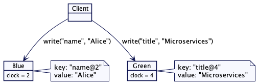

图1：两台服务器，各自负责特定的键值

接收服务器会比较并更新自己的时间戳，然后，用它写入一个有版本的键值和值。

```java
class Server
{
    public int write(String key, String value, int requestTimestamp)
    {
        //update own clock to reflect causality
        int writeAtTimestamp = clock.tick(requestTimestamp);
        mvccStore.put(new VersionedKey(key, writeAtTimestamp), value);
        return writeAtTimestamp;
    }
}
```

用于写入值的时间戳会返回给客户端。通过更新自己的时间戳，客户端会跟踪最大的时间戳。它在发出进一步写入请求时会使用这个时间戳。

```java
class Client
{
    LamportClock clock = new LamportClock(1);

    public void write()
    {
        int server1WrittenAt = server1.write("name", "Alice", clock.getLatestTime());
        clock.updateTo(server1WrittenAt);
        int server2WrittenAt = server2.write("title", "Microservices", clock.getLatestTime());
        clock.updateTo(server2WrittenAt);
        assertTrue(server2WrittenAt > server1WrittenAt);
    }
}
```

请求序列看起来是下面这样：

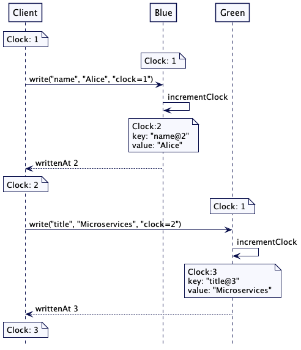

图2：两台服务器，各自负责特定的键值

在[领导者和追随者（Leader and Followers）](https://leader-and-followers.md/)组中，甚至可以用同样的技术在客户端和领导者之间的通信，每组负责一组特定的键值。客户端向该组的领导者发送请求，如上所述。Lamport 时钟的实例由该组的领导者维护，其更新方式与上一节讨论的完全相同。

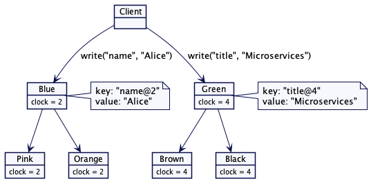

图3：不同的领导者追随者组存储不同的键值

### 部分有序

使用 Lamport 时钟存储的值只能是[部分有序的](https://en.wikipedia.org/wiki/Partially_ordered_set)。如果两个客户端在两台单独的服务器上存储值，时间戳的值是不能用于跨服务器进行值排序的。在下面这个例子里，Bob 在绿色服务器上存储的标题，其时间戳是 2。但是，这并不能决定 Bob 存储的标题是在 Alice 在蓝色服务器存储名字之前还是之后。

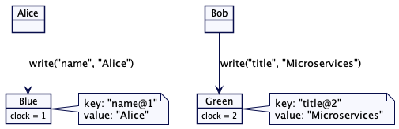

图4：部分有序

### 单一服务器/领导者更新值

对一个领导者追随者服务器组而言，领导者总是负责存储值，其基本实现已经在[有版本的值（Versioned Value）](https://versioned-value.md/)中讨论过，它足以维持所需的因果性。

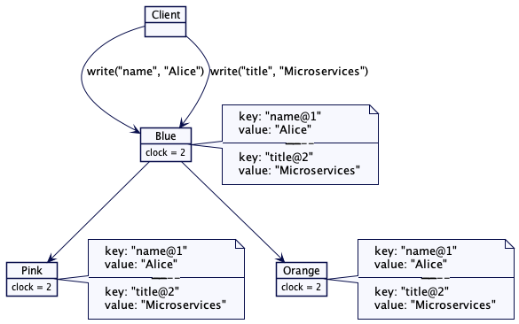

图 5：单一领导者追随者组进行键值存储

在这种情况下，键值存储会保持一个整数的版本计数器。每次从预写日志中应用了写入命令，版本计数器就要递增。然后，用递增过的版本计数器构建一个新的键值。只有领导者负责递增版本计数器，追随者使用相同的版本号。

```java
class ReplicatedKVStore
{
    int version = 0;
    MVCCStore mvccStore = new MVCCStore();

    @Override
    public CompletableFuture<Response> put(String key, String value)
    {
        return server.propose(new SetValueCommand(key, value));
    }

    private Response applySetValueCommand(SetValueCommand setValueCommand)
    {
        getLogger().info("Setting key value " + setValueCommand);
        version = version + 1;
        mvccStore.put(new VersionedKey(setValueCommand.getKey(), version), setValueCommand.getValue());
        Response response = Response.success(version);
        return response;
    }
}
```

## 示例

像 [mongodb](https://www.mongodb.com/) 和 [cockroachdb](https://www.cockroachlabs.com/docs/stable/) 采用了 Lamport 时钟的变体实现了 [mvcc](https://en.wikipedia.org/wiki/Multiversion_concurrency_control) 存储。

[世代时钟（Generation Clock）](https://generation-clock.md/)是 Lamport 时钟的一个例子。

**原文**

https://martinfowler.com/articles/patterns-of-distributed-systems/leader-follower.html

有一台服务器协调一组服务器间的复制。

**2020.8.6**

## 问题

对于一个管理数据的系统而言，为了在系统内实现容错，需要将数据复制到多台服务器上。

有一点也很重要，就是给客户提供一些一致性的保证。当数据在多个服务器上更新时，需要决定何时让客户端看到这些数据。只有写读的 [Quorum](https://quorum.md/) 是不够的，因为一些失效的场景会导致客户端看到不一致的数据。单个的服务器并不知道 Quorum 上其它服务器的数据状态，只有数据是从多台服务器上读取时，才能解决不一致的问题。在某些情况下，这还不够。发送给客户端的数据需要有更强的保证。

## 解决方案

在集群里选出一台服务器成为领导者。领导者负责根据整个集群的行为作出决策，并将决策传给其它所有的服务器。

每台服务器在启动时都会寻找一个既有的领导者。如果没有找到，它会触发领导者选举。只有在领导者选举成功之后，服务器才会接受请求。只有领导者才会处理客户端的请求。如果一个请求发送到一个追随者服务器，追随者会将其转发给领导者服务器。

### 领导者选举

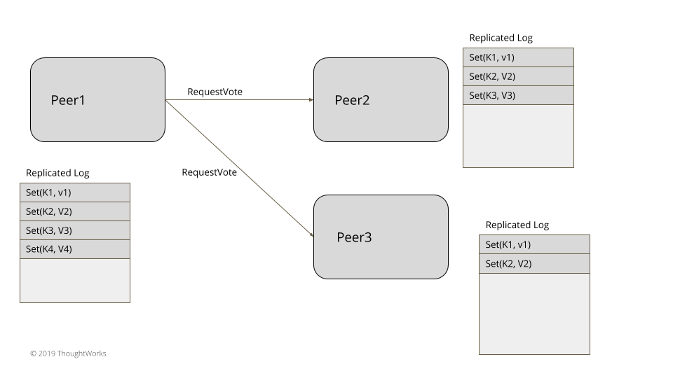

图1：选举

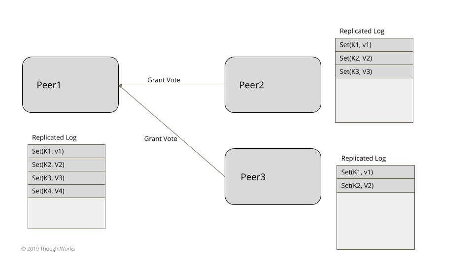

图2：投票

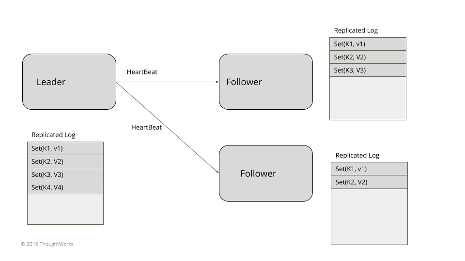

图3：领导者心跳

对于三五个节点的小集群，比如在实现共识的系统中，领导者选举可以在数据集群内部实现，不依赖于任何外部系统。领袖选举发生在服务器启动时。每台服务器在启动时都会启动领导者选举，尝试选出一个领导者。在选出一个领导者之前，系统不会接收客户端的任何请求。正如在[世代时钟（Generation Clock）](https://generation-clock.md/)模式中所阐释的那样，每次领导者选举都需要更新世代号。服务器总是处于三种状态之一：领导者、追随者或是寻找领导者（或候选者）。

```java
public enum ServerRole
{
    LOOKING_FOR_LEADER, FOLLOWING, LEADING ;
}
```

[心跳（HeartBeat）](https://heartbeat.md/)机制用以检测既有的领导者是否失效，以便启动新的领导者选举。

通过给其它对等的服务器发送消息，启动投票，一次新的选举就开始了。

```java
class ReplicationModule
{
    private void startLeaderElection()
    {
        replicationState.setGeneration(replicationState.getGeneration() + 1);
        registerSelfVote();
        requestVoteFrom(followers);
    }
}
```

### 选举算法

选举领导者时，有两个因素要考虑：

- 因为这个系统主要用于数据复制，哪台服务器可以赢得选举就要做出一些额外的限制。只有“最新”的服务器才能成为合法的领导者。比如说，在典型的基于共识的系统中，“最新”由两件事定义：
    - 最新的[世代时钟（Generation Clock）](https://generation-clock.md/)
    - [预写日志（Write-Ahead Log）](https://write-ahead-log.md/)
的最新日志索引
- 如果所有的服务器都是最新的，领导者可以根据下面的标准来选：
    - 一些实现特定的标准，比如，哪个服务器评级为更好或有更高的 ID（比如，Zab）
    - 如果要保证注意每台服务器一次只投一票，就看哪台服务器先于其它服务器启动选举。（比如，Raft）

在给定的[世代时钟（Generation Clock）](https://generation-clock.md/)内，一旦某台服务器得到投票，在同一个时代内，投票就总是一样的。这就确保了在成功的选举之后，其它服务器再发起同样世代的投票也不会当选。投票请求的处理过程如下：

```java
class ReplicationModule
{
    VoteResponse handleVoteRequest(VoteRequest voteRequest)
    {
        VoteTracker voteTracker = replicationState.getVoteTracker();
        Long requestGeneration = voteRequest.getGeneration();
        if (replicationState.getGeneration() > requestGeneration)
        {
            return rejectVote();
            } else if (replicationState.getGeneration() < requestGeneration) {
            becomeFollower(-1, requestGeneration);
            voteTracker.registerVote(voteRequest.getServerId());
            return grantVote();
        }
        return handleVoteRequestForSameGeneration(voteRequest);
    }

    private VoteResponse handleVoteRequestForSameGeneration(VoteRequest voteRequest)
    {
        Long requestGeneration = voteRequest.getGeneration();
        VoteTracker voteTracker = replicationState.getVoteTracker();
        if (voteTracker.alreadyVoted())
        {
            return voteTracker.grantedVoteForSameServer(voteRequest.getServerId()) ? grantVote() : rejectVote();
        }
        if (voteRequest.getLogIndex() >= (Long) wal.getLastLogEntryId())
        {
            becomeFollower(NO_LEADER_ID, requestGeneration);
            voteTracker.registerVote(voteRequest.getServerId());
            return grantVote();
        }
        return rejectVote();
    }

    private void becomeFollower(int leaderId, Long generation)
    {
        replicationState.setGeneration(generation);
        replicationState.setLeaderId(leaderId);
        transitionTo(ServerRole.FOLLOWING);
    }

    private VoteResponse grantVote()
    {
        return VoteResponse.granted(serverId(), replicationState.getGeneration(), wal.getLastLogEntryId());
    }

    private VoteResponse rejectVote()
    {
        return VoteResponse.rejected(serverId(), replicationState.getGeneration(), wal.getLastLogEntryId());
    }
}
```

获得多数服务器投票的服务器将转成领导者状态。大多数的确定是根据 [Quorum](https://quorum.md/) 中所讨论的那样。一旦当选，领导者会持续给所有的追随者发送[心跳（HeartBeat）](https://heartbeat.md/)。如果追随者在特定的时间间隔内没有收到心跳，就会触发新的领导选举。

# 使用外部[线性化](https://jepsen.io/consistency/models/linearizable)的存储进行领导者选举

在一个数据集群内运行领导者选举，对小集群来说，效果很好。但对那些有数千个节点的大数据集群来说，使用外部存储会更容易一些，比如 Zookeeper 或 etcd （其内部使用了共识，提供了线性化保证）。这些大规模的集群通常都有一个服务器，标记为主节点或控制器节点，代表整个集群做出所有的决策。实现领导者选举要有三个功能：

- compareAndSwap 指令，能够原子化地设置一个键值。
- 心跳的实现，如果没有从选举节点收到心跳，将键值做过期处理，以便触发新的选举。
- 通知机制，如果一个键值过期，就通知所有感兴趣的服务器。

在选举领导者时，每个服务器都会使用 compareAndSwap 指令尝试在外部存储中创建一个键值，哪个服务器先成功，就当选为领导者。根据所用的外部存储，键值创建后有一小段的存活时间。当选的领导在存活时间之前都会反复更新键值。每台服务器都会监控这个键值，如果键值已经过期，而且没有在设置的存活时间内收到来自既有领导者的更新，服务器会得到通知。比如，[etcd](https://etcd.io/) 允许 compareAndSwap 操作这样做，只在键值之前不存在时设置键值。在 [Zookeeper](https://zookeeper.apache.org/) 里，没有支持显式的 compareAndSwap 这种操作，但可以这样来实现，尝试创建一个节点，如果这个节点已经存在，就抛出一个异常。Zookeeper 也没有存活时间，但它有个临时节点（ephemeral node）的概念。只要服务器同 Zookeeper 间有一个活跃的会话，这个节点就会存在，否则，节点就会删除，每个监控这个节点的人都会得到通知。比如，用 Zookeeper 可以像下面这样选举领导者：

```java
class ServerImpl
{
    public void startup()
    {
        zookeeperClient.subscribeLeaderChangeListener(this);
        elect();
    }

    public void elect()
    {
        var leaderId = serverId;
        try
        {
            zookeeperClient.tryCreatingLeaderPath(leaderId);
            this.currentLeader = serverId;
            onBecomingLeader();
            } catch (
        ZkNodeExistsException e)
        {
            //back off
            this.currentLeader = zookeeperClient.getLeaderId();
        }
    }
}
```

所有其它的服务器都会监控既有领导者的活跃情况。当它检测到既有领导者宕机时，就会触发新的领导者选举。失效检测要使用与领导者选举相同的外部线性化存储。这个外部存储要有一些设施，实现分组成员信息以及失效检测机制。比如，扩展上面基于 Zookeeper 的实现，在 Zookeeper 上配置一个变化监听器，在既有领导者发生改变时，该监听器就会触发。

```java
class ZookeeperClient
{
    public void subscribeLeaderChangeListener(IZkDataListener listener)
    {
        zkClient.subscribeDataChanges(LeaderPath, listener);
    }
}
```

集群中的每个服务器都会订阅这个变化，当回调触发之后，就会触发一次新选举，方式如上所示。

```java
class ServerImpl
{
    @Override
    public void handleDataDeleted(String dataPath) throws Exception
    {
        elect();
    }
}
```


图4：基于 Zookeeper 的选举

用同样的方式使用类似于 [etcd](https://etcd.io/) 或 [Consul](https://www.consul.io/) 的系统也可以实现领导者选举。

### 为何 Quorum 读/写不足以保证强一致性

貌似像 Cassandra 这样的 Dynamo 风格的数据库所提供的 Quorum 读/写，足以在服务器失效的情况下获得强一致性。但事实并非如此。考虑一下下面的例子。假设我们有一个三台服务器的集群。变量 x 存在所有三台服务器上（其复制因子是 3）。启动时，x 的值是 1。

- 假设 writer1 写入 x=2，复制因子是 3。写的请求发送给所有的三台服务器。server1 写成功了，然而，server2 和 server3 失败了。（可能是小故障，或者只是 writer1 把请求发送给 server1 之后，陷入了长时间的垃圾收集暂停）。
- 客户端 c1 从 server1 和 server2 读取 x 的值。它得到了x=2 这个最新值，因为 server1 已经有了最新值。
- 客户端 c2 触发去读 x。但是，server1 临时宕机了。因此，c2 要从 server2 和 server 3 去读取，它们拥有的 x 的旧值，x=1。因此，c2 得到的是旧值，即便它们是在 c1 已经得到了最新值之后去读取的。

按照这种方式，连续两次的读取，结果是最新的值消失了。一旦 server1 恢复回来，后续的读还会得到最新的值。假设读取修复或是抗熵进程在运行，服务器“最终”还是会得到最新的值。但是，存储集群无法提供任何保证，确保一旦一个特定的值对任何客户端可见之后，所有后续的读取得到都是那个值，即便服务器失效了。

## 示例

- 对于实现共识的系统而言，有一点很重要，就是只有一台服务器协调复制过程的行为。正如[Paxos Made Simple](/assets/files/learning/distributed/distributed-system-cn-wal/80a61aa9359429c0c103a204ddcea5f2.pdf)
所指出的，系统的活性很重要。
- 在 [Raft](https://raft.github.io/)[Zab](https://zookeeper.apache.org/doc/r3.4.13/zookeeperInternals.html#sc_atomicBroadcast)
和
共识算法中，领导者选举是一个显式的阶段，发生在启动时，或是领导者失效时。
- [Viewstamp Replication](/assets/files/learning/distributed/distributed-system-cn-wal/e0dbcc12b6e68c30c82f00f583178eef.pdf)
算法有一个 Primary 概念，类似于其它算法中的领导者。
- [Kafka](https://kafka.apache.org/)[Controller](https://cwiki.apache.org/confluence/display/KAFKA/Kafka+Controller+Internals)
有个
，它负责代表集群的其它部分做出所有的决策。它对来自 Zookeeper 的事件做出响应，Kafka 的每个分区都有一个指定的领导者 Broker 以及追随者 Broker。领导者和追随者选举由 Controller Broker 完成。

**原文**

https://martinfowler.com/articles/patterns-of-distributed-systems/time-bound-lease.html

使用有时间限制的租约协调集群节点的活动。

**2021.1.13**

## 问题

集群节点需要对特定的资源进行排他性访问。但是，节点可能会崩溃；他们可能会临时失联，或是经历进程暂停。在这些出错的场景下，它们不应该无限地保持对资源的访问。

## 解决方案

集群节点可以申请一个有时间限制的租约，超过时间就过期。如果节点要延长访问时间，可以在到期前续租。用[一致性内核（Consistent Core）](https://consistent-core.md/)实现租约机制，可以提供容错性和一致性。租约有一个“存活时间”值。租约可以在[领导者和追随者（Leader and Followers）](https://leader-and-followers.md/)之间复制，以提供容错性。拥有租约的节点负责定期刷新它。[心跳（HeartBeat）](https://heartbeat.md/)就是客户端用来更新在一致性内核中的存活时间值的。[一致性内核（Consistent Core）](https://consistent-core.md/)中的所有节点都可以创建租约，但只有领导者要追踪租约的超时时间。一致性内核的追随者不用追踪超时时间。这么做是因为领导者要用自己的单调时钟决定租约何时过期，然后，让追随者知道租约何时过期。像其它决定一样，这样做可以保证，在[一致性内核（Consistent Core）](https://consistent-core.md/)中，节点会对租约过期这件事能够达成共识。

当一个节点成为了领导者，它就开始追踪租约了。

```java
class ReplicatedKVStore
{
    public void onBecomingLeader()
    {
        leaseTracker = new LeaderLeaseTracker(this, new SystemClock(), server);
        leaseTracker.start();
    }
}
```

领导者会启动一个调度任务，定期检查租约的过期情况。

```java
class LeaderLeaseTracker
{
    private ScheduledThreadPoolExecutor executor = new ScheduledThreadPoolExecutor(1);
    private ScheduledFuture<?> scheduledTask;

    @Override
    public void start()
    {
        scheduledTask = executor.scheduleWithFixedDelay(this::checkAndExpireLeases, leaseCheckingInterval, leaseCheckingInterval, TimeUnit.MILLISECONDS);
    }

    @Override
    public void checkAndExpireLeases()
    {
        remove(expiredLeases());
    }

    private void remove(Stream<String> expiredLeases)
    {
        expiredLeases.forEach((leaseId) ->
        {
            //remove it from this server so that it doesnt cause trigger again.
            expireLease(leaseId);

            //submit a request so that followers know about expired leases
            submitExpireLeaseRequest(leaseId);
            });
    }

    private Stream<String> expiredLeases()
    {
        long now = System.nanoTime();
        Map<String, Lease> leases = kvStore.getLeases();
        return leases.keySet().stream().filter(leaseId ->
        {
            Lease lease = leases.get(leaseId);
            return lease.getExpiresAt() < now;
            });
    }
}
```

追随者也会启动一个租约追踪器，但它没有任何的行为。

```java
class ReplicatedKVStore
{
    public void onCandidateOrFollower()
    {
        if (leaseTracker != null)
        {
            leaseTracker.stop();
        }
        leaseTracker = new FollowerLeaseTracker(this, leases);
    }
}
```

租约可以简单地表示下面这样：

```java
public class Lease implements Logging
{
    String name;
    long ttl;
    //Time at which this lease expires
    long expiresAt;
    //The keys from kv store attached with this lease
    List<String> attachedKeys = new ArrayList<>();

    public Lease(String name, long ttl, long now)
    {
        this.name = name;
        this.ttl = ttl;
        this.expiresAt = now + ttl;
    }

    public String getName()
    {
        return name;
    }

    public long getTtl()
    {
        return ttl;
    }

    public long getExpiresAt()
    {
        return expiresAt;
    }

    public void refresh(long now)
    {
        expiresAt = now + ttl;
        getLogger().info("Refreshing lease " + name + " Expiration time is " + expiresAt);
    }

    public void attachKey(String key)
    {
        attachedKeys.add(key);
    }

    public List<String> getAttachedKeys()
    {
        return attachedKeys;
    }
}
```

一个节点想要创建一个租约，它会先连接到[一致性内核（Consistent Core）](https://consistent-core.md/)的领导者，然后，发送一个创建租约的请求。注册租约的请求会得到复制，其处理方式类似于[一致性内核（Consistent Core）](https://consistent-core.md/)中的其它请求。只有在[高水位标记（High-Water Mark）](https://high-water-mark.md/)到达这个请求条目在复制日志中的日志索引之后，请求才算处理完成。

```java
class ReplicatedKVStore
{
    private ConcurrentHashMap<String, Lease> leases = new ConcurrentHashMap<>();

    @Override
    public CompletableFuture<Response> registerLease(String name, long ttl)
    {
        if (leaseExists(name))
        {
            return CompletableFuture
            .completedFuture(Response.error(Errors.DUPLICATE_LEASE_ERROR, "Lease with name " + name + " already exists"));
        }
        return server.propose(new RegisterLeaseCommand(name, ttl));
    }

    private boolean leaseExists(String name)
    {
        return leases.containsKey(name);
    }
}
```

有一点需要注意，在哪里验证租约注册是否重复。在提出请求之前检查是不够的，因为可能会存在多个在途请求。因此，服务器要在成功复制之后，它还要检查租约注册是否重复。

```java
class LeaderLeaseTracker
{
    private Map<String, Lease> leases;

    @Override
    public void addLease(String name, long ttl) throws DuplicateLeaseException
    {
        if (leases.get(name) != null)
        {
            throw new DuplicateLeaseException(name);
        }
        Lease lease = new Lease(name, ttl, clock.nanoTime());
        leases.put(name, lease);
    }
}
```

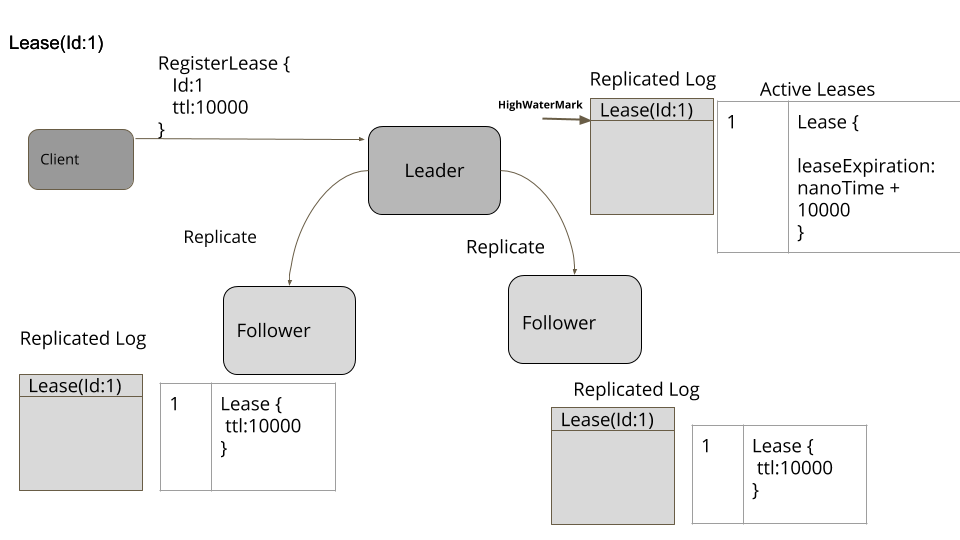

图1：注册租约

负责租约的节点会连接到领导者上，在租约过期之前刷新租约。正如在[心跳（HeartBeat）](https://heartbeat.md/)中所讨论的，它需要考虑网络的往返时间以决定“存活时间”的值。在“存活时间”间隔内，节点可以多次发出刷新请求，以确保租约在任何问题下都能刷新。但是，节点也要保证不会发送太多的刷新请求。一种合理的做法是，租约时间过半时发送请求。这样一来，在租约时间内，最多发送两次刷新请求。客户端节点可以用自己的单调时钟来跟踪时间。

```java
class LeaderLeaseTracker
{
    @Override
    public void refreshLease(String name)
    {
        Lease lease = leases.get(name);
        lease.refresh(clock.nanoTime());
    }
}
```

刷新请求只会发送给一致性内核的领导者，因为只有领导者负责决策租约何时过期。

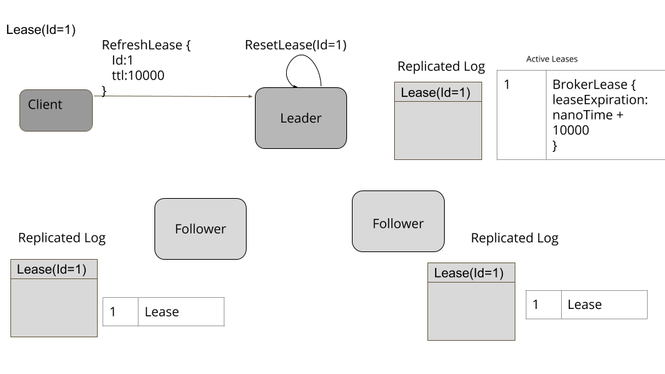

图2：刷新租约

租约过期后，领导者就会删除它。将这个信息提交到[一致性内核（Consistent Core）](https://consistent-core.md/)，这也是至关重要的。因此，领导者会发送一个请求，让租约过期，就像[一致性内核（Consistent Core）](https://consistent-core.md/)处理其它请求一样。一旦[高水位标记（High-Water Mark）](https://high-water-mark.md/)到达了提议的租约过期请求。它就从所有的追随者中彻底删除了。

```java
class LeaderLeaseTracker
{
    public void expireLease(String name)
    {
        getLogger().info("Expiring lease " + name);
        Lease removedLease = leases.remove(name);
        removeAttachedKeys(removedLease);
    }
}
```

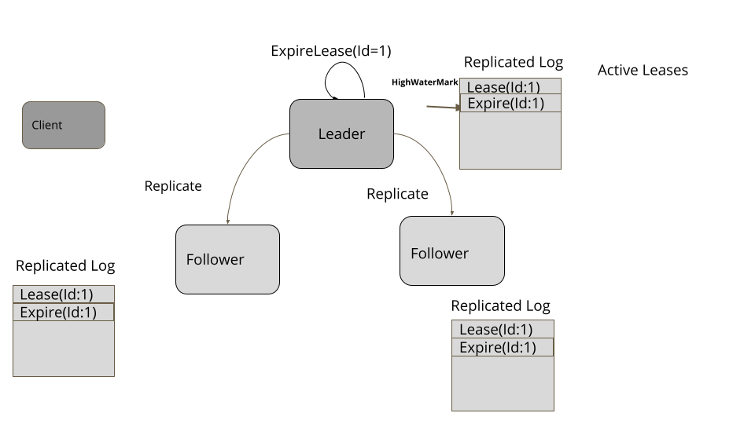

图3：过期租约

### 在键值存储中将租约与键值关联起来

集群需要知道其节点是否失效。可以这样做，节点从一致性内核中获取一个租约，然后，将它和用来识别自身的键值关联起来，存储在一致性内核里。如果集群节点在运行，它应该定期延续租约。如果租约过期，关联的键值就会删除掉。键值删除之后，就会给所有对此感兴趣的集群节点发出一个事件，表示节点失效，这在[状态监控（State Watch）](https://state-watch.md/)模式中已经讨论过了。

使用一致性内核，集群节点可以用一次网络调用创建一个租约，就像下面这样：

```java
consistentCoreClient.registerLease("server1Lease", TimeUnit.SECONDS.toNanos(5)) ;
```

然后，将租约和一致性内核上存储的识别自身的键值关联起来。

```java
consistentCoreClient.setValue("/servers/1", "
{
    address:192.168.199.10, port:8000
}
", "server1Lease") ;
```

一致性内核接收到消息后，把键值保存在键值存储中，它还会将键值同这个特定的租约关联在一起。

```java
class ReplicatedKVStore
{
    private ConcurrentHashMap<String, Lease> leases = new ConcurrentHashMap<>();
}

class ReplicatedKVStore
{
    private Response applySetValueCommand(Long walEntryId, SetValueCommand setValueCommand)
    {
        getLogger().info("Setting key value " + setValueCommand);
        if (setValueCommand.hasLease())
        {
            Lease lease = leases.get(setValueCommand.getAttachedLease());
            if (lease == null)
            {
                //The lease to attach is not available with the Consistent Core
                return Response.error(Errors.NO_LEASE_ERROR, "No lease exists with name " + setValueCommand.getAttachedLease());
            }
            lease.attachKey(setValueCommand.getKey());
        }
        kv.put(setValueCommand.getKey(), new StoredValue(setValueCommand.getValue(), walEntryId));
    }
}
```

一旦租约过期，一致性内核也会从键值存储中删除关联的键值。

```java
class LeaderLeaseTracker
{
    public void expireLease(String name)
    {
        getLogger().info("Expiring lease " + name);
        Lease removedLease = leases.remove(name);
        removeAttachedKeys(removedLease);
    }

    private void removeAttachedKeys(Lease removedLease)
    {
        if (removedLease == null)
        {
            return;
        }
        List<String> attachedKeys = removedLease.getAttachedKeys();
        for (String attachedKey : attachedKeys)
        {
            getLogger().trace("Removing " + attachedKey + " with lease " + removedLease);
            kvStore.remove(attachedKey);
        }
    }
}
```

### 处理领导者失效

当既有的领导者失效了，[一致性内核（Consistent Core）](https://consistent-core.md/)会选出一个新的领导者。一旦当选，新的领导者就要开始追踪租约。

新的领导者会刷新它所知道的所有租约。请注意，原有领导者上即将过期的租约会延长一个“存活时间”的值。这不是大问题，因为它给了客户端一个机会，重连到新的领导者，延续租约。

```java
private void refreshLeases()
{
    long now = clock.nanoTime();
    this.kvStore.getLeases().values().forEach(l ->
    {
        l.refresh(now);
        });
}
```

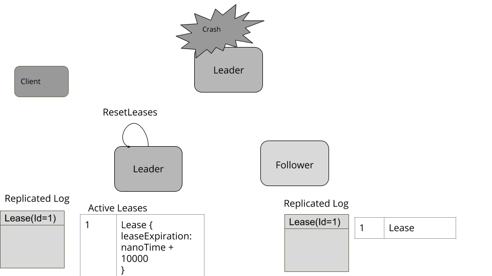

图4：在新的领导者上追踪租约

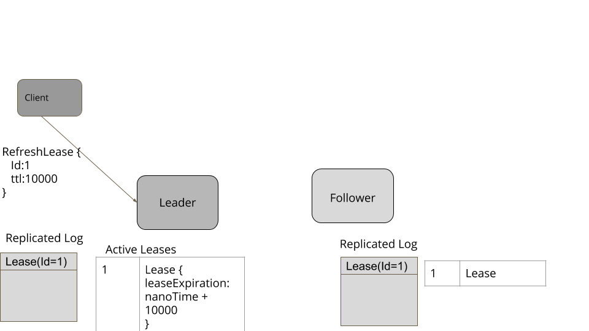

图5：在新的领导上刷新租约

## 示例

- Google 的 [chubby](https://research.google/pubs/pub27897/)
服务实现了类似的基于时间限制的租约机制。
- [zookeeper](https://zookeeper.apache.org/)
的会话管理采用了类似于复制租约的机制。
- Kafka 的 [kip-631](https://cwiki.apache.org/confluence/display/KAFKA/KIP-631%3A+The+Quorum-based+Kafka+Controller)
提出使用有时间限制的租约，对分组成员信息进行管理。
- [etcd](https://etcd.io/)
提供了有时间限制的租约设施，客户端可以用其协调其活动，以及分组成员信息和失效检测。
- [dhcp](https://en.wikipedia.org/wiki/Dynamic_Host_Configuration_Protocol)[故障恢复协议](https://tools.ietf.org/html/draft-ietf-dhc-failover-12)
协议允许连接的设备租用一个 IP 地址。多台 DHCP 服务器的
，其工作原理类似于这里阐述的实现。

**原文**

https://martinfowler.com/articles/patterns-of-distributed-systems/low-watermark.html

预写日志的一个索引，表示日志中的哪个部分是可以丢弃的。

**2020.8.18**

## 问题

预写日志维护着持久化存储的每一次更新。随着时间的推移，它会无限增长。使用[分段日志](https://segmented-log.md/)，一次可以处理更小的文件，但如果不检查，磁盘总存储量会无限增长。

## 解决方案

要有这样一种机制，告诉日志处理部分，哪部分日志可以安全地丢弃了。这种机制要给出最低的偏移或是低水位标记，也就是在这个点之前的日志都可以丢弃了。后台用一个单独的线程执行一个任务，持续检查哪部分日志可以丢弃，然后，从磁盘上删除相应的文件。

```java
this.logCleaner = newLogCleaner(config) ;
this.logCleaner.startup() ;
```

日志清理器可以实现成一个调度任务。

```java
public void startup()
{
    scheduleLogCleaning();
}

private void scheduleLogCleaning()
{
    singleThreadedExecutor.schedule(() ->
    {
        cleanLogs();
        }, config.getCleanTaskIntervalMs(), TimeUnit.MILLISECONDS);
}
```

### 基于快照的低水位标记

大多数共识算法的实现，比如，Zookeeper 或 etcd（如同 RAFT 中所定义的），都实现了快照机制。在这个实现中，存储引擎会周期地打快照。已经成功应用的日志索引也要和快照一起存起来。可以参考[预写日志（Write-Ahead Log）](https://write-ahead-log.md/)模式中的简单键值存储的实现，快照可以像下面这样打：

```java
public SnapShot takeSnapshot()
{
    Long snapShotTakenAtLogIndex = wal.getLastLogEntryId();
    return new SnapShot(serializeState(kv), snapShotTakenAtLogIndex);
}
```

快照一旦持久化到磁盘上，日志管理器就会得到低水位标记，之后，就可以丢弃旧的日志了。

```java
List<WALSegment> getSegmentsBefore(Long snapshotIndex)
{
    List<WALSegment> markedForDeletion = new ArrayList<>();
    List<WALSegment> sortedSavedSegments = wal.sortedSavedSegments;
    for (WALSegment sortedSavedSegment : sortedSavedSegments)
    {
        if (sortedSavedSegment.getLastLogEntryId() < snapshotIndex)
        {
            markedForDeletion.add(sortedSavedSegment);
        }
    }
    return markedForDeletion;
}
```

### 基于时间的低水位标记

在一些系统中，日志并不是更新系统状态所必需的，在给定的时间窗口后，日志就可以丢弃了，而无需等待其它子系统将可以删除的最低的日志索引共享过来。比如，像 Kafka 这样的系统里，日志维持七周；消息大于七周的日志段都可以丢弃。就这个实现而言，日志条目也包含了其创建的时间戳。这样，日志清理器只要检查每个日志段的最后一项，如果其在配置的时间窗口之前，这个段就可以丢弃了。

```java
private List<WALSegment> getSegmentsPast(Long logMaxDurationMs)
{
    long now = System.currentTimeMillis();
    List<WALSegment> markedForDeletion = new ArrayList<>();
    List<WALSegment> sortedSavedSegments = wal.sortedSavedSegments;
    for (WALSegment sortedSavedSegment : sortedSavedSegments)
    {
        if (timeElaspedSince(now, sortedSavedSegment.getLastLogEntryTimestamp()) > logMaxDurationMs)
        {
            markedForDeletion.add(sortedSavedSegment);
        }
    }
    return markedForDeletion;
}

private long timeElaspedSince(long now, long lastLogEntryTimestamp)
{
    return now - lastLogEntryTimestamp;
}
```

## 示例

- 所有共识算法的日志实现，比如 [Zookeeper](https://github.com/apache/zookeeper/blob/master/zookeeper-server/src/main/java/org/apache/zookeeper/server/persistence/FileTxnLog.java)[RAFT](https://github.com/etcd-io/etcd/blob/master/wal/wal.go)
和
，都实现基于快照的日志清理。
- [Kafka](https://github.com/axbaretto/kafka/blob/master/core/src/main/scala/kafka/log/Log.scala)
的存储实现遵循着基于时间的日志清理。

**原文**

https://martinfowler.com/articles/patterns-of-distributed-systems/paxos.html

采用两阶段共识构建，即便节点断开连接，也能安全地达成共识。

**2021.1.5**

## 问题

当多个节点共享状态时，它们往往需要彼此之间就对某个特定值达成一致。采用[领导者和追随者（Leader and Followers）](https://leader-and-followers.md/)模式，领导者会确定这个值，并将其传递给追随者。但是，如果没有领导者，这些节点就需要自己确定一个值。（即便采用了领导者和追随者，它们也需要这么做选举出一个领导者。）

通过采用[两阶段提交（Two Phase Commit）](https://two-phase-commit.md/)，领导者可以确保副本安全地获得更新，但是，如果没有领导者，我们可以让竞争的节点尝试获取 [Quorum](https://quorum.md/)。这个过程更加复杂，因为任何节点都可能会失效或断开连接。一个节点可能会在一个值上得到 Quorum，但在将这个值传给整个集群之前，它就断开连接了。

## 解决方案

Paxos 算法由 [Leslie Lamport](http://lamport.org/) 开发，发表于 1998 年的论文[《The Part-Time Parliament》](http://lamport.azurewebsites.net/pubs/pubs.html#lamport-paxos)中。Paxos 的工作分为三个阶段，以确保即便在部分网络或节点失效的情况下，多个节点仍能对同一值达成一致。前两个阶段的工作是围绕一个值构建共识，最后一个阶段是将该共识传达给其余的副本。

- 准备阶段：建立最新的[世代时钟（Generation Clock）](https://generation-clock.md/)
，收集已经接受的值。
- 接受阶段：提出该世代的值，让各副本接受。
- 提交阶段：让所有的副本了解已经选择的这个值。

在第一阶段（称为**准备阶段**），提出值的节点（称为**提议者**）会联系集群中的所有节点（称为**接受者**），它会询问他们是否能承诺（promise）考虑它给出的值。一旦接受者形成一个 Quorum，都返回其承诺（promise），提议者就会进入下一个阶段。在第二个阶段中（称为**接受阶段**），提议者会发出提议的值，如果节点的 Quorum 接受了这个值，那这个值就**被选中**了。在最后一个阶段（称为**提交阶段**），提议者就会把这个选中的值提交到集群的所有节点上。

### 协议流程

Paxos 是一个难于理解的协议。我们先从一个展示协议典型流程的例子开始，然后再深入到其工作细节之中。我们想通过这个解释提供一个对协议工作原理的直观感受，而非一个全面的描述当做某个实现的基础。

下面是协议的极简概述。

| 提议者 | 接受者 |
| --- | --- |
| 从[世代时钟](https://generation-clock.md/)获取下一个世代号。向所有的接受者发送带有该世代值的准备请求。 |   |
|   | 如果准备请求的世代号晚于其承诺的世代变量，它会用这个比较晚的值更新其承诺的世代，并返回一个承诺应答。如果它接受了这个提议，则返回这个提议。 |
| 收到来自接受者 Quorum 的承诺时，它会查看这些应答中包含已接受的值。如果是这样，它就把自己的提议值改成返回的具有最高世代号的提议值。向所有接受者发送接受请求，并附上它的世代号以及提议值。 |   |
|   | 如果接受请求的世代号晚于其承诺的世代变量，它会将提议存储起来，作为其接受的提议，并应答说已经接受了该请求。 |
| 收到来自接受者 Quorum 的成功响应时，它将该值记录为选中，并向所有节点发送提交消息。 |   |

这些是 paxos 的基本规则，但想要理解它们是如何组成一个有效行为却是非常困难的。因此，这里会用一个说明它是如何工作的。

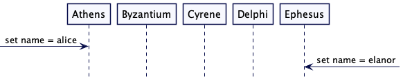

考虑一个有五个节点的集群：雅典（Athens）、拜占庭（Byzantium）、锡兰（Cyrene）、德尔菲（Delphi）和以弗所（Ephesus）。一个客户端联系雅典（Athens）节点，请求将名字设置为“alice”。雅典（Athens）现在需要发起一个 Paxos 交互，看是否所有节点都同意这个变化。雅典（Athens）称为提议者，因为在这个过程中，雅典（Athens）向所有其它节点建议将集群中的名字改成“alice”。集群中的所有节点（包括雅典（Athens）自身）都是“接受者”，这意味着它们能够接受提议。

在雅典（Athens）提议“alice”的同时，以弗所（Ephesus）节点也得到了一个请求，将名字设置为“elanor”。这让以弗所（Ephesus）也成为了一个提议者。

在准备阶段，提议者首先发送一些准备请求，这些请求都包括一个世代数。由于 Paxos 旨在避免单点故障，我们不会从单一的世代时钟中获取这个数字。相反，每个节点都维护着自己的世代时钟，它将生成号码与节点 ID 相结合。节点 ID 被用来打破平局，所以，[2,a] > [1,e] > [1,a]。每个接受者都记录着它到目前为止所见的最新承诺。

| 节点 | 雅典（Athens） | 拜占庭（Byzantium） | 锡兰（Cyrene） | 德尔菲（Delphi） | 以弗所（Ephesus） |
| --- | --- | --- | --- | --- | --- |
| 承诺的世代 | 1,a | 1,a | 0 | 1,e | 1,e |
| 接受的值 | 无 | 无 | 无 | 无 | 无 |

由于它们在此之前没有见过任何请求，所以，它们都会向调用的提议者返回一个承诺。我们将返回的值称为“承诺”，因为它表明接受者承诺不考虑任何世代时钟早于已承诺的消息。

雅典（Athens）将准备好的信息发送给锡兰（Cyrene）。当它收到一个返回的承诺时，这意味着它现在已经得到了五个节点中三个节点的承诺，这表示达成了一个 [Quorum](https://quorum.md/)。雅典（Athens）现在就从发送准备信息切换为发送接受信息。

有可能雅典（Athens）未能收到大多数集群节点的承诺。在这种情况下，雅典（Athens）可以通过递增世代时钟的方式对准备请求进行重试。

| 节点 | 雅典（Athens） | 拜占庭（Byzantium） | 锡兰（Cyrene） | 德尔菲（Delphi） | 以弗所（Ephesus） |
| --- | --- | --- | --- | --- | --- |
| 承诺的世代 | 1,a | 1,a | 1,a | 1,e | 1,e |
| 接受的值 | 无 | 无 | 无 | 无 | 无 |

雅典（Athens）现在开始发送接受信息，其中包含世代以及提议的值。雅典（Athens）和拜占庭（Byzantium）接受了该提议。

| 节点 | 雅典（Athens） | 拜占庭（Byzantium） | 锡兰（Cyrene） | 德尔菲（Delphi） | 以弗所（Ephesus） |
| --- | --- | --- | --- | --- | --- |
| 承诺的世代 | 1,a | 1,a | 1,a | 1,e | 1,e |
| 接受的值 | alice | alice | 无 | 无 | 无 |

以弗所（Ephesus）现在向锡兰（Cyrene）发出了一个准备信息。锡兰（Cyrene）曾向雅典（Athens）发出一次承诺，但以弗所（Ephesus）的请求有着更高的世代，所以它优先。锡兰（Cyrene）向以弗所（Ephesus）发回了一个承诺。

锡兰（Cyrene）现在接收到雅典（Athens）的接受请求，但却拒绝了它，因为其世代数已经落后于它对以弗所（Ephesus）的承诺。

| 节点 | 雅典（Athens） | 拜占庭（Byzantium） | 锡兰（Cyrene） | 德尔菲（Delphi） | 以弗所（Ephesus） |
| --- | --- | --- | --- | --- | --- |
| 承诺的世代 | 1,a | 1,a | 1,e | 1,e | 1,e |
| 接受的值 | alice | alice | 无 | 无 | 无 |

现在，以弗所（Ephesus）已经从它的准备消息中得到了一个 Quorum，所以，它可以继续发送接受消息了。它向自己与德尔菲（Delphi）发送了接受消息，但是，在它发送更多的接受消息之前，它崩溃了。

| 节点 | 雅典（Athens） | 拜占庭（Byzantium） | 锡兰（Cyrene） | 德尔菲（Delphi） | 以弗所（Ephesus） |
| --- | --- | --- | --- | --- | --- |
| 承诺的世代 | 1,a | 1,a | 1,e | 1,e | 1,e |
| 接受的值 | alice | alice | 无 | elanor | elanor |

与此同时，雅典（Athens）必须处理其接受请求被锡兰（Cyrene）拒绝的问题。这表明它的 Quorum 不再能够给予它承诺了，因此，其提议会失败。一个提议者像这样失去最初的 Quorum，这种情况就会发生；另一个提议者要取得 Quorum，第一个提议者的 Quorum 中至少要有一个成员叛变。

在一个简单的两阶段提交的情况下，我们会期望以弗所（Ephesus）继续执行下去，让它的值得到选择，这个模式会有问题，因为以弗所（Ephesus）已经崩溃了。如果它拥有了接受者 Quorum 的锁，它的崩溃会让整个提议过程陷入死锁。然而，Paxos 预计到这种事情会发生，因此，雅典（Athens）会再进行一次尝试，这次它会采用一个更高的世代数。

它会再次发送准备消息，但是这次的世代数会更高。同第一轮一样，它依然会得到三组承诺，但会有一个重要的区别。雅典（Athens）之前已经接受了“alice”，德尔菲（Delphi）已经接受了“elanor”。这两个接受者都返回了承诺，而且还返回了它们已经接受的值，以及它们所接受提议的世代数。在返回这个值的时候，它们会更新其承诺的世代，也就变成了[2,a]，这样就可以反映它们对雅典（Athens）所做的承诺。

| 节点 | 雅典（Athens） | 拜占庭（Byzantium） | 锡兰（Cyrene） | 德尔菲（Delphi） | 以弗所（Ephesus） |
| --- | --- | --- | --- | --- | --- |
| 承诺的世代 | 2,a | 1,a | 2,a | 2,a | 1,e |
| 接受的值 | alice | alice | 无 | elanor | elanor |

拥有了 Quorum 的雅典（Athens）现在必须进入到接受阶段，但它提议拥有最高世代的已接受值，也就是“elanor”，这是德尔菲（Delphi）所接受的，其世代为[1,e]，它大于雅典（Athens）接受的“alice”，其世代为[1,a]。

雅典（Athens）开始发送接受请求，但是，现在发出的是“elanor”及其当前世代。雅典（Athens）给自己发了一个接受请求，这会得到接受。这是一个关键的接受，因为现在有三个节点接受了“elanor”，也就是说，“elanor”达到了 Quorum，因此，我们可以认为“elanor”成为了选中的值。

| 节点 | 雅典（Athens） | 拜占庭（Byzantium） | 锡兰（Cyrene） | 德尔菲（Delphi） | 以弗所（Ephesus） |
| --- | --- | --- | --- | --- | --- |
| 承诺的世代 | 2,a | 1,a | 2,a | 2,a | 1,e |
| 接受的值 | elanor | alice | 无 | elanor | elanor |

但是，尽管“elanor”现已成为选中的值，但没人知道这一点。在接受阶段，雅典（Athens）只知道自己有“elanor”这个值，这不是一个 Quorum，而且以弗所（Ephesus）已经下线了。雅典（Athens）需要做的就是再接受到几个接受请求，它就可以提交了。但此时，雅典（Athens）崩溃了。

在这个时点上，雅典（Athens）和以弗所（Ephesus）此刻都已经崩溃了。但是集群仍然有一个节点的 Quorum 在运行，所以，它们应该能够继续工作，事实上，通过遵循协议，他们可以发现 “elanor”是选中的值。

锡兰（Cyrene）接收到一个请求，将名字设置为“carol”，因此，它变成了一个提议者。它看到了[2,a]这个世代，所以，它会启动[3,c]这个世代的准备阶段。虽然它希望提议用“carol”作为名字，但当前它只是发出了准备请求。

锡兰（Cyrene）向集群中的其余节点发送准备信息。与雅典（Athens）之前的准备阶段一样，锡兰（Cyrene）会得到已接受的值，所以，“carol”不会得到提议的机会。同之前一样，德尔菲（Delphi）的“elanor”比拜占庭（Byzantium）的“alice”晚，所以，锡兰（Cyrene）会用 “elanor”和[3,c]开启一个接受阶段。

| 节点 | 雅典（Athens） | 拜占庭（Byzantium） | 锡兰（Cyrene） | 德尔菲（Delphi） | 以弗所（Ephesus） |
| --- | --- | --- | --- | --- | --- |
| 承诺的世代 | 2,a | 3,c | 3,c | 3,c | 1,e |
| 接受的值 | elanor | alice | 无 | elanor | elanor |

虽然我还可以继续崩溃和唤醒节点，但现在很明显，“elanor”将赢得胜利。只要有节点的 Quorum 在运行，其中至少有一个节点的值是 “elanor”，任何试图进行准备的节点都必须联系一个接受了“elanor”的节点，以便在准备阶段获得一个 Quorum。因此，我们将以 锡兰（Cyrene）发出提交结束这个讨论。

在某些时点，雅典（Athens）和以弗所（Ephesus）会重新上线，它们会发现 Quorum 的选择。

### 请求无需拒绝

在上面的例子中，我们看到接受者拒绝了世代较老的请求。但是，协议并不要求像这样明确地拒绝。按照规定，接受者可以直接忽略一个过期的请求。如果是这种情况，那么，协议仍然可以收敛在一个共识的值上。这是协议的一个重要特征，因为这是一个分布式系统，连接在任何时候都可能会丢失，所以，不依赖拒绝，对于确保协议安全而言，是有益的。（这里的安全意味着协议将会选择唯一的一个值，一旦选择，就不会改写）。

然而，发送拒绝书仍然是有用的，因为它可以提高性能。提议者越快地发现它们已经老了，它们就能越快开始另一轮更高的世代。

### 竞争的提议者可能无法选择

这个协议可能出错的一种方式是，两个（或更多）提议者进入了一个循环。

- 雅典（Athens）和拜占庭（Byzantium）接受了 alice。
- 所有节点都为 elanor 做了准备，这阻止 alice 获得 Quorum。
- 德尔菲（Delphi）和以弗所（Ephesus）接受了 elanor。
- 所有节点都为 alice 做了准备，这阻止 elanor 获得 Quorum。
- 雅典（Athens）和拜占庭（Byzantium）接受了 alice。

…以此类推，这种情况称为活锁（livelock）。

[FLP的不可能性结果（FLP Impossibility Result）](/assets/files/learning/distributed/distributed-system-cn-wal/f43709b64e1b547696a5c7d69121c32c.pdf)显示，即使只有一个有问题的节点，这也能阻止整个集群选出一个值。

每当一个提议者需要选择一个新的世代时，它必须等待一段随机的时间，我们可以以此确保减少这种活锁发生的机会。一个提议者在另一个提议者向全部 Quorum 发起准备请求之前，就让一个 Quorum 得到接受，这种随机性就让这种情况成为了可能。

但我们永远无法杜绝活锁的发生。这是一个基本的权衡：要么确保安全，要么确保活锁，二者不能得兼。Paxos 首先确保安全。

### 一个样例的键值存储

这里解释的 Paxos 协议，构建的是对于单一值的共识（通常称为单一 Paxos）。大多数主流产品（如 [Cosmos DB](https://docs.microsoft.com/en-us/azure/cosmos-db/introduction) 或 [Spanner](https://cloud.google.com/spanner)）中使用的实际实现都是对 Paxos 进行了修改，称为多重 paxos，其实现方式为 [复制日志（Replicated Log）](https://replicated-log.md/)。

但是，一个简单的键值存储可以使用基本的 Paxos 进行构建。[cassandra](http://cassandra.apache.org/) 以类似的方式使用基本 Paxos 实现了其轻量级的事务。

键值存储为每个键值维护了一个 Paxos 实例。

```java
class PaxosPerKeyStore
{
    int serverId;

    public PaxosPerKeyStore(int serverId)
    {
        this.serverId = serverId;
    }

    Map<String, Acceptor> key2Acceptors = new HashMap<String, Acceptor>();
    List<PaxosPerKeyStore> peers;
}
```

Acceptor 存储了 promisedGeneration、acceptedGeneration 和 acceptedValue。

```java
class Acceptor…

public class Acceptor
{
    MonotonicId promisedGeneration = MonotonicId.empty();
    Optional<MonotonicId> acceptedGeneration = Optional.empty();
    Optional<Command> acceptedValue = Optional.empty();
    Optional<Command> committedValue = Optional.empty();
    Optional<MonotonicId> committedGeneration = Optional.empty();
    public AcceptorState state = AcceptorState.NEW;
    private BiConsumer<Acceptor, Command> kvStore;
}
```

当键值和值放到了 kv 存储时，它就运行了 Paxos 协议。

```java
class PaxosPerKeyStore
{
    int maxKnownPaxosRoundId = 1;
    int maxAttempts = 4;

    public void put(String key, String defaultProposal)
    {
        int attempts = 0;
        while (attempts <= maxAttempts)
        {
            attempts++;
            MonotonicId requestId = new MonotonicId(maxKnownPaxosRoundId++, serverId);
            SetValueCommand setValueCommand = new SetValueCommand(key, defaultProposal);
            if (runPaxos(key, requestId, setValueCommand))
            {
                return;
            }
            Uninterruptibles.sleepUninterruptibly(ThreadLocalRandom.current().nextInt(100), MILLISECONDS);
            logger.warn("Experienced Paxos contention. Attempting with higher generation");
        }
        throw new WriteTimeoutException(attempts);
    }

    private boolean runPaxos(String key, MonotonicId generation, Command initialValue)
    {
        List<Acceptor> allAcceptors = getAcceptorInstancesFor(key);
        List<PrepareResponse> prepareResponses = sendPrepare(generation, allAcceptors);
        if (isQuorumPrepared(prepareResponses))
        {
            Command proposedValue = getValue(prepareResponses, initialValue);
            if (sendAccept(generation, proposedValue, allAcceptors))
            {
                sendCommit(generation, proposedValue, allAcceptors);
            }
            if (proposedValue == initialValue)
            {
                return true;
            }
        }
        return false;
    }

    public Command getValue(List<PrepareResponse> prepareResponses, Command initialValue)
    {
        PrepareResponse mostRecentAcceptedValue = getMostRecentAcceptedValue(prepareResponses);
        Command proposedValue
        = mostRecentAcceptedValue.acceptedValue.isEmpty() ? initialValue : mostRecentAcceptedValue.acceptedValue.get();
        return proposedValue;
    }

    private PrepareResponse getMostRecentAcceptedValue(List<PrepareResponse> prepareResponses)
    {
        return prepareResponses.stream().max(Comparator.comparing(r -> r.acceptedGeneration.orElse(MonotonicId.empty()))).get();
    }
}

class Acceptor
{
    public PrepareResponse prepare(MonotonicId generation)
    {
        if (promisedGeneration.isAfter(generation))
        {
            return new PrepareResponse(false, acceptedValue, acceptedGeneration, committedGeneration, committedValue);
        }
        promisedGeneration = generation;
        state = AcceptorState.PROMISED;
        return new PrepareResponse(true, acceptedValue, acceptedGeneration, committedGeneration, committedValue);
    }
}

class Acceptor
{
    public boolean accept(MonotonicId generation, Command value)
    {
        if (generation.equals(promisedGeneration) || generation.isAfter(promisedGeneration))
        {
            this.promisedGeneration = generation;
            this.acceptedGeneration = Optional.of(generation);
            this.acceptedValue = Optional.of(value);
            return true;
        }
        state = AcceptorState.ACCEPTED;
        return false;
    }
}
```

只有当值成功地提交时，它才会存储到 kv 存储中。

```java
class Acceptor
{
    public void commit(MonotonicId generation, Command value)
    {
        committedGeneration = Optional.of(generation);
        committedValue = Optional.of(value);
        state = AcceptorState.COMMITTED;
        kvStore.accept(this, value);
    }
}

class PaxosPerKeyStore
{
    private void accept(Acceptor acceptor, Command command)
    {
        if (command instanceof SetValueCommand)
        {
            SetValueCommand setValueCommand = (SetValueCommand) command;
            kv.put(setValueCommand.getKey(), setValueCommand.getValue());
        }
        acceptor.resetPaxosState();
    }
}
```

Paxos 状态需要持久化。使用[预写日志（Write-Ahead Log）](https://write-ahead-log.md/)可以轻松做到这一点。

### 处理多值

值得注意的是，Paxos 在处理单值上有详细的做法，而且得到了证明。因此，用单值 Paxos 协议处理多值需要在协议规范之外进行处理。一种替代方法是重置状态，单独存储提交过的值，以确保它们不会丢失。

```java
class Acceptor
{
    public void resetPaxosState()
    {
        //This implementation has issues if committed values are not stored
        // and handled separately in the prepare phase.
        // See Cassandra implementation for details.
        // https://github.com/apache/cassandra/blob/trunk/src/java/org/apache/cassandra/db/SystemKeyspace.java#L1232
        promisedGeneration = MonotonicId.empty();
        acceptedGeneration = Optional.empty();
        acceptedValue = Optional.empty();
    }
}
```

[(gryadka)[https://github.com/gryadka/js]]给出了另外一种做法，它稍微修改了一下基本的 Paxos 以便设置多个值。在基本的算法之外执行一些步骤，这种需求就是在实践中首选[复制日志（Replicated Log）](https://replicated-log.md/)的原因。

### 读取值

Paxos 依靠于准备阶段对任何未提交的值进行检测。因此，如果采用基本的 Paxos 实现如上所示的键值存储，那读取操作也需要运行完整的 Paxos 算法。

```java
class PaxosPerKeyStore
{
    public String get(String key)
    {
        int attempts = 0;
        while (attempts <= maxAttempts)
        {
            attempts++;
            MonotonicId requestId = new MonotonicId(maxKnownPaxosRoundId++, serverId);
            Command getValueCommand = new NoOpCommand(key);
            if (runPaxos(key, requestId, getValueCommand))
            {
                return kv.get(key);
            }
            Uninterruptibles.sleepUninterruptibly(ThreadLocalRandom.current().nextInt(100), MILLISECONDS);
            logger.warn("Experienced Paxos contention. Attempting with higher generation");
        }
        throw new WriteTimeoutException(attempts);
    }
}
```

## 示例

[cassandra](http://cassandra.apache.org/) 采用 Paxos 实现了轻量级事务。

所有的共识算法，比如 [Raft](https://raft.github.io/)，都采用了类似于基本的 Paxos 的基本概念。[两阶段提交（Two Phase Commit）](https://two-phase-commit.md/)、[Quorum](https://quorum.md/) 和[世代时钟（Generation Clock）](https://generation-clock.md/)的使用方式都是类似的。

**原文**

https://martinfowler.com/articles/patterns-of-distributed-systems/quorum.html

每个决策都需要大多数服务器同意，避免两组服务器各自独立做出决策。

**2020.8.11**

## 问题

在一个分布式系统中，无论服务器采取任何的行动，都要确保即便在发生崩溃的情况下，行动的结果都能够对客户端可用。要做到这一点，可以将结果复制到其它的服务器上。但是，这就引出了一个问题：需要有多少服务器确认了这次复制之后，原来的服务器才能确信这次更新已经完全识别。如果原来的服务器要等待过多的复制，它的响应速度就会降低——也就减少了活跃度。但如果没有足够的复制，更新可能会丢失掉——安全性失效。在整体系统性能和系统连续性之间取得平衡，这一点至关重要。

## 解决方案

集群收到一次更新，在集群中的大多数节点确认了这次更新之后，集群才算是确认了这次更新。我们将这个数量称之为 Quorum。因此，如果我们的集群有 5 个节点，我们需要让 Quorum 为 3（对于 n 个节点的集群而言，quorum 是 n/2 + 1）。

Quorum 的需求表示，可以容忍多少的失效——这就是集群规模减去 Quorum。5 个节点的集群能够容忍其中的 2 个节点失效。总的来说，如果我们想容忍 “f” 个失效，集群的规模应该是 2f + 1。

考虑下面两个需要 Quorum 的例子：

- **更新服务器集群中的数据**[高水位标记（High-Water Mark）](https://high-water-mark.md/)
。
保证了一点，只有大多数服务器上确保可用的数据才是对客户端可见的。
- **领导者选举**[领导者和追随者（Leader and Followers）](https://leader-and-followers.md/)
。在
模式中，领导者只有得到大多数服务器投票才会当选。

### 确定集群中服务器的数量

只有在大部分服务器都在运行时，集群才能发挥其作用。进行数据复制的系统中，有两点需要考虑：

- 写操作的吞吐
每次数据写入集群时，都需要复制到多台服务器上。每新增一台服务器都会增加完成这次写入的开销。数据写的延迟直接正比于形成 Quorum 的服务器数量。正如我们将在下面看到的，如果集群中的服务器数量翻倍，吞吐值将会降低到原有集群的一半。
- 能够容忍的失效数量
能容忍的失效服务器数量取决于集群的规模。但是，向既有集群增加一台服务器并非总能得到更多的容错率：在一个有三台服务器的集群中，增加一台服务器，并不会增加失效容忍度。

考虑到这两个因素，大多数实用的基于 Quorum 的系统集群规模通常是三台或五台。五台服务器集群能够容忍两台服务器失效，其可容忍数据写入的吞吐是每秒几千个请求。

下面是一个选择服务器数量的例子，根据可容忍的失效数量，以及在吞吐上近似的影响。吞吐一列展示了近似的相对吞吐量，这样就凸显出吞吐量随着服务器数量的增加而降低。这个数字会因系统而异。作为一个例子，读者可以参考在 [Raft 论文](/assets/files/learning/distributed/distributed-system-cn-wal/3a7de429e1bcc28fe993e443e3f03efb.pdf)和原始的 [Zookeeper](/assets/files/learning/distributed/distributed-system-cn-wal/9c839fc8da6b148289bd561c439de29f.pdf) 论文中公布的实际的吞吐数据。

| 服务器的数量 | Quorum | 可容忍的失效数量 | 表现的吞吐量 |
| --- | --- | --- | --- |
| 1 | 1 | 0 | 100 |
| 2 | 2 | 0 | 85 |
| 3 | 2 | 1 | 82 |
| 4 | 3 | 1 | 57 |
| 5 | 3 | 2 | 48 |
| 6 | 4 | 2 | 41 |
| 7 | 5 | 3 | 36 |

## 示例

- 所有的共识实现都是基于 Quorum 的，比如，[Zab](https://zookeeper.apache.org/doc/r3.4.13/zookeeperInternals.html#sc_atomicBroadcast)[Raft](https://raft.github.io/)[Paxos](https://en.wikipedia.org/wiki/Paxos_(computer_science))
- 即便是不使用共识的系统，也会使用 Quorum，确保在失效或网络分区的情况下，最新的更新也至少在一台服务器上是可用的。比如，在像 [Cassandra](http://cassandra.apache.org/)
这样的数据库里，要配置成只在大多数服务器更新记录成功之后，数据库更新才返回成功。

**原文**

https://martinfowler.com/articles/patterns-of-distributed-systems/replicated-log.html

通过使用复制到所有集群节点的预写日志，保持多个节点的状态同步。

**2022.1.11**

## 问题

当多个节点共享一个状态时，该状态就需要同步。所有的集群节点都需要对同样的状态达成一致，即便某些节点崩溃或是断开连接。这需要对每个状态变化请求达成共识。

但仅仅在单个请求上达成共识是不够的。每个副本还需要以相同的顺序执行请求，否则，即使它们对单个请求达成了共识，不同的副本会进入不同的最终状态。

## 解决方案

集群节点维护了一个[预写日志（Write-Ahead Log）](https://write-ahead-log.md/)。每个日志条目都存储了共识所需的状态以及相应的用户请求。这些节点通过日志条目的协调建立起了共识，这样一来，所有的节点都拥有了完全相同的预写日志。然后，请求按照日志的顺序进行执行。因为所有的集群节点在每条日志条目都达成了一致，它们就是以相同的顺序执行相同的请求。这就确保了所有集群节点共享相同的状态。

使用 [Quorum](https://quorum.md/) 的容错共识建立机制需要两个阶段。

- 一个阶段负责建立[世代时钟（Generation Clock）](https://generation-clock.md/)[Quorum](https://quorum.md/)
，了解在前一个
中复制的日志条目。
- 一个阶段负责在所有集群节点上复制请求。

每次状态变化的请求都去执行两个阶段，这么做并不高效。所以，集群节点会在启动时选择一个领导者。领导者会在选举阶段建立起[世代时钟（Generation Clock）](https://generation-clock.md/)，然后检测上一个 [Quorum](https://quorum.md/) 所有的日志条目。（前一个领导者或许已经将大部分日志条目复制到了大多数集群节点上。）一旦有了一个稳定的领导者，复制就只由领导者协调了。客户端与领导者通信。领导者将每个请求添加到日志中，并确保其复制到到所有的追随者上。一旦日志条目成功地复制到大多数追随者，共识就算已经达成。按照这种方式，当有一个稳定的领导者时，对于每次状态变化的操作，只要执行一个阶段就可以达成共识。

### 多 Paxos 和 Raft

[多 Paxos](https://www.youtube.com/watch?v=JEpsBg0AO6o&t=1920s) 和 [Raft](https://raft.github.io/) 是最流行的实现复制日志的算法。多 Paxos 只在学术论文中有描述，却又语焉不详。[Spanner](https://cloud.google.com/spanner) 和 [Cosmos DB](https://docs.microsoft.com/en-us/azure/cosmos-db/introduction) 等云数据库采用了[多 Paxos](https://www.youtube.com/watch?v=JEpsBg0AO6o&t=1920s)，但实现细节却没有很好地记录下来。Raft 非常清楚地记录了所有的实现细节，因此，它成了大多数开源系统的首选实现方式，尽管 Paxos 及其变体在学术界得到了讨论得更多。

### 复制客户端请求

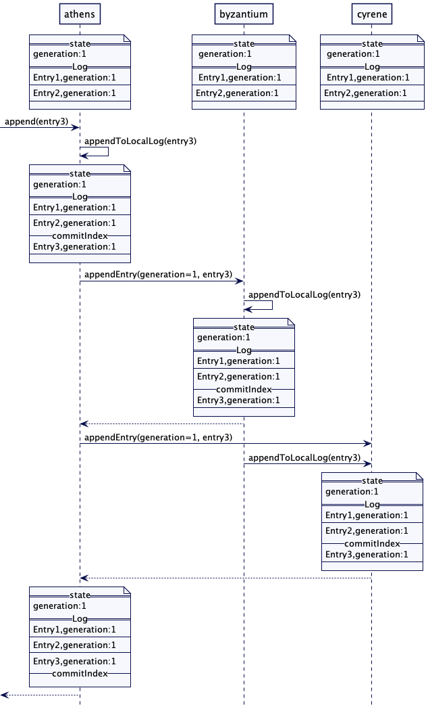

图1：复制

对于每个日志条目而言，领导者会将其追加到其本地的预写日志中，然后，将其发送给所有追随者。

```java
leader(class ReplicatedLog...)

private Long appendAndReplicate(byte[] data)
{
    Long lastLogEntryIndex = appendToLocalLog(data);
    replicateOnFollowers(lastLogEntryIndex);
    return lastLogEntryIndex;
}

private void replicateOnFollowers(Long entryAtIndex)
{
    for (final FollowerHandler follower : followers)
    {
        replicateOn(follower, entryAtIndex);
        //send replication requests to followers
    }
}
```

追随者处理复制请求，将日志条目追加到其本地日志中。在成功追加日志条目后，他们将其拥有的最新日志条目索引回应给领导者。应答还要包括服务器的当前[世代时钟](https://generation-clock.md/)。

追随者还会检查日志条目是否已经存在，或者是否存在超出正在复制的日志条目。它会忽略了已经存在的日志条目。但是，如果有来自不同世代的日志条目，它们也会删除存在冲突的日志条目。

```java
follower(class ReplicatedLog...)

void maybeTruncate(ReplicationRequest replicationRequest)
{
    replicationRequest.getEntries().stream().filter(entry -> wal.getLastLogIndex() >= entry.getEntryIndex() && entry.getGeneration() != wal.readAt(entry.getEntryIndex()).getGeneration()).forEach(entry -> wal.truncate(entry.getEntryIndex()));
}

follower(class ReplicatedLog...)

private ReplicationResponse appendEntries(ReplicationRequest replicationRequest)
{
    List<WALEntry> entries = replicationRequest.getEntries();
    entries.stream().filter(e -> !wal.exists(e)).forEach(e -> wal.writeEntry(e));
    return new ReplicationResponse(SUCCEEDED, serverId(), replicationState.getGeneration(), wal.getLastLogIndex());
}
```

当复制请求中的世代数低于服务器知道的最新世代数时，跟随者会拒绝这个复制请求。这样一来就给了领导一个通知，让它下台，变成一个追随者。

```java
follower(class ReplicatedLog...)

Long currentGeneration =replicationState.getGeneration();
if(currentGeneration >request.getGeneration())
{
    return new ReplicationResponse(FAILED, serverId(),currentGeneration,wal.getLastLogIndex());
}
```

收到响应后，领导者会追踪每个服务器上复制的日志索引。领导者会利用它追踪成功复制到 [Quorum](https://quorum.md/) 日志条目，这个索引会当做提交索引（commitIndex）。commitIndex 就是日志中的[高水位标记（High-Water Mark）](https://high-water-mark.md/)

```java
leader(class ReplicatedLog...)

logger.info("Updating matchIndex for "+response.getServerId() +" to "+response.getReplicatedLogIndex());
updateMatchingLogIndex(response.getServerId(),response.getReplicatedLogIndex());

var logIndexAtQuorum = computeHighwaterMark(logIndexesAtAllServers(), config.numberOfServers());
var currentHighWaterMark = replicationState.getHighWaterMark();
if(logIndexAtQuorum >currentHighWaterMark &&logIndexAtQuorum !=0)
{
    applyLogEntries(currentHighWaterMark, logIndexAtQuorum);
    replicationState.setHighWaterMark(logIndexAtQuorum);
}

leader(class ReplicatedLog...)
Long computeHighwaterMark(
List<Long> serverLogIndexes, int noOfServers)
{
    serverLogIndexes.sort(Long::compareTo);
    return serverLogIndexes.get(noOfServers /2);
}

leader(class ReplicatedLog...)

private void updateMatchingLogIndex(int serverId, long replicatedLogIndex)
{
    FollowerHandler follower = getFollowerHandler(serverId);
    follower.updateLastReplicationIndex(replicatedLogIndex);
}

leader(class ReplicatedLog...)

public void updateLastReplicationIndex(long lastReplicatedLogIndex)
{
    this.matchIndex = lastReplicatedLogIndex;
}
```

### 完全复制

有一点非常重要，就是要确保所有的节点都能收到来自领导者所有的日志条目，即便是节点断开连接，或是崩溃之后又恢复之后。Raft 有个机制确保所有的集群节点能够收到来自领导者的所有日志条目。

在 Raft 的每个复制请求中，领导者还会发送在复制日志条目前一项的日志索引及其世代。如果前一项的日志条目索引和世代与本地日志中的不匹配，追随者会拒绝该请求。这就向领导者表明，追随者的日志需要同步一些较早的日志条目。

```java
follower(class ReplicatedLog...)

if(!wal.isEmpty() &&request.getPrevLogIndex() >=wal.getLogStartIndex() && generationAt(request.getPrevLogIndex())!=request.getPrevLogGeneration())
{
    return new ReplicationResponse(FAILED, serverId(),replicationState.getGeneration(),wal.getLastLogIndex());
}

follower(class ReplicatedLog...)

private Long generationAt(long prevLogIndex)
{
    WALEntry walEntry = wal.readAt(prevLogIndex);
    return walEntry.getGeneration();
}
```

这样，领导者会递减匹配索引（matchIndex），并尝试发送较低索引的日志条目。它会一直这么做，直到追随者接受复制请求。

```java
leader (class ReplicatedLog...) //rejected because of conflicting entries, decrement matchIndex FollowerHandler peer = getFollowerHandler(response.getServerId()) ;
logger.info("decrementing nextIndex for peer " + peer.getId() + " from " + peer.getNextIndex()) ;
peer.decrementNextIndex() ;
replicateOn(peer, peer.getNextIndex()) ;
```

这个对前一项日志索引和世代的检查允许领导者检测两件事。

- 追随者是否存在日志条目缺失。例如，如果追随者只有一个条目，而领导者要开始复制第三个条目，那么，这个请求就会遭到拒绝，直到领导者复制第二个条目。
- 日志中的前一个是否来自不同的世代，与领导者日志中的对应条目相比，是高还是低。领导者会尝试复制索引较低的日志条目，直到请求得到接受。追随者会截断世代不匹配的日志条目。

按照这种方式，领导者通过使用前一项的索引检测缺失或冲突的日志条目，尝试将自己的日志推送给所有的追随者。这就确保了所有的集群节点最终都能收到来自领导者的所有日志条目，即使它们断开了一段时间的连接。

Raft 没有单独的提交消息，而是将提交索引（commitIndex）作为常规复制请求的一部分进行发送。空的复制请求也可以当做心跳发送。因此，commitIndex 会当做心跳请求的一部分发送给追随者。

### 日志条目以日志顺序执行

一旦领导者更新了它的 commitIndex，它就会按顺序执行日志条目，从上一个 commitIndex 的值执行到最新的 commitIndex 值。一旦日志条目执行完毕，客户端请求就完成了，应答会返回给客户端。

```java
class ReplicatedLog…

private void applyLogEntries(Long previousCommitIndex, Long commitIndex)
{
    for (long index = previousCommitIndex + 1; index <= commitIndex; index++)
    {
        WALEntry walEntry = wal.readAt(index);
        var responses = stateMachine.applyEntries(Arrays.asList(walEntry));
        completeActiveProposals(index, responses);
    }
}
```

领导者还会在它发送给追随者的心跳请求中发送 commitIndex。追随者会更新 commitIndex，并以同样的方式应用这些日志条目。

```java
class ReplicatedLog…

private void updateHighWaterMark(ReplicationRequest request)
{
    if (request.getHighWaterMark() > replicationState.getHighWaterMark())
    {
        var previousHighWaterMark = replicationState.getHighWaterMark();
        replicationState.setHighWaterMark(request.getHighWaterMark());
        applyLogEntries(previousHighWaterMark, request.getHighWaterMark());
    }
}
```

### 领导者选举

领导者选举就是检测到日志条目在前一个 Quorum 中完成提交的阶段。每个集群节点都会在三种状态下运行：候选者（candidate）、领导者（leader）和追随者（follower）。在追随者状态下，在启动时，集群节点会期待收到来自既有领导者的[心跳（HeartBeat）](https://heartbeat.md/)。如果一个追随者在预先确定的时间段内没有听到领导者任何声音，它就会进入到候选者状态，开启领导者选举。领导者选举算法会建立一个新的[世代时钟（Generation Clock）](https://generation-clock.md/)值。Raft 将[世代时钟（Generation Clock）](https://generation-clock.md/)称为任期（term）。

领导者选举机制也确保当选的领导者拥有 Quorum 所规定的最新日志条目。这是Raft所做的一个优化，避免了日志条目要从以前的 Quorum 转移新的领导者上。

新领导者选举的启动要通过向每个对等服务器发送消息，请求开始投票。

```java
class ReplicatedLog…

private void startLeaderElection()
{
    replicationState.setGeneration(replicationState.getGeneration() + 1);
    registerSelfVote();
    requestVoteFrom(followers);
}
```

一旦服务器在某一[世代时钟（Generation Clock）](https://generation-clock.md/)投票中得到投票，服务器总会为同样的世代返回同样的投票。这就确保了在选举成功发生的情况下，如果其它服务器以同样的世代请求投票，它是不会当选的。投票请求的处理过程如下：

```java
class ReplicatedLog…

VoteResponse handleVoteRequest(VoteRequest voteRequest)
{
    //for higher generation request become follower.
    // But we do not know who the leader is yet.
    if (voteRequest.getGeneration() > replicationState.getGeneration())
    {
        becomeFollower(LEADER_NOT_KNOWN, voteRequest.getGeneration());
    }
    VoteTracker voteTracker = replicationState.getVoteTracker();
    if (voteRequest.getGeneration() == replicationState.getGeneration() && !replicationState.hasLeader())
    {
        if (isUptoDate(voteRequest) && !voteTracker.alreadyVoted())
        {
            voteTracker.registerVote(voteRequest.getServerId());
            return grantVote();
        }
        if (voteTracker.alreadyVoted())
        {
            return voteTracker.votedFor == voteRequest.getServerId() ? grantVote() : rejectVote();
        }
    }
    return rejectVote();
}

private boolean isUptoDate(VoteRequest voteRequest)
{
    boolean result = voteRequest.getLastLogEntryGeneration() > wal.getLastLogEntryGeneration() || (voteRequest.getLastLogEntryGeneration() == wal.getLastLogEntryGeneration() && voteRequest.getLastLogEntryIndex() >= wal.getLastLogIndex());
    return result;
}
```

收到大多数服务器投票的服务器会切换到领导者状态。这里的大多数是按照 [Quorum](https://quorum.md/) 讨论的方式确定的。一旦当选，领导者会持续地向所有的追随者发送[心跳（HeartBeat）](https://heartbeat.md/)。如果追随者在指定的时间间隔内没有收到[心跳（HeartBeat）](https://heartbeat.md/)，就会触发新的领导者选举。

### 来自上一世代的日志条目

如上节所述，共识算法的第一阶段会检测既有的值，这些值在算法的前几次运行中已经复制过了。另一个关键点是，这些值就会提议为领导者最新世代的值。第二阶段会决定，只有当这些值提议为当前世代的值时，这些值才会得到提交。Raft 不会更新既有日志条目的世代数。因此，如果领导者拥有来自上一世代的日志条目，而这些条目在一些追随者中是缺失的，它不会仅仅根据大多数的 Quorum 就将这些条目标记为已提交。这是因为有其它服务器可能此时处于不可用的状态，但其拥有同样索引但更高世代的条目。如果领导者在没有复制其当前世代这些日志条目的情况下宕机了，这些条目就会被新的领导者改写。所以，在 Raft 中，新的领导者必须在其任期（term）内提交至少一个条目。然后，它可以安全地提交所有以前的条目。大多数实际的 Raft 实现都在领导者选举后，立即提交一个空操作（no-op）的日志项，这个动作会在领导者得到承认为客户端请求提供服务之前。详情请参考 [raft-phd](assets/files/learning/distributed/2022-08-12-distributed-system-cn-wal/OngaroPhD.pdf) 3.6.1节。

### 一次领导者选举的示例

考虑有五个服务器：雅典（athens）、拜占庭（byzantium）、锡兰（cyrene）、德尔菲（delphi）和以弗所（ephesus）。以弗所是第一代的领导者。它已经把日志条目复制了其自身、德尔菲和雅典。

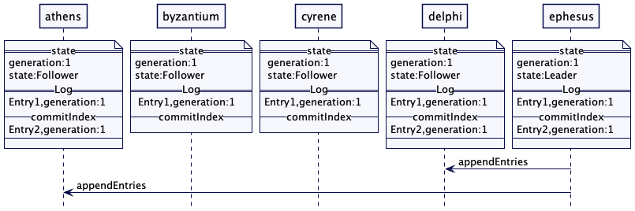

图2：失去连接触发选举

此时，以弗所（ephesus）和德尔菲（delphi）同集群的其它节点失去连接。

拜占庭（byzantium）有最小的选举超时，因此，它会把[世代时钟（Generation Clock）](https://generation-clock.md/)递增到 2，由此触发选举。锡兰（cyrene）其世代小于 2，而且它也有同拜占庭（byzantium）同样的日志条目。因此，它会批准这次投票。但是，雅典（athens）其日志中有额外的条目。因此，它会拒绝这次投票。

因为拜占庭（byzantium）无法获得多数的 3 票，所以，它就失去了选举权，回到追随者状态。

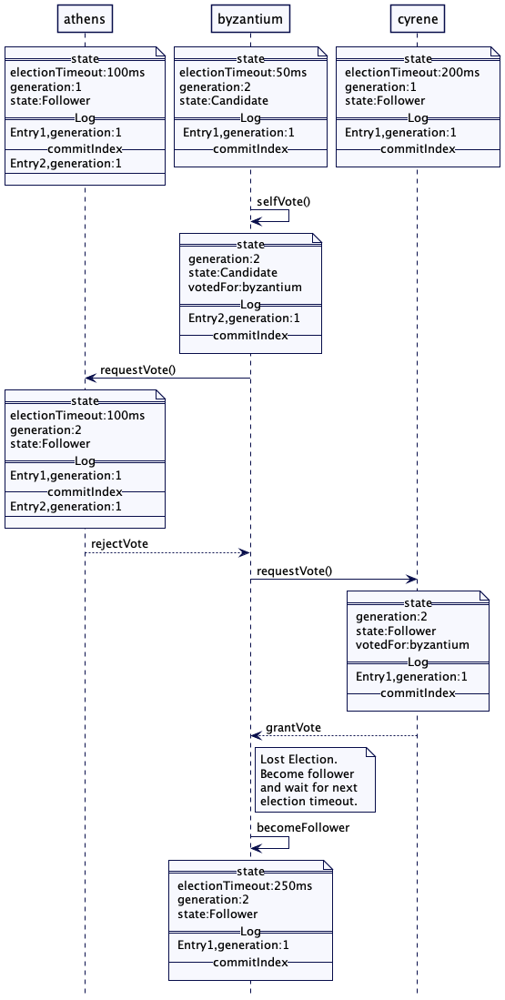

图3：因为日志不是最新的，失去了选举权

雅典（athens）超时，触发下一轮选举。它将[世代时钟（Generation Clock）](https://generation-clock.md/)递增到 3，并向拜占庭（byzantium）和锡兰（cyrene）发送了投票请求。因为拜占庭（byzantium）和锡兰（cyrene）的世代数比较低，也比雅典（athens）的日志条目少，二者都批准了雅典（athens）的投票。一旦雅典（athens）获得了大多数的投票，它就会变成领导者，开始向拜占庭（byzantium）和锡兰（cyrene）发送心跳。一旦拜占庭（byzantium）和锡兰（cyrene）接收到了来自更高世代的心跳，它们会递增他们的世代。这就确认了雅典（athens）的领导者地位，雅典（athens）随后就会将自己的日志复制给拜占庭（byzantium）和锡兰（cyrene）。

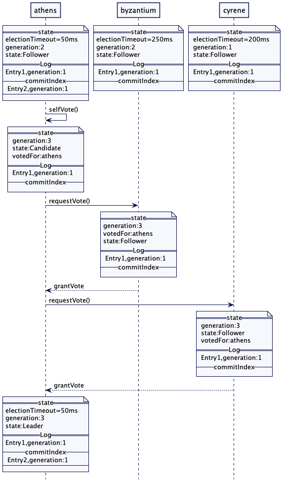

图4：拥有最新日志的节点赢得选举

雅典（athens）现在将来自世代 1 的 Entry2 复制给拜占庭（byzantium）和锡兰（cyrene）。但由于它是上一代的日志条目，即便 Entry2 成功的在大多数 Quorum 上复制，它也不会更新提交索引（commitIndex）。

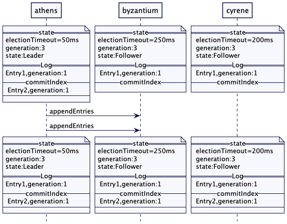

雅典（athens）在其本地日志中追加了一个空操作（no-op）的条目。在这个第 3 代的新条目成功复制后，它会更新提交索引（commitIndex）。

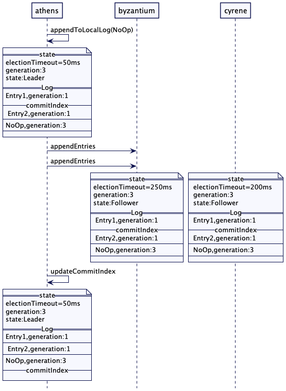

如果以弗所（ephesus）回来或是恢复了网络连接，它会向锡兰（cyrene）发送请求。因为锡兰（cyrene）现在是第 3 代了，它会拒绝这个请求。以弗所（ephesus）会在拒绝应答中得到新的任期（term），下台成为一个追随者。

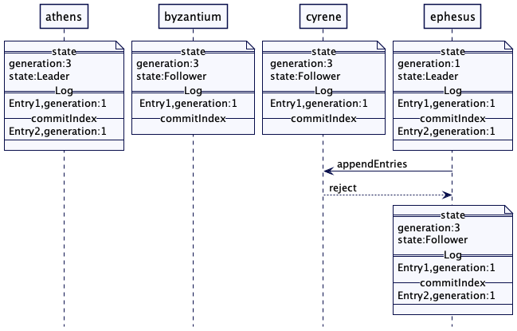

图7：Leader step-down

### 技术考量

以下是任何复制日志机制都需要有的一些重要技术考量。

- 任何共识建立机制的第一阶段都需要了解日志条目在上一个 Quorum 上可能已经复制过了。领导者需要了解所有这些条目，确保它们复制到集群的每个节点上。

Raft 会确保当选领导者的集群节点拥有同服务器的 Quorum 拥有同样的最新日志，所以，日志条目无需从其它集群节点传给新的领导者。

有可能一些条目存在冲突。在这种情况下，追随者日志中冲突的条目会被覆盖。

- 有可能集群中的一些集群节点落后了，可能是因为它们崩溃后重新启动，可能是与领导者断开了连接。领导者需要跟踪每个集群节点，确保它发送了所有缺失的日志条目。

Raft 会为每个集群节点维护一个状态，以便了解在每个节点上都已成功复制的日志条目的索引。向每个节点发送的复制请求都会包含从这个日志索引开始的所有条目，确保每个集群节点获得所有的日志条目。

- 客户端如何与复制日志进行交互，以找到领导，这个实现在[一致性内核（Consistent Core）](https://consistent-core.md/)
中讨论过。

在客户端重试的情况下，集群会检测重复的请求，通过采用[幂等接收者（Idempotent Receiver）](https://idempotent-receiver.md/)就可以进行处理。

- 日志通常会用[低水位标记（Low-Water Mark）](https://low-water-mark.md/)
进行压缩。复制日志会周期性地进行存储快照，比如，几千个条目之后就快照一次。然后，快照索引之前的日志就可以丢弃了。缓慢的追随者，或是新加入的服务器，需要发送完整的日志，发给它们的就是快照，而非单独的日志条目。
- 这里的一个关键假设，所有的请求都是严格有序的。这可能并非总能满足的需求。例如，一个键值存储可能不需要对不同键值的请求进行排序。在这种情况下，有可能为每个键值运行一个不同的共识实例。这样一来，就不需要对所有的请求都有单一的领导者了。

[EPaxos](/assets/files/learning/distributed/distributed-system-cn-wal/f25f4deae0fdb49267ceca3f721b6680.pdf) 就是一种不依赖单一领导者对请求进行排序的算法。

在像 [MongoDB](https://www.mongodb.com/) 这样的分区数据库中，每个分区都会维护一个复制日志。因此，请求是按分区排序的，而非跨分区。

### 推送（Push） vs. 拉取（Pull）

在这里解释的 [Raft](https://raft.github.io/) 复制机制中，领导者可以将所有日志条目推送给追随者，也可以让追随者来拉取日志条目。[Kafka](https://kafka.apache.org/) 的 [Raft 实现](https://cwiki.apache.org/confluence/display/KAFKA/KIP-595%3A+A+Raft+Protocol+for+the+Metadata+Quorum)就遵循了基于拉取的复制。

### 日志里有什么？

复制日志机制广泛地用于各种应用之中，从键值存储到[区块链](https://en.wikipedia.org/wiki/Blockchain)。

对键值存储而言，日志条目是关于设置键值与值的。对于[租约（Lease）](https://lease.md/)而言，日志条目是关于设置命名租约的。对于区块链而言，日志条目是区块链中的区块，它需要以同样的顺序提供给所有的对等体（peer）。对于像 [MongoDB](https://www.mongodb.com/) 这样的数据库而言，日志条目就是需要持续复制的数据。

## 示例

复制日志是 [Raft](https://raft.github.io/)、[多 Paxos](https://www.youtube.com/watch?v=JEpsBg0AO6o&t=1920s)、[Zab](https://zookeeper.apache.org/doc/r3.4.13/zookeeperInternals.html#sc_atomicBroadcast) 和 [viewstamped 复制](assets/files/learning/distributed/2022-08-12-distributed-system-cn-wal/vr-revisited.pdf)协议使用的机制。这种技术被称为[状态机复制](https://en.wikipedia.org/wiki/State_machine_replication)，各个副本都以以相同的顺序执行相同的命令。[一致性内核（Consistent Core）](https://consistent-core.md/)通常是用状态机复制机制构建出来的。

像 [hyperledger fabric](https://github.com/hyperledger/fabric)这样的区块链实现有一个排序组件，它是基于复制日志的机制。之前版本的 hyperledger fabric 使用 [Kafka](https://kafka.apache.org/)对区块链中的区块进行排序。最近的版本则使用 [Raft](https://raft.github.io/) 达成同样的目的。

**原文**

https://martinfowler.com/articles/patterns-of-distributed-systems/request-pipeline.html

在连接上发送多个请求，而无需等待之前请求的应答，以此改善延迟。

**2020.8.20**

## 问题

在集群里服务器间使用[单一 Socket 通道（Single Socket Channel）](https://single-socket-channel.md/)进行通信，如果一个请求需要等到之前请求对应应答的返回，这种做法可能会导致性能问题。为了达到更好的吞吐和延迟，服务端的请求队列应该充分填满，确保服务器容量得到完全地利用。比如，当服务器端使用了[单一更新队列（Singular Update Queue）](https://singular-update-queue.md/)，只要队列未填满，就可以继续接收更多的请求。如果只是一次只发一个请求，大多数服务器容量就毫无必要地浪费了。

## 解决方案

节点向另外的节点发送请求，无需等待之前请求的应答。只要创建两个单独的线程就可以做到，一个在网络通道上发送请求，一个从网络通道上接受应答。

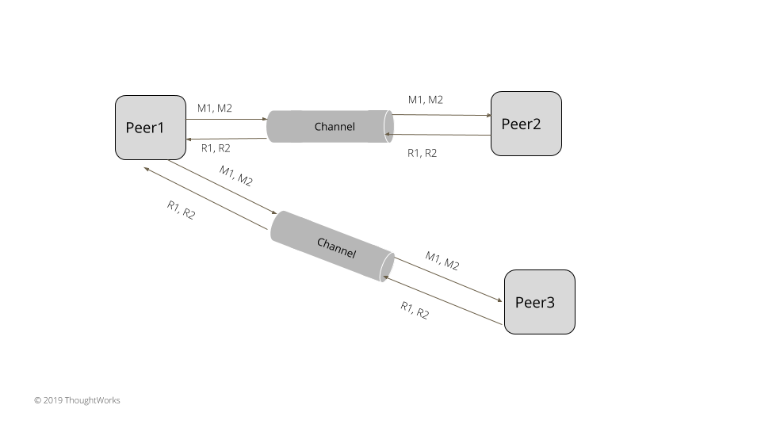

图1：请求管道

发送者节点通过 socket 通道发送请求，无需等待应答。

```java
class SingleSocketChannel
{
    public void sendOneWay(RequestOrResponse request) throws IOException
    {
        var dataStream = new DataOutputStream(socketOutputStream);
        byte[] messageBytes = serialize(request);
        dataStream.writeInt(messageBytes.length);
        dataStream.write(messageBytes);
    }
}
```

启动一个单独的线程用以读取应答。

```java
class ResponseThread
{
    class ResponseThread extends Thread implements Logging
    {
        private volatile boolean isRunning = false;
        private SingleSocketChannel socketChannel;

        public ResponseThread(SingleSocketChannel socketChannel)
        {
            this.socketChannel = socketChannel;
        }

        @Override
        public void run()
        {
            try
            {
                isRunning = true;
                logger.info("Starting responder thread = " + isRunning);
                while (isRunning)
                {
                    doWork();
                }
                } catch (IOException e) {
                e.printStackTrace();
                getLogger().error(e);
                //thread exits if stopped or there is IO error
            }
        }

        public void doWork() throws IOException
        {
            RequestOrResponse response = socketChannel.read();
            logger.info("Read Response = " + response);
            processResponse(response);
        }
    }
}
```

应答处理器可以理解处理应答，或是将它提交到[单一更新队列里（Singular Update Queue）](https://martinfowler.com/articles/patterns-of-distributed-systems/singular-update-queue.html)。

请求管道有两个问题需要处理。

如果无需等待应答，请求持续发送，接收请求的节点就可能会不堪重负。有鉴于此，一般会有一个上限，也就是一次可以有多少在途请求。任何一个节点都可以发送最大数量的请求给其它节点。一旦发出且未收到应答的请求数量达到最大值，再发送请求就不能再接收了，发送者就要阻塞住了。限制最大在途请求，一个非常简单的策略就是，用一个阻塞队列来跟踪请求。队列可以用可接受的最大在途请求数量进行初始化。一旦接收到一个请求的应答，就从队列中把它移除，为更多的请求创造空间。在下面的代码中，每个 socket 连接接收的最大请求数量是 5 个。

```java
class RequestLimitingPipelinedConnection
{
    private final Map<InetAddressAndPort, ArrayBlockingQueue<RequestOrResponse>> inflightRequests = new ConcurrentHashMap<>();
    private int maxInflightRequests = 5;

    public void send(InetAddressAndPort to, RequestOrResponse request) throws InterruptedException
    {
        ArrayBlockingQueue<RequestOrResponse> requestsForAddress = inflightRequests.get(to);
        if (requestsForAddress == null)
        {
            requestsForAddress = new ArrayBlockingQueue<>(maxInflightRequests);
            inflightRequests.put(to, requestsForAddress);
        }
        requestsForAddress.put(request);
    }
}
```

一旦接收到应答，请求就从在途请求中移除。

```java
class RequestLimitingPipelinedConnection
{
    private void consume(SocketRequestOrResponse response)
    {
        Integer correlationId = response.getRequest().getCorrelationId();
        Queue<RequestOrResponse> requestsForAddress = inflightRequests.get(response.getAddress());
        RequestOrResponse first = requestsForAddress.peek();
        if (correlationId != first.getCorrelationId())
        {
            throw new RuntimeException("First response should be for the first request");
        }
        requestsForAddress.remove(first);
        responseConsumer.accept(response.getRequest());
    }
}
```

处理失败，以及要维护顺序的保证，这些都会让实现变得比较诡异。比如，有两个在途请求。第一个请求失败，然后，重试了，服务器在重试的第一个请求到达服务器之前，已经把第二个请求处理了。服务器需要有一些机制，确保拒绝掉乱序的请求。否则，如果有失败和重试的情况，就会存在消息重排序的风险。比如，[Raft](https://raft.github.io/) 总是发送之前的日志索引，我们会预期，每个日志条目都会有这么个索引。如果之前的日志索引无法匹配，服务器就会拒绝掉这个请求。Kafka 允许 max.in.flight.requests.per.connection 大于 1，还有[幂等的 Producer 实现](https://cwiki.apache.org/confluence/display/KAFKA/Idempotent+Producer)，它会给发送到 Broker 的每个消息批次分配一个唯一标识符。Broker 可以检查进来的请求序列号，如果这边的请求已经乱序，则拒绝掉新请求。

## 示例

所有像[Zab](https://zookeeper.apache.org/doc/r3.4.13/zookeeperInternals.html#sc_atomicBroadcast)和[Raft](https://raft.github.io/)这样的共识算法都支持请求通道。

[Kafka](https://kafka.apache.org/protocol)鼓励客户端使用请求通道来改善吞吐。

**原文**

https://martinfowler.com/articles/patterns-of-distributed-systems/log-segmentation.html

将日志分成多个文件，不能只为了操作简单而使用一个大文件。

**2020.8.13**

## 问题

单个日志文件会增大，在启动时读取它，会变成性能瓶颈。旧的日志要定期清理，对一个巨大的文件做清理操作是很难实现的。

## 解决方案

单个日志分成多个段。到达指定规模的上限之后，日志文件会滚动。

```java
public Long writeEntry(WALEntry entry)
{
    maybeRoll();
    return openSegment.writeEntry(entry);
}

private void maybeRoll()
{
    if (openSegment.size() >= config.getMaxLogSize())
    {
        openSegment.flush();
        sortedSavedSegments.add(openSegment);
        long lastId = openSegment.getLastLogEntryId();
        openSegment = WALSegment.open(lastId, config.getWalDir());
    }
}
```

有了日志分段，还要有一种简单的方式将逻辑日志偏移（或是日志序列号）同日志分段文件做一个映射。实现这一点可以通过下面两种方式：

- 每个日志分段名都是生成的，可以采用众所周知的前缀加基本偏移（日志序列号）的方式。
- 每个日志序列分成两个部分，文件名和事务偏移量。

```java
public static String createFileName(Long startIndex)
{
    return logPrefix + "_" + startIndex + logSuffix;
}

public static Long getBaseOffsetFromFileName(String fileName)
{
    String[] nameAndSuffix = fileName.split(logSuffix);
    String[] prefixAndOffset = nameAndSuffix[0].split("_");
    if (prefixAndOffset[0].equals(logPrefix)) return Long.parseLong(prefixAndOffset[1]);
    return -1l;
}
```

有了这些信息，读操作要有两步。对于给定的偏移（或是事务 ID），确定日志分段，从后续的日志段中读取所有的日志记录。

```java
public List<WALEntry> readFrom(Long startIndex)
{
    List<WALSegment> segments = getAllSegmentsContainingLogGreaterThan(startIndex);
    return readWalEntriesFrom(startIndex, segments);
}

private List<WALSegment> getAllSegmentsContainingLogGreaterThan(Long startIndex)
{
    List<WALSegment> segments = new ArrayList<>();
    //Start from the last segment to the first segment with starting offset less than startIndex
    // This will get all the segments which have log entries more than the startIndex
    for (int i = sortedSavedSegments.size() - 1; i >= 0; i--)
    {
        WALSegment walSegment = sortedSavedSegments.get(i);
        segments.add(walSegment);
        if (walSegment.getBaseOffset() <= startIndex)
        {
            break;
            // break for the first segment with baseoffset less than startIndex
        }
    }
    if (openSegment.getBaseOffset() <= startIndex)
    {
        segments.add(openSegment);
    }
    return segments;
}
```

## 示例

- 所有的共识实现都使用了日志分段，比如，[Zookeeper](https://github.com/apache/zookeeper/blob/master/zookeeper-server/src/main/java/org/apache/zookeeper/server/persistence/FileTxnLog.java)[RAFT](https://github.com/etcd-io/etcd/blob/master/wal/wal.go)
和
。
- [Kafka](https://github.com/axbaretto/kafka/blob/master/core/src/main/scala/kafka/log/Log.scala)
的存储实现也遵循日志分段。
- 所有的数据库，包括 NoSQL 数据库，类似于 [Cassandra](https://github.com/facebookarchive/cassandra/blob/master/src/org/apache/cassandra/db/CommitLog.java)
，都使用基于预先配置日志大小的滚动策略。

**原文**

https://martinfowler.com/articles/patterns-of-distributed-systems/single-socket-channel.html

通过使用单一的 TCP 连接，维护发送给服务器请求的顺序。

**2020.8.19**

## 问题

使用[领导者和追随者（Leader and Followers）](https://leader-and-followers.md/)时，我们需要确保在领导者和各个追随者之间的消息保持有序，如果有消息丢失，需要重试机制。我们需要做到这一点，还要保证保持新连接的成本足够低，开启新连接才不会增加系统的延迟。

## 解决方案

幸运的是，已经长期广泛使用的 [TCP](https://en.wikipedia.org/wiki/Transmission_Control_Protocol) 机制已经提供了所有这些必要的特征。因此，我们只要确保追随者与其领导者之间都是通过单一的 Socket 通道进行通信，就可以进行我们所需的通信。然后，追随者再对来自领导者的更新进行序列化，将其送入[单一更新队列（Singular Update Queue）](https://singular-update-queue.md/)。


图1：单一 Socket 通道

节点一旦打开连接，就不会关闭，持续从中读取新的请求。节点为每个连接准备一个专用的线程去读取写入请求。如果使用的是[非阻塞 IO](https://en.wikipedia.org/wiki/Non-blocking_I/O_(Java))，那就不需要为每个连接准备一个线程。

下面是一个基于简单线程的实现：

```java
class SocketHandlerThread
{
    @Override
    public void run()
    {
        isRunning = true;
        try
        {
            //Continues to read/write to the socket connection till it is closed.
            while (isRunning)
            {
                handleRequest();
            }
            } catch (Exception e) {
            getLogger().debug(e);
            closeClient(this);
        }
    }

    private void handleRequest()
    {
        RequestOrResponse request = clientConnection.readRequest();
        RequestId requestId = RequestId.valueOf(request.getRequestId());
        server.accept(new Message<>(request, requestId, clientConnection));
    }

    public void closeConnection()
    {
        clientConnection.close();
    }
}
```

节点读取请求，将它们提交到[单一更新队列（Singular Update Queue）](https://singular-update-queue.md/)中等待处理。一旦节点处理了写入的请求，它就将应答写回到 socket。

无论节点什么时候需要建立通信，它都会打开单一 Socket 连接，与对方通信的所有请求都会使用这个连接。

```java
class SingleSocketChannel
{
    public class SingleSocketChannel implements Closeable
    {
        final InetAddressAndPort address;
        final int heartbeatIntervalMs;
        private Socket clientSocket;
        private final OutputStream socketOutputStream;
        private final InputStream inputStream;

        public SingleSocketChannel(InetAddressAndPort address, int heartbeatIntervalMs) throws IOException
        {
            this.address = address;
            this.heartbeatIntervalMs = heartbeatIntervalMs;
            clientSocket = new Socket();
            clientSocket.connect(new InetSocketAddress(address.getAddress(), address.getPort()), heartbeatIntervalMs);
            clientSocket.setSoTimeout(heartbeatIntervalMs * 10);
            //set socket read timeout to be more than heartbeat.
            socketOutputStream = clientSocket.getOutputStream();
            inputStream = clientSocket.getInputStream();
        }

        public synchronized RequestOrResponse blockingSend(RequestOrResponse request) throws IOException
        {
            writeRequest(request);
            byte[] responseBytes = readResponse();
            return deserialize(responseBytes);
        }

        private void writeRequest(RequestOrResponse request) throws IOException
        {
            var dataStream = new DataOutputStream(socketOutputStream);
            byte[] messageBytes = serialize(request);
            dataStream.writeInt(messageBytes.length);
            dataStream.write(messageBytes);
        }
    }
}
```

有一点很重要，就是连接要有超时时间，这样就不会在出错的时候，造成永久阻塞了。我们使用[心跳（HeartBeat）](https://heartbeat.md/)周期性地在 Socket 通道上发送请求，以便保活。超时时间通常都是多个心跳的间隔，这样，网络的往返时间以及可能的一些延迟就不会造成问题了。比方说，将连接超时时间设置成心跳间隔的 10 倍也是合理的。

```java
class SocketListener
{
    private void setReadTimeout(Socket clientSocket) throws SocketException
    {
        clientSocket.setSoTimeout(config.getHeartBeatIntervalMs() * 10);
    }
}
```

通过单一通道发送请求，可能会带来一个问题，也就是[队首阻塞（Head-of-line blocking，HOL）](https://en.wikipedia.org/wiki/Head-of-line_blocking)问题。为了避免这个问题，我们可以使用[请求管道（Request Pipeline）](https://request-pipeline.md/)。

## 示例

[Zookeeper](https://zookeeper.apache.org/doc/r3.4.13/zookeeperInternals.html) 使用了单一 Socket 通道，每个追随者一个线程，处理所有的通信。

[Kafka](https://kafka.apache.org/protocol) 在追随者和领导者分区之间使用了单一 Socket 通道，进行消息复制。

[Raft](https://raft.github.io/) 共识算法的参考实现，[LogCabin](https://github.com/logcabin/logcabin) 使用单一 Socket 通道，在 领导者和追随者之间进行通信。

**原文**

https://martinfowler.com/articles/patterns-of-distributed-systems/singular-update-queue.html

使用一个单独的线程异步地处理请求，维护请求的顺序，无需阻塞调用者。

**2020.8.25**

## 问题

有多个并发客户端对状态进行更新时，我们需要一次进行一个变化，这样才能保证安全地进行更新。考虑一下[预写日志（Write-Ahead Log）](https://write-ahead-log.md/)模式。即便有多个并发的客户端在尝试写入，我们也要一次处理一项。通常来说，对于并发修改，常用的方式是使用锁。但是如果待执行的任务比较耗时，比如，写入一个文件，那阻塞其它调用线程，直到任务完成，这种做法可能会给这个系统的吞吐和延迟带来严重的影响。在维护一次处理一个的这种执行的保障时，有效利用计算资源是极其重要的。

## 解决方案

实现一个工作队列，以及一个工作在这个队列上的单一线程。多个并发客户端可以将状态变化提交到这个队列中。但是，只有一个线程负责状态的改变。对于像 Golang 这样支持 goroutine 和通道（Channel）的语言，实现起来会比较自然。

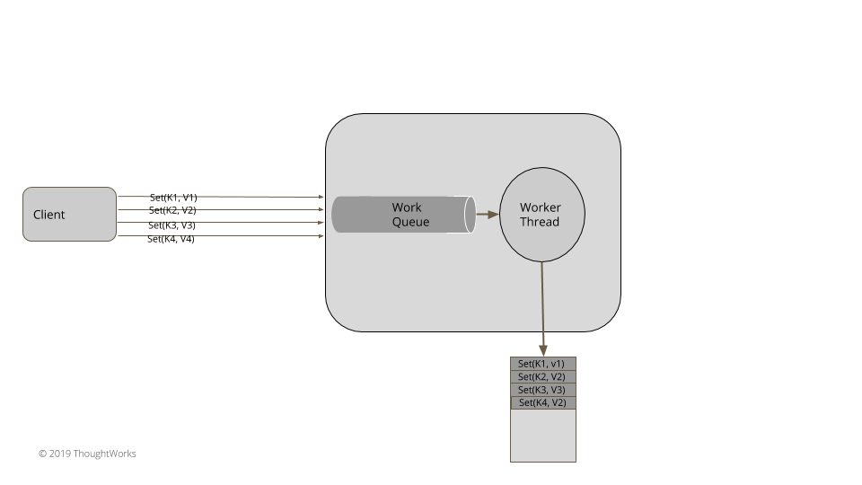

图1：工作队列支持的单一线程

下面是一个典型的 Java 实现：

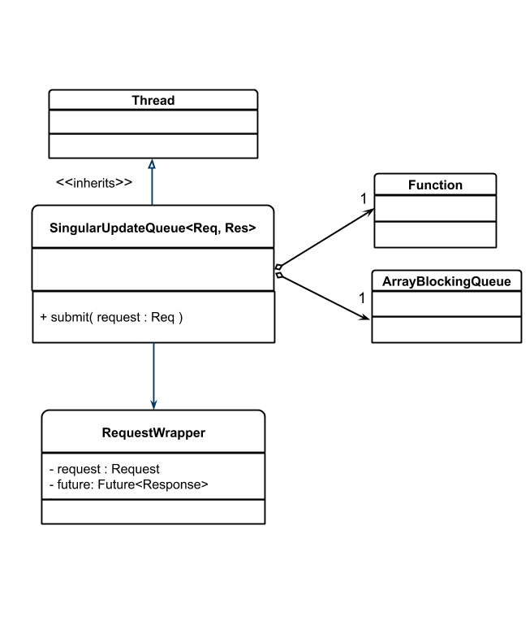

图2：Java 的 SingularUpdateQueue

SingleUpdateQueue 有一个队列，还有一个函数用于处理队列中的工作项。它扩展了 java.lang.Thread，确保它只有一个执行线程。

```java
public class SingularUpdateQueue<Req, Res> extends Thread implements Logging
{
    private ArrayBlockingQueue<RequestWrapper<Req, Res>> workQueue
    = new ArrayBlockingQueue<RequestWrapper<Req, Res>>(100);
    private Function<Req, Res> handler;
    private volatile boolean isRunning = false;
}
```

客户端在自己的线程里将请求提交到队列里。队列用一个简单的封装（wrapper）将每个请求都封装起来，然后和一个 Future 合并起来，把这个 Future 返回给客户端，这样，一旦请求最终处理完成，客户端就可以进行相应地处理。

```java
class SingularUpdateQueue
{
    public CompletableFuture<Res> submit(Req request)
    {
        try
        {
            var requestWrapper = new RequestWrapper<Req, Res>(request);
            workQueue.put(requestWrapper);
            return requestWrapper.getFuture();
            } catch (InterruptedException e) {
            throw new RuntimeException(e);
        }
    }
}

class RequestWrapper<Req, Res>
{
    private final CompletableFuture<Res> future;
    private final Req request;

    public RequestWrapper(Req request)
    {
        this.request = request;
        this.future = new CompletableFuture<Res>();
    }

    public CompletableFuture<Res> getFuture()
    {
        return future;
    }

    public Req getRequest()
    {
        return request;
    }
}
```

队列里的元素由一个专用的线程处理，SingularUpdateQueue 继承自 Thread。队列允许多个并发的生产者添加执行任务。队列的实现应该是线程安全的，即便在有争用的情况下，也不会增加很多的负担。执行线程从队列中取出请求，一次一个地处理。任务执行完毕，就可以用任务的应答去结束 CompletableFuture。

```java
class SingularUpdateQueue
{
    @Override
    public void run()
    {
        isRunning = true;
        while (isRunning)
        {
            Optional<RequestWrapper<Req, Res>> item = take();
            item.ifPresent(requestWrapper ->
            {
                try
                {
                    Res response = handler.apply(requestWrapper.getRequest());
                    requestWrapper.complete(response);
                    } catch (Exception e) {
                    requestWrapper.completeExceptionally(e);
                }
                });
        }
    }
}

class RequestWrapper
{
    public void complete(Res response)
    {
        future.complete(response);
    }

    public void completeExceptionally(Exception e)
    {
        e.printStackTrace();
        getFuture().completeExceptionally(e);
    }
}
```

值得注意的是，从队列中读取内容时，我们可以有一个超时时间，而不是无限地阻塞。这样，必要的时候，我们可以退出线程，也就是将 isRunning 设为 false，即便队列为空，它也不会无限地阻塞在那里，进而阻塞执行线程。因此，我们要使用有超时时间的 poll 方法，而不是 take 方法，那样会无限阻塞的。这给了我们干净地停止线程执行的能力。

```java
class SingularUpdateQueue
{
    private Optional<RequestWrapper<Req, Res>> take()
    {
        try
        {
            return Optional.ofNullable(workQueue.poll(300, TimeUnit.MILLISECONDS));
            } catch (InterruptedException e) {
            return Optional.empty();
        }
    }

    public void shutdown()
    {
        this.isRunning = false;
    }
}
```

比如，一个服务器处理来自多个客户端的请求，更新预写日志，它就可以有一个下面这样的 SingularUpdateQueue：

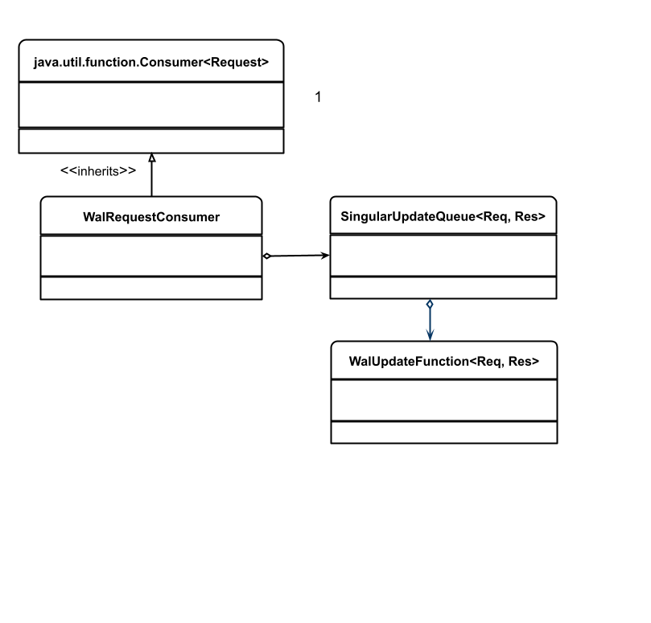

图3：更新预写日志的 SingularUpdateQueue

SingularUpdateQueue 客户端的设置要指定其参数化类型以及处理队列消息的函数。就这个例子而言，我们用的是处理预写日志请求的消费者。这个消费者有唯一一个实例，控制着对日志数据结构的访问。消费者将每个请求写入一条日志，然后返回一个应答。应答消息只有在消息写入日志之后才会发送出去。我们使用 SingularUpdateQueue 确保这些动作有可靠的顺序。

```java
public class WalRequestConsumer implements Consumer<Message<RequestOrResponse>>
{
    private final SingularUpdateQueue<Message<RequestOrResponse>, Message<RequestOrResponse>> walWriterQueue;
    private final WriteAheadLog wal;

    public WalRequestConsumer(Config config)
    {
        this.wal = WriteAheadLog.openWAL(config);
        walWriterQueue = new SingularUpdateQueue<>((message) ->
        {
            wal.writeEntry(serialize(message));
            return responseMessage(message);
            });
        startHandling();
    }

    private void startHandling()
    {
        this.walWriterQueue.start();
    }
}
```

消费者的 accept 方法接到这些消息，将它们放入到队列里，在这些消息处理之后，发出一个应答。这个方法在调用者线程运行，允许多个调用者同时调用 accept 方法。

```java
@Override
public void accept(Message message)
{
    CompletableFuture<Message<RequestOrResponse>> future = walWriterQueue.submit(message);
    future.whenComplete((responseMessage, error) ->
    {
        sendResponse(responseMessage);
        });
}
```

### 队列的选择

队列的数据结构是一个至关重要的选择。在 JVM 上，有不同的数据结构可选：

- ArrayBlockingQueue（Kafka 请求队列使用）

正如其名字所示，这是一个以数组为后端的阻塞队列。当需要创建一个固定有界的队列时，就可以使用它。一旦队列填满，生产端就阻塞。它提供了阻塞的背压方式，如果消费者慢和生产者快，它就是适用的。

- ConcurrentLinkedQueue 联合 ForkJoinPool （Akka Actor 邮箱中使用）

ConcurrentLinkedQueue 可以用在这样的场景下，没有消费者在等待生产者，但在任务进入到 ConcurrentLinkedQueue 的队列之后，有协调者去调度消费者。

- LinkedBlockingDeque（Zookeeper 和 Kafka 应答队列使用）

如果不阻塞生产者，而且需要的是一个无界队列，它是最有用的。选择它，我们需要谨慎，因为如果没有实现背压技术，队列可能会很快填满，持续地消耗掉所有的内存。

- RingBuffer（LMAX Disruptor 使用）

正如 LMAX Disruptor 所讨论的，有时，任务处理是延迟敏感的。如果使用 ArrayBlockingQueue 在不同的处理阶段复制任务，延迟会增加，在一些情况下，这是无法接受的。在这些情况下，就可以使用 [RingBuffer](/assets/files/learning/distributed/distributed-system-cn-wal/086c51e408a22a25d77c99092012a376.pdf) 在不同的阶段之间传递任务。

### 使用通道和轻量级线程

有一些语言或程序库支持轻量级线程以及通道概念（比如，Golang、Kotlin），这一点就很自然了。所有的请求都传进一个单独的通道去处理。还有一个单独的 goroutine 去处理所有的消息更新状态。之后，应答写入到一个单独的通道中，有一个单独的 goroutine 处理，发回给客户端。正如我们在下面的代码中看到的，更新键和值的请求传给一个单独的共享的请求通道。

```go
func (s *server) putKv(w http.ResponseWriter, r *http.Request)  {
    kv, err := s.readRequest(r, w)
    if err != nil {
        log.Panic(err)
        return
    }
    request := &requestResponse{
        request:
        kv,
        responseChannel: make(chan string),
    }
    s.requestChannel <- request
    response := s.waitForResponse(request)
    w.Write([]byte(response))
}
```

在一个单独的 goroutine 中处理请求更新所有的状态。

```go
func (s* server) Start() error {
    go s.serveHttp()
    go s.singularUpdateQueue()
    return nil
}

func (s *server) singularUpdateQueue() {
    for {
        select {
            case e := <-s.requestChannel:
            s.updateState(e)
            e.responseChannel <- buildResponse(e);
        }
    }
}
```

### 背压

工作队列用于在线程间通信，所以，背压是一个重要的关注点。如果消费者很慢，而生产者很快，队列就可能很快填满。除非采用了一些预防措施，否则，如果大量的任务填满队列，内存就会耗光。通常来说，队列是有界的，如果队列满了，发送者就会阻塞。比如，java.util.concurrent.ArrayBlockingQueue 有两个方法添加元素，put 方法在数组满的情况下就会阻塞，而 add 方法则会抛出 IllegalStateException，却不会阻塞生产者。很重要的一点就是，在添加任务到队列时，需要了解方法的语义。如果用的是 ArrayBlockingQueue，应该使用 put 方法阻塞发送者，通过阻塞，提供背压能力。类似于 reactive-streams 这样的框架，可以帮助我们实现更复杂的背压机制，从消费者到生产者。

### 其它考量

- 任务链

在大多数情况下，处理过程需要将多个任务串联在一起完成。SingularUpdateQueue 执行的结果需要传递给其它阶段。比如，正如上面在 WalRequestConsumer 里看到的，在记录写到预写日志之后，应答需要通过 Socket 连接发出去。这可以通过在一个单独的线程中执行 SingularUpdateQueue 返回的 Future 达成，也可以将任务提交给另一个 SingularUpdateQueue。

- 调用外部的服务

有时，作为 SingularUpdateQueue 任务执行的一部分，还需要调用外部服务，然后，根据服务调用的应答更新 SingularUpdateQueue 的状态。在这种场景下，要进行非阻塞的网络调用，或者，只有处理所有任务的线程阻塞。调用需要异步进行。还有一点必须要注意，在异步服务调用后的 Future 回调中，不要访问 SingularUpdateQueue 的状态，因为这另外一个的线程可能访问这个状态，这么做会破坏 SingularUpdateQueue 由一个单独线程进行所有状态修改的约定。调用的结果应该和其它的事件或请求一样，也添加到一个工作队列里。

## 示例

所有共识算法的实现，比如，Zookeeper（ZAB） 或 etcd（RAFT），都需要请求按照严格的顺序处理，一次一个。它们都有相似的代码结构。

- Zookeeper 的[请求处理管道](https://github.com/apache/zookeeper/blob/master/zookeeper-server/src/main/java/org/apache/zookeeper/server/SyncRequestProcessor.java)
的实现是由一个单独线程的请求处理器完成的。
- Apache Kafka 的 [Controller](https://cwiki.apache.org/confluence/display/KAFKA/Kafka+Controller+Redesign)
，需要基于多个来自于 zookeeper 的并发事件进行状态更新，由一个单独的线程处理，所有的事件处理器都要向队列里提交事件。
- Cassandra，采用了[SEDA](https://dl.acm.org/doi/10.1145/502034.502057)
架构，使用单线程阶段更新其 Gossip 状态。
- [etcd](https://github.com/etcd-io/etcd/blob/master/etcdserver/raft.go)
和其它基于 golang 的实现都有一个单独的 goroutine 处理请求通道，更新其状态。
- [LMAX Disruptor 架构](assets/files/learning/distributed/2022-08-12-distributed-system-cn-wal/Disruptor-1.0.pdf)[单一写者原则（Single Writer Principle）](https://mechanical-sympathy.blogspot.com/2011/09/single-writer-principle.html)
遵循
，避免在更新本地状态时出现互斥。

**原文**

https://martinfowler.com/articles/patterns-of-distributed-systems/state-watch.html

服务器上特定的值发生改变时，通知客户端。

**2021.1.19**

## 问题

客户端会对服务器上特定值的变化感兴趣。如果客户端要持续不断地轮询服务器，查看变化，它们就很难构建自己的逻辑。如果客户端与服务器之间打开许多连接，监控变化，服务器会不堪重负。

## 解决方案

让客户端将自己感兴趣的特定状态变化注册到服务器上。状态发生变化时，服务器会通知感兴趣的客户端。客户端同服务器之间维护了一个[单一 Socket 通道（Single Socket Channel）](https://single-socket-channel.md/)。服务器通过这个通道发送状态变化通知。客户端可能会对多个值感兴趣，如果每个监控都维护一个连接的话，服务器将不堪重负。因此，客户端需要使用[请求管道（Request Pipeline）](https://request-pipeline.md/)。

在[一致性内核（Consistent Core）](https://consistent-core.md/)里，我们用了一个简单键值存储的例子，考虑一下这种场景：一个客户端对“某个特定键值对应值的改变，或是删除一个键值”感兴趣。实现包含了两个部分，客户端实现，服务器端实现。

### 客户端实现

客户端接收一个键值和一个函数，这个函数会在接收到服务器端监控事件时调用。客户端将函数对象存储起来，以备后续调用。然后，发送请求给服务器，注册这个监控。

```java
ConcurrentHashMap<String, Consumer<WatchEvent>> watches = new ConcurrentHashMap<>();

public void watch(String key, Consumer<WatchEvent> consumer)
{
    watches.put(key, consumer);
    sendWatchRequest(key);
}

private void sendWatchRequest(String key)
{
    requestSendingQueue.submit(new RequestOrResponse(RequestId.WatchRequest.getId(), JsonSerDes.serialize(new WatchRequest(key)), correlationId.getAndIncrement()));
}
```

如果连接上收到了监控事件，就会调用相应的消费者。

```java
this.pipelinedConnection =new PipelinedConnection(address, requestTimeoutMs, (r) ->
{
    logger.info("Received response on the pipelined connection " + r);
    if (r.getRequestId() == RequestId.WatchRequest.getId())
    {
        WatchEvent watchEvent = JsonSerDes.deserialize(r.getMessageBodyJson(), WatchEvent.class);
        Consumer<WatchEvent> watchEventConsumer = getConsumer(watchEvent.getKey());
        watchEventConsumer.accept(watchEvent);
        lastWatchedEventIndex = watchEvent.getIndex();
        //capture last watched index, in case of connection failure.
    }
    completeRequestFutures(r);
    });
```

### 服务端实现

服务端接收到监控的注册请求时，它会保持一个映射，也就是接收请求的管道连接同键值之间的映射。

```java
private Map<String, ClientConnection> watches = new HashMap<>();
private Map<ClientConnection, List<String>> connection2WatchKeys = new HashMap<>();

public void watch(String key, ClientConnection clientConnection)
{
    logger.info("Setting watch for " + key);
    addWatch(key, clientConnection);
}

private synchronized void addWatch(String key, ClientConnection clientConnection)
{
    mapWatchKey2Connection(key, clientConnection);
    watches.put(key, clientConnection);
}

private void mapWatchKey2Connection(String key, ClientConnection clientConnection)
{
    List<String> keys = connection2WatchKeys.get(clientConnection);
    if (keys == null)
    {
        keys = new ArrayList<>();
        connection2WatchKeys.put(clientConnection, keys);
    }
    keys.add(key);
}
```

ClientConnection 封装了与客户端之间的 Socket 连接。其结构如下。无论是基于阻塞 IO 的服务器，还是基于非阻塞 IO 的服务器，其结构都是一样的。

```java
public interface ClientConnection
{
    void write(RequestOrResponse response);

    void close();
}
```

一个连接上可以注册多个监控。因此，将连接同监控键值列表的映射存储起来是很重要的。当客户端关闭连接时，删除所有相关的监控是必要的，就像下面这样：

```java
public void close(ClientConnection connection)
{
    removeWatches(connection);
}

private synchronized void removeWatches(ClientConnection clientConnection)
{
    List<String> watchedKeys = connection2WatchKeys.remove(clientConnection);
    if (watchedKeys == null)
    {
        return;
    }
    for (String key : watchedKeys)
    {
        watches.remove(key);
    }
}
```

当服务器发生了特定事件，比如，给一个键值设置了值，服务器就会构造一个相关的 WatchEvent，然后，通知给所有注册的客户端。

```java
private synchronized void notifyWatchers(SetValueCommand setValueCommand, Long entryId)
{
    if (!hasWatchesFor(setValueCommand.getKey()))
    {
        return;
    }
    String watchedKey = setValueCommand.getKey();
    WatchEvent watchEvent = new WatchEvent(watchedKey, setValueCommand.getValue(), EventType.KEY_ADDED, entryId);
    notify(watchEvent, watchedKey);
}

private void notify(WatchEvent watchEvent, String watchedKey)
{
    List<ClientConnection> watches = getAllWatchersFor(watchedKey);
    for (ClientConnection pipelinedClientConnection : watches)
    {
        try
        {
            String serializedEvent = JsonSerDes.serialize(watchEvent);
            getLogger().trace("Notifying watcher of event " + watchEvent + " from " + server.getServerId());
            pipelinedClientConnection
            .write(new RequestOrResponse(RequestId.WatchRequest.getId(), serializedEvent));
            } catch (NetworkException e) {
            removeWatches(pipelinedClientConnection);
            //remove watch if network connection fails.
        }
    }
}
```

有一个需要注意的关键点是，监控相关的状态要能够并发访问，有的是来自客户端请求处理代码，有的是来自客户端连接处理代码来关闭连接。因此，所有访问监控状态的方法都需要用锁进行保护。

### 在层次结构存储中的监控

[一致性内核（Consistent Core）](https://consistent-core.md/)大多支持有层次结构的存储。监控可以设置在父节点或是键值的前缀上。子节点的任何变化都会触发父节点上的监控集。对于每个事件而言，一致性内容都会遍历一下路径，检查父路径上是否设置了监控，给所有的监控发送事件。

```java
List<ClientConnection> getAllWatchersFor(String key)
{
    List<ClientConnection> affectedWatches = new ArrayList<>();
    String[] paths = key.split("/");
    String currentPath = paths[0];
    addWatch(currentPath, affectedWatches);
    for (int i = 1; i < paths.length; i++)
    {
        currentPath = currentPath + "/" + paths[i];
        addWatch(currentPath, affectedWatches);
    }
    return affectedWatches;
}

private void addWatch(String currentPath, List<ClientConnection> affectedWatches)
{
    ClientConnection clientConnection = watches.get(currentPath);
    if (clientConnection != null)
    {
        affectedWatches.add(clientConnection);
    }
}
```

这样就可以在键值前缀上设置一个监控，比如servers。任何用这个前缀创建出的键值，比如，server/1、server/2 都会触发这个监控。

因为待调用函数同键值前缀的映射要一起存储，对于客户端而言，有一点很重要，根据收到的事件，遍历层次结构，查找待调用的函数。一种替代方案是，将事件同事件触发的路径一起发送回去，这样一来，客户端就知道到发送过来的状态是由哪个监控引发的了。

### 处理连接失效

客户端和服务器间的连接随时可能失效。就某些用例而言，这是有问题的，因为客户端在其失联期间，可能会错过某些事件。比如说，集群控制器可能对是否有节点失效感兴趣，其表现方式就是一些键值移除的事件。客户端要把其接收到最后接收的事件告诉服务器。客户端在重新设置监控时，会发送其最后接收的事件号。服务器要把从这个事件号之后记录的所有事件都发送出来。

在[一致性内核（Consistent Core）](https://consistent-core.md/)的客户端里，这可以与领导者重新建立连接时完成。

```java
private void connectToLeader(List<InetAddressAndPort> servers)
{
    while (isDisconnected())
    {
        logger.info("Trying to connect to next server");
        waitForPossibleLeaderElection();
        establishConnectionToLeader(servers);
    }
    setWatchesOnNewLeader();
}

private void setWatchesOnNewLeader()
{
    for (String watchKey : watches.keySet())
    {
        sendWatchResetRequest(watchKey);
    }
}

private void sendWatchResetRequest(String key)
{
    pipelinedConnection.send(new RequestOrResponse(RequestId.SetWatchRequest.getId(), JsonSerDes.serialize(new SetWatchRequest(key, lastWatchedEventIndex)), correlationId.getAndIncrement()));
}
```

服务器会给发送的每个事件编号。比如，如果服务器是[一致性内核（Consistent Core）](https://consistent-core.md/)，它会以严格的顺序存储所有的状态变化，每个变化都用日志索引来编号，这在[预写日志（Write-Ahead Log）](https://write-ahead-log.md/)里已经讨论过了。这样一来，客户端要得到从特定索引开始的事件，就是可能实现的。

### 来自键值存储的派生事件

事件也可以通过查看键值存储的当前状态来生成，它还可以对发生的变化进行编号，将这个编号与每个值一起存储起来。

当客户端重新建立同服务器的连接，它可以再次设置监控，还要发送最后一次看到变化的编号。服务器可以将其与存储的值相比较，如果这个值大于客户端发送的值，它就要把事件重新发送给客户端。键值存储的派生事件可能有点尴尬，因为事件需要猜测。它可能会错过一些事件——比如，如果一个键值先创建后删除了——在客户端失联时，创建事件就会丢失了。

```java
private synchronized void eventsFromStoreState(String key, long stateChangesSince)
{
    List<StoredValue> values = getValuesForKeyPrefix(key);
    for (StoredValue value : values)
    {
        if (values == null)
        {
            //the key was probably deleted send deleted event
            notify(new WatchEvent(key, EventType.KEY_DELETED), key);
            } else if (value.index > stateChangesSince) {
            //the key/value was created/updated after the last event client knows about
            notify(new WatchEvent(key, value.getValue(), EventType.KEY_ADDED, value.getIndex()), key);
        }
    }
}
```

[zookeeper](https://zookeeper.apache.org/) 使用的就是这种方式。在缺省情况下，Zookeeper 的监控是一次性触发器。一旦事件触发了，如果客户端还想收到进一步的事件，就要重新设置监控。在监控重新设置之前，有些事件有可能就丢失了，因此，客户端要确保它们读到的是最新的状态，这样，它们就不会丢失任何更新。

### 存储事件的历史

一个更容易的做法是，保存过去事件的历史，根据事件历史相应客户端。这种方式的问题在于，事件的历史需要有个限制，比如，1000 条事件。如果客户端长时间失联，它就会错过超过 1000 条事件窗口的事件。

一种简单的实现方式是使用 Google Guava 的 EvictingQueue，如下所示：

```java
public class EventHistory implements Logging
{
    Queue<WatchEvent> events = EvictingQueue.create(1000);

    public void addEvent(WatchEvent e)
    {
        getLogger().info("Adding " + e);
        events.add(e);
    }

    public List<WatchEvent> getEvents(String key, Long stateChangesSince)
    {
        return this.events.stream().filter(e -> e.getIndex() > stateChangesSince && e.getKey().equals(key)).collect(Collectors.toList());
    }
}
```

当客户端重新建立起连接，重新设置监控时，事件可以从历史中发送。

```java
private void sendEventsFromHistory(String key, long stateChangesSince)
{
    List<WatchEvent> events = eventHistory.getEvents(key, stateChangesSince);
    for (WatchEvent event : events)
    {
        notify(event, event.getKey());
    }
}
```

### 使用多版本存储

为了追踪所有的变化，我们也可以使用多版本存储。它会保存每个键值的所有版本，这样，根据请求版本可以很容易地找出所有的变化。

[etcd](https://etcd.io/) 版本 3 之后的版本就使用了这种方式。

## 示例

[zookeeper](https://zookeeper.apache.org/) 能够在节点设置监控。像 [kafka](https://kafka.apache.org/) 这样的产品就用它存储分组成员信息，以及集群成员的失效检测。

[etcd](https://etcd.io/) 有一个监控的实现，[kubernetes](https://kubernetes.io/) 重度使用了它，用于其资源[监控](https://kubernetes.io/docs/reference/using-api/api-concepts/)的实现。

**原文**

https://martinfowler.com/articles/patterns-of-distributed-systems/generation.html

一个单调递增的数字，表示服务器的世代。

**2020.8.20**

又称：Term、Epoch 或世代（Generation）

## 问题

在[领导者和追随者（Leader and Followers）](https://leader-and-followers.md/)的构建过程中，有一种可能性，领导者临时同追随者失联了。可能是因为垃圾回收造成而暂停，也可能是临时的网络中断，这些都会让领导者进程与追随者之间失联。在这种情况下，领导者进程依旧在运行，暂停之后或是网络中断停止之后，它还是会尝试发送复制请求给追随者。这么做是有危险的，因为与此同时，集群余下的部分可能已经选出了一个新的领导者，接收来自客户端的请求。有一点非常重要，集群余下的部分要能检测出有的请求是来自原有的领导者。原有的领导者本身也要能检测出，它是临时从集群中断开了，然后，采用必要的修正动作，交出领导权。

## 解决方案

维护一个单调递增的数字，表示服务器的世代。每次选出新的领导者，这个世代都应该递增。即便服务器重启，这个世代也应该是可用的，因此，它应该存储在[预写日志（Write-Ahead Log）](https://write-ahead-log.md/)每一个条目里。在[高水位标记（High-Water Mark）](https://high-water-mark.md/)里，我们讨论过，追随者会使用这个信息找出日志中冲突的部分。

启动时，服务器要从日志中读取最后一个已知的世代。

```java
class ReplicationModule
{
    this.replicationState = new ReplicationState(config, wal.getLastLogEntryGeneration());
}
```

采用[领导者和追随者（Leader and Followers）](https://leader-and-followers.md/)模式，选举新的领导者选举时，服务器对这个世代的值进行递增。

```java
class ReplicationModule
{
    private void startLeaderElection()
    {
        replicationState.setGeneration(replicationState.getGeneration() + 1);
        registerSelfVote();
        requestVoteFrom(followers);
    }
}
```

服务器会把世代当做投票请求的一部分发给其它服务器。在这种方式下，经过了成功的领导者选举之后，所有的服务器都有了相同的世代。一旦选出新的领导者，追随者就会被告知新的世代。

```java
follower (class ReplicationModule...)

private void becomeFollower(int leaderId, Long generation)
{
    replicationState.setGeneration(generation);
    replicationState.setLeaderId(leaderId);
    transitionTo(ServerRole.FOLLOWING);
}
```

自此之后，领导者会在它发给追随者的每个请求中都包含这个世代信息。它也包含在发给追随者的每个[心跳（HeartBeat）](https://heartbeat.md/)消息里，也包含在复制请求中。

领导者也会把世代信息持久化到[预写日志（Write-Ahead Log）](https://write-ahead-log.md/)的每一个条目里。

```java
leader (class ReplicationModule...)

Long appendToLocalLog(byte[] data)
{
    var logEntryId = wal.getLastLogEntryId() + 1;
    var logEntry = new WALEntry(logEntryId, data, EntryType.DATA, replicationState.getGeneration());
    return wal.writeEntry(logEntry);
}
```

按照这种做法，它还会持久化在追随者日志中，作为[领导者和追随者（Leader and Followers）](https://leader-and-followers.md/)复制机制的一部分。

如果追随者得到了一个来自已罢免领导的消息，追随者就可以告知其世代过低。追随者会给出一个失败的应答。

```java
follower (class ReplicationModule...)

Long currentGeneration = replicationState.getGeneration();

if (currentGeneration > replicationRequest.getGeneration())
{
    return new ReplicationResponse(FAILED, serverId(), currentGeneration, wal.getLastLogEntryId());
}
```

当领导者得到了一个失败的应答，它就会变成追随者，期待与新的领导者建立通信。

```java
Old leader (class ReplicationModule...)

if (!response.isSucceeded())
{
    stepDownIfHigherGenerationResponse(response);
    return;
}

private void stepDownIfHigherGenerationResponse(ReplicationResponse replicationResponse)
{
    if (replicationResponse.getGeneration() > replicationState.getGeneration())
    {
        becomeFollower(-1, replicationResponse.getGeneration());
    }
}
```

考虑一下下面这个例子。在一个服务器集群里，leader1 是既有的领导者。集群里所有服务器的世代都是 1。leader1 持续发送心跳给追随者。leader1 产生了一次长的垃圾收集暂停，比如说，5 秒。追随者没有得到心跳，超时了，然后选举出新的领导者。新的领导者将世代递增到 2。垃圾收集暂停结束之后，leader1 持续发送请求给其它服务器。追随者和新的领导者现在都是世代 2 了，拒绝了其请求，发送一个失败应答，其中的世代是 2。leader1 处理失败的应答，退下来成为一个追随者，将世代更新成 2。


图1：世代

## 示例

### Raft

[Raft](https://raft.github.io/) 使用了 Term 的概念标记领导者世代。

### Zab

在 [Zookeeper](https://zookeeper.apache.org/doc/r3.4.13/zookeeperInternals.html#sc_atomicBroadcast) 里，每个 epoch 数是作为每个事务 ID 的一部分进行维护的。因此，每个持久化在 Zookeeper 里的事务都有一个世代，通过 epoch 表示。

### Cassandra

在 [Cassandra](http://cassandra.apache.org/) 里，每个服务器都存储了一个世代数字，每次服务器重启时都会递增。世代信息持久化在系统的键值空间里，也作为 Gossip 消息的一部分传给其它服务器。服务器接收到 Gossip 消息之后，将它知道的世代值与 Gossip 消息的世代值进行比较。如果 Gossip 消息中世代更高，它就知道服务器重启了，然后，丢弃它维护的关于这个服务器的所有状态，请求新的状态。

### Kafka 中的 Epoch

[Kafka](https://kafka.apache.org/) 每次为集群选出新的控制器，都会创建一个 epoch 数，将其存在 Zookeeper 里。epoch 会包含在集群里从控制器发到其它服务器的每个请求中。它还维护了另外一个 epoch，称为 [LeaderEpoch](https://cwiki.apache.org/confluence/display/KAFKA/KIP-101+-+Alter+Replication+Protocol+to+use+Leader+Epoch+rather+than+High+Watermark+for+Truncation)，以便了解一个分区的追随者是否落后于其[高水位标记（High-Water Mark）](https://high-water-mark.md/)。

**原文**

https://martinfowler.com/articles/patterns-of-distributed-systems/two-phase-commit.html

在一个原子操作里更新多个节点的资源。

**2021.1.18**

## 问题

当数据需要在多个集群节点上进行原子化地存储时，集群节点在了解其他集群节点的决定之前，是不能让客户端进行访问数据的。每个节点都需要知道其它的节点是成功地存储数据，还是失败了。

## 解决方案

不出所料，两阶段提交的本质是，将一次更新分为两个阶段执行：

- 第一阶段，预备，询问每个节点是否能够承诺执行更新。
- 第二阶段，提交，实际地执行更新。

在预备阶段，参与事务的每个节点都要获得其所需的内容，以确保能够在第二阶段完成提交，例如，必需的锁。一旦每个节点都能确保在第二阶段完成提交，它就可以让协调者知道，对协调者做出有效地承诺，然后，在第二阶段进行提交。如果其中任何一个节点无法做出承诺，协调者将会通知所有节点回滚，释放其持有的锁，事务也将终止。只有在所有的参与者都同意进入下一阶段，第二阶段才会开始，届时，它们都将成功地进行更新。

考虑一个简单的分布式键值存储，两阶段提交协议的工作原理如下。

事务型的客户端会创建一个唯一标识符，称为事务标识符。客户端还会记下其他的一些细节，比如事务的起始时间。这是用来防止死锁的，稍后讲到锁机制再来详述。客户机记下的唯一 id 以及其他细节（比如起始时间戳）用于跨集群节点引用事务。客户端维护一个事务引用，它会随着客户端的每个请求传递给其它的集群节点，就像下面这样：

```java
class TransactionRef
{
    private UUID txnId;
    private long startTimestamp;

    public TransactionRef(long startTimestamp)
    {
        this.txnId = UUID.randomUUID();
        this.startTimestamp = startTimestamp;
    }

    class TransactionClient…
    TransactionRef transactionRef;

    public TransactionClient(ReplicaMapper replicaMapper, SystemClock systemClock)
    {
        this.clock = systemClock;
        this.transactionRef = new TransactionRef(clock.now());
        this.replicaMapper = replicaMapper;
    }
}
```

集群中会有一个节点扮演协调者的角色，用以代表客户端去跟踪事务的状态。在一个键值存储中，它通常是存储某个键值对应数据的集群节点。一般而言，选中的是客户端使用的第一个键值对应存储数据的集群节点。

在存储任何值之前，客户端都会与协调者进行通信，通知它即将开启一个事务。因为协调者同时也是存储值的某个节点，因此，当客户端对特定键值发起 get 或 put 操作时，也会动态地选到它。

```java
class TransactionClient
{
    private TransactionalKVStore coordinator;

    private void maybeBeginTransaction(String key)
    {
        if (coordinator == null)
        {
            coordinator = replicaMapper.serverFor(key);
            coordinator.begin(transactionRef);
        }
    }
}
```

事务协调者会跟踪事务状态。它会将每个变化都记录到[预写日志（Write-Ahead Log）](https://write-ahead-log.md/)中，以确保这些细节在发生故障时可用。

```java
class TransactionCoordinator
{
    Map<TransactionRef, TransactionMetadata> transactions = new ConcurrentHashMap<>();
    WriteAheadLog transactionLog;

    public void begin(TransactionRef transactionRef)
    {
        TransactionMetadata txnMetadata = new TransactionMetadata(transactionRef, systemClock, transactionTimeoutMs);
        transactionLog.writeEntry(txnMetadata.serialize());
        transactions.put(transactionRef, txnMetadata);
    }
}

class TransactionMetadata
{
    private TransactionRef txn;
    private List<String> participatingKeys = new ArrayList<>();
    private TransactionStatus transactionStatus;
}
```

客户端会将每个键值都当做事务的一部分发送给协调者。这样，协调者就可以跟踪属于该事务的所有键值。在事务的元数据中，协调者也会记录属于该事务的所有键值。这些键值也可以用来了解所有参与事务的集群节点。因为每一个键值对一般都是通过[复制日志（Replicated Log）](https://replicated-log.md/)进行复制，处理某个特定键值请求的领导者服务器可能会在事务的声明周期中一直在改变，因此，跟踪的是键值，而非实际的服务器地址。客户端发送的 put 或 get 请求就会抵达持有这个键值数据的服务器。服务器的选择是基于分区策略的。值得注意的是，客户端同服务器之间是直接通信，无需经过协调者。这就避免了在网络上发送两次数据：从客户端到协调者，再由协调者到相应的服务器。

```java
class TransactionClient
{
    public CompletableFuture<String> get(String key)
    {
        maybeBeginTransaction(key);
        coordinator.addKeyToTransaction(transactionRef, key);
        TransactionalKVStore kvStore = replicaMapper.serverFor(key);
        return kvStore.get(transactionRef, key);
    }

    public void put(String key, String value)
    {
        maybeBeginTransaction(key);
        coordinator.addKeyToTransaction(transactionRef, key);
        replicaMapper.serverFor(key).put(transactionRef, key, value);
    }
}

class TransactionCoordinator
{
    public synchronized void addKeyToTransaction(TransactionRef transactionRef, String key)
    {
        TransactionMetadata metadata = transactions.get(transactionRef);
        if (!metadata.getParticipatingKeys().contains(key))
        {
            metadata.addKey(key);
            transactionLog.writeEntry(metadata.serialize());
        }
    }
}
```

通过事务 ID，处理请求的集群节点可以检测到请求是事务的一部分。它会对事务的状态进行管理，其中存放有请求中的键值对。键值对并不会直接提供给键值存储，而是进行了单独地存储。

```java
class TransactionalKVStore
{
    public void put(TransactionRef transactionRef, String key, String value)
    {
        TransactionState state = getOrCreateTransactionState(transactionRef);
        state.addPendingUpdates(key, value);
    }
}
```

### 锁与事务隔离

请求还会给键值加锁。尤其是，get 请求会加上读锁，而 put 请求则会加写锁。读取值的时候，要去获取读锁。

```java
class TransactionalKVStore
{
    public CompletableFuture<String> get(TransactionRef txn, String key)
    {
        CompletableFuture<TransactionRef> lockFuture
        = lockManager.acquire(txn, key, LockMode.READ);
        return lockFuture.thenApply(transactionRef ->
        {
            getOrCreateTransactionState(transactionRef);
            return kv.get(key);
            });
    }

    synchronized TransactionState getOrCreateTransactionState(TransactionRef txnRef)
    {
        TransactionState state = this.ongoingTransactions.get(txnRef);
        if (state == null)
        {
            state = new TransactionState();
            this.ongoingTransactions.put(txnRef, state);
        }
        return state;
    }
}
```

当事务即将提交，值会在键值存储中变得可见时，才会获取写锁。在此之前，集群节点只能将修改的值当做一个待处理的操作。

延迟加锁会降低事务冲突的几率。

```java
class TransactionalKVStore
{
    public void put(TransactionRef transactionRef, String key, String value)
    {
        TransactionState state = getOrCreateTransactionState(transactionRef);
        state.addPendingUpdates(key, value);
    }
}
```

值得注意的是，这些锁是长期存在的，请求完成之后并不释放。只有事务提交时，才会释放这些锁。这种在事务期间持有锁，仅在事务提交或回滚时释放的技术称为 [两阶段锁定(2PL two-phase-locking)](https://en.wikipedia.org/wiki/Two-phase_locking)。对于提供串行隔离级别（serializable isolation level）而言，两阶段锁定至关重要。串行意味着，事务的效果就像一次一个地执行。

### 防止死锁

如果采用锁，两个事务等待彼此释放锁的场景就可能会引起死锁。检测到冲突时，如果不允许事务等待，立即终止，这样就可以避免死锁。有不同的策略可以决定哪些事务要立即终止，哪些允许继续。

锁管理器（Lock Manager）可以像下面这样实现等待策略（Wait Policy）：

```java
class LockManager
{
    WaitPolicy waitPolicy;
}
```

WaitPolicy 决定在请求发生冲突时要做什么。

```java
public enum WaitPolicy
{
    WoundWait, WaitDie, Error
}
```

锁是一个对象，它会记录当前拥有锁的事务，以及和等待该锁的事务。

```java
class Lock
{
    Queue<LockRequest> waitQueue = new LinkedList<>();
    List<TransactionRef> owners = new ArrayList<>();
    LockMode lockMode;
}
```

当事务请求获取锁时，如果没有冲突的事务已经拥有了该锁，那么锁管理器就会立即将该锁授予它。

```java
class LockManager
{
    public synchronized CompletableFuture<TransactionRef> acquire(TransactionRef txn, String key, LockMode lockMode)
    {
        return acquire(txn, key, lockMode, new CompletableFuture<>());
    }

    CompletableFuture<TransactionRef> acquire(TransactionRef txnRef, String key, LockMode askedLockMode, CompletableFuture<TransactionRef> lockFuture)
    {
        Lock lock = getOrCreateLock(key);
        logger.debug("acquiring lock for = " + txnRef + " on key = " + key + " with lock mode = " + askedLockMode);
        if (lock.isCompatible(txnRef, askedLockMode))
        {
            lock.addOwner(txnRef, askedLockMode);
            lockFuture.complete(txnRef);
            logger.debug("acquired lock for = " + txnRef);
            return lockFuture;
        }
    }
}

class Lock
{
    public boolean isCompatible(TransactionRef txnRef, LockMode lockMode)
    {
        if (hasOwner())
        {
            return (inReadMode() && lockMode == LockMode.READ) || isUpgrade(txnRef, lockMode);
        }
        return true;
    }
}
```

如果发生冲突，锁管理器的行为就取决于等待策略了。

### 冲突时抛出错误（Error On Conflict）

如果等待策略是抛出错误（error out），它就会抛出一个错误，调用的事务就会回滚，随机等待一段时间后进行重试。

```java
class LockManager
{
    private CompletableFuture<TransactionRef> handleConflict(Lock lock, TransactionRef txnRef, String key, LockMode askedLockMode, CompletableFuture<TransactionRef> lockFuture)
    {
        switch (waitPolicy)
        {
            case Error:
            {
                lockFuture.completeExceptionally(new WriteConflictException(txnRef, key, lock.owners));
                return lockFuture;
            }
            case WoundWait:
            {
                return lock.woundWait(txnRef, key, askedLockMode, lockFuture, this);
            }
            case WaitDie:
            {
                return lock.waitDie(txnRef, key, askedLockMode, lockFuture, this);
            }
        }
        throw new IllegalArgumentException("Unknown waitPolicy " + waitPolicy);
    }
}
```

在许多用户事务尝试获取锁引发竞争的情况下，如果所有的事务都需要重新启动，就会严重限制系统的吞吐量。数据存储会尝试确保事务重启的次数最少。

一种常见的技术是，给事务分配一个唯一 ID，并给它们排序。比如，[Spanner](https://cloud.google.com/spanner)为事务[分配了唯一 ID](/assets/files/learning/distributed/distributed-system-cn-wal/2d72e2c9d2019e5ec07cbba5131e9f80.pdf)，这样就可以对它们排序了。这与 [Paxos](https://paxos.md/) 中讨论的跨集群节点排序请求技术非常相似，有两种技术用于避免死锁，但依然要允许事务能够在不重启的情况下继续。

事务引用（transaction reference）的创建方式应该是可以与其它事务的引用进行比较和排序。最简单的方法是给每个事务分配一个时间戳，并根据时间戳进行比较。

```java
class TransactionClient
{
    private void beginTransaction(String key)
    {
        if (coordinator == null)
        {
            coordinator = replicaMapper.serverFor(key);
            MonotonicId transactionId = coordinator.begin();
            transactionRef = new TransactionRef(transactionId, clock.nanoTime());
        }
    }
}
```

但是在分布式系统中，[挂钟时间不是单调的](https://martinfowler.com/articles/patterns-of-distributed-systems/time-bound-lease.html#wall-clock-not-monotonic)，因此，会采用不同的方式给事务分配唯一 ID，保证事务可以排序。除了这些可排序的 ID，还要追踪每个事务的年龄，这样就能对事务排序了。[Spanner](https://cloud.google.com/spanner) 就是通过追踪系统中每个事务的年龄为事务排序。

为了能够对所有的事务排序，每个集群节点都要分配一个唯一 ID。事务开始时，客户端会选择一个协调者，从协调者获取到事务 ID。扮演协调者的集群节点会生成事务 ID，就像下面这样。

```java
class TransactionCoordinator
{
    private int requestId;

    public MonotonicId begin()
    {
        return new MonotonicId(requestId++, config.getServerId());
    }
}

class MonotonicId
{
    public class MonotonicId implements Comparable<MonotonicId>
    {
        public int requestId;
        int serverId;

        public MonotonicId(int requestId, int serverId)
        {
            this.serverId = serverId;
            this.requestId = requestId;
        }

        public static MonotonicId empty()
        {
            return new MonotonicId(-1, -1);
        }

        public boolean isAfter(MonotonicId other)
        {
            if (this.requestId == other.requestId)
            {
                return this.serverId > other.serverId;
            }
            return this.requestId > other.requestId;
        }
    }
}

class TransactionCoordinator
{
    private int requestId;

    public MonotonicId begin()
    {
        return new MonotonicId(requestId++, config.getServerId());
    }
}

class MonotonicId
{
    public class MonotonicId implements Comparable<MonotonicId>
    {
        public int requestId;
        int serverId;

        public MonotonicId(int requestId, int serverId)
        {
            this.serverId = serverId;
            this.requestId = requestId;
        }

        public static MonotonicId empty()
        {
            return new MonotonicId(-1, -1);
        }

        public boolean isAfter(MonotonicId other)
        {
            if (this.requestId == other.requestId)
            {
                return this.serverId > other.serverId;
            }
            return this.requestId > other.requestId;
        }
    }
}

class TransactionClient
{
    private void beginTransaction(String key)
    {
        if (coordinator == null)
        {
            coordinator = replicaMapper.serverFor(key);
            MonotonicId transactionId = coordinator.begin();
            transactionRef = new TransactionRef(transactionId, clock.nanoTime());
        }
    }
}
```

客户端会记录事务开始至今流逝的时间，以此作为事务的年龄。

```java
class TransactionRef
{

    public void incrementAge(SystemClock clock)
    {
        age = clock.nanoTime() - startTimestamp;
    }
}
```

每当客户端向服务器发起 get 或 put 请求时，都会递增事务的年龄。然后，事务会根据其年龄进行排序。对于同样年龄的事务，则会比较事务 ID。

```java
class TransactionRef
{
    public boolean isAfter(TransactionRef other)
    {
        return age == other.age ? this.id.isAfter(other.id) : this.age > other.age;
    }
}
```

### Wound-Wait

采用 [Wound-Wait](http://www.mathcs.emory.edu/~cheung/Courses/554/Syllabus/8-recv+serial/deadlock-woundwait.html) 策略，如果发生冲突，请求锁的事务引用将与当前拥有该锁的所有事务进行比较。如果锁的拥有者比请求锁的事务年轻，所有这些事务都会终止。但是，如果请求锁的事务比拥有锁的事务年轻，那它就要继续等待锁了。

```java
class Lock
{
    public CompletableFuture<TransactionRef> woundWait(TransactionRef txnRef, String key, LockMode askedLockMode, CompletableFuture<TransactionRef> lockFuture, LockManager lockManager)
    {
        if (allOwningTransactionsStartedAfter(txnRef) && !anyOwnerIsPrepared(lockManager))
        {
            abortAllOwners(lockManager, key, txnRef);
            return lockManager.acquire(txnRef, key, askedLockMode, lockFuture);
        }
        LockRequest lockRequest = new LockRequest(txnRef, key, askedLockMode, lockFuture);
        lockManager.logger.debug("Adding to wait queue = " + lockRequest);
        addToWaitQueue(lockRequest);
        return lockFuture;
    }
}

class Lock
{
    private boolean allOwningTransactionsStartedAfter(TransactionRef txn)
    {
        return owners.stream().filter(o -> !o.equals(txn)).allMatch(owner -> owner.after(txn));
    }
}
```

值得注意的一个关键点是，如果拥有锁的事务已经处于两阶段提交的准备状态，它不会中止的。

### Wait-Die

[Wait-Die](http://www.mathcs.emory.edu/~cheung/Courses/554/Syllabus/8-recv+serial/deadlock-waitdie.html) 方法的工作方式与 [Wound-Wait](http://www.mathcs.emory.edu/~cheung/Courses/554/Syllabus/8-recv+serial/deadlock-woundwait.html) 截然相反。如果锁拥有者都比请求锁的事务都年轻，那该事务就要等待锁。但是，如果请求锁的事务比一部分拥有锁的事务年轻，那么该事务就要终止。

```java
class Lock
{
    public CompletableFuture<TransactionRef> waitDie(TransactionRef txnRef, String key, LockMode askedLockMode, CompletableFuture<TransactionRef> lockFuture, LockManager lockManager)
    {
        if (allOwningTransactionsStartedAfter(txnRef))
        {
            addToWaitQueue(new LockRequest(txnRef, key, askedLockMode, lockFuture));
            return lockFuture;
        }
        lockManager.abort(txnRef, key);
        lockFuture.completeExceptionally(new WriteConflictException(txnRef, key, owners));
        return lockFuture;
    }
}
```

相比于 Wait-Die 方法，Wound-Wait 机制通常[重启次数更少](http://www.mathcs.emory.edu/~cheung/Courses/554/Syllabus/8-recv+serial/deadlock-compare.html)。因此，像 [Spanner](https://cloud.google.com/spanner)这样的数据存储采纳 [Wound-Wait](http://www.mathcs.emory.edu/~cheung/Courses/554/Syllabus/8-recv+serial/deadlock-woundwait.html)

当事务的所有者释放锁时，等待中的事务会被授予锁。

```java
class LockManager
{
    private void release(TransactionRef txn, String key)
    {
        Optional<Lock> lock = getLock(key);
        lock.ifPresent(l ->
        {
            l.release(txn, this);
            });
    }
}

class Lock
{
    public void release(TransactionRef txn, LockManager lockManager)
    {
        removeOwner(txn);
        if (hasWaiters())
        {
            LockRequest lockRequest = getFirst(lockManager.waitPolicy);
            lockManager.acquire(lockRequest.txn, lockRequest.key, lockRequest.lockMode, lockRequest.future);
        }
    }
}
```

## 提交与回滚

一旦客户端在没有遇到任何冲突的情况下成功读取并写入所有键值，它就会发一个提交请求给协调者，以此发起这次的提交请求。

```java
class TransactionClient
{
    public CompletableFuture<Boolean> commit()
    {
        return coordinator.commit(transactionRef);
    }
}
```

事务协调者会将这次的事务状态记录为预备提交。协调者会分两个阶段实现这次提交。

- 首先，向每个参与者发送预备请求。
- 一旦协调者收到所有参与者的成功应答，协调者就会把事务标记为准备完成，然后，把提交请求发送给所有的参与者。

```java
class TransactionCoordinator
{
    public CompletableFuture<Boolean> commit(TransactionRef transactionRef)
    {
        TransactionMetadata metadata = transactions.get(transactionRef);
        metadata.markPreparingToCommit(transactionLog);
        List<CompletableFuture<Boolean>> allPrepared = sendPrepareRequestToParticipants(transactionRef);
        CompletableFuture<List<Boolean>> futureList = sequence(allPrepared);
        return futureList.thenApply(result ->
        {
            if (!result.stream().allMatch(r -> r))
            {
                logger.info("Rolling back = " + transactionRef);
                rollback(transactionRef);
                return false;
            }
            metadata.markPrepared(transactionLog);
            sendCommitMessageToParticipants(transactionRef);
            metadata.markCommitComplete(transactionLog);
            return true;
            });
    }

    public List<CompletableFuture<Boolean>> sendPrepareRequestToParticipants(TransactionRef transactionRef)
    {
        TransactionMetadata transactionMetadata = transactions.get(transactionRef);
        var transactionParticipants = getParticipants(transactionMetadata.getParticipatingKeys());
        return transactionParticipants.keySet().stream().map(server -> server.handlePrepare(transactionRef)).collect(Collectors.toList());
    }

    private void sendCommitMessageToParticipants(TransactionRef transactionRef)
    {
        TransactionMetadata transactionMetadata = transactions.get(transactionRef);
        var participantsForKeys = getParticipants(transactionMetadata.getParticipatingKeys());
        participantsForKeys.keySet().stream().forEach(kvStore ->
        {
            List<String> keys = participantsForKeys.get(kvStore);
            kvStore.handleCommit(transactionRef, keys);
            });
    }

    private Map<TransactionalKVStore, List<String>> getParticipants(List<String> participatingKeys)
    {
        return participatingKeys.stream().map(k -> Pair.of(serverFor(k), k)).collect(Collectors.groupingBy(cn.hutool.core.lang.Pair::getKey, Collectors.mapping(cn.hutool.core.lang.Pair::getValue, Collectors.toList())));
    }
}
```

收到准备请求的集群节点会做两件事：

- 试图抓到所有键值的写锁。
- 一旦成功，它会将所有变更写入[预写日志（Write-Ahead Log）](https://write-ahead-log.md/)
。

如果成功地做到这些，它就能保证没有冲突的事务，即使在崩溃的情况下，集群节点也能恢复完成事务所必需的状态。

```java
class TransactionalKVStore
{
    public synchronized CompletableFuture<Boolean> handlePrepare(TransactionRef txn)
    {
        try
        {
            TransactionState state = getTransactionState(txn);
            if (state.isPrepared())
            {
                return CompletableFuture.completedFuture(true); //already prepared.
            }
            if (state.isAborted())
            {
                return CompletableFuture.completedFuture(false); //aborted by another transaction.
            }
            Optional<Map<String, String>> pendingUpdates = state.getPendingUpdates();
            CompletableFuture<Boolean> prepareFuture = prepareUpdates(txn, pendingUpdates);
            return prepareFuture.thenApply(ignored ->
            {
                Map<String, Lock> locksHeldByTxn = lockManager.getAllLocksFor(txn);
                state.markPrepared();
                writeToWAL(new TransactionMarker(txn, locksHeldByTxn, TransactionStatus.PREPARED));
                return true;
                });
            } catch (TransactionException | WriteConflictException e) {
            logger.error(e);
        }
        return CompletableFuture.completedFuture(false);
    }

    private CompletableFuture<Boolean> prepareUpdates(TransactionRef txn, Optional<Map<String, String>> pendingUpdates)
    {
        if (pendingUpdates.isPresent())
        {
            Map<String, String> pendingKVs = pendingUpdates.get();
            CompletableFuture<List<TransactionRef>> lockFuture = acquireLocks(txn, pendingKVs.keySet());
            return lockFuture.thenApply(ignored ->
            {
                writeToWAL(txn, pendingKVs);
                return true;
                });
        }
        return CompletableFuture.completedFuture(true);
    }

    TransactionState getTransactionState(TransactionRef txnRef)
    {
        return ongoingTransactions.get(txnRef);
    }

    private void writeToWAL(TransactionRef txn, Map<String, String> pendingUpdates)
    {
        for (String key : pendingUpdates.keySet())
        {
            String value = pendingUpdates.get(key);
            wal.writeEntry(new SetValueCommand(txn, key, value).serialize());
        }
    }

    private CompletableFuture<List<TransactionRef>> acquireLocks(TransactionRef txn, Set<String> keys)
    {
        List<CompletableFuture<TransactionRef>> lockFutures = new ArrayList<>();
        for (String key : keys)
        {
            CompletableFuture<TransactionRef> lockFuture = lockManager.acquire(txn, key, LockMode.READWRITE);
            lockFutures.add(lockFuture);
        }
        return sequence(lockFutures);
    }
}
```

当集群节点收到来自协调器的提交消息时，让键值变化可见就是安全的。提交这个变化时，集群节点可以做三件事：

- 将事务标记为已提交。如果集群节点此时发生故障，因为它知道事务的结果，所以，可以重复下述步骤。
- 将所有变更应用到键值存储上。
- 释放所有已获得的锁。

```java
class TransactionalKVStore
{
    public synchronized void handleCommit(TransactionRef transactionRef, List<String> keys)
    {
        if (!ongoingTransactions.containsKey(transactionRef))
        {
            return; //this is a no-op. Already committed.
        }
        if (!lockManager.hasLocksFor(transactionRef, keys))
        {
            throw new IllegalStateException("Transaction " + transactionRef + " should hold all the required locks for keys " + keys);
        }
        writeToWAL(new TransactionMarker(transactionRef, TransactionStatus.COMMITTED, keys));
        applyPendingUpdates(transactionRef);
        releaseLocks(transactionRef, keys);
    }

    private void removeTransactionState(TransactionRef txnRef)
    {
        ongoingTransactions.remove(txnRef);
    }

    private void applyPendingUpdates(TransactionRef txnRef)
    {
        TransactionState state = getTransactionState(txnRef);
        Optional<Map<String, String>> pendingUpdates = state.getPendingUpdates();
        apply(txnRef, pendingUpdates);
    }

    private void apply(TransactionRef txnRef, Optional<Map<String, String>> pendingUpdates)
    {
        if (pendingUpdates.isPresent())
        {
            Map<String, String> pendingKv = pendingUpdates.get();
            apply(pendingKv);
        }
        removeTransactionState(txnRef);
    }

    private void apply(Map<String, String> pendingKv)
    {
        for (String key : pendingKv.keySet())
        {
            String value = pendingKv.get(key);
            kv.put(key, value);
        }
    }

    private void releaseLocks(TransactionRef txn, List<String> keys)
    {
        lockManager.release(txn, keys);
    }

    private Long writeToWAL(TransactionMarker transactionMarker)
    {
        return wal.writeEntry(transactionMarker.serialize());
    }
}
```

回滚的实现方式是类似的。如果有任何失败，客户端都要与协调器通信回滚事务。

```java
class TransactionClient
{
    public void rollback()
    {
        coordinator.rollback(transactionRef);
    }
}
```

事务协调者将事务的状态记录为预备回滚。然后，它将回滚请求转发给所有存储了给定事务的值对应的服务器。一旦所有请求都成功，协调器就将事务回滚标记为完成。如果在事务标记为“预备回滚”后，协调器崩溃了，它在恢复后依然可以继续向所有参与的集群节点发送回滚消息。

```java
class TransactionCoordinator
{
    public void rollback(TransactionRef transactionRef)
    {
        transactions.get(transactionRef).markPrepareToRollback(this.transactionLog);
        sendRollbackMessageToParticipants(transactionRef);
        transactions.get(transactionRef).markRollbackComplete(this.transactionLog);
    }

    private void sendRollbackMessageToParticipants(TransactionRef transactionRef)
    {
        TransactionMetadata transactionMetadata = transactions.get(transactionRef);
        var participants = getParticipants(transactionMetadata.getParticipatingKeys());
        for (TransactionalKVStore kvStore : participants.keySet())
        {
            List<String> keys = participants.get(kvStore);
            kvStore.handleRollback(transactionMetadata.getTxn(), keys);
        }
    }
}
```

回滚请求的参与者会做三件事：

- 在预写日志中记录事务的状态为回滚。
- 丢弃事务的状态。
- 释放所有的锁。

```java
class TransactionalKVStore
{
    public synchronized void handleRollback(TransactionRef transactionRef, List<String> keys)
    {
        if (!ongoingTransactions.containsKey(transactionRef))
        {
            return; //no-op. Already rolled back.
        }
        writeToWAL(new TransactionMarker(transactionRef, TransactionStatus.ROLLED_BACK, keys));
        this.ongoingTransactions.remove(transactionRef);
        this.lockManager.release(transactionRef, keys);
    }
}
```

### 幂等操作

在网络失效的情况下，协调者可能会对预备、提交或终止的调用进行重试。因此，这些操作需要是[幂等的](https://idempotent-receiver.md/)。

### 示例场景

### 原子写入

请考虑以下情况。Paula Blue 有一辆卡车，Steven Green 有一台挖掘机。卡车和挖掘机的可用性和预订状态都存储在一个分布式的键值存储中。根据键值映射到服务器的方式，Blue 的卡车和 Green 的挖掘机的预订存储在不同的集群节点上。Alice 正尝试为计划周一开始的建筑工作预订一辆卡车和挖掘机。她需要卡车和挖掘机二者能够同时可用。

预订场景的发生过程如下所示。

通过读取’truck_booking_monday’和’backhoe_booking_monday’这两个键值，Alice 可以检查 Blue 的卡车和 Green 的挖掘机的可用性。

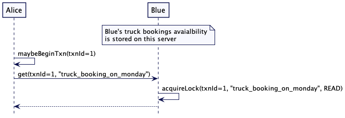

检查卡车

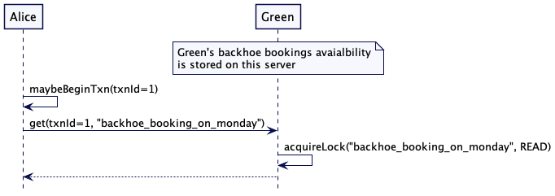

检查挖土机

如果两个值都为空，就可以预定了。她可以预定卡车和挖掘机。有一点很重要，两个值的设置是原子化的。任何一个失败了，二者都不会设置成功。

提交分两个阶段进行。Alice 联系的第一个服务器扮演协调者，执行这两个阶段。

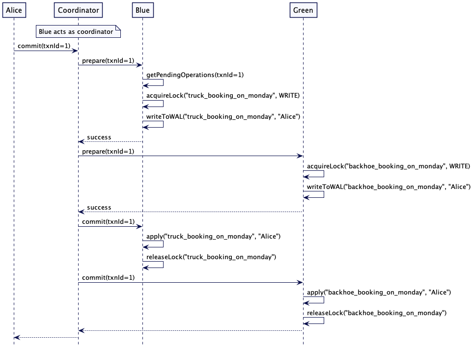

提交成功

*在这个协议中，协调者是一个独立的参与者，顺序图中就是如此显示的。然而，其中的一台服务器（Blue 或 Green）会扮演协调者的角色，因此，它会在交互中承担两个角色。*

### 事务冲突

考虑这样一个场景，另有一个人 Bob，他 也试图在同一个周一为建筑工作预订一辆卡车和挖掘机。

预订场景按照下面的情形进行：

- Alice 和 Bob 都去读键值’truck_booking_monday’和’backhoe_booking_monday’
- 二者都看到值为空，意味着预定。
- 二者都试图预定卡车和挖掘机。

预期是这样的，Alice 或 Bob 只有一个人能够预定，因为其事务是冲突的。在出现错误的情况下，整个流程需要重试，但愿有一个人能够继续预定。但任何情况下，预定都不应该是部分完成。两个预定要么都完成，要么都不完成。

为了检查可用性，Alice 和 Bob 各开启一个事务，分别联系 Blue 和 Green 的服务器检查可用性。Blue 持有”carry_booking_on_monday “这个键值的读锁，Green 持有”backhoe_booking_on_monday “这个键值的读锁。因为读锁是共享的，所以 Alice 和 Bob 都可以读取这些值。

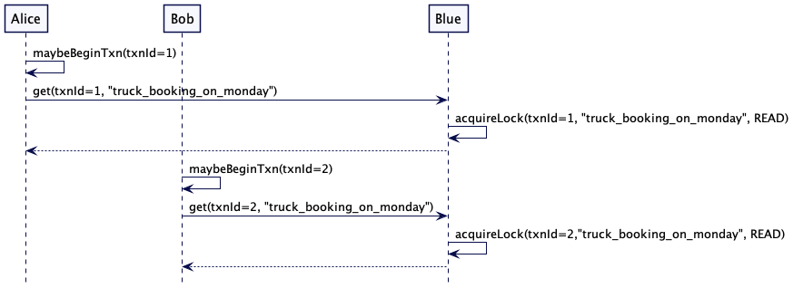

检查卡车可用

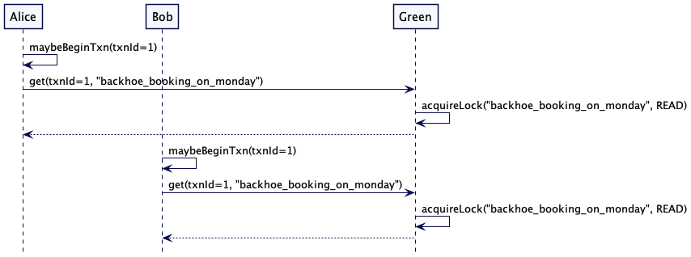

检查挖土机可用

Alice 和 Bob 发现这两个预订在星期一都可用。所以，他们向服务器发送 put 请求进行预订。两台服务器都将 put 请求存放在临时存储中。

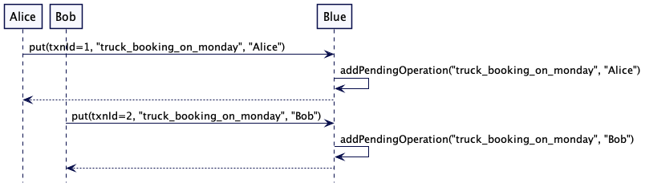

预定卡车


预定挖土机

当 Alice 和 Bob 决定提交事务时——假设 Blue 扮演协调者——协调者出发两阶段提交协议，将准备请求发送给自己和 Green。

对于Alice的请求，它尝试获取键值’truck_booking_on_monday’的写锁，但它得不到，因为另一个事务得到了冲突的写锁。因此，Alice 的事务在准备阶段就失败了。同样的事情也发生在 Bob 的请求中。

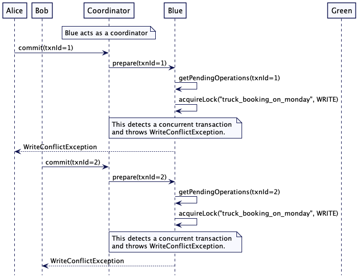

提交失败

在一个重试循环中，事务不断重试，像下面这样：

```java
class TransactionExecutor
{
    public boolean executeWithRetry(Function<TransactionClient, Boolean> txnMethod, ReplicaMapper replicaMapper, SystemClock systemClock)
    {
        for (int attempt = 1; attempt <= maxRetries; attempt++)
        {
            TransactionClient client = new TransactionClient(replicaMapper, systemClock);
            try
            {
                boolean checkPassed = txnMethod.apply(client);
                Boolean successfullyCommitted = client.commit().get();
                return checkPassed && successfullyCommitted;
                } catch (Exception e) {
                logger.error("Write conflict detected while executing." + client.transactionRef + " Retrying attempt " + attempt);
                client.rollback();
                randomWait(); //wait for random interval
            }
        }
        return false;
    }
}
```

Alice 和 Bob 预订的示例代码如下所示：

```java
class TransactionalKVStoreTest
{
    @Test
    public void retryWhenConflict()
    {
        List<TransactionalKVStore> allServers = createTestServers(WaitPolicy.WoundWait);
        TransactionExecutor aliceTxn = bookTransactionally(allServers, "Alice", new TestClock(1));
        TransactionExecutor bobTxn = bookTransactionally(allServers, "Bob", new TestClock(2));
        TestUtils.waitUntilTrue(() -> (aliceTxn.isSuccess() && !bobTxn.isSuccess()) || (!aliceTxn.isSuccess() && bobTxn.isSuccess()), "waiting for one txn to complete", Duration.ofSeconds(50));
    }

    private TransactionExecutor bookTransactionally(List<TransactionalKVStore> allServers, String user, SystemClock systemClock)
    {
        List<String> bookingKeys = Arrays.asList("truck_booking_on_monday", "backhoe_booking_on_monday");
        TransactionExecutor t1 = new TransactionExecutor(allServers);
        t1.executeAsyncWithRetry(txnClient ->
        {
            if (txnClient.isAvailable(bookingKeys))
            {
                txnClient.reserve(bookingKeys, user);
                return true;
            }
            return false;
            }, systemClock);
        return t1;
    }
}
```

在这种情况下，其中一个事务最终会成功，而另一个则会退出。

采用 Error Wait 策略，上面的代码虽然容易实现，但会有多次事务重启，降低了整体的吞吐。正如上节所述，采用 Wound-Wait 可以减少事务重启的次数。在上面的例子中，冲突时只有一个事务可能会重启，而非两个都重启。

### 使用[有版本的值（Versioned Value）](https://versioned-value.md/)

冲突会给所有的读和写操作都带来很大的限制，尤其是当事务是只读的时候。最理想的情况是，在不持有任何锁的情况下，只读的事务可以工作，仍能保证事务中读到的值不会随着并发读写事务而改变。

数据存储一般会存储值的多个版本，就像[有版本的值（Versioned Value）](https://versioned-value.md/)中描述的那样。版本号可以采用遵循 [Lamport 时钟（Lamport Clock）](https://lamport-clock.md/)的时间戳。大多数情况下，像 [MongoDB](https://www.mongodb.com/) 或 [CockroachDB](https://www.cockroachlabs.com/docs/stable/) 会采用[混合时钟（Hybrid Clock）](https://hybrid-clock.md/)。为了在两阶段提交协议中使用它，诀窍就是每个参与事务的服务器都要发送它可以写入值的时间戳，以此作为对准备请求的响应。协调者会从这些时间戳中选出一个最大值作为提交时间戳，把它和值一起发送。然后，参与服务器把值保存在提交时间戳对应的位置上。这样一来，只读请求就可以在不持有锁的情况下执行，因为它保证了在特定时间戳写入的值是不会改变的。

考虑如下的一个简单示例。Philip 正在运行一份报表，需要读时间戳 2 之前的所有数据。假设这是一个需要持有锁的长时间操作，试图预定卡车的 Alice 就会被阻塞，直到 Philip 的工作完全完成。采用[有版本的值（Versioned Value）](https://versioned-value.md/)，Philip 的 get 请求就是一个只读操作的一部分，它可以在时间戳 2 上继续执行，而 Alice 的预定则在时间戳 4 上继续执行。

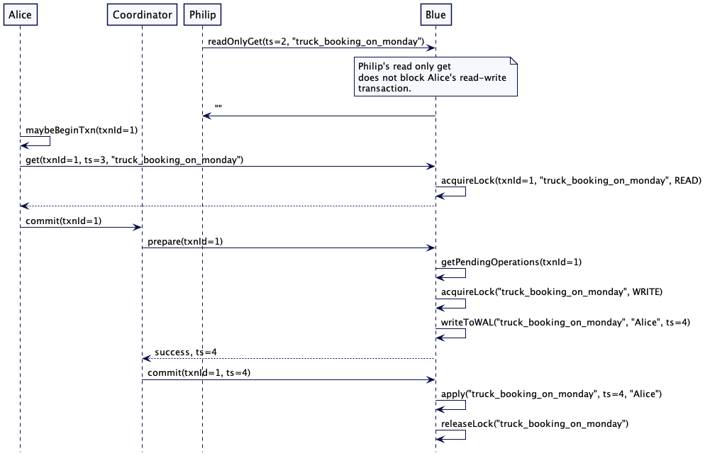

多版本并发控制读取(MVCC)

需要注意的是，如果读请求是读写事务的一部分，它就依然要持有锁。

采用 [Lamport 时钟（Lamport Clock）](https://lamport-clock.md/)的示例代码如下所示:

```java
class MvccTransactionalKVStore
{
    public String readOnlyGet(String key, long readTimestamp)
    {
        adjustServerTimestamp(readTimestamp);
        return kv.get(new VersionedKey(key, readTimestamp));
    }

    public CompletableFuture<String> get(TransactionRef txn, String key, long readTimestamp)
    {
        adjustServerTimestamp(readTimestamp);
        CompletableFuture<TransactionRef> lockFuture = lockManager.acquire(txn, key, LockMode.READ);
        return lockFuture.thenApply(transactionRef ->
        {
            getOrCreateTransactionState(transactionRef);
            return kv.get(key);
            });
    }

    private void adjustServerTimestamp(long readTimestamp)
    {
        this.timestamp = readTimestamp > this.timestamp ? readTimestamp : timestamp;
    }

    public void put(TransactionRef txnId, String key, String value)
    {
        timestamp = timestamp + 1;
        TransactionState transactionState = getOrCreateTransactionState(txnId);
        transactionState.addPendingUpdates(key, value);
    }

    class MvccTransactionalKVStore…

    private long prepare(TransactionRef txn, Optional<Map<String, String>> pendingUpdates) throws WriteConflictException, IOException
    {
        if (pendingUpdates.isPresent())
        {
            Map<String, String> pendingKVs = pendingUpdates.get();
            acquireLocks(txn, pendingKVs);
            timestamp = timestamp + 1; //increment the timestamp for write operation.
            writeToWAL(txn, pendingKVs, timestamp);
        }
        return timestamp;
    }
}

class MvccTransactionCoordinator
{
    public long commit(TransactionRef txn)
    {
        long commitTimestamp = prepare(txn);
        TransactionMetadata transactionMetadata = transactions.get(txn);
        transactionMetadata.markPreparedToCommit(commitTimestamp, this.transactionLog);
        sendCommitMessageToAllTheServers(txn, commitTimestamp, transactionMetadata.getParticipatingKeys());
        transactionMetadata.markCommitComplete(transactionLog);
        return commitTimestamp;
    }

    public long prepare(TransactionRef txn) throws WriteConflictException
    {
        TransactionMetadata transactionMetadata = transactions.get(txn);
        Map<MvccTransactionalKVStore, List<String>> keysToServers = getParticipants(transactionMetadata.getParticipatingKeys());
        List<Long> prepareTimestamps = new ArrayList<>();
        for (MvccTransactionalKVStore store : keysToServers.keySet())
        {
            List<String> keys = keysToServers.get(store);
            long prepareTimestamp = store.prepare(txn, keys);
            prepareTimestamps.add(prepareTimestamp);
        }
        return prepareTimestamps.stream().max(Long::compare).orElse(txn.getStartTimestamp());
    }
}
```

所有参与的集群节点都会在提交时间错的位置上存储键值。

```java
class MvccTransactionalKVStore
{
    public void commit(TransactionRef txn, List<String> keys, long commitTimestamp)
    {
        if (!lockManager.hasLocksFor(txn, keys))
        {
            throw new IllegalStateException("Transaction should hold all the required locks");
        }
        adjustServerTimestamp(commitTimestamp);
        applyPendingOperations(txn, commitTimestamp);
        lockManager.release(txn, keys);
        logTransactionMarker(new TransactionMarker(txn, TransactionStatus.COMMITTED, commitTimestamp, keys, Collections.EMPTY_MAP));
    }

    private void applyPendingOperations(TransactionRef txnId, long commitTimestamp)
    {
        Optional<TransactionState> transactionState = getTransactionState(txnId);
        if (transactionState.isPresent())
        {
            TransactionState t = transactionState.get();
            Optional<Map<String, String>> pendingUpdates = t.getPendingUpdates();
            apply(txnId, pendingUpdates, commitTimestamp);
        }
    }

    private void apply(TransactionRef txnId, Optional<Map<String, String>> pendingUpdates, long commitTimestamp)
    {
        if (pendingUpdates.isPresent())
        {
            Map<String, String> pendingKv = pendingUpdates.get();
            apply(pendingKv, commitTimestamp);
        }
        ongoingTransactions.remove(txnId);
    }

    private void apply(Map<String, String> pendingKv, long commitTimestamp)
    {
        for (String key : pendingKv.keySet())
        {
            String value = pendingKv.get(key);
            kv.put(new VersionedKey(key, commitTimestamp), value);
        }
    }
}
```

### 技术考量

这里还有一个微妙的问题需要解决。一旦对某个读请求返回了某个给定时间戳的应答，那就不该出现任何比这个时间戳更低的写入。这一点可以通过不同的技术实现。[Google Percolator](https://research.google/pubs/pub36726/) 和受 Percolator 启发的像 [TiKV](https://tikv.org/) 这样的数据存储都会使用一个单独的服务器，称为 Timestamp oracle，它会保证给出单调增长的时间戳。像 [MongoDb](https://www.mongodb.com/) 或 [CockroachDb](https://www.cockroachlabs.com/docs/stable/) 这样的数据库则采用了[混合时钟（Hybrid Clock）](https://hybrid-clock.md/)，以此保证每个请求都可以将各个服务器上的混合时钟调整到最新。时间戳也会随着每个写入请求增加。最后，提交阶段会从所有参与的服务器中选取最大的时间戳，确保写入总是在前面的读请求之后发生。

值得注意的是，如果客户端读取的时间戳值低于服务器写入的时间戳值，这不是问题。但是，如果客户端正在读取一个时间戳，而服务端正准备在一个特定的时间戳进行写入，那么这就是一个问题了。如果服务端检测到客户端正在读取的一个时间戳，可能存在一个在途的写入（只进行了准备），服务器会拒绝这次写入。对于 [CockroachDB](https://www.cockroachlabs.com/docs/stable/) 而言，如果读取所在的时间戳有一个正在进行的事务，那它就会抛出异常。[Spanner](https://cloud.google.com/spanner) 的读取有一个阶段，客户端会得到某个特定分区上最后一次成功写入的时间。如果客户端在一个较高的时间戳进行读取，那么读取请求就会等待，直到该时间戳的写入完成。

### 使用[复制日志（Replicated Log）](https://replicated-log.md/)

为了提升容错性，集群节点可以使用[复制日志（Replicated Log）](https://replicated-log.md/)。协调者使用复制日志（Replicated Log）存储事务的日志条目。

考虑一下上面一节中的 Alice 和 Bob 的例子，Blue 服务器是一组服务器，Green服务器也是一组。所有预订数据都会在一组的服务器上进行复制。两阶段提交中的每个请求都会发送给服务组的领导者。复制是通过[复制日志（Replicated Log）](https://replicated-log.md/)实现的。

客户端与每组服务器的领导者通信。只有在客户端决定提交事务时，复制才是必需的，因此，它也发生在预备请求的过程中。

协调者也会将每个状态更改复制到到复制日志中。

在分布式数据存储中，每个集群节点都会处理多个分区。每个分区都会维护一个[复制日志（Replicated Log）](https://replicated-log.md/)。当使用 [Raft](https://raft.github.io/) 时，它有时称为[multi-raft](https://www.cockroachlabs.com/blog/scaling-raft/)。

客户端会与参与事务的每个分区的领导进行通信。

### 失效处理

两段式提交协议很大程度上依赖协调者节点对事务结果的传达。在知晓事务结果之前，单个的集群节点不允许任何其它事务对涉及进行中事务的键值进行写入。集群节点会一直阻塞，直到知晓了事务的结果。这就给协调者提出了一些关键的要求。

即使在进程崩溃的情况下，协调者也要记住事务的状态。

协调者会使用[预写日志（Write-Ahead Log）](https://write-ahead-log.md/)记录每一次的事务状态更新。这样一来，当协调者崩溃再重启之后，它依然能够继续处理未完成的事务。

```java
class TransactionCoordinator
{
    public void loadTransactionsFromWAL() throws IOException
    {
        List<WALEntry> walEntries = this.transactionLog.readAll();
        for (WALEntry walEntry : walEntries)
        {
            TransactionMetadata txnMetadata = (TransactionMetadata) Command.deserialize(new ByteArrayInputStream(walEntry.getData()));
            transactions.put(txnMetadata.getTxn(), txnMetadata);
        }
        startTransactionTimeoutScheduler();
        completePreparedTransactions();
    }

    private void completePreparedTransactions() throws IOException
    {
        List<Map.Entry<TransactionRef, TransactionMetadata>> preparedTransactions
        = transactions.entrySet().stream().filter(entry -> entry.getValue().isPrepared()).collect(Collectors.toList());
        for (Map.Entry<TransactionRef, TransactionMetadata> preparedTransaction : preparedTransactions)
        {
            TransactionMetadata txnMetadata = preparedTransaction.getValue();
            sendCommitMessageToParticipants(txnMetadata.getTxn());
        }
    }
}
```

在向协调者发送提交消息之前，客户端是可以失败的。

事务协调者会跟踪每个事务状态的更新时间。如果在配置的超时期间内未收到任何状态更新，它就会触发事务回滚 。

```java
class TransactionCoordinator
{
    private ScheduledThreadPoolExecutor scheduler = new ScheduledThreadPoolExecutor(1);
    private ScheduledFuture<?> taskFuture;
    private long transactionTimeoutMs = Long.MAX_VALUE; //for now.

    public void startTransactionTimeoutScheduler()
    {
        taskFuture = scheduler.scheduleAtFixedRate(() -> timeoutTransactions(), transactionTimeoutMs, transactionTimeoutMs, TimeUnit.MILLISECONDS);
    }

    private void timeoutTransactions()
    {
        for (TransactionRef txnRef : transactions.keySet())
        {
            TransactionMetadata transactionMetadata = transactions.get(txnRef);
            long now = systemClock.nanoTime();
            if (transactionMetadata.hasTimedOut(now))
            {
                sendRollbackMessageToParticipants(transactionMetadata.getTxn());
                transactionMetadata.markRollbackComplete(transactionLog);
            }
        }
    }
}
```

### 跨异构系统的事务

这里讨论的解决方案展示的是同构系统的两阶段提交。同构，意味着所有的集群节点都是同一系统的一部分，存储这同样类型的数据。比如，像 [MongoDb](https://www.mongodb.com/) 这样的分布式数据存储，或是像 [Kafka](https://kafka.apache.org/) 这样的分布式消息中间件。

在过去，两阶段提交主要说的是基于异构系统的。两阶段提交最常见的用法是使用 [XA](/assets/files/learning/distributed/distributed-system-cn-wal/dab63f26a866c61f1cefc9878d3fa09a.pdf) 事务。在 J2EE 服务器上，跨消息中间件和数据库进行两阶段提交是很常见的。最常见的使用模式是，在 ActiveMQ 或 JMS 这样的消息中间件产生一条消息时，在数据库中需要插入/更新一条记录。

正如上一节所见，在两阶段提交的实现中，协调者的容错机制扮演了重要的角色。在 XA 事务的场景下，协调者大多数就是进行数据库和消息中间件调用的应用进程。在大多数现代场景中，应用程序就是一个运行在容器化环境中的无状态微服务。这并不是一个真正适合协调者职责的地方。协调器需要维护状态，能够从提交或回滚的失效中快速恢复回来，在这种情况下很难实现。

### 示例

像 [CockroachDb](https://www.cockroachlabs.com/docs/stable/)，[MongoDb](https://www.mongodb.com/)这样的分布式数据库，利用两阶段提交实现了值的跨分区原子性存储。

[Kafka](https://kafka.apache.org/) 允许跨多分区原子性地生成消息，其实现也类似于两阶段提交。

**原文**

https://martinfowler.com/articles/patterns-of-distributed-systems/version-vector.html

集群中的每个节点各自维护一组计算器，以检查并发的更新。

**2021.6.29**

## 问题

如果允许多个服务器对同样的键值进行更新，那么有值在一组副本中并发地更新就显得非常重要了。

## 解决方案

每个键值都同一个版本向量关联在一起，版本向量为集群的每个节点维护一个数字。

从本质上说，版本向量就是一组计数器，每个节点一个。三节点（blue, green, black）的版本向量可能看上去是这样：[blue: 43, green: 54, black: 12]。每次一个节点有内部更新，它都会更新它自己的计数器，因此，green 节点有更新，就会将版本向量修改为[blue: 43, green: 55, black: 12]。两个节点通信时，它们会同步彼此的向量时间戳，这样就检测出任何同步的更新。

一个典型的版本向量实现是下面这样：

```java
class VersionVector
{
    private final TreeMap<String, Long> versions;

    public VersionVector()
    {
        this(new TreeMap<>());
    }

    public VersionVector(TreeMap<String, Long> versions)
    {
        this.versions = versions;
    }

    public VersionVector increment(String nodeId)
    {
        TreeMap<String, Long> versions = new TreeMap<>();
        versions.putAll(this.versions);
        Long version = versions.get(nodeId);
        if (version == null)
        {
            version = 1L;
            } else {
            version = version + 1L;
        }
        versions.put(nodeId, version);
        return new VersionVector(versions);
    }
}
```

存储在服务器上的每个值都关联着一个版本向量

```java
public class VersionedValue
{
    String value;
    VersionVector versionVector;

    public VersionedValue(String value, VersionVector versionVector)
    {
        this.value = value;
        this.versionVector = versionVector;
    }

    @Override
    public boolean equals(Object o)
    {
        if (this == o) return true;
        if (o == null || getClass() != o.getClass()) return false;
        VersionedValue that = (VersionedValue) o;
        return Objects.equal(value, that.value) && Objects.equal(versionVector, that.versionVector);
    }

    @Override
    public int hashCode()
    {
        return Objects.hashCode(value, versionVector);
    }
}
```

### 比较版本向量

版本向量是通过比较每个节点的版本号进行比较的。如果两个版本向量中都拥有相同节点的版本号，而且其中一个的版本号都比另一个高，则认为这个版本向量高于另一个，反之亦然。如果两个版本向量并不是都高于另一个，或是对于拥有不同集群节点的版本号，则二者可以并存。

下面是一些比较的样例。

| {blue:2, green:1} | 大于 | {blue:1, green:1} |
| --- | --- | --- |
| {blue:2, green:1} | 并存 | {blue:1, green:2} |
| {blue:1, green:1, red: 1} | 大于 | {blue:1, green:1} |
| {blue:1, green:1, red: 1} | 并存 | {blue:1, green:1, pink: 1} |

比较的实现如下：

```java
public enum Ordering
{
    Before, After, Concurrent
}

class VersionVector
{
    //This is exact code for Voldermort implementation of VectorClock comparison.
    // https://github.com/voldemort/voldemort/blob/master/src/java/voldemort/versioning/VectorClockUtils.java
    public static Ordering compare(VersionVector v1, VersionVector v2)
    {
        if (v1 == null || v2 == null)
        throw new IllegalArgumentException("Can't compare null vector clocks!");
        // We do two checks: v1 <= v2 and v2 <= v1 if both are true then
        boolean v1Bigger = false;
        boolean v2Bigger = false;
        SortedSet<String> v1Nodes = v1.getVersions().navigableKeySet();
        SortedSet<String> v2Nodes = v2.getVersions().navigableKeySet();
        SortedSet<String> commonNodes = getCommonNodes(v1Nodes, v2Nodes);
        // if v1 has more nodes than common nodes
        // v1 has clocks that v2 does not
        if (v1Nodes.size() > commonNodes.size())
        {
            v1Bigger = true;
        }
        // if v2 has more nodes than common nodes
        // v2 has clocks that v1 does not
        if (v2Nodes.size() > commonNodes.size())
        {
            v2Bigger = true;
        }
        // compare the common parts
        for (String nodeId : commonNodes)
        {
            // no need to compare more
            if (v1Bigger && v2Bigger)
            {
                break;
            }
            long v1Version = v1.getVersions().get(nodeId);
            long v2Version = v2.getVersions().get(nodeId);
            if (v1Version > v2Version)
            {
                v1Bigger = true;
                } else if (v1Version < v2Version) {
                v2Bigger = true;
            }
        }
        /*
        * This is the case where they are equal. Consciously return BEFORE, so
        * that the we would throw back an ObsoleteVersionException for online
        * writes with the same clock.
        */
        if (!v1Bigger && !v2Bigger)
        return Ordering.Before;            /* This is the case where v1 is a successor clock to v2 */
        else if (v1Bigger && !v2Bigger)
        return Ordering.After;            /* This is the case where v2 is a successor clock to v1 */
        else if (!v1Bigger && v2Bigger)
        return Ordering.Before;            /* This is the case where both clocks are parallel to one another */
        else return Ordering.Concurrent;
    }

    private static SortedSet<String> getCommonNodes(SortedSet<String> v1Nodes, SortedSet<String> v2Nodes)
    {
        // get clocks(nodeIds) that both v1 and v2 has
        SortedSet<String> commonNodes = Sets.newTreeSet(v1Nodes);
        commonNodes.retainAll(v2Nodes);
        return commonNodes;
    }

    public boolean descents(VersionVector other)
    {
        return other.compareTo(this) == Ordering.Before;
    }
}
```

### 在键值存储中使用版本向量

在键值存储中，可以像下面这样使用版本向量。这里需要一组有版本的值，这样就可以有多个并发的值了。

```java
class VersionVectorKVStore
{
    public class VersionVectorKVStore
    {
        Map<String, List<VersionedValue>> kv = new HashMap<>();
    }
}
```

当客户端要存储一个值时，它先用给定的键值读取到最新的已知版本。然后，根据键值选择集群的一个节点进行值的存储，这时客户端会回传已知的版本。请求流程如下图所示。有两个服务器分别叫 blue 和 green。对于“name”这个键值，green 就是主服务器。

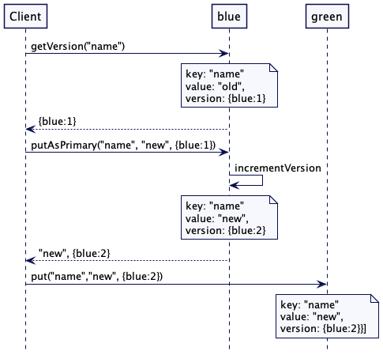

在无领导者复制的模式下，客户端或协调者节点会根据键值选取节点进行数据写入。根据键值所映射的集群主节点，版本向量会进行相应的更新。就复制而言，具有相同版本向量的值就可以复制到其它集群节点上。如果键值对应的集群节点不可用，就选择下一个节点。对于保存值的第一个集群节点而言，版本向量只能递增。所有其它节点保存的只是数据的副本。像 [voldemort](https://www.project-voldemort.com/voldemort/) 这样的数据库，递增版本向量的代码看上去是这样的：

```java
class ClusterClient
{
    public void put(String key, String value, VersionVector existingVersion)
    {
        List<Integer> allReplicas = findReplicas(key);
        int nodeIndex = 0;
        List<Exception> failures = new ArrayList<>();
        VersionedValue valueWrittenToPrimary = null;
        for (; nodeIndex < allReplicas.size(); nodeIndex++)
        {
            try
            {
                ClusterNode node = clusterNodes.get(nodeIndex);
                //the node which is the primary holder of the key value is responsible for incrementing version number.
                valueWrittenToPrimary = node.putAsPrimary(key, value, existingVersion);
                break;
                } catch (
            Exception e)
            {
                //if there is exception writing the value to the node, try other replica.
                failures.add(e);
            }
        }
        if (valueWrittenToPrimary == null)
        {
            throw new NotEnoughNodesAvailable("No node succeeded in writing the value.", failures);
        }
        //Succeded in writing the first node, copy the same to other nodes.
        nodeIndex++;
        for (; nodeIndex < allReplicas.size(); nodeIndex++)
        {
            ClusterNode node = clusterNodes.get(nodeIndex);
            node.put(key, valueWrittenToPrimary);
        }
    }
}
```

充当主节点的节点会递增版本号。

```java
public VersionedValue putAsPrimary(String key, String value, VersionVector existingVersion)
{
    VersionVector newVersion = existingVersion.increment(nodeId);
    VersionedValue versionedValue = new VersionedValue(value, newVersion);
    put(key, versionedValue);
    return versionedValue;
}

public void put(String key, VersionedValue value)
{
    versionVectorKvStore.put(key, value);
}
```

从上面的代码可以看出，不同的客户端可以在不同的节点上更新相同的键值，比如，当客户端无法触达某个特定节点时。这就会造成一种情况，不同的节点有不同的值，根据它们的版本向量，可以认为这些值是“并发的”。

如下图所示，client1 和 client2 都在尝试写入“name”这个键值。如果 client1 无法写入到 green 这个服务器，green 服务器就会丢掉 client1 写入的值。当 client2 尝试写入但无法连接到 blue 服务器，它就会写入到 green 服务器。“name”这个键值的版本向量就反映出 blue 和 green 两个服务器存在并发写入。

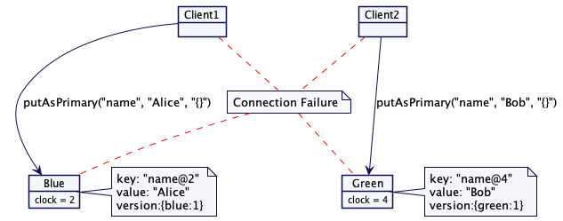

图 2：在不同副本上的并发更新

因此，当认为版本是并发的时候，基于存储的版本向量对于任何键值都会持有多个版本。

```java
class VersionVectorKVStore
{
    public void put(String key, VersionedValue newValue)
    {
        List<VersionedValue> existingValues = kv.get(key);
        if (existingValues == null)
        {
            existingValues = new ArrayList<>();
        }
        rejectIfOldWrite(key, newValue, existingValues);
        List<VersionedValue> newValues = merge(newValue, existingValues);
        kv.put(key, newValues);
    }

    //If the newValue is older than existing one reject it.
    private void rejectIfOldWrite(String key, VersionedValue newValue, List<VersionedValue> existingValues)
    {
        for (VersionedValue existingValue : existingValues)
        {
            if (existingValue.descendsVersion(newValue))
            {
                throw new ObsoleteVersionException("Obsolete version for key '" + key
                + "': " + newValue.versionVector);
            }
        }
    }

    //Merge new value with existing values. Remove values with lower version than the newValue.
    // If the old value is neither before or after (concurrent) with the newValue. It will be preserved
    private List<VersionedValue> merge(VersionedValue newValue, List<VersionedValue> existingValues)
    {
        List<VersionedValue> retainedValues = removeOlderVersions(newValue, existingValues);
        retainedValues.add(newValue);
        return retainedValues;
    }

    private List<VersionedValue> removeOlderVersions(VersionedValue newValue, List<VersionedValue> existingValues)
    {
        List<VersionedValue> retainedValues = existingValues.stream().
        filter(v -> !newValue.descendsVersion(v))
        //keep versions which are not directly dominated by newValue.
        .collect(Collectors.toList());
        return retainedValues;
    }
}
```

如果从多个节点中进行读取时，检测到了并发值，就会抛出错误，这就要允许客户端解决冲突了。

### 解决冲突

如果不同的副本返回了多个版本，向量时钟比较可以检测出最新的值。

```java
class ClusterClient
{
    public List<VersionedValue> get(String key)
    {
        List<Integer> allReplicas = findReplicas(key);
        List<VersionedValue> allValues = new ArrayList<>();
        for (Integer index : allReplicas)
        {
            ClusterNode clusterNode = clusterNodes.get(index);
            List<VersionedValue> nodeVersions = clusterNode.get(key);
            allValues.addAll(nodeVersions);
        }
        return latestValuesAcrossReplicas(allValues);
    }

    private List<VersionedValue> latestValuesAcrossReplicas(List<VersionedValue> allValues)
    {
        List<VersionedValue> uniqueValues = removeDuplicates(allValues);
        return retainOnlyLatestValues(uniqueValues);
    }

    private List<VersionedValue> retainOnlyLatestValues(List<VersionedValue> versionedValues)
    {
        for (int i = 0; i < versionedValues.size(); i++)
        {
            VersionedValue v1 = versionedValues.get(i);
            versionedValues.removeAll(getPredecessors(v1, versionedValues));
        }
        return versionedValues;
    }

    private List<VersionedValue> getPredecessors(VersionedValue v1, List<VersionedValue> versionedValues)
    {
        List<VersionedValue> predecessors = new ArrayList<>();
        for (VersionedValue v2 : versionedValues)
        {
            if (!v1.sameVersion(v2) && v1.descendsVersion(v2))
            {
                predecessors.add(v2);
            }
        }
        return predecessors;
    }

    private List<VersionedValue> removeDuplicates(List<VersionedValue> allValues)
    {
        return allValues.stream().distinct().collect(Collectors.toList());
    }
}
```

当有并发的更新时，仅仅根据版本向量做冲突解决是不够的。因此，很重要的一点是，由客户端提供应用特定的冲突解决器（Conflict Resolver）。客户端在读取值的时候提供一个冲突解决器。

```java
public interface ConflictResolver
{
    VersionedValue resolve(List<VersionedValue> values);
}

class ClusterClient
{
    public VersionedValue getResolvedValue(String key, ConflictResolver resolver)
    {
        List<VersionedValue> versionedValues = get(key);
        return resolver.resolve(versionedValues);
    }
}
```

比如，[riak](https://riak.com/posts/technical/vector-clocks-revisited/index.html?p=9545.html)就允许提供冲突解决器，就像这里解释的那样。

### 最后写入胜（Last Write Wins， LWW）的冲突解决

虽然版本向量允许检测不同服务器组的并发写入，但在产生冲突的情况下，其本身并不能帮助给客户端提供识别出选择哪个值。解决问题的责任在客户端身上。有时，客户端倾向于让键值存储根据时间戳来解决冲突。虽然通过跨服务器的时间戳存在一些已知的问题，但这种方式胜在简单，使其成为了客户端的首选方案，即便是由于跨服务器时间戳的问题，存在丢失一些更新的风险。它们完全要依赖于像 NTP 这样的服务得到良好的配置，能够跨集群工作正常。像 [riak](https://riak.com/posts/technical/vector-clocks-revisited/index.html?p=9545.html) 和 [voldemort](https://www.project-voldemort.com/voldemort/) 这样的数据库允许用户选择“最后写入胜”的冲突解决策略。

要支持 LWW 冲突解决，每个值写入时就要带上时间戳。

```java
class TimestampedVersionedValue
{
    class TimestampedVersionedValue
    {
        String value;
        VersionVector versionVector;
        long timestamp;

        public TimestampedVersionedValue(String value, VersionVector versionVector, long timestamp)
        {
            this.value = value;
            this.versionVector = versionVector;
            this.timestamp = timestamp;
        }
    }
}
```

读取值时，客户端可以时间戳获取最新的值。在这种情况下，版本向量就完全忽略了。

```java
class ClusterClient
{
    public Optional<TimestampedVersionedValue> getWithLWWW(List<TimestampedVersionedValue> values)
    {
        return values.stream().max(Comparator.comparingLong(v -> v.timestamp));
    }
}
```

### 读取修复

虽然允许任何集群节点接受写请求可以提高可用性，但重要的是，所有的副本最终都要有相同的数据。一种常见的修复副本方法是在客户端读取数据的时候。

冲突解决后，还可以检测出哪些节点有旧版本。最新版本会发送给有旧版本的节点，这是处理来自客户端读取请求的一部分。这就是所谓的读修复。

考虑如下图所示的场景。两个节点，blue 和 green，都拥有键值“name”对应的值。green 节点有最新的版本，其版本向量为[blue: 1, green:1]。从 blue 和 green 两个副本进行值的读取时，二者可以进行比较，找出哪个节点缺少了最新的版本，然后，向这个集群节点发出一个带有最新版本的更新请求。

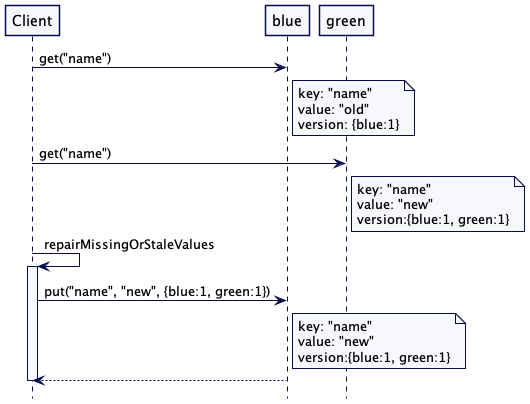

图 3：读取修复

### 允许同一集群节点并发更新

有这样一种可能性，两个客户端并发写入同一个节点。在上面所示的默认实现中，第二个写入请求会被拒绝。在这种情况下，每个集群节点一个版本号的基本实现是不够的。

考虑下面这种场景。两个客户端尝试更新同样的键值，第二个客户端会得到一个异常，因为在它的更新请求中传递的版本号是过期的。

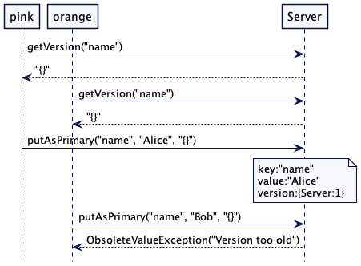

图 4：两个客户端并发更新同一键值

像 [riak](https://riak.com/posts/technical/vector-clocks-revisited/index.html?p=9545.html) 这样的数据库会给客户端一些灵活性，允许这样的并发写请求，倾向于不给错误应答。

### 使用客户端 ID 代替服务端 ID

如果集群的每个客户端都有一个唯一的 ID，就可以使用客户端 ID。每个客户端 ID 对应存储一个版本号。每次客户端写入一个值，它会先读取既有的版本，然后递增同客户端 ID 关联的数字，再写回服务器。

```java
class ClusterClient
{
    private VersionedValue putWithClientId(String clientId, int nodeIndex, String key, String value, VersionVector version)
    {
        ClusterNode node = clusterNodes.get(nodeIndex);
        VersionVector newVersion = version.increment(clientId);
        VersionedValue versionedValue = new VersionedValue(value, newVersion);
        node.put(key, versionedValue);
        return versionedValue;
    }
}
```

因为每个客户端递增的是自己的计数器，并发写会在服务器上创建出自己的兄弟值（sibling value），但并发写却不会失败。

上面提及的场景，第二个客户端出现错误，其运作方式如下：

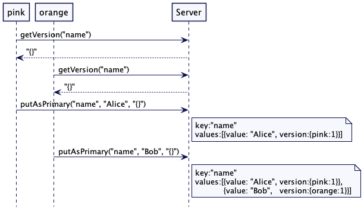

图 5：两个客户端并发更新同一键值

### 点状版本向量

基于客户端 ID 的版本向量的一个主要问题是，版本向量的大小直接依赖于客户端的数量。这会导致在一段时间内，集群节点为某个给定的键值积累许多并发值。这个问题成为兄弟爆炸。为了解决这个问题，并依然允许基于集群节点的版本向量，[riak](https://riak.com/posts/technical/vector-clocks-revisited/index.html?p=9545.html) 使用了一种版本向量的变体，称为[点状版本向量](https://riak.com/posts/technical/vector-clocks-revisited-part-2-dotted-version-vectors/index.html)。

## 样例

[voldemort](https://www.project-voldemort.com/voldemort/) 按照这里描述的方式使用版本向量，其采用的基于时间戳的最后写入胜的冲突解决方案。

[riak](https://riak.com/posts/technical/vector-clocks-revisited/index.html?p=9545.html) 开始采用基于客户端 ID 的版本向量，但是，迁移到基于集群节点的版本向量，最终是点状版本向量。Riak 也支持基于系统时间戳的最后写入胜冲突解决方案。

[cassandra](http://cassandra.apache.org/) 并不使用版本向量，它只支持基于系统时间戳的最后写入胜的冲突解决方案。

**原文**

https://martinfowler.com/articles/patterns-of-distributed-systems/versioned-value.html

将值的每次更新连同新版本一同存储起来，以允许读取历史值。

**2021.6.22**

## 问题

在分布式系统中，节点需要知道对于某个键值而言，哪个值是最新的。有时，它们知道过去的值，这样，它们就可以对一个值的变化做出恰当的反应了。

## 解决方案

在每个值里面都存储一个版本号。版本在每次更新时递增。这样，每次更新就都可以转换为一次新的写入，而无需阻塞读取。客户端可以读取特定版本号的对应的历史值。

考虑一个复制的键值存储的简单例子。集群的领导者处理所有对键值存储的写入。它将写入请求保存在[预写日志](https://write-ahead-log.md/)中。预写日志使用[领导者和追随者](https://leader-and-followers.md/)进行复制。在到达[高水位标记](https://high-water-mark.md/)时，领导者将预写日志的条目应用到键值存储中。这是一种标准的复制方法，称之为[状态机复制（state-machine-replication）](https://en.wikipedia.org/wiki/State_machine_replication)。大多数数据系统，其背后如果像 Raft 这样的共识算法支撑，都是这样实现的。在这种情况下，键值存储中会保存一个整数的版本计数器。每次根据预写日志应用键值与值的写命令时，这个计数器都要递增。然后，它会根据递增之后的版本计数器，构建一个新的键值。这样一来，不存在值的更新，但每次写入请求都会向后面的存储中附加一个新的值。

```java
class ReplicatedKVStore
{
    int version = 0;
    MVCCStore mvccStore = new MVCCStore();

    @Override
    public CompletableFuture<Response> put(String key, String value)
    {
        return server.propose(new SetValueCommand(key, value));
    }

    private Response applySetValueCommand(SetValueCommand setValueCommand)
    {
        getLogger().info("Setting key value " + setValueCommand);
        version = version + 1;
        mvccStore.put(new VersionedKey(setValueCommand.getKey(), version), setValueCommand.getValue());
        Response response = Response.success(version);
        return response;
    }
}
```

## 有版本键值的排序

能够快速定位到最佳匹配的版本，这是一个重要的实现考量，所以，有版本的价值常按这种方式进行组织：使用版本号当做键值的后缀，形成一个自然排序。这样就可以保持一个与底层数据结构相适应的顺序。比如说，一个键值有两个版本，key1 和 key2，key1 就会排在 key2 前面。

要存储有版本的键值与值，可以使用某种数据结构，比如，跳表，这样可以快速定位到最近的匹配版本上。使用 Java，可以像下面这样构建 MVCC 存储：

```java
class MVCCStore
{
    public class MVCCStore
    {
        NavigableMap<VersionedKey, String> kv = new ConcurrentSkipListMap<>();

        public void put(VersionedKey key, String value)
        {
            kv.put(key, value);
        }
    }
}
```

为了使用 NavigableMap，有版本的键值可以像下面这样实现。它会实现一个比较器，允许键值的自然排序。

```java
class VersionedKey
{
    public class VersionedKey implements Comparable<VersionedKey>
    {
        private String key;
        private int version;

        public VersionedKey(String key, int version)
        {
            this.key = key;
            this.version = version;
        }

        public String getKey()
        {
            return key;
        }

        public int getVersion()
        {
            return version;
        }

        @Override
        public int compareTo(VersionedKey other)
        {
            int keyCompare = this.key.compareTo(other.key);
            if (keyCompare != 0)
            {
                return keyCompare;
            }
            return Integer.compare(this.version, other.version);
        }
    }
}
```

这个实现允许通过 NavigableMap 的 API 获取特定版本的值。

```java
class MVCCStore
{
    public Optional<String> get(final String key, final int readAt)
    {
        Map.Entry<VersionedKey, String> entry = kv.floorEntry(new VersionedKey(key, readAt));
        return (entry == null) ? Optional.empty() : Optional.of(entry.getValue());
    }
}
```

看一个例子，一个键值有四个版本，存储的版本号分别是 1、2、3 和 5。根据客户端所使用版本去读取值，返回的是最接近匹配版本的键值。

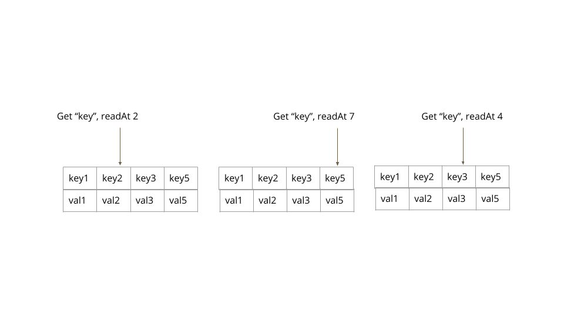

图1：读取特定版本

存储有特定键值和值的版本就会返回给客户端。客户端使用这个版本读取值。整体工作情况如下所示：

versioned-value-logical-clock-put

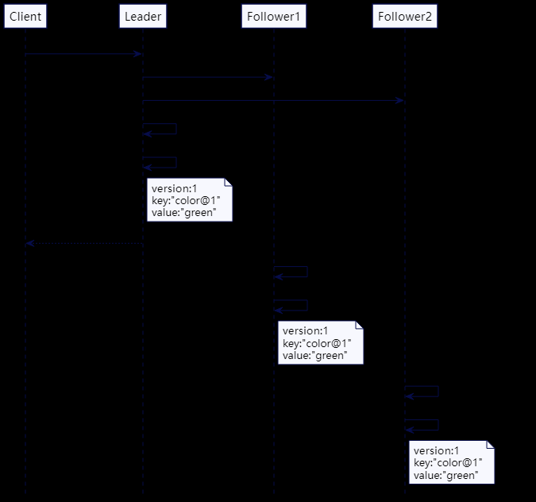

图2：Put 请求处理

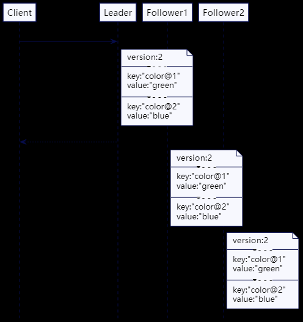

图3：读取特定版本

# 读取多个版本

有时，客户端需要获取从某个给定版本号开始的所有版本。比如，在<u>状态监控</u>中，客户端就要获取从指定版本开始的所有事件。

集群节点可以多存一个索引结构，以便将一个键值所有的版本都存起来。

```java
class IndexedMVCCStore
{
    public class IndexedMVCCStore
    {
        NavigableMap<String, List<Integer>> keyVersionIndex = new TreeMap<>();
        NavigableMap<VersionedKey, String> kv = new TreeMap<>();
        ReadWriteLock rwLock = new ReentrantReadWriteLock();
        int version = 0;

        public int put(String key, String value)
        {
            rwLock.writeLock().lock();
            try
            {
                version = version + 1;
                kv.put(new VersionedKey(key, version), value);
                updateVersionIndex(key, version);
                return version;
                } finally {
                rwLock.writeLock().unlock();
            }
        }

        private void updateVersionIndex(String key, int newVersion)
        {
            List<Integer> versions = getVersions(key);
            versions.add(newVersion);
            keyVersionIndex.put(key, versions);
        }

        private List<Integer> getVersions(String key)
        {
            List<Integer> versions = keyVersionIndex.get(key);
            if (versions == null)
            {
                versions = new ArrayList<>();
                keyVersionIndex.put(key, versions);
            }
            return versions;
        }
    }
}
```

这样，就可以提供一个客户端 API，读取从指定版本开始或者一个版本范围内的所有值。

```java
class IndexedMVCCStore
{
    public List<String> getRange(String key, final int fromRevision, int toRevision)
    {
        rwLock.readLock().lock();
        try
        {
            List<Integer> versions = keyVersionIndex.get(key);
            Integer maxRevisionForKey = versions.stream().max(Integer::compareTo).get();
            Integer revisionToRead = maxRevisionForKey > toRevision ? toRevision : maxRevisionForKey;
            SortedMap<VersionedKey, String> versionMap = kv.subMap(new VersionedKey(key, revisionToRead), new VersionedKey(key, toRevision));
            getLogger().info("Available version keys " + versionMap + ". Reading@" + fromRevision + ":" + toRevision);
            return new ArrayList<>(versionMap.values());
            } finally {
            rwLock.readLock().unlock();
        }
    }
}
```

有一点必须多加小心，根据某个索引进行相应的更新和读取时，需要使用恰当的锁。

> There is an alternate implementation possible to save a list of all the versioned values with the key, as used in Gossip Dissemination to avoid unnecessary state exchange.

有一种替代的实现方案，就是将所有值的列表和键值存在一起，就像在Gossip 传播（Gossip Dissemination）中所用的一样，以[规避不必要的状态交换](https://martinfowler.com/articles/patterns-of-distributed-systems/gossip-dissemination.html#AvoidingUnnecessaryStateExchange)

MVCC 与事务隔离

数据库采用有版本的值实现[MVCC](https://en.wikipedia.org/wiki/Multiversion_concurrency_control)和[事务隔离](https://en.wikipedia.org/wiki/Isolation_(database_systems))。

并发控制，讨论的的是有多个并发请求访问同一数据时，该如何使用锁。当用锁对访问进行同步时，在持有锁的请求完成并释放掉锁之前，所有其它请求都会阻塞住。而使用了有版本的值，每个写请求都添加一条新的记录。这就可以用非阻塞数据结构存储值了。

> Transaction isolation levels, such as [snapshot-isolation], can be naturally implemented as well. When a client starts reading at a particular version, it’s guaranteed to get the same value every time it reads from the database, even if there are concurrent write transactions which commit a different value between multiple read requests.

事务隔离级别，比如[快照隔离](https://jepsen.io/consistency/models/snapshot-isolation)，实现起来就很自然了。当客户端在某个特定版本开始读取，它保证从数据库中每次读到的都是同一个值，即便存在并发写的事务，在多个读请求之间提交了不同的值。

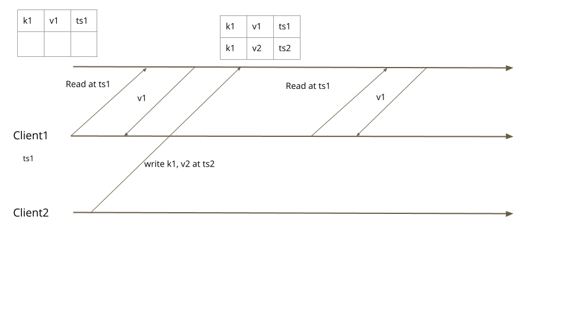

图4：读取快照

使用 RocksDb 当做存储引擎

有一种很常见的数据存储的做法，就是使用 [rocksdb](https://rocksdb.org/docs/getting-started.html) 或类似的嵌入式存储引擎当做存储后端。比如，[etcd](https://etcd.io/) 使用 [boltdb](https://github.com/etcd-io/bbolt#using-keyvalue-pairs)，[cockroachdb](https://www.cockroachlabs.com/docs/stable/) 早期使用 [rocksdb](https://rocksdb.org/docs/getting-started.html)，现在它用的是 RocksDb的一个 Go 语言的克隆版，称为 [pebble](https://github.com/cockroachdb/pebble)。

这些存储引擎提供的实现很适合存储有版本的值。在内部，它们使用了跳表，其方式就如上面讨论的那样，依赖于键值的顺序。当然，需要为键值排序提供一个订制的比较器。

```java
public class VersionedKeyComparator extends Comparator
{
    public VersionedKeyComparator()
    {
        super(new ComparatorOptions());
    }

    @Override
    public String name()
    {
        return "VersionedKeyComparator";
    }

    @Override
    public int compare(Slice s1, Slice s2)
    {
        VersionedKey key1 = VersionedKey.deserialize(ByteBuffer.wrap(s1.data()));
        VersionedKey key2 = VersionedKey.deserialize(ByteBuffer.wrap(s2.data()));
        return key1.compareTo(key2);
    }
}
```

使用 [rocksdb](https://rocksdb.org/docs/getting-started.html) 可以这么做：

```java
class RocksDBMvccStore
{
    private final RocksDB db;

    public RocksDBMvccStore(File cacheDir) throws RocksDBException
    {
        Options options = new Options();
        options.setKeepLogFileNum(30);
        options.setCreateIfMissing(true);
        options.setLogFileTimeToRoll(TimeUnit.DAYS.toSeconds(1));
        options.setComparator(new VersionedKeyComparator());
        db = RocksDB.open(options, cacheDir.getPath());
    }

    public void put(String key, int version, String value) throws RocksDBException
    {
        VersionedKey versionKey = new VersionedKey(key, version);
        db.put(versionKey.serialize(), value.getBytes());
    }

    public String get(String key, int readAtVersion)
    {
        RocksIterator rocksIterator = db.newIterator();
        rocksIterator.seekForPrev(new VersionedKey(key, readAtVersion).serialize());
        byte[] valueBytes = rocksIterator.value();
        return new String(valueBytes);
    }
}
```

## 示例

[etcd3](https://coreos.com/blog/etcd3-a-new-etcd.html) 使用的 MVCC 后端有一个单独的整数表示版本。

[mongodb](https://www.mongodb.com/) 和 [cockroachdb](https://www.cockroachlabs.com/docs/stable/) 使用的 MVCC 后端有一个混合逻辑时钟。

# 预写日志（Write-Ahead Log）

**原文**

https://martinfowler.com/articles/patterns-of-distributed-systems/wal.html

将每个状态变化以命令形式持久化至只追加的日志中，提供持久化保证，而无需以存储数据结构存储到磁盘上。

也称：提交日志

## 问题

对服务器而言，即便在机器存储数据失败的情况下，也要保证强持久化，这一点是必需的。一旦服务器同意执行某个动作，即便服务器失效，重启后丢失了所有内存状态，它也应该做到保证执行。

## 解决方案

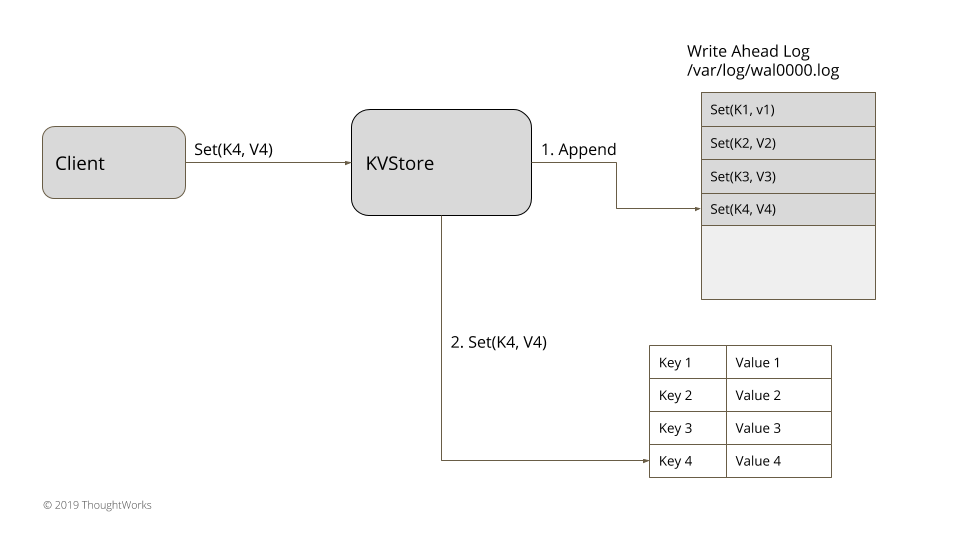

图1：预写日志

将每个状态变化以命令的形式存储在磁盘文件中。一个日志由一个服务端进程维护，其只进行顺序追加。一个顺序追加的日志，简化了重启时以及后续在线操作（新命令追加至日志时）的日志处理。每个日志条目都有一个唯一的标识符。唯一的日志标识符有助于在日志中实现某些其它操作，比如[分段日志（Segmented Log）](https://segmented-log.md/)，或是以[低水位标记（Low-Water Mark）](https://low-water-mark.md/)清理日志等等。日志的更新可以通过[单一更新队列（Singular Update Queue）](https://singular-update-queue.md/)实现。

典型的日志条目结构如下所示：

```java
class WALEntry… private final Long entryId ;
private final byte[] data ;
private final EntryType entryType ;
private long timeStamp ;
```

每次重启时，可以读取这个文件，然后，重放所有的日志条目就可以恢复状态。

考虑下面这个简单的内存键值存储：

```java
class KVStore
{
    private Map<String, String> kv = new HashMap<>();

    public String get(String key)
    {
        return kv.get(key);
    }

    public void put(String key, String value)
    {
        appendLog(key, value);
        kv.put(key, value);
    }

    private Long appendLog(String key, String value)
    {
        return wal.writeEntry(new SetValueCommand(key, value).serialize());
    }
}
```

put 操作表示成了命令（Command），在更新内存的哈希表 之前先把它序列化，然后存储到日志里。

```java
class SetValueCommand
{
    final String key;
    final String value;
    final String attachLease;

    public SetValueCommand(String key, String value)
    {
        this(key, value, "");
    }

    public SetValueCommand(String key, String value, String attachLease)
    {
        this.key = key;
        this.value = value;
        this.attachLease = attachLease;
    }

    @Override
    public void serialize(DataOutputStream os) throws IOException
    {
        os.writeInt(Command.SetValueType);
        os.writeUTF(key);
        os.writeUTF(value);
        os.writeUTF(attachLease);
    }

    public static SetValueCommand deserialize(InputStream is)
    {
        try
        {
            DataInputStream dataInputStream = new DataInputStream(is);
            return new SetValueCommand(dataInputStream.readUTF(), dataInputStream.readUTF(), dataInputStream.readUTF());
            } catch (IOException e) {
            throw new RuntimeException(e);
        }
    }
}
```

这就保证了一旦 put 方法返回成功，即便负责 KVStore 的进程崩溃了，启动时，通过读取日志文件也可以将状态恢复回来。

```java
class KVStore
{
    public KVStore(Config config)
    {
        this.config = config;
        this.wal = WriteAheadLog.openWAL(config);
        this.applyLog();
    }

    public void applyLog()
    {
        List<WALEntry> walEntries = wal.readAll();
        applyEntries(walEntries);
    }

    private void applyEntries(List<WALEntry> walEntries)
    {
        for (WALEntry walEntry : walEntries)
        {
            Command command = deserialize(walEntry);
            if (command instanceof SetValueCommand)
            {
                SetValueCommand setValueCommand = (SetValueCommand) command;
                kv.put(setValueCommand.key, setValueCommand.value);
            }
        }
    }

    public void initialiseFromSnapshot(SnapShot snapShot)
    {
        kv.putAll(snapShot.deserializeState());
    }
}
```

### 实现考量

实现日志还有一些重要的考量。有一点很重要，就是确保写入日志文件的日志条目已经实际地持久化到物理介质上。所有程序设计语言的文件处理程序库都提供了一个机制，强制操作系统将文件的变化“刷（flush）”到物理介质上。然而，使用这种机制有一个需要考量的权衡点。

将每个日志的写入都刷到磁盘，这种做法是给了我们一种强持久化的保证（这是使用日志的首要目的），但是，这种做法严重限制了性能，可能很快就会变成瓶颈。将刷的动作延迟，或是采用异步处理，性能就可以提高，但服务器崩溃时，日志条目没有刷到磁盘上，就存在丢失日志条目的风险。大多数采用的技术类似于批处理，以此限制刷操作的影响。

还有一个考量，就是如果日志文件受损，读取日志的时候，要保证能够检测出来，日志条目一般来说都会采用 CRC 的方式记录，这样，读取文件时可以对其进行校验。

单独的日志文件可能会变得难于管理，可能会快速地消耗掉所有的存储。为了处理这个问题，可以采用像[分段日志（Segmented Log）](https://segmented-log.md/)和[低水位标记（Low-Water Mark）](https://low-water-mark.md/)这样的技术。

预写日志是只追加的。因为这种行为，在客户端通信失败重试的时候，日志可能会包含重复的条目。应用这些日志条目时，需要确保重复可以忽略。如果最终状态是类似于 HashMap 的东西，也就是对同一个键值的更新是幂等的，那就不需要特殊的机制。否则，就需要一些机制，对于有唯一标识符的每个请求进行标记，检测重复。

## 示例

- 所有类似于 [Zookeeper](https://github.com/apache/zookeeper/blob/master/zookeeper-server/src/main/java/org/apache/zookeeper/server/persistence/FileTxnLog.java)[RAFT](https://github.com/etcd-io/etcd/blob/master/server/wal/wal.go)
和
的共识算法中的日志实现都类似于预写日志。
- [Kakfa](https://github.com/axbaretto/kafka/blob/master/core/src/main/scala/kafka/log/Log.scala)
的存储实现遵循着类似于数据库提交日志的结构。
- 所有的数据库，包括类似于Cassandra 这样的 NoSQL 数据库都使用[预写日志技术](https://github.com/apache/cassandra/blob/trunk/src/java/org/apache/cassandra/db/commitlog/CommitLog.java)
保证了持久性。
