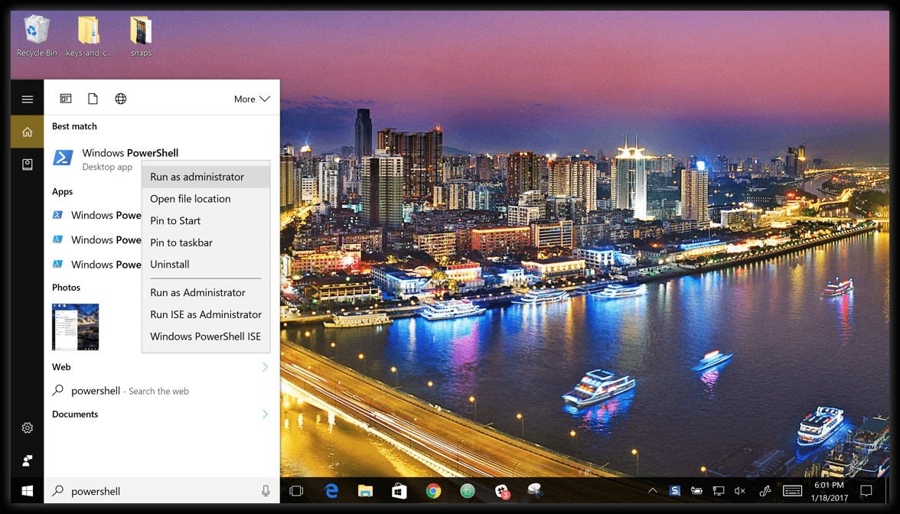

# Docker for Windows 使用入门

- <u>Docker for Windows 使用入门</u>
- <u>检查Docker Engine，Compose和Machine的版本</u>
- <u>浏览应用程序并运行示例</u>
- <u>PowerShell设置 tab completion</u>

# Docker for Windows 使用入门

欢迎来到Docker for Windows！

Docker是用于创建Docker应用程序的完整开发平台，Docker for Windows是在Windows系统上开始使用Docker的最佳方式。

如果你没有安装Docker for Windows，请阅读这篇文章：[Windows 10 安装 Docker for Windows](http://www.cnblogs.com/stulzq/p/7743667.html)

# 检查Docker Engine，Compose和Machine的版本

启动您最喜爱的shell（cmd.exe，PowerShell或其他）来检查docker和docker-compose的版本，并验证安装。

```plain text
PS C:\Users\Docker> docker --version
Docker version 17.03.0-ce, build 60ccb22

PS C:\Users\Docker> docker-compose --version
docker-compose version 1.11.2, build dfed245

PS C:\Users\Docker> docker-machine --version
docker-machine version 0.10.0, build 76ed2a6
```

复制

# 浏览应用程序并运行示例

接下来的几个步骤将通过一些例子。 这些只是建议您在系统上测试Docker的方法，检查版本信息，并确保docker命令正常工作。

1.打开一个shell（cmd.exe，PowerShell或其他）。

2.运行一些Docker命令，例如docker ps，docker version和docker info。

这是在powerhell中运行的docker ps的输出。 （在这个例子中，没有容器正在运行。）

```plain text
PS C:\Users\jdoe> docker ps

CONTAINER ID        IMAGE               COMMAND             CREATED             STATUS              PORTS               NAMES
```

复制

以下是docker version的命令输出示例。

```plain text
PS C:\Users\Docker> docker version
Client:
Version:      17.03.0-ce
API version:  1.26
Go version:   go1.7.5
Git commit:   60ccb22
Built:        Thu Feb 23 10:40:59 2017
OS/Arch:      windows/amd64

Server:
Version:      17.03.0-ce
API version:  1.26 (minimum version 1.12)
Go version:   go1.7.5
Git commit:   3a232c8
Built:        Tue Feb 28 07:52:04 2017
OS/Arch:      linux/amd64
Experimental: true
```

复制

以下是docker info的命令输出示例。

```plain text
PS C:\Users\Docker> docker info
Containers: 0
 Running: 0
 Paused: 0
 Stopped: 0
Images: 0
Server Version: 17.03.0-ce
Storage Driver: overlay2
 Backing Filesystem: extfs
 Supports d_type: true
 Native Overlay Diff: true
Logging Driver: json-file
Cgroup Driver: cgroupfs
Plugins:
 Volume: local
 Network: bridge host ipvlan macvlan null overlay
Swarm: inactive
Runtimes: runc
Default Runtime: runc
Init Binary: docker-init
containerd version: 977c511eda0925a723debdc94d09459af49d082a
runc version: a01dafd48bc1c7cc12bdb01206f9fea7dd6feb70
init version: 949e6fa
Security Options:
 seccomp
  Profile: default
Kernel Version: 4.9.12-moby
Operating System: Alpine Linux v3.5
OSType: linux
Architecture: x86_64
CPUs: 2
Total Memory: 1.934 GiB
Name: moby
ID: BM4O:645U:LUS6:OGMD:O6WH:JINS:K7VF:OVDZ:7NE4:ZVJT:PSMQ:5UA6
Docker Root Dir: /var/lib/docker
Debug Mode (client): false
Debug Mode (server): true
 File Descriptors: 13
 Goroutines: 21
 System Time: 2017-03-02T16:59:13.417299Z
 EventsListeners: 0
Registry: https://index.docker.io/v1/
Experimental: true
Insecure Registries:
 127.0.0.0/8
Live Restore Enabled: false
```

复制

上面的输出是例子。 您的输出，例如docker版本和docker信息，将取决于您的产品版本（例如，在安装较新版本时）。

3.运行docker run hello-world来测试从Docker Hub拉一个图像并启动一个容器。

```plain text
PS C:\Users\jdoe> docker run hello-world

Hello from Docker.
This message shows that your installation appears to be working correctly.

To generate this message, Docker took the following steps:
1. The Docker client contacted the Docker daemon.
2. The Docker daemon pulled the "hello-world" image from the Docker Hub.
3. The Docker daemon created a new container from that image which runs the executable that produces the output you are currently reading.
4. The Docker daemon streamed that output to the Docker client, which sent it to your terminal.
```

复制

4.尝试更有意义的东西，并使用此命令运行Ubuntu容器。

```plain text
PS C:\Users\jdoe> docker run -it ubuntu bash
```

复制

这将下载ubuntu容器image并启动它。 以下是在powerhell中运行此命令的输出。

```plain text
PS C:\Users\jdoe> docker run -it ubuntu bash

Unable to find image 'ubuntu:latest' locally
latest: Pulling from library/ubuntu
5a132a7e7af1: Pull complete
fd2731e4c50c: Pull complete
28a2f68d1120: Pull complete
a3ed95caeb02: Pull complete
Digest: sha256:4e85ebe01d056b43955250bbac22bdb8734271122e3c78d21e55ee235fc6802d
Status: Downloaded newer image for ubuntu:latest
```

复制

输入exit以停止容器并关闭powerhell。

5.使用此命令启动Dockerized Web服务器：

```plain text
PS C:\Users\jdoe> docker run -d -p 80:80 --name webserver nginx
```

复制

这将下载nginx容器image并启动它。 以下是在powerhell中运行此命令的输出。

```plain text
PS C:\Users\jdoe> docker run -d -p 80:80 --name webserver nginxUnable to find image 'nginx:latest' locallylatest: Pulling from library/nginxfdd5d7827f33: Pull completea3ed95caeb02: Pull complete716f7a5f3082: Pull complete7b10f03a0309: Pull completeDigest: sha256:f6a001272d5d324c4c9f3f183e1b69e9e0ff12debeb7a092730d638c33e0de3eStatus: Downloaded newer image for nginx:latestdfe13c68b3b86f01951af617df02be4897184cbf7a8b4d5caf1c3c5bd3fc267f
```

复制

6.将您的Web浏览器指向http:// localhost 以显示起始页面。

（由于您指定了默认HTTP端口，因此无需在URL的末尾追加：80）。


7.运行docker ps时，您的网络服务器正在运行，以查看容器上的详细信息。

```plain text
PS C:\Users\jdoe> docker psCONTAINER ID        IMAGE               COMMAND                  CREATED             STATUS              PORTSNAMESdfe13c68b3b8        nginx               "nginx -g 'daemon off"   3 days ago          Up 45 seconds       0.0.0.0:80->80/tcp, 443/tcp   webserver
```

复制

8.停止或移除容器和镜像。

nginx网络服务器将继续在该端口上的容器中运行，直到您停止和/或删除该容器。 如果要停止Web服务器，请键入：docker stop webserver，并使用docker start webserver重新启动它。

要使用单个命令停止并删除正在运行的容器，请键入：docker rm -f webserver。 这将删除容器，而不是nginx镜像。 您可以列出本地镜像与docker镜像。 您可能想要保留一些镜像，以便您不必再从Docker Hub再次拉出。 要删除不再需要的镜像，请使用docker rmi，后跟镜像ID或镜像名称。 例如，docker rmi nginx。

# PowerShell设置 tab completion

如果您希望为Docker命令提供方便的tab completion，可以按如下方式安装posh-docker PowerShell模块。

先决条件说明： 根据您的设置，您可能需要NuGet软件包管理器，以便您可以获得安装的提示。 确保您具有以管理员权限运行PowerShell的权限。

1.启动 PowerShell（以管理员身份运行）。

为此，请搜索PowerShell，右键单击，然后选择以管理员身份运行。



当系统询问您是否允许此应用更改您的设备时，单击是。

2.设置脚本执行策略，允许由受信任的发布者签名的下载脚本在您的计算机上运行。 为此，请在PowerShell提示符下键入。

```plain text
Set-ExecutionPolicy RemoteSigned
```

复制

要检查策略设置是否正确，请运行get-executionpolicy，这将返回RemoteSigned。

3.要安装posh-docker PowerShell模块以自动完成Docker命令，请键入：

```plain text
Install-Module posh-docker
```

复制

或者，仅为当前用户安装模块，请键入：

```plain text
Install-Module -Scope CurrentUser posh-docker
```

复制

剩下的的有时间在翻译。

https://docs.docker.com/docker-for-windows/#set-up-tab-completion-in-powershell