### 前言介绍：

WIN10安装Docker有两种方案，Win10专业版+Hyper-V+Containers Windows+Docker或者Win10家庭版+WSL2+Linux+Docker，本篇Docker安装思路是Win10家庭版伪装成专业版+Hyper-V+Containers Windows+Docker。

### 一，安装系统要求

目前Docker支持在windows系统安装，且只能在64位系统上安装，Docker有专门的Win10专业版系统的安装包，需要开启Hyper-V。但家庭版阉割了一些功能，无Hyper-V，安装Docker与其他版本安装方法稍微有些不同。以下是win10不同系统安装Docker的硬件要求，如下：

### WIN10 64位（专业版，企业版或教育版）

1.系统版本要求：专业版，企业版或教育版（内部版本15063或更高版本）。

2.必须启用Hyper-V和Containers Windows功能。

3.要在Windows 10上成功运行Client Hyper-V，需要满足以下硬件先决条件：

a.具有二级地址转换（SLAT）的 64位处理器.

b.4GB系统内存。 c.必须在BIOS设置中启用BIOS级硬件虚拟化支持。

### Windows 10 Home系统

1.安装Windows 10版本2004或更高版本。

2.在Windows上启用WSL2功能。

3.要在Windows 10 Home上成功运行WSL2。

a.具有二级地址转换（SLAT）的 64位处理器。

b.4GB系统内存。

c.必须在BIOS设置中启用BIOS级硬件虚拟化支持。

4.安装Linux内核更新程序包。

### 二，安装配置信息：

1.Docker软件：Docker Desktop Stable 2.3.0.22.Win10 64位3.已开启虚拟化Ctrl+Alt+Delete打开任务管理器，性能窗口可以查看虚拟化已开启，如图：

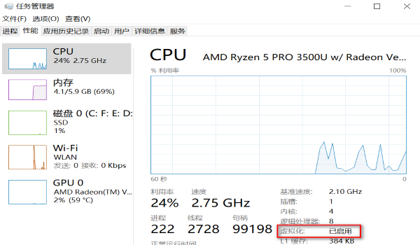

### 三，更新Windows系统

### 3.1 检查当前系统版本

Windows徽标键+R，弹出运行窗口，键入winver，点击“确定”，查看系统当前版本，如图:

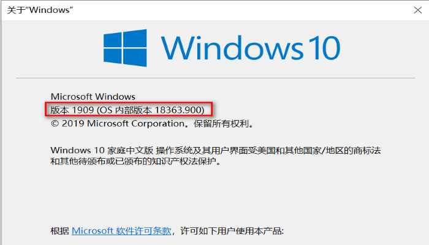

### 3.2 更新系统版本至2004

当前版本为1909，点击【开始菜单】->【设置】->【Windows更新】，检测更新，选择立即更新，更新至2004版本。更新完毕，再次查看系统版本，确认是版本2004，如图：

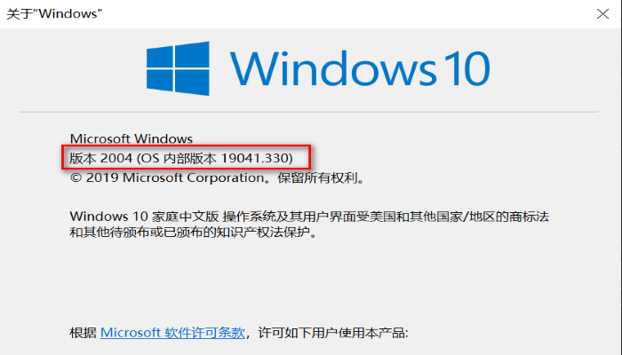

### 四，启用Hyper-v

Win10家庭中文版无Hyper-v，可以通过以下方式添加：

1.桌面新建一个Hyper-V.bat文件。

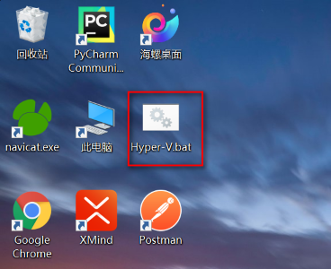

2.将以下内容拷贝到文件中，如下：

```plain text
pushd "%~dp0"

dir /b %SystemRoot%\servicing\Packages\*Hyper-V*.mum >hyper-v.txt

for /f %%i in ('findstr /i . hyper-v.txt 2^>nul') do dism /online /norestart /add-package:"%SystemRoot%\servicing\Packages\%%i"

del hyper-v.txt

Dism /online /enable-feature /featurename:Microsoft-Hyper-V-All /LimitAccess /ALL
```

3.鼠标右键选中“以管理员身份运行”，窗口运行执行代码，直到运行结束，显示提示是否重启，输入Y，重启电脑，如图：

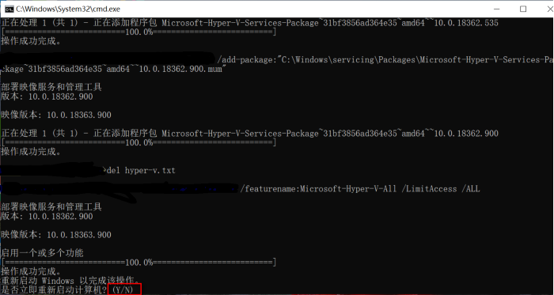

4.重启完毕，打开控制面板控->程序->程序和功能,点击“启用和关闭Windows功能”，弹出窗口，可看到Hyper-V已添加，如图：

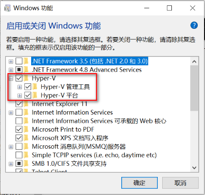

5.另外也可以以管理员身份运行cmd，输入systeminfo，若显示截图标红字段，表示Hyper-v已启用，如图：

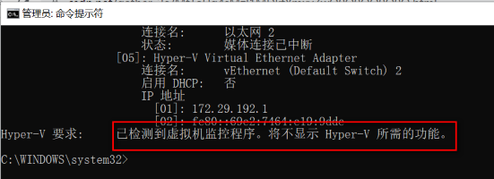

### 五，下载Docker Desktop Installer

官网地址：[https://hub.docker.com/editions/community/docker-ce-desktop-windows?tab=description](https://hub.docker.com/editions/community/docker-ce-desktop-windows?tab=description)

点击“Get Docker Desktop for Windows(Stable）”，下载保存到本地，如图：

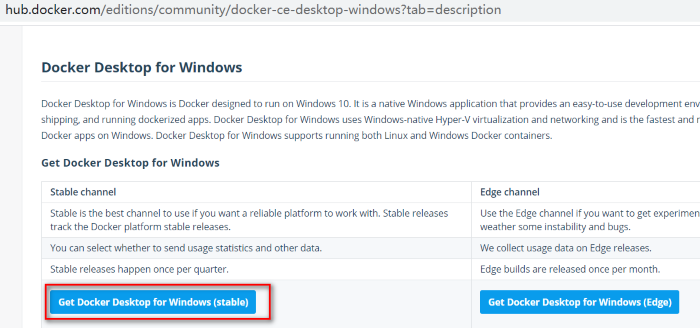

### 六，安装Docker Desktop Installer

本地选中软件Docker Desktop Installer，右键安装，进入安装首页，取消勾选“Enable WSL 2 Windows Features”，点击【ok】,如图：

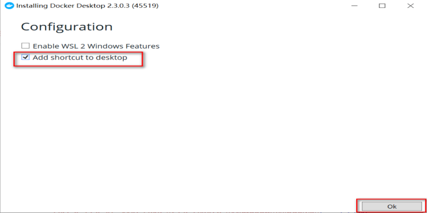

安装完成，点击【Close and log out】，注销账户，如图：

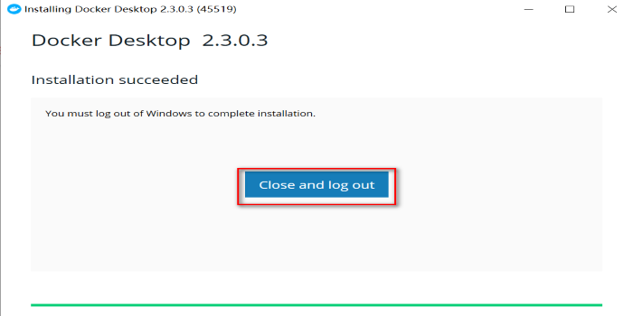

重新登录系统，可以看到桌面多了一个Docker Desktop的鲸鱼图标,如图：

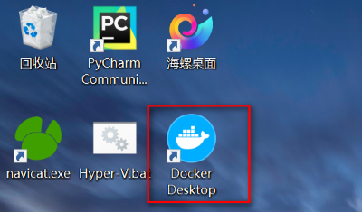

### 七，修改注册表伪装成Win10专业版

WIN10安装Docker有两种方案，Win10专业版+Hyper-V+Containers Windows+Docker或者Win10家庭版+WSL2+Linux+Docker，我暂时不想安装Linux，且看到帖子网友说WSL2不稳定，那就选择方案一进行安装。百度搜索了下，可以通过修改注册表的方式绕过Docker Desktop的安装校验，且后续对Docker使用没有影响。

修改注册表有两种方式：cmd命令窗口执行和直接修改注册表。

### 7.1 cmd命令窗口执行

以管理员身份运行cmd，输入命令，回车，如图：

```plain text
REG ADD "HKEY_LOCAL_MACHINE\software\Microsoft\Windows NT\CurrentVersion" /v EditionId /T REG_EXPAND_SZ /d Professional /F
```

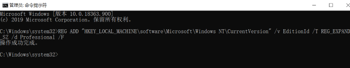

执行完毕，运行窗口输入”regedit”,打开注册表，定位到HKEY_LOCAL_MACHINENT，点击current version，在右侧找到EditionId，查看其已经更新为Professional。

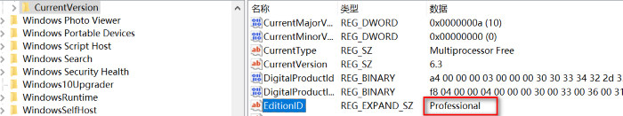

**需要注意的一点是，这种方式修改注册表，在下次重启之后不会自动还原。**

### 7.2 直接修改注册表

直接在注册表修改，运行窗口输入”regedit”,打开注册表，定位到HKEY_LOCAL_MACHINENT，点击current version，在右侧找到EditionId，如图：

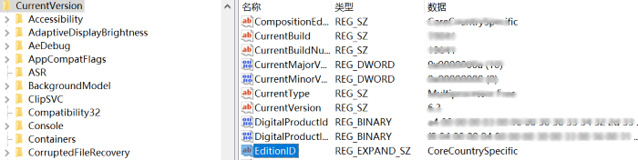

右键点击EditionId 选择“修改“，在弹出的对话框中将第二项”数值数据”的内容改为Professional，点击确定。

**需要注意的一点是，这种方式修改注册表，在下次重启之后会自动还原。每次启动Docker需要再次手动修改。**

### 7.3 注册表未修改报错

如果未提前修改注册表，桌面用管理员运行Docker Desktop，弹出窗口，会提示“WSL 2 is not installed”。

```plain text
WSL 2 is not installed

Install WSL using this powershell script (in an administrative powershell) and restart your computer before using Docker Desktop:

Enable-WindowsOptionalFeature -Online -FeatureName $("VirtualMachinePlatform", "Microsoft-Windows-Subsystem-Linux")
```

如图：

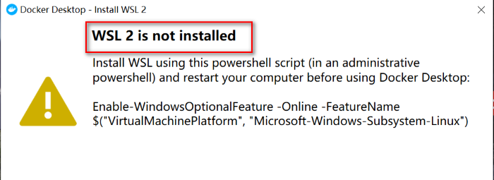

### 八，运行Docker

运行前一定要确保Hyper-V启用，第一次操作的时候不知道为什么Hyper-V没生效，启动Docker前重新执行了Hyper-V启用步骤，问题才解决。

### 8.1 验证Docker安装

1.桌面选中Docker Desktop的鲸鱼图标，右键选择以管理员身份运行，系统托盘新增一个鲸鱼的小图标，点击后展示菜单，选择“About Docker Desktop”,可查看Docker版本，如图：

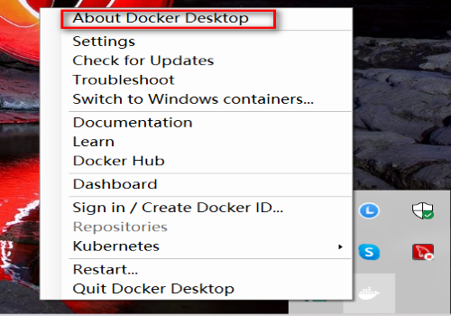

版本信息，如图：

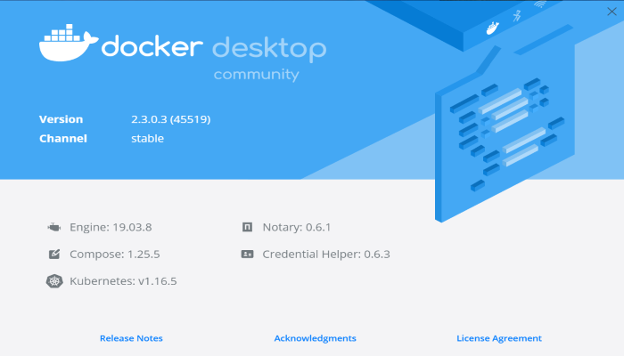

2.启动Docker Desktop，以管理员身份打开Windows PowerShell,运行输入命令

```shell
#列出容器docker ps
#列出所有容器docker container ls
#测试hello-worlddocker run hello-world
```

如图：

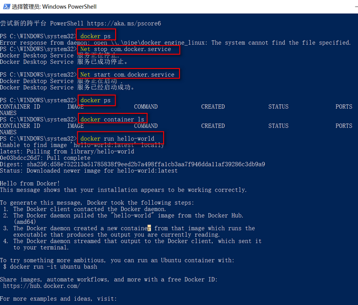

备注：第一次输入ps时报错“Error response from daemon: open ._engine_linux: The system cannot find the file specified.”，输入命令即可：

```plain text
Net stop com.docker.service
 Net start com.docker.service
```