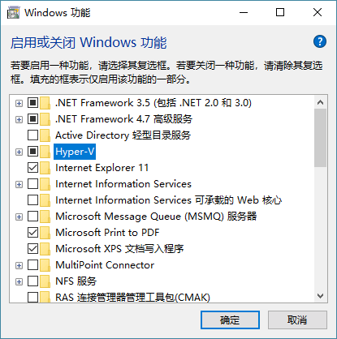
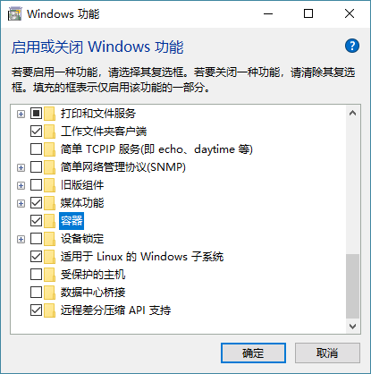
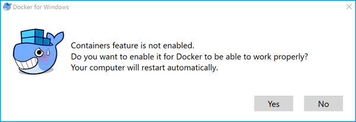

## 引言

Docker Desktop for Windows 是 Docker 公司为 Windows 用户提供的官方产品，它使得在 Windows 10 上搭建 Docker 环境变得简单快捷。本教程将通过图文并茂的方式，带您一步步完成安装和配置。

> **注意**
> Docker Desktop for Windows 是一个社区版（Community Edition, CE）应用，主要面向开发和测试环境，并非为生产环境设计。新特性可能会延迟发布，以确保其稳定性。

## 1. 环境要求

在开始安装之前，请确保您的系统满足以下条件：

*   **操作系统**: 64 位的 Windows 10 Pro（专业版）、Enterprise（企业版）或 Education（教育版），版本需为 1607 Anniversary Update (Build 14393) 或更高。
*   **硬件虚拟化**: BIOS/UEFI 中必须启用硬件虚拟化支持。
*   **Windows 功能**: 必须启用 `Hyper-V` 和 `容器` 这两个 Windows 功能。

## 2. 开启 Hyper-V 和容器功能

在安装 Docker 之前，需要先开启 Windows 的相关功能。

1.  右键单击 **开始** 按钮，选择 **"应用和功能"**。
2.  在右侧或底部找到并点击 **"程序和功能"**。
3.  点击 **"启用或关闭 Windows 功能"**。
4.  在弹出的窗口中，确保勾选 **`Hyper-V`** 和 **`容器`** 复选框，然后点击 **"确定"**。

    

    

> **注意**
> "容器"功能仅在 Windows 10 Anniversary Update (Build 14393) 及以上版本中可用。完成此步骤后，系统会提示您重启计算机，请务必重启以使设置生效。

## 3. 下载并安装 Docker Desktop

1.  访问 Docker 官方下载页面：[https://www.docker.com/products/docker-desktop](https://www.docker.com/products/docker-desktop)。
2.  点击 **"Download for Windows"** 按钮。您可能需要使用您的 Docker ID 登录 Docker 商店。
3.  选择下载 **稳定版 (Stable)** 或 **抢鲜版 (Edge)**。对于大多数用户，推荐使用稳定版。下载将开始，您会得到一个名为 `Docker for Windows Installer.exe` 的文件。
4.  找到下载的安装包，以管理员身份运行，并按照向导的提示完成安装。

安装完成后，Docker 会自动作为系统服务启动，并在通知栏显示一个鲸鱼图标。

## 4. 验证安装

恭喜！您已成功安装 Docker。现在我们来验证一下。

打开命令行工具（如 CMD 或 PowerShell），输入 `docker version` 命令：

```bash
$ docker version

Client:
 Version:           18.01.0-ce
 API version:       1.35
 Go version:        go1.9.2
 Git commit:        03596f5
 Built:             Wed Jan 10 20:05:55 2018
 OS/Arch:           windows/amd64
 Experimental:      false
 Orchestrator:      swarm

Server:
 Engine:
  Version:          18.01.0-ce
  API version:      1.35 (minimum version 1.12)
  Go version:       go1.9.2
  Git commit:       03596f5
  Built:            Wed Jan 10 20:13:12 2018
  OS/Arch:          linux/amd64
  Experimental:     false
```

> **提示**
> 注意 `Server` 部分的 `OS/Arch` 属性显示为 `linux/amd64`。这是因为默认情况下，Docker Daemon 运行在一个基于 Hyper-V 的轻量级 Linux 虚拟机中。在此模式下，您只能运行 Linux 容器。

## 5. 切换容器模式

Docker Desktop 允许您在 Linux 容器和原生 Windows 容器之间切换。

### 切换到 Windows 容器

如果您需要运行 Windows 容器，可以右键单击通知栏的 Docker 鲸鱼图标，选择 **"Switch to Windows containers..."**。

或者，您也可以使用以下命令切换（需在 Docker 安装目录的 `resources` 文件夹下执行）：

```bash
C:\Program Files\Docker\Docker\resources> .\SwitchDaemon.ps1 -Windows
```

如果此时没有开启 Windows 容器特性，系统会给出提示。



切换成功后，再次运行 `docker version`，您会看到 `Server` 的 `OS/Arch` 变成了 `windows/amd64`。

```bash
$ docker version

Client:
 ...

Server:
 Engine:
  Version:          18.01.0-ce
  API version:      1.35 (minimum version 1.24)
  Go version:       go1.9.2
  Git commit:       03596f5
  Built:            Wed Jan 10 20:20:36 2018
  OS/Arch:          windows/amd64
  Experimental:     true
```

> **注意**
> Windows 容器目前仍是一个实验性特性，因此 `Experimental` 属性为 `true`。

## 6. 检查组件版本

Docker Desktop 包含了一套完整的工具链。您可以通过以下命令检查各组件的版本：

```bash
# 查看 Docker 引擎版本
C:\> docker --version
Docker version 18.01.0-ce, build 03596f5

# 查看 Docker Compose 版本
C:\> docker-compose --version
docker-compose version 1.18.0, build 8dd22a96

# 查看 Docker Machine 版本
C:\> docker-machine --version
docker-machine.exe version 0.13.0, build 9ba6da9

# 查看 Notary 版本
C:\> notary version
notary version: 0.4.3, commit 9211198
```

现在，您可以开始您的 Docker 之旅了！尝试运行一些基本命令来熟悉环境：

```bash
# 查看本地镜像
docker image ls

# 查看正在运行的容器
docker container ls

# 查看系统信息
docker system info
