# Docker 常用命令

### 1、万能帮助命令

docker 命令 –help

假设你想用某个命令，但是又不知道该命令的一些参数怎么用，这时候上面的万能帮助命令就派上用场了。

更有甚者，你连命令也不记得了，那直接输入：

docker –help

找到你想要的那个命令，然后通过上面命令查看用法。

比如不知道如何运行容器？

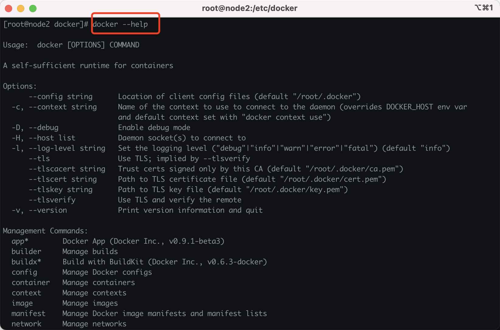

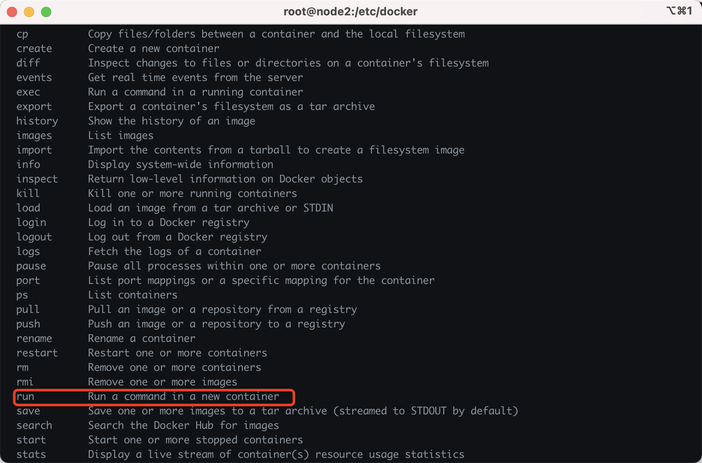

找到英文 Run a command in a new container，这正是我们需要的。

但是我又不知道 run 命令怎么用，接着如下：

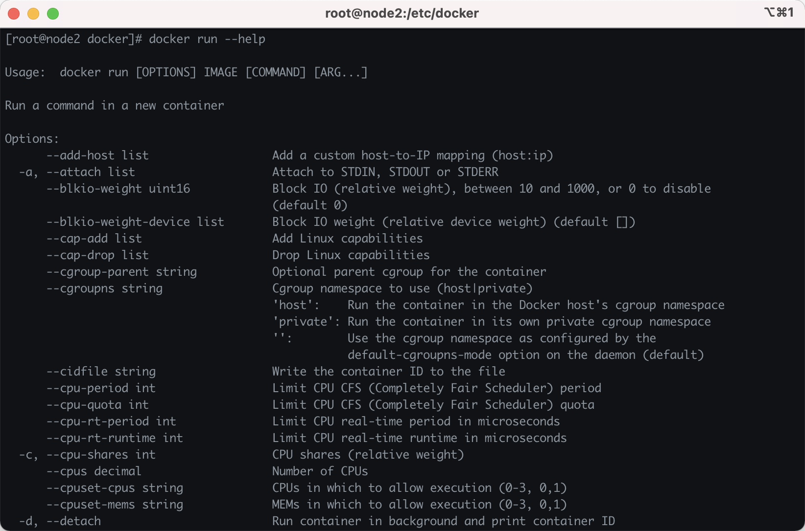

要是命令行看的太累，没关系，贴心的我给你们找好了官方参考：

https://docs.docker.com/engine/reference/commandline/docker/

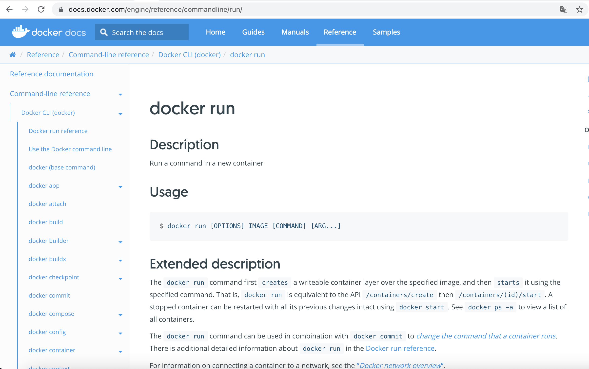

什么？英文看不懂？百度翻译走起来吧，这个确实没啥办法了，但实际上你们看完我这边文章，基本上常用的命令都会详细介绍的。

### 2、常用命令

### 2.1 查看版本信息

docker version

在安装 docker 时我们介绍过这个命令，这里就不截图了。

### 2.2 查看系统信息

docker info

包括查看当前系统 docker 镜像和容器的数量。

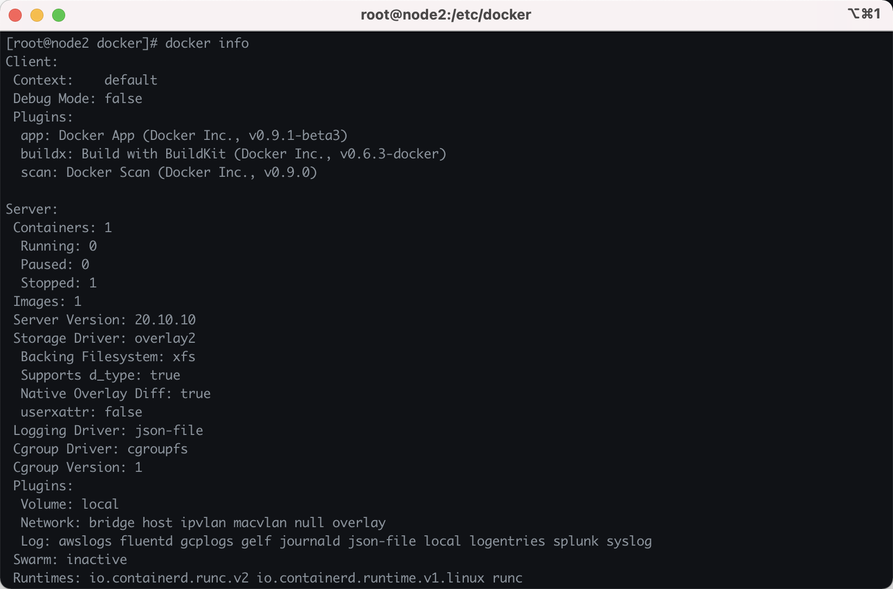

### 3、镜像常用命令

### 3.1 查看镜像

docker images

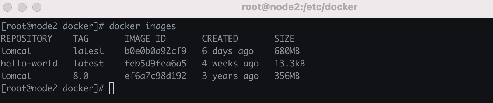

①、REPOSITORY: 镜像仓库源

②、TAG：镜像版本，latest 表示最新版本

③、**IMAGE ID：镜像ID（特别重要）**

④、CREATED：创建时间

⑤、SIZE：镜像大小。

### 3.2 镜像搜索

docker search <镜像名>

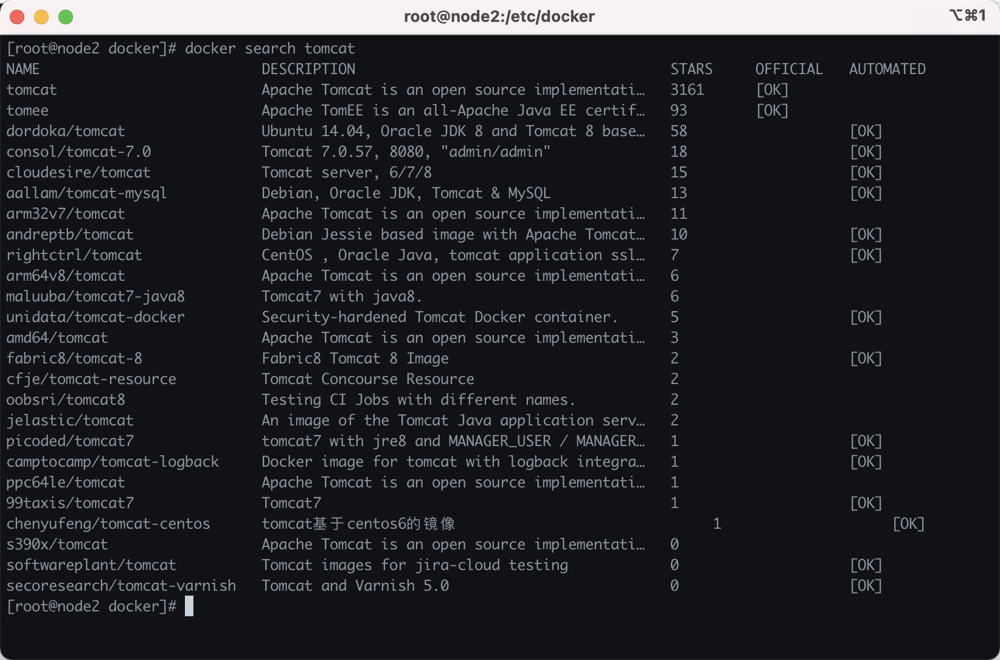

①、NAME：镜像名称

②、DESCRIPTION：镜像描述

③、STARS：收藏数

④、OFFICIAL：是否官方

⑤、AUTOMATED：是否自动构建

这里的搜索，也有官方网址：

https://hub.docker.com/search?q=tomcat&type=image

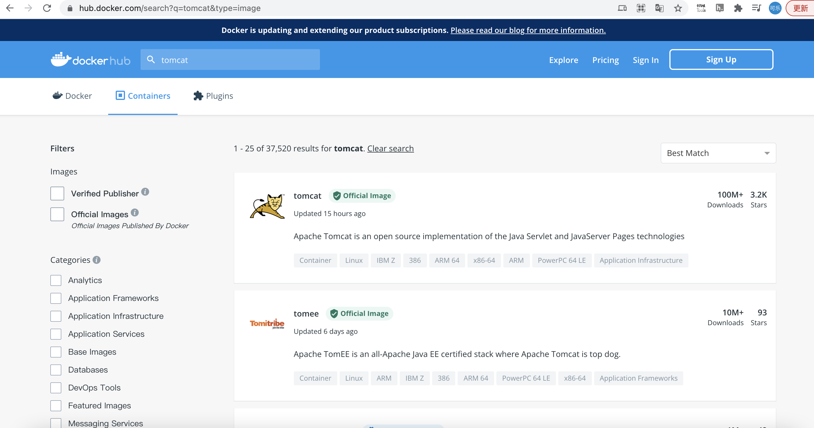

### 3.3 下载镜像

docker pull 镜像名<:tags>

比如下载最新版 Tomcat 镜像： docker pull tomcat

比如下载Tomcat 8.0 镜像：docker pull tomcat:8.0

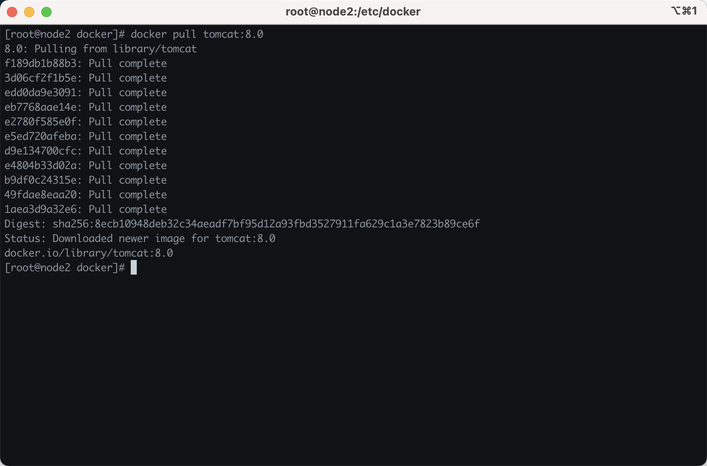

### 3.4 删除镜像

docker rmi repository<:tag> # 根据名称和版本删除，如果不指定tag，默认是lastest

docker rmi IMAGE_ID # 根据镜像id删除

docker rmi IMAGE_ID1 IMAGE_ID2 … # 批量删除

上面的 repository 和 tag 便是前面说的 【docker images】命令的提示。

比如删掉 tomcat 8.0 版本的镜像：

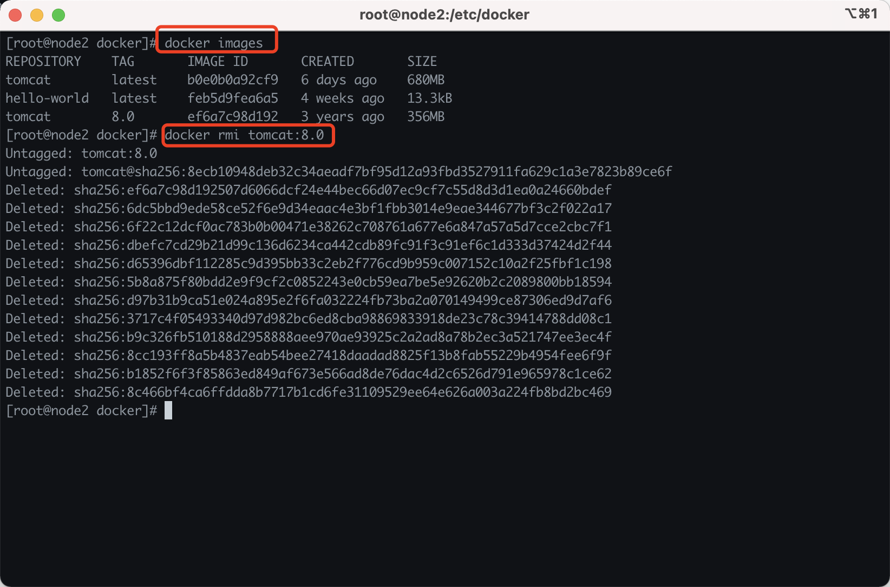

### 4、容器常用命令

### 4.1 新建容器并启动

docker run <参数> 镜像id|镜像名称

参数说明：

①、–name: 为启动容器指定一个名字，注意有两个 –。

②、-d：表示以后台方式运行,并返回容器ID。

③、-i:以交互模式运行容器。

④、-t:为容器重新分配一个伪输入终端。

⑤、-p: 主机端口:容器端口 容器端口 ip:主机端口:容器端口。

⑥、-P：随机端口映射，容器内部端口随机映射到主机端口。

⑦、–link=[]：添加链接到另一个容器。

比如以后台方式启动一个Tomcat容器：

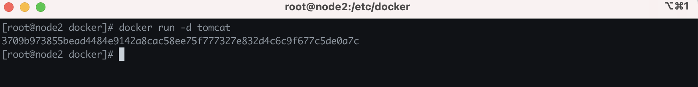

### 4.2 进入容器

①、使用run方式在创建时进入 docker run -it [镜像id/镜像名] /bin/bash

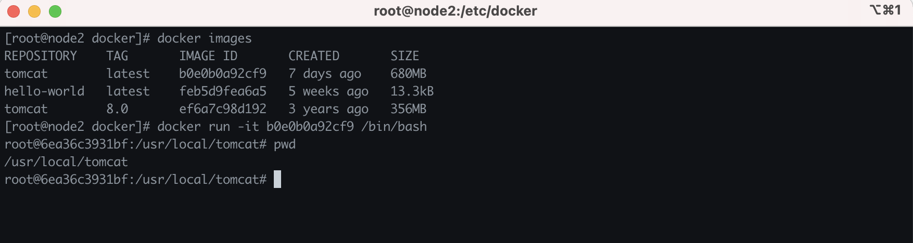

②、使用 attach 命令（进入已启动的容器）

直接进入 容器启动命令的终端，不会启动新进程，多个attach连接共享容器屏幕，参数：–sig-proxy=false 确保CTRL-D或CTRL-C不会关闭容器docker attach –sig-proxy=false 容器名称/ 容器ID

③、使用 exec 命令（进入已启动的容器）

进入容器后开启一个新的终端，可以在里面进行操作。

docker exec -it 容器名称/容器ID /bin/bash

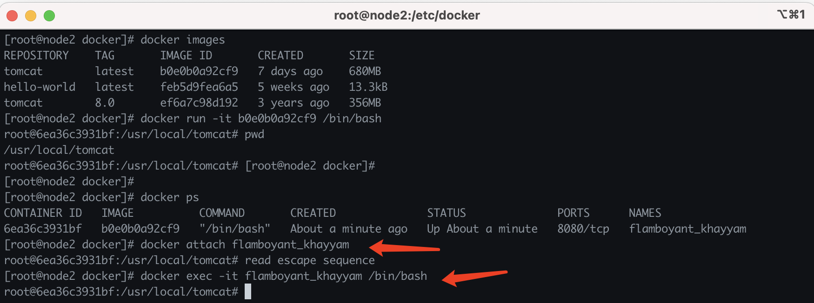

### 4.3 退出容器

①、Ctrl+P+Q : 仅退出容器，不关闭容器。

②、exit: 关闭容器并退出。

### 4.4 查看所有运行的容器

1、查看正在运行的容器

docker ps

2、查看正在运行的容器的ID

docker ps -q

3、查看正在运行+历史运行过的容器

docker ps -a

4、显示运行容器总文件大小

docker ps -s

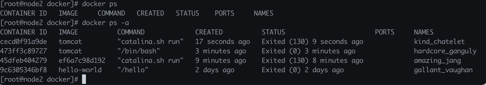

### 4.5 停止与删除容器

①、停止一个运行中的容器

docker stop 容器名/容器id

②、杀掉一个运行中的容器

docker kill 容器名/容器id

③、删除一个已停止的容器

docker rm 容器名/容器id

④、删除一个运行中的容器

docker rm -f 容器名/容器id

### 4.6 查看容器日志

docker logs <参数>容器名|容器id

参数：

①、-f 跟踪日志输出

②、-t：显示时间戳

③、–tail N：仅列出最后N条日志

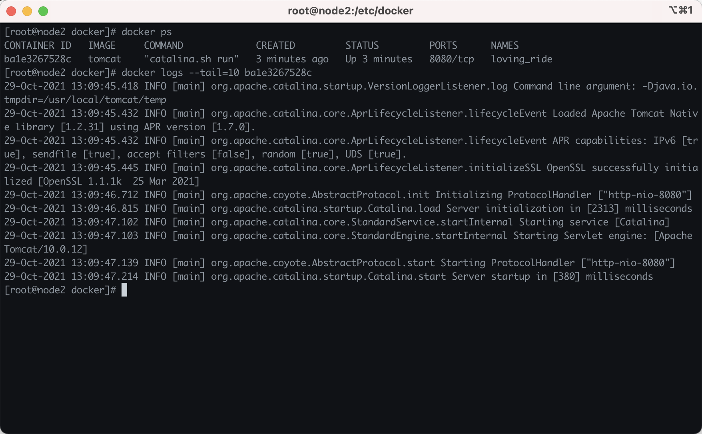

### 4.7 查看容器进程

docker top 容器ID/容器名

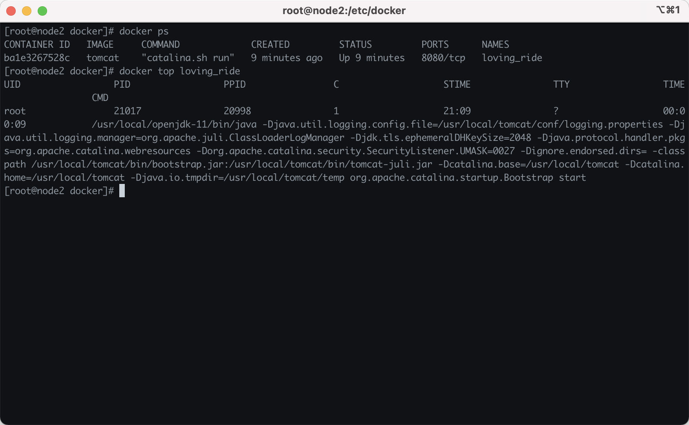

### 4.8 查看容器信息

docker inspect 容器ID/容器名

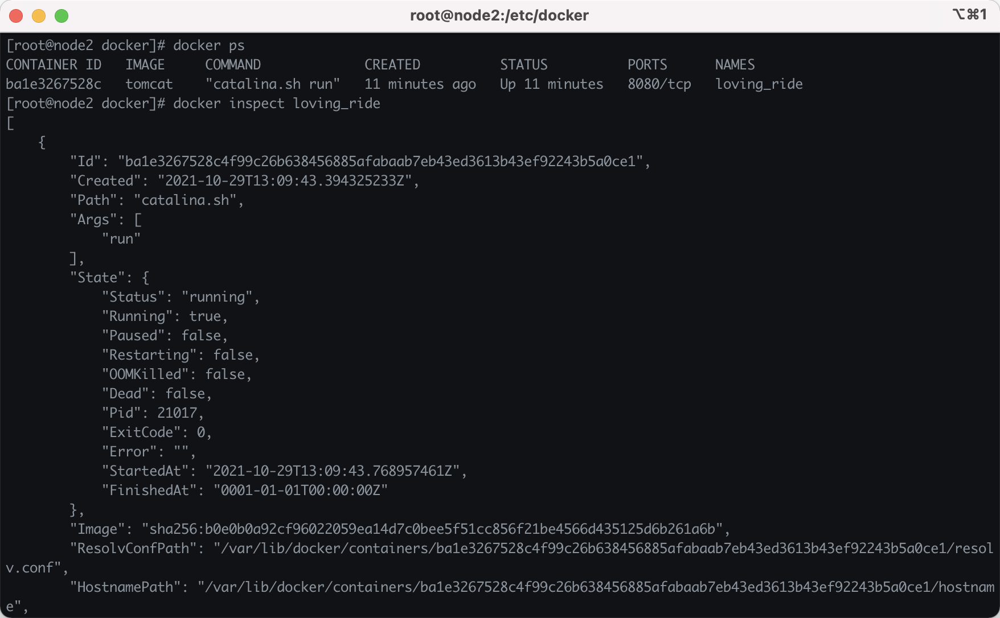

### 4.9 主机和容器之间数据复制

①、将容器中的文件copy至本地路径

docker cp 容器ID/容器名:/[container_path] [local_path]

②、将主机文件copy至容器

docker cp [local_path] 容器ID/容器名:/[container_path]

③、将主机文件copy至容器，目录重命名为[container_path]（注意与非重命名copy的区别）

docker cp [local_path] rabbitmq:/[container_path]

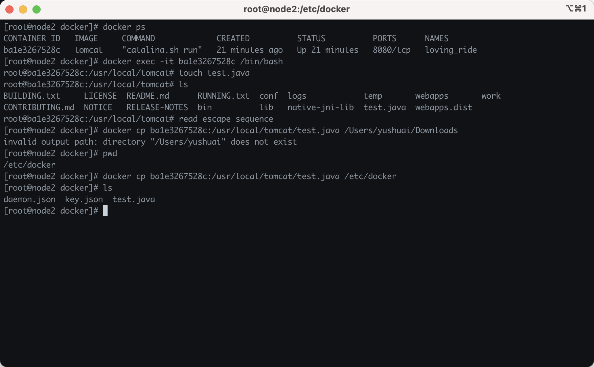

### 5、总结

一图胜千言：

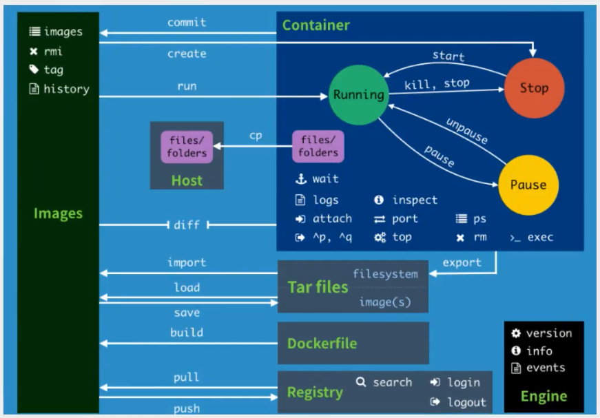

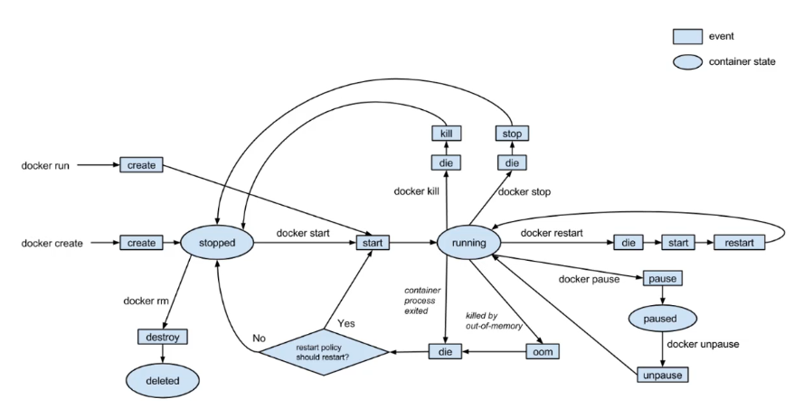