因业务需要所以需要安装 Docker，但是在途中遇到了一些问题。
先提供一下我已经下载好的安装包

链接：[https://pan.baidu.com/s/1wug6gjztGidXCLT8vndS4Q](https://links.jianshu.com/go?to=https%3A%2F%2Fpan.baidu.com%2Fs%2F1wug6gjztGidXCLT8vndS4Q)

提取码：tdzo包含：

1. Docker Desktop Installer
2. DockerToolbox-19.03.1
3. boot2docker.iso

在文章最下面是遇到的两个问题

不是最新版的 windows10 或者 Windows Server 2016，需要借助 [Docker Toolbox](https://links.jianshu.com/go?to=https%3A%2F%2Fdocs.docker.com%2Ftoolbox%2Ftoolbox_install_windows%2F) 来进行安装使用 Docker

前提：Docker 在 window 上需要你的 Cpu 支持虚拟化，怎么查看是否支持或者打开？打开任务管理器，选择性能就可以查看，如图

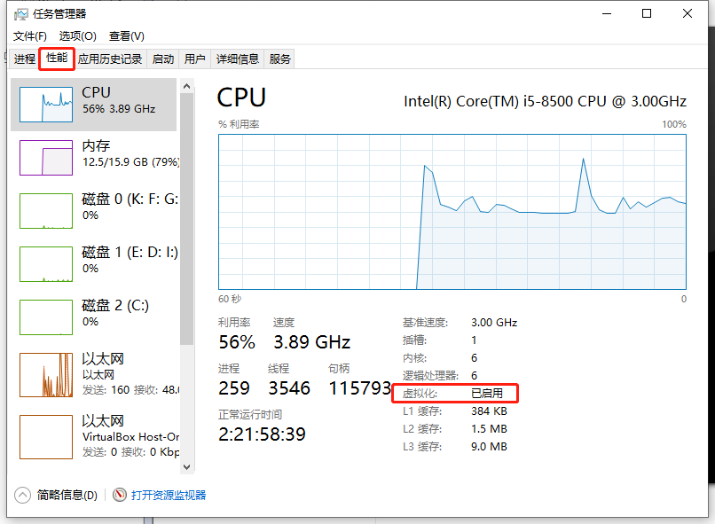

支持虚拟化

### 安装 Docker Toolbox

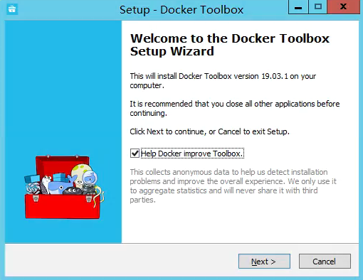

默认选择下一步

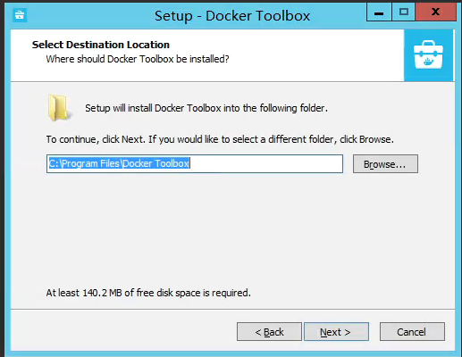

默认选择下一步

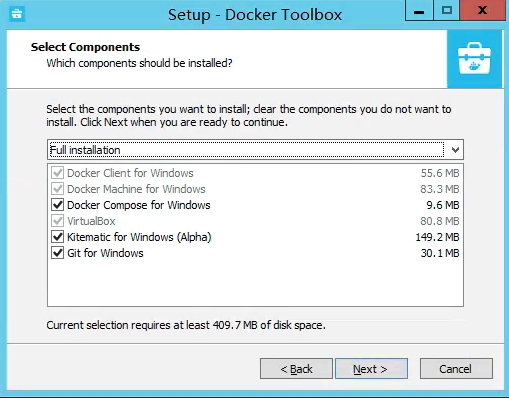

默认选择下一步

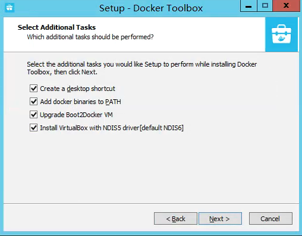

在这里需要选择最下面一个打上勾，因为有可能会装不上

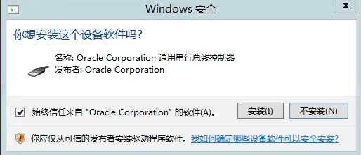

默认点击安装

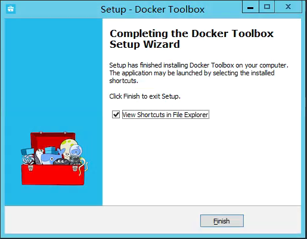

安装完成

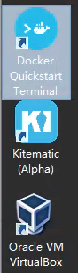

此刻桌面有三个图标

打开桌面上的 Docker Quickstart Terminal

然后就显示了 error one 的错误，查看下面的错误列表，解决后继续打开。后面有可能会出现error two 的错误在次打开就继续等待安装好

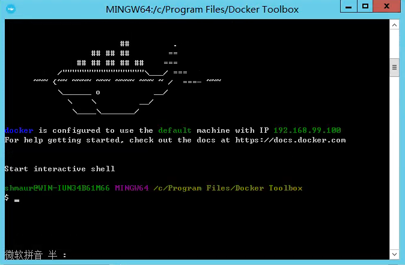

安装完成，与官网一致

测试一下，打开 cmd，输入 docker -v

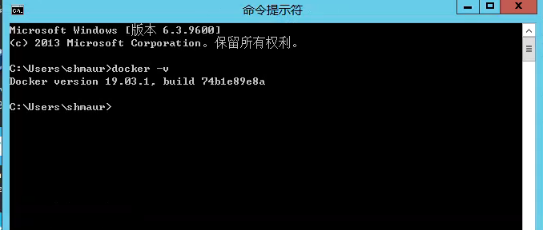

版本显示出来了，成功

在测试一下镜像，运行 hello-world

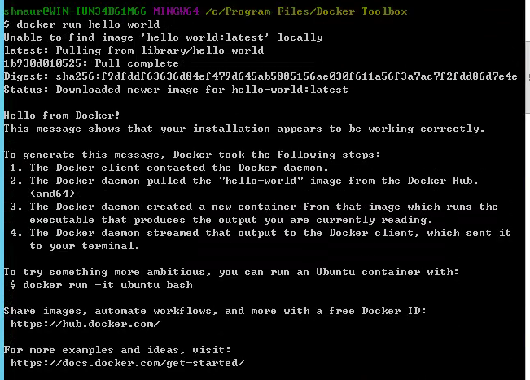

运行 hello-world 镜像成功

### error One：

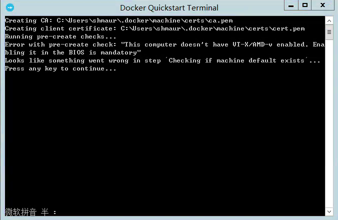

错误显示虚拟化没有打开

因为使用的是虚拟机，这里说一下虚拟机的解决方式，如果是实际服务器，需要打开 BIOS 里面的 cpu 虚拟化，可以自行百度

关闭系统，然后打开配置，打上勾，选择首选模式

### 解决方案

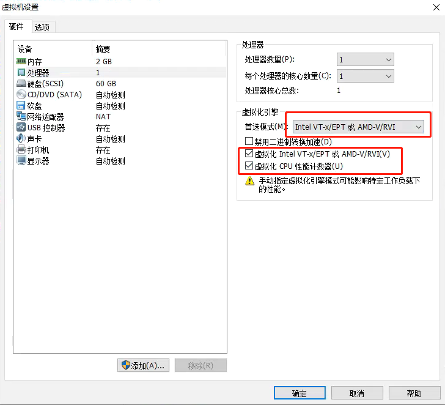

image.png

### error Two：

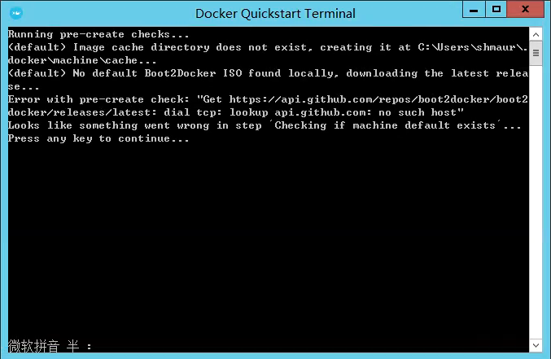

image.png

这个需要下载 boot2docker，在下载的时候出错了，可以去官网去下载，我已经打包好，可以直接进行下载。原因可能因为网络慢最终停止，也可能是被 Q 了。

### 解决方案：

直接去官网下载：[boot2docker.iso](https://links.jianshu.com/go?to=https%3A%2F%2Fgithub.com%2Fboot2docker%2Fboot2docker%2Freleases)

也可以在文章开头下载，会快很多。打开下面的路径：

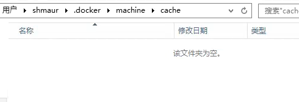

找到这个路径

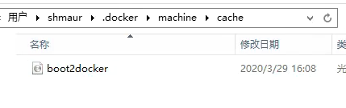

复制进去

![](data:image/svg+xml,%3csvg%20xmlns='http://www.w3.org/2000/svg'%20width='1em'%20height='1em'%20fill='currentColor'%20aria-hidden='true'%20focusable='false'%20class='js-evernote-checked'%20data-evernote-id='456'%3e%3cpath%20d='M728.064%20343.943529c-17.648941-2.891294-23.552-20.239059-26.503529-28.912941V104.026353C701.560471%2046.200471%20654.396235%200%20595.425882%200c-53.007059%200-97.28%2040.478118-106.134588%2089.569882-29.997176%20184.862118-138.541176%20255.457882-217.630118%20280.937412a26.142118%2026.142118%200%200%200-18.130823%2024.877177v560.067764c0%2019.817412%2016.022588%2035.84%2035.84%2035.84h535.973647c56.018824-11.565176%2094.328471-31.804235%20120.892235-86.738823l120.832-416.105412c23.552-75.173647-14.757647-147.395765-100.231529-144.564706h-238.772706z%20m-571.813647%2031.744H76.619294C35.358118%20375.687529%200%20410.383059%200%20450.861176v462.426353c0%2043.369412%2032.406588%2078.004706%2076.619294%2078.004706h79.631059c27.708235%200%2050.115765-22.407529%2050.115765-50.115764V425.863529a50.115765%2050.115765%200%200%200-50.115765-50.115764z'%20data-evernote-id='140'%20class='js-evernote-checked'%3e%3c/path%3e%3c/svg%3e)