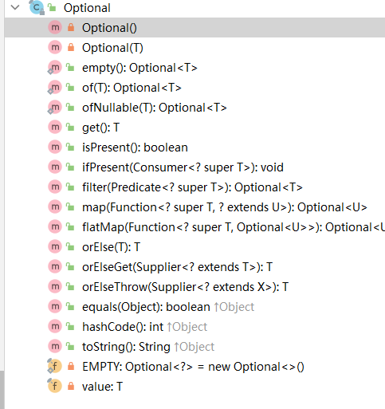

Optional介绍

Optional是jdk8提供的一个新类,希望可以通过该类的引入解决令人烦躁的null判断问题,

API介绍

Optional的所有方法如下图所示,这些API大致可以分为4类:

1. 构建API: 构建一个Optional对象; 方法有: empty(), of(), ofNullable();
2. 获取API: 获取Optional对象里包装的值; 如: get(), orElse(). orElseGet(), orElseThrow();
3. 转换API: 将Optional对象里包装的值转换成一个新的值; 如: map(), flatMap();
4. 判断API: 对Optional对象里包装的值做一些判断; 如: filter(), isPresent(), ifPresent();

API使用方法

首先准备一个pojo类

构建类

获取类

转换类

判断类