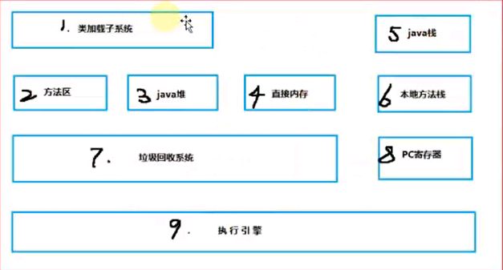
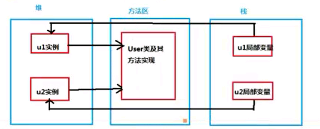
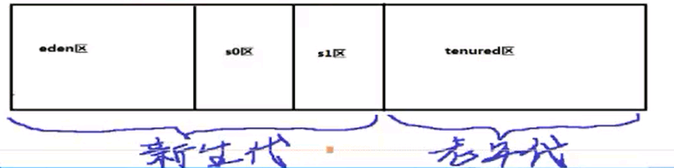

# jvm机理

**jvm虚拟机**

1.java虚拟机概述和基本概念

2.堆、栈、方法区

3.了解虚拟机参数

4.垃圾回收概念和算法、及对象分带转换

5.垃圾收集器

6.tomcat性能影响实验

7.性能监控工具

系统虚拟机和程序虚拟机

VMare属于系统虚拟机

jvm属于程序虚拟机



方法区：就是存放类信息、常量信息、常量池信息、包括字符串字面量和数字常量等。

**java堆**：在java虚拟机启动的时候建立java堆，他是java程序最主要的内存工作区域，几乎所有的对象实例都存放到java堆中，

```text
堆空间是所有线程共享的
```

堆解决的是数据存储的问题，即数据怎么放，放在哪儿

栈解决的是程序的运行问题，即程序如何执行，或者说如何处理数据

方法区是辅助堆栈的块永久区（perm），解决堆栈信息的产生，是先决条件

当我们创建一个User对象时：那么User类得信息（类信息、静态信息都存放于方法区中）

```text
而当user类被实例化出来之后，被存储到java堆中，占用一块内存空间

当我们去使用的时候，都是使用的User对象的引用：User user = new User（）；

User类在java堆中，而user在java栈中，即User真实对象的一个引用。
```



java堆完全是自动化管理的，通过垃圾回收机制，垃圾对象会自动清理，不需要显示释放

根据垃圾回收机制不同，java堆有可能拥有不同的结构，最为常见的就是将整个java堆分为新生代和老年代。

其中新生代存放新生的对象，老年代则存放老年对象。

新生代与老年代的划分：通过**GC的回收次数**来划分（默认为15次）

新生代分为eden区、s0区、s1区，s0和s1区也成为from和to区域，他们是两块大小相等并且可以互换角色的空间

（数据刚实例化的时候，都存放在eden区域）

在使用时，s0和s1只能使用其中一块

绝大多数情况下，对象首先分配在eden区，在一次新生代回收后，如果对象还活着，则会进入s0活着s1区域，之后没经过一次新生代回收，如果对象

存活则他的年龄加1，当对象达到一定年龄后（阀值），则进入老年代

复制算法：其核心思想就是将内存分为两块，每次只是用其中一块，在垃圾回收时，将正在使用的 一块内存中的存留的对象复制到未使用的内存块中去，

之后去清除之前正在使用的内存块中的所有对象，反复去交换两个内存的角色，完成垃圾收集。

（java堆中新生代的from和to（s0和s1）空间就是使用的这个算法）



**java栈**：

java栈是一块线程私有的内存空间，一个栈，一般由三部分组成，局部变量、操作数栈和帧数据区

局部变量表：用于报错函数的参数及局部变量

操作数栈：主要保存计算过程中的中间结果，同时作为计算过程中变量临时的存储空间

帧数据区：除了局部变量表和操作数栈以外，栈还需要一些数据来支持常量池的解析，这里帧数据区保存着访问常量池的指针，方便程序访问常量池，另外，当函数返回活着出现异常时，

```text
虚拟机必须有一个异常处理表，方便发送异常的时候找到异常的代码，因此异常梳理表也是帧数据区的一部分
```

java方法区：

java方法区和堆一c样：方法区是一块所有线程共享的内存区域，它保存系统的类信息，比如类的字段、方法、常量池等。方法区的大小决定了系统可以保存多少个类，如果系统定义太多的类，

```text
                             导致方法区溢出。虚拟机同样会抛出内存溢出错误。方法区可以理解为永久区（perm）
```

虚拟机参数：

主要围绕堆栈方法区进行配置

垃圾收集器可以选择不同的回收机制

堆分配参数：
