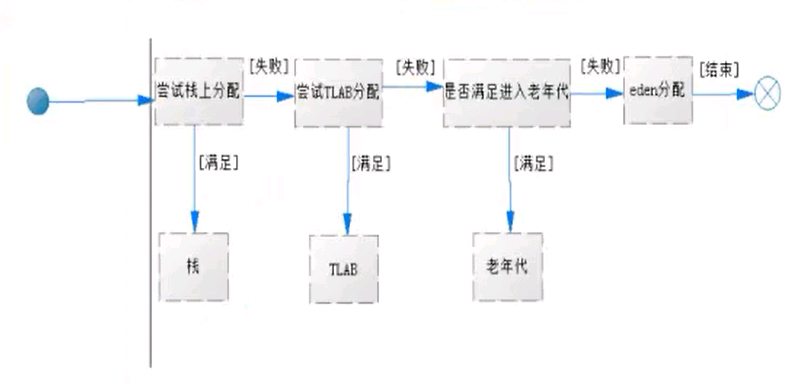

# 垃圾回收机制

**垃圾回收**：指存于内存中、不会再被使用的对象，而回收就是清除这些失去引用的对象等。

垃圾回收有很多种算法：引用计数法、**标记压缩法**、**复制算法**、**分代、分区的思想**。

引用计数法：核心就是在对象被其他所引用时计数加1，而当引用失效时则减1.但是这种方式有非常严重的问题

无法计数循环引用的情况、还有就是每次进行加减操作比较消耗系统性能

标记清除法：就是分为标记和清除两个阶段进行处理内存中的对象，当然这种方式也有非常大的弊端，

就是空间碎片的问题，垃圾回收后的空间不是连续的，不连续的内存空间的工作效率要低于连续的内存空间

**复制算法**：其核心思想就是见内存空间分为两块，每次只是用其中一块，在垃圾回收时，将正在使用的内存中的存留

对象复制到未被使用的内存块中去，之后去清除之前正在使用的内存块中所有的对象，反复去交换两个内存的角色，完

成垃圾收集（java中新生代的from和to空间就是使用的这个算法）

**标记压缩法**：标记压缩法在标记清除的基础之上做了优化，把存活的对象压缩到内存一端，而后进行垃圾清理。

（java中老年代使用的就是标记压缩法）

**为什么新生代和老年代使用不同的算法？？**

新生代中对象更新十分频繁，对象的存在并不稳定，对象回收较频繁，回收率很高。

老年代中对象变动较小，GC次数相较于新生代少很多，（回收的可能性要小很多）标记压缩法更适用该场景

通过不同的算法提升GC的性能

分代算法：就是根据对象的特点把内存分成N块，而后根据每个内存的特点使用不同的算法。

对于新生代和老年代来说，新生代回收频率很高，但是每次回收耗时都很短，而老年代回收频率较低，

但是耗时会相对较长，所以应该尽量减少老年代的GC

分区算法：其主要就是将整个内存分为N多个小的独立的空间，每个小空间都可以独立使用，这样细粒度的控制一次回收

多少个小空间和哪些个小空间，而不是对整个空间进行GC，从而提升性能，并减少GC的**停顿时间**。

垃圾回收时的**停顿现象**：

为了让垃圾回收器可以高效的执行，大部分情况下，会要求系统 进入一个停顿的状态，停顿的目的是终止所有应用线程，只有这样系统才不会有新的垃圾产生，

同时停顿保证了系统状态在某一个瞬间的一致性，也有益于更好的标记垃圾对象，因此在垃圾回收时，都会产生应用程序的停顿。

对象如何进入老年代

一般情况，首次创建的对象会被放置在新生代的eden区，如果没有GC介入，则对象不会离开eden区；

那么对象如何进入老年代呢？

一般来讲，只要对象的年龄达到一定的大小，就会自动离开年轻代进入老年代，对象年龄是由对象经历数次GC决定的，在新生代每次GC之后，

如果对象没有被回收则年龄加1，jvm提供了一个参数来控制新生代对象的最大年龄，当超过这个年龄就会自动晋升老年代。

- XX:MaxTenuringThreshold，默认情况下为15

另外，大对象（新生代eden区无法装入时，也会直接进入老年代）。JVM里有个参数可以设置对象的大小超过在指定的大小之后，直接晋升老年代

- XX:PretenureSizeThreshold

可通过这个参数设置直接晋升老年代对象的大小。

虚拟机对于体积不大的对象，会优先把数据分配到TLAB区域中，因此会失去了在老年代分配的机会

- XX:-UseTLAB （禁用TLAB区域）

TLAB：Thread Local Allocation Buffer 即线程本地分配缓存

从名字看是一个线程专用的内存分配区域，是为了加速对象的分配而生的，为了让线程更快的执行。

每一个线程都会产生一个TLAB，该线程独享的工作区域，java虚拟机使用这种TLAB区来避免多线程冲突问题，提高了对象分配的效率。TLAB空间一般不会太大，当大对象无法再TLAB分配时，则会直接分配到堆上。

- XX:+UseTLAB 使用TLAB
- XX:+TLABSize 设置TLAB大小
- XX:TLABRefillWasteFraction 设置维护进入TLAB空间的单个对象大小，他是一个比例值，默认为64，即如果对象大于整个空间的1/64，

则在堆创建对象

- XX:+PrintTLAB 查看TLAB信息
- XX:ResizeTLAB 自调整TLABRefillWasteFraction 阀值

对象创建内存分配的流程

