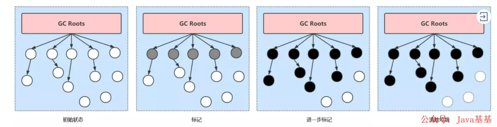

# JVM中的三色标记法

三色标记法是一种垃圾回收法,它可以让JVM不发生或仅短时间发生STW, 从而达到清除JVM内存垃圾的目的. JVM中的CMS, G1垃圾回收器所使用的垃圾回收算法即为三色标记法.

# 算法思想

三色标记法将对象的颜色分为了黑, 灰, 白 三种颜色

**白色**: 该对象没有被标记过(垃圾对象)

**灰色**: 该对象已经被标记过了, 但该对象下的属性没有全被标记完. (GC需要从此对象中去寻找垃圾)

**黑色**: 该对象已经被标记过了, 且该对象下的属性也全部都被标记过了. (程序所需要的对象)

# 算法流程

从我们main方法的根对象(JVM中称为GC Root) 开始沿着他们的对象向下查找, 用黑灰白的规则, 标记出所有跟GC Root相连接的对象, 扫描一遍结束后, 一般需要进行一次短暂的STW, 再次进行扫描, 此时因为黑色对象的属性也都已经被标记过了,所以, 只需要找出灰色对象并沿着继续往下标记, 此时程序继续执行, GC线程扫描所有的内存, 找出扫描之后依旧被标记为白色的对象(垃圾), 清除

具体流程:

1. 首先创建三个集合: 黑 白 灰
2. 将所有对象放入白色集合中
3. 然后从根节点开始遍历所有对象(这里并不是递归遍历), 把遍历到的对象从白色集合放入灰色集合.
4. 之后遍历灰色集合, 将灰色对象引用的对象从白色集合放入灰色集合, 之后将此灰色对象放入黑色集合
5. 重复4知道灰色中无任何对象
6. 通过write-barrier检测对象有变化, 重复以上操作
7. 收集所有白色对象(垃圾)

# 三色标记法存在的问题

8. 浮动垃圾: 并发标记的过程中, 若一个已经被标记成黑色或灰色的对象, 突然变成了垃圾, 由于不会再对黑色标记过的对象重新扫描, 所以不会被发现, 那么这个对象不是白色的但是不会被清除, 重新标记也不能从GC Root中去找到, 所以成为了浮动垃圾,
浮动垃圾对系统的影响不大, 留给下一次GC进行处理即可
9. 对象漏标问题(需要的对象被回收): 并发标记的过程中, 一个业务线程将一个未被扫描过的白色对象断开引用成为垃圾(删除引用), 同时黑色对象引用了该对象(增加引用)(这两步不分先后顺序); 因为黑色对象的含义为其属性都已经被标记过了, 重新标记也不会从黑色对象中去找, 导致该对象被程序所需要, 却又要被GC回收, 此问题会导致系统出现问题, 而CMS与G1两种回收器在使用三色标记法时, 都采取了一定的措施来应对这些问题, **CMS对增加引用环节进行处理(Increment Update), G1则对删除引用环节进行处理(SATB)**

# 解决办法

## CMS的处理方式:增量更新

在应对漏标问题时, CMS使用了增量更新来应对

在一个未被标记的对象被重新饮用后, **引用它的对象若为黑色则要变成灰色, 在下次二次标记时让GC线程继续标记它的属性对象**.

但就算这样, 它仍然存在漏标问题:

- 在一个灰色对象正在被一个GC线程回收时, 当它已经被标记过的属性指向一个白色对象
- 而这个对象的属性对象本身还未全部标记结束, 则为灰色不变
- **而这个GC线程在标记完最后一个属性后, 认为已经将所有的属性标记结束了, 将这个灰色对象标记为黑色, 被重新引用的白色对象, 无法被标记**

### CMS的另两个致命缺陷

10. CMS采用 算法, 最后会产生许多内存碎片, 当达到一定数量时, CMS无法清理这些碎片了, CMS会让垃圾处理器来清理这些垃圾碎片, 而垃圾处理器是单线程操作进行清理垃圾的, 效率很低.
mark-swap
Serial Old
Serial Old

所以使用CMS就会出现一种情况, 硬件升级了, 却越来越卡顿, 其原因就是因为进行 Serial Old GC 时, 效率过低

解决方案: 使用Mark-Sweep-Compact算法,减少垃圾碎片

调优参数

- XX:+UseCMSCompactAtFullCollection 开启CMS的压缩 -XX:CMSFullGCsBeforeCompaction 默认为0，指经过多少次CMS FullGC才进行压缩

当JVM认为内存不够, 再使用CMS进行并发清理内存可能会发生OOM的问题, 而不得不进行 Serial Old GC, Serial Old时单线程垃圾回收, 效率低下

解决方案: 降低触发 CMS GC的阈值, 让浮动垃圾不那么容易占满老年代

调优参数:

- XX:CMSInitiatingOccupancyFraction 92% 可以降低这个值，让老年代占用率达到该值就进行CMS GC

## G1解决办法:SATB

SATB(Snapshot At the Beginning), 在对应漏标问题时, G1使用了SATB方法来做, 具体流程:

11. 在开始标记的时候生成一个快照标记存活对象
12. 在一个引用断开后, 要将此引用推到GC的堆栈里, 保证白色对象(垃圾)还能被GC线程扫描到(在 **write barrier(写屏障)**里把所有的旧的引用指向的对象都变成飞白的)
13. 配合 , 去扫描哪些Region引用到当前的白色对象, 若没有引用到当前对象, 则回收
Rset

### SATB详细 流程

14. SATB是维持并发GC的一种手段. G1并发的基础就是SATB. SATB可以理解成在GC开始之前对堆内存里的对象做一次快照, 此时活的对象就认为是活的, 从而开成一个对象图.
15. 在GC收集的时候, 新生代的对象也认为是活着的对象, 除此之外其他不可达的对象都认为是垃圾对象.
16. 如何找到在GC过程中分配的对象呢? 每个region 记录着两个top-at-mark-start(TAMS)指针, 分别为prevTAMS和nextTAMS. 在TAMS以上的对象就是新分配的, 因而被视为隐式marked.
17. 通过这种方式我们就找到了在GC过程中新分配的对象, 并把这些对象认为是活的对象
18. 解决了对象在GC过程中分配的问题, 那么在GC过程中引用发生变化的问题怎么解决呢
19. G1给出的解决办法是通过Write Barrier. Write Barrier就是对引用字段进行赋值做了额外处理. 通过Write Barrier就可以了解到哪些引用对象发生了什么样的变化
20. mark的过程就是遍历heap标记live object的过程，采用的是三色标记算法，这三种颜色为white（表示还未访问到）、gray（访问到但是它用到的引用还没有完全扫描）、back（访问到而且其用到的引用已经完全扫描完）
21. 整个三色标记算法就是从 GC roots 出发遍历heap，针对可达对象先标记white为gray，然后再标记gray为black；遍历完成之后所有可达对象都是balck的，所有white都是可以回收的
22. SATB仅仅对于在marking开始阶段进行“snapshot”(marked all reachable at mark start)，但是concurrent的时候并发修改可能造成对象漏标记
23. 对black新引用了一个white对象，然后又从gray对象中删除了对该white对象的引用，这样会造成了该white对象漏标记
24. 对black新引用了一个white对象，然后从gray对象删了一个引用该white对象的white对象，这样也会造成了该white对象漏标记
25. 对black新引用了一个刚new出来的white对象，没有其他gray对象引用该white对象，这样也会造成了该white对象漏标记

### SATB效率高于增量更新的原因？

因为SATB在重新标记环节只需要去重新扫描那些被推到堆栈中的引用，并配合Rset 来判断当前对象是否被引用来进行回收；

并且在最后G1并不会选择回收所有垃圾对象，而是根据Region的垃圾多少来判断与预估回收价值（指回收的垃圾与回收的STW时间的一个预估值），将一个或者多个Region放到CSet中，最后将这些Region中的存活对象压缩并复制到新的Region中，清空原来的Region

### G1会不会进行Full GC?

会，当内存满了的时候就会进行Full GC；且JDK10之前的Full GC，为单线程的，所以使用G1需要避免Full GC的产生。

**解决方案：**

- 加大内存；
- 提高CPU性能，加快GC回收速度，而对象增加速度赶不上回收速度，则Full GC可以避免；
- 降低进行Mixed GC触发的阈值，让Mixed GC提早发生（默认45%）