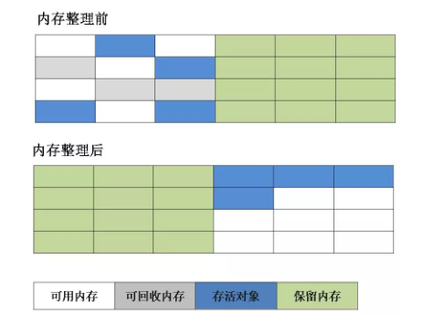
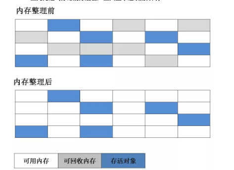
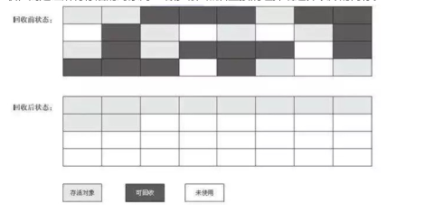
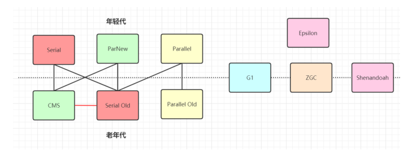
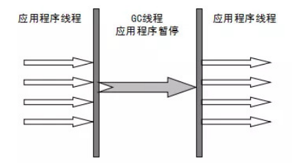
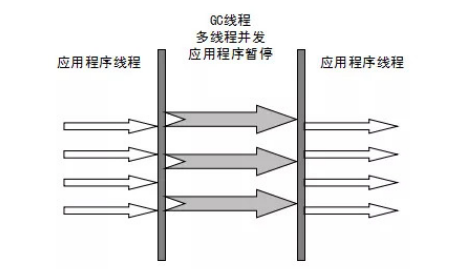

# 垃圾收集算法

**垃圾收集算法**

垃圾收集算法

- 分代收集理论
- 复制算法
- 标记整理算法
- 标记清楚算法

**分代收集理论**

根据对象存活周期的不同将内存分为几块，一般将java分为新生代和老年代，这样就可以根据各个年代的特点选择合适的垃圾收集算法。

- 新生代 - 一般新生代中的对象存货周期很小吗，每次收集都会有大量的对象死去，所以选择复制算法，只需要付出少量对象的复制成本就可以完成每次垃圾收集
- 老年代 - 老年代中的对象存活几率是比较高的，而且没有额外的空间对它进行分配担保，所以我们必须选择“标记-清除”和“标记-整理”算法，进行垃圾收集，
注意“标记-清除”和“标记-整理”算法会比复制算法慢10倍以上。

标记复制算法(mark-copy)

核心思想：

将内存分为大小相同的两块，每次使用其中的一块，当这一块的内存使用完后，就将还存活的对象复制到另一块去，然后再把使用的空间一次清理掉。这样就使每次的内存回收都是对内存区间的一半进行回收

标记-清楚算法

该算法分为“标记”和“清楚”阶段：标记存活的对象，统一回收所有未被标记的对象（一般选择这种）；

也可以反过来，标记出所有需要回收的对象，在标记完成后统一回收所有被标记的对象。它是最基础的收集算法，比较简单，

但会带来两个明显的问题：

1. 效率问题：如果需要标记的对象太多，效率不高
2. 空间问题：标记清除后，会产生大量不连续的碎片

标记-整理算法

标记过程仍然与“标记-清除”算法一样，但后续步骤不是直接对可回收对象回收，而是让所有存活的对象向一端移动，然后直接清理掉端边界以外的内存。

---

**垃圾收集器**

**如果说收集算法是内存回收的方法论，那么垃圾收集器就是内存回收的具体实现。**

虽然我们对各个收集器进行比较，但并非为了挑选出一个最好的收集器。因为直到现在为止还没有最好的垃圾收集器出现，更加没有万能的垃圾收集器，**我们能做的就是根据具体应用场景选择适合自己的垃圾收集器**。

1.串行收集器（Serial收集器）（-XX:+UseSerialGC -XX:+UseSerialOldGC）

Serial（串行）收集器是最基本、历史最悠久的垃圾收集器了。这是一个单线程的垃圾收集器。

它的“**单线程**”的意义不仅仅意味着它只会使用一条垃圾收集线程去完成垃圾收集工作，更重要的是它在进行垃圾收集工作的时候必须暂停其他所有的工作线程（“**Stop The World**”），直到它收集结束。

**新生代采用复制算法，老年代采用标记-整理算法。**

虚拟机的设计者们当然知道Stop The World带来的不良用户体验，所以在后续的垃圾收集器设计中停顿时间在不断缩短（**不是消除**，仍然还有停顿，寻找最优秀的垃圾收集器的过程仍然在继续）

但是Serial收集器同样有优于其他垃圾收集器的地方

与其他收集器的单线程相比，它简单而高效。Serial收集器由于没有线程交互的开销，所以可以获得很高的单线程手机效率

Serial Old收集器是Serial收集器的老年代版本，它同样是一个单线程收集器

主要有两大用途：

- 在JDK1.5及以前的版本中与Parallel Scavenge 收集器搭配使用
- **作为CMS收集器的后备方案**

2.Parallel Scavenge收集器（-XX:+UseParallelGC(年轻代), -XX:+UseParallelOldGC(老年代)）

**Parallel收集器其实就是Serial收集器的多线程版本**，除了使用多线程进行垃圾收集外，其余行为（控制参数、收集算法、回收策略等等）和Serial收集器类似。默认的收集线程数跟cpu核数相同，同样也可以用参数（-XX：ParallelGCThreads）指定收集线程数，但是一般一般不推荐修改

**Parallel Scavenge收集器关注点是吞吐量（高效率的利用CPU）。CMS等垃圾收集器的关注点更多的是用户线程的停顿时间（提高用户体验）。**

**所谓吞吐量就是CPU中用于运行用户代码的时间与CPU总消耗时间的比值。**

Scavenge收集器提供了很多参数供用户找到最合适的停顿时间或最大吞吐量，如果对于收集器运作不太了解的话，可以

选择把内存管理优化交给虚拟机去完成也是一个不错的选择。

新生代采用复制算法，老年代采用标记-整理算法。

**Parallel Old收集器是Parallel Scavenge收集器的老年代版本**。使用多线程和“标记-整理”算法。在注重吞吐量以及

CPU资源的场合，都可以优先考虑 Parallel Scavenge收集器和Parallel Old收集器(JDK8默认的新生代和老年代收集

器)