## **1**、什么是TCP网络分层

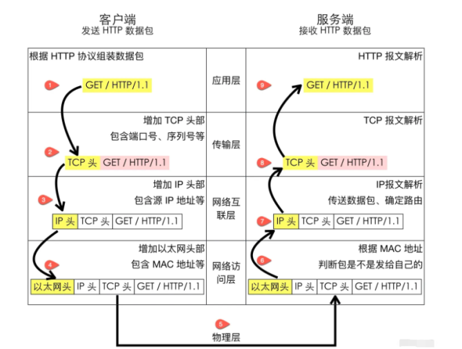

### 应用层

应用程序之间如何相互传递报文，比如HTTP协议

### 传输层

传输层的作用是为两台主机之间的“应用进程”提供端到端的逻辑通信，比如TCP协议

### 网络互连层

网络互连层提供了主机到主机的通信，将传输层产生的的数据包封装成分组数据包发送到目标主机，并提供路由选择的能力。

IP协议是网络层的主要协议，TCP和UDP都是用IP协议作为网络层协议。这一层的主要作用是给包加上源地址和目标地址，将数据包传送到目标地址。

### 网络访问层

网络访问层也有说法叫做网络接口层，以太网、Wifi、蓝牙工作在这一层，网络访问层提供了主机连接

到物理网络需要的硬件和相关的协议

### **分层的好处**

- **各层独立**：限制了依赖关系的范围，各层之间使用标准化的接口，各层不需要知道上下层是如何工作的，增加或者修改一个应用层协议不会影响传输层协议
- **灵活性更好**：比如路由器不需要应用层和传输层，分层以后路由器就可以只用加载更少的几个协议层
- **易于测试和维护**：提高了可测试性，可以独立的测试特定层，某一层有了更好的实现可以整体替换掉
- **能促进标准化**：每一层职责清楚，方便进行标准化

## **2**、TCP的三次握手中为什么是三次？为什么不是两次、四次？

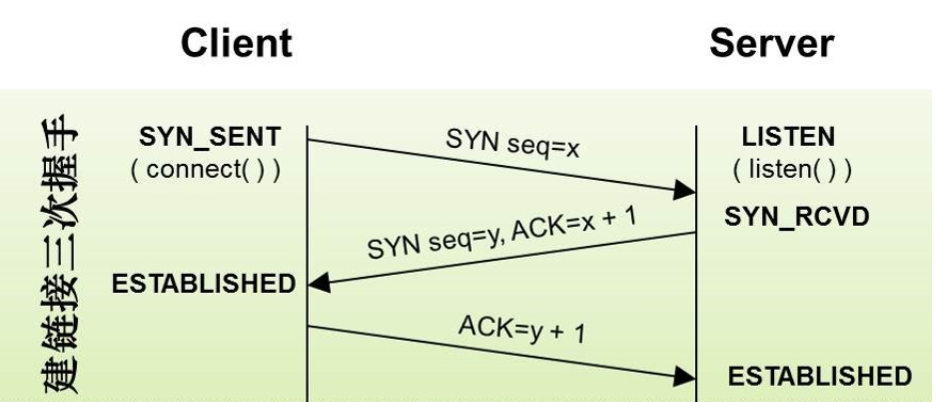

## **3**、TCP的四次挥手为什么是四次？为什么不能是三次？

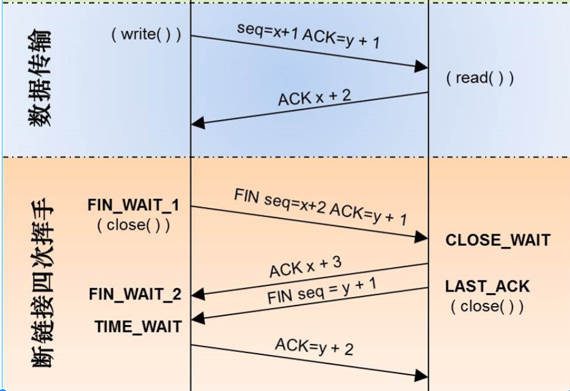

## **4**、为什么SYN/FIN不包含数据却要消耗一个序列号？

凡是需要对端确认的，一定消耗TCP报文的序列号。

SYN和FIN需要对端的确认,所以需要消耗一个序列号。

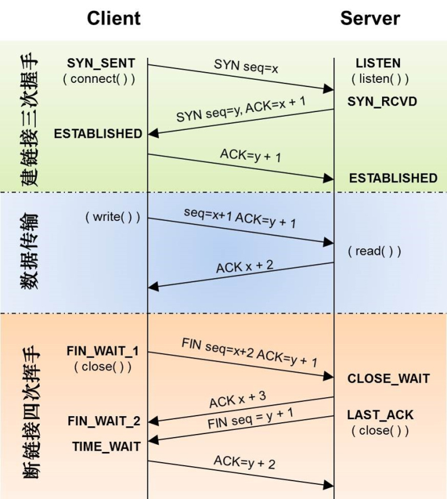

## **5**、什么是半连接队列？什么是SYNFlood攻击？

客户端大量伪造IP发送SYN包，服务端回复的ACK+SYN去到了一个「未知」的IP地址，势必会造成服务端大量的连接处于SYN_RCVD状态，而服务器的半连接队列大小也是有限的，如果半连接队列满，也会出现无法处理正常请求的情况。

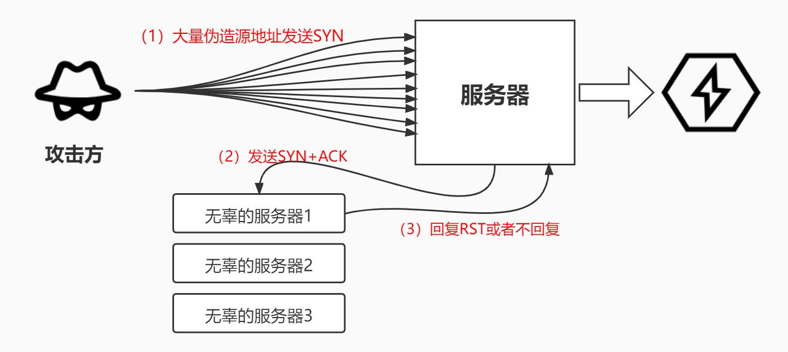

## **6**、说说TCP快速打开(TFO)的原理！

TCP快速打开（TCPFastOpen，TFO）

TFO是在原来TCP协议上的扩展协议，它的主要原理就在发送第一个SYN包的时候就开始传数据了，不过它要求当前客户端之前已经完成过「正常」的三次握手。

快速打开分两个阶段：请求FastOpenCookie和真正开始TCPFastOpen

### FastOpenCookie

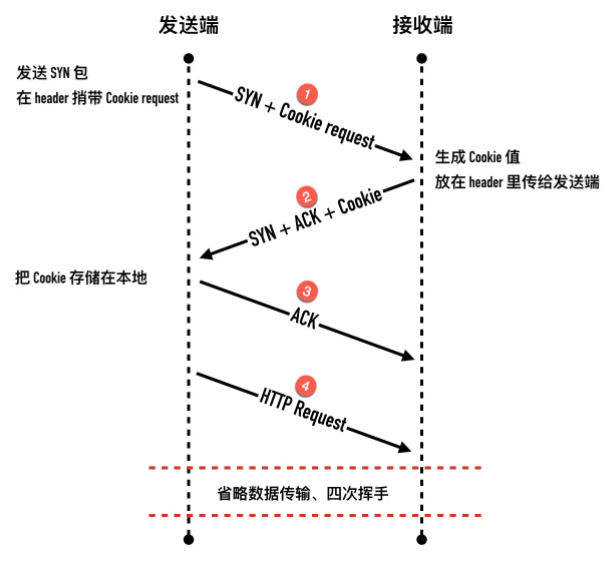

### TCPFastOpen

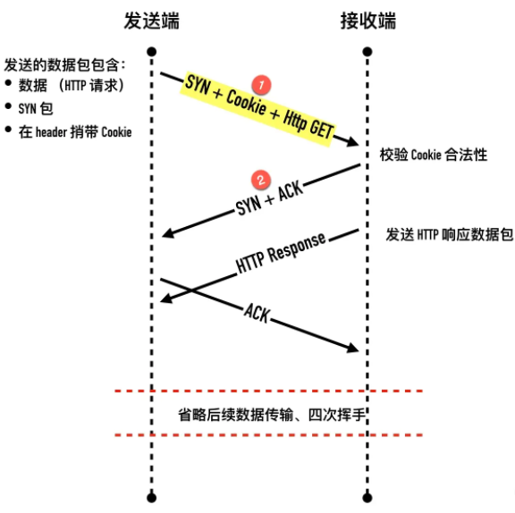

### TCPFastOpen的优势

一个最显著的优点是可以利用握手去除一个往返RTT

可以防止SYN-Flood攻击之类的

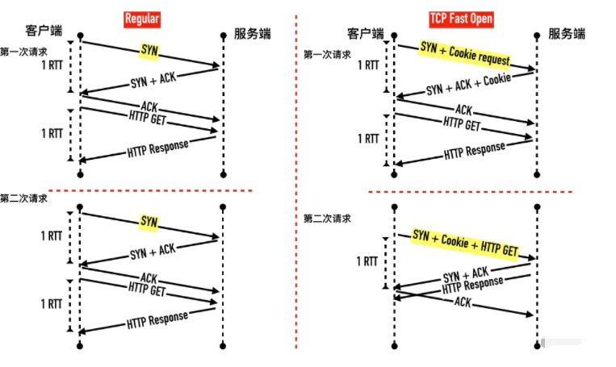

## **7**、TCP报文中的时间戳有什么作用？

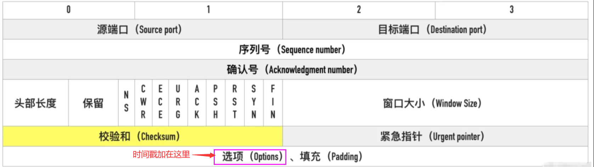

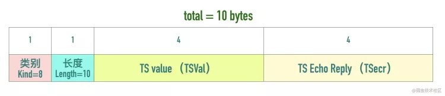

TCPTimestampsOption由四部分构成：

类别（kind）、长度（Length）、发送方时间戳（TSvalue）、回显时间戳（TSEchoReply）

### TCP的时间戳主要解决两大问题:

**计算往返时延RTT(Round-TripTime)**

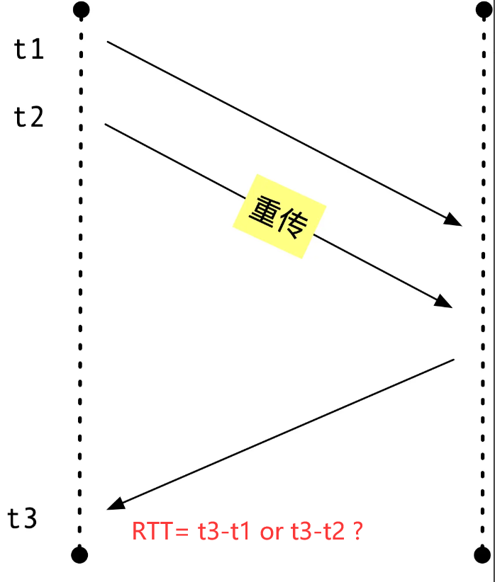

在启用Timestamps选项以后，因为ACK包里包含了TSval和TSecr，这样无论是正常确认包，还是重传确认包，都可以通过这两个值计算出RTT。

**防止序列号的回绕问题**

TCP的序列号用 32bit来表示，因此在 2^32 字节的数据传输后序列号就会溢出回绕。TCP的窗口经过

窗口缩放可以最高到 1GB（2^30)，在高速网络中，序列号在很短的时间内就会被重复使用。

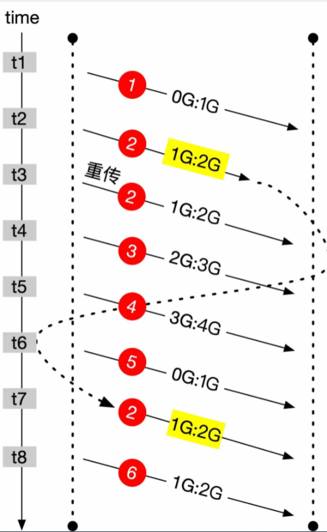

假设发送了 6 个数据包，每个数据包的大小为 1GB，第 5 个包序列号发生回绕。

第 2 个包因为某些原因延迟导致重传，但没有丢失到时间t7 才到达。

这个迷途数据包与后面要发送的第 6 个包序列号完全相同，如果没有一些措施进行区分，将会造成数据的紊乱。

有Timestamps的存在，迷途数据包与第 6 个包可以区分。

## **8**、TCP的超时重传时间是如何计算的？

TCP具有超时重传机制，即间隔一段时间没有等到数据包的回复时，重传这个数据包。

这个重传间隔也叫做超时重传时间(RetransmissionTimeOut,简称RTO)

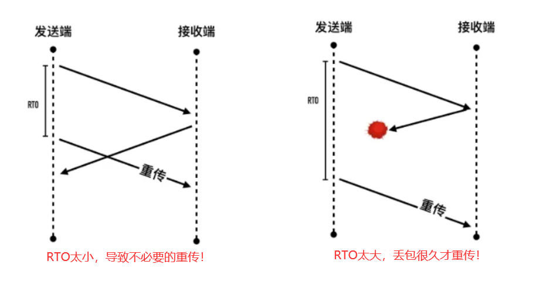

### 经典方法（适用RTT波动较小的情况）

往返时延RTT(Round-TripTime)

一个最简单的想法就是取平均值，比如第一次RTT为 500ms，第二次RTT为 800ms，那么第三次发送时，各让一步取平均值RTO为 650ms。

经典算法引入了「平滑往返时间」（Smoothedroundtriptime，SRTT）：经过平滑后的RTT的值，每测量一次RTT就对SRTT作一次更新计算。

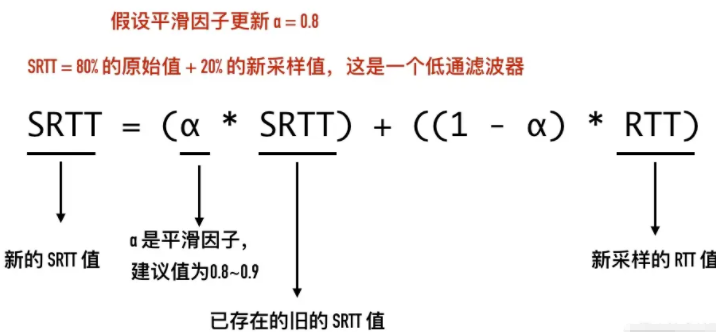

α是平滑因子，建议值是0.8 ~ 0.9

假设平滑因子α= 0.8

SRTT= 80%的原始值+ 20%的新采样RTT值

当α趋近于 1 时：SRTT越接近上一次的SRTT值，与新的RTT值的关系越小，表现出来就是对短暂的时延变化越不敏感。

当α趋近于 0 时，1 -α趋近于 1，SRTT越接近新采样的RTT值，与旧的SRTT值关系越小，表现出来就是对时延变化更敏感，能够更快速的跟随时延的变化而变化

## **9**、能不能说一说TCP的流量控制？

对于发送端和接收端而言，TCP需要把发送的数据放到发送缓存区,将接收的数据放到接收缓存区。而流量控制要做的事情，就是在通过接收缓存区的大小，控制发送端的发送。如果对方的接收缓存区满了，就不能再继续发送了。

为了控制发送端的速率，接收端会告知客户端自己接收窗口（rwnd），也就是接收缓冲区中空闲的部分。

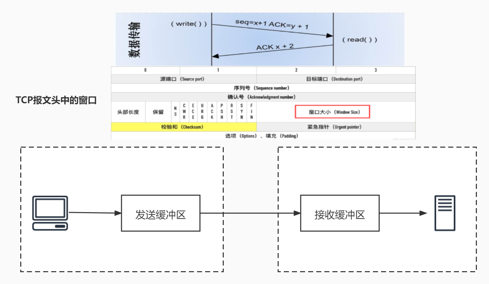

### 接收窗口（接收缓冲区中空闲的部分）

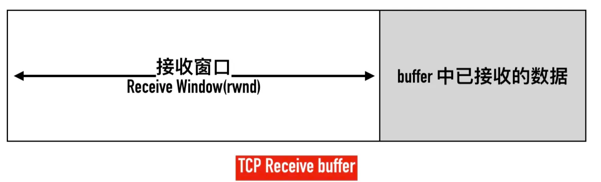

**发送端的数据包的状态**

- 已发送且已确认
- 已发送但未确认
- 未发送但接收端可以接收(接收端有空间接收)
- 未发送且不可以发送(接收端没空间接收)

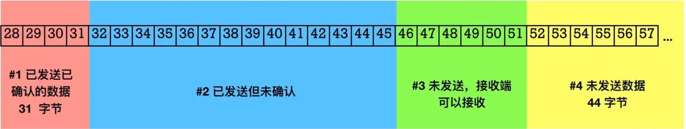

发送端速度比较慢的情况

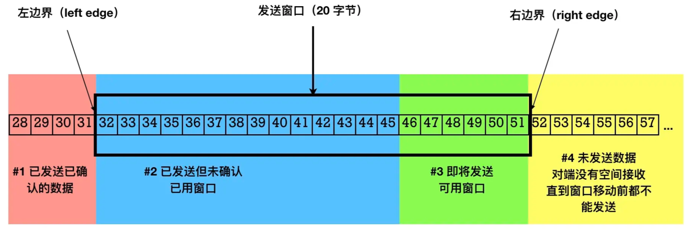

发送端速度比较快的情况

15

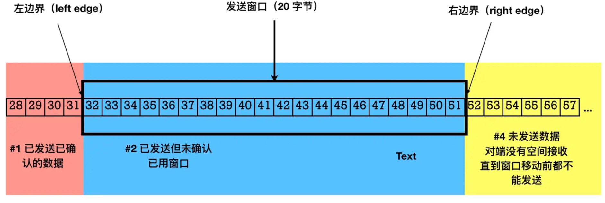

## **10**、如何理解TCP的keep-alive的原理？

一个TCP连接上，如果通信双方都不向对方发送数据，那么TCP连接就不会有任何数据交换。

假设应用程序是一个web服务器，客户端发出三次握手以后故障宕机或被踢掉网线，对于web服务器

而已，下一个数据包将永远无法到来，但是它一无所知。

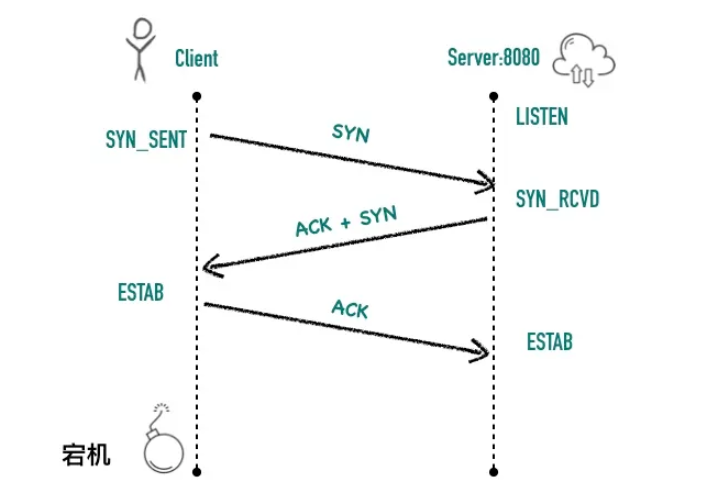

TCP协议的设计者考虑到了这种检测长时间死连接的需求，于是乎设计了keepalive机制。

它的作用就是探测对端的连接有没有失效，通过定时发送探测包来探测连接的对端是否存活，不过默认情况下需要 7200s没有数据包交互才会发送keepalive探测包，往往这个时间太久了，我们熟知的很多组件都没有开启keepalive特性，而是选择在应用层做心跳机制。

## **11**、聊一聊TCP中的端口号

端口号的英文叫Port，英文原意是"港口，口岸"的意思

### 端口号与网络分层

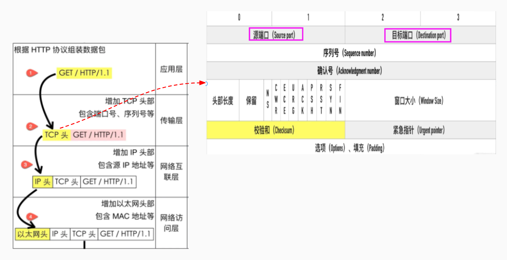

TCP用两字节的整数来表示端口，一台主机最大允许 65536 个端口号的

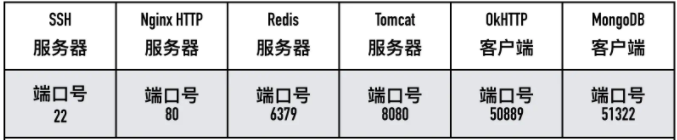

熟知端口号：范围**0**~**1023**

- HTTP：80
- HTTPS：443
- SSH：22

已登记的端口号：范围**1024**~**49151**

- MySQL：3306
- Redis：6379
- MongoDB：27017

临时端口号：范围**49152**～**65535**

## **12**、TCP场景问题**1**

AB两个主机之间建立了一个TCP连接，A主机发给B主机两个TCP报文，大小分别是 **500** 和 **300**，

第一个报文的序列号是 **200**，那么B主机接收两个报文后，返回的确认号是多少？

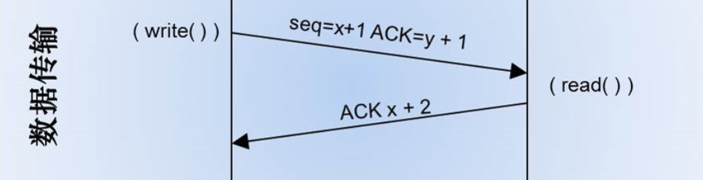

500+300+200

## **13**、TCP场景问题**2**

收到IP数据包解析以后，它怎么知道这个分组应该投递到上层的哪一个协议（UDP或TCP）？

IP头信息

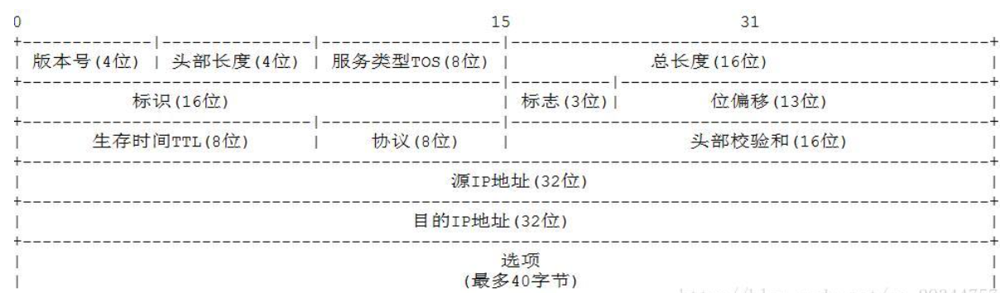

协议:区分IP协议上的上层协议。在Linux系统的/etc/protocols文件中定义了所有上层协议对应的协议字段，ICMP为1，TCP为6，UDP为17

## **14**、TCP场景问题**3**

TCP提供了一种字节流服务，而收发双方都不保持记录的边界，应用程序应该如何提供他们自己的记录标识呢？

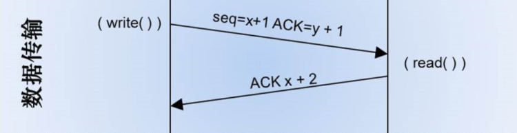

应用程序使用自己约定的规则来表示消息的边界，比如有一些使用回车+换行（"\r\n"），比如Redis的通信协议（RESPprotocol）

## **15**、讲一讲telnet的用法

### 检查端口是否打开

telnet的一个最大作用就是检查一个端口是否处于打开，使用的命令是`telnet[domainnameorip] [port]`，这条命令能告诉我们到远端server指定端口的网连接是否可达。

### telnet发送http请求

执行`telnet www.baidu.com 80`，粘贴下面的文本（注意总共有四行，最后两行为两个空行）

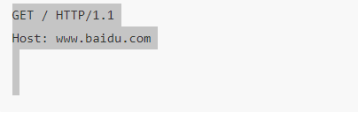

## **16**、讲一讲netstat的用法

netstat命令用于显示各种网络相关信息

**常见参数**

- -a(all)显示所有选项，默认不显示LISTEN相关
- -t(tcp)仅显示tcp相关选项
- -u(udp)仅显示udp相关选项
- -n拒绝显示别名，能显示数字的全部转化成数字。
- -l仅列出有在Listen(监听)的服務状态
- -p显示建立相关链接的程序名
- -r显示路由信息，路由表
- -e显示扩展信息，例如uid等
- -s按各个协议进行统计
- -c每隔一个固定时间，执行该netstat命令

## **17**、讲一讲tcpdump的用法

tcpdump则是一个命令行的网络流量分析工具，功能非常强大,一般我们用来抓TCP的包。

## **18**、讲一讲wireshark的用法

tcpdump，它是命令行程序，对linux服务器比较友好，简单快速适合简单的文本协议的分析和处理。wireshark有图形化的界面，分析功能非常强大，不仅仅是一个抓包工具，且支持众多的协议。

wireshark可以演示下网络分层

## **19**、TCP和UDP的区别？

TCP是一个面向连接的、可靠的、基于字节流的传输层协议。

而UDP是一个面向无连接的传输层协议

**面向连接**。所谓的连接，指的是客户端和服务器的连接，在双方互相通信之前，TCP需要三次握手建立连接，而UDP没有相应建立连接的过程。

**可靠性**。TCP花了非常多的功夫保证连接的可靠，这个可靠性体现在哪些方面呢？

1. TCP有状态：TCP会精准记录哪些数据发送了，哪些数据被对方接收了，哪些没有被接收到，而且保证数据包按序到达，不允许半点差错
2. TCP可控制：意识到丢包了或者网络环境不佳，TCP会根据具体情况调整自己的行为，控制自己的发送速度或者重发

## **20**、如果要你来设计一个QQ，在网络协议上你会考虑如何设计？

登陆采用TCP协议和HTTP协议，你和好友之间发送消息，主要采用UDP协议，内网传文件采用了P**2**P技术。

总来的说：

3. 登陆过程，客户端client采用TCP协议向服务器server发送信息，HTTP协议下载信息。登陆之后，会有一个TCP连接来保持在线状态。
4. 和好友发消息，客户端client采用UDP协议，但是需要通过服务器转发。腾讯为了确保传输消息的可靠，采用上层协议来保证可靠传输。如果消息发送失败，客户端会提示消息发送失败，并可重新发送。
5. 如果是在内网里面的两个客户端传文件，QQ采用的是P2P技术，不需要服务器中转。

