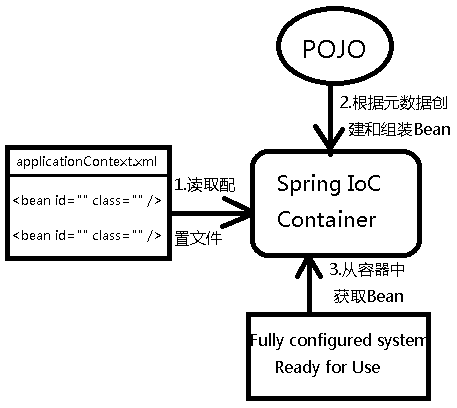

Spring实现IOC的多种方式

原文地址：

[https://www.cnblogs.com/best/p/5727935.html](https://www.cnblogs.com/best/p/5727935.html)**

**

**资源：**

官网：[http://spring.io](http://spring.io/)

文档：[https://docs.spring.io/spring/docs/current/spring-framework-reference/](https://docs.spring.io/spring/docs/current/spring-framework-reference/)、[https://github.com/waylau/spring-framework-4-reference](https://github.com/waylau/spring-framework-4-reference)

中文帮助：[http://spring.cndocs.ml/](http://spring.cndocs.ml/)

框架下载地址：[http://repo.springsource.org/libs-release-local/org/springframework/spring/](http://repo.springsource.org/libs-release-local/org/springframework/spring/)

教程：[http://www.yiibai.com/spring](http://www.yiibai.com/spring)

Git：[https://github.com/spring-projects](https://github.com/spring-projects)

源码：[https://github.com/spring-projects/spring-framework](https://github.com/spring-projects/spring-framework)

Jar包:[https://github.com/spring-projects/spring-framework/releases](https://github.com/spring-projects/spring-framework/releases)

**spring的组成：**

组成 Spring 框架的每个模块（或组件）都可以单独存在，或者与其他一个或多个模块联合实现。每个模块的功能如下：

- **核心容器**：核心容器提供 Spring 框架的基本功能。核心容器的主要组件是 BeanFactory，它是工厂模式的实现。BeanFactory 使用_控制反转_（IOC） 模式将应用程序的配置和依赖性规范与实际的应用程序代码分开。
- **Spring 上下文**：Spring 上下文是一个配置文件，向 Spring 框架提供上下文信息。Spring 上下文包括企业服务，例如 JNDI、EJB、电子邮件、国际化、校验和调度功能。
- **Spring AOP**：通过配置管理特性，Spring AOP 模块直接将面向方面的编程功能集成到了 Spring 框架中。所以，可以很容易地使 Spring 框架管理的任何对象支持 AOP。Spring AOP 模块为基于 Spring 的应用程序中的对象提供了事务管理服务。通过使用 Spring AOP，不用依赖 EJB 组件，就可以将声明性事务管理集成到应用程序中。
- **Spring DAO**：JDBC DAO 抽象层提供了有意义的异常层次结构，可用该结构来管理异常处理和不同数据库供应商抛出的错误消息。异常层次结构简化了错误处理，并且极大地降低了需要编写的异常代码数量（例如打开和关闭连接）。Spring DAO 的面向 JDBC 的异常遵从通用的 DAO 异常层次结构。
- **Spring ORM**：Spring 框架插入了若干个 ORM 框架，从而提供了 ORM 的对象关系工具，其中包括 JDO、Hibernate 和 iBatis SQL Map。所有这些都遵从 Spring 的通用事务和 DAO 异常层次结构。
- **Spring Web 模块**：Web 上下文模块建立在应用程序上下文模块之上，为基于 Web 的应用程序提供了上下文。所以，Spring 框架支持与 Jakarta Struts 的集成。Web 模块还简化了处理多部分请求以及将请求参数绑定到域对象的工作。
- **Spring MVC 框架**：MVC 框架是一个全功能的构建 Web 应用程序的 MVC 实现。通过策略接口，MVC 框架变成为高度可配置的，MVC 容纳了大量视图技术，其中包括 JSP、Velocity、Tiles、iText 和 POI。

**IOC基础：**

控制反转IoC(Inversion of Control)，是一种设计思想，DI(依赖注入)是实现IoC的一种方法，也有人认为DI只是IoC的另一种说法。没有IoC的程序中我们使用面向对象编程对象的创建与对象间的依赖关系完全硬编码在程序中，对象的创建由程序自己控制，控制反转后将对象的创建转移给第三方，个人认为所谓控制反转就是：获得依赖对象的方式反转了。

使用xml配置bean时，需引入
