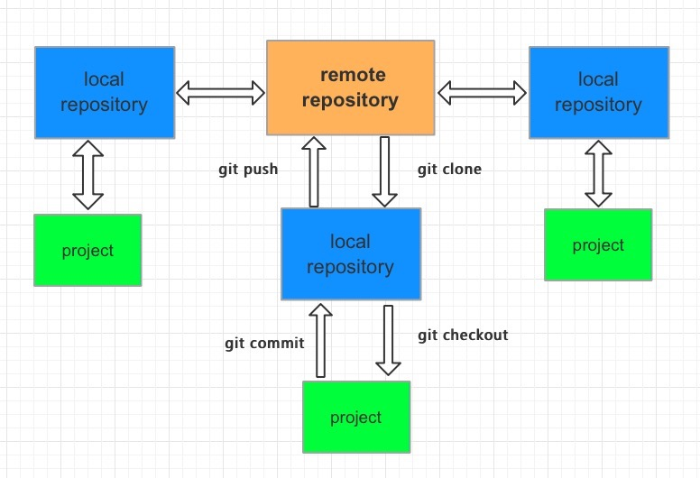

# Git 使用

git是目前流行的分布式版本管理系统。它拥有两套版本库，本地库和远程库，在不进行合并和删除之类的操作时这两套版本库互不影响。也因此其近乎所有的操作都是本地执行，所以在断网的情况下任然可以提交代码，切换分支。git又使用了SHA-1哈希算法确保了在文件传输时变得不完整、磁盘损坏导致数据丢失时能立即察觉到。

git的基本工作流程：

- git clone: 将远程的Master分支代码克隆到本地仓库
- git checkout： 切出分支出来开发
- git add： 将文件加入库跟踪区
- git commit：将库跟踪区改变的代码提交到本地仓库中
- git push：将本地仓库中的代码提交到远程仓库

git分支

主分支

master分支：存放随时可供生产环境中部署的代码

develop分支：存放当前最新开发成果的分支，当代码足够稳定时可以合并到master分支上去

辅助分支

feature分支：开发新功能使用，最终合并到develop分支或抛弃掉

release分支：做小的缺陷修正、准备发布版本所需的各项说明信息

hotfix分支：代码的紧急修复工作

分支管理

分支管理是gir开发中的一个非常有效的团队开发策略。多个程序员并行开发，每个程序员可以定义各自的分支，在自己的分支上开发工程。

在开发结束测试完毕后，再合并到主干工程中，一次性提交到远程，由其他程序员使用

- 创建分支
- 分支切换
- 合并分支
- 删除分支
- 冲入管理
- 提交冲突
