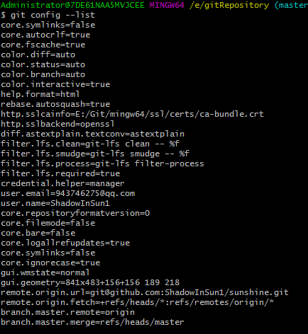

# Git 安装

Git官网地址：[http://git-scm.com/downloads](http://git-scm.com/downloads)

下载对应各个平台的安装包

安装完成后，可运行Git bash 进入Git命令行

查看配置：

git config –list

可以查看相关配置信息

可以看到用户信息：

若想要修改用户名邮箱等信息

git config –global user.name “new user.name”

git config –global user.email “new user.email”

如果用了 **–global** 选项，那么更改的配置文件就是位于你用户主目录下的那个，以后你所有的项目都会默认使用这里配置的用户信息。

如果要在某个特定的项目中使用其他名字或者电邮，只要去掉 –global 选项重新配置即可，新的设定保存在当前项目的 .git/config 文件里。
