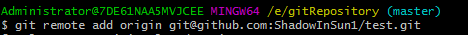
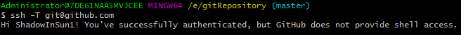

# Git 本地仓库与远程仓库连接

添加远程库

**git remote add origin git@github.com:你的用户名/仓库名.git**

生成SSH Key:

**ssh-keygen -t rsa -C “注册邮箱@example.com”（注意：ssh-keygen中间没有空格）**

**使用默认设置一路回车**

**会在c盘中生成.ssh 文件夹，打开id_rsa.pub,复制该文件key。**

**回到github 进入设置界面**

**setting - ssh and GPG keys - new SSH keys 将key值复制进去。**

验证是否成功：

ssh-T git@github.com

输出如上信息，则验证成功

若需要确认授权验证，则yes

可以将本地仓库的内容推送到远程仓库

**1、进入本地目录**

**cd $path(你的本地仓库路径)**

**2、git init**

**3、git add . ()**

**4、git commit -m “注释内容”**

**5、git remote add origin git@github.com:用户名/仓库名.git**

**6、git push -u origin master**

**如果push报错，则先pull**

**git pull origin master （同步远程仓库与 本地仓库）**

**7、**