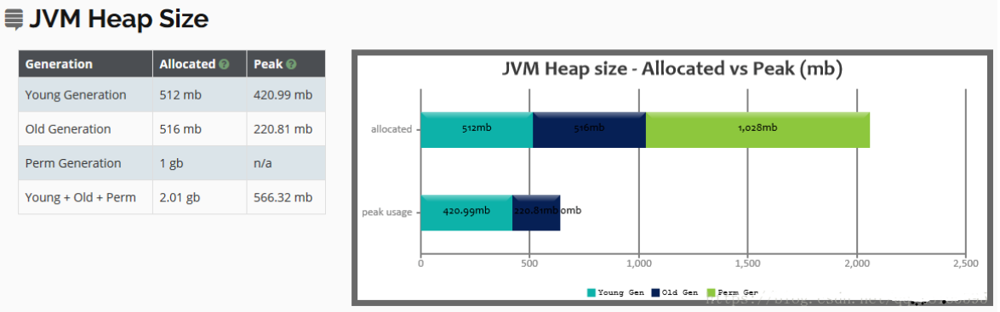
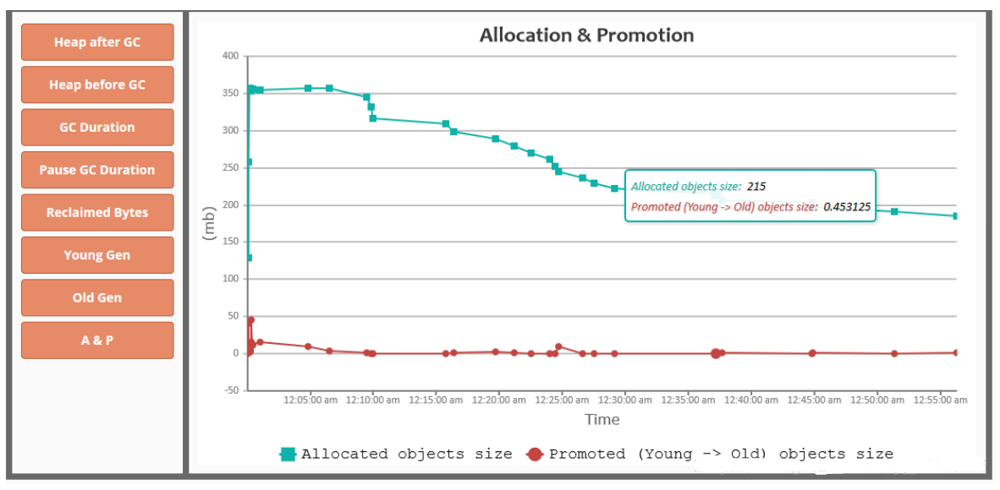
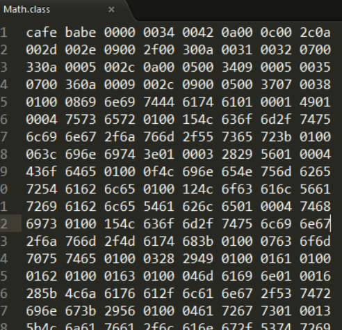
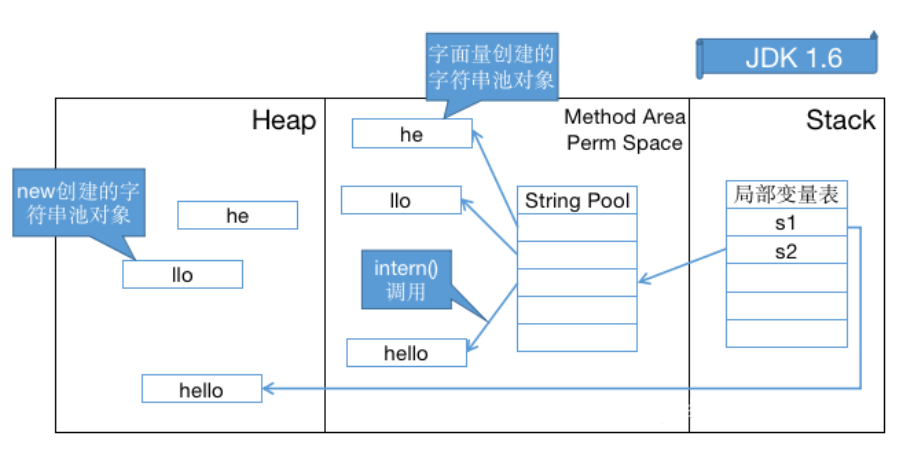
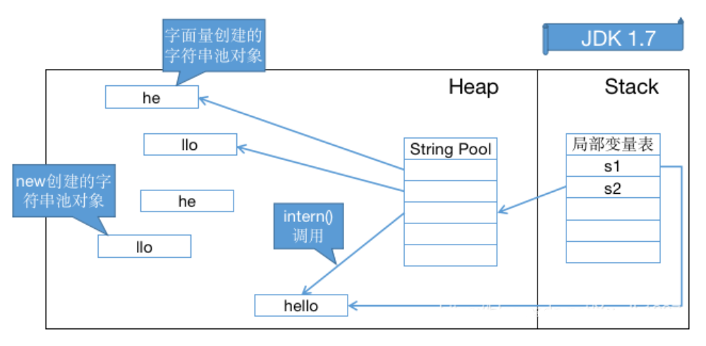
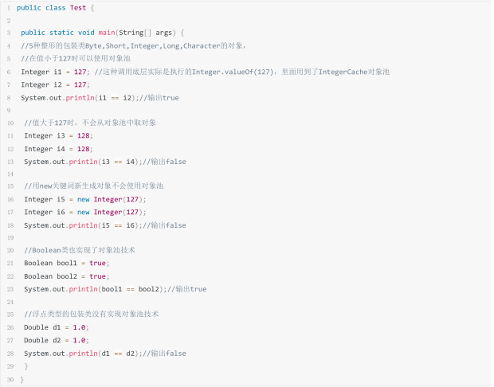

# 常用调优工具

阿里巴巴Arthas详解

官方文档：[https://alibaba.github.io/arthas](https://alibaba.github.io/arthas)

Arthas使用

GC日志详解

对于java应用我们可以通过一些配置把程序运行过程中的gc日志全部打印出来，然后分析gc日志得到关键性指标，分析GC原因，调优JVM参数

打印GC日志的方法，在JVM参数里增加参数，%t表示时间

```plain text
1 ‐Xloggc:./gc‐%t.log ‐XX:+PrintGCDetails ‐XX:+PrintGCDateStamps  ‐XX:+PrintGCTimeStamps ‐XX:+PrintGCCause
2 ‐XX:+UseGCLogFileRotation ‐XX:NumberOfGCLogFiles=10 ‐XX:GCLogFileSize=100M
```

Tomcat则直接加载JAVA_OPTS变量

如何分析GC日志

gceasy(https://gceasy.io)，可以对上传的gc文件进行可视化界面来渲染GC情况

查看年轻代、老年代，以及永久代的内存分配，和最大使用情况



堆内存在gc前后的变化，以及其他信息



这个工具还提供基于机器学习的JVM智能优化建议，不过这个功能需要付费

Class常量池与运行时常量池

Class常量池可以理解为是Class文件中的资源仓库，Class文件中除了包含类的版本、字段、方法、接口等描述信息外，还有一项信息就是常量池，

用于存放编译期生成的各种字面(Literal)和符号引用(Symbolic References)

一个class文件的16进制大体结构如下图：



对应的含义

字符串常量池

字符串常量池的设计思想

1.字符串的分配，和其他的对象分配一样，耗费高昂的时间与空间代价，作为最基础的数据类型，大量频繁的创建字符串，极大程度地印象程序的性能

2.JVM为了提高性能和减少内存开销，在实例化字符串常量的时候进行了一些优化

- 为字符串开辟一个字符串常量池，类似于缓存区
- 创建字符串常量时，首先查询字符串常量池是否存在该字符串
- 存在字符串，返回引用实力，不存在，实例化该字符串并放入池中

三种字符串操作(jdk1.7及以上版本)

直接赋值字符串

new String();

intern方法

字符串常量池位置

字符串常量池设计原理

1.在jdk1.6中，调用intern() 首先会在字符串常量池中寻找equal()相等的字符串，假如字符串存在就应该返回该字符串在字符串常量池中的引用；

假如字符串不存在，虚拟机会重新在永久代上创建一个实例，将String table的一个表项指向这个新创建的实例



2.在JDK1.7及以上版本中，由于常量池不在永久代了，intern()做了一些修改，更方便的利用堆中的对象。字符串存在时和JDK1.6中一样，但是字符串不存在时不在需要重新创建实例，可以直接指向堆上的实例



八种基本类型的包装类和对象池

java中基本类型的包装类大部分都实现了常量池技术(严格来说应该叫对象池，在堆上)，这些类是Byte,Short,Integer,Long,Character,Boolean，另外两种浮点数类型的包装类则没有实现，另外Byte,Short,Integer,Long,Character这5种整形的包装类也只是在对应值小于等于127时才可使用对象池，也即对象不负责创建和管理大于127这些类的对象。因为一般这种比较小的数用到的概率相对较大

