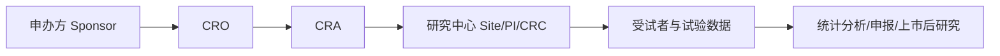
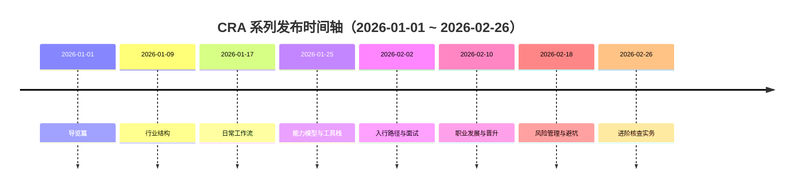

如果你想系统了解 CRA（Clinical Research Associate，临床试验监查员）这个行业，这篇是整个系列的总入口。

这套系列不只讲"CRA 是什么"，而是会回答更实用的问题：

- 这个行业怎么运转？
- CRA 每天到底在做什么？
- 想入行需要补哪些能力？
- 如何从执行岗走到高级岗/管理岗？
- 常见风险怎么前置预防？

## 一、CRA 在临床试验中的位置

一句话：

- CRA 是"质量、进度、合规"三条线在项目现场的关键交汇点。

## 二、系列主题与发布时间（均匀分布）

按顺序阅读：

1. [CRA 行业结构：Sponsor、CRO、Site 如何协作](./2026-01-09-cra-industry-overview-sponsor-cro-site-roles.md)
2. [CRA 日常工作：从 SIV 到 COV 的全流程](./2026-01-17-cra-daily-workflow-from-siv-to-cov.md)
3. [CRA 能力模型：法规、沟通、数据与项目管理](./2026-01-25-cra-skill-matrix-and-tools.md)
4. [CRA 入行路径：背景要求、转岗方式与面试准备](./2026-02-02-cra-entry-path-and-interview-playbook.md)
5. [CRA 职业发展：晋升路径、绩效逻辑与长期规划](./2026-02-10-cra-career-path-performance-and-promotion.md)
6. [CRA 常见风险与避坑：如何减少返工与合规风险](./2026-02-18-cra-risk-management-and-common-pitfalls.md)
7. [进阶专题：CRA 核查全流程（步骤、CAPA、预案）](./2026-02-26-cra-monitoring-checklist-and-capa-playbook.md)

## 三、这套系列能帮你解决什么

| 场景 | 你会得到什么 |
| --- | --- |
| 准备转行 CRA | 入行路径、简历方向、面试回答框架 |
| 刚入行 0-1 年 | 标准工作流、核查重点、错误预防 |
| 在岗 1-3 年 | 风险分层、跨中心协同、晋升能力地图 |
| 组长/管理者 | 团队培养重点、质量指标、闭环策略 |

## 四、推荐阅读路径

- 新手路径：`1 -> 2 -> 4 -> 3 -> 6`
- 提升路径：`2 -> 3 -> 6 -> 7 -> 5`
- 管理路径：`1 -> 5 -> 6 -> 7`

## 五、如何使用这套内容

建议每篇都按"读完即执行"方式使用：

1. 先读完正文里的流程框架。
2. 把文末 checklist 转成你自己的周计划。
3. 在下一个项目周期里验证并复盘一次。

只要你能完成这三步，这个系列就不是"科普"，而是可落地的方法库。

## 参考资料

1. ACRP Glossary: Clinical Research Associate (CRA)
   [https://acrpnet.org/glossary/clinical-research-associate-cra](https://acrpnet.org/glossary/clinical-research-associate-cra)
2. ICH E6(R3) Good Clinical Practice
   [https://www.ema.europa.eu/en/ich-e6-good-clinical-practice-scientific-guideline](https://www.ema.europa.eu/en/ich-e6-good-clinical-practice-scientific-guideline)
3. 国家药监局《药物临床试验质量管理规范》（2020）
   [https://amr.sz.gov.cn/xxgk/zcwj/syfg/ypjg/jgglfl/content/post_11741549.html](https://amr.sz.gov.cn/xxgk/zcwj/syfg/ypjg/jgglfl/content/post_11741549.html)
