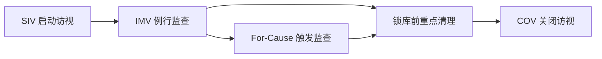

"CRA 一天到底在做什么？"

最真实的答案不是"天天出差"，而是：在一个持续循环的流程里做风险识别、核查执行和问题闭环。

## 一、项目生命周期里的 CRA 节点

## 二、每个节点的产出物（这比"做了什么"更重要）

| 节点 | 核心动作 | 关键产出 |
| --- | --- | --- |
| SIV | 培训、版本核对、授权确认 | 启动访视记录、培训证据、待办清单 |
| IMV | 安全、依从、数据、药物核查 | 监查报告、issue log、CAPA 计划 |
| For-Cause | 针对异常做深度核查 | 触发原因分析、升级记录、纠偏证据 |
| 锁库前清理 | query 与关键终点清理 | 数据清理状态表、关闭证据 |
| COV | 收尾与归档确认 | 关闭访视报告、未决事项移交清单 |

## 三、IMV 实操模板（建议直接套用）

## 访视前（T-7 到 T-1）

1. 看上次未关闭问题。
2. 拉本周期高风险受试者与事件。
3. 明确当次"必查清单"（关键变量优先）。
4. 与中心确认可访问资料和关键人员在场时间。

## 访视中（D-Day）

1. 先核安全（AE/SAE/合并用药）；
2. 再核 ICF 与方案依从；
3. 然后做 SDV/SDR；
4. 最后查 IMP 账物温控与文件完整性；
5. 当天完成问题分级与时限确认。

## 访视后（D+1 到 D+7）

1. 报告初稿 48-72 小时内完成；
2. 每条问题必须有责任人和截止日；
3. Critical/Major 问题单独升级跟踪；
4. 关闭后留证据（不是口头"已处理"）。

## 四、CRA 一周工作节奏（示例）

| 时间块 | 重点工作 |
| --- | --- |
| 周一上午 | 本周中心优先级排序 + 风险清单更新 |
| 周一下午 | 访视准备与资料拉取 |
| 周二-周四 | 现场/远程访视、问题登记 |
| 周五上午 | 报告与 CAPA 更新 |
| 周五下午 | 跨团队同步 + 下周计划 |

## 五、常见效率陷阱

- 只做"任务清单"，不做"风险优先级"。
- 报告晚出，导致中心整改窗口被压缩。
- 问题记录没有明确 owner，闭环长期拖延。

## 六、本篇小结

成熟 CRA 的核心不是工作时长，而是：

- 能把每次访视转换为可审计、可闭环、可复用的项目改进动作。

下一篇我们讲能力模型：哪些能力决定你从"能做"走向"做得稳"。

## 参考资料

1. ICH E6(R2) 5.18 Monitoring
   [https://www.ema.europa.eu/en/documents/scientific-guideline/ich-guideline-good-clinical-practice-e6r2-step-5-revision-2_en.pdf](https://www.ema.europa.eu/en/documents/scientific-guideline/ich-guideline-good-clinical-practice-e6r2-step-5-revision-2_en.pdf)
2. FDA Risk-Based Monitoring Guidance
   [https://www.hhs.gov/guidance/document/oversight-clinical-investigations-risk-based-approach-monitoring-guidance-industry](https://www.hhs.gov/guidance/document/oversight-clinical-investigations-risk-based-approach-monitoring-guidance-industry)
