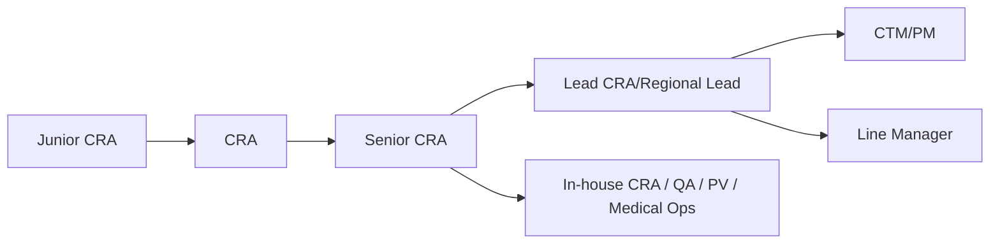

很多 CRA 做到 1-2 年后都会遇到同一个问题：

- 继续做深，还是转管理？

这篇给你一个更清晰的职业路径地图。

## 一、典型职业路径

## 二、晋升评估常见维度

| 维度 | CRA 阶段 | Senior/Lead 阶段 |
| --- | --- | --- |
| 质量 | 按 SOP 完成核查 | 能前置识别系统性风险 |
| 进度 | 按时完成访视与报告 | 能稳定推动关键节点达成 |
| 协作 | 能完成跨角色沟通 | 能主导跨团队问题解决 |
| 影响力 | 个人交付稳定 | 能带新人、统一口径、复制方法 |

## 三、不同方向的成长策略

## 方向 A：专业深耕

适合人群：希望成为复杂项目专家。

重点动作：

- 主动承担高复杂度试验（肿瘤、罕见病、多中心）
- 强化法规与审计应对能力
- 输出可复用的项目方法模板

## 方向 B：管理转型

适合人群：希望走 PM/CTM/LM。

重点动作：

- 提前参与资源与计划协同
- 练习项目级风险汇报
- 关注团队培养与交付稳定性

## 四、绩效不只是"做了多少"

成熟组织更看重：

- 关键问题复发率是否下降
- CAPA 关闭质量是否提升
- 团队在你参与后是否更稳更快

所以高阶晋升的本质是：

- 从"自己做完"走向"推动系统变好"。

## 五、2 年进阶建议（可执行）

### 第 1 年目标

- 建立稳定交付节奏（质量/时效双达标）
- 形成个人问题闭环方法论

### 第 2 年目标

- 主导至少一个复杂中心或复杂问题闭环
- 带 1-2 名新人并可复制输出
- 参与一次项目层级风险评审

## 六、本篇小结

职业发展最怕"每年都在重复同样的动作"。

如果你想升得稳，建议每年明确增加一个高价值能力模块：

- 风险判断、跨团队协作、系统化输出、人才培养。

下一篇我们讲风险管理：如何少走弯路、减少返工。

## 参考资料

1. ACRP Competency Guidelines
   [https://acrpnet.org/resources/competency-guidelines](https://acrpnet.org/resources/competency-guidelines)
2. ICH E6(R3)
   [https://www.ema.europa.eu/en/ich-e6-good-clinical-practice-scientific-guideline](https://www.ema.europa.eu/en/ich-e6-good-clinical-practice-scientific-guideline)
