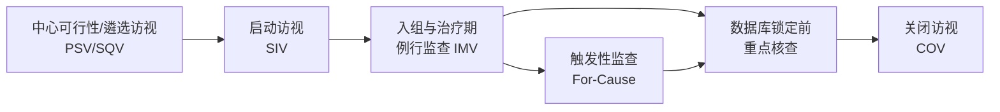
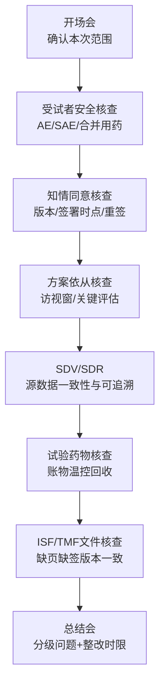

很多团队把 CRA 核查理解为“来现场看一眼资料”，这其实是最常见误区。

在合规视角下，CRA 核查（监查）的目标是三件事：

1. 受试者权益与安全是否持续被保护；
2. 试验实施是否遵循方案、GCP 与适用法规；
3. 数据是否真实、准确、完整、可追溯。

这篇文章按实务流程，系统回答 7 个问题：

- CRA 核查通常在什么时候进行？
- 每个阶段需要什么前置条件？
- 标准核查步骤怎么走？
- 现场有哪些关键注意事项？
- 常见问题如何补救？
- 事前该做哪些预案？
- 如何建立可执行的闭环机制？

> 说明：本文 CRA 指临床试验监查员（Clinical Research Associate）执行的监查活动。具体执行请以试验方案、申办方 SOP、伦理要求及当地法规为准。

## 1. CRA 核查通常在什么时候进行？

先给一个生命周期视图：

在大多数药物临床试验中，CRA 核查至少覆盖以下时点：

1. **启动前核查（PSV/SQV）**：评估机构能力、团队资质、受试者来源、设施与流程。
2. **启动访视（SIV）**：确认方案培训、文件就绪、系统可用、药物可控后，正式开中心。
3. **例行监查（IMV）**：按监查计划周期执行（例如按风险每 4-8 周或按入组节奏）。
4. **触发性监查（For-Cause）**：出现 SAE 延迟上报、重大方案偏离、数据异常等触发条件时。
5. **关闭访视（COV）**：确认受试者流程完成、药物清点、文件归档、遗留问题闭环。

## 2. 开始核查前需要什么条件？

可以把前置条件分成 5 组核对。

| 条件组 | 核心问题 | 关键材料 |
| --- | --- | --- |
| 法规伦理 | 是否已获批且在有效期内 | 伦理批件、持续审查批件、监管审批/备案 |
| 人员资质 | 研究团队是否授权且受训 | PI 资质、GCP 培训记录、授权分工日志 |
| 试验文件 | 版本是否一致、可追溯 | 方案、ICF、IB、实验室手册、CRF/eCRF 指南 |
| 系统与设施 | 是否具备执行条件 | 温控记录、设备校准、eSource/EDC 账号权限 |
| 试验物资 | 药物与耗材是否可控 | 药物接收/发放/回收记录、随机系统状态 |

如果这些前置条件不完整，CRA 应先发起“启动前阻断项清单”，而不是带病开中心。

## 3. CRA 核查标准步骤（可直接执行）

建议按“访视前-访视中-访视后”三段式执行。

## 3.1 访视前（T-7 ~ T-1）

1. 阅读上次监查报告与未闭环问题。
2. 拉取本周期风险点：新入组、SAE、方案偏离、关键实验室异常。
3. 制定本次核查样本策略（100% 关键变量 + 风险抽样）。
4. 与中心确认访视议程、可用人员、待查病历清单。
5. 预设“高风险问题升级路径”（如 24h 内升级 PM/医学监查）。

## 3.2 访视中（D-Day）

按以下顺序效率最高：

建议把发现项当场分级：

- `Critical`：直接影响受试者安全或数据可信性；
- `Major`：显著影响合规或关键终点解释；
- `Minor`：不影响核心结论但需纠正。

## 3.3 访视后（D+1 ~ D+7）

1. 48-72 小时内出监查报告初稿；
2. 明确每条问题的责任人、CAPA、完成时限；
3. 对 Critical/Major 启动加速复核机制；
4. 跟踪关闭证据（文件修订、再培训、系统日志、纠正记录）；
5. 必要时安排复访或远程复核。

## 4. 现场核查重点与注意事项

## 4.1 知情同意（ICF）

高发错误：版本错用、先入组后签字、签字日期逻辑错误。

注意事项：

- 必须核对“签署时点”是否早于任何试验程序；
- 版本号与伦理批准版本一致；
- 重签触发条件（方案修订、风险更新）要有证据链。

## 4.2 安全性（AE/SAE）

高发错误：SAE 首报超时、随访结局缺失、合并用药记录不完整。

注意事项：

- 核对病历、护理记录、检验报告与 eCRF 一致性；
- 严格检查 SAE 报告时限与升级路径；
- 医学判断依据要可追溯（谁判定、何时判定、依据何在）。

## 4.3 方案依从

高发错误：访视窗超窗、关键评估漏做、排除标准执行不严。

注意事项：

- 先看关键终点相关流程；
- 每个偏离都要有偏离报告、影响评估和纠正措施；
- 不允许“口头解释代替书面证据”。

## 4.4 试验药物管理

高发错误：账物不符、温控记录断点、回收销毁链不完整。

注意事项：

- 药物接收-发放-回收-销毁必须闭环；
- 温控异常需有偏差处理与影响评估；
- 随机盲态相关操作须防止非授权人员接触。

## 5. 常见问题与补救（CAPA 实操表）

| 常见问题 | 风险级别（常见） | 立即补救 | 根因纠正 | 防再发措施 |
| --- | --- | --- | --- | --- |
| ICF 签署晚于筛选检查 | Critical/Major | 立即上报，暂停继续入组评估 | 复盘签署流程与培训缺口 | ICF 双人核对 + 签署前置清单 |
| SAE 上报超时 | Major/Critical | 立即补报并补充医学说明 | 梳理院内报告链路 | 24h 预警机制 + 值班联系人 |
| 源数据与 eCRF 不一致 | Major | 逐条发 query 并修正 | 明确谁录入、何时核对 | 关键变量双重复核 |
| IMP 账物不符 | Major/Critical | 立即清点、隔离可疑批次 | 查明发放/回收交接漏洞 | 每周账物核对 + 温控联查 |
| 频繁超窗访视 | Major | 评估对终点影响并记录偏离 | 计划排程不合理 | 访视提醒机制 + 备选窗口 |
| 研究者授权日志滞后 | Minor/Major | 当日补齐并留痕 | 授权更新流程不清 | 人员变更触发 SOP |

补救原则建议：

1. 先止血（控制风险扩散）；
2. 再纠偏（纠正当前记录）；
3. 后固化（形成流程防再发）。

## 6. 事前应该有什么预案？

建议至少准备以下 6 个“可落地预案”。

## 6.1 风险分层监查预案（RBM）

- 定义关键数据与关键流程；
- 明确不同风险等级对应监查频次与深度；
- 预设触发性监查条件与响应时限。

## 6.2 SAE/安全事件应急预案

- 24h 报告链路与联系人清单；
- 节假日值班与替补机制；
- 升级路径：中心 -> CRA -> 医学监查 -> 申办方管理层。

## 6.3 核心岗位替补预案

- PI、CRC、药师关键岗位替补名单；
- 授权与培训提前准备；
- 人员变更后的交接清单模板。

## 6.4 数据质量预案

- 关键变量双核对规则；
- Query 周转时限 KPI；
- 数据冻结前集中清理窗口。

## 6.5 文件与系统连续性预案

- eCRF/IRT/CTMS 系统故障应急；
- 纸电双轨过渡规则；
- 关键文件版本控制与备份策略。

## 6.6 稽查/检查应对预案

- TMF/ISF 索引预整理；
- 常见问答模板（职责、流程、证据路径）；
- 模拟检查演练机制。

## 7. 一个可直接复用的 CRA 核查清单（简版）

访视前：

- 本周期风险项清单
- 待核查受试者名单
- 上次遗留问题关闭证据

访视中：

- ICF 全量核对
- AE/SAE 与源数据一致性
- 关键终点评估与访视窗
- IMP 账物温控
- 授权日志/培训记录

访视后：

- 监查报告与分级
- CAPA 与时限
- 关闭证据复核
- 升级事项追踪

## 8. 模拟场景：72 小时补救演练（示例）

场景设定：数据库锁定前 2 周，某中心被发现存在“3 例关键终点时间记录与源文件不一致”，且其中 1 例伴随超窗访视。

建议行动节奏：

- `0-4h`：CRA 与中心确认事实，冻结相关记录二次修改权限，完成风险初判；
- `4-24h`：组织 PI/CRC/DM/医学监查快速会，明确影响范围与受试者列表；
- `24-48h`：完成数据追溯、偏离报告与影响评估，提交升级材料；
- `48-72h`：形成 CAPA（责任人、时限、证据模板），并启动复核计划。

这个演练的关键不在“写得多快”，而在三点：

1. 证据链要完整（谁发现、何时发现、基于什么材料）；
2. 决策链要清晰（谁拍板、谁执行、谁复核）；
3. 预防链要落地（如何避免同类问题下次再发生）。

## 9. 结语

CRA 核查不是“找错”，而是“持续把风险前移并可控”。

真正高质量的监查体系，特征通常是：

- 前置风险识别足够早；
- 现场核查动作足够准；
- 问题补救闭环足够快；
- 组织预案准备足够实。

当这四点成立，核查就不再是被动应付，而是临床质量管理的主动引擎。

## 参考资料

1. 国家药监局 国家卫生健康委关于发布《药物临床试验质量管理规范》的公告（2020 年第 57 号，2020-04-23 发布，2020-07-01 起施行，转载页含原文链接）
   [https://amr.sz.gov.cn/xxgk/zcwj/syfg/ypjg/jgglfl/content/post_11741549.html](https://amr.sz.gov.cn/xxgk/zcwj/syfg/ypjg/jgglfl/content/post_11741549.html)
2. ICH E6(R3)（Step 5，2025-01-06 Step 4 采纳；EMA 页显示 2025-07-23 生效）
   [https://www.ema.europa.eu/en/ich-e6-good-clinical-practice-scientific-guideline](https://www.ema.europa.eu/en/ich-e6-good-clinical-practice-scientific-guideline)
3. ICH E6(R2)（含 5.18 Monitoring 与 Monitoring plan）
   [https://www.ema.europa.eu/en/documents/scientific-guideline/ich-guideline-good-clinical-practice-e6r2-step-5-revision-2_en.pdf](https://www.ema.europa.eu/en/documents/scientific-guideline/ich-guideline-good-clinical-practice-e6r2-step-5-revision-2_en.pdf)
4. FDA Guidance: Oversight of Clinical Investigations — A Risk-Based Approach to Monitoring（2013-08-07）
   [https://www.hhs.gov/guidance/document/oversight-clinical-investigations-risk-based-approach-monitoring-guidance-industry](https://www.hhs.gov/guidance/document/oversight-clinical-investigations-risk-based-approach-monitoring-guidance-industry)
5. FDA Guidance: E6(R3) Good Clinical Practice（2025-09，Final Guidance）
   [https://www.fda.gov/regulatory-information/search-fda-guidance-documents/e6r3-good-clinical-practice-gcp](https://www.fda.gov/regulatory-information/search-fda-guidance-documents/e6r3-good-clinical-practice-gcp)
