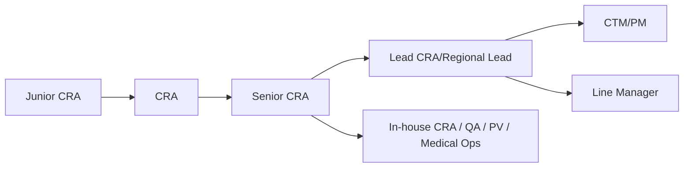

做 CRA 一段时间后，最常见的问题是：

- 下一步是继续做深，还是转管理？

## 一、典型晋升路线

## 二、绩效通常看什么

不同公司口径不同，但高频指标相近：

- 访视与报告及时性
- 问题关闭时效（CAPA）
- 关键质量问题发生率
- 项目节点达成率
- 中心协作质量

核心不是“忙不忙”，而是“是否稳定交付”。

## 三、想升 Senior/Lead，需要补的能力

1. 从“执行”转向“风险判断”。
2. 从“个人效率”转向“团队影响力”。
3. 从“完成任务”转向“推动项目结果”。

## 四、两条发展策略

### 策略 A：专业深耕型

- 深入复杂项目（肿瘤、罕见病、多中心国际试验）
- 强化法规和质量能力
- 目标：Lead CRA / 关键项目专家

### 策略 B：管理转型型

- 提前参与资源与进度协同
- 练习跨团队决策沟通
- 目标：CTM / PM / LM

## 五、本篇总结

CRA 职业发展最怕“只重复同样的一年经验”。

要晋升，关键在于：

- 每年都增加一个高价值能力模块（风险、协调、管理、策略）。

下一篇我们讲最实战的话题：CRA 常见风险与避坑清单。

## 参考资料

1. ACRP Competency Guidelines
   [https://acrpnet.org/resources/competency-guidelines](https://acrpnet.org/resources/competency-guidelines)
2. ICH E6(R3)
   [https://www.ema.europa.eu/en/ich-e6-good-clinical-practice-scientific-guideline](https://www.ema.europa.eu/en/ich-e6-good-clinical-practice-scientific-guideline)
