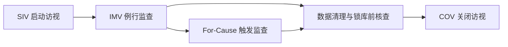

“CRA 平时都在干嘛？”

这是行业内外问得最多的问题。最好的回答不是“很忙”，而是把工作拆成一个清晰流程。

## 一、项目周期中的 CRA 核心节点

## 二、SIV（启动访视）要做什么？

SIV 不是形式流程，而是“中心能不能开起来”的关键关口。

重点通常包括：

- 方案与流程培训
- ICF 与关键文件版本核对
- 试验药与系统准备状态
- 团队授权分工与联络机制

SIV 做不扎实，后续 IMV 会反复返工。

## 三、IMV（例行监查）是 CRA 工作主轴

典型 IMV 结构：

1. 访视前：准备风险点和待核查清单；
2. 访视中：安全性、方案依从、数据一致性、药物管理；
3. 访视后：报告、问题分级、CAPA 跟踪。

IMV 的目标并不是“查得越多越好”，而是“关键风险抓得越准越好”。

## 四、For-Cause（触发监查）何时发生？

常见触发条件：

- SAE 上报异常
- 关键方案偏离频发
- 数据异常模式（集中改数、时间逻辑异常等）
- 合规投诉或质量预警

触发监查的特点是：

- 节奏更快
- 证据要求更强
- 升级链路更短

## 五、COV（关闭访视）容易被低估

COV 关注的是“项目能否干净收尾”：

- 试验药清点与回收销毁链
- 文件归档完整性
- 数据遗留问题关闭
- 中心职责终止确认

很多项目后期出问题，往往不是因为没有做 COV，而是做得太“形式化”。

## 六、CRA 一周工作节奏示意

| 时间 | 常见工作 |
| --- | --- |
| 周一 | 访视准备、上周问题追踪、跨团队同步 |
| 周二-周四 | 现场或远程监查、中心沟通、问题记录 |
| 周五 | 监查报告、CAPA 更新、下周计划 |

不同项目节奏会变，但“准备-执行-闭环”这三段不会变。

## 七、本篇总结

一个成熟 CRA 的核心，不是“出差频率”，而是：

- 能持续把每次访视变成可闭环的质量改进动作。

下一篇我们讲能力模型：要把这份工作做好，到底需要哪些硬技能和软技能。

## 参考资料

1. ICH E6(R2) 5.18 Monitoring
   [https://www.ema.europa.eu/en/documents/scientific-guideline/ich-guideline-good-clinical-practice-e6r2-step-5-revision-2_en.pdf](https://www.ema.europa.eu/en/documents/scientific-guideline/ich-guideline-good-clinical-practice-e6r2-step-5-revision-2_en.pdf)
2. FDA Risk-Based Monitoring Guidance
   [https://www.hhs.gov/guidance/document/oversight-clinical-investigations-risk-based-approach-monitoring-guidance-industry](https://www.hhs.gov/guidance/document/oversight-clinical-investigations-risk-based-approach-monitoring-guidance-industry)
