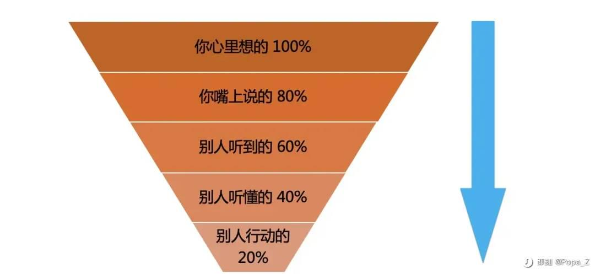
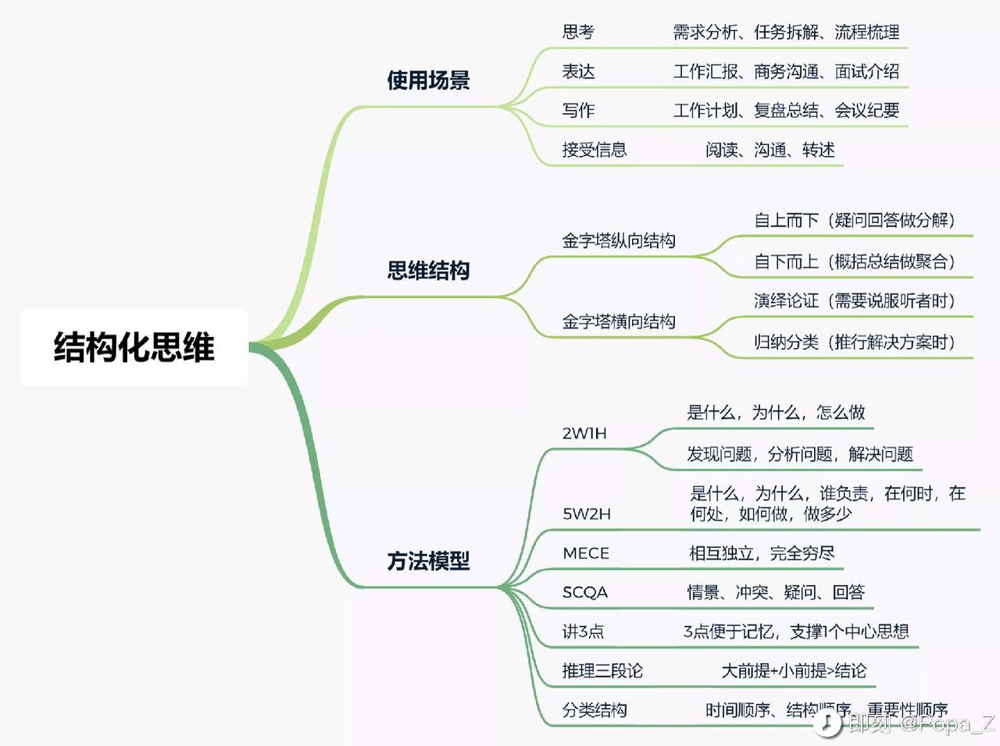

我打小是一个不善言辞的人，喜欢使用文字表达，到如今也是如此，但凡能用写，我基本很少会通过说，这也导致了我在口语表达上缺乏练习，所以到了关键时刻，必须要用口语表达时候，如果没有提前做好充分的准备，我经常会掉链子——不能清晰完整地将我脑子里的想法传达给听者。

在需要进行工作汇报或是商务洽谈的时候，就非要要命。深刻记得前一任Boss用了一个比喻形容我：“你脑子里装有东西，但你仿佛有四张嘴，每一张嘴都在抢着说话，所以别人很难理解你想说什么。”听到这段话后，才让我第一次真正意识到练习表达的必要性。

该如何将脑海里的想法有条理地说出来呢？带着这个疑问，我去知乎搜索了相关的问答，翻阅了高赞前20的回答，又根据回答里的推荐去看了《金字塔原理》与《结构思考力2》这两本书。看完后，我发现不管是高赞回答，还是这两本书，他们都指向一个核心关键词——结构化思维。而书里的理论及案例，让我恍然大悟，其实有条理的表达没有很复杂，并且原来我就已经掌握了一些结构化思考的能力，平时在工作中也使用过相关方法，但从来没有意识到将它用在表达上。

结构化思考并不高深晦涩，《金字塔原理》里用四大原则进行了概括：结论先行、以上统下、归类分组、逻辑递进。遵循了这四个原则，基本能让听者感觉到你的表达清晰有逻辑。在了解到原理后，我便开始尝试将这个思维运用于口语表达练习，不仅于此，我还参考书中案例，将结构化思维用在需求分析、写PPT、工作复盘等实践中，像是打开了任督二脉，我发现工作和学习的质量都有了质的飞跃。

最近有空闲，梳理一下结构化思维的应用场景。开始前，先简单介绍《金字塔原理》结构化的四大原则，方便看到这篇文章的朋友理解。

▪️结论先行：基于目标定主题，首先明确结论。

▪️以上统下：阐述得出结论的观点，再向下分别展开支持每个观点的依据。

▪️归类分组：将关系相近能得出同一个结论的依据归纳分组。

▪️逻辑递进：归纳分组的方式要符合人类思考习惯，如时间顺序、重要性顺序。

一、结构化思维有哪些应用场景？

思考：需求分析、目标拆解、流程梳理…

表达：工作汇报、商务沟通、面试介绍…

写作：工作计划、复盘总结、会议纪要…

接收信息：阅读、沟通、转述…

上面的每一个场景都可以运用到结构化思维，例如我们工作中最常见的业务汇报，第一步就要说明本次汇报事项的结论，第二步说明得出这个结论的观点是什么，第三步再依次展开支撑这些观点的原因，第四步针对以上原因给出解决方案以及需要的支持，第五步重新强调一下结论。

这种结构化的汇报方式，一定比上来就说“我们有哪些原因？情况如何？为什么会这样？”的效果要好很多。原因有这几点：

1）结论先行可以让听者更容易抓住重点，并且对后面的汇报内容更感兴趣，好奇为什么是这个结论？

2）以上统下逐级分解，汇报者不容易遗漏问题，听者也能更好提出自己的观点及思考，帮助补全问题及方案。

3）如果汇报对象是领导或老板，对方的时间不够，给一个最终的结论要好过一堆杂乱的原因及不完整的方案。

二、结构化思维的两大结构

金字塔原理的四大原则中，“结论先行”和“以上统下”对应了金字塔纵向结构，“归类分组”和“逻辑递进”则对应了金字塔横向结构。

1.金字塔纵向结构

1.1.自上而下（疑问回答做分解）

自上而下通常运用于目标明确的时候，通过自问自答的方式向下逐层拆解分析，可以逼近问题的本质。此外在对外沟通场景下，结论先行后，我们要明白一点，当听者在听到我们的结论之后，势必会提出疑问。因此，要想要达成目的并获得事半功倍的效果，这就需要用到自上而下的结构。它涉及到2个环节：

- 环节1，站在听者角度提前设想对方可能产生的问题；
- 环节2，针对设想的问题提前给出答案或解决方案。

注：给出的每一个回答都必须为一个结论，因为结论更清晰更具说服力，同时也能更好地引出下一层级的问题。

那如何去分解问题呢？可以用到这几个方法模型。

🔸2W1H：是什么（what）、为什么（why）、怎么做（how）。想必在日常工作中，我们经常会听到这个方法，要分析一件事，需要先搞懂它的定义、原理、状况，再弄明白为什么会是这个定义、原理、状况，最后思考根据目标通过哪些方法可以达成？此外我们还经常听到另外一个说法，即发现问题、分析问题、解决问题，也是相同的。

🔸5W2H：是什么（what）、为什么（why）、谁来做（who）、何时做（when）、何处做（where）、如何做（how）、做多少（how much）。这一方法是2W1H的升级版，可以让问题分解得更加全面。

🔸讲3点：针对2W1H或5W2H的每一个疑问，分别给出3个理由回答（理由同时也是结论）。3点便于记忆，同时支撑1个中心思想结论。

1.2.自下而上（概括总结做聚合）

自下而上通常运用于结论未知的场景，要得出一个结论，第一步得先收集信息，再经过整理、归纳、分析等步骤，才能得出这个结论。自下而上的结构是最适合的结构，它主要有3个步骤：

- 第1步，信息收集。将能够收集到的信息全部罗列出来；
- 第2步，信息处理。此处用到了”归类分组“的原则，确保同一组信息能得出同一个结论；
- 第3步，概括总结。将每一组分类概括出一个结论，结论可以继续分组概括，直至最终的结论。

注：确保每个结论都是一个具有中心思想的主题句。而不同修辞手法的描述，对人的情绪影响是不一样的，因此可以对结论进行适当的修饰，能让听者产生不同的感染效果。

那进行信息归纳，该如何尽量减少遗漏或重复呢？推荐使用：麦肯锡“MECE“原则。

🔸MECE：Mutually Exclusive Collectively Exhaustive，即“相互独立，完全穷尽“。对于一件复杂的事项，尽可能做到不重叠、不遗漏的分类。MECE原则可以让我们看待问题更加清晰全面，从而能把握住问题的关键。（关于MECE方法的使用可以去知乎搜索更多内容）

想必你也发现了，自上而下的结构适合运用在对未知原因的事件分析中，如需求分析、目标拆解等；自下而上的结构适合运用在对已有信息的整理归纳中，如复盘总结、业务汇报等。不过在实际操作过程中，我们还是需要将两种方式结合使用，可以先自上而下搭框架，再自下而上完善框架；或者先从下到上搭框架，再从上到下验证框架。

2.金字塔横向结构

2.1.演绎论证（需要说服听者时）

在沟通过程中，当我们要说服听者时，一定是具有完整且合理的逻辑，才能让对方信服。而演绎推理，是工作和生活中极为常见的基础推理结构，并且符合我们的思维方式。主要有两种演绎形式，一种是标准式，另一种是常见式。

🔸标准式：即演绎三段论推理——大前提+小前提>结论。如“所有M都属于P，所有S都属于M，因此所有S都属于P”。熟练运用三段论推理必须掌握正确的大前提，因为这些大前提通常是一般性的原理、行业规律、基本规则等常识，所以要想有力说服别人，需要在多掌握这些基本常识的基础上，再去使用三段论推理，否则容易出现逻辑漏洞，最后的结论站不住脚。

🔸常见式：即2W1H方法模型——现象what>原因why>解决方案how。2W1H在“自上而下”纵向结构中是常用分析模型，也同样适用于推理，可以说这是我们在日常中最常用的一个演绎结构。不过在思考解决方案的过程中，我们常常犯一个错误，把现象与原因搞混，没有分析出真正原因，而是根据现象去寻找解决方案。比如我们都知道有90%以上的人都死于床上，但如果你认为是床的问题，解决方案也是从床下手的话，方向就完全搞错了。

2.2.归纳分类（推行解决方案时）

人类天然就有分类的习惯，通过分类可以让隐形的经验变为可复制传递的显性智慧。主要有三种分类方式：时间顺序、结构顺序、重要性顺序，这三种方式不仅可以让我们更加了解事物的原理和细节，同时在向外表达时，也能让听者更容易理解接收。

🔸时间顺序：时间顺序是三种顺序中最简单的分类结构，常见的时间顺序工具有日程表、甘特图等。当我们想要达成某个目标时，这个目标需要通过一系列相应的行动来逐步达成，而这些行动步骤就是按照时间顺序进行排序分类的。比如工程管理、项目进度等。

🔸结构顺序：结构顺序是指将一个事物的整体划分为不同的部分，通常思考方式为从上到下、从外到内、从整体到局部，这种结构顺序的的优势是有利于说明事物各方面的特征。比如公司组织架构、动物器官结构等。

🔸重要性顺序：重要性顺序是指具有某些共同特点和内容的东西，按照重要程度进行排序分类。比如当我们在说明问题时，可依据重要性进行排序，先说重要问题，再说次要问题。

注：在讲“自下而上”纵向结构的内容部分，我们已经介绍了麦肯锡的“MECE”原则，在进行归纳分类时候，我们需要对分类结构及内容进行逐一排查，以确保各组分类都符合分类结构和逻辑递进。

那什么时候选择演绎论证，什么时候选择归纳分类呢？

- 当我们需要说服听者，但对方可能会存在抵触心理时，用演绎推理的方式会更好一些。（Popa：这种方式尽量不要用来解决情感问题！）
- 当我们希望听者更加关注我们提供的解决方案时，通过分类方式可以让听者更加全面地了解方案的要点。

三、如何掌握结构化思维？

对于没有结构化思维或者没有结构化思考习惯的朋友来说，要真正掌握结构化思维还需要一定的刻意练习，通过不断地刻意练习以形成思维习惯和肌肉记忆，这种练习的门槛并不高，在日常工作中我们经常会遇见某些问题，可以应用结构化思维，这时候不妨可以在纸上用笔画出思考结构，然后再通过方法模型去完善结构。

另外再补充一点，在与他人沟通的过程中，我们也常常会遇到对方的表达混乱没有重点的情况，哐哐说了一堆但不知道Ta想表达什么，这种时候我们要善用——所以呢？通过“所以呢？”这三个字连续追问，可以引导对方表述结论到底是什么。

以上便是结构化思维部分应用场景和方法模型的简单介绍，要了解更全面的内容推荐去看《金字塔原理》与《结构思考力2》这两书，快餐的话推荐知乎问答“如何解决思维混乱、讲话没条理的情况？”。

评论（0）

跳转至首条评论

0 字

> 来自: 结构化思维的应用 - 飞书云文档
