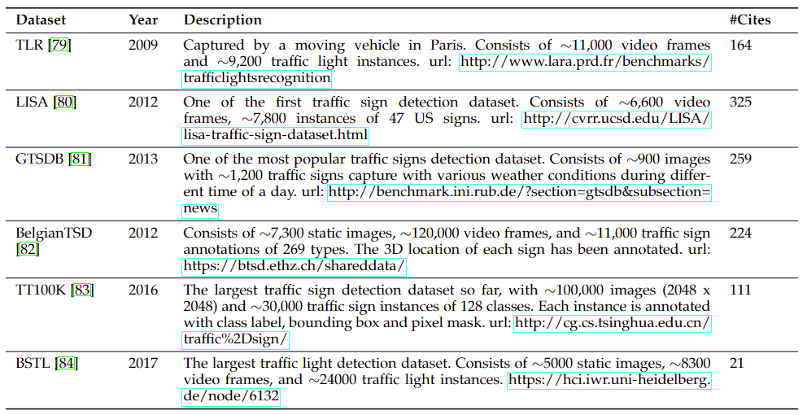

## 1. 基本概念

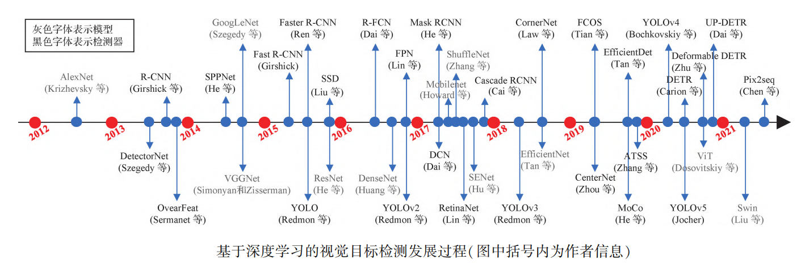

### 1.1 目标检测的定义

目标检测（Object Detection）的任务是找出图像中所有感兴趣的目标（物体），确定它们的类别和位置。

由于各类物体有不同的外观、形状和姿态，加上成像时光照、遮挡等因素的干扰，目标检测一直是计算机视觉领域最具有挑战性的问题。

### 1.2 图像识别四大任务

- **分类-Classification**：解决"是什么？"的问题，即给定一张图片或一段视频判断里面包含什么类别的目标。
- **定位-Location**：解决"在哪里？"的问题，即定位出这个目标的的位置。
- **检测-Detection**：解决"是什么？在哪里？"的问题，即定位出这个目标的的位置并且知道目标物是什么。
- **分割-Segmentation**：分为实例的分割（Instance-level）和场景分割（Scene-level），解决"每一个像素属于哪个目标物或场景"的问题。

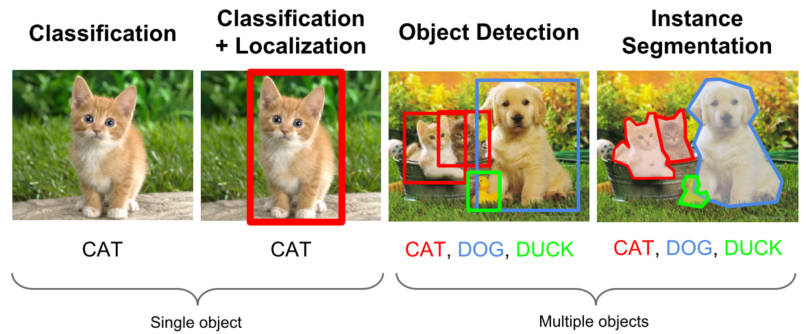

- **目标检测与分类的区别**：相比分类，检测给出的是对图片前景和背景的理解，我们需要从背景中分离出感兴趣的目标，并确定这一目标的描述（类别和位置），因此检测模型的输出是一个列表，列表的每一项使用一个数组给出检出目标的类别和位置（常用矩形检测框的坐标表示）。
- **目标检测与分割的区别**：分割分为实例的分割（Instance-level）和场景分割（Scene-level），解决"每一个像素属于哪个目标物或场景"的问题。

从任务的角度来看，目标检测可以看成是分类与分割任务的一座过度的桥梁。这也是目标检测研究的重要性所在原因之一。

### 1.2 目标检测的核心问题

除了图像分类之外，目标检测要解决的核心问题是：

- **位置的任意性** 目标可以出现在图像的任意位置

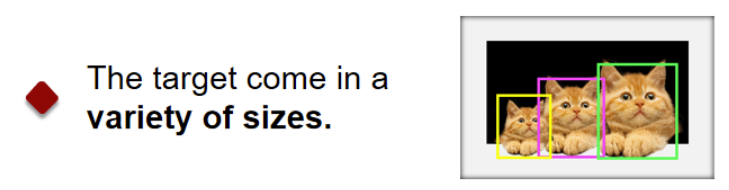

- **大小的多样性** 同一张图像上可能同时出现多个不同或相同的目标，他们之间的大小差异大

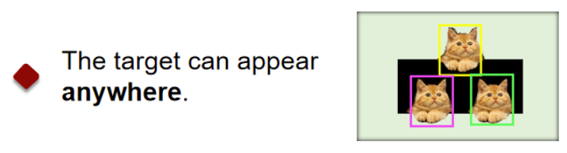

- **形态的差异性** 同一物体目标的形态差异可能很大，目标可能有各种不同的形状

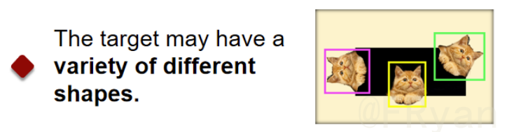

### 1.3 理想检测器

那么对于一个理想的目标检测器，我们当然希望它能够在解决上述核心问题的前提下，具有高的准确度及效率。因此，为了实现我们所想要的检测器，我们需要解决什么问题?

### 1.3.1 精度问题

在现实场景中常见的挑战主要有：

- **类内的差异性**:种类内自身材料、纹理、姿态等带来的多样性干扰，如椅子的制作材料及形态差异很大，但是它们都属于椅子的大类别

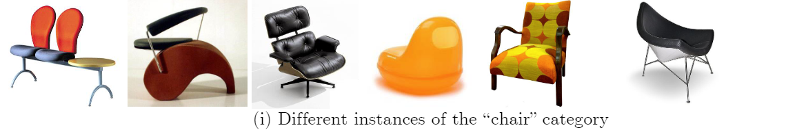

- **外部环境的干扰**:外部环境带来的噪声干扰，比如光照、迷雾、遮挡等带来的识别及回归挑战。

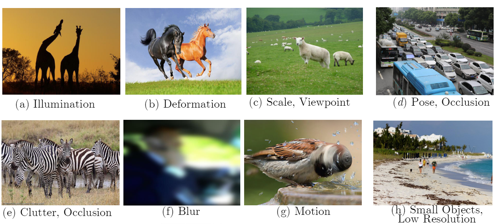

- **类间的相似性**:类间因纹理、姿态所带来的相似性干扰，比如不同品种的动物，但是它们之间的差异又很小；这里实际上可以衍生为细粒度识别领域

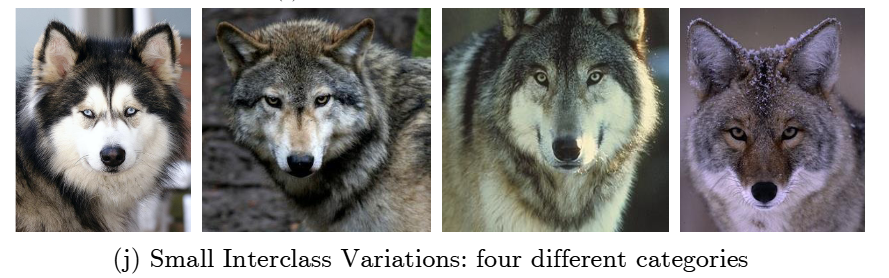

- **集群小目标问题**:集群目标检测所面临的数量多，类别多样化的问题，比如行人检测，遥感检测等。

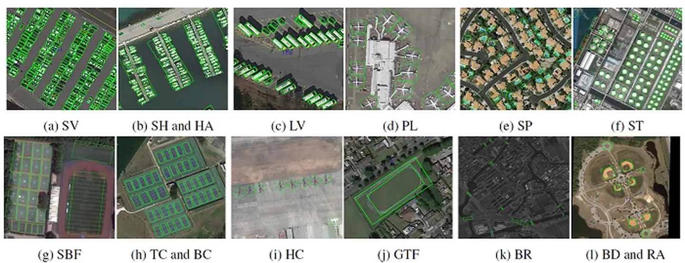

### 1.3.2 效率问题

社交媒体网络和移动可穿戴设备的流行导致了对视觉数据分析的需求不断增加。然而，移动可穿戴设备的计算能力和存储空间有限，因此高效的物体检测至关重要。因此，除了考虑高准确度还需要考虑处理时间，占用内存，消耗流量等方面的效率问题。

## 2. 目标检测算法分类

这里将目标检测方法分为3类∶

1. 基于锚点框的目标检测方法
2. 无锚点框的目标检测方法
3. 端到端的目标检测方法

> 端到端预测的目标检测方法属于无锚点框的目标检测方法。由于端到端预测的目标检测方法不需要后处理操作，大多采用转换器模型直接为每个目标预测一个检测结果，是一个更简洁的检测架构，将其单独归为一类进行详细介绍。

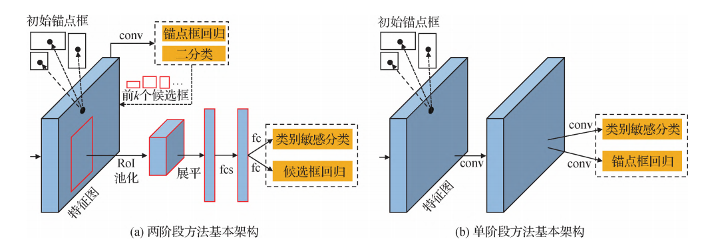

### 2.1 基于锚点框的目标检测方法

### 2.1.1 Two-stage目标检测算法

两阶段模型是指**有**独立地、显示地提取候选区域（region proposal）的过程，即先在输入图像上筛选出一些可能存在物体的候区域，然后针对每个候选区域，判断其是否存在物体，如果有就给出物体的类别和位置修正信息。一般而言,两阶段方法具有较高的检测精度,而单阶段方法具有较快的推理速度。

经典的Two-stage目标检测算法有：R-CNN、SPP-Net、Fast R-CNN、Faster R-CNN、R-FCN、FPN和Mask R-CNN等。

### 2.1.1.1 R-CNN

R-CNN ( Regional CNN ）是第一个将卷积神经网络用于目标检测的深度学习模型。它的主要思路是，首先使用无监督的选择性搜索（ Selective Search , SS ）方法将输入图像中具有相似颜色直方图特征的区域进行递归合并，产生约 $ 2000 $ 个候选区域；然后从输入图像中截取这些候选区域对应的图像，将其裁剪缩放至合适的尺寸，并相继送入一个 CNN 特征提取网络进行高层次的特征提取，提取出的特征再被送入一个 SVM 分类器进行物体分类，以及一个线性回归器进行边界框位置和大小的修正；最后对检测结果进行非极大值抑制（ Non - Maximum Suppression , NMS ）操作，得到最终的检测结果。

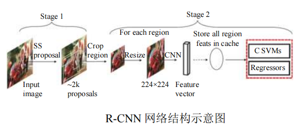

**R-CNN 缺点**:

4. 输入的图像大小会进行缩放, 导致图像失真;
5. 用选择性搜索算法提取约 $ 2000 $ 个候选区域,每个候选区域都要送入卷积神经网络提取特征, 计算量大耗时多;
6. 训练测试复杂, 候选区域提取、特征获取、分类和回归都是单独运行, 中间数据也是单独保存卷积提取的特征需单独存储, 占用大量硬盘空间。

### 2.1.1.2 SPPNet

SPPNet中的SPP是指空间金字塔池化（ Spatial Pyramid Pooling )。由于 R-CNN中的SVM分类器和线性回归器只接受固定长度的特征输入，这就要求之前由CNN提取的特征必须是固定维度的，进一步要求输入的图像也是固定尺寸的，这也是上文提到的 R-CNN 中要对候选区域图像进行裁剪或缩放至固定尺寸的原因。然而，这种操作会破坏截取图像的长宽比，并损失一些信息。针对这一缺陷， SPPNet 提出了空间金字塔池化层，该层被放置于 CNN 的末端，它可以接受任意尺寸的特征图作为输入，然后通过$ 3 $ 个窗口大小可变但窗口个数固定的池化层，最终输出具有固定尺寸的池化特征。此外， R-CNN 还存在另一个问题：它产生的大量候选区域往往是互相有重叠的，这表明特征提取过程存在大量的重复计算，进而导致了 R-CNN 的速度瓶颈。为解决该问题， SPPNet 在 R-CNN 的基础上，只进行一次全图的特征提取，而后每个候选区域对应的特征直接从全图特征中进行截取，然后送入空间金字塔池化层进行尺寸的统一。 SPPNet 的其他流程与 R-CNN 基本一致。

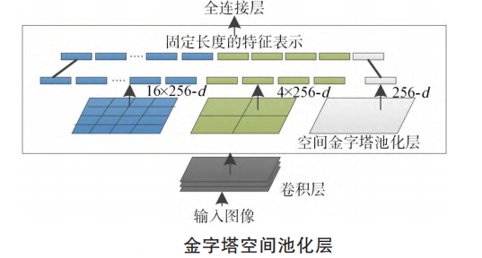

**SPP-Net 缺点:**

7. 训练数据的图像尺寸大小不一致, 使候选框感受野过大, 不可以使用反向传播有效的更新权重。
8. 网络微调只更新了全连接层, 不能实现端到端的检测且检测精度还需进一步提升。

### 2.1.1.3 Fast R-CNN

Girshick (2015) 认为R-CNN 和 SPPNet 特征提取和预测(分类和回归)是一个多阶段的过程,限制了深度神经网络的性能,并提出了 R-CNN的改进工作 Fast R-CNN。 Fast R-CNN的思想与SPPNet 几乎一致，主要区别在于 Fast R-CNN使用感兴趣区域池化（ Region-of-Interest Pooling）而非空间金字塔池化。同时， Fast R CNN 在得到了固定长度的特征后，使用全连接网络代替了之前的 SVM 分类器和线性回归器来进行物体分类和检测框修正，这样可以与前面用于提取特征的 CNN 构成一个整体，大大增强了检测任务的一体性，提高了计算效率。

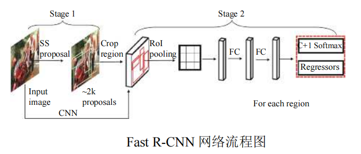

**Fast R-CNN 缺点:**

9. 通过选择性搜索算法提取候选区域耗费了较多时间；
10. 训练和预测所需时间仍较长, 不能实现实时性检测。

> 空间金字塔池化和RoI池化有什么区别？
> 两者起到的作用是相同的，即把不同尺寸的特征输入转化为相同尺寸的特征输出。SPP针对同一个输入使用了**多个不同尺寸的池化( **$ 4×4  * *, * * 2×2  * *, * * 1×1 $** )**操作，把不同尺度的结果拼接作为输出；而ROI Pooling可看作单尺度的SPP，对于一个输入只进行**一次池化**操作。
>
> **空间金字塔池化：**
>
> 对于一个通道数为 $ C $ 的feature map，首先取全局最大值，得到一个 $ 1×C $ 的张量，随后将feature map分割成 $ 4 $ 块，在每一块上进行最大池化，得到一个 $ 4×C $ 的张量，紧接着将feature map分成 $ 16 $ 块，在每块上进行最大池化，得到一个 $ 16×C $ 的张量，将这三个张量拼接起来，得到一个大小为 $ 21×C $ 的张量。对于任意大小的feature map经过这些操作都可以得到固定大小的张量。
>
> **RoI池化：**
>
> ROI pooling具体操作如下：
>
> 11. 根据输入image，将ROI映射到feature map对应位置；
> 12. 将映射后的区域划分为相同大小的sections（sections数量与输出的维度相同）；
> 13. 对每个sections进行max pooling操作；
>
> eg.考虑一个 $ 8×8 $ 大小的feature map，一个ROI，以及输出大小为 $ 2×2 $。
>
> 首先，**输入的固定大小的feature map** ，region proposal 投影之后位置（左上角，右下角坐标）：$ (0，3) ， (7，8) $，将其划分为 $ 2×2 $ 个sections(因为输出大小为 $ 2×2 $ )，最后对每个sections进行max pooling操作，就可以得到 $ 2×2 $ 的输出。
>
> 
>
> 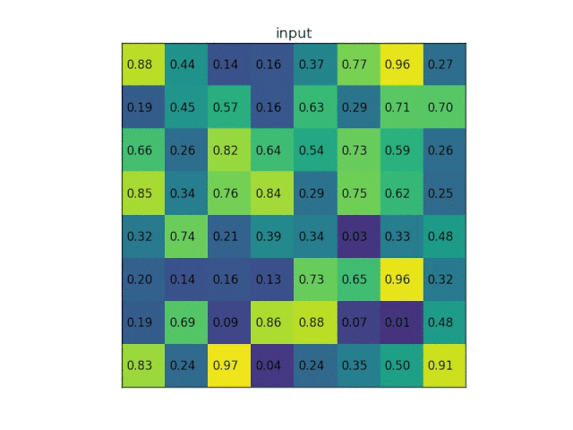

### 2.1.1.4 Faster R-CNN

Ren等人(2015)提出 Faster R-CNN,Faster R-CNN 在 Fast R-CNN 的基础上，将其最耗时的候选区域提取步骤（即选择性搜索）用一个区域候选网络（Region Proposal Network , RPN ）进行了替代，并且这个RPN和用于检测的 Fast R-CNN网络共享特征提取部分的权值。在 Faster R - CNN 中，一幅输入图像先由 RPN 提取候选区域，再取出各个候选区域对应的特征图，送入 Fast R-CNN （独立于 RPN 的后半部分）进行物体分类和位置回归。 Faster R - CNN 第一次做到了实时的物体检测，具有里程碑意义。

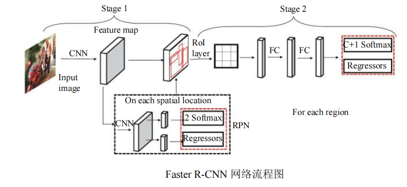

**Faster R-CNN 缺点:**

14. 获取候选区域, 再对每个候选区域分类计算量还是比较大;
15. 虽然速度有了提高,但还是没达到实时性检测的要求.

### 2.1.1.5 R-FCN

自AlexNet以来，CNN网络在卷积层之后会接上若干个全连接层，将卷积层产生的特征图映射成一个固定长度的特征向量。实际上，完全可以将全连接层看作是对整个特征图的卷积，即用卷积层代替全连接层，这种网络被称为全卷积网络（Fully Convolutional Networks，FCN）。如下图所示，若上方的图片的全连接层看作是通过 $ 4096 $ 个 $ 6×6 $ 的卷积核卷积得到的，那么对于大小不同的下方的图，同样的步骤得到的是一定尺寸的特征图像。

全连接层由于将所有特征信息都展开到一维，丧失了对检测目标位置的敏感性，目标检测不同于图像分类，需要精确的物体位置信息，这正是FCN网络所解决的问题。

Li等人提出的R-FCN 采用FCN网络结构，并用专门的卷积层构建位置敏感分数地图（position-sensitive score maps），在将全连接层变为一个卷积层同时，在该卷积层后生成若干敏感分数图，分别确定目标的左上区、左中区、左下区等 $ 9 $ 个位置，实现目标的精修。

R-FCN在数据集PASCAL VOC 2012的准确率达到82%，测试时每张图像耗时170ms，是当时最好的目标检测网络。

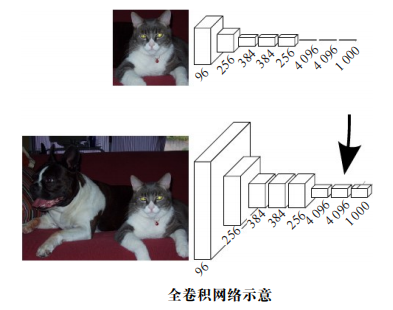

### 2.1.1.6 FPN

特征图金字塔网络FPN（Feature Pyramid Networks）是2017年提出的一种网络，FPN主要解决的是Faster RCNN物体检测算法在处理多尺度变化问题时的不足，Faster RCNN中无论是RPN网络还是Fast RCNN网络，都是基于单个高层特征（ $ conv4 $ ）。这种做法一个明显的缺陷是对小物体不友好。为了处理小物体，经典的方式是采用图像金字塔的方式在训练或测试阶段对图片进行多尺度变化增强，但是这样带来了极大的计算量,FPN通过简单的网络连接改变，在基本不增加原有模型计算量的情况下，大幅度提升了小物体检测的性能。

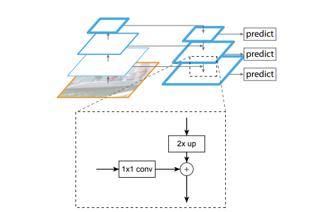

低层的特征语义信息比较少，但是目标位置准确；高层的特征语义信息比较丰富，但是目标位置比较粗略。另外虽然也有些算法采用多尺度特征融合的方式，但是一般是采用融合后的特征做预测，而FPN不一样的地方在于预测是在不同特征层独立进行的。另外，它的训练和测试时间和普通的Faster RCNN方法相差很小。因此，它可以作为图像特征金字塔的一种较好的替代。

### 2.1.1.7 Mask R-CNN

2017 年 He 等在 Faster R-CNN 的基础上再次改进,提出了 Mask R-CNN算法, 通过添加 Mask 分支, 能够同时实现目标检测和语义分割任务. 由于 Faster RCNN 在下采样和感兴趣池化层都采取了取整运算, 对检测任务产生了影响, 特别是对于像素级检测的任务。通过 RoI align 层替换 RoI Pooling 层, 使用双线性插值来确定非整数位置的像素, 使得每个感受野取得的特征能更好对齐原图感受野区域。此外 Mask R-CNN 采用基础网络 ResNet+FPN (Feature Pyramid Network) 来提取图像特征, 如下图所示, 在 COCO 数据集上的检测准确率从 Fast R-CNN 的 19.7% 提高至39.8%.

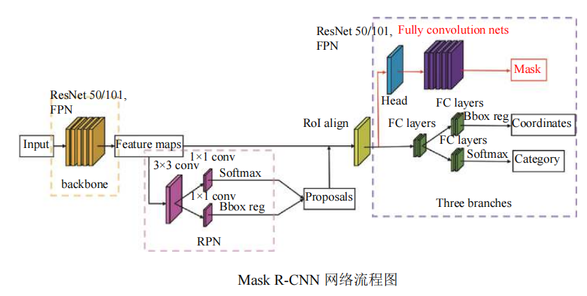

**Mask R-CNN 优点:**

Faster R-CNN网络的基础上增加了目标掩码作为输出量, 掩码是将一个对象的空间布局进行编码, 从而使得对目标的空间布局提取更精细。

**Mask R-CNN 缺点:**

分割分支增加了计算量, 导致 Mask R-CNN 比 Faster R-CNN 检测速度慢一些。

### 2.1.1.8 RCNN系列算法小结

16. RCNN解决了使用CNN进行目标定位问题；
17. Fast R-CNN解决了目标定位和分类同步问题；
18. Faster R-CNN解决了选择性搜索目标问题；
19. Mask R-CNN解决了同时进行目标定位、分类和分割问题。

### 2.1.2 One-stage目标检测算法

单阶段模型是指**没有**独立地、显示地提取候选区域（region proposal），直接由输入图像得到其中存在的物体的类别和位置信息的模型。

常见的One-stage目标检测算法有：YOLOv1、YOLOv2、YOLOv3、SSD和RetinaNet等。

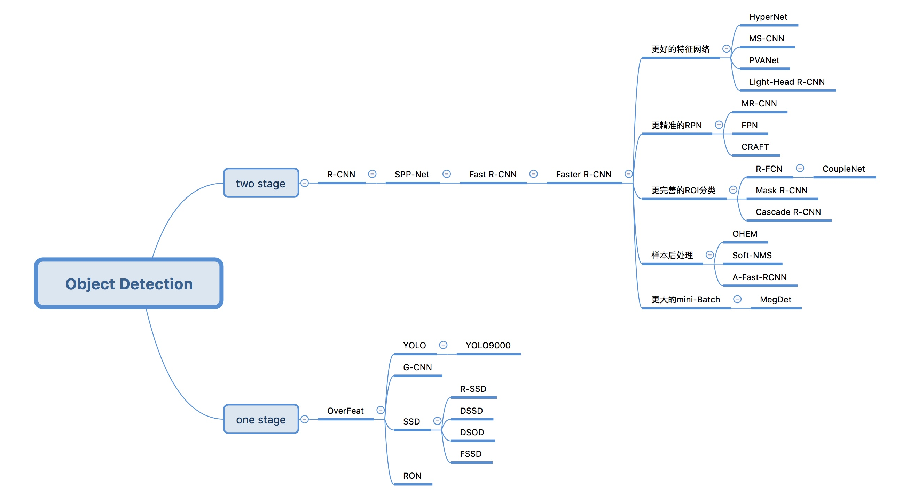

### 2.1.2.1 YOLOv1

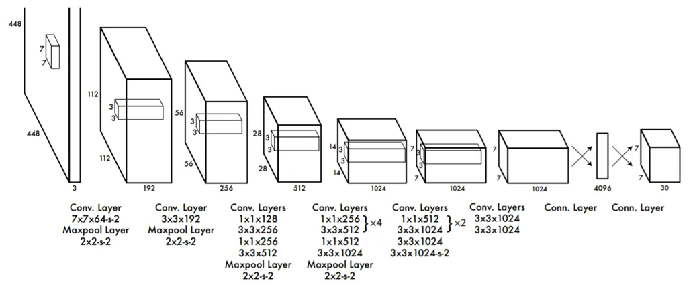

YOLO 的基本思想是使用一个端到端的卷积神经网络直接预测目标的类别和位置。相对于两步模型， YOLO 实时性高，但检测精度稍低。 YOLO 将输入图片划分成 $ S×S $ 的方格，每个方格需要检测出中心点位于该方格内的物体。在具体实施时，每个方格会预测 $ B $ 个边界框（包括位置、尺寸和置信度）。 YOLO 的主体网络结构参考 GoogLeNet ，由 $ 24 $ 个卷积层和 $ 2 $ 个全连接层组成。YOLO也被很多人称为one stage detection的开山之作。

### 2.1.2.2 SSD

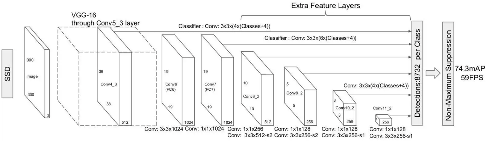

浅层特征图包含位置信息，对目标定位非常重要。深层特征图包含大量的语义信息，对图像目标的分类非常重要。受到该思想的影响，2016年Liu 等提出了SSD，开创了应用多尺度的特征图进行目标检测的先河，不同比例的特征图生成不同比例的预测。其中浅层的特征图用来预测小尺寸目标，深层的特征图用来预测大尺度目标，提升了小尺寸目标的检测效果。但是由于浅层特征图语义信息不够多，导致SSD对小目标检测效果还是很差。同时由于正负样本的不均匀，导致训练比较困难。

### 2.1.2.3 YOLOv2

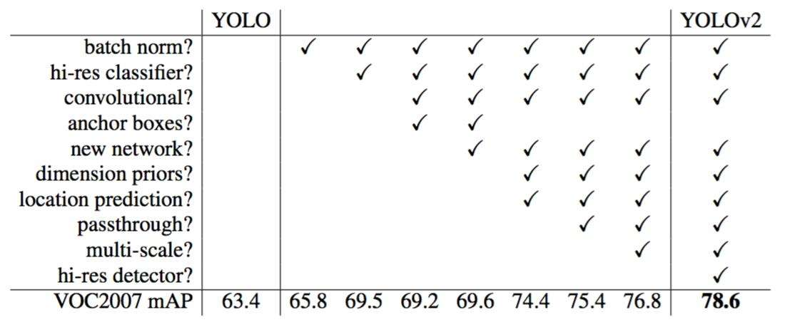

YOLOv2针对YOLOO的两个缺点，即低召回率和低定位准确率，进行了一系列的改进，下面简单介绍其中的几点。

- YOLOv2在卷积层后面加了批归一化（ BN ）层，以加快收敛速度，防止过拟合。
- YOLOv2的卷积特征提取器在进行检测任务前，先在高精度的图片上调优（ fine-tune )10个批次（ batch )，这样能使检测模型提前适应高分辨率图像。
- YOLOv2采用k-means 算法进行聚类获取先验锚框，并且聚类没有采用欧氏距离，而是有针对性地改进了距离的定义，使其更适合于检测任务

$ d ( box , centroid )=1-1OU( box , centorid )
$

- YOLOv2直接在预先设定的锚框上提取特征。 YOLO 使用卷积神经网络作为特征提取器，在卷积神经网络之后加上全连接层来预测边界框的中心位置、大小和置信度；而YOLOv2借鉴了 Faster R - CNN 的思路，用卷积神经网络直接在锚点框上预测偏移量和置信度，该方法要比 YOLO更简单、更容易学习。
- YOLOv2将输入图像的尺寸从 $ 448×448 $ 变成 $ 416×416 $ ,这是因为在真实场景中，图片通常是以某个物体为中心，修改输入图像的尺寸后，将整幅图像经过卷积层后变成 $ 13×13(416/32=13） $ 的特征图，长宽都是奇数，可以有效地识别出中心。
- YOLOv2在 $ 13×13 $ 的特征图上检测物体，对于小物体检测这个精度还远远不够。因此，YOLOv2还将不同大小的特征图结合起来进行物体检测。具体来说，YOLOv2将最后一个池化层的输入 $ 26×26×512 $ 经过直通层变成 $ 13×13×2048 $ 的特征图，再与池化后的 $ 13×13×1024 $ 特征图结合在一起进行物体检测。
- YOLOv2使用不同尺寸的图片同时训练网络。为了增强模型的鲁棒性，模型在训练过程中，毎隔10个批次就改变输入图片的大小。
- YOLOv2使用新的卷积特征提取网络 DarkNet-19。当时大多数检测模型的特征提取部分都采用 VGGNet-16作为网络主体， VGGNet-16虽然效果良好，但是参数过多，运行缓慢。 DarkNet-19采用 $ 3×3 $ 的卷积核，共有 $ 19 $ 个卷积层和 $ 5 $ 个池化层。

### 2.1.2.4 YOLO9000

YOLO9000可以实时地检测超过 $ 9000 $ 种物体，其主要贡献是使用检测数据集和分类数据集进行联合训练。检测数据集相对于分类数捉集来说，数据量小、类别少、类别粒度粗且获取困难，因此研究人员考虑使用分类和检测数据集进行联合训练，提高模型的泛化能力。然而，一般分类数据集的标签粒度要远小于检测数据集的标签粒度，为了能够联合训练，YOLO9000模型构建了字典树，合并 ImageNet 的分类数据集标签与 COCO 的检测数据集标签。

### 2.1.1.5 RetinaNet

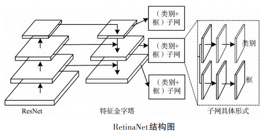

2017年Lin等发现了一阶段检测器精度落后二阶段检测器背后的原因并提出了RetinaNet。他们认为训练过程中遇到的样本类别失衡是导致一阶段检测器精度落后的主要原因。为此，通过重塑标准的交叉熵损失函数，引入了名为"$ Focal Loss $"的新损失函数。该损失函数降低了易分类样本的权重，以便检测器在训练过程中将更多的注意力放在分类困难的样本。使用ResNet-FPN的结构来进行特征提取，并在特征金字塔的每一层输出两个子网，分别用于分类和anchor框定位回归。实验证明经过focal损失函数训练之后，RetinaNet不仅速度能够与之前的一阶段检测器相匹配，同时超越了二阶段检测器的精度。

### 2.1.1.6 YOLOv3

YOLOv3在YOLOv2的基础上进行了一些小的改动来优化模型的效果。首先，检测数据可能存在一些语义上重叠的标签（如女人和人）,但 Softmax 函数基于一个假设，即每个检测框内的物体只存在一个类别。因此，YOLOv3使用二元交叉熵损失函数，而不是 Softmax 函数，这样可以更好地支持多标签的检测。其次，YOLOv3采用了更深的网络作为特征提取器，即 DarkNet -53，它包含了$ 53 $个卷积层。为了避免深层网络带来的梯度消失问题， DarkNet -53借鉴了残差网络的快捷连接( shortcut ）结构。同时，YOLOv3还采用了 $ 3 $ 个不同大小的特征图进行联合训练，使其在小物体上也能获得很好的检测效果。

### 2.2 无锚点框目标检测方法

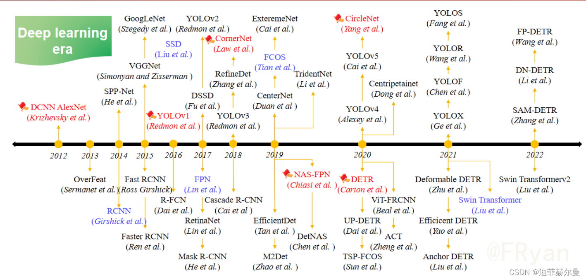

### 2.2.1 基于关键点的目标检测方法

### 2.2.1.1 CornerNet

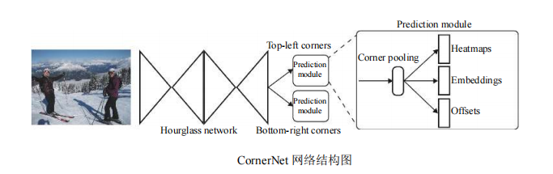

目前大部分常用目标检测算法（比如RCNN系列，SSD，YOLO系列等）都是基于锚框（即 anchor boxes）进行目标检测，引入锚框的缺点在于∶

20. 正负样本不均衡。大部分检测算法的锚框数量成千上万，而目标数量相对少很多，导致正样本数量会远远小于负样本。
21. 引入更多的超参数，比如anchor的数量、大小和宽高比等。

CornerNet算法消除了现有one stage检测算法中对锚框的需要，整个检测网络的训练从头开始并不基于预训练的分类模型，用户能够自由设计特征提取网络，不用受预训练模型的限制。同时该算法提出了一种新的池化方法（即corner pooling），能够帮助网络更好地定位边界框的角点，提高算法的检测精度。

### 2.2.1.2 ExtremeNet

基于CornerNet的思想，研究人员进行了一些改进工作。Zhou等人认为物体的角点通常位于物体外，缺少物体外观特征信息，为了解决这一问题，提出了基于极值点的目标检测器ExtremeNet，预测$ 4 *个类别敏感的极值点热图和* 1 $个类别敏感的中心点热图，并通过判断 $ 4 $ 个极值点对应的中心点响应值是否大于预定阈值来集成极值点。$ 4 $ 个极值点分别是左极值点、右极值点、上极值点和下极值点。

### 2.2.2 基于内部点的目标检测方法

### 2.2.2.1 FCOS

FCOS（Fully Convolutional One-Stage）是一个基于全卷积的检测网络，它利用一个新的分支"center-ness"来预测一个像素与对应对框中心的偏差，所得到的分数用于降低低质量检测框的权重，最后通过NMS（Non-Maximum Suppression）将接测结果进行融合。FCOS可以将语义分割和目标检测任务结合，除此之外，还可以对模型进行小幅度改造（例如，关键点检测）以应用于其他检索任务。

### 2.2.2.2 CenterNet

受到CornetNet的启发，Zhou等提出了Center-Net，同样没有使用锚框。CornerNet由于需要经过一对关键点的检测阶段，所以在检测速度上有所下降。而CenterNet将目标检测问题变成了一个中心点的估计问题，无需对关键点进行检测、分析和后期处理。它通过将对象建模成目标框的中心，并使用关键点估计找到中心，然后回归得到对象的大小、位置和方向甚至姿势。首先将图像传入卷积神经网络，得到一张热力图，热力图的分峰值点即中心点，然后利用峰值点附近的图像特征回归得到目标的宽高信息，最后通过输出结构得到预测值。

### 2.3 端到端预测的目标检测方法

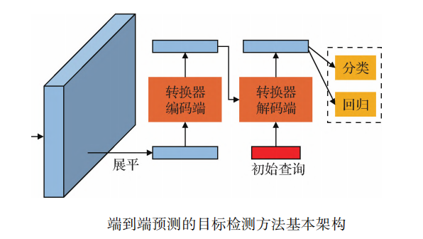

### 2.3.1 DETR

上述基于锚点框的目标检测方法和无锚点框的目标检测方法通常存在一个物体对多个检测框的情况。实际中，同一物体只需要保留一个检测框即可。因此，上述方法一般都需要进行非极大值抑制处理的操作，以便去除同一物体的冗余检测。近期，研究人员开始研究端对端预测的目标检测方法。该类方法直接端对端地为每个物体预测一个检测框。其中，最具有代表性的方法是Carion等人（2020）提出的基于转换器Transformer的目标检测方法DETR （detection transformer），如上图所示。DETR利用卷积神经网络提取特征，并基于Transformer编解码网络直接预测物体的位置以及分类得分。具体地，DETR 预先设定 $ N $ 个查询物体特征，然后将其与编码网络输出的特征共同送入解码网络生成 $ N $ 个预测的物体特征，最后利用预测头网络进行分类和回归。在训练过程中，为了能够将物体与预测结果一对一匹配，DETR采用基于匈牙利算法的二分匹配损失。

DETR缺点：收敛速度较慢、小尺度目标检测性能相 对较差等。

## 3. 目标检测基本流程

如图所示，基于深度学习的目标检测主要包括**训练**和**测试**两个部分。

### 3.1 训练部分

训练的主要目的是利用训练数据集进行检测网络的参数学习。训练数据集包含大量的视觉图像及标注信息（物体位置及类别）。如图（a）所示，训练阶段的主要过程包括数据预处理、检测网络以及标签匹配与损失计算等部分。

1）数据预处理。数据预处理旨在增强训练数据多样性，进而提升检测网络的检测能力。常用的数据增强手段有翻转、缩放、均值归一化和色调变化等。

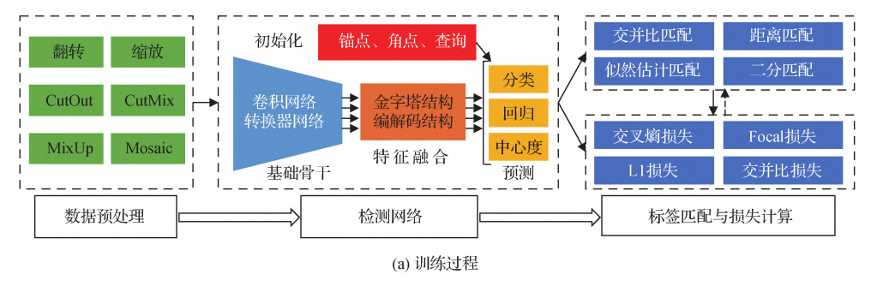

2）检测网络。检测网络一般包括基础骨干、特征融合及预测网络3部分。目标检测器的基础骨干通常采用用于图像分类的深度卷积网络，如AlexNet 、VGGNet、ResNet和DenseNet等。近期，研究人员开始采用基于Transformer的基础骨干网络，如ViT（vision transformer）、Swin和PVT（pyramid vision transformer）等。通常将大规模图像分类数据库ImageNet上的预训练权重作为检测器骨干网络的初始权重。

特征融合主要是对基础骨干提取的特征进行融合，用于后续分类和回归。常见的特征融合方式是特征金字塔结构。

最后，预测网络进行分类和回归等任务。在两阶段目标检测方法中，分类和回归通常采用全连接的方式，而在单阶段的方法中，分类和回归等通常采用全卷积的方式。与此同时，检测器通常还需要一些初始化，如锚点框初始化、角点初始化和查询特征初始化等。

3）标签分配与损失计算。标签分配主要是为检测器预测提供真实值。在目标检测中，标签分配的准则包括交并比（intersection over union，IoU）准则、距离准则、似然估计准则和二分匹配等。交并比准则通常用于基于锚点框的目标检测方法，根据锚点框与物体真实框之间的交并比将锚点框分配到对应的物体。距离准则通常用于无锚点框的目标检测方法，根据点到物体中心的距离将其分配到对应的物体。似然估计准则和二分匹配通常基于分类和回归的联合损失进行最优标签分配。基于标签分类的结果，采用损失函数计算分类和回归等任务的损失，并利用反向传播算法更新检测网络的权重。常用的分类损失函数有交叉熵损失函数、聚焦损失函数等，而回归损失函数有L1损失函数、平滑L1损失函数、交并比IoU损失函数、GIoU （generalized IoU）损失函数（Rezatofighi等，2019）和CIoU（complete-IoU）损失函数（Zheng等，2020）等。（在本文第8节会详细介绍IoU发展历程）

### 3.2 测试部分

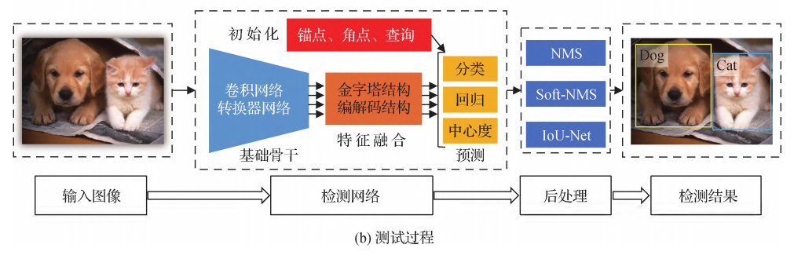

基于训练阶段学习的检测网络，在测试阶段输出给定图像中存在物体的类别以及位置信息。如图（b）所示，主要包括输入图像、检测网络和后处理等过程。对于一幅给定的图像，先利用训练好的检测网络生成分类和回归结果。一般而言，大部分目标检测方法在同一物体周围会生成多个检测结果。因此，大部分目标检测方法需要一个后处理步骤，旨在为每个物体保留一个检测结果并去除其他冗余的检测结果。最常用的后处理方法为非极大值抑制方法（non-maximum suppression，NMS）。

NMS 试图为每个物体保留一个分类得分最高的检测结果。Bodla等人（2017）认为NMS方法容易将距离较近的多个物体检测结果合并，造成部分物体漏检的问题。为解决这一问题，Bodla等人（2017）对NMS进行改进并提出Soft-NMS。该方法通过降低交并比高的检测结果的分类得分来抑制冗余检测。Jiang等人（2018）提出IoUNet，预测检测框与物体真实框之间的交并比，并根据预测的交并比值进行非极大值抑制。He等人（2018）提出学习检测框的定位方差，并利用定位方差线性加权邻近检测框来提升当前检测框的定位精度。（在本文第9节会详细介绍NMS发展历程）

## 4. 当前目标检测存在问题与解决方案

尽管目标检测算法整体上已经相对比较成熟了，但是在特殊场景下的表现还有很多优化空间，例如当被检测目标为小物体、被遮挡物体和密集分布物体等时，目标检测算法的表现与普通情况下有着显著的差距。下面将介绍这些问题的产生原因和常见解决方案。

### 4.1 小物体检测的解决方案

小物体的检测效果一直不好，主要是有三点

22. 小物体图像的分辨率低，导致特征表达能力弱。
23. 在使用锚框的检测器中，即使锚框完全的包围住了目标，也容易因为目标太小造成IoU低，从而导致目标没有对应的锚框。
24. 训练数据集中，只有少量图像包含小物体，这容易导致检测器偏向于更多地关注中型和大型物体。并且小物体覆盖区域小，缺乏位置多样性，难以在检测时间内被检测器识别到。

针对以上存在的不足，提出下面几点方法∶

25. 增加输入图像分辨率，这可以大幅度提升小物体的特征表达能力，使用多尺度特征融合方法，例如 FPN、STDN和BiFPN等。
26. 基于不同分辨率层使用不同锚定比例，利用AutoAnchor方法，使网络能自主学习配对锚框与目标。
27. 利用小物体对图像进行过采样，利用多次复制粘贴小物体来增强数据集。(与平铺图片类似)

### 4.2 被遮挡物体检测的解决方案

遮挡分为两类，**类间遮挡**和**类内遮挡**。遮挡导致特征表达不完整，增加了分类和定位的难度，一般是汽车和人群检测时容易发生遮挡现象。对于类间遮挡，很难有针对性的方法去解决，最好的方法是通过数据扩充来增加遮挡示例的数量，提高遮挡和变形监测的鲁棒性。

对于类内遮挡，主要有以下几种方法∶

28. 引入Reploss损失函数，奖励逼近真实框的预测框，惩罚接近具有不同指定目标的其他预测框；
29. 使用部分遮挡关注区域（PORoI）合并单元代替RoI合并层；
30. 利用IoU损失函数进行边界框预测，将预测框的四个边界作为一个整体进行回归。

### 4.3 密集分布物体检测的解决方案

目标检测器在密集分布物体上的检测效果不佳，主要是因为∶

31. 神经元的感受野通常沿轴排列并具有相同的形状，而物体通常具有不同的形状并沿各个方向排列；
32. 检测模型通常是在通用知识的基础上进行训练的，在测试时可能不能很好地概括处理特定的物体；
33. 位置接近的相似物体的预测框的位置难以确定；
34. 密集分布物体在经过NMS处理之后容易被视为单个对象。

针对前两个点不足，可以利用FSM（Feature Selection Modul）和DRH（Dynamic Refinement Head）解决。

对于后两个问题，有以下解决方法∶

35. 引入新颖的EM合并单元；
36. 使用Sofe-NMS，利用递减函数来衰减边界框的检测分数，确保NMS不会误删除候选框;
37. 引入新的网络替代NMS，可以减少NMS中的手工设计因素。

## 5. 目标检测的需求与应用

如今目标检测具有巨大的实用价值和应用前景。应用领域包括人脸检测、行人检测、车辆检测、飞机航拍或卫星图像中道路的检测、车载摄像机图像中的障碍物检测、医学影像在的病灶检测等。还有在安防领域中，可以实现比如安全帽、安全带等动态检测，移动侦测、区域入侵检测、物品看护等功能。

下面简单介绍几个较为典型的应用场景

### 5.1 人脸识别

人脸识别是基于人的面部特征进行身份识别的一种生物识别技术，通过采集含有人脸的图像或视频流，自动检测和跟踪人脸，进而对检测到的人脸进行识别，通常也叫作人像识别、面部识别。

人脸识别系统主要包括4个部分，分别为

38. 人脸图像采集/检测
39. 人脸图像预处理
40. 人脸图像特征提取
41. 身份匹配与识别

其中人脸图像采集/检测是进行后续识别的基础。如下图所示，通过检测框把后续识别算法的处理区域从整个图像限制到人脸区域。

### 5.2 智慧交通

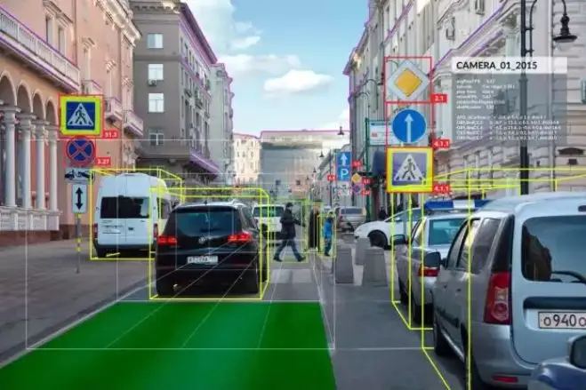

智慧交通是目标检测的一个重要应用领域，主要包括如下场景。

- 交通流量监控与红绿灯配时控制：通过视觉算法，对道路卡口相机和电警相机中采集的视频图像进行分析，根据相应路段的车流量，调整红绿灯配时策略，提升交通通行能力。
- 异常事件检测：通过视觉算法，检测各种交通异常事件，包括非机动车驶入机动车道、车辆占用应急车道以及监控危险品运输车辆驾驶员的驾驶行为、交通事故实时报警等，第一时间将异常事件上报给交管部门。
- 交通违法事件检测和追踪：通过视觉算法，发现套牌车辆、收费站逃费现象，跟踪肇事车辆，对可疑车辆行人进行全程轨迹追踪，通过视觉技术手段，极大地提升公安交管部门的监管能力。
- 自动驾驶：自动驾驶是当今热门的研究领域，是一个多种前沿技术高度交叉的研究方向，其中视觉相关算法主要包含对道路、车辆以及行人的检测，对交通标志物以及路旁物体的检测识别等。主流的人工智能公司都投入了大量的资源进行自动驾驶方面的研发，目前已经初步实现了受限路况条件下的自动驾驶，但距离实现不受路况、天气等因素影响的自动驾驶（L4级别），尚有相当大的一段距离。
在这里插入图片描述

从根本上看，交通场景中各种具体应用的底层实现，都是以目标检测技术为基础的，即对道路、车辆以及行人进行检测。

> 扩展：自动驾驶分级
> 
>
> 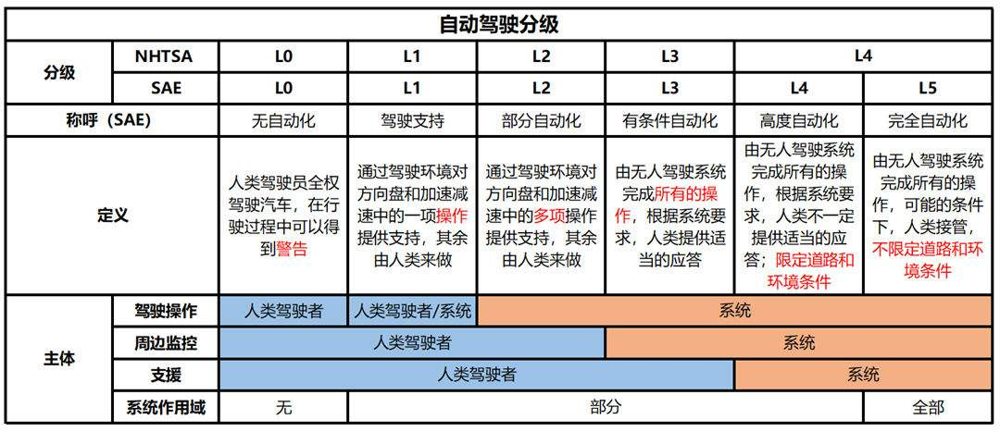

### 5.3 工业检测

工业检测是计算机视觉的另一个重要应用领域，在各个行业均有极为广泛的应用。在产品的生产过程中，由于原料、制造业工艺、环境等因素的影响，产品有可能产生各种各样的问题。其中相当一部分是所谓的外观缺陷，即人眼可识别的缺陷。

下图是电路板内层芯板断路示意图，明显可以看出图中铜导线有一个断开的部分。

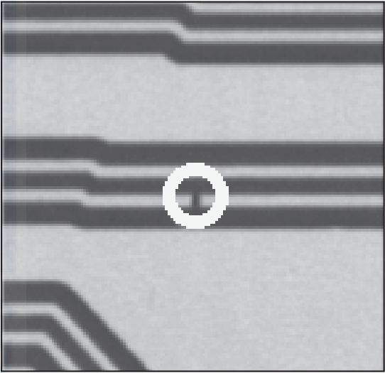

在传统生产流程中，外观缺陷大多采用人工检测的方式进行识别，不仅消耗人力成本，也无法保障检测效果。

工业检测就是利用计算机视觉技术中的目标检测算法，把产品在生产过程中出现的裂纹、形变、部件丢失等外观缺陷检测出来，达到提升产品质量稳定性、提高生产效率的目的。

## 6. 目标检测的常用数据集

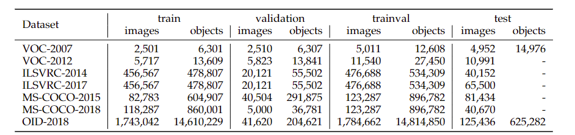

### 6.1 PASCAL VOC

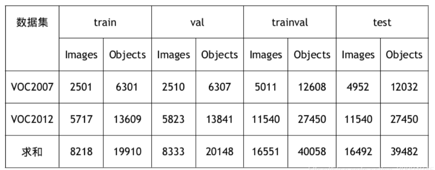

VOC数据集是目标检测经常用的一个数据集，自2005年起每年举办一次比赛，最开始只有 $ 4 $ 类，到2007年扩充为 $ 20 $ 个类，共有两个常用的版本：2007和2012。目前VOC常用的是VOC2007和VOC2012数据集，因为二者是互斥的，论文中的常用组合有以下几种：

- 07+12：使用VOC2007和VOC2012的 train + val ($ 16551 ）*上训练*，*然后使用VOC*2007*的test*( 4952 $)测试
- 07++12:使用VOC2007的 train + val + test ($ 9963 ）*相VOC*2012*的train* + *val*( 11540 $）训练然后使用VOC2012的 test 测试，这种法需提交到 PASCAL VOC Evaluation Server 上评估结果，因为VOC2012 test 没有公布。
- 07+12+ COCO 先在 MS COCO 的 trainval 上预训练，再使用VOC2007和VOC2012的 raineval 微调，然后使用VOC2007的 test 测试。
- 07++12+ COCO ：先在 MS COCO 的 trainval 上预训练，再使用VOC2007的 traintval + test 和VOC2012的train + val 微调训练，然后使用VOC2012的 test 测试，这种方法需提交到 PASCAL VOC Evaluation Server 上评估结果，因为VOC2012 test 没有公布。

数据集地址：[PASCAL Visual Object Classes](http://host.robots.ox.ac.uk/pascal/VOC/)

### 6.2 ImageNet

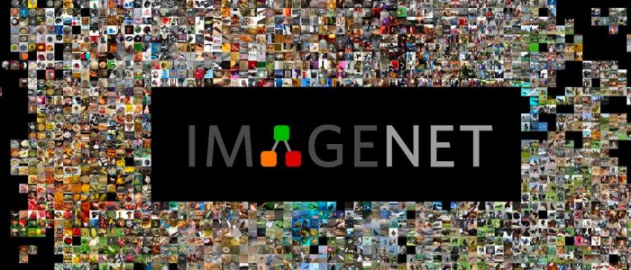

ImageNet是一个计算机视觉系统识别项目， 是目前世界上图像识别最大的数据库。ImageNet是美国斯坦福的计算机科学家模拟人类的识别系统建立的。能够从图片识别物体。Imagenet数据集文档详细，有专门的团队维护，使用非常方便，在计算机视觉领域研究论文中应用非常广，几乎成为了目前深度学习图像领域算法性能检验的"标准"数据集。ImageNet 中目前共有 $ 14,197,122 $ 幅图像，总共分为 $ 21,841 $ 个类别，通常我们所说的 ImageNet 数据集其实是指 ISLVRC2012 比赛用的子数据集，其中 train 有 $ 1,281,167 $ 张照片和标签，共 $ 1000 $ 类，大概每类 $ 1300 $ 张图片，val 有 $ 50,000 $ 副图像，每类 $ 50 $ 个数据，test 有 $ 100,000 $ 副图片，每类 $ 100 $ 个数据。

数据集地址：[ImageNet](https://image-net.org/index.php)

### 6.3 MS COCO

COCO数据集是微软团队发布的一个可以用来图像recognition+segmentation+captioning 数据集，该数据集收集了大量包含常见物体的日常场景图片，并提供像素级的实例标注以更精确地评估检测和分割算法的效果，致力于推动场景理解的研究进展。依托这一数据集，每年举办一次比赛，现已涵盖检测、分割、关键点识别、注释等机器视觉的中心任务，是继ImageNet Chanllenge以来最有影响力的学术竞赛之一。

相比ImageNet，COCO更加偏好目标与其场景共同出现的图片，即non-iconic images。这样的图片能够反映视觉上的语义，更符合图像理解的任务要求。而相对的iconic images则更适合浅语义的图像分类等任务。

COCO的检测任务共含有 $ 80 $ 个类，在2014年发布的数据规模分 $ train/val/test $ 分别为 $ 80k/40k/40k $ ，学术界较为通用的划分是使用train和 $ 35k $ 的val子集作为训练集 $ （trainval35k） $，使用剩余的val作为测试集（minival），同时向官方的evaluation server提交结果（test-dev）。除此之外，COCO官方也保留一部分test数据作为比赛的评测集。

数据集地址：[COCO](https://cocodataset.org/#home)

### 6.4 Google Open Image

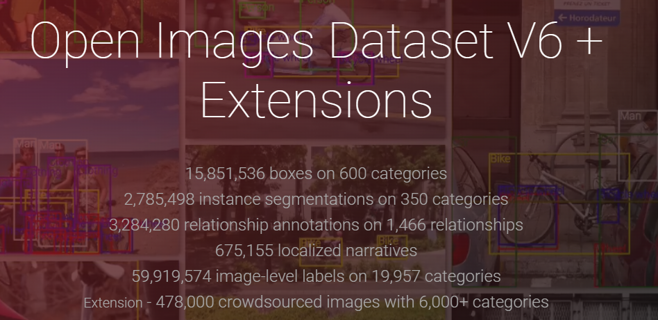

Open Image是谷歌团队发布的数据集。 2020年2月发布的V6版本，上面有图像级别的标签、物体边界框、物体分割掩码、视觉关系和本地化的叙述。

- 它包含了 $ 190 $ 万张图片上 600 个物体类别的16M个边界框，使其成为现有的最大的带有物体位置注释的数据集。这些方框主要是由专业注释者手工绘制的，以确保准确性和一致性。这些图像非常多样化，通常包含有多个物体的复杂场景（平均每张图像8.3个）。
- Open Image还提供了视觉关系注释，表明特定关系的物体对（如 "弹吉他的女人"、"桌上的啤酒"）、物体属性（如 "桌子是木制的"）和人类行为（如 "女人在跳"）。
- 在V5中，Open Image为350个类中的280万个对象实例添加了分割掩码。分割掩码标志着物体的轮廓，它以更高的细节水平来描述其空间范围。
- 在V6中，Open Image增加了675k个本地化叙述：对图像的多模态描述，包括同步的语音、文字和在被描述物体上的鼠标痕迹。
- 最后，该数据集有5990万个图像级别的标签，横跨19957个类别。

数据集地址：[Open Images V6](https://storage.googleapis.com/openimages/web/index.html)

### 6.5 DOTA

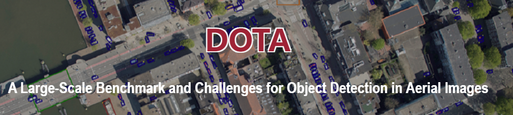

DOTA是遥感航空图像检测的常用数据集，包含2806张航空图像，尺寸大约为 $ 4k×4k $ ，包含 15个类别共计 188282个实例，其中 14个主类，small vehicle 和 large vehicle都是vehicle的子类。其标注方式为四点确定的任意形状和方向的四边形。航空图像区别于传统数据集，有其自己的特点，如：尺度变化性更大；密集的小物体检测；检测目标的不确定性。数据划分为$ 1/6 *验证集*， 1/3 $ 测试集， $ 1/2 $ 训练集。目前发布了训练集和验证集，图像尺寸从 $ 800×800 $ 到 $ 4000×4000 $ 不等。

数据集地址:[DOTA](https://captain-whu.github.io/DOTA/index.html)

### 6.6 其它数据集

### 6.6.1 行人检测数据集

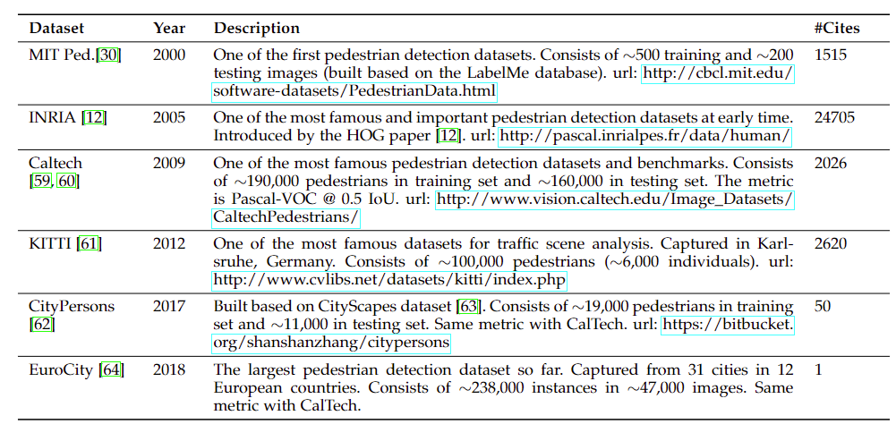

### 6.6.2 人脸检测数据集

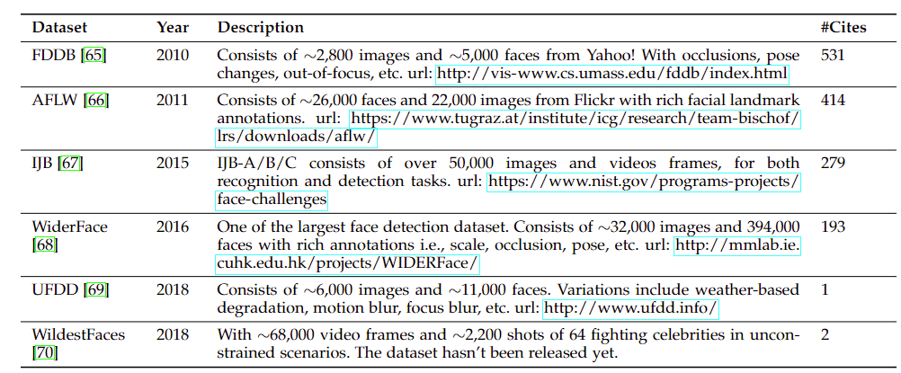

### 6.6.3 文本检测数据集

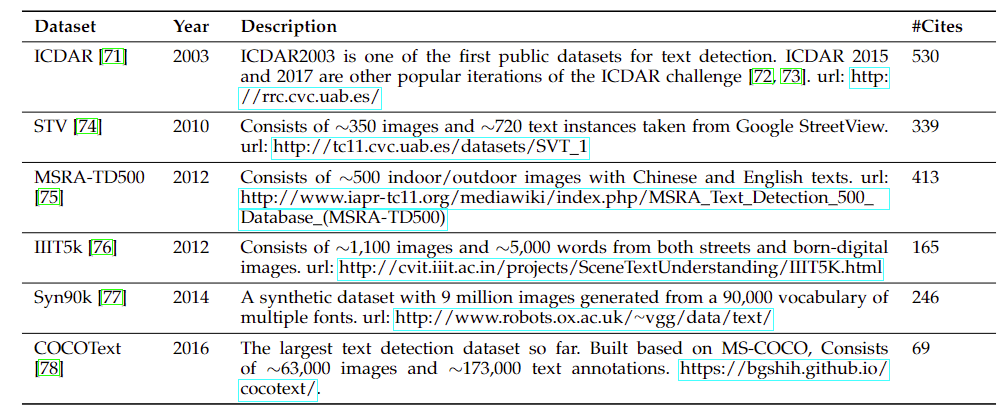

### 6.6.4 交通信号灯检测数据集

### 6.6.5 遥感目标检测数据集

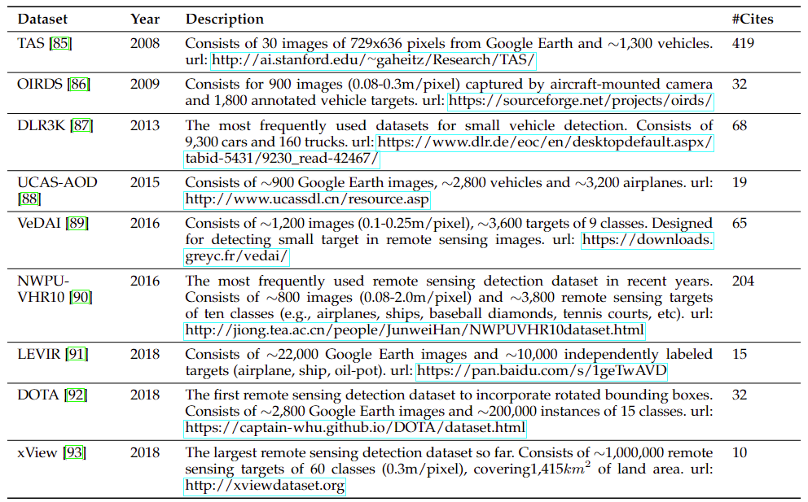

## 7. 目标检测的评价指标

### 7.1 TP、TN、FP和FN

T代表True；F代表False；P代表Positive；N代表Negative。

T或者F代表的是**该样本是否被正确分类**。

P或者N代表的是**该样本被预测成了正样本还是负样本**。

- TP（True Positives）意思就是被分为了正样本，而且分对了。
- TN（True Negatives）意思就是被分为了负样本，而且分对了。
- FP（False Positives）意思就是被分为了正样本，但是分错了（事实上这个样本是负样本）。
- FN（False Negatives）意思就是被分为了负样本，但是分错了（事实上这个样本是正样本）。

在mAP计算的过程中主要用到了TP、FP、FN这三个概念。

### 7.2 Precision和Recall

TP是分类器认为是正样本而且确实是正样本的例子，FP是分类器认为是正样本但实际上不是正样本的例子，Precision翻译成中文就是"**分类器认为是正类并且确实是正类的部分占所有分类器认为是正类的比例**"。

$ =
$

TP是分类器认为是正样本而且确实是正样本的例子，FN是分类器认为是负样本但实际上不是负样本的例子，Recall翻译成中文就是"**分类器认为是正类并且确实是正类的部分占所有确实是正类的比例**"。

$ =
$

### 7.3 评价指标计算案例

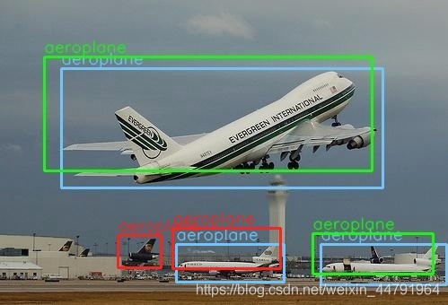

如图所示，**蓝色的框是 真实框**。**绿色和红色的框是 预测框**，绿色的框是正样本，红色的框是负样本。一般来讲，当预测框和真实框IOU>=0.5时，被认为是正样本。

因此对于这幅图来讲。真实框一共有3个，正样本一共有2个，负样本一共有2个。此时

$ ==1 / 2
$

$ ==2 / 3
$

**置信度**:

在目标检测算法里面有一个非常重要的概念是置信度，如果置信度设置的高的话，预测的结果和实际情况就很符合，如果置信度低的话，就会有很多误检测。

假设一幅图里面总共有3个正样本，目标检测对这幅图的预测结果有10个，其中3个实际上是正样本，7个实际上是负样本。对应置信度如下。

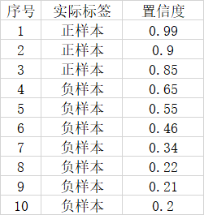

如果我们将可以接受的置信度设置为0.95的话，那么目标检测算法就会将序号为1的样本作为正样本，其它的都是负样本。此时TP = 1，FP = 0，FN = 2。

$ ==1 / 2
$

$ ==1
$

### 7.4 AP和mAP

AP事实上指的是，利用不同的Precision和Recall的点的组合，画出来的曲线下面的面积。

如下面这幅图所示。

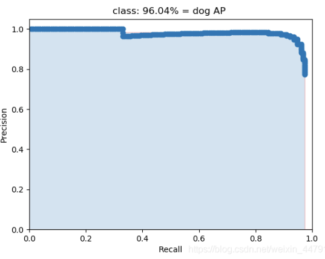

当我们取不同的置信度，可以获得不同的Precision和不同的Recall，当我们取得置信度够密集的时候，就可以获得非常多的Precision和Recall。

此时Precision和Recall可以在图片上画出一条线，这条线下部分的面积就是某个类的AP值。

mAP就是所有的类的AP值求平均。

> AP(Average Precision)是单个类别平均精确度，而mAP是所有类别的平均精确度。

### 7.5 mAP@0.5和mAP@0.5:0.95

$ = {n}
$

mAP@0.5即将IoU设为0.5时，计算每一类的所有图片的AP，然后所有类别求平均。

mAP@0.5:0.95表示在不同IoU阈值（从0.5到0.95，步长0.05）（0.5、0.55、0.6、0.65、0.7、0.75、0.8、0.85、0.9、0.95）上的平均mAP。

## 8. IoU

### 8.1 IoU出现背景

目标检测任务的损失函数一般由Classificition Loss（分类损失函数）和Bounding Box Regeression Loss（回归损失函数）两部分构成。因此，更好的定位有利于模型精度的提高。在`IoU Loss`提出来之前，检测上有关候选框的回归主要是通过坐标的回归损失来优化。但`L1 Loss`和`L2 Loss`存在比较大的问题：

42. **L1 Loss的问题**：损失函数对x的导数为常数，在训练后期，x很小时，如果learning rate 不变，**损失函数会在稳定值附近波动，很难收敛到更高的精度**。
43. **L2 Loss的问题**：损失函数对x的导数在x值很大时，其导数也非常大，在**训练初期不稳定**。

而且，基于`L1/L2 Loss`的坐标回归不具有尺度不变性，且并没有将四个坐标之间的相关性考虑进去。因此，像`L1/L2 Loss`直接的坐标回归实际上很难描述两框之间的相对位置关系。

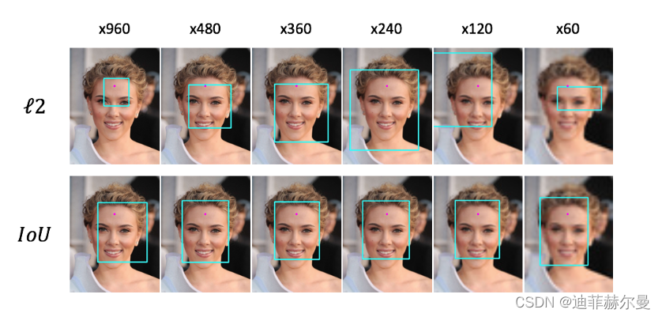

因此，在ACM2016的论文中提出了`IoU loss`，它将四个坐标点看成一个整体进行计算，具有尺度不变性（也就是对尺度不敏感）。`IoU Loss`的定义是先求出预测框和真实框之间的交集和并集之比，再求负对数，但是在实际使用中我们常常将`IoU Loss`写成`1-IoU`。如果两个框重合则交并比等于`1`，`Loss`为0说明重合度非常高。因此，`IoU`的取值范围为`[0,1]`。

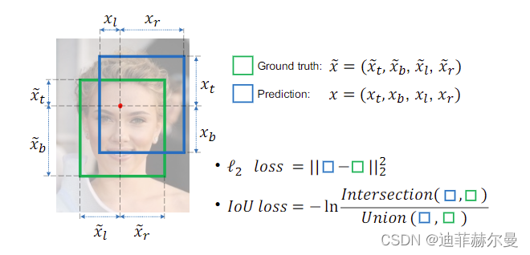

### 8.2 什么是IoU？

`IOU`的全称为交并比（Intersection over Union），是目标检测中使用的一个概念，`IoU`计算的是"预测的边框"和"真实的边框"的交叠率，即它们的交集和并集的比值。最理想情况是完全重叠，即比值为1。

$ I o U=
$

### 8.3 IoU发展历程

虽然`IoU Loss`虽然解决了`Smooth L1`系列变量相互独立和不具有尺度不变性的两大问题，但是它也存在两个问题：

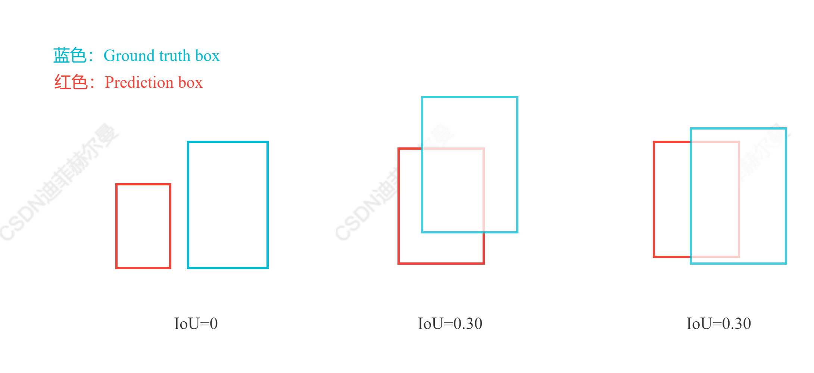

44. 当预测框和目标框不相交时，即IoU(A,B)=0时，不能反映A,B距离的远近，此时损失函数不可导，`IoU Loss` 无法优化两个框不相交的情况。
45. 如上图三个框，假设预测框和目标框的大小都确定，只要两个框的相交值是确定的，即其`IoU`值相同时，`IoU`值不能反映两个框是如何相交的。

### 8.3.1 GIoU（CVPR2019）

针对`IoU`无法反映两个框是如何相交的问题，`GIoU`通过引入预测框和真实框的最小外接矩形（类似于图像处理中的闭包区域）来获取预测框、真实框在闭包区域中的比重。这样子，`GIoU`不仅可以关注重叠区域，还可以关注其他非重合区域，能比较好的反映两个框在闭包区域中的相交情况。

$ ∣ C ∣ L_{G I O U}=1-I O U+
$

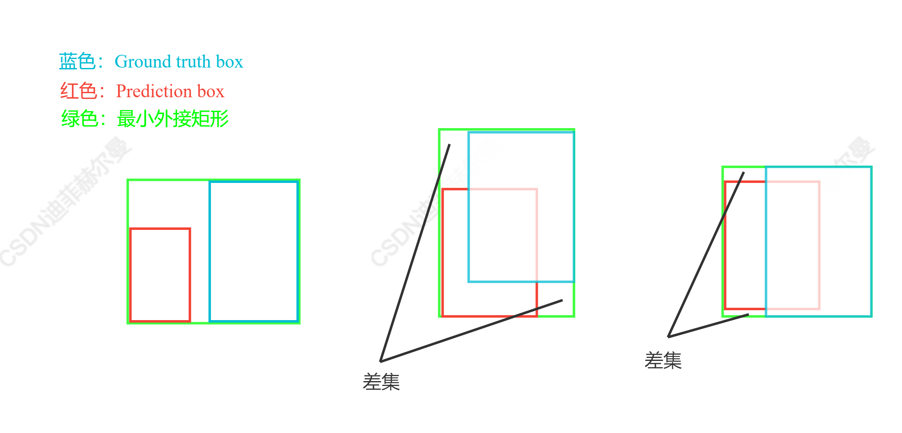

从公式上来看，`GIoU`是一种`IoU`的下界，取值范围`[-1,1]`。在两者重合的时候取最大值`1`，在两者无交集且无限远的时候取最小值`-1`。因此，与`IoU`相比，`GIoU`是一个比较好的距离度量指标。

### 8.3.2 DIoU（AAAI2020）

虽然`GIoU`通过引入闭包区域缓解了预测框与真实框相交位置的衡量问题，但其实际上仍存在两个问题：

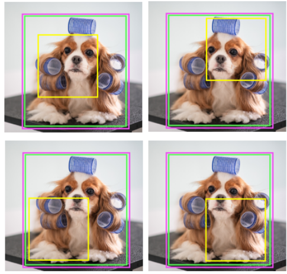

46. 对每个预测框与真实框均要去计算最小外接矩形，计算及收敛速度受到限制
47. 当预测框在真实框内部时，`GIoU`退化为`IoU`，也无法区分相对位置关系

因此，考虑到`GIoU`的缺点，`DIoU`在`IoU`的基础上直接回归两个框中心点的欧式距离，加速了收敛速度。`DIoU`的惩罚项是基于中心点的距离和对角线距离的比值。这样就避免了`GIoU`在两框距离较远时产生较大闭包时所造成的`Loss`值较大而难以优化的情况。

$ _{D I o U}=1-I o U+
$

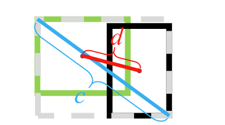

### 8.3.3 CIoU（AAAI2020）

虽然`DIoU Loss`通过中心点回归缓解了两框距离较远时难优化的问题，但`DIoU Loss`仍存在两框中心点重合，但宽高比不同时，`DIoU Loss`退化为`IoU Loss`的问题。因此，为了得到更加精准的预测框，`CIoU`在`DIoU`的基础上增加了一个影响因子，即增加了预测框与真实框之间长宽比的一致性的考量。

$ L_{CIOU}=1 - IOU++v
$

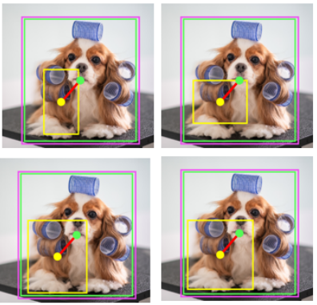

比如上面三种情况，目标框包裹预测框，本来`DIoU`可以起作用。

但预测框的中心点的位置都是一样的，因此按照`DIoU`的计算公式，三者的值都是相同的。

`CIoU Loss`虽然考虑了边界框回归的重叠面积、中心点距离及长宽比。但是其公式中的v反映的时长宽比的差异，而不是宽高分别与其置信度的真实差异，所以有时会阻碍模型有效的优化。

### 8.3.4 EIoU（arXiv2021）

`EIoU`在`CIoU`的基础上将长宽比拆开，明确地衡量了三个几何因素的差异，即重叠区域、中心点和边长，同时引入`Fcoal loss`解决了难易样本不平衡的问题。

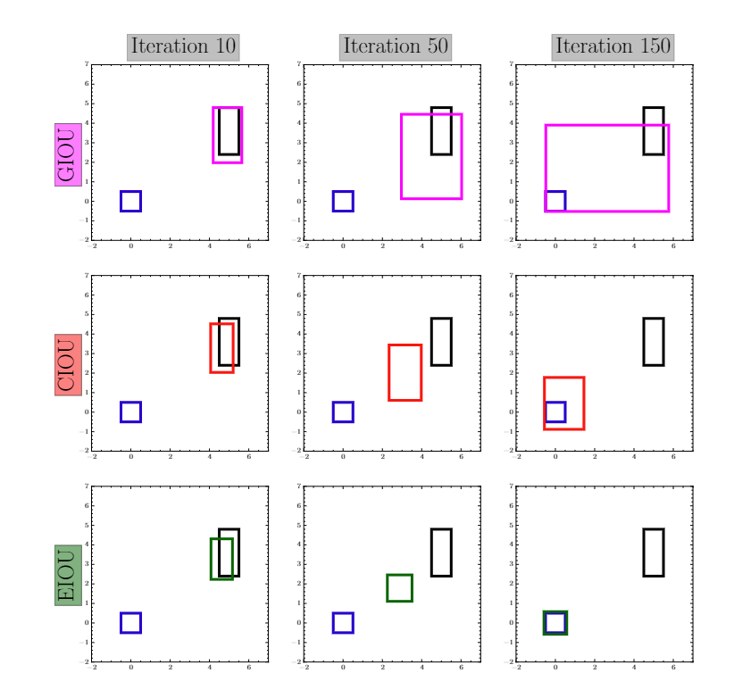

$

$

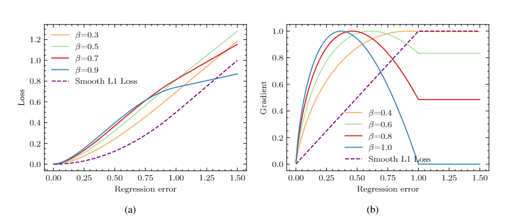

### 8.3.5 αIoU（NeurlPS2021）

`αIoU`将现有的基于`IoU` 的损失进行了一个推广

使得`αIoU`可以显着超越现有的基于 `IoU` 的损失，通过调节`α`，使探测器更灵活地实现不同水平的`bbox`回归精度，并且`αIoU`对小数据集和噪声的鲁棒性更强

$

$

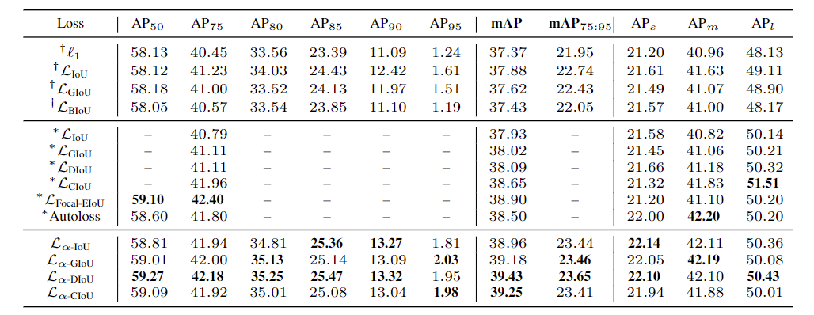

### 8.3.6 SIoU（arXiv2022）

传统的目标检测损失函数依赖于边界框回归指标的聚合，例如预测框和真实框（即 `GIoU、CIoU、ICIoU` 等）的距离、重叠区域和纵横比。然而，迄今为止提出和使用的方法都没有考虑期望的真实框和预测框之间不匹配的方向。这种不足导致收敛速度较慢且效率较低，因为预测框在训练过程中可能会"四处游荡"，最终会产生一个更差的模型。

`SIoU`提出了一种新的损失函数，重新定义了惩罚度量，考虑了期望回归之间的向量夹角。

`SIoU`损失函数由4个成本函数组成

- `Angle cost`

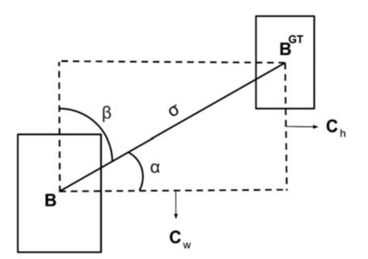

$ = 1-2 * ^{2}((x)-)
$

- `Distance cost`

$

$

- `Shape cost`

$

$

- `IoU cost`

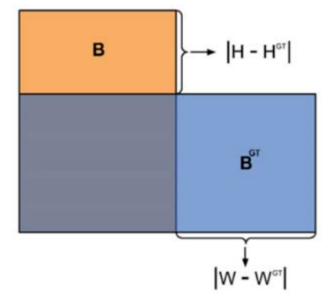

$ I o U=
$

最后SIoU Loss的回归损失函数为：

$ L_{b o x}=1-I o U+
$

将 `SIoU` 应用于 `COCO-train/COCO-val` 与其他损失函数相比，提高了 `+2.4%` (mAP@0.5:0.95) 和 +3.6%(mAP@0.5)。

## 9. NMS

### 9.1 什么是NMS？

在执行目标检测任务时，算法可能对同一目标有多次检测。`NMS`是一种让你确保算法只对每个对象得到一个检测的方法，即"清理检测"。如下图所示：

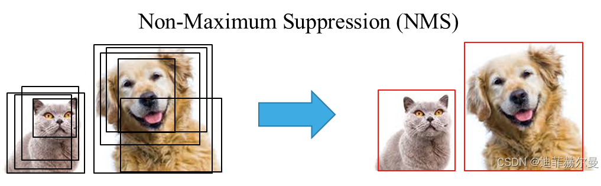

> 如果用一句话概括NMS的意思就是：筛选出一定区域内属于同一种类别得分最大的框

### 9.2 NMS算法流程

**NMS 算法的大致过程**：每轮选取置信度最大的 Bounding Box ，接着关注所有剩下的 BBox 中与选取的 BBox 有着高重叠（IoU）的，它们将在这一轮被抑制。这一轮选取的 BBox 会被保留输出，且不会在下一轮出现。接着开始下一轮，重复上述过程：选取置信度最大 BBox ，抑制高 IoU BBox。

**NMS 算法流程**：这是一般文章中介绍的 NMS，比较难懂。但实际上 NMS 的实现反而简单很多。

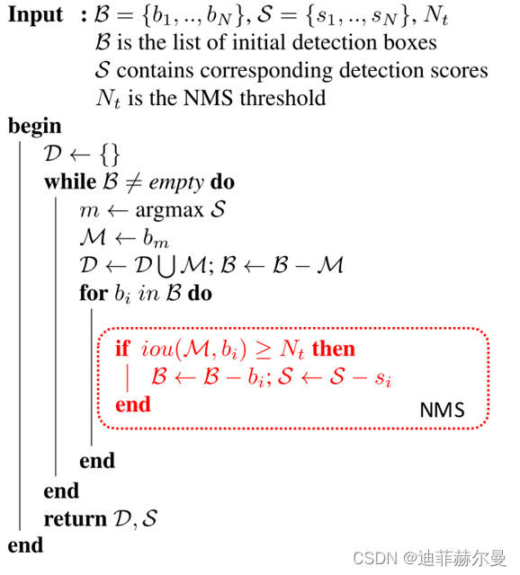

### 9.3 NMS 过程图例

- 单类别 NMS 的例子：有两只狗，怎样用 NMS 保证只留下两个 BBox？
- 多类别 NMS 的例子，有1只狗1只猫，我们怎么用NMS将侦测到的物件框将把猫和狗框出来。

### 9.3.1 单类别例子

**1）理解 BBox 输入或输出格式，通常会见到两种格式：**

- 第一种，BBox 中心位置 $ (x,y) $ + BBox 长宽 $ (h,w) $ + Confidence Score；
- 第二种，BBox 左上角点 $ (x1,y1) $ + BBox 右下角点 $ (x2,y2) $ + Confidence Score；

两种表达的本质是一样的，均为五个变量。与 BBox 相关的四个变量用于计算 IoU，Confidence Score 用于排序。

**2）理解评估重叠的 IoU 指标，即"交并比"，如下图所示：**

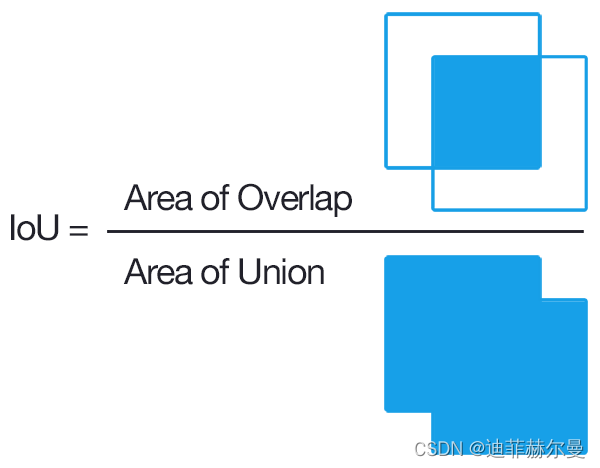

**3）步骤：**

第一步：对 BBox 按置信度排序，选取置信度最高的 BBox（所以一开始置信度最高的 BBox 一定会被留下来）；

第二步：对剩下的 BBox 和已经选取的 BBox 计算 IoU，淘汰（抑制） IoU 大于设定阈值的 BBox（在图例中这些淘汰的 BBox 的置信度被设定为0）。

第三步：重复上述两个步骤，直到所有的 BBox 都被处理完，这时候每一轮选取的 BBox 就是最后结果。

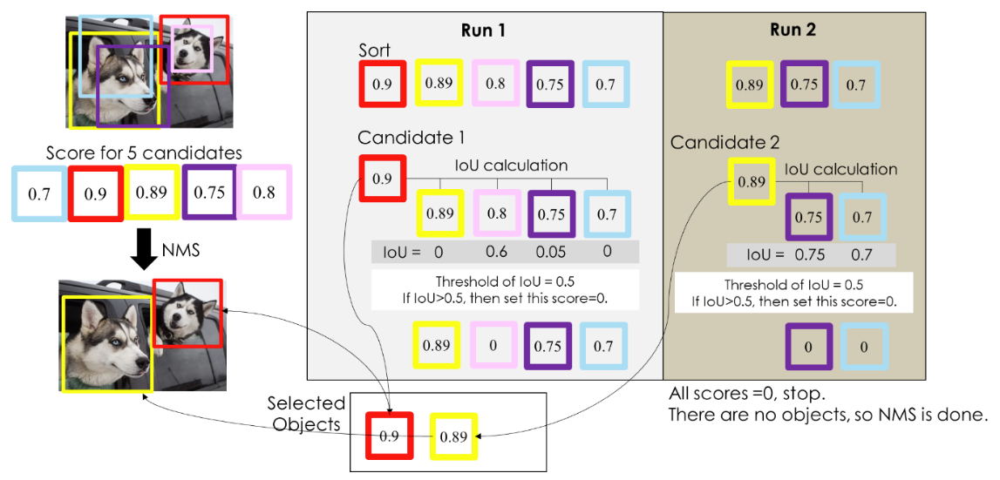

具体流程

48. 「确定是物体集合」= {空集合}
49. Run 1: 先将BBox依照置信度排序，置信度最高的BBox (红色) 会被选入「确定是物体集合」內，其他BBox会根据这步骤选出最高的BBox进行IoU计算，如果粉红色的IoU为0.6大于我们设定的0.5，所以将粉红色的BBox置信度设置为0。
此时「确定是物件集合」= {红色BBox }
50. Run 2: 不考虑置信度为0和已经在「确定是物体集合」的BBox，剩下來的物体继续选出最大置信度的BBox，将此BBox(黄色)丟入「确定是物体集合」，剩下的BBox和Run2选出的最大置信度的BBox计算IoU，其他BBox都大于0.5，所以其他的BBox置信度設置为0。
此时「确定是物件集合」= {红色BBox; 黄色BBox}
51. 因为沒有物体置信度>0，所以结束NMS。
「确定是物件集合」= {红色BBox; 黄色BBox}。

在上面这个例子中，NMS 只运行了两轮就选取出最终结果：第一轮选择了红色 BBox，淘汰了粉色 BBox；第二轮选择了黄色 BBox，淘汰了紫色 BBox 和青色 BBox。注意到这里设定的 IoU 阈值是0.5，假设将阈值提高为0.7，结果又是如何？

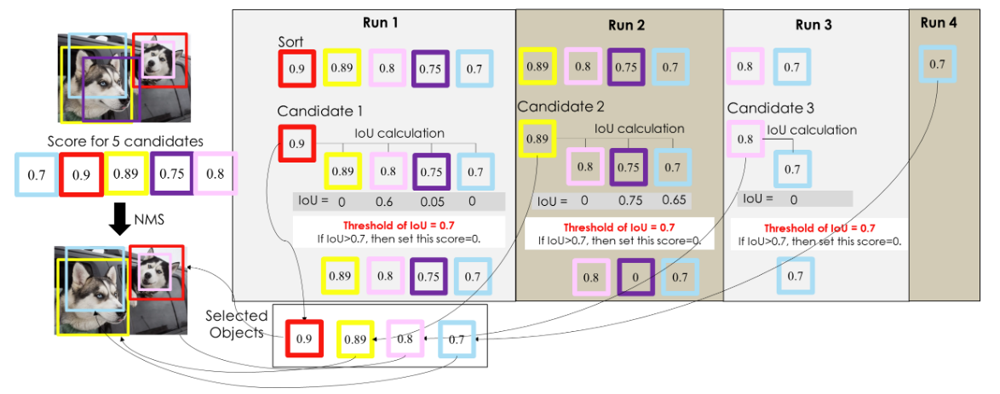

可以看到，NMS 用了更多轮次来确定最终结果，并且最终结果保留了更多的 BBox，但结果并不是我们想要的。因此，在使用 NMS 时，IoU 阈值的确定是比较重要的，但一开始我们可以选定 default 值（论文使用的值）进行尝试。由此可以知道，如果IoU阈值设定太高，可能会造成物件重复检测的问题。

### 9.3.2 多类别例子

第二个例子，有1只狗1只猫，我们怎么用NMS将侦测到的物件框将把猫和狗框出来

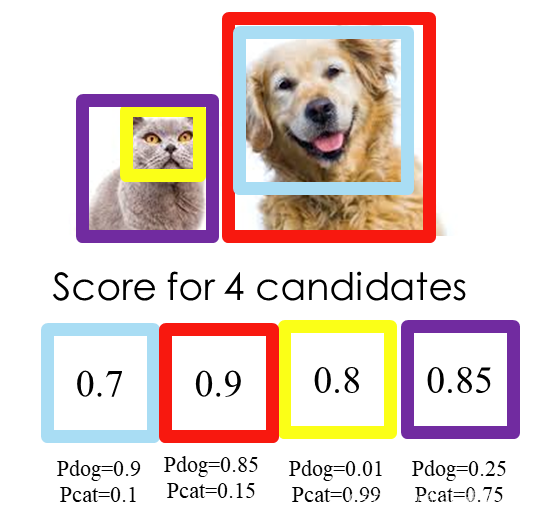

前面的范例一是标准的NMS程序，这边要搭配一下分类来看，范例二和标准NMS做法一样，先将「确定是物件集合」选出来，此例是NMS选出的BBox是{紫色BBox ; 红色BBox}。

这时候再搭配一下分类的机率，就可以把每个NMS选出的BBox做类别判断了(如下图，每个BBox都会带有一组机率)

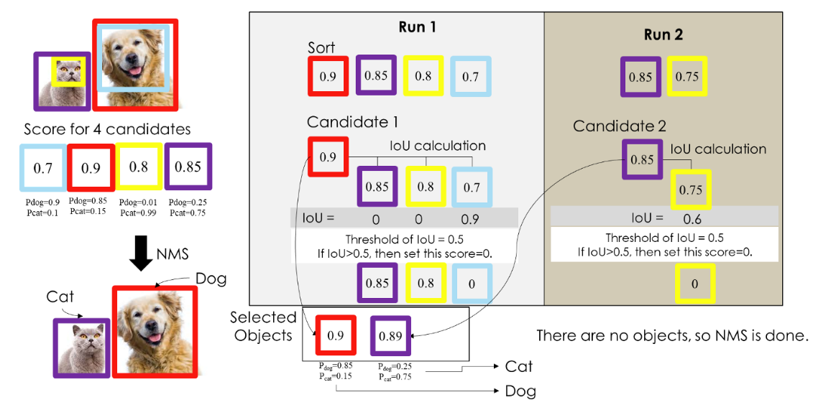

这边附上实际做法，先用一个阈值先初步去掉一些候选的BBox，不然假设一张图预选出一万个BBox，后面用CPU计算NMS会很花时间，所以会依据BBox的confidence score先去掉一些没用的BBox，然后再做NMS，如下图

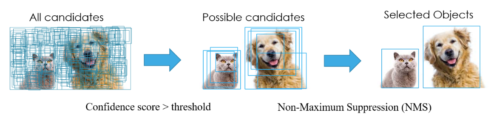

> 如果是two stage算法，通常在选出BBox只会带有BBox中心位置 $ (x,y) $、BBox长宽 $ (h, w) $ 和confidence score，不会有类别的机率，因为程序是先选出BBox，在将选出BBox的feature map做rescale (一般用ROI pooling)，然后再用分类器分类。
> 但如果是one stage算法，是直接BBox带有BBox中心位置 $ (x,y) $、BBox长宽 $ (h,w) $ 和confidence score，以及相对应的分类机率，相对于two stage少了后面rescale和分类的程序，所以计算量相对小。

虽然NMS可以处理掉较多的冗余框，但传统的NMS存在以下局限性：

- 循环步骤，GPU难以并行处理，运算效率低
- 以分类置信度为优先衡量指标 分类置信度高的定位不一定最准，降低了模型的定位准确度
- 直接提高阈值暴力去除bbox 将得分较低的边框强制性地去掉，如果物体出现较为密集时，本身属于两个物体的边框，其中得分较低的框就很有可能被抑制掉，从而降低了模型的召回率，且阈值设定完全依赖自身经验。

### 9.4 Soft-NMS（ICCV2017）

- **NMS设定的局限性**显然，对于`IoU≥NMS`阈值的相邻框，传统`NMS`的做法是将其得分暴力置0，相当于被舍弃掉了，这就有可能造成边框的漏检，尤其是有遮挡的场景。
- **Soft-NMS解决方案**对`IoU`大于阈值的边框，`Soft-NMS`采取得分惩罚机制，降低该边框的得分，即使用一个与`IoU`正相关的惩罚函数对得分进行惩罚。当邻居检测框b与当前框M有大的`IoU`时，它更应该被抑制，因此分数更低。而远处的框不受影响。

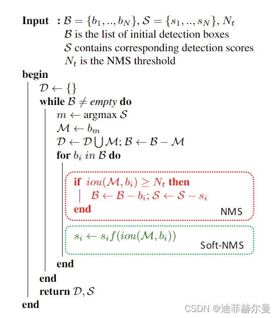

> 从实验结果来看的话，soft-NMS(红色）能够比较好的缓解掉传统NMS（蓝色）暴力剔除所带来的物体遮挡漏检情况。

**Soft-NMS的类型**

52. 线性衰减型（不连续，会发生跳变，导致检测结果产生较大的波动）；
53. 指数高斯型（更为稳定、连续、光滑）

**Soft-NMS的局限性**

54. 仍采用循环遍历处理模式，而且它的运算效率比`Traditional NMS`更低。
55. 对双阶段算法友好，但在一些单阶段算法上可能失效。（所以看`soft-NMS`论文时会发现它只在two-stage模型上比较，可能是因为one-stage模型在16年才提出来，之后才开始大火）`soft-NMS`也是一种贪心算法，并不能保证找到全局最优的检测框分数重置。
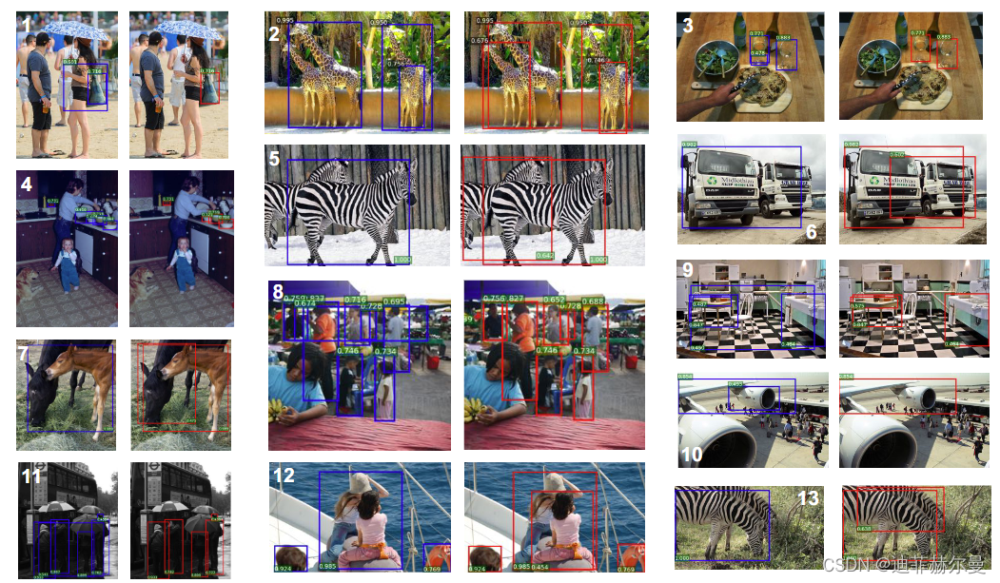
56. 遮挡情况下，如果存在location与分类置信度不一致的情况，则可能导致location好而分类置信度低的框比location差分类置信度高的框惩罚更多
57. 评判指标是`IoU`，即只考虑两个框的重叠面积，这对描述box重叠关系或许不够全面。

### 9.5 Weighted-NMS(ICMEW2017)

如果前面讲的`Soft NMS`是通过抑制机制来改善剔除结果（降低超阈值的得分策略），那么`Weighted NMS(W-NMS)`则是从极大值这个方面进行改进。`W-NMS`认为`Traditional NMS`每次迭代所选出的最大得分框未必是精确定位的，冗余框也有可能是定位良好的。因此，`W-NMS`通过分类置信度与`IoU`来对同类物体所有的边框坐标进行加权平均，并归一化。其中，加权平均的对象包括M自身以及`IoU≥NMS`阈值的相邻框。

- **优点**：`Weighted NMS`通常能够获得更高的Precision和Recall，一般来说，只要`NMS`阈值选取得当，`Weighted NMS`均能稳定提高AP与AR。
- **缺点**：
（1）仍为顺序处理模式，且运算效率比`Traditional NMS`更低。
（2）加权因子是`IoU`与得分，前者只考虑两个框的重叠面积；而后者受到定位与得分不一致问题的限制。

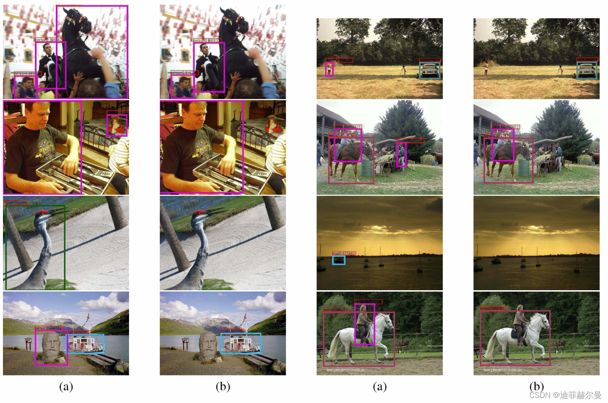

### 9.6 分类置信度优先NMS总结

`NMS`、`Soft-NMS`及`Weighted NMS`的局限性：

- 都是以分类置信度优先的`NMS`，未考虑定位置信度，即没有考虑定位与分类得分可能出现不一致的情况，特别是框的边界有模棱两可的情形时。
- 采用的都是传统的`IoU`，只考虑两包围盒子之间的重叠率，未能充分反映两包围盒子之间相对位置关系。

### 9.7 IOU-Guided NMS(ECCV2018)

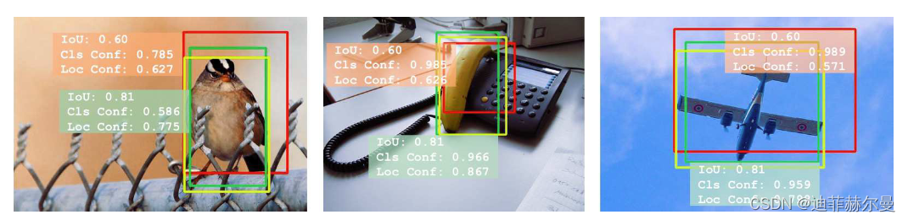

前面所提到的`NMS`方法只将分类的预测值作为边框排序的依据。然而在某些场景下，分类预测值高的边框不一定拥有与真实框最接近的位置，因此这种标准不平衡可能会导致更为准确的边框被抑制掉。

**之前NMS的局限性：**

- **分类准确率和定位准确率的误匹配**：从左下图看，`IoU`与定位置信度高度相关（0.617），而与分类置信度几乎无关（0.217）。
- **边界框回归的非单调性与非可解释性**：缺乏localization confidence使得被广泛使用的边界框回归方法缺少可解释性或可预测性。先前的工作曾指出bounding box迭代回归的非单调性，也就是说，应用多次之后bounding box回归可能有损bounding box定位表现。

在此背景下，旷视IoU-Net论文提出了`IoU-Guided NMS`，即一个预测框与真实框`IoU`的预测分支来学习定位置信度，进而使用定位置信度来引导`NMS`的学习。具体来说，就是使用定位置信度作为`NMS`的筛选依据，每次迭代挑选出最大定位置信度的框M，然后将`IoU≥NMS`阈值的相邻框剔除，但把冗余框及其自身的最大分类得分直接赋予M。因此，最终输出的框必定是同时具有最大分类得分与最大定位置信度的框。

**IOU-Guided NMS优点：**

- 通过该预测分解决了`NMS`过程中分类置信度与定位置信度之间的不一致，可以与当前的物体检测框架一起端到端地训练，在几乎不影响前向速度的前提下，有效提升了物体检测的精度。
- `IoU-Guided NMS`有助于提高严格指标下的精度，如AP75, AP90。（在`IoU`阈值较高时`IoU-guided NMS`算法的优势还是比较明显的（比如AP90），原因就在于`IoU`阈值较高时需要预测框的坐标更加准确才能有较高的`AP`值，这正好和`IoU-guided NMS`的出发点吻合。）

**IoU-Guided NMS缺点：**

- 顺序处理的模式，运算效率与`Traditional NMS`相同。
- 需要额外添加`IoU`预测分支，造成计算开销。
- 评判标准为`IoU`，即只考虑两个框的重叠面积。

### 9.8 Softer NMS(CVPR2019)

**总体概览**从`Softer-NMS`的公式来看，`Softer-NMS`可以看成是前面三种`NMS`变体的结合，即：其极大值的选择/设定采用了与类似`Weighted NMS`（加权平均）的方差加权平均操作，其加权的方式采用了类似`Soft NMS`的评分惩罚机制（受`Soft-NMS`启发，离得越近，不确定性越低，会分配更高的权重），最后，它的网络构建思路与`IOU-Guided NMS`相类似。

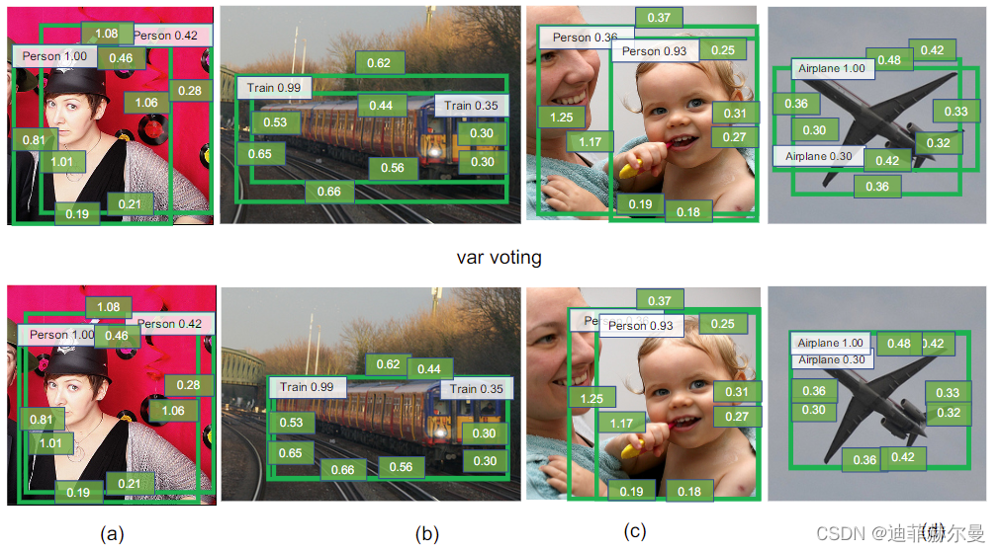

**与**`**IOU-Guided NMS**`**区别**`Softer-NMS`与`IOU-Guided NMS`的出发点同样是解决定位与分类置信度之间非正相关的问题，所采用的思路一样是增加一个定位置信度的预测，但不一样的是前面提到的`IoU-Guided NMS`采用`IoU`作为定位置信度来优先排序，而这里`Softer-NMS`则是通过定位分布的方差来拉近预测边框与真实物体分布，即`IoU-Guided NMS`采用`IoU`作为定位置信度而`Softer-NMS`采用坐标方差作为定位置信度，具体的做法就是通过KL散度来判别两个分布的相似性。

其中，`Softer NMS`论文中有两个先验假设：

（1）Bounding box的是高斯分布

（2）ground truth bounding box是狄拉克delta分布（即标准方差为0的高斯分布极限）。

**Softer-NMS的优点**：

- 增加了定位置信度的预测，是定位回归更加准确与合理。
- 使用便捷，可以与`Traditional NMS`或`Soft-NMS`结合使用，得到更高的`AP`与`AR`。

**Softer-NMS的缺点**：

- 顺序处理模式，且运算效率比`Traditional NMS`更低。
- 额外增加了定位置信度预测的支路来预测定位方差，造成计算开销。
- 评判标准是`IoU`，即只考虑两个框的重叠面积，这对描述box重叠关系或许不够全面。

### 9.9 Adaptive NMS(CVPR2019)

**背景**`Adaptive NMS`是在行人检测问题上来对`Soft NMS`改进的一种自适应阈值处理方法（即在软化得分的前提下继续软化阈值）。行人检测任务中，一个最大的问题就是目标在常规场景下一般处于密集状态。如何在解决密集检测以及密集检测之中目标之间相互遮挡的问题是行人检测的一大问题。在以往的研究中，`NMS`都采用单一阈值的处理方式。使用单一阈值的`NMS`会面临以下困境：较低的阈值会导致丢失高度重叠的对象（图中蓝框是未检测出来的目标），而较高的阈值会导致更多的误报（红框是检测错误的目标）。

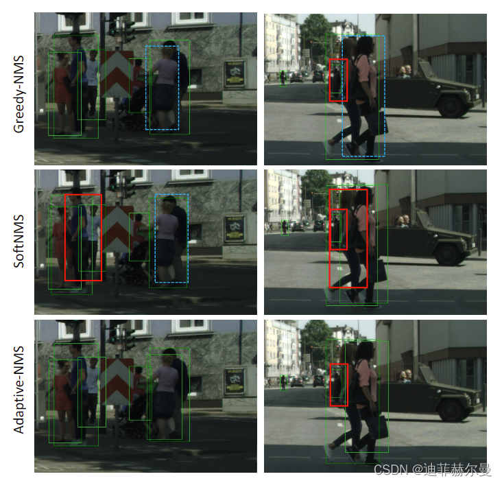

所以，在密集检测场景中，我们希望：（1）在目标密集时，可以使用较大的阈值以保证更高的召回率；（2）在目标稀疏时，可以使用较小的阈值来剔除掉更多冗余的检测框。

**思路与方法**基于上述背景，`Adaptive NMS`应用了动态抑制策略，通过设计计了一个Density-subnet网络预测目标周边的密集和稀疏的程度，引入密度监督信息，使阈值随着目标周边的密稀程度而对应呈现上升或衰减。具体做法：

- 当邻框远离M时（即`IoU<Nt`），保持si不变；对于远离M的检测框，它们被误报的可能性较小，因此应该保留它们。
- 对于高度重叠的相邻检测，抑制策略不仅取决于与M的重叠，还取决于M是否位于拥挤区域。
    - 当M处于密集区域时（即`Nm>Nt`），目标密度dM作为NMS的抑制阈值；若M处于密集区域，其高度重叠的相邻框很可能是另一目标的真正框，因此，应该分配较轻的惩罚或保留。
    - 当M处于稀疏区域时（即`Nm≤Nt`），初始阈值Nt作为`NMS`的抑制阈值。若M处于稀疏区域，惩罚应该更高以修剪误报。

**Adaptive NMS优点：**

58. 可以与前面所述的各种`NMS`结合使用。
59. 对遮挡案例更加友好。
60. 双阶段和单阶段的检测器都有效果。（CVPR2019 Oral）

**Adaptive NMS缺点：**

61. 与`Soft-NMS`结合使用，效果可能倒退 (受低分检测框的影响)。
62. 顺序处理模式，运算效率低。
63. 需要额外添加密度预测模块，造成计算开销。
64. 评判标准是`IoU`，即只考虑两个框的重叠面积，这对描述box重叠关系或许不够全面。

### 9.10 DIOU-NMS(AAAI2020)

在以往的`NMS`中使用的评判指标都是`IoU`，但就像前面对`IoU`的介绍，`IoU`虽然简单直观，但它只考虑两个框的重叠面积（比如下图第一种相比于第三种越不太可能是冗余框）。因此，后面研究相继耶提出了许多`IoU`变体来使两框之间的相对位置关系描述更加准确。比如`DIoU-NMS`就直接将`IoU`指标换为`DIoU`。当然结合前面对`IoU`的介绍，这种换掉`IoU`指标的`NMS`变体也可以有很多。

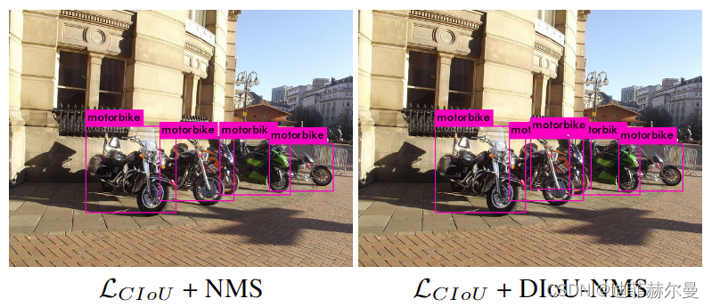

**DIOU-NMS优点**：

65. 从几何直观的角度，将中心点考虑进来有助于缓解遮挡案例。
66. 可以与前述`NMS`变体结合使用。
67. 保持`NMS`阈值不变的情况下，必然能够获得更高`recall` (因为保留的框增多了)。

**DIOU-NMS缺点**:

顺序处理模式，计算更复杂，运算效率更低。

### 9.11 NMS总结

实际上`NMS`的变体不止上面提到的方法，还有其他的变体，比如从文本场景中，`NMS`变体主要是一种基于shape的改变；而在遥感等实时场景中，`NMS`变体主要是加速策略的改变，提高的的计算效率。

从以上`NMS`的介绍，可以看出：目前，`NMS`对传统`NMS`算法的改进主要是从极大值的选择机制，抑制冗余框的机制，`IoU`的评价指标，`anchor`的形态、位置及其所处的环境（周边的密度）等方面来进行优化。虽然`NMS`算法一直在不断的优化，但未来更主流的方式是`NMS-free`。

## 10. 目标检测的标注工具

### 10.1 Labelme

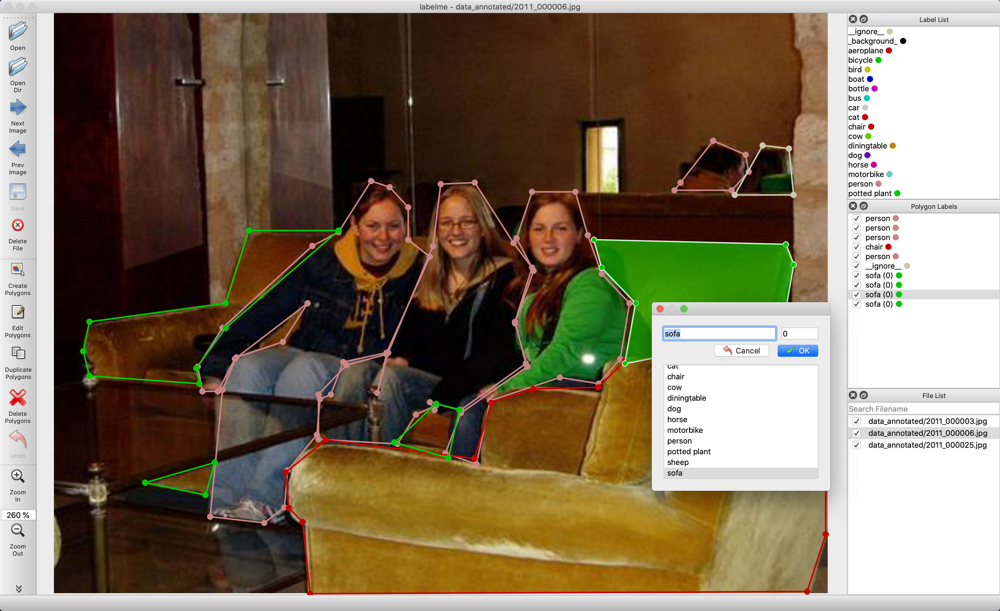

labelme 是一款开源的图像/视频标注工具，标签可用于目标检测、分割和分类。灵感是来自于 MIT 开源的一款标注工具 LabelMe。labelme 具有的特点是：

- 支持图像的标注的组件有：矩形框，多边形，圆，线，点（rectangle, polygons, circle, lines, points）
- 支持视频标注
- GUI 自定义
- 支持导出 VOC 格式用于 semantic/instance segmentation
- 支出导出 COCO 格式用于 instance segmentation

项目地址：[https://github.com/wkentaro/labelme](https://github.com/wkentaro/labelme)

### 10.2 LabelImg

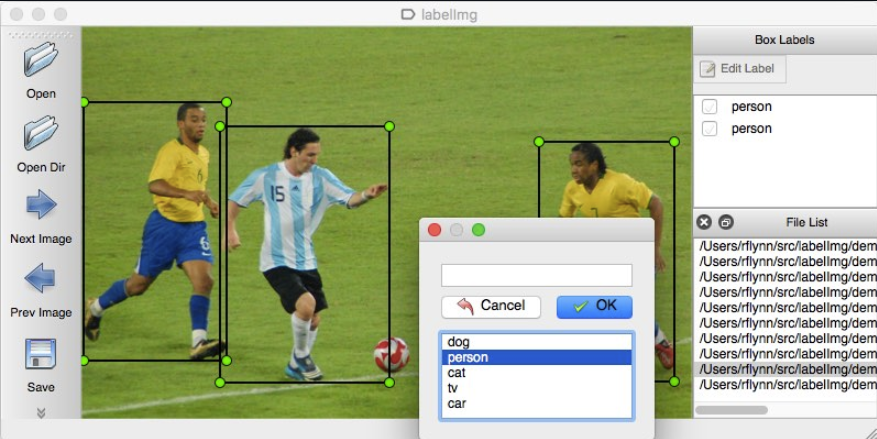

LabelImg是一个图形化的图像注释工具。它是用Python编写的，使用Qt作为其图形界面。注释被保存为PASCAL VOC格式的XML文件，该格式被ImageNet使用。此外，它还支持YOLO和Create ML格式。LabelImg是由Tzutalin在几十位贡献者的帮助下创建的流行的图像注释工具，现在已经不再积极开发，并成为Label Studio社区的一部分。

项目地址：[https://github.com/heartexlabs/labelImg](https://github.com/heartexlabs/labelImg)

### 10.3 roLabelImg

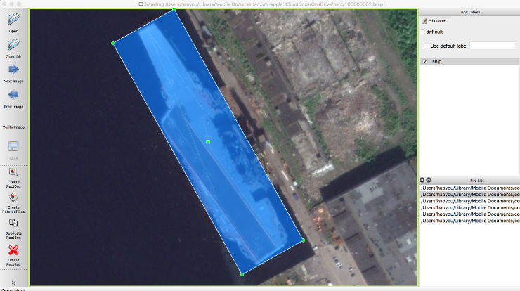

roLabelImg是在labelImg的基础上开发的，新增了旋转矩形的标注功能。对于旋转矩形的标签新增了一个angle参数来表示旋转矩形旋转的角度。

项目地址：[https://github.com/cgvict/roLabelImg](https://github.com/cgvict/roLabelImg)

### 10.4 Label Studio

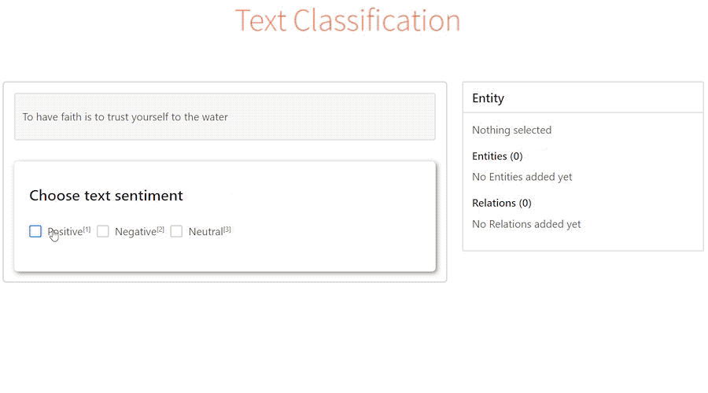

Label Studio是一个开源的数据标签工具。它可以让你用一个简单明了的用户界面对音频、文本、图像、视频和时间序列等数据类型进行标注，并导出为各种模型格式。它可以用来准备原始数据或改进现有的训练数据以获得更准确的ML模型。

### 10.5 CVAT

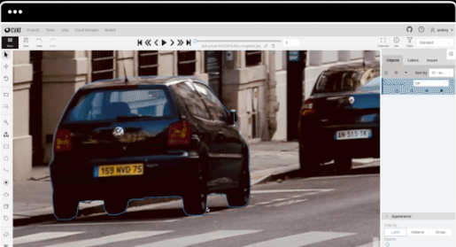

CVAT 是一款开源的基于网络的交互式视频/图像标注工具，是对加州视频标注工具（Video Annotation Tool） 项目的重新设计和实现。OpenCV团队正在使用该工具来标注不同属性的数百万个对象，许多 UI 和 UX 的决策都基于专业数据标注团队的反馈。具有的功能

- 关键帧之间的边界框插值
- 自动标注（使用TensorFlow OD API 和 Intel OpenVINO IR格式的深度学习模型）

项目地址：[https://github.com/opencv/cvat](https://github.com/opencv/cvat)

### 10.6 VIA

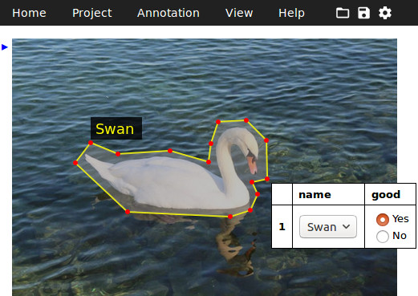

VGG图像注释器是一个简单而独立的图像、音频和视频手动注释软件。VIA在网络浏览器中运行，不需要任何安装或设置。完整的VIA软件包含在一个独立的HTML页面中，大小不到400KB，可以作为一个离线应用程序在大多数现代网络浏览器中运行。VIA是一个完全基于HTML、Javascript和CSS的开源项目（不依赖外部库）。VIA是由Visual Geometry Group (VGG)开发的，在BSD-2条款许可下发布，这使得它对学术项目和商业应用都有用。

项目地址：[https://github.com/ox-vgg/via](https://github.com/ox-vgg/via)

### 10.7 ScaLabel

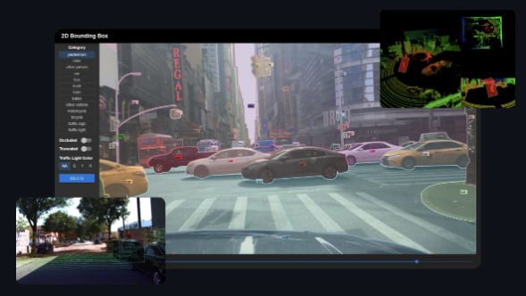

Scalabel是一个多功能且可扩展的注释平台，支持2D和3D数据标记。[BDD100K](https://www.bdd100k.com/) 使用此工具进行标记。

项目地址：[https://github.com/scalabel/scalabel](https://github.com/scalabel/scalabel)

### 10.8 RectLabel

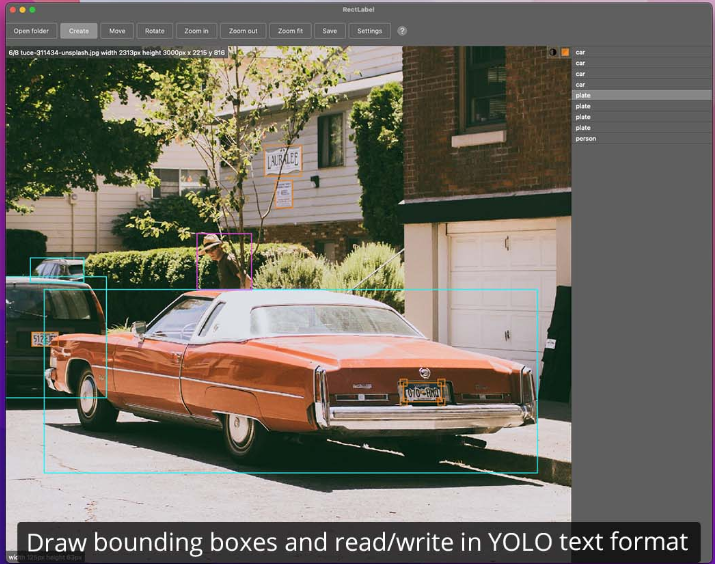

RectLabel 是一款在线免费图像标注工具，标签可用于目标检测、分割和分类。具有的功能或特点：

- 可用的组件：矩形框，多边形，三次贝塞尔曲线，直线和点，画笔，超像素
- 可只标记整张图像而不绘制
- 可使用画笔和超像素
- 导出为YOLO，KITTI，COCO JSON和CSV格式
- 以PASCAL VOC XML格式读写
- 使用Core ML模型自动标记图像
- 将视频转换为图像帧

项目地址：[http://rectlabel.com/](http://rectlabel.com/)

### 10.9 MakeSense

makesense是一个免费使用的在线图像标注工具。由于使用浏览器，它不需要任何复杂的安装–只要访问网站，就可以开始使用。它是小型计算机视觉深度学习项目的完美选择，使准备数据集的过程更加简单和快速。准备好的标签可以以多种支持的格式下载。该应用程序是用TypeScript编写的，基于React/Redux duo。上手难度非常低，仅需数分钟，玩家便能熟练掌握工作台中的功能选项，快速地进入工作状态；此外，由于make-sense是一款web应用，各个操作系统的玩家可打破次元壁实现工作协同。

项目地址：[https://github.com/SkalskiP/make-sense](https://github.com/SkalskiP/make-sense)

### 10.10 Roboflow

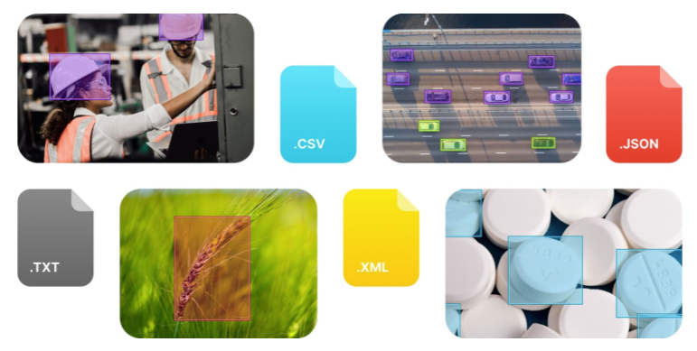

Roboflow是YOLOv5推荐的标注工具，具有的功能或特点：

- 对图像进行标注或上传现有的标注。
- 将现有的VOC XML注解转换为COCO JSON注解 。
- 查看标签是否在画面中（如果不在画面中，可以一键纠正）。
- 创建自定义格式。
- 预处理图像：调整大小、灰度、自动调整方向、对比度调整 。
- 数据增强：翻转、旋转、变亮/变暗、裁剪、剪切，模糊，并添加随机噪音等。
- 快速评估你的数据集质量 。
- 与你的团队分享版本控制的数据集 。

项目地址：[https://roboflow.com/](https://roboflow.com/)
